# Benchmarking genomic pipelines - quality - results

## Table of contents

- [Benchmarking genomic pipelines - quality - results](#benchmarking-genomic-pipelines---quality---results)
  - [Table of contents](#table-of-contents)
  - [Known vcf](#known-vcf)
  - [intra_truth_comparison](#intra_truth_comparison)
    - [Run parameters/settings](#run-parameterssettings)
    - [Results](#results)
        - [Compared with bedtools intersect](#compared-with-bedtools-intersect)
        - [Compared with hap.py](#compared-with-happy)
  - [quality_bench1.0](#quality_bench10)
    - [Run parameters/settings](#run-parameterssettings-1)
    - [Results](#results-1)
      - [human_genomics_pipeline + minimal vcf_annotation_pipeline](#human_genomics_pipeline--minimal-vcf_annotation_pipeline)
        - [Compared with bedtools intersect](#compared-with-bedtools-intersect-1)
        - [Compared with hap.py](#compared-with-happy-1)
      - [parabricks germline pipeline](#parabricks-germline-pipeline)
        - [Compared with bedtools intersect](#compared-with-bedtools-intersect-2)
        - [Compared with hap.py](#compared-with-happy-2)
  - [quality_bench1.1](#quality_bench11)
    - [Run parameters/settings](#run-parameterssettings-2)
    - [Results](#results-2)
      - [human_genomics_pipeline + minimal vcf_annotation_pipeline](#human_genomics_pipeline--minimal-vcf_annotation_pipeline-1)
        - [Compared with bedtools intersect](#compared-with-bedtools-intersect-3)
        - [Compared with hap.py](#compared-with-happy-3)
  - [quality_bench1.2](#quality_bench12)
    - [Run parameters/settings](#run-parameterssettings-3)
    - [Results](#results-3)
      - [human_genomics_pipeline + minimal vcf_annotation_pipeline](#human_genomics_pipeline--minimal-vcf_annotation_pipeline-2)
        - [Compared with bedtools intersect](#compared-with-bedtools-intersect-4)
        - [Compared with hap.py](#compared-with-happy-4)
  - [quality_bench1.3](#quality_bench13)
    - [Run parameters/settings](#run-parameterssettings-4)
    - [Results](#results-4)
      - [human_genomics_pipeline + minimal vcf_annotation_pipeline](#human_genomics_pipeline--minimal-vcf_annotation_pipeline-3)
        - [Compared with bedtools intersect](#compared-with-bedtools-intersect-5)
        - [Compared with hap.py](#compared-with-happy-5)
  - [quality_bench1.4](#quality_bench14)
    - [Run parameters/settings](#run-parameterssettings-5)
    - [Results](#results-5)
      - [human_genomics_pipeline + minimal vcf_annotation_pipeline](#human_genomics_pipeline--minimal-vcf_annotation_pipeline-4)
        - [Compared with hap.py](#compared-with-happy-6)
      - [parabricks germline pipeline](#parabricks-germline-pipeline-1)
        - [Compared with hap.py](#compared-with-happy-7)
  - [quality_bench1.5](#quality_bench15)
    - [Run parameters/settings](#run-parameterssettings-6)
    - [Results](#results-6)
      - [no pipeline (intra_truth_comparison re-run)](#no-pipeline-intra_truth_comparison-re-run)
      - [human_genomics_pipeline + minimal vcf_annotation_pipeline (quality_bench1.0 re-run)](#human_genomics_pipeline--minimal-vcf_annotation_pipeline-quality_bench10-re-run)
      - [parabricks germline pipeline (quality_bench1.0 re-run)](#parabricks-germline-pipeline-quality_bench10-re-run)
      - [human_genomics_pipeline + minimal vcf_annotation_pipeline (quality_bench1.1 re-run)](#human_genomics_pipeline--minimal-vcf_annotation_pipeline-quality_bench11-re-run)
      - [human_genomics_pipeline + minimal vcf_annotation_pipeline (quality_bench1.2 re-run)](#human_genomics_pipeline--minimal-vcf_annotation_pipeline-quality_bench12-re-run)
      - [human_genomics_pipeline + minimal vcf_annotation_pipeline (quality_bench1.3 re-run)](#human_genomics_pipeline--minimal-vcf_annotation_pipeline-quality_bench13-re-run)
      - [human_genomics_pipeline + minimal vcf_annotation_pipeline (quality_bench1.4 re-run)](#human_genomics_pipeline--minimal-vcf_annotation_pipeline-quality_bench14-re-run)
      - [parabricks germline pipeline (quality_bench1.4 re-run)](#parabricks-germline-pipeline-quality_bench14-re-run)
  - [quality_bench1.6](#quality_bench16)
    - [Run parameters/settings](#run-parameterssettings-7)
    - [Results](#results-7)
      - [human_genomics_pipeline + minimal vcf_annotation_pipeline](#human_genomics_pipeline--minimal-vcf_annotation_pipeline-5)
        - [Compared with hap.py](#compared-with-happy-8)
  - [quality_bench1.7](#quality_bench17)
    - [Run parameters/settings](#run-parameterssettings-8)
    - [Results](#results-8)
      - [human_genomics_pipeline + minimal vcf_annotation_pipeline](#human_genomics_pipeline--minimal-vcf_annotation_pipeline-6)

## Known vcf

Parameters used to create the Genome In A Bottle (GIAB) sample [NA12878](https://ftp-trace.ncbi.nlm.nih.gov/ReferenceSamples/giab/data/NA12878/Garvan_NA12878_HG001_HiSeq_Exome/) (both NIST7035 and NIST7086) known vcf file:

- **Inputs:**
  - Reference genome: ucsc.hg19.fasta
  - dbSNP database: dbsnp_137.hg19.vcf

## intra_truth_comparison

### Run parameters/settings

- **Aim:** Compare the two 'samples' of the Genome In A Bottle (GIAB) sample [NA12878](https://ftp-trace.ncbi.nlm.nih.gov/ReferenceSamples/giab/data/NA12878/Garvan_NA12878_HG001_HiSeq_Exome/) (NIST7035 and NIST7086)

### Results

Results dir: /store/lkemp/exome_project/benchmarking_quality/NA12878_exome/intra_truth_comparison/ (wintermute)

##### Compared with bedtools intersect

| file                                                                                   | count   | type                                               |
|----------------------------------------------------------------------------------------|---------|----------------------------------------------------|
| common_project.NIST.hc.snps.indels.NIST7035_v_project.NIST.hc.snps.indels.NIST7086.vcf | 237,338 | Common                                             |
| unique_project.NIST.hc.snps.indels.NIST7035.vcf                                        | 99,141  | Unique to project.NIST.hc.snps.indels.NIST7035.vcf |
| unique_project.NIST.hc.snps.indels.NIST7086.vcf                                        | 80,661  | Unique to project.NIST.hc.snps.indels.NIST7086.vcf |

##### Compared with hap.py

- NIST7035 ('baseline') compared to NIST7086 ('truth')

| Type  | Filter | TRUTH.TOTAL | TRUTH.TP | TRUTH.FN | QUERY.TOTAL | QUERY.FP | QUERY.UNK | FP.gt | FP.al | METRIC.Recall | METRIC.Precision | METRIC.Frac_NA | METRIC.F1_Score | TRUTH.TOTAL.TiTv_ratio | QUERY.TOTAL.TiTv_ratio | TRUTH.TOTAL.het_hom_ratio | QUERY.TOTAL.het_hom_ratio |
|-------|--------|-------------|----------|----------|-------------|----------|-----------|-------|-------|---------------|------------------|----------------|-----------------|------------------------|------------------------|---------------------------|---------------------------|
| INDEL | ALL    | 29465       | 26677    | 2788     | 29855       | 2816     | 110       | 2772  | 44    | 0.905379      | 0.905329         | 0.003684       | 0.905354        |                        |                        | 0.93563464                | 1.004317906               |
| INDEL | PASS   | 29465       | 26677    | 2788     | 29855       | 2816     | 110       | 2772  | 44    | 0.905379      | 0.905329         | 0.003684       | 0.905354        |                        |                        | 0.93563464                | 1.004317906               |
| SNP   | ALL    | 207256      | 194644   | 12612    | 207307      | 12615    | 0         | 12603 | 12    | 0.939148      | 0.939148         | 0              | 0.939148        | 2.101499147            | 2.101166617            | 0.702357185               | 0.720801056               |
| SNP   | PASS   | 207256      | 194644   | 12612    | 207307      | 12615    | 0         | 12603 | 12    | 0.939148      | 0.939148         | 0              | 0.939148        | 2.101499147            | 2.101166617            | 0.702357185               | 0.720801056               |

- NIST7086 ('baseline') compared to NIST7035 ('truth')

| Type  | Filter | TRUTH.TOTAL | TRUTH.TP | TRUTH.FN | QUERY.TOTAL | QUERY.FP | QUERY.UNK | FP.gt | FP.al | METRIC.Recall | METRIC.Precision | METRIC.Frac_NA | METRIC.F1_Score | TRUTH.TOTAL.TiTv_ratio | QUERY.TOTAL.TiTv_ratio | TRUTH.TOTAL.het_hom_ratio | QUERY.TOTAL.het_hom_ratio |
|-------|--------|-------------|----------|----------|-------------|----------|-----------|-------|-------|---------------|------------------|----------------|-----------------|------------------------|------------------------|---------------------------|---------------------------|
| INDEL | ALL    | 29467       | 26682    | 2785     | 29849       | 2806     | 109       | 2767  | 39    | 0.905487      | 0.905649         | 0.003652       | 0.905568        |                        |                        | 0.961824827               | 0.976642044               |
| INDEL | PASS   | 29467       | 26682    | 2785     | 29849       | 2806     | 109       | 2767  | 39    | 0.905487      | 0.905649         | 0.003652       | 0.905568        |                        |                        | 0.961824827               | 0.976642044               |
| SNP   | ALL    | 207255      | 194643   | 12612    | 207307      | 12616    | 0         | 12604 | 12    | 0.939147      | 0.939143         | 0              | 0.939145        | 2.101641405            | 2.101009497            | 0.720383593               | 0.702762213               |
| SNP   | PASS   | 207255      | 194643   | 12612    | 207307      | 12616    | 0         | 12604 | 12    | 0.939147      | 0.939143         | 0              | 0.939145        | 2.101641405            | 2.101009497            | 0.720383593               | 0.702762213               |

## quality_bench1.0

### Run parameters/settings

- **Aim:** Benchmarking pipelines against the Genome In A Bottle (GIAB) sample [NA12878](https://ftp-trace.ncbi.nlm.nih.gov/ReferenceSamples/giab/data/NA12878/Garvan_NA12878_HG001_HiSeq_Exome/) (both NIST7035 and NIST7086) using the same input data were used to create the truth vcf and using the default pipeline settings

- **Pipelines:**
  - [human_genomics_pipeline](https://github.com/ESR-NZ/human_genomics_pipeline) + minimal [vcf_annotation_pipeline](https://github.com/ESR-NZ/vcf_annotation_pipeline) (no annotation) an
  - [parabricks germline pipeline](https://www.nvidia.com/en-us/docs/parabricks/germline/)

- **Inputs human_genomics_pipeline:**
  - ucsc.hg19.fasta
  - dbsnp_138.hg19.vcf

- **Inputs vcf_annotation_pipeline:**
  - ucsc.hg19.fasta
  - dbsnp_138.hg19.vcf
  - hapmap_3.3.hg19.sites.vcf.gz
  - Mills_and_1000G_gold_standard.indels.hg19.sites.vcf.gz
  
- **Inputs for parabricks germline pipeline:**
  - ucsc.hg19.fasta
  - dbsnp_138.hg19.vcf

- **Other settings:**
  - No padding
  - No intervals
  - 2D model with pre-trained architecture (for rule gatk CNNScoreVariants)
  - SNP tranches: 99.95 (for rule gatk4_FilterVariantTranches)
  - Indel tranches: 99.40 (for rule gatk4_FilterVariantTranches)

*Note. dbsnp_137.hg19.vcf doesn't appear to be available anymore, therefore I used the closest version available*

(see run settings/output for [human_genomics_pipeline - quality_bench1.0](https://github.com/ESR-NZ/human_genomics_pipeline/tree/quality_bench1.0), [vcf_annotation_pipeline - quality_bench1.0](https://github.com/ESR-NZ/vcf_annotation_pipeline/tree/quality_bench1.0) and [parabricks - quality_bench1.0](https://github.com/ESR-NZ/ESR-Parabricks/tree/quality_bench1.0) for more detail)

### Results

Results dir: /store/lkemp/exome_project/benchmarking_quality/NA12878_exome/quality_bench1.0/ (wintermute)

#### human_genomics_pipeline + minimal vcf_annotation_pipeline

##### Compared with bedtools intersect

- NIST7035

| file                                                                     | count   | type                                               |
|--------------------------------------------------------------------------|---------|----------------------------------------------------|
| common_NIST7035_NIST_filtered_v_project.NIST.hc.snps.indels.NIST7035.vcf | 188,127 | Common                                             |
| unique_NIST7035_NIST_filtered.vcf                                        | 280,797 | Unique to h_g_p + v_a_p output                     |
| unique_project.NIST.hc.snps.indels.NIST7035.vcf                          | 148,216 | Unique to known vcf                                |

- NIST7086

| file                                                                     | count   | type                                               |
|--------------------------------------------------------------------------|---------|----------------------------------------------------|
| common_NIST7086_NIST_filtered_v_project.NIST.hc.snps.indels.NIST7086.vcf | 190,599 | Common                                             |
| unique_NIST7086_NIST_filtered.vcf                                        | 311,418 | Unique to h_g_p + v_a_p output                     |
| unique_project.NIST.hc.snps.indels.NIST7086.vcf                          | 127,323 | Unique to known vcf                                |

##### Compared with hap.py

*Note: 'PASS' indicates a snp in a tranche below 99.95 and an indel in a tranche below 99.40*

- NIST7035

| Type  | Filter | TRUTH.TOTAL | TRUTH.TP | TRUTH.FN | QUERY.TOTAL | QUERY.FP | QUERY.UNK | FP.gt | FP.al | METRIC.Recall | METRIC.Precision | METRIC.Frac_NA | METRIC.F1_Score | TRUTH.TOTAL.TiTv_ratio | QUERY.TOTAL.TiTv_ratio | TRUTH.TOTAL.het_hom_ratio | QUERY.TOTAL.het_hom_ratio |
|-------|--------|-------------|----------|----------|-------------|----------|-----------|-------|-------|---------------|------------------|----------------|-----------------|------------------------|------------------------|---------------------------|---------------------------|
| INDEL | ALL    | 29473       | 20889    | 8584     | 57705       | 1684     | 34942     | 687   | 848   | 0.70875       | 0.92602          | 0.605528       | 0.802947        |                        |                        | 0.935843514               | 0.530099933               |
| INDEL | PASS   | 29473       | 20226    | 9247     | 56456       | 1597     | 34445     | 679   | 780   | 0.686255      | 0.927445         | 0.610121       | 0.788826        |                        |                        | 0.935843514               | 0.498892595               |
| SNP   | ALL    | 207268      | 163391   | 43877    | 411540      | 1985     | 246129    | 1112  | 372   | 0.788308      | 0.988            | 0.598068       | 0.876929        | 2.101415235            | 1.423485638            | 0.702447561               | 0.362133473               |
| SNP   | PASS   | 207268      | 161764   | 45504    | 408910      | 1908     | 245202    | 1082  | 347   | 0.780458      | 0.988345         | 0.599648       | 0.872185        | 2.101415235            | 1.422810364            | 0.702447561               | 0.35380422                |

- NIST7086

| Type  | Filter | TRUTH.TOTAL | TRUTH.TP | TRUTH.FN | QUERY.TOTAL | QUERY.FP | QUERY.UNK | FP.gt | FP.al | METRIC.Recall | METRIC.Precision | METRIC.Frac_NA | METRIC.F1_Score | TRUTH.TOTAL.TiTv_ratio | QUERY.TOTAL.TiTv_ratio | TRUTH.TOTAL.het_hom_ratio | QUERY.TOTAL.het_hom_ratio |
|-------|--------|-------------|----------|----------|-------------|----------|-----------|-------|-------|---------------|------------------|----------------|-----------------|------------------------|------------------------|---------------------------|---------------------------|
| INDEL | ALL    | 29475       | 21439    | 8036     | 62207       | 1750     | 38823     | 744   | 883   | 0.727362      | 0.925163         | 0.624094       | 0.814424        |                        |                        | 0.961967923               | 0.537195213               |
| INDEL | PASS   | 29475       | 20764    | 8711     | 60928       | 1658     | 38312     | 735   | 812   | 0.704461      | 0.926689         | 0.628808       | 0.800437        |                        |                        | 0.961967923               | 0.507733625               |
| SNP   | ALL    | 207264      | 165322   | 41942    | 440207      | 1947     | 272906    | 1187  | 339   | 0.79764       | 0.988362         | 0.619949       | 0.882818        | 2.101558993            | 1.419227578            | 0.720450017               | 0.3631554                 |
| SNP   | PASS   | 207264      | 163448   | 43816    | 437144      | 1872     | 271792    | 1151  | 327   | 0.788598      | 0.988679         | 0.621745       | 0.877376        | 2.101558993            | 1.418276144            | 0.720450017               | 0.354108053               |

#### parabricks germline pipeline

##### Compared with bedtools intersect

- NIST7035

| file                                                                     | count   | type                                               |
|--------------------------------------------------------------------------|---------|----------------------------------------------------|
| common_NIST7035_NIST_v_project.NIST.hc.snps.indels.NIST7035.vcf          | 188,161 | Common                                             |
| unique_NIST7035_NIST.vcf                                                 | 280,446 | Unique to parabricks output                        |
| unique_project.NIST.hc.snps.indels.NIST7035.vcf                          | 148,197 | Unique to known vcf                                |

- NIST7086

| file                                                                     | count   | type                                               |
|--------------------------------------------------------------------------|---------|----------------------------------------------------|
| common_NIST7086_NIST_v_project.NIST.hc.snps.indels.NIST7086.vcf          | 190,707 | Common                                             |
| unique_NIST7086_NIST.vcf                                                 | 311,598 | Unique to parabricks output                        |
| unique_project.NIST.hc.snps.indels.NIST7086.vcf                          | 127,260 | Unique to known vcf                                |

##### Compared with hap.py

- NIST7035

| Type  | Filter | TRUTH.TOTAL | TRUTH.TP | TRUTH.FN | QUERY.TOTAL | QUERY.FP | QUERY.UNK | FP.gt | FP.al | METRIC.Recall | METRIC.Precision | METRIC.Frac_NA | METRIC.F1_Score | TRUTH.TOTAL.TiTv_ratio | QUERY.TOTAL.TiTv_ratio | TRUTH.TOTAL.het_hom_ratio | QUERY.TOTAL.het_hom_ratio |
|-------|--------|-------------|----------|----------|-------------|----------|-----------|-------|-------|---------------|------------------|----------------|-----------------|------------------------|------------------------|---------------------------|---------------------------|
| INDEL | ALL    | 29473       | 20616    | 8857     | 54367       | 1153     | 32444     | 536   | 491   | 0.699488      | 0.947407         | 0.596759       | 0.804787        |                        |                        | 0.935843514               | 0.450247227               |
| INDEL | PASS   | 29473       | 20616    | 8857     | 54367       | 1153     | 32444     | 536   | 491   | 0.699488      | 0.947407         | 0.596759       | 0.804787        |                        |                        | 0.935843514               | 0.450247227               |
| SNP   | ALL    | 207268      | 163947   | 43321    | 414135      | 2033     | 248128    | 1158  | 375   | 0.79099       | 0.987754         | 0.599148       | 0.878489        | 2.101415235            | 1.42376204             | 0.702447561               | 0.360109056               |
| SNP   | PASS   | 207268      | 163947   | 43321    | 414135      | 2033     | 248128    | 1158  | 375   | 0.79099       | 0.987754         | 0.599148       | 0.878489        | 2.101415235            | 1.42376204             | 0.702447561               | 0.360109056               |

- NIST7086

| Type  | Filter | TRUTH.TOTAL | TRUTH.TP | TRUTH.FN | QUERY.TOTAL | QUERY.FP | QUERY.UNK | FP.gt | FP.al | METRIC.Recall | METRIC.Precision | METRIC.Frac_NA | METRIC.F1_Score | TRUTH.TOTAL.TiTv_ratio | QUERY.TOTAL.TiTv_ratio | TRUTH.TOTAL.het_hom_ratio | QUERY.TOTAL.het_hom_ratio |
|-------|--------|-------------|----------|----------|-------------|----------|-----------|-------|-------|---------------|------------------|----------------|-----------------|------------------------|------------------------|---------------------------|---------------------------|
| INDEL | ALL    | 29473       | 21269    | 8204     | 58506       | 1111     | 35951     | 511   | 495   | 0.721644      | 0.950743         | 0.614484       | 0.820501        |                        |                        | 0.961832578               | 0.458301072               |
| INDEL | PASS   | 29473       | 21269    | 8204     | 58506       | 1111     | 35951     | 511   | 495   | 0.721644      | 0.950743         | 0.614484       | 0.820501        |                        |                        | 0.961832578               | 0.458301072               |
| SNP   | ALL    | 207253      | 165941   | 41312    | 443676      | 1940     | 275768    | 1194  | 333   | 0.800669      | 0.988446         | 0.621553       | 0.884703        | 2.101533628            | 1.419960733            | 0.720358685               | 0.361391578               |
| SNP   | PASS   | 207253      | 165941   | 41312    | 443676      | 1940     | 275768    | 1194  | 333   | 0.800669      | 0.988446         | 0.621553       | 0.884703        | 2.101533628            | 1.419960733            | 0.720358685               | 0.361391578               |

## quality_bench1.1

### Run parameters/settings

- **Aim:** See if the quality of variants (tp, fp, fn) are different when variants are filtered using the 1D model with pre-trained architecture (for rule gatk CNNScoreVariants) compared to the 2D model (see description of these models [here](https://gatk.broadinstitute.org/hc/en-us/articles/360037226672-CNNScoreVariants))

- **Pipelines:**
  - [human_genomics_pipeline](https://github.com/ESR-NZ/human_genomics_pipeline) + minimal [vcf_annotation_pipeline](https://github.com/ESR-NZ/vcf_annotation_pipeline) (no annotation)

- **Inputs human_genomics_pipeline:**
  - ucsc.hg19.fasta
  - dbsnp_138.hg19.vcf

- **Inputs vcf_annotation_pipeline:**
  - ucsc.hg19.fasta
  - ddbsnp_138.hg19.vcf
  - hapmap_3.3.hg19.sites.vcf.gz
  - Mills_and_1000G_gold_standard.indels.hg19.sites.vcf.gz

- **Other settings:**
  - No padding
  - No intervals
  - :star: 1D model with pre-trained architecture (for rule gatk CNNScoreVariants) :star:
  - SNP tranches: 99.95 (for rule gatk4_FilterVariantTranches)
  - Indel tranches: 99.40 (for rule gatk4_FilterVariantTranches)

*Note. because the settings in the first pipeline (human_genomics_pipeline) was not changed in this quality_bench1.0 (just changes to settings in vcf_annotation_pipeline), I used the human_genomics_pipeline output from quality_bench1.0*

(see run settings/output for [human_genomics_pipeline - quality_bench1.1](https://github.com/ESR-NZ/human_genomics_pipeline/tree/quality_bench1.1) and [vcf_annotation_pipeline - quality_bench1.1](https://github.com/ESR-NZ/vcf_annotation_pipeline/tree/quality_bench1.1) for more detail)

### Results

Results dir: /store/lkemp/exome_project/benchmarking_quality/NA12878_exome/quality_bench1.1/ (wintermute)

#### human_genomics_pipeline + minimal vcf_annotation_pipeline

##### Compared with bedtools intersect

- NIST7035

| file                                                                     | count   | type                                               |
|--------------------------------------------------------------------------|---------|----------------------------------------------------|
| common_NIST7035_NIST_filtered_v_project.NIST.hc.snps.indels.NIST7035.vcf | 188,127 | Common                                             |
| unique_NIST7035_NIST_filtered.vcf                                        | 280,797 | Unique to NIST7035_NIST_filtered                   |
| unique_project.NIST.hc.snps.indels.NIST7035.vcf                          | 148,216 | Unique to project.NIST.hc.snps.indels.NIST7035.vcf |

- NIST7086

| file                                                                     | count   | type                                               |
|--------------------------------------------------------------------------|---------|----------------------------------------------------|
| common_NIST7086_NIST_filtered_v_project.NIST.hc.snps.indels.NIST7086.vcf | 190,599 | Common                                             |
| unique_NIST7086_NIST_filtered.vcf                                        | 311,418 | Unique to NIST7086_NIST_filtered                   |
| unique_project.NIST.hc.snps.indels.NIST7086.vcf                          | 127,323 | Unique to project.NIST.hc.snps.indels.NIST7086.vcf |

##### Compared with hap.py

*Note: 'PASS' indicates a snp in a tranche below 99.95 and an indel in a tranche below 99.40*

- NIST7035

| Type  | Filter | TRUTH.TOTAL | TRUTH.TP | TRUTH.FN | QUERY.TOTAL | QUERY.FP | QUERY.UNK | FP.gt | FP.al | METRIC.Recall | METRIC.Precision | METRIC.Frac_NA | METRIC.F1_Score | TRUTH.TOTAL.TiTv_ratio | QUERY.TOTAL.TiTv_ratio | TRUTH.TOTAL.het_hom_ratio | QUERY.TOTAL.het_hom_ratio |
|-------|--------|-------------|----------|----------|-------------|----------|-----------|-------|-------|---------------|------------------|----------------|-----------------|------------------------|------------------------|---------------------------|---------------------------|
| INDEL | ALL    | 29473       | 20889    | 8584     | 57705       | 1684     | 34942     | 687   | 848   | 0.70875       | 0.92602          | 0.605528       | 0.802947        |                        |                        | 0.935843514               | 0.530099933               |
| INDEL | PASS   | 29473       | 20420    | 9053     | 56725       | 1617     | 34499     | 682   | 793   | 0.692838      | 0.927247         | 0.60818        | 0.793084        |                        |                        | 0.935843514               | 0.504986667               |
| SNP   | ALL    | 207268      | 163391   | 43877    | 411540      | 1985     | 246129    | 1112  | 372   | 0.788308      | 0.988            | 0.598068       | 0.876929        | 2.101415235            | 1.423485638            | 0.702447561               | 0.362133473               |
| SNP   | PASS   | 207268      | 161444   | 45824    | 408308      | 1905     | 244923    | 1084  | 347   | 0.778914      | 0.98834          | 0.599849       | 0.871218        | 2.101415235            | 1.421803843            | 0.702447561               | 0.351807141               |

- NIST7086

| Type  | Filter | TRUTH.TOTAL | TRUTH.TP | TRUTH.FN | QUERY.TOTAL | QUERY.FP | QUERY.UNK | FP.gt | FP.al | METRIC.Recall | METRIC.Precision | METRIC.Frac_NA | METRIC.F1_Score | TRUTH.TOTAL.TiTv_ratio | QUERY.TOTAL.TiTv_ratio | TRUTH.TOTAL.het_hom_ratio | QUERY.TOTAL.het_hom_ratio |
|-------|--------|-------------|----------|----------|-------------|----------|-----------|-------|-------|---------------|------------------|----------------|-----------------|------------------------|------------------------|---------------------------|---------------------------|
| INDEL | ALL    | 29475       | 21439    | 8036     | 62207       | 1750     | 38823     | 744   | 883   | 0.727362      | 0.925163         | 0.624094       | 0.814424        |                        |                        | 0.961967923               | 0.537195213               |
| INDEL | PASS   | 29475       | 20904    | 8571     | 61136       | 1680     | 38358     | 735   | 832   | 0.709211      | 0.926245         | 0.627421       | 0.803327        |                        |                        | 0.961967923               | 0.511903579               |
| SNP   | ALL    | 207264      | 165322   | 41942    | 440207      | 1947     | 272906    | 1187  | 339   | 0.79764       | 0.988362         | 0.619949       | 0.882818        | 2.101558993            | 1.419227578            | 0.720450017               | 0.3631554                 |
| SNP   | PASS   | 207264      | 163334   | 43930    | 436902      | 1876     | 271660    | 1158  | 327   | 0.788048      | 0.988647         | 0.621787       | 0.877023        | 2.101558993            | 1.417673127            | 0.720450017               | 0.353316271               |

## quality_bench1.2

### Run parameters/settings

- **Aim:** Improve the accuracy of variant filtering in the gatk4_FilterVariantTranches rule (see description of this step [here](https://gatk.broadinstitute.org/hc/en-us/articles/360037227632-FilterVariantTranches)). I'll use a number of difference tranches to get a gauge of what kind of sensitivity will be needed for the filtering of snps and indels.

- **Pipelines:**
  - [human_genomics_pipeline](https://github.com/ESR-NZ/human_genomics_pipeline) + minimal [vcf_annotation_pipeline](https://github.com/ESR-NZ/vcf_annotation_pipeline) (no annotation)

- **Inputs human_genomics_pipeline:**
  - ucsc.hg19.fasta
  - dbsnp_138.hg19.vcf

- **Inputs vcf_annotation_pipeline:**
  - ucsc.hg19.fasta
  - dbsnp_138.hg19.vcf
  - hapmap_3.3.hg19.sites.vcf.gz
  - Mills_and_1000G_gold_standard.indels.hg19.sites.vcf.gz

- **Other settings:**
  - No padding
  - No intervals
  - 2D model with pre-trained architecture (for rule gatk CNNScoreVariants)
  - :star: SNP tranches: 80.00 81.00 82.00 83.00 84.00 85.00 86.00 87.00 88.00 89.00 90.00 91.00 92.00 93.00 94.00 95.00 96.00 97.00 98.00 99.00 (for rule gatk4_FilterVariantTranches) :star:
  - :star: Indel tranches: 80.00 81.00 82.00 83.00 84.00 85.00 86.00 87.00 88.00 89.00 90.00 91.00 92.00 93.00 94.00 95.00 96.00 97.00 98.00 99.00 (for rule gatk4_FilterVariantTranches) :star:

*Note. because the settings in the first pipeline (human_genomics_pipeline) was not changed in this quality_bench1.0 (just changes to settings in vcf_annotation_pipeline), I used the human_genomics_pipeline output from quality_bench1.0*

(see run settings/output for [human_genomics_pipeline - quality_bench1.2](https://github.com/ESR-NZ/human_genomics_pipeline/tree/quality_bench1.2), [vcf_annotation_pipeline - quality_bench1.2](https://github.com/ESR-NZ/vcf_annotation_pipeline/tree/quality_bench1.2) for more detail)

### Results

Results dir: /store/lkemp/exome_project/benchmarking_quality/NA12878_exome/quality_bench1.2/ (Wintermute) and /home/lkemp/benchmarking_quality/ (Methead)

Variants from tranche 82.00 or less were extracted for the following comparisons

#### human_genomics_pipeline + minimal vcf_annotation_pipeline

##### Compared with bedtools intersect

*Note: these comparisons are made with variants that fall within a tranche less than 82.00*

- NIST7035

| file                                                                                     | count   | type                                               |
|------------------------------------------------------------------------------------------|---------|----------------------------------------------------|
| common_NIST7035_NIST_filtered_less_than_82.00_v_project.NIST.hc.snps.indels.NIST7035.vcf | 139,328 | Common                                             |
| unique_NIST7035_NIST_filtered_less_than_82.00.vcf                                        | 172,013 | Unique to h_g_p + v_a_p output                     |
| unique_project.NIST.hc.snps.indels.NIST7035.vcf                                          | 196,693 | Unique to known vcf                                |

- NIST7086

| file                                                                                     | count   | type                                               |
|------------------------------------------------------------------------------------------|---------|----------------------------------------------------|
| common_NIST7086_NIST_filtered_less_than_82.00_v_project.NIST.hc.snps.indels.NIST7086.vcf | 140,929 | Common                                             |
| unique_NIST7086_NIST_filtered_less_than_82.00.vcf                                        | 192,300 | Unique to h_g_p + v_a_p output                     |
| unique_project.NIST.hc.snps.indels.NIST7086.vcf                                          | 176,602 | Unique to known vcf                                |

##### Compared with hap.py

*Note: 'PASS' indicates a variant in a tranche below 80.00 and 'ALL' indicate a variant in a tranche below 82.00*

- NIST7035

| Type  | Filter | TRUTH.TOTAL | TRUTH.TP | TRUTH.FN | QUERY.TOTAL | QUERY.FP | QUERY.UNK | FP.gt | FP.al | METRIC.Recall | METRIC.Precision | METRIC.Frac_NA | METRIC.F1_Score | TRUTH.TOTAL.TiTv_ratio | QUERY.TOTAL.TiTv_ratio | TRUTH.TOTAL.het_hom_ratio | QUERY.TOTAL.het_hom_ratio |
|-------|--------|-------------|----------|----------|-------------|----------|-----------|-------|-------|---------------|------------------|----------------|-----------------|------------------------|------------------------|---------------------------|---------------------------|
| INDEL | ALL    | 29470       | 14545    | 14925    | 40762       | 783      | 25280     | 421   | 323   | 0.493553      | 0.949425         | 0.620185       | 0.649478        |                        |                        | 0.935772466               | 0.344969335               |
| INDEL | PASS   | 29470       | 14138    | 15332    | 39434       | 750      | 24395     | 411   | 307   | 0.479742      | 0.95013          | 0.618629       | 0.637564        |                        |                        | 0.935772466               | 0.339235756               |
| SNP   | ALL    | 207268      | 123729   | 83539    | 271067      | 422      | 146881    | 315   | 51    | 0.596952      | 0.996602         | 0.541862       | 0.746662        | 2.101415235            | 1.717486092            | 0.702447561               | 0.252478245               |
| SNP   | PASS   | 207268      | 121830   | 85438    | 261115      | 405      | 138845    | 306   | 50    | 0.58779       | 0.996688         | 0.531739       | 0.739478        | 2.101415235            | 1.763760279            | 0.702447561               | 0.258217343               |

- NIST7086

| Type  | Filter | TRUTH.TOTAL | TRUTH.TP | TRUTH.FN | QUERY.TOTAL | QUERY.FP | QUERY.UNK | FP.gt | FP.al | METRIC.Recall | METRIC.Precision | METRIC.Frac_NA | METRIC.F1_Score | TRUTH.TOTAL.TiTv_ratio | QUERY.TOTAL.TiTv_ratio | TRUTH.TOTAL.het_hom_ratio | QUERY.TOTAL.het_hom_ratio |
|-------|--------|-------------|----------|----------|-------------|----------|-----------|-------|-------|---------------|------------------|----------------|-----------------|------------------------|------------------------|---------------------------|---------------------------|
| INDEL | ALL    | 29471       | 14531    | 14940    | 43800       | 871      | 28247     | 457   | 373   | 0.493061      | 0.943998         | 0.644909       | 0.647779        |                        |                        | 0.962095573               | 0.350436614               |
| INDEL | PASS   | 29471       | 14152    | 15319    | 42375       | 840      | 27235     | 443   | 360   | 0.480201      | 0.944518         | 0.642714       | 0.636699        |                        |                        | 0.962095573               | 0.345535714               |
| SNP   | ALL    | 207267      | 125305   | 81962    | 289995      | 403      | 164254    | 311   | 39    | 0.604558      | 0.996795         | 0.566403       | 0.752639        | 2.101557474            | 1.727640365            | 0.720474925               | 0.248334919               |
| SNP   | PASS   | 207267      | 123441   | 83826    | 279425      | 386      | 155566    | 302   | 33    | 0.595565      | 0.996884         | 0.556736       | 0.745656        | 2.101557474            | 1.776386902            | 0.720474925               | 0.253609857               |

## quality_bench1.3

### Run parameters/settings

- **Aim:** Improve the accuracy of variant filtering in the gatk4_FilterVariantTranches rule (see description of this step [here](https://gatk.broadinstitute.org/hc/en-us/articles/360037227632-FilterVariantTranches)). There are still a number of false positive being called even when the tranches (for both snps and indels) are reduced to from the defaults of around 99.00 to 82.00. I will try another (lower) set of tranches to get a gauge of what kind of sensitivity will be needed for the filtering of snps and indels.

- **Pipelines:**
  - [human_genomics_pipeline](https://github.com/ESR-NZ/human_genomics_pipeline) + minimal [vcf_annotation_pipeline](https://github.com/ESR-NZ/vcf_annotation_pipeline) (no annotation)

- **Inputs human_genomics_pipeline:**
  - ucsc.hg19.fasta
  - dbsnp_138.hg19.vcf

- **Inputs vcf_annotation_pipeline:**
  - ucsc.hg19.fasta
  - dbsnp_138.hg19.vcf
  - hapmap_3.3.hg19.sites.vcf.gz
  - Mills_and_1000G_gold_standard.indels.hg19.sites.vcf.gz

- **Other settings:**
  - No padding
  - No intervals
  - 2D model with pre-trained architecture (for rule gatk CNNScoreVariants)
  - :star: SNP tranches: 70.00 71.00 72.00 73.00 74.00 75.00 76.00 77.00 78.00 79.00 80.00 81.00 82.00 (for rule gatk4_FilterVariantTranches) :star:
  - :star: Indel tranches: 70.00 71.00 72.00 73.00 74.00 75.00 76.00 77.00 78.00 79.00 80.00 81.00 82.00 (for rule gatk4_FilterVariantTranches) :star:

*Note. because the settings in the first pipeline (human_genomics_pipeline) was not changed in this quality_bench1.0 (just changes to settings in vcf_annotation_pipeline), I used the human_genomics_pipeline output from quality_bench1.0*

(see run settings/output for [human_genomics_pipeline - quality_bench1.3](https://github.com/ESR-NZ/human_genomics_pipeline/tree/quality_bench1.3), [vcf_annotation_pipeline - quality_bench1.3](https://github.com/ESR-NZ/vcf_annotation_pipeline/tree/quality_bench1.3) for more detail)

### Results

Results dir: /store/lkemp/exome_project/benchmarking_quality/NA12878_exome/quality_bench1.3/ (Wintermute) and /home/lkemp/benchmarking_quality/ (Methead)

Variants from tranche 82.00 or less, and 70.00 or less were extracted for the following comparisons

#### human_genomics_pipeline + minimal vcf_annotation_pipeline

##### Compared with bedtools intersect

*Note: these comparisons are made with variants that fall within a tranche less than 70.00*

- NIST7035

| file                                                                                     | count   | type                                               |
|------------------------------------------------------------------------------------------|---------|----------------------------------------------------|
| common_NIST7035_NIST_filtered_less_than_70.00_v_project.NIST.hc.snps.indels.NIST7035.vcf | 127,584 | Common                                             |
| unique_NIST7035_NIST_filtered_less_than_70.00.vcf                                        | 124,942 | Unique to h_g_p + v_a_p output                     |
| unique_project.NIST.hc.snps.indels.NIST7035.vcf                                          | 208,425 | Unique to known vcf                                |

- NIST7086

| file                                                                                     | count   | type                                               |
|------------------------------------------------------------------------------------------|---------|----------------------------------------------------|
| common_NIST7086_NIST_filtered_less_than_70.00_v_project.NIST.hc.snps.indels.NIST7086.vcf | 129,870 | Common                                             |
| unique_NIST7086_NIST_filtered_less_than_70.00.vcf                                        | 141,363 | Unique to h_g_p + v_a_p output                     |
| unique_project.NIST.hc.snps.indels.NIST7086.vcf                                          | 187,658 | Unique to known vcf                                |

##### Compared with hap.py

- NIST7035

*Note: 'PASS' indicates a variant in a tranche below 70.00 and 'ALL' indicate a variant in a tranche below 82.00*

| Type  | Filter | TRUTH.TOTAL | TRUTH.TP | TRUTH.FN | QUERY.TOTAL | QUERY.FP | QUERY.UNK | FP.gt | FP.al | METRIC.Recall | METRIC.Precision | METRIC.Frac_NA | METRIC.F1_Score | TRUTH.TOTAL.TiTv_ratio | QUERY.TOTAL.TiTv_ratio | TRUTH.TOTAL.het_hom_ratio | QUERY.TOTAL.het_hom_ratio |
|-------|--------|-------------|----------|----------|-------------|----------|-----------|-------|-------|---------------|------------------|----------------|-----------------|------------------------|------------------------|---------------------------|---------------------------|
| INDEL | ALL    | 29470       | 14545    | 14925    | 40762       | 783      | 25280     | 421   | 323   | 0.493553      | 0.949425         | 0.620185       | 0.649478        |                        |                        | 0.935772466               | 0.344969335               |
| INDEL | PASS   | 29470       | 12356    | 17114    | 33299       | 628      | 20182     | 348   | 256   | 0.419274      | 0.952123         | 0.606084       | 0.582181        |                        |                        | 0.935772466               | 0.314825097               |
| SNP   | ALL    | 207268      | 123729   | 83539    | 271067      | 422      | 146881    | 315   | 51    | 0.596952      | 0.996602         | 0.541862       | 0.746662        | 2.101415235            | 1.717486092            | 0.702447561               | 0.252478245               |
| SNP   | PASS   | 207268      | 113396   | 93872    | 214503      | 345      | 100727    | 270   | 43    | 0.547098      | 0.996968         | 0.469583       | 0.706498        | 2.101415235            | 2.07447586             | 0.702447561               | 0.309019661               |

*Note: 'PASS' indicates a variant in a tranche below 70.00 and 'ALL' indicate a variant in a tranche below 80.00*

| Type  | Filter | TRUTH.TOTAL | TRUTH.TP | TRUTH.FN | QUERY.TOTAL | QUERY.FP | QUERY.UNK | FP.gt | FP.al | METRIC.Recall | METRIC.Precision | METRIC.Frac_NA | METRIC.F1_Score | TRUTH.TOTAL.TiTv_ratio | QUERY.TOTAL.TiTv_ratio | TRUTH.TOTAL.het_hom_ratio | QUERY.TOTAL.het_hom_ratio |
|-------|--------|-------------|----------|----------|-------------|----------|-----------|-------|-------|---------------|------------------|----------------|-----------------|------------------------|------------------------|---------------------------|---------------------------|
| INDEL | ALL    | 29470       | 14140    | 15330    | 39434       | 750      | 24395     | 411   | 307   | 0.47981       | 0.95013          | 0.618629       | 0.637624        |                        |                        | 0.935772466               | 0.339235756               |
| INDEL | PASS   | 29470       | 12358    | 17112    | 33299       | 628      | 20182     | 348   | 256   | 0.419342      | 0.952123         | 0.606084       | 0.582246        |                        |                        | 0.935772466               | 0.314825097               |
| SNP   | ALL    | 207268      | 121829   | 85439    | 261115      | 405      | 138845    | 306   | 50    | 0.587785      | 0.996688         | 0.531739       | 0.739474        | 2.101415235            | 1.763760279            | 0.702447561               | 0.258217343               |
| SNP   | PASS   | 207268      | 113395   | 93873    | 214503      | 345      | 100727    | 270   | 43    | 0.547094      | 0.996968         | 0.469583       | 0.706494        | 2.101415235            | 2.07447586             | 0.702447561               | 0.309019661               |

*Note: 'PASS' indicates a variant in a tranche below 70.00 and 'ALL' indicate a variant in a tranche below 78.00*

| Type  | Filter | TRUTH.TOTAL | TRUTH.TP | TRUTH.FN | QUERY.TOTAL | QUERY.FP | QUERY.UNK | FP.gt | FP.al | METRIC.Recall | METRIC.Precision | METRIC.Frac_NA | METRIC.F1_Score | TRUTH.TOTAL.TiTv_ratio | QUERY.TOTAL.TiTv_ratio | TRUTH.TOTAL.het_hom_ratio | QUERY.TOTAL.het_hom_ratio |
|-------|--------|-------------|----------|----------|-------------|----------|-----------|-------|-------|---------------|------------------|----------------|-----------------|------------------------|------------------------|---------------------------|---------------------------|
| INDEL | ALL    | 29470       | 13792    | 15678    | 38203       | 721      | 23545     | 398   | 293   | 0.468001      | 0.950812         | 0.616313       | 0.627258        |                        |                        | 0.935772466               | 0.333812647               |
| INDEL | PASS   | 29470       | 12358    | 17112    | 33299       | 628      | 20182     | 348   | 256   | 0.419342      | 0.952123         | 0.606084       | 0.582246        |                        |                        | 0.935772466               | 0.314825097               |
| SNP   | ALL    | 207268      | 120089   | 87179    | 251513      | 388      | 131000    | 299   | 48    | 0.57939       | 0.99678          | 0.520848       | 0.73282         | 2.101415235            | 1.813614299            | 0.702447561               | 0.265719377               |
| SNP   | PASS   | 207268      | 113395   | 93873    | 214503      | 345      | 100727    | 270   | 43    | 0.547094      | 0.996968         | 0.469583       | 0.706494        | 2.101415235            | 2.07447586             | 0.702447561               | 0.309019661               |

*Note: 'PASS' indicates a variant in a tranche below 70.00 and 'ALL' indicate a variant in a tranche below 76.00*

| Type  | Filter | TRUTH.TOTAL | TRUTH.TP | TRUTH.FN | QUERY.TOTAL | QUERY.FP | QUERY.UNK | FP.gt | FP.al | METRIC.Recall | METRIC.Precision | METRIC.Frac_NA | METRIC.F1_Score | TRUTH.TOTAL.TiTv_ratio | QUERY.TOTAL.TiTv_ratio | TRUTH.TOTAL.het_hom_ratio | QUERY.TOTAL.het_hom_ratio |
|-------|--------|-------------|----------|----------|-------------|----------|-----------|-------|-------|---------------|------------------|----------------|-----------------|------------------------|------------------------|---------------------------|---------------------------|
| INDEL | ALL    | 29470       | 13399    | 16071    | 36888       | 692      | 22654     | 382   | 280   | 0.454666      | 0.951384         | 0.614129       | 0.615287        |                        |                        | 0.935772466               | 0.327717725               |
| INDEL | PASS   | 29470       | 12358    | 17112    | 33299       | 628      | 20182     | 348   | 256   | 0.419342      | 0.952123         | 0.606084       | 0.582246        |                        |                        | 0.935772466               | 0.314825097               |
| SNP   | ALL    | 207268      | 118394   | 88874    | 242017      | 371      | 123216    | 289   | 45    | 0.571212      | 0.996877         | 0.509121       | 0.72627         | 2.101415235            | 1.871989274            | 0.702447561               | 0.274695114               |
| SNP   | PASS   | 207268      | 113395   | 93873    | 214503      | 345      | 100727    | 270   | 43    | 0.547094      | 0.996968         | 0.469583       | 0.706494        | 2.101415235            | 2.07447586             | 0.702447561               | 0.309019661               |

*Note: 'PASS' indicates a variant in a tranche below 70.00 and 'ALL' indicate a variant in a tranche below 74.00*

| Type  | Filter | TRUTH.TOTAL | TRUTH.TP | TRUTH.FN | QUERY.TOTAL | QUERY.FP | QUERY.UNK | FP.gt | FP.al | METRIC.Recall | METRIC.Precision | METRIC.Frac_NA | METRIC.F1_Score | TRUTH.TOTAL.TiTv_ratio | QUERY.TOTAL.TiTv_ratio | TRUTH.TOTAL.het_hom_ratio | QUERY.TOTAL.het_hom_ratio |
|-------|--------|-------------|----------|----------|-------------|----------|-----------|-------|-------|---------------|------------------|----------------|-----------------|------------------------|------------------------|---------------------------|---------------------------|
| INDEL | ALL    | 29470       | 13050    | 16420    | 35668       | 670      | 21813     | 370   | 272   | 0.442823      | 0.951642         | 0.611557       | 0.604403        |                        |                        | 0.935772466               | 0.323247755               |
| INDEL | PASS   | 29470       | 12358    | 17112    | 33299       | 628      | 20182     | 348   | 256   | 0.419342      | 0.952123         | 0.606084       | 0.582246        |                        |                        | 0.935772466               | 0.314825097               |
| SNP   | ALL    | 207268      | 116693   | 90575    | 232629      | 361      | 115539    | 281   | 44    | 0.563005      | 0.996917         | 0.496666       | 0.719612        | 2.101415235            | 1.939323117            | 0.702447561               | 0.284884042               |
| SNP   | PASS   | 207268      | 113395   | 93873    | 214503      | 345      | 100727    | 270   | 43    | 0.547094      | 0.996968         | 0.469583       | 0.706494        | 2.101415235            | 2.07447586             | 0.702447561               | 0.309019661               |

*Note: 'PASS' indicates a variant in a tranche below 70.00 and 'ALL' indicate a variant in a tranche below 72.00*

| Type  | Filter | TRUTH.TOTAL | TRUTH.TP | TRUTH.FN | QUERY.TOTAL | QUERY.FP | QUERY.UNK | FP.gt | FP.al | METRIC.Recall | METRIC.Precision | METRIC.Frac_NA | METRIC.F1_Score | TRUTH.TOTAL.TiTv_ratio | QUERY.TOTAL.TiTv_ratio | TRUTH.TOTAL.het_hom_ratio | QUERY.TOTAL.het_hom_ratio |
|-------|--------|-------------|----------|----------|-------------|----------|-----------|-------|-------|---------------|------------------|----------------|-----------------|------------------------|------------------------|---------------------------|---------------------------|
| INDEL | ALL    | 29470       | 12672    | 16798    | 34468       | 649      | 21016     | 359   | 264   | 0.429997      | 0.951754         | 0.609725       | 0.592366        |                        |                        | 0.935772466               | 0.318148646               |
| INDEL | PASS   | 29470       | 12358    | 17112    | 33299       | 628      | 20182     | 348   | 256   | 0.419342      | 0.952123         | 0.606084       | 0.582246        |                        |                        | 0.935772466               | 0.314825097               |
| SNP   | ALL    | 207268      | 115056   | 92212    | 223551      | 351      | 108108    | 275   | 43    | 0.555107      | 0.99696          | 0.483594       | 0.713139        | 2.101415235            | 2.005686325            | 0.702447561               | 0.296306607               |
| SNP   | PASS   | 207268      | 113395   | 93873    | 214503      | 345      | 100727    | 270   | 43    | 0.547094      | 0.996968         | 0.469583       | 0.706494        | 2.101415235            | 2.07447586             | 0.702447561               | 0.309019661               |

- NIST7086

*Note: 'PASS' indicates a variant in a tranche below 70.00 and 'ALL' indicate a variant in a tranche below 82.00*

| Type  | Filter | TRUTH.TOTAL | TRUTH.TP | TRUTH.FN | QUERY.TOTAL | QUERY.FP | QUERY.UNK | FP.gt | FP.al | METRIC.Recall | METRIC.Precision | METRIC.Frac_NA | METRIC.F1_Score | TRUTH.TOTAL.TiTv_ratio | QUERY.TOTAL.TiTv_ratio | TRUTH.TOTAL.het_hom_ratio | QUERY.TOTAL.het_hom_ratio |
|-------|--------|-------------|----------|----------|-------------|----------|-----------|-------|-------|---------------|------------------|----------------|-----------------|------------------------|------------------------|---------------------------|---------------------------|
| INDEL | ALL    | 29471       | 14531    | 14940    | 43800       | 871      | 28247     | 457   | 373   | 0.493061      | 0.943998         | 0.644909       | 0.647779        |                        |                        | 0.962095573               | 0.350436614               |
| INDEL | PASS   | 29471       | 12517    | 16954    | 35865       | 706      | 22509     | 386   | 291   | 0.424723      | 0.94714          | 0.627604       | 0.586461        |                        |                        | 0.962095573               | 0.325171582               |
| SNP   | ALL    | 207267      | 125305   | 81962    | 289995      | 403      | 164254    | 311   | 39    | 0.604558      | 0.996795         | 0.566403       | 0.752639        | 2.101557474            | 1.727640365            | 0.720474925               | 0.248334919               |
| SNP   | PASS   | 207267      | 115544   | 91723    | 230523      | 347      | 114600    | 280   | 28    | 0.557465      | 0.997007         | 0.49713        | 0.715093        | 2.101557474            | 2.08224489             | 0.720474925               | 0.29987085                |

## quality_bench1.4

### Run parameters/settings

- **Aim:** Although the very stringent filtering (very low tranches) reduces the number of false positives, it starts to filter out a number of correctly called variants. Therefore we will use a more lenient filtering threshold range of 90.00-99.00 which can be further refined later once the variant calling is improved (the number of false negatives is reduced). We are still failing to call a number of variants (we have a large number of false negatives). Therefore we will first try to improve the variant calling by passing databases to the `--known-variants` flag in [gatk BaseRecalibrator](https://gatk.broadinstitute.org/hc/en-us/articles/360036898312-BaseRecalibrator) (rule: gatk4_BaseRecalibrator).

  - [This document](https://gatkforums.broadinstitute.org/gatk/discussion/1247/what-should-i-use-as-known-variants-sites-for-running-tool-x) recommends passing dbSNP, Mills and 1000G indels to BaseRecalibrator (we are currently passing none of these databases to BaseRecalibrator), so pass them we will!
  - They also recommend passing dbSNP, Mills, hapmap and omni to VariantRecalibrator (currently only Mills and Hapmap are being passed), again, pass them we will!

- **Pipelines:**
  - [human_genomics_pipeline](https://github.com/ESR-NZ/human_genomics_pipeline) + minimal [vcf_annotation_pipeline](https://github.com/ESR-NZ/vcf_annotation_pipeline) (no annotation)
  - [parabricks germline pipeline](https://www.nvidia.com/en-us/docs/parabricks/germline/)

- **Inputs human_genomics_pipeline:**
  - ucsc.hg19.fasta
  - dbsnp_138.hg19.vcf
  - :star: Mills_and_1000G_gold_standard.indels.hg19.sites.vcf.gz :star:
  - :star: 1000G_phase1.indels.hg19.sites.vcf.gz :star:

- **Inputs vcf_annotation_pipeline:**
  - ucsc.hg19.fasta
  - dbsnp_138.hg19.vcf
  - hapmap_3.3.hg19.sites.vcf.gz
  - Mills_and_1000G_gold_standard.indels.hg19.sites.vcf.gz
  - :star: 1000G_omni2.5.hg19.sites.vcf.gz :star:
  
- **Inputs for parabricks germline pipeline:**
  - ucsc.hg19.fasta
  - dbsnp_138.hg19.vcf
  - :star: 1000G_phase1.indels.hg19.sites.vcf.gz :star:
  - :star: hapmap_3.3.hg19.sites.vcf.gz :star:
  - :star: Mills_and_1000G_gold_standard.indels.hg19.sites.vcf.gz :star:
  - :star: 1000G_omni2.5.hg19.sites.vcf.gz :star:

- **Other settings:**
  - No padding
  - No intervals
  - 2D model with pre-trained architecture (for rule gatk CNNScoreVariants)
  - :star: SNP tranches: 90.00 91.00 92.00 93.00 94.00 95.00 96.00 97.00 98.00 99.00 (for rule gatk4_FilterVariantTranches) :star:
  - :star: Indel tranches: 90.00 91.00 92.00 93.00 94.00 95.00 96.00 97.00 98.00 99.00 (for rule gatk4_FilterVariantTranches) :star:

(see run settings/output for [human_genomics_pipeline - quality_bench1.4](https://github.com/ESR-NZ/human_genomics_pipeline/tree/quality_bench1.4), [vcf_annotation_pipeline - quality_bench1.4](https://github.com/ESR-NZ/vcf_annotation_pipeline/tree/quality_bench1.4) and [parabricks - quality_bench1.4](https://github.com/ESR-NZ/ESR-Parabricks/tree/quality_bench1.4) for more detail)

### Results

Results dir: /store/lkemp/exome_project/benchmarking_quality/NA12878_exome/quality_bench1.4/ (Wintermute) and /home/lkemp/benchmarking_quality/ (Methead)

#### human_genomics_pipeline + minimal vcf_annotation_pipeline

##### Compared with hap.py

- NIST7035

*Note: 'PASS' indicates a variant in a tranche below 90.00 and 'ALL' indicate a variant in a tranche below 99.00*

| Type  | Filter | TRUTH.TOTAL | TRUTH.TP | TRUTH.FN | QUERY.TOTAL | QUERY.FP | QUERY.UNK | FP.gt | FP.al | METRIC.Recall | METRIC.Precision | METRIC.Frac_NA | METRIC.F1_Score | TRUTH.TOTAL.TiTv_ratio | QUERY.TOTAL.TiTv_ratio | TRUTH.TOTAL.het_hom_ratio | QUERY.TOTAL.het_hom_ratio |
|-------|--------|-------------|----------|----------|-------------|----------|-----------|-------|-------|---------------|------------------|----------------|-----------------|------------------------|------------------------|---------------------------|---------------------------|
| INDEL | ALL    | 29473       | 20886    | 8587     | 57698       | 1683     | 34939     | 686   | 848   | 0.708649      | 0.926051         | 0.60555        | 0.802893        |                        |                        | 0.935843514               | 0.529980812               |
| INDEL | PASS   | 29473       | 17501    | 11972    | 49793       | 1131     | 30993     | 550   | 500   | 0.593798      | 0.93984          | 0.622437       | 0.727779        |                        |                        | 0.935843514               | 0.402428325               |
| SNP   | ALL    | 207268      | 163377   | 43891    | 411486      | 1975     | 246099    | 1102  | 372   | 0.78824       | 0.988058         | 0.598074       | 0.87691         | 2.101415235            | 1.423661245            | 0.702447561               | 0.362070735               |
| SNP   | PASS   | 207268      | 143797   | 63471    | 363218      | 893      | 218492    | 557   | 125   | 0.693773      | 0.99383          | 0.601545       | 0.817126        | 2.101415235            | 1.458424411            | 0.702447561               | 0.281573134               |

- NIST7086

*Note: 'PASS' indicates a variant in a tranche below 90.00 and 'ALL' indicate a variant in a tranche below 99.00*

| Type  | Filter | TRUTH.TOTAL | TRUTH.TP | TRUTH.FN | QUERY.TOTAL | QUERY.FP | QUERY.UNK | FP.gt | FP.al | METRIC.Recall | METRIC.Precision | METRIC.Frac_NA | METRIC.F1_Score | TRUTH.TOTAL.TiTv_ratio | QUERY.TOTAL.TiTv_ratio | TRUTH.TOTAL.het_hom_ratio | QUERY.TOTAL.het_hom_ratio |
|-------|--------|-------------|----------|----------|-------------|----------|-----------|-------|-------|---------------|------------------|----------------|-----------------|------------------------|------------------------|---------------------------|---------------------------|
| INDEL | ALL    | 29475       | 21439    | 8036     | 62207       | 1750     | 38823     | 744   | 883   | 0.727362      | 0.925163         | 0.624094       | 0.814424        |                        |                        | 0.961967923               | 0.537195213               |
| INDEL | PASS   | 29475       | 17657    | 11818    | 53831       | 1206     | 34791     | 599   | 531   | 0.59905       | 0.93666          | 0.6463         | 0.730745        |                        |                        | 0.961967923               | 0.411055223               |
| SNP   | ALL    | 207264      | 165322   | 41942    | 440207      | 1947     | 272906    | 1187  | 339   | 0.79764       | 0.988362         | 0.619949       | 0.882818        | 2.101558993            | 1.419227578            | 0.720450017               | 0.3631554                 |
| SNP   | PASS   | 207264      | 144837   | 62427    | 388446      | 838      | 242741    | 558   | 119   | 0.698804      | 0.994249         | 0.624903       | 0.820748        | 2.101558993            | 1.454573024            | 0.720450017               | 0.283950332               |

#### parabricks germline pipeline

##### Compared with hap.py

- NIST7035

| Type  | Filter | TRUTH.TOTAL | TRUTH.TP | TRUTH.FN | QUERY.TOTAL | QUERY.FP | QUERY.UNK | FP.gt | FP.al | METRIC.Recall | METRIC.Precision | METRIC.Frac_NA | METRIC.F1_Score | TRUTH.TOTAL.TiTv_ratio | QUERY.TOTAL.TiTv_ratio | TRUTH.TOTAL.het_hom_ratio | QUERY.TOTAL.het_hom_ratio |
|-------|--------|-------------|----------|----------|-------------|----------|-----------|-------|-------|---------------|------------------|----------------|-----------------|------------------------|------------------------|---------------------------|---------------------------|
| INDEL | ALL    | 29473       | 20616    | 8857     | 54368       | 1153     | 32445     | 536   | 491   | 0.699488      | 0.947407         | 0.596766       | 0.804787        |                        |                        | 0.935843514               | 0.450235194               |
| INDEL | PASS   | 29473       | 20616    | 8857     | 54368       | 1153     | 32445     | 536   | 491   | 0.699488      | 0.947407         | 0.596766       | 0.804787        |                        |                        | 0.935843514               | 0.450235194               |
| SNP   | ALL    | 207268      | 163947   | 43321    | 414136      | 2033     | 248129    | 1158  | 375   | 0.79099       | 0.987754         | 0.599149       | 0.878489        | 2.101415235            | 1.423767892            | 0.702447561               | 0.360107873               |
| SNP   | PASS   | 207268      | 163947   | 43321    | 414136      | 2033     | 248129    | 1158  | 375   | 0.79099       | 0.987754         | 0.599149       | 0.878489        | 2.101415235            | 1.423767892            | 0.702447561               | 0.360107873               |

- NIST7086

| Type  | Filter | TRUTH.TOTAL | TRUTH.TP | TRUTH.FN | QUERY.TOTAL | QUERY.FP | QUERY.UNK | FP.gt | FP.al | METRIC.Recall | METRIC.Precision | METRIC.Frac_NA | METRIC.F1_Score | TRUTH.TOTAL.TiTv_ratio | QUERY.TOTAL.TiTv_ratio | TRUTH.TOTAL.het_hom_ratio | QUERY.TOTAL.het_hom_ratio |
|-------|--------|-------------|----------|----------|-------------|----------|-----------|-------|-------|---------------|------------------|----------------|-----------------|------------------------|------------------------|---------------------------|---------------------------|
| INDEL | ALL    | 29473       | 21269    | 8204     | 58506       | 1111     | 35951     | 511   | 495   | 0.721644      | 0.950743         | 0.614484       | 0.820501        |                        |                        | 0.961832578               | 0.458301072               |
| INDEL | PASS   | 29473       | 21269    | 8204     | 58506       | 1111     | 35951     | 511   | 495   | 0.721644      | 0.950743         | 0.614484       | 0.820501        |                        |                        | 0.961832578               | 0.458301072               |
| SNP   | ALL    | 207253      | 165940   | 41313    | 443676      | 1940     | 275769    | 1194  | 333   | 0.800664      | 0.988446         | 0.621555       | 0.8847          | 2.101533628            | 1.419947535            | 0.720358685               | 0.3613874                 |
| SNP   | PASS   | 207253      | 165940   | 41313    | 443676      | 1940     | 275769    | 1194  | 333   | 0.800664      | 0.988446         | 0.621555       | 0.8847          | 2.101533628            | 1.419947535            | 0.720358685               | 0.3613874                 |

## quality_bench1.5

### Run parameters/settings

- **Aim:** Adding the additional recommended databases in quality_bench1.4 did virtually nothing to improve the false-negative calls. I looked back at the documentation for running the vcf comparison tool hap.py, and realised there is some issue with how we were comparing the vcfs/evaluating tp, fn, fp etc. More specifically, we were passing a bed regions file we created (see [here](https://github.com/leahkemp/documentation/blob/master/benchmarking_pipelines_quality/benchmarking_pipelines_quality.md#bed-regions-files-for-happy--rtg-vcfeval)) from the truth vcf to the `-f/--false-positives` flag in hap.py. Instead we are supposed to pass a confident calls regions file provided by the truth dataset (https://ftp-trace.ncbi.nlm.nih.gov/ReferenceSamples/giab/data/NA12878/Garvan_NA12878_HG001_HiSeq_Exome/nexterarapidcapture_expandedexome_targetedregions.bed.gz). We would have been getting more 'false-negative' calls in the hap.py output since there exist low confidence calls in the truth set that would not have been accounted for, ie. we only want to know if we are calling high-confidence variants, not low-confidence variants that are present in the truth vcf. I also found a couple other hap.py parameters I want to add `--type ga4gh` and `--threads 16`. In quality_bench1.5 I'll re-run the hap.py vcf comparisons on previous pipeline runs (quality_bench1.0 to quality_bench1.4)

### Results

#### no pipeline (intra_truth_comparison re-run)

- NIST7035 ('baseline') compared to NIST7086 ('truth')

| Type  | Filter | TRUTH.TOTAL | TRUTH.TP | TRUTH.FN | QUERY.TOTAL | QUERY.FP | QUERY.UNK | FP.gt | FP.al | METRIC.Recall | METRIC.Precision | METRIC.Frac_NA | METRIC.F1_Score | TRUTH.TOTAL.TiTv_ratio | QUERY.TOTAL.TiTv_ratio | TRUTH.TOTAL.het_hom_ratio | QUERY.TOTAL.het_hom_ratio |
|-------|--------|-------------|----------|----------|-------------|----------|-----------|-------|-------|---------------|------------------|----------------|-----------------|------------------------|------------------------|---------------------------|---------------------------|
| INDEL | ALL    | 6974        | 6589     | 385      | 29856       | 398      | 22750     | 376   | 22    | 0.944795      | 0.943991         | 0.761991       | 0.944393        |                        |                        | 2.260743602               | 1.004385373               |
| INDEL | PASS   | 6974        | 6589     | 385      | 29856       | 398      | 22750     | 376   | 22    | 0.944795      | 0.943991         | 0.761991       | 0.944393        |                        |                        | 2.260743602               | 1.004385373               |
| SNP   | ALL    | 49101       | 48638    | 463      | 207312      | 464      | 158193    | 460   | 4     | 0.99057       | 0.990554         | 0.763067       | 0.990562        | 2.418766532            | 2.10111721             | 1.638411094               | 0.720834267               |
| SNP   | PASS   | 49101       | 48638    | 463      | 207312      | 464      | 158193    | 460   | 4     | 0.99057       | 0.990554         | 0.763067       | 0.990562        | 2.418766532            | 2.10111721             | 1.638411094               | 0.720834267               |

- NIST7086 ('baseline') compared to NIST7035 ('truth')

| Type  | Filter | TRUTH.TOTAL | TRUTH.TP | TRUTH.FN | QUERY.TOTAL | QUERY.FP | QUERY.UNK | FP.gt | FP.al | METRIC.Recall | METRIC.Precision | METRIC.Frac_NA | METRIC.F1_Score | TRUTH.TOTAL.TiTv_ratio | QUERY.TOTAL.TiTv_ratio | TRUTH.TOTAL.het_hom_ratio | QUERY.TOTAL.het_hom_ratio |
|-------|--------|-------------|----------|----------|-------------|----------|-----------|-------|-------|---------------|------------------|----------------|-----------------|------------------------|------------------------|---------------------------|---------------------------|
| INDEL | ALL    | 6974        | 6586     | 388      | 29850       | 396      | 22749     | 379   | 17    | 0.944365      | 0.944233         | 0.762111       | 0.944299        |                        |                        | 2.306372549               | 0.976708591               |
| INDEL | PASS   | 6974        | 6586     | 388      | 29850       | 396      | 22749     | 379   | 17    | 0.944365      | 0.944233         | 0.762111       | 0.944299        |                        |                        | 2.306372549               | 0.976708591               |
| SNP   | ALL    | 49101       | 48638    | 463      | 207312      | 463      | 158194    | 460   | 3     | 0.99057       | 0.990574         | 0.763072       | 0.990572        | 2.418696923            | 2.1009601              | 1.647715627               | 0.702795077               |
| SNP   | PASS   | 49101       | 48638    | 463      | 207312      | 463      | 158194    | 460   | 3     | 0.99057       | 0.990574         | 0.763072       | 0.990572        | 2.418696923            | 2.1009601              | 1.647715627               | 0.702795077               |

#### human_genomics_pipeline + minimal vcf_annotation_pipeline (quality_bench1.0 re-run)

*Note: 'PASS' indicates a snp in a tranche below 99.95 and an indel in a tranche below 99.40*

- NIST7035

| Type  | Filter | TRUTH.TOTAL | TRUTH.TP | TRUTH.FN | QUERY.TOTAL | QUERY.FP | QUERY.UNK | FP.gt | FP.al | METRIC.Recall | METRIC.Precision | METRIC.Frac_NA | METRIC.F1_Score | TRUTH.TOTAL.TiTv_ratio | QUERY.TOTAL.TiTv_ratio | TRUTH.TOTAL.het_hom_ratio | QUERY.TOTAL.het_hom_ratio |
|-------|--------|-------------|----------|----------|-------------|----------|-----------|-------|-------|---------------|------------------|----------------|-----------------|------------------------|------------------------|---------------------------|---------------------------|
| INDEL | ALL    | 6976        | 5969     | 1007     | 57705       | 1734     | 49898     | 252   | 443   | 0.855648      | 0.777892         | 0.864708       | 0.814919        |                        |                        | 2.261709319               | 0.530099933               |
| INDEL | PASS   | 6976        | 5608     | 1368     | 56456       | 1512     | 49234     | 248   | 376   | 0.803899      | 0.79064          | 0.872077       | 0.797214        |                        |                        | 2.261709319               | 0.498892595               |
| SNP   | ALL    | 49108       | 47486    | 1622     | 411540      | 2359     | 361681    | 116   | 474   | 0.966971      | 0.952687         | 0.878848       | 0.959776        | 2.418539912            | 1.423485638            | 1.638787358               | 0.362133473               |
| SNP   | PASS   | 49108       | 46750    | 2358     | 408910      | 1944     | 360201    | 110   | 345   | 0.951983      | 0.96009          | 0.880881       | 0.956019        | 2.418539912            | 1.422810364            | 1.638787358               | 0.35380422                |

- NIST7086

| Type  | Filter | TRUTH.TOTAL | TRUTH.TP | TRUTH.FN | QUERY.TOTAL | QUERY.FP | QUERY.UNK | FP.gt | FP.al | METRIC.Recall | METRIC.Precision | METRIC.Frac_NA | METRIC.F1_Score | TRUTH.TOTAL.TiTv_ratio | QUERY.TOTAL.TiTv_ratio | TRUTH.TOTAL.het_hom_ratio | QUERY.TOTAL.het_hom_ratio |
|-------|--------|-------------|----------|----------|-------------|----------|-----------|-------|-------|---------------|------------------|----------------|-----------------|------------------------|------------------------|---------------------------|---------------------------|
| INDEL | ALL    | 6976        | 6082     | 894      | 62208       | 1806     | 54214     | 244   | 455   | 0.871846      | 0.774081         | 0.871496       | 0.82006         |                        |                        | 2.307352941               | 0.537220043               |
| INDEL | PASS   | 6976        | 5728     | 1248     | 60929       | 1571     | 53523     | 240   | 389   | 0.821101      | 0.787875         | 0.878449       | 0.804145        |                        |                        | 2.307352941               | 0.507758492               |
| SNP   | ALL    | 49108       | 47703    | 1405     | 440210      | 2560     | 389931    | 129   | 500   | 0.97139       | 0.949084         | 0.885784       | 0.960107        | 2.418470318            | 1.419217477            | 1.648093209               | 0.363164693               |
| SNP   | PASS   | 49108       | 46840    | 2268     | 437147      | 2058     | 388233    | 123   | 340   | 0.953816      | 0.957926         | 0.888106       | 0.955867        | 2.418470318            | 1.418265987            | 1.648093209               | 0.354117348               |

#### parabricks germline pipeline (quality_bench1.0 re-run)

- NIST7035

| Type  | Filter | TRUTH.TOTAL | TRUTH.TP | TRUTH.FN | QUERY.TOTAL | QUERY.FP | QUERY.UNK | FP.gt | FP.al | METRIC.Recall | METRIC.Precision | METRIC.Frac_NA | METRIC.F1_Score | TRUTH.TOTAL.TiTv_ratio | QUERY.TOTAL.TiTv_ratio | TRUTH.TOTAL.het_hom_ratio | QUERY.TOTAL.het_hom_ratio |
|-------|--------|-------------|----------|----------|-------------|----------|-----------|-------|-------|---------------|------------------|----------------|-----------------|------------------------|------------------------|---------------------------|---------------------------|
| INDEL | ALL    | 6976        | 5900     | 1076     | 54367       | 1257     | 47135     | 211   | 271   | 0.845757      | 0.826189         | 0.866978       | 0.835859        |                        |                        | 2.261709319               | 0.450247227               |
| INDEL | PASS   | 6976        | 5900     | 1076     | 54367       | 1257     | 47135     | 211   | 271   | 0.845757      | 0.826189         | 0.866978       | 0.835859        |                        |                        | 2.261709319               | 0.450247227               |
| SNP   | ALL    | 49108       | 47525    | 1583     | 414135      | 2371     | 364227    | 118   | 474   | 0.967765      | 0.952493         | 0.879489       | 0.960068        | 2.418539912            | 1.42376204             | 1.638787358               | 0.360109056               |
| SNP   | PASS   | 49108       | 47525    | 1583     | 414135      | 2371     | 364227    | 118   | 474   | 0.967765      | 0.952493         | 0.879489       | 0.960068        | 2.418539912            | 1.42376204             | 1.638787358               | 0.360109056               |

- NIST7086

| Type  | Filter | TRUTH.TOTAL | TRUTH.TP | TRUTH.FN | QUERY.TOTAL | QUERY.FP | QUERY.UNK | FP.gt | FP.al | METRIC.Recall | METRIC.Precision | METRIC.Frac_NA | METRIC.F1_Score | TRUTH.TOTAL.TiTv_ratio | QUERY.TOTAL.TiTv_ratio | TRUTH.TOTAL.het_hom_ratio | QUERY.TOTAL.het_hom_ratio |
|-------|--------|-------------|----------|----------|-------------|----------|-----------|-------|-------|---------------|------------------|----------------|-----------------|------------------------|------------------------|---------------------------|---------------------------|
| INDEL | ALL    | 6974        | 6056     | 918      | 58508       | 1229     | 51138     | 176   | 260   | 0.868368      | 0.833243         | 0.874034       | 0.850443        |                        |                        | 2.306372549               | 0.458351025               |
| INDEL | PASS   | 6974        | 6056     | 918      | 58508       | 1229     | 51138     | 176   | 260   | 0.868368      | 0.833243         | 0.874034       | 0.850443        |                        |                        | 2.306372549               | 0.458351025               |
| SNP   | ALL    | 49099       | 47730    | 1369     | 443679      | 2527     | 393406    | 119   | 489   | 0.972118      | 0.949734         | 0.886691       | 0.960796        | 2.418557706            | 1.419963896            | 1.647607746               | 0.361400784               |
| SNP   | PASS   | 49099       | 47730    | 1369     | 443679      | 2527     | 393406    | 119   | 489   | 0.972118      | 0.949734         | 0.886691       | 0.960796        | 2.418557706            | 1.419963896            | 1.647607746               | 0.361400784               |

#### human_genomics_pipeline + minimal vcf_annotation_pipeline (quality_bench1.1 re-run)

*Note: 'PASS' indicates a snp in a tranche below 99.95 and an indel in a tranche below 99.40*

- NIST7035

| Type  | Filter | TRUTH.TOTAL | TRUTH.TP | TRUTH.FN | QUERY.TOTAL | QUERY.FP | QUERY.UNK | FP.gt | FP.al | METRIC.Recall | METRIC.Precision | METRIC.Frac_NA | METRIC.F1_Score | TRUTH.TOTAL.TiTv_ratio | QUERY.TOTAL.TiTv_ratio | TRUTH.TOTAL.het_hom_ratio | QUERY.TOTAL.het_hom_ratio |
|-------|--------|-------------|----------|----------|-------------|----------|-----------|-------|-------|---------------|------------------|----------------|-----------------|------------------------|------------------------|---------------------------|---------------------------|
| INDEL | ALL    | 6976        | 5969     | 1007     | 57705       | 1734     | 49898     | 252   | 443   | 0.855648      | 0.777892         | 0.864708       | 0.814919        |                        |                        | 2.261709319               | 0.530099933               |
| INDEL | PASS   | 6976        | 5766     | 1210     | 56725       | 1587     | 49269     | 250   | 399   | 0.826548      | 0.787151         | 0.868559       | 0.806369        |                        |                        | 2.261709319               | 0.504986667               |
| SNP   | ALL    | 49108       | 47486    | 1622     | 411540      | 2359     | 361681    | 116   | 474   | 0.966971      | 0.952687         | 0.878848       | 0.959776        | 2.418539912            | 1.423485638            | 1.638787358               | 0.362133473               |
| SNP   | PASS   | 49108       | 46636    | 2472     | 408308      | 1863     | 359794    | 110   | 342   | 0.949662      | 0.961599         | 0.881183       | 0.955593        | 2.418539912            | 1.421803843            | 1.638787358               | 0.351807141               |

- NIST7086

| Type  | Filter | TRUTH.TOTAL | TRUTH.TP | TRUTH.FN | QUERY.TOTAL | QUERY.FP | QUERY.UNK | FP.gt | FP.al | METRIC.Recall | METRIC.Precision | METRIC.Frac_NA | METRIC.F1_Score | TRUTH.TOTAL.TiTv_ratio | QUERY.TOTAL.TiTv_ratio | TRUTH.TOTAL.het_hom_ratio | QUERY.TOTAL.het_hom_ratio |
|-------|--------|-------------|----------|----------|-------------|----------|-----------|-------|-------|---------------|------------------|----------------|-----------------|------------------------|------------------------|---------------------------|---------------------------|
| INDEL | ALL    | 6976        | 6082     | 894      | 62208       | 1806     | 54214     | 244   | 455   | 0.871846      | 0.774081         | 0.871496       | 0.82006         |                        |                        | 2.307352941               | 0.537220043               |
| INDEL | PASS   | 6976        | 5844     | 1132     | 61137       | 1663     | 53524     | 241   | 412   | 0.837729      | 0.781558         | 0.875476       | 0.808669        |                        |                        | 2.307352941               | 0.511928429               |
| SNP   | ALL    | 49108       | 47703    | 1405     | 440210      | 2560     | 389931    | 129   | 500   | 0.97139       | 0.949084         | 0.885784       | 0.960107        | 2.418470318            | 1.419217477            | 1.648093209               | 0.363164693               |
| SNP   | PASS   | 49108       | 46832    | 2276     | 436905      | 2054     | 388003    | 126   | 353   | 0.953653      | 0.957998         | 0.888072       | 0.95582         | 2.418470318            | 1.417662973            | 1.648093209               | 0.353325567               |

#### human_genomics_pipeline + minimal vcf_annotation_pipeline (quality_bench1.2 re-run)

*Note: 'PASS' indicates a variant in a tranche below 80.00 and 'ALL' indicate a variant in a tranche below 82.00*

- NIST7035

| Type  | Filter | TRUTH.TOTAL | TRUTH.TP | TRUTH.FN | QUERY.TOTAL | QUERY.FP | QUERY.UNK | FP.gt | FP.al | METRIC.Recall | METRIC.Precision | METRIC.Frac_NA | METRIC.F1_Score | TRUTH.TOTAL.TiTv_ratio | QUERY.TOTAL.TiTv_ratio | TRUTH.TOTAL.het_hom_ratio | QUERY.TOTAL.het_hom_ratio |
|-------|--------|-------------|----------|----------|-------------|----------|-----------|-------|-------|---------------|------------------|----------------|-----------------|------------------------|------------------------|---------------------------|---------------------------|
| INDEL | ALL    | 6976        | 3687     | 3289     | 40762       | 439      | 36555     | 157   | 125   | 0.528526      | 0.89565          | 0.896791       | 0.66477         |                        |                        | 2.261709319               | 0.344969335               |
| INDEL | PASS   | 6976        | 3610     | 3366     | 39434       | 410      | 35334     | 151   | 120   | 0.517489      | 0.9              | 0.896029       | 0.657134        |                        |                        | 2.261709319               | 0.339235756               |
| SNP   | ALL    | 49108       | 36939    | 12169    | 271067      | 286      | 233827    | 42    | 20    | 0.752199      | 0.99232          | 0.862617       | 0.855734        | 2.418539912            | 1.717486092            | 1.638787358               | 0.252478245               |
| SNP   | PASS   | 49108       | 36794    | 12314    | 261115      | 275      | 224031    | 42    | 19    | 0.749247      | 0.992584         | 0.857978       | 0.853918        | 2.418539912            | 1.763760279            | 1.638787358               | 0.258217343               |

- NIST7086

| Type  | Filter | TRUTH.TOTAL | TRUTH.TP | TRUTH.FN | QUERY.TOTAL | QUERY.FP | QUERY.UNK | FP.gt | FP.al | METRIC.Recall | METRIC.Precision | METRIC.Frac_NA | METRIC.F1_Score | TRUTH.TOTAL.TiTv_ratio | QUERY.TOTAL.TiTv_ratio | TRUTH.TOTAL.het_hom_ratio | QUERY.TOTAL.het_hom_ratio |
|-------|--------|-------------|----------|----------|-------------|----------|-----------|-------|-------|---------------|------------------|----------------|-----------------|------------------------|------------------------|---------------------------|---------------------------|
| INDEL | ALL    | 6976        | 3684     | 3292     | 43800       | 476      | 39553     | 147   | 134   | 0.528096      | 0.887921         | 0.903037       | 0.662291        |                        |                        | 2.307352941               | 0.350436614               |
| INDEL | PASS   | 6976        | 3606     | 3370     | 42375       | 449      | 38234     | 143   | 126   | 0.516915      | 0.891572         | 0.902277       | 0.654414        |                        |                        | 2.307352941               | 0.345535714               |
| SNP   | ALL    | 49108       | 36907    | 12201    | 289995      | 375      | 252696    | 30    | 28    | 0.751548      | 0.989946         | 0.871381       | 0.854429        | 2.418470318            | 1.727640365            | 1.648093209               | 0.248334919               |
| SNP   | PASS   | 49108       | 36750    | 12358    | 279425      | 366      | 242293    | 30    | 28    | 0.748351      | 0.990143         | 0.867113       | 0.852432        | 2.418470318            | 1.776386902            | 1.648093209               | 0.253609857               |

#### human_genomics_pipeline + minimal vcf_annotation_pipeline (quality_bench1.3 re-run)

*Note: 'PASS' indicates a variant in a tranche below 70.00*

- NIST7035

| Type  | Filter | TRUTH.TOTAL | TRUTH.TP | TRUTH.FN | QUERY.TOTAL | QUERY.FP | QUERY.UNK | FP.gt | FP.al | METRIC.Recall | METRIC.Precision | METRIC.Frac_NA | METRIC.F1_Score | TRUTH.TOTAL.TiTv_ratio | QUERY.TOTAL.TiTv_ratio | TRUTH.TOTAL.het_hom_ratio | QUERY.TOTAL.het_hom_ratio |
|-------|--------|-------------|----------|----------|-------------|----------|-----------|-------|-------|---------------|------------------|----------------|-----------------|------------------------|------------------------|---------------------------|---------------------------|
| INDEL | ALL    | 6976        | 3302     | 3674     | 33865       | 320      | 30172     | 131   | 106   | 0.473337      | 0.91335          | 0.890949       | 0.623533        |                        |                        | 2.261709319               | 0.31620862                |
| INDEL | PASS   | 6976        | 3270     | 3706     | 33299       | 315      | 29643     | 130   | 105   | 0.46875       | 0.91384          | 0.890207       | 0.619652        |                        |                        | 2.261709319               | 0.314825097               |
| SNP   | ALL    | 49108       | 36293    | 12815    | 219108      | 235      | 182564    | 42    | 17    | 0.739045      | 0.993569         | 0.833215       | 0.847612        | 2.418539912            | 2.040302442            | 1.638787358               | 0.302295304               |
| SNP   | PASS   | 49108       | 36253    | 12855    | 214503      | 232      | 178002    | 42    | 17    | 0.73823       | 0.993644         | 0.829835       | 0.847103        | 2.418539912            | 2.07447586             | 1.638787358               | 0.309019661               |

- NIST7086

| Type  | Filter | TRUTH.TOTAL | TRUTH.TP | TRUTH.FN | QUERY.TOTAL | QUERY.FP | QUERY.UNK | FP.gt | FP.al | METRIC.Recall | METRIC.Precision | METRIC.Frac_NA | METRIC.F1_Score | TRUTH.TOTAL.TiTv_ratio | QUERY.TOTAL.TiTv_ratio | TRUTH.TOTAL.het_hom_ratio | QUERY.TOTAL.het_hom_ratio |
|-------|--------|-------------|----------|----------|-------------|----------|-----------|-------|-------|---------------|------------------|----------------|-----------------|------------------------|------------------------|---------------------------|---------------------------|
| INDEL | ALL    | 6976        | 3300     | 3676     | 36519       | 360      | 32777     | 129   | 102   | 0.47305       | 0.903795         | 0.897533       | 0.621044        |                        |                        | 2.307352941               | 0.326500839               |
| INDEL | PASS   | 6976        | 3277     | 3699     | 35865       | 357      | 32150     | 128   | 101   | 0.469753      | 0.903903         | 0.896417       | 0.618221        |                        |                        | 2.307352941               | 0.325171582               |
| SNP   | ALL    | 49108       | 36273    | 12835    | 235229      | 307      | 198633    | 28    | 25    | 0.738637      | 0.991611         | 0.844424       | 0.846631        | 2.418470318            | 2.046593543            | 1.648093209               | 0.294087223               |
| SNP   | PASS   | 49108       | 36232    | 12876    | 230523      | 305      | 193970    | 28    | 25    | 0.737802      | 0.991656         | 0.841434       | 0.846099        | 2.418470318            | 2.08224489             | 1.648093209               | 0.29987085                |

#### human_genomics_pipeline + minimal vcf_annotation_pipeline (quality_bench1.4 re-run)

*Note: 'PASS' indicates a variant in a tranche below 90.00 and 'ALL' indicate a variant in a tranche below 99.00*

- NIST7035

| Type  | Filter | TRUTH.TOTAL | TRUTH.TP | TRUTH.FN | QUERY.TOTAL | QUERY.FP | QUERY.UNK | FP.gt | FP.al | METRIC.Recall | METRIC.Precision | METRIC.Frac_NA | METRIC.F1_Score | TRUTH.TOTAL.TiTv_ratio | QUERY.TOTAL.TiTv_ratio | TRUTH.TOTAL.het_hom_ratio | QUERY.TOTAL.het_hom_ratio |
|-------|--------|-------------|----------|----------|-------------|----------|-----------|-------|-------|---------------|------------------|----------------|-----------------|------------------------|------------------------|---------------------------|---------------------------|
| INDEL | ALL    | 6976        | 5969     | 1007     | 57698       | 1733     | 49892     | 252   | 442   | 0.855648      | 0.777991         | 0.864709       | 0.814974        |                        |                        | 2.261709319               | 0.529980812               |
| INDEL | PASS   | 6976        | 4468     | 2508     | 49793       | 758      | 44475     | 203   | 199   | 0.640482      | 0.857465         | 0.893198       | 0.733258        |                        |                        | 2.261709319               | 0.402428325               |
| SNP   | ALL    | 49108       | 47482    | 1626     | 411486      | 2358     | 361632    | 116   | 473   | 0.966889      | 0.952702         | 0.878844       | 0.959743        | 2.418539912            | 1.423661245            | 1.638787358               | 0.362070735               |
| SNP   | PASS   | 49108       | 39798    | 9310     | 363218      | 506      | 322899    | 59    | 41    | 0.810418      | 0.98745          | 0.888995       | 0.890218        | 2.418539912            | 1.458424411            | 1.638787358               | 0.281573134               |

- NIST7086

| Type  | Filter | TRUTH.TOTAL | TRUTH.TP | TRUTH.FN | QUERY.TOTAL | QUERY.FP | QUERY.UNK | FP.gt | FP.al | METRIC.Recall | METRIC.Precision | METRIC.Frac_NA | METRIC.F1_Score | TRUTH.TOTAL.TiTv_ratio | QUERY.TOTAL.TiTv_ratio | TRUTH.TOTAL.het_hom_ratio | QUERY.TOTAL.het_hom_ratio |
|-------|--------|-------------|----------|----------|-------------|----------|-----------|-------|-------|---------------|------------------|----------------|-----------------|------------------------|------------------------|---------------------------|---------------------------|
| INDEL | ALL    | 6976        | 6082     | 894      | 62208       | 1806     | 54214     | 244   | 455   | 0.871846      | 0.774081         | 0.871496       | 0.82006         |                        |                        | 2.307352941               | 0.537220043               |
| INDEL | PASS   | 6976        | 4436     | 2540     | 53831       | 805      | 48488     | 188   | 203   | 0.635894      | 0.849336         | 0.900745       | 0.727278        |                        |                        | 2.307352941               | 0.411055223               |
| SNP   | ALL    | 49108       | 47703    | 1405     | 440210      | 2560     | 389931    | 129   | 500   | 0.97139       | 0.949084         | 0.885784       | 0.960107        | 2.418470318            | 1.419217477            | 1.648093209               | 0.363164693               |
| SNP   | PASS   | 49108       | 39705    | 9403     | 388446      | 638      | 348088    | 46    | 52    | 0.808524      | 0.984191         | 0.896104       | 0.887751        | 2.418470318            | 1.454573024            | 1.648093209               | 0.283950332               |

#### parabricks germline pipeline (quality_bench1.4 re-run)

- NIST7035

| Type  | Filter | TRUTH.TOTAL | TRUTH.TP | TRUTH.FN | QUERY.TOTAL | QUERY.FP | QUERY.UNK | FP.gt | FP.al | METRIC.Recall | METRIC.Precision | METRIC.Frac_NA | METRIC.F1_Score | TRUTH.TOTAL.TiTv_ratio | QUERY.TOTAL.TiTv_ratio | TRUTH.TOTAL.het_hom_ratio | QUERY.TOTAL.het_hom_ratio |
|-------|--------|-------------|----------|----------|-------------|----------|-----------|-------|-------|---------------|------------------|----------------|-----------------|------------------------|------------------------|---------------------------|---------------------------|
| INDEL | ALL    | 6976        | 5900     | 1076     | 54368       | 1257     | 47136     | 211   | 271   | 0.845757      | 0.826189         | 0.866981       | 0.835859        |                        |                        | 2.261709319               | 0.450235194               |
| INDEL | PASS   | 6976        | 5900     | 1076     | 54368       | 1257     | 47136     | 211   | 271   | 0.845757      | 0.826189         | 0.866981       | 0.835859        |                        |                        | 2.261709319               | 0.450235194               |
| SNP   | ALL    | 49108       | 47525    | 1583     | 414136      | 2371     | 364228    | 118   | 474   | 0.967765      | 0.952493         | 0.879489       | 0.960068        | 2.418539912            | 1.423767892            | 1.638787358               | 0.360107873               |
| SNP   | PASS   | 49108       | 47525    | 1583     | 414136      | 2371     | 364228    | 118   | 474   | 0.967765      | 0.952493         | 0.879489       | 0.960068        | 2.418539912            | 1.423767892            | 1.638787358               | 0.360107873               |

- NIST7086

| Type  | Filter | TRUTH.TOTAL | TRUTH.TP | TRUTH.FN | QUERY.TOTAL | QUERY.FP | QUERY.UNK | FP.gt | FP.al | METRIC.Recall | METRIC.Precision | METRIC.Frac_NA | METRIC.F1_Score | TRUTH.TOTAL.TiTv_ratio | QUERY.TOTAL.TiTv_ratio | TRUTH.TOTAL.het_hom_ratio | QUERY.TOTAL.het_hom_ratio |
|-------|--------|-------------|----------|----------|-------------|----------|-----------|-------|-------|---------------|------------------|----------------|-----------------|------------------------|------------------------|---------------------------|---------------------------|
| INDEL | ALL    | 6974        | 6056     | 918      | 58508       | 1229     | 51138     | 176   | 260   | 0.868368      | 0.833243         | 0.874034       | 0.850443        |                        |                        | 2.306372549               | 0.458351025               |
| INDEL | PASS   | 6974        | 6056     | 918      | 58508       | 1229     | 51138     | 176   | 260   | 0.868368      | 0.833243         | 0.874034       | 0.850443        |                        |                        | 2.306372549               | 0.458351025               |
| SNP   | ALL    | 49099       | 47729    | 1370     | 443679      | 2527     | 393407    | 119   | 489   | 0.972097      | 0.949733         | 0.886693       | 0.960785        | 2.418557706            | 1.419950699            | 1.647607746               | 0.361396606               |
| SNP   | PASS   | 49099       | 47729    | 1370     | 443679      | 2527     | 393407    | 119   | 489   | 0.972097      | 0.949733         | 0.886693       | 0.960785        | 2.418557706            | 1.419950699            | 1.647607746               | 0.361396606               |

## quality_bench1.6

### Run parameters/settings

- **Aim:** Now that the correct databases are being input into BaseRecalibrator and VariantRecalibrator and the hap.py comparison tool is working correctly, I want to re-check the effects that different variant tranches. have on the quality of the variants. quality_bench1.4 was run with the correct databases inputs for BaseRecalibrator and VariantRecalibrator and with a range of variant tranches (90.00 91.00 92.00 93.00 94.00 95.00 96.00 97.00 98.00 99.00). Therefore I'll subset the variants in the pipeline output for quality_bench1.4 by each tranche level that was tested and compare each to the truth vcf with the correct implementation of hap.py.

(see run settings/output for [human_genomics_pipeline - quality_bench1.4](https://github.com/ESR-NZ/human_genomics_pipeline/tree/quality_bench1.4) and [vcf_annotation_pipeline - quality_bench1.4](https://github.com/ESR-NZ/vcf_annotation_pipeline/tree/quality_bench1.4) for more detail)

### Results

Results dir: /store/lkemp/exome_project/benchmarking_quality/NA12878_exome/quality_bench1.4/ (Wintermute) and /home/lkemp/benchmarking_quality/ (Methead)

#### human_genomics_pipeline + minimal vcf_annotation_pipeline

##### Compared with hap.py

- NIST7035

*Note: 'ALL' indicates a variant in a tranche below 99.00*

| Type  | Filter | TRUTH.TOTAL | TRUTH.TP | TRUTH.FN | QUERY.TOTAL | QUERY.FP | QUERY.UNK | FP.gt | FP.al | METRIC.Recall | METRIC.Precision | METRIC.Frac_NA | METRIC.F1_Score | TRUTH.TOTAL.TiTv_ratio | QUERY.TOTAL.TiTv_ratio | TRUTH.TOTAL.het_hom_ratio | QUERY.TOTAL.het_hom_ratio |
|-------|--------|-------------|----------|----------|-------------|----------|-----------|-------|-------|---------------|------------------|----------------|-----------------|------------------------|------------------------|---------------------------|---------------------------|
| INDEL | ALL    | 6976        | 5719     | 1257     | 56825       | 1588     | 49417     | 250   | 401   | 0.819811      | 0.785637         | 0.869635       | 0.80236         |                        |                        | 2.261709319               | 0.507867506               |
| INDEL | PASS   | 6976        | 4468     | 2508     | 49793       | 758      | 44475     | 203   | 199   | 0.640482      | 0.857465         | 0.893198       | 0.733258        |                        |                        | 2.261709319               | 0.402428325               |
| SNP   | ALL    | 49108       | 46292    | 2816     | 407353      | 1729     | 359317    | 109   | 289   | 0.942657      | 0.964006         | 0.882078       | 0.953212        | 2.418539912            | 1.421663546            | 1.638787358               | 0.348991599               |
| SNP   | PASS   | 49108       | 39798    | 9310     | 363218      | 506      | 322899    | 59    | 41    | 0.810418      | 0.98745          | 0.888995       | 0.890218        | 2.418539912            | 1.458424411            | 1.638787358               | 0.281573134               |

*Note: 'ALL' indicates a variant in a tranche below 98.00*

| Type  | Filter | TRUTH.TOTAL | TRUTH.TP | TRUTH.FN | QUERY.TOTAL | QUERY.FP | QUERY.UNK | FP.gt | FP.al | METRIC.Recall | METRIC.Precision | METRIC.Frac_NA | METRIC.F1_Score | TRUTH.TOTAL.TiTv_ratio | QUERY.TOTAL.TiTv_ratio | TRUTH.TOTAL.het_hom_ratio | QUERY.TOTAL.het_hom_ratio |
|-------|--------|-------------|----------|----------|-------------|----------|-----------|-------|-------|---------------|------------------|----------------|-----------------|------------------------|------------------------|---------------------------|---------------------------|
| INDEL | ALL    | 6976        | 5471     | 1505     | 55947       | 1419     | 48956     | 242   | 349   | 0.78426       | 0.797025         | 0.875042       | 0.790591        |                        |                        | 2.261709319               | 0.487441214               |
| INDEL | PASS   | 6976        | 4468     | 2508     | 49793       | 758      | 44475     | 203   | 199   | 0.640482      | 0.857465         | 0.893198       | 0.733258        |                        |                        | 2.261709319               | 0.402428325               |
| SNP   | ALL    | 49108       | 44947    | 4161     | 403032      | 1350     | 356720    | 107   | 193   | 0.915268      | 0.97085          | 0.885091       | 0.94224         | 2.418539912            | 1.419687284            | 1.638787358               | 0.335655039               |
| SNP   | PASS   | 49108       | 39798    | 9310     | 363218      | 506      | 322899    | 59    | 41    | 0.810418      | 0.98745          | 0.888995       | 0.890218        | 2.418539912            | 1.458424411            | 1.638787358               | 0.281573134               |

*Note: 'ALL' indicates a variant in a tranche below 97.00*

| Type  | Filter | TRUTH.TOTAL | TRUTH.TP | TRUTH.FN | QUERY.TOTAL | QUERY.FP | QUERY.UNK | FP.gt | FP.al | METRIC.Recall | METRIC.Precision | METRIC.Frac_NA | METRIC.F1_Score | TRUTH.TOTAL.TiTv_ratio | QUERY.TOTAL.TiTv_ratio | TRUTH.TOTAL.het_hom_ratio | QUERY.TOTAL.het_hom_ratio |
|-------|--------|-------------|----------|----------|-------------|----------|-----------|-------|-------|---------------|------------------|----------------|-----------------|------------------------|------------------------|---------------------------|---------------------------|
| INDEL | ALL    | 6976        | 5259     | 1717     | 55097       | 1262     | 48476     | 237   | 313   | 0.75387       | 0.809394         | 0.87983        | 0.780646        |                        |                        | 2.261709319               | 0.468747488               |
| INDEL | PASS   | 6976        | 4467     | 2509     | 49793       | 759      | 44475     | 203   | 200   | 0.640338      | 0.857277         | 0.893198       | 0.733095        |                        |                        | 2.261709319               | 0.402428325               |
| SNP   | ALL    | 49108       | 43746    | 5362     | 398360      | 1076     | 353523    | 99    | 139   | 0.890812      | 0.976002         | 0.887446       | 0.931463        | 2.418539912            | 1.41919796             | 1.638787358               | 0.321956142               |
| SNP   | PASS   | 49108       | 39798    | 9310     | 363218      | 506      | 322899    | 59    | 41    | 0.810418      | 0.98745          | 0.888995       | 0.890218        | 2.418539912            | 1.458424411            | 1.638787358               | 0.281573134               |

*Note: 'ALL' indicates a variant in a tranche below 96.00*

| Type  | Filter | TRUTH.TOTAL | TRUTH.TP | TRUTH.FN | QUERY.TOTAL | QUERY.FP | QUERY.UNK | FP.gt | FP.al | METRIC.Recall | METRIC.Precision | METRIC.Frac_NA | METRIC.F1_Score | TRUTH.TOTAL.TiTv_ratio | QUERY.TOTAL.TiTv_ratio | TRUTH.TOTAL.het_hom_ratio | QUERY.TOTAL.het_hom_ratio |
|-------|--------|-------------|----------|----------|-------------|----------|-----------|-------|-------|---------------|------------------|----------------|-----------------|------------------------|------------------------|---------------------------|---------------------------|
| INDEL | ALL    | 6976        | 5100     | 1876     | 54271       | 1127     | 47945     | 229   | 285   | 0.731078      | 0.821846         | 0.883437       | 0.773809        |                        |                        | 2.261709319               | 0.452384154               |
| INDEL | PASS   | 6976        | 4467     | 2509     | 49793       | 759      | 44475     | 203   | 200   | 0.640338      | 0.857277         | 0.893198       | 0.733095        |                        |                        | 2.261709319               | 0.402428325               |
| SNP   | ALL    | 49108       | 42639    | 6469     | 393619      | 876      | 350089    | 91    | 107   | 0.86827       | 0.979876         | 0.889411       | 0.920703        | 2.418539912            | 1.419337197            | 1.638787358               | 0.309171785               |
| SNP   | PASS   | 49108       | 39798    | 9310     | 363218      | 506      | 322899    | 59    | 41    | 0.810418      | 0.98745          | 0.888995       | 0.890218        | 2.418539912            | 1.458424411            | 1.638787358               | 0.281573134               |

*Note: 'ALL' indicates a variant in a tranche below 95.00*

| Type  | Filter | TRUTH.TOTAL | TRUTH.TP | TRUTH.FN | QUERY.TOTAL | QUERY.FP | QUERY.UNK | FP.gt | FP.al | METRIC.Recall | METRIC.Precision | METRIC.Frac_NA | METRIC.F1_Score | TRUTH.TOTAL.TiTv_ratio | QUERY.TOTAL.TiTv_ratio | TRUTH.TOTAL.het_hom_ratio | QUERY.TOTAL.het_hom_ratio |
|-------|--------|-------------|----------|----------|-------------|----------|-----------|-------|-------|---------------|------------------|----------------|-----------------|------------------------|------------------------|---------------------------|---------------------------|
| INDEL | ALL    | 6976        | 4944     | 2032     | 53368       | 1006     | 47320     | 225   | 256   | 0.708716      | 0.833664         | 0.886674       | 0.766129        |                        |                        | 2.261709319               | 0.437290246               |
| INDEL | PASS   | 6976        | 4468     | 2508     | 49793       | 759      | 44475     | 203   | 200   | 0.640482      | 0.857277         | 0.893198       | 0.733189        |                        |                        | 2.261709319               | 0.402428325               |
| SNP   | ALL    | 49108       | 41718    | 7390     | 388739      | 727      | 346279    | 87    | 82    | 0.849515      | 0.982878         | 0.890775       | 0.911344        | 2.418539912            | 1.421293529            | 1.638787358               | 0.299219732               |
| SNP   | PASS   | 49108       | 39798    | 9310     | 363218      | 506      | 322899    | 59    | 41    | 0.810418      | 0.98745          | 0.888995       | 0.890218        | 2.418539912            | 1.458424411            | 1.638787358               | 0.281573134               |

*Note: 'ALL' indicates a variant in a tranche below 94.00*

| Type  | Filter | TRUTH.TOTAL | TRUTH.TP | TRUTH.FN | QUERY.TOTAL | QUERY.FP | QUERY.UNK | FP.gt | FP.al | METRIC.Recall | METRIC.Precision | METRIC.Frac_NA | METRIC.F1_Score | TRUTH.TOTAL.TiTv_ratio | QUERY.TOTAL.TiTv_ratio | TRUTH.TOTAL.het_hom_ratio | QUERY.TOTAL.het_hom_ratio |
|-------|--------|-------------|----------|----------|-------------|----------|-----------|-------|-------|---------------|------------------|----------------|-----------------|------------------------|------------------------|---------------------------|---------------------------|
| INDEL | ALL    | 6976        | 4824     | 2152     | 52613       | 935      | 46759     | 220   | 240   | 0.691514      | 0.84028          | 0.888735       | 0.758673        |                        |                        | 2.261709319               | 0.427414738               |
| INDEL | PASS   | 6976        | 4468     | 2508     | 49793       | 759      | 44475     | 203   | 200   | 0.640482      | 0.857277         | 0.893198       | 0.733189        |                        |                        | 2.261709319               | 0.402428325               |
| SNP   | ALL    | 49108       | 41016    | 8092     | 383508      | 634      | 341843    | 72    | 69    | 0.83522       | 0.984783         | 0.891358       | 0.903857        | 2.418539912            | 1.426524545            | 1.638787358               | 0.291365501               |
| SNP   | PASS   | 49108       | 39798    | 9310     | 363218      | 506      | 322899    | 59    | 41    | 0.810418      | 0.98745          | 0.888995       | 0.890218        | 2.418539912            | 1.458424411            | 1.638787358               | 0.281573134               |

*Note: 'ALL' indicates a variant in a tranche below 93.00*

| Type  | Filter | TRUTH.TOTAL | TRUTH.TP | TRUTH.FN | QUERY.TOTAL | QUERY.FP | QUERY.UNK | FP.gt | FP.al | METRIC.Recall | METRIC.Precision | METRIC.Frac_NA | METRIC.F1_Score | TRUTH.TOTAL.TiTv_ratio | QUERY.TOTAL.TiTv_ratio | TRUTH.TOTAL.het_hom_ratio | QUERY.TOTAL.het_hom_ratio |
|-------|--------|-------------|----------|----------|-------------|----------|-----------|-------|-------|---------------|------------------|----------------|-----------------|------------------------|------------------------|---------------------------|---------------------------|
| INDEL | ALL    | 6976        | 4727     | 2249     | 51872       | 874      | 46179     | 216   | 222   | 0.677609      | 0.846478         | 0.890249       | 0.752688        |                        |                        | 2.261709319               | 0.420047864               |
| INDEL | PASS   | 6976        | 4468     | 2508     | 49793       | 759      | 44475     | 203   | 200   | 0.640482      | 0.857277         | 0.893198       | 0.733189        |                        |                        | 2.261709319               | 0.402428325               |
| SNP   | ALL    | 49108       | 40591    | 8517     | 378127      | 577      | 336944    | 65    | 58    | 0.826566      | 0.985989         | 0.891087       | 0.899267        | 2.418539912            | 1.434606001            | 1.638787358               | 0.286507218               |
| SNP   | PASS   | 49108       | 39798    | 9310     | 363218      | 506      | 322899    | 59    | 41    | 0.810418      | 0.98745          | 0.888995       | 0.890218        | 2.418539912            | 1.458424411            | 1.638787358               | 0.281573134               |

- NIST7086

*Note: 'PASS' indicates a variant in a tranche below 90.00 and 'ALL' indicate a variant in a tranche below 99.00*

## quality_bench1.7

### Run parameters/settings

- **Aim:** We are alot closer to having our pipelines call quality variants, however there still remain some false positives and false negatives. In this test, we use the pipeline output of quality_bench1.4 (with the correct database inputs for BaseRecalibrator and VariantRecalibrator) to generate vcf files including the false positive and false negative calls. These will be viewed in IGV alongside the mapped bam files (/store/lkemp/exome_project/quality_benchmarking/NA12878_exome/quality_bench1.4/bams/NIST7035_NIST_bwa_recal.bam and /store/lkemp/exome_project/quality_benchmarking/NA12878_exome/quality_bench1.4/bams/NIST7086_NIST_bwa_recal.bam) to try and identify possible causes of these incorrect calls.

(see run settings/output for [human_genomics_pipeline - quality_bench1.4](https://github.com/ESR-NZ/human_genomics_pipeline/tree/quality_bench1.4), [vcf_annotation_pipeline - quality_bench1.4](https://github.com/ESR-NZ/vcf_annotation_pipeline/tree/quality_bench1.4) and [parabricks - quality_bench1.4](https://github.com/ESR-NZ/ESR-Parabricks/tree/quality_bench1.4) for more detail)

### Results

Results dir: /store/lkemp/exome_project/benchmarking_quality/NA12878_exome/quality_bench1.4/ (Wintermute)

#### human_genomics_pipeline + minimal vcf_annotation_pipeline

Location of a few false negative calls:

```bash
chrM    302     .               A       AC      355.4   .       AC=1;AF=0.5;AN=2;BaseQRankSum=-1.005;ClippingRankSum=-1.368;DP=273;FS=14.323;MLEAC=2;MLEAF=0.5;MQ=58.9;MQ0=0;MQRankSum=1.775;QD=1.3;ReadPosRankSum=-0.051  GT:AD:DP:GQ:PL  0/1:89,23:112:99:142,0,2214
chr1    17365   .               C       G       450.44  .       AC=1;AF=0.5;AN=2;BaseQRankSum=2.033;ClippingRankSum=-0.732;DP=141;FS=0;MLEAC=2;MLEAF=0.5;MQ=31.46;MQ0=0;MQRankSum=-4.109;QD=3.19;ReadPosRankSum=0.706      GT:AD:DP:GQ:PL  0/1:49,9:58:90:90,0,2633
chr1    91141   .               G       T       276.54  .       AC=2;AF=1;AN=2;DP=8;FS=0;MLEAC=4;MLEAF=1;MQ=36.3;MQ0=0;QD=34.57 GT:AD:DP:GQ:PL  1/1:0,3:3:9:124,9,0
chr1    91142   .               G       A       61.48   .       AC=1;AF=0.5;AN=2;BaseQRankSum=-1.92;ClippingRankSum=0.322;DP=8;FS=0;MLEAC=2;MLEAF=0.5;MQ=36.3;MQ0=0;MQRankSum=-0.322;QD=7.68;ReadPosRankSum=1.517  GT:AD:DP:GQ:PL  0/1:1,2:3:25:70,0,25
chr1    91176   .               C       A       703.11  .       AC=1;AF=0.75;AN=2;BaseQRankSum=-0.625;ClippingRankSum=-1.01;DP=26;FS=0;MLEAC=3;MLEAF=0.75;MQ=36.91;MQ0=0;MQRankSum=-0.144;QD=27.04;ReadPosRankSum=1.491    GT:AD:DP:GQ:PL  0/1:1,7:8:10:209,0,10
chr1    91214   .               T       A       770.64  .       AC=1;AF=0.75;AN=2;BaseQRankSum=-1.173;ClippingRankSum=1.315;DP=37;FS=0;MLEAC=3;MLEAF=0.75;MQ=36.56;MQ0=0;MQRankSum=0.817;QD=20.83;ReadPosRankSum=-0.533    GT:AD:DP:GQ:PL  0/1:1,8:9:7:180,0,7
chr1    91256   .               A       G       622.4   .       AC=1;AF=0.75;AN=2;BaseQRankSum=0.788;ClippingRankSum=-0.63;DP=24;FS=3.01;MLEAC=3;MLEAF=0.75;MQ=35.02;MQ0=0;MQRankSum=1.103;QD=25.93;ReadPosRankSum=0       GT:AD:DP:GQ:PL  0/1:1,5:6:16:148,0,16
chr1    91268   .               G       A       460.63  .       AC=1;AF=0.5;AN=2;BaseQRankSum=1.376;ClippingRankSum=-0.212;DP=22;FS=2.473;MLEAC=2;MLEAF=0.5;MQ=33.58;MQ0=0;MQRankSum=-1.164;QD=20.94;ReadPosRankSum=-0.741 GT:AD:DP:GQ:PL  0/1:1,4:5:19:111,0,19
chr1    91421   rs28619159      T       C       301.93  .       AC=2;AF=0.75;AN=2;BaseQRankSum=0;ClippingRankSum=0.869;DB;DP=12;FS=0;MLEAC=3;MLEAF=0.75;MQ=28.5;MQ0=0;MQRankSum=-1.738;QD=25.16;ReadPosRankSum=-0.579      GT:AD:DP:GQ:PL  1/1:0,4:4:12:135,12,0
chr1    91465   .               A       G       169.44  .       AC=2;AF=0.75;AN=2;BaseQRankSum=-0.198;ClippingRankSum=-0.198;DP=8;FS=0;MLEAC=3;MLEAF=0.75;MQ=27.35;MQ0=0;MQRankSum=-0.922;QD=21.18;ReadPosRankSum=0.198    GT:AD:DP:GQ:PL  1/1:0,2:2:6:78,6,0
chr1    91475   .               G       A       169.44  .       AC=2;AF=0.75;AN=2;BaseQRankSum=0.731;ClippingRankSum=0.731;DP=6;FS=0;MLEAC=3;MLEAF=0.75;MQ=26.77;MQ0=0;MQRankSum=-0.731;QD=28.24;ReadPosRankSum=0.731      GT:AD:DP:GQ:PL  1/1:0,1:1:6:78,6,0
chr1    91486   rs28555135      G       C       129.41  .       AC=2;AF=0.75;AN=2;BaseQRankSum=-0.731;ClippingRankSum=-0.731;DB;DP=5;FS=0;MLEAC=3;MLEAF=0.75;MQ=26.31;MQ0=0;MQRankSum=-0.731;QD=25.88;ReadPosRankSum=0.731 GT:AD:DP:GQ:PL  1/1:0,1:1:3:34,3,0
chr1    91490   rs28662916      A       G       129.41  .       AC=2;AF=0.75;AN=2;BaseQRankSum=0.727;ClippingRankSum=-0.727;DB;DP=4;FS=0;MLEAC=3;MLEAF=0.75;MQ=25.59;MQ0=0;MQRankSum=-0.727;QD=32.35;ReadPosRankSum=0.727  GT:AD:DP:GQ:PL  1/1:.:.:3:34,3,0
chr1    91515   .               A       C       76.31   .       AC=2;AF=1;AN=2;DP=4;FS=0;MLEAC=4;MLEAF=1;MQ=36.06;MQ0=0;QD=19.08        GT:AD:DP:GQ:PL  1/1:0,2:2:6:49,6,0
chr1    91536   rs77418980      G       T       119.02  .       AC=2;AF=1;AN=2;DB;DP=12;FS=0;MLEAC=4;MLEAF=1;MQ=36.54;MQ0=0;QD=9.92     GT:AD:DP:GQ:PL  1/1:0,3:3:9:83,9,0
chr1    91581   rs151118460     G       A       119.02  .       AC=2;AF=1;AN=2;DB;DP=11;FS=0;MLEAC=4;MLEAF=1;MQ=36.5;MQ0=0;QD=10.82     GT:AD:DP:GQ:PL  1/1:0,3:3:9:83,9,0
chr1    136244  .               G       A       122.44  .       AC=1;AF=0.5;AN=2;BaseQRankSum=-0.312;ClippingRankSum=0.66;DP=13;FS=7.16;MLEAC=2;MLEAF=0.5;MQ=25.48;MQ0=0;MQRankSum=-2.424;QD=9.42;ReadPosRankSum=-1.093    GT:AD:DP:GQ:PL  0/1:3,3:6:63:63,0,81
chr1    136768  .               T       TGGGAGGGGCCGGTGTGAGGCAAGGGGCTCGGGCTGACCTCTCTCAGCGC      5114.4  .       AC=1;AF=0.5;AN=2;BaseQRankSum=0.627;ClippingRankSum=-3.295;DP=450;FS=7.198;MLEAC=2;MLEAF=0.5;MQ=45.81;MQ0=0;MQRankSum=8.383;QD=0.23;ReadPosRankSum=-1.23   GT:AD:DP:GQ:PL  0/1:33,63:96:99:2050,0,1426
chr1    136962  .               C       T       4600.44 .       AC=1;AF=0.5;AN=2;BaseQRankSum=1.352;ClippingRankSum=3.501;DP=192;FS=8.056;MLEAC=2;MLEAF=0.5;MQ=39.14;MQ0=0;MQRankSum=5.444;QD=23.96;ReadPosRankSum=-1.894  GT:AD:DP:GQ:PL  0/1:14,77:91:99:2336,0,107
chr1    137032  .               G       A       328.26  .       AC=1;AF=0.75;AN=2;BaseQRankSum=-2.691;ClippingRankSum=-0.135;DP=16;FS=0;MLEAC=3;MLEAF=0.75;MQ=28.91;MQ0=0;MQRankSum=0.269;QD=20.52;ReadPosRankSum=-2.691   GT:AD:DP:GQ:PL  0/1:3,5:8:77:122,0,77
```

Findings:

- Some false negatives are located in regions where only reverse reads are mapped (chr1 17365)

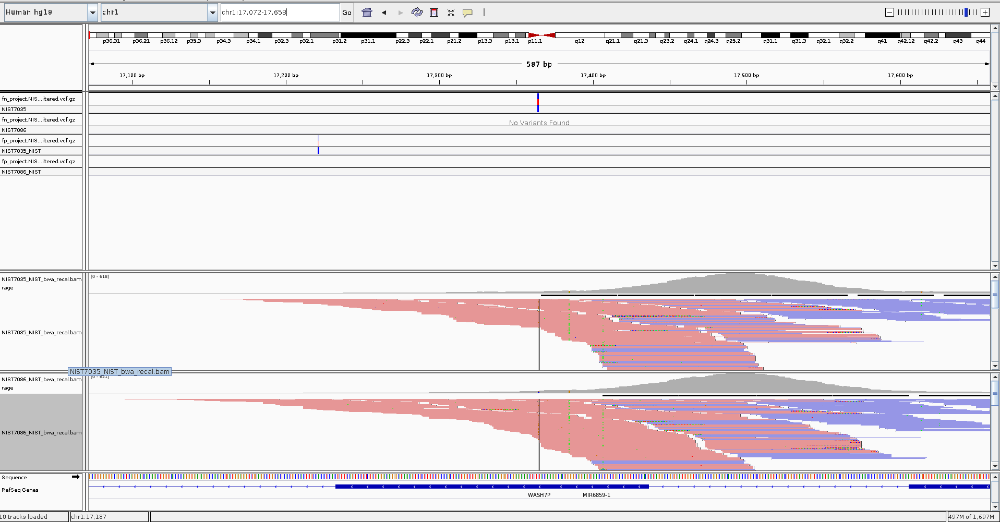

- Some false negatives are located in regions where there is very low coverage (chr1 91141-915810)

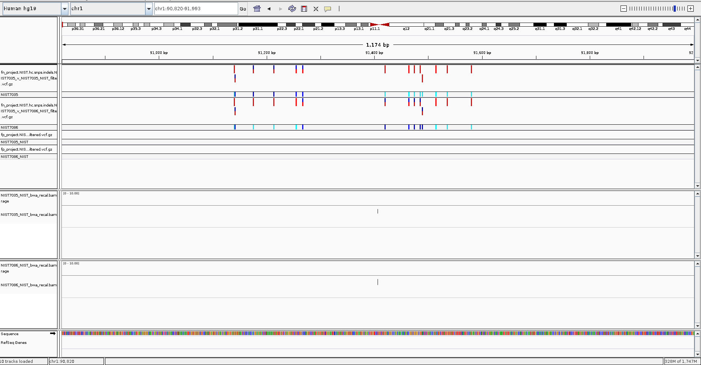

- Some false negatives are located in regions where there is low coverage and only reverse reads are mapped (chr1 136244)

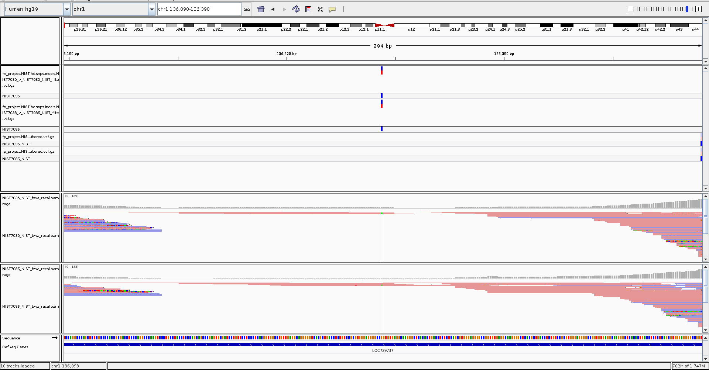

- Some false negatives are located in regions where ?? (chr1 136768)

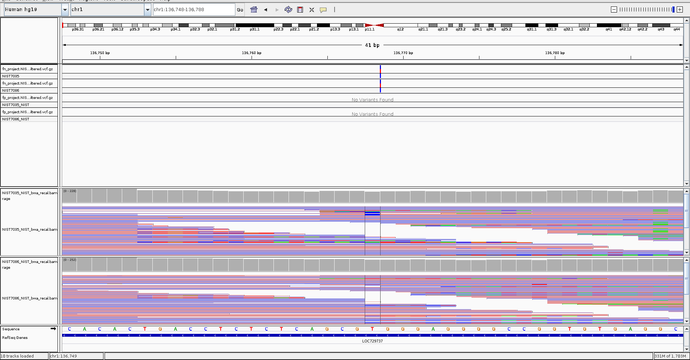

- Some false negatives are located in regions where ?? (chr1 136962)

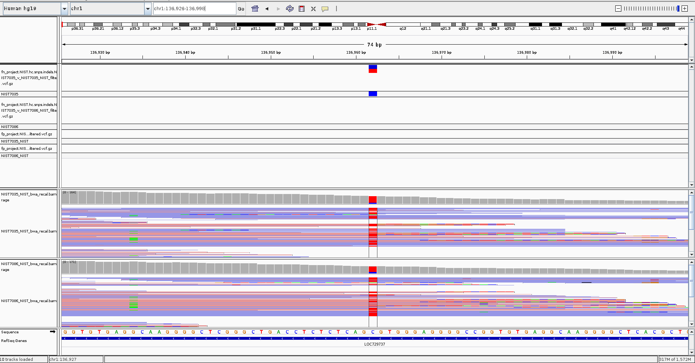

- Some false negatives are located in regions where there is low coverage and only forward reads are mapped (chr1 136244)

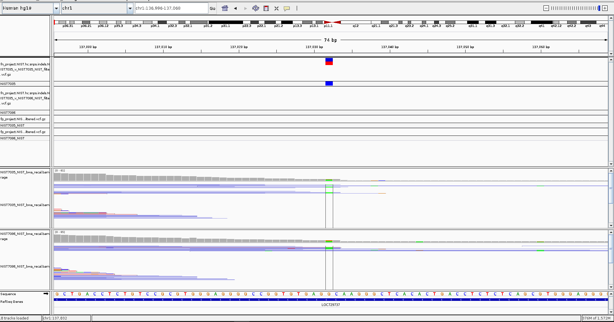

Location of a few false positive calls:

```bash
chr1    12783   .               G       A       48.32   CNN_2D_SNP_Tranche_94.00_95.00  AC=2;AF=1.00;AN=2;CNN_2D=-3.123;DP=2;ExcessHet=3.0103;FS=0.000;MLEAC=1;MLEAF=0.500;MQ=25.08;QD=24.16;SOR=2.303     GT:AD:DP:GQ:PL  1/1:0,2:2:6:60,6,0
chr1    13116   rs201725126     T       G       585.74  CNN_2D_SNP_Tranche_95.00_96.00  AC=2;AF=1.00;AN=2;BaseQRankSum=1.862;CNN_2D=-4.815;DB;DP=16;ExcessHet=3.0103;FS=0.000;MLEAC=1;MLEAF=0.500;MQ=27.22;MQRankSum=-0.696;QD=31.98;ReadPosRankSum=-1.523;SOR=4.174       GT:AD:DP:GQ:PL  1/1:1,15:16:7:598,7,0
chr1    13118   rs200579949     A       G       585.74  CNN_2D_SNP_Tranche_96.00_97.00  AC=2;AF=1.00;AN=2;BaseQRankSum=1.535;CNN_2D=-5.584;DB;DP=16;ExcessHet=3.0103;FS=0.000;MLEAC=1;MLEAF=0.500;MQ=27.22;MQRankSum=-0.696;QD=27.51;ReadPosRankSum=-1.476;SOR=4.174       GT:AD:DP:GQ:PL  1/1:1,15:16:7:598,7,0
chr1    13302   rs180734498     C       T       176.02  CNN_2D_SNP_Tranche_95.00_96.00  AC=2;AF=1.00;AN=2;CNN_2D=-5.040;DB;DP=10;ExcessHet=3.0103;FS=0.000;MLEAC=2;MLEAF=1.00;MQ=22.61;QD=25.15;SOR=4.174  GT:AD:DP:GQ:PL  1/1:0,7:7:21:190,21,0
chr1    13656   .               CAG     C       325.61  CNN_2D_INDEL_Tranche_97.00_98.00        AC=1;AF=0.500;AN=2;BaseQRankSum=0.000;CNN_2D=-4.357;DP=11;ExcessHet=3.0103;FS=0.000;MLEAC=1;MLEAF=0.500;MQ=22.10;MQRankSum=0.140;QD=29.11;ReadPosRankSum=-0.282;SOR=0.446  GT:AD:DP:GQ:PL  0/1:1,8:9:18:333,0,18
chr1    13896   rs201696125     C       A       274.64  CNN_2D_SNP_Tranche_96.00_97.00  AC=1;AF=0.500;AN=2;BaseQRankSum=-4.158;CNN_2D=-6.159;DB;DP=23;ExcessHet=3.0103;FS=8.966;MLEAC=1;MLEAF=0.500;MQ=23.33;MQRankSum=-1.029;QD=11.94;ReadPosRankSum=1.587;SOR=3.116      GT:AD:DP:GQ:PL  0/1:10,13:23:99:282,0,216
chr1    14397   rs370886505     CTGT    C       343.60  CNN_2D_INDEL_Tranche_96.00_97.00        AC=1;AF=0.500;AN=2;BaseQRankSum=-1.641;CNN_2D=-3.504;DB;DP=33;ExcessHet=3.0103;FS=0.000;MLEAC=1;MLEAF=0.500;MQ=23.50;MQRankSum=0.889;QD=10.41;ReadPosRankSum=2.313;SOR=0.191       GT:AD:DP:GQ:PL  0/1:23,10:33:99:351,0,936
chr1    14522   .               G       A       63.32   CNN_2D_SNP_Tranche_94.00_95.00  AC=2;AF=1.00;AN=2;CNN_2D=-3.662;DP=3;ExcessHet=3.0103;FS=0.000;MLEAC=1;MLEAF=0.500;MQ=24.34;QD=31.66;SOR=2.303     GT:AD:DP:GQ:PL  1/1:0,2:2:6:75,6,0
chr1    14542   .               A       G       49.64   CNN_2D_SNP_Tranche_96.00_97.00  AC=1;AF=0.500;AN=2;BaseQRankSum=1.834;CNN_2D=-6.557;DP=6;ExcessHet=3.0103;FS=0.000;MLEAC=1;MLEAF=0.500;MQ=24.01;MQRankSum=1.111;QD=8.27;ReadPosRankSum=1.282;SOR=0.307     GT:AD:DP:GQ:PL  0/1:4,2:6:57:57,0,96
chr1    14590   .               G       A       45.64   CNN_2D_SNP_Tranche_97.00_98.00  AC=1;AF=0.500;AN=2;BaseQRankSum=2.742;CNN_2D=-9.088;DP=22;ExcessHet=3.0103;FS=0.000;MLEAC=1;MLEAF=0.500;MQ=27.27;MQRankSum=-2.271;QD=2.07;ReadPosRankSum=-0.725;SOR=0.039  GT:AD:DP:GQ:PL  0/1:19,3:22:53:53,0,789
chr1    15274   rs201931625     A       T       858.06  CNN_2D_SNP_Tranche_95.00_96.00  AC=2;AF=1.00;AN=2;CNN_2D=-4.846;DB;DP=42;ExcessHet=3.0103;FS=0.000;MLEAC=2;MLEAF=1.00;MQ=25.32;QD=28.60;SOR=6.869  GT:AD:DP:GQ:PL  1/1:0,30:30:90:872,90,0
chr1    16014   .               C       T       58.64   CNN_2D_SNP_Tranche_96.00_97.00  AC=1;AF=0.500;AN=2;BaseQRankSum=1.645;CNN_2D=-6.466;DP=5;ExcessHet=3.0103;FS=0.000;MLEAC=1;MLEAF=0.500;MQ=22.21;MQRankSum=0.674;QD=11.73;ReadPosRankSum=1.036;SOR=1.179    GT:AD:DP:GQ:PL  0/1:2,3:5:34:66,0,34
chr1    16068   rs372319358     T       C       38.65   CNN_2D_SNP_Tranche_95.00_96.00  AC=1;AF=0.500;AN=2;BaseQRankSum=-0.967;CNN_2D=-4.709;DB;DP=3;ExcessHet=3.0103;FS=0.000;MLEAC=1;MLEAF=0.500;MQ=22.67;MQRankSum=0.967;QD=12.88;ReadPosRankSum=0.000;SOR=1.179        GT:AD:DP:GQ:PL  0/1:1,2:3:18:46,0,18
chr1    16229   .               C       A       32.64   CNN_2D_SNP_Tranche_97.00_98.00  AC=1;AF=0.500;AN=2;BaseQRankSum=-1.383;CNN_2D=-7.690;DP=4;ExcessHet=3.0103;FS=0.000;MLEAC=1;MLEAF=0.500;MQ=21.25;MQRankSum=0.674;QD=8.16;ReadPosRankSum=-0.674;SOR=2.303   GT:AD:DP:GQ:PL  0/1:2,2:4:39:40,0,39
chr1    16495   rs141130360     G       C       2199.64 CNN_2D_SNP_Tranche_99.00_100.00 AC=1;AF=0.500;AN=2;BaseQRankSum=-6.536;CNN_2D=-16.116;DB;DP=230;ExcessHet=3.0103;FS=7.259;MLEAC=1;MLEAF=0.500;MQ=21.51;MQRankSum=1.311;QD=9.73;ReadPosRankSum=-0.549;SOR=0.343     GT:AD:DP:GQ:PL  0/1:114,112:226:99:2207,0,2466
chr1    16534   rs201459529     C       T       1522.64 CNN_2D_SNP_Tranche_98.00_99.00  AC=1;AF=0.500;AN=2;BaseQRankSum=-5.981;CNN_2D=-13.877;DB;DP=153;ExcessHet=3.0103;FS=3.066;MLEAC=1;MLEAF=0.500;MQ=21.39;MQRankSum=0.270;QD=9.95;ReadPosRankSum=-2.357;SOR=0.462     GT:AD:DP:GQ:PL  0/1:76,77:153:99:1530,0,1505
chr1    16571   rs199676946     G       A       1544.64 CNN_2D_SNP_Tranche_98.00_99.00  AC=1;AF=0.500;AN=2;BaseQRankSum=-9.691;CNN_2D=-12.688;DB;DP=133;ExcessHet=3.0103;FS=6.072;MLEAC=1;MLEAF=0.500;MQ=21.54;MQRankSum=-0.154;QD=11.70;ReadPosRankSum=1.637;SOR=0.070    GT:AD:DP:GQ:PL  0/1:62,70:132:99:1552,0,1217
chr1    16688   .               G       A       84.64   CNN_2D_SNP_Tranche_99.00_100.00 AC=1;AF=0.500;AN=2;BaseQRankSum=-4.251;CNN_2D=-16.083;DP=82;ExcessHet=3.0103;FS=37.437;MLEAC=1;MLEAF=0.500;MQ=22.17;MQRankSum=-3.661;QD=1.14;ReadPosRankSum=-0.970;SOR=5.133       GT:AD:DP:GQ:PL  0/1:62,12:74:92:92,0,1448
chr1    16957   rs200658479     G       T       252.64  CNN_2D_SNP_Tranche_95.00_96.00  AC=1;AF=0.500;AN=2;BaseQRankSum=-3.678;CNN_2D=-5.193;DB;DP=19;ExcessHet=3.0103;FS=0.000;MLEAC=1;MLEAF=0.500;MQ=23.95;MQRankSum=1.443;QD=13.30;ReadPosRankSum=-0.372;SOR=1.022      GT:AD:DP:GQ:PL  0/1:8,11:19:99:260,0,171
chr1    17020   rs199740902     G       A       76.64   CNN_2D_SNP_Tranche_96.00_97.00  AC=1;AF=0.500;AN=2;BaseQRankSum=-2.655;CNN_2D=-5.439;DB;DP=9;ExcessHet=3.0103;FS=0.000;MLEAC=1;MLEAF=0.500;MQ=23.69;MQRankSum=-1.559;QD=8.52;ReadPosRankSum=0.140;SOR=0.495        GT:AD:DP:GQ:PL  0/1:5,4:9:84:84,0,118
```

Findings:

- Some false positive are called in regions where there is very low coverage (chr1 12783, 12783, 13302, 13656)

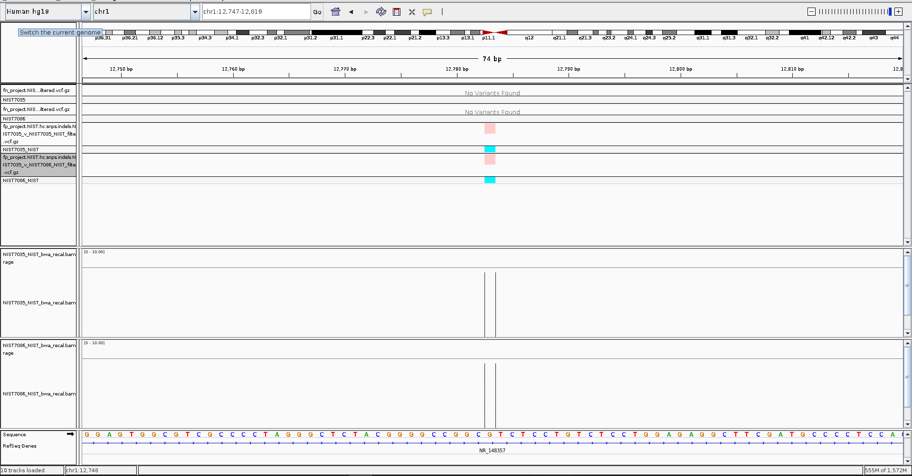

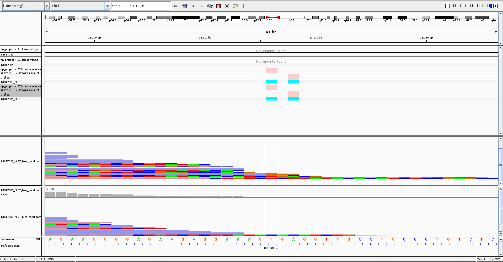

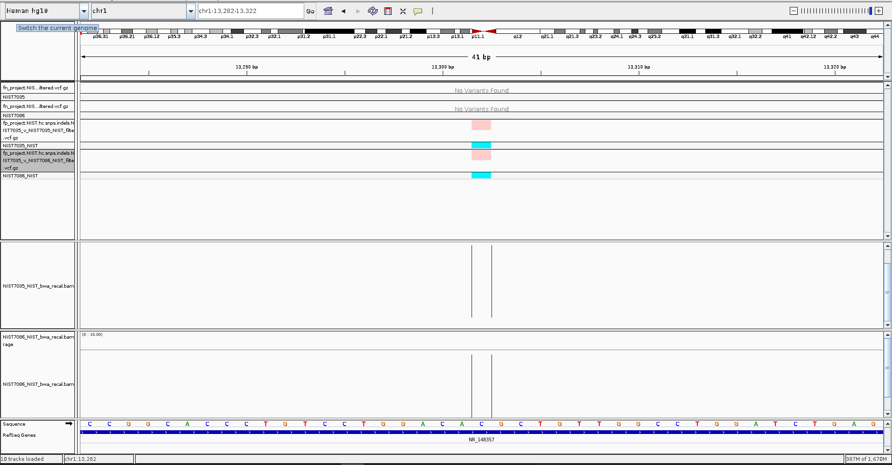

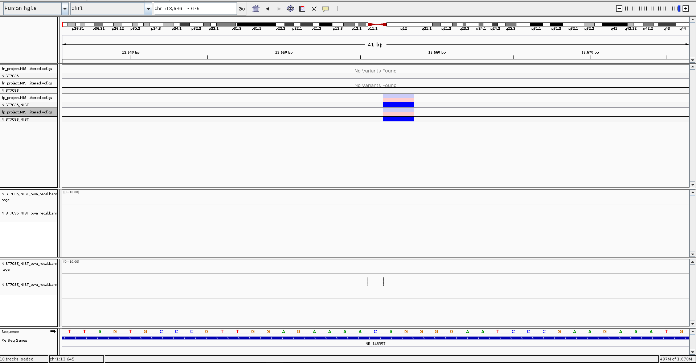

- Some false positive are called in regions where there is low coverage and only reverse reads (chr1, 14590)

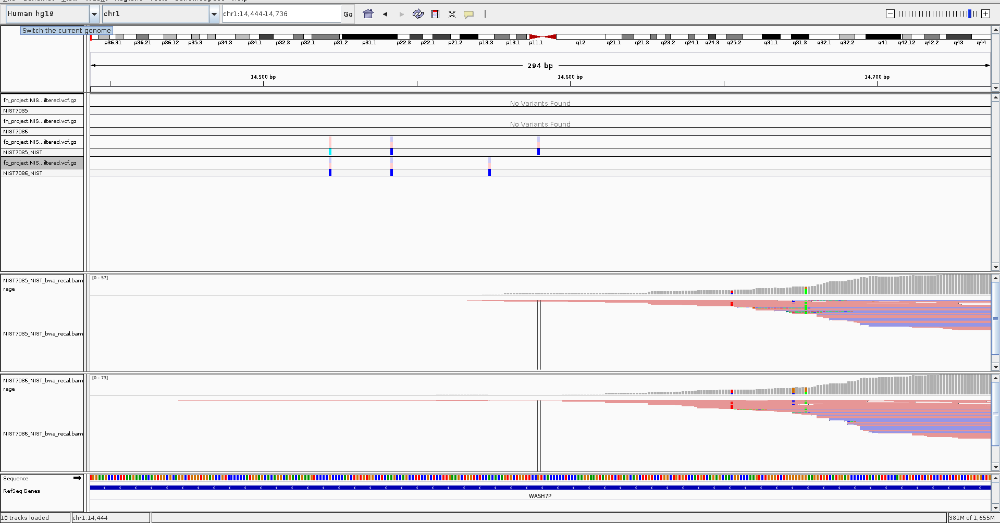

- Some false positive are called in regions where there is low coverage and only forward reads (chr1, 15274)

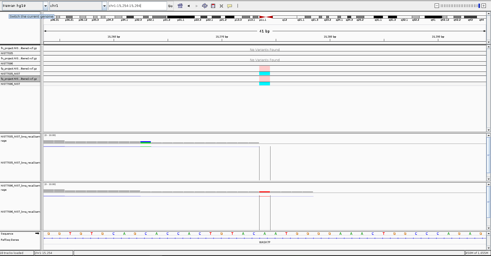

*Note: there is a typo in the above images. For example: fp_project.NIST.hc.snps.indels.NIST7035_v_NIST7086_NIST_filtered.vcf.gz is in fact fp_project.NIST.hc.snps.indels.NIST7086_v_NIST7086_NIST_filtered.vcf.gz*
