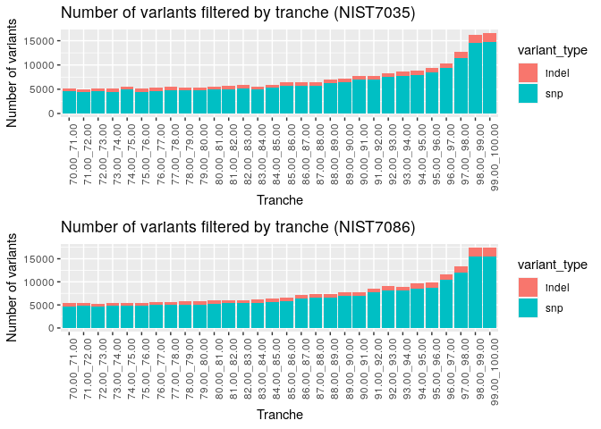
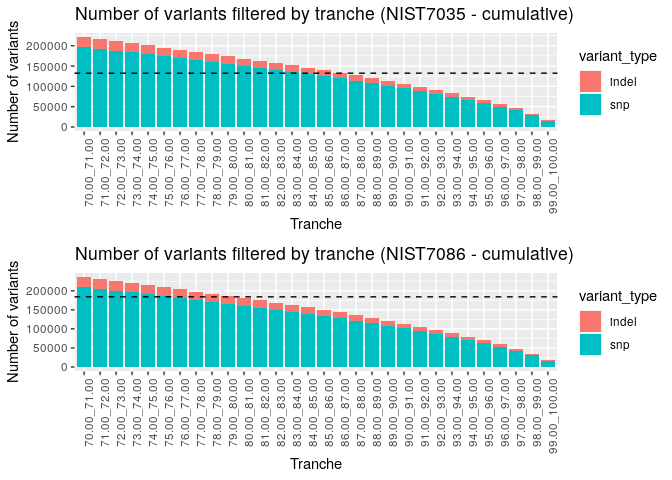

Evaluation of tranche filtering
================
Leah Kemp
27/05/2020

## Objective

The aim of this document is to evaluate the appropriate level of tranche
filtering that should be applied to variants called for our genomic
pipelines. This is a part of a wider effort to benchmark the quality of
three of our genomic pipelines against a known vcf.

See related docs [benchmarking pipeline
quality](../../benchmarking_pipelines_quality.md) and [benchmarking
pipeline quality
results](../../benchmarking_pipelines_quality_results.md). This analysis
fits within quality\_bench1.2.

## Background

Overview of interpreting the tranche filters applied to variants with
[gatk
FilterVariantTranches](https://gatk.broadinstitute.org/hc/en-us/articles/360037227632-FilterVariantTranches)

Higher tranch:

  - More sensitive filtering
  - Less precise filtering
  - Greater chance of false positives
  - Less chance of false negative
  - Larger CNN\_2D values

Lower tranche:

  - Less sensitive filtering
  - More precise filtering
  - Less chance of false positive
  - Greater change of false negative
  - Smaller (sometimes negative) CNN\_2D values

Other info:

  - Variants that fall outside the tranche windows provided (smaller
    than the lowest trache value) are labelled with a ‘PASS’ value
  - Variants that fall within a tranche window are labelled with a the
    tranche window they fall within
  - The default filtering tranche value is 99.95 for snps and 99.4 for
    indels

*Generally, lower tranche = more stringent*

## Setup

``` r
library(vcfR)
library(ggplot2)
library(dplyr)
library(gridExtra)
library(openxlsx)
```

Read in data

``` r
tranches <- read.xlsx("tranches_variants.xlsx")
```

Seperate data by sample

``` r
NIST7035 <- dplyr::filter(tranches, sample == "NIST7035")
NIST7086 <- dplyr::filter(tranches, sample == "NIST7086")
```

## Plot number of variants by tranche (snps and indels)

``` r
plot_NIST7035 <- ggplot2::ggplot(data = NIST7035, aes(x = tranche, y = no_variants, fill = variant_type)) + 
  geom_bar(stat = "identity") +
  labs(title = "Number of variants filtered by tranche (NIST7035)", x = "Tranche", y = "Number of variants") +
  theme(axis.text.x = element_text(angle = 90, hjust = 1))

plot_NIST7086 <- ggplot2::ggplot(data = NIST7086, aes(x = tranche, y = no_variants, fill = variant_type)) + 
  geom_bar(stat = "identity") +
  labs(title = "Number of variants filtered by tranche (NIST7086)", x = "Tranche", y = "Number of variants") +
  theme(axis.text.x = element_text(angle = 90, hjust = 1))

grid.arrange(plot_NIST7035, plot_NIST7086, ncol = 1, nrow = 2)
```

<!-- -->

## Plot cumulative number of variants by tranche (snps and indels)

Calculate cumulative
values

``` r
NIST7035_cumulative <- NIST7035 %>% group_by(variant_type) %>% mutate(cumulative_no_variants = cumsum(no_variants))
NIST7086_cumulative <- NIST7086 %>% group_by(variant_type) %>% mutate(cumulative_no_variants = cumsum(no_variants))
```

``` r
plot_NIST7035_cumulative <- ggplot2::ggplot(data = NIST7035_cumulative, aes(x = tranche, y = cumulative_no_variants, fill = variant_type)) + 
  geom_bar(stat = "identity") +
  labs(title = "Number of variants filtered by tranche (NIST7035 - cumulative)", x = "Tranche", y = "Number of variants") +
  theme(axis.text.x = element_text(angle = 90, hjust = 1)) +
  geom_hline(yintercept = 132545, linetype = 2)

plot_NIST7086_cumulative <- ggplot2::ggplot(data = NIST7086_cumulative, aes(x = tranche, y = cumulative_no_variants, fill = variant_type)) + 
  geom_bar(stat = "identity") +
  labs(title = "Number of variants filtered by tranche (NIST7086 - cumulative)", x = "Tranche", y = "Number of variants") +
  theme(axis.text.x = element_text(angle = 90, hjust = 1)) +
  geom_hline(yintercept = 184104, linetype = 2)

grid.arrange(plot_NIST7035_cumulative, plot_NIST7086_cumulative, ncol = 1, nrow = 2)
```

<!-- -->

## Interpretation

The total number of variants in the known vcf:

  - NIST7035: 336,003
  - NIST7086: 317,524

The total number of variants called by our human\_genomics\_pipeline +
minimal vcf\_annotation\_pipeline before filtering:

  - NIST7035: 468,548
  - NIST7086: 501,628

To get in the ballpark of the correct number of variants called and
filtered (sensitivity vs. precision), we will need to filter out
roughly:

  - 132,545 variants for NIST7035 (plotted above as dashed line)
  - 184,104 variants for NIST7086 (plotted above as dashed line)

From the graphs created above, it looks as though a tranch of around
82.00 will remove roughly this number of variants (compared to the
defaults around 99)

Later we can further refine this value
