Comparing the quality of the tp, fp, and fn variants
================
Leah Kemp
20/05/2020

Compare the quality of the variants contained in the ‘true-positive’,
‘false-positive’ and ‘false-negative’ vcf files produced by evaluation
of pipeline benchmarking runs (using bcftools isec). See the docs for
[benchmarking pipeline quality](../../benchmarking_pipelines_quality.md)
and [benchmarking pipeline quality
results](../../benchmarking_pipelines_quality_results.md)

## Setup

Load packages

``` r
library(vcfR)
library(ggplot2)
library(dplyr)
library(gridExtra)
```

Read in
data

``` r
vcfFP <- read.vcfR("./NIST7035_NIST_filtered_v_project.NIST.hc.snps.indels.chrom.adjusted/0000.vcf")
vcfFN <- read.vcfR("./NIST7035_NIST_filtered_v_project.NIST.hc.snps.indels.chrom.adjusted/0001.vcf")
vcfTP <- read.vcfR("./NIST7035_NIST_filtered_v_project.NIST.hc.snps.indels.chrom.adjusted/0002.vcf")
vcfTP2 <- read.vcfR("./NIST7035_NIST_filtered_v_project.NIST.hc.snps.indels.chrom.adjusted/0003.vcf")
```

Return the available annotations to look into

``` r
queryMETA(vcfFP)
```

    ##  [1] "FILTER=ID=PASS"                             
    ##  [2] "FILTER=ID=CNN_2D_INDEL_Tranche_99.40_100.00"
    ##  [3] "FILTER=ID=CNN_2D_SNP_Tranche_99.95_100.00"  
    ##  [4] "FILTER=ID=LowQual"                          
    ##  [5] "FORMAT=ID=AD"                               
    ##  [6] "FORMAT=ID=DP"                               
    ##  [7] "FORMAT=ID=GQ"                               
    ##  [8] "FORMAT=ID=GT"                               
    ##  [9] "FORMAT=ID=PL"                               
    ## [10] "GATKCommandLine=ID=CNNScoreVariants"        
    ## [11] "GATKCommandLine=ID=FilterVariantTranches"   
    ## [12] "GATKCommandLine=ID=HaplotypeCaller"         
    ## [13] "INFO=ID=AC"                                 
    ## [14] "INFO=ID=AF"                                 
    ## [15] "INFO=ID=AN"                                 
    ## [16] "INFO=ID=BaseQRankSum"                       
    ## [17] "INFO=ID=CNN_2D"                             
    ## [18] "INFO=ID=DB"                                 
    ## [19] "INFO=ID=DP"                                 
    ## [20] "INFO=ID=ExcessHet"                          
    ## [21] "INFO=ID=FS"                                 
    ## [22] "INFO=ID=InbreedingCoeff"                    
    ## [23] "INFO=ID=MLEAC"                              
    ## [24] "INFO=ID=MLEAF"                              
    ## [25] "INFO=ID=MQ"                                 
    ## [26] "INFO=ID=MQRankSum"                          
    ## [27] "INFO=ID=QD"                                 
    ## [28] "INFO=ID=ReadPosRankSum"                     
    ## [29] "INFO=ID=SOR"                                
    ## [30] "93 contig=<IDs omitted from queryMETA"

``` r
strwrap(vcfFP@meta[1:40])
```

Create chromR
objects

``` r
chromFP <- create.chromR(seq = NULL, vcf = vcfFP, name = "False-positives")
chromFN <- create.chromR(seq = NULL, vcf = vcfFN, name = "False-negatives")
chromTP <- create.chromR(seq = NULL, vcf = vcfTP, name = "True-positives")
chromTP2 <- create.chromR(seq = NULL, vcf = vcfTP2, name = "True-positives")
```

## General plots

Plot chromR
objects

``` r
plot(chromFP)
```

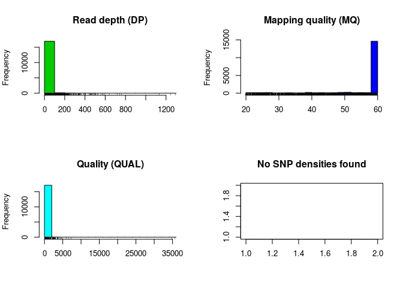<!-- -->

``` r
plot(chromFN)
```

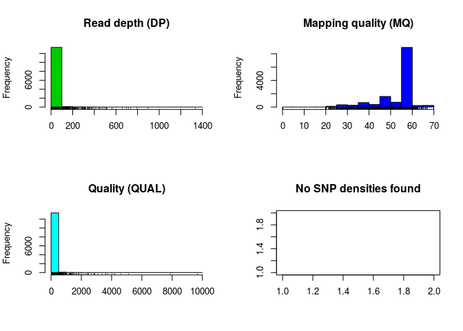<!-- -->

``` r
plot(chromTP)
```

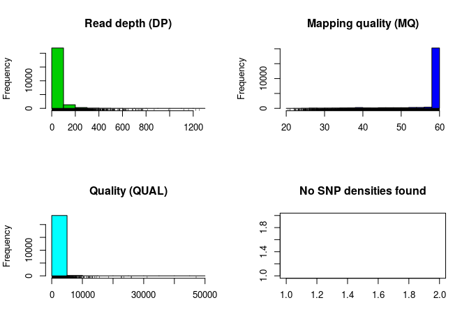<!-- -->

``` r
plot(chromTP2)
```

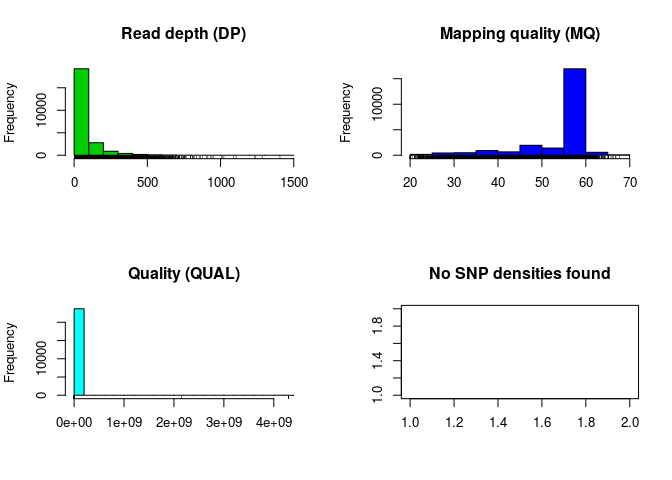<!-- -->

Visualise data

``` r
plotchromFP <- proc.chromR(chromFP)
plotchromFN <- proc.chromR(chromFN)
plotchromTP <- proc.chromR(chromTP)
plotchromTP2 <- proc.chromR(chromTP2)
```

``` r
chromoqc(plotchromFP, dp.alpha=20)
```

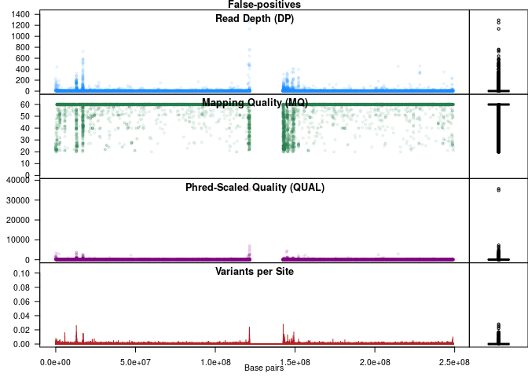<!-- -->

``` r
chromoqc(plotchromFN, dp.alpha=20)
```

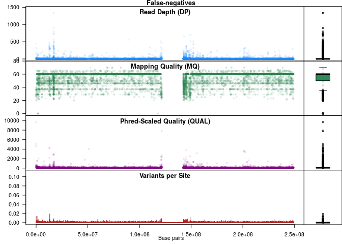<!-- -->

``` r
chromoqc(plotchromTP, dp.alpha=20)
```

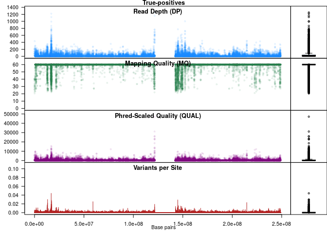<!-- -->

``` r
chromoqc(plotchromTP2, dp.alpha=20)
```

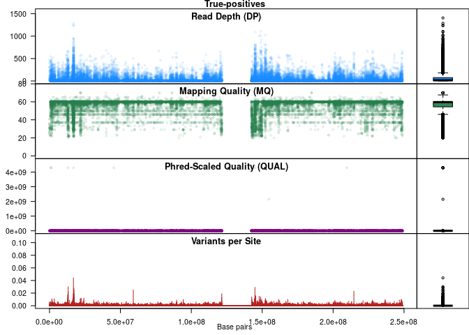<!-- -->

## Other plots/metrics

### Conditional genotype quality (GQ)

``` r
gqFP <- extract.gt(chromFP, element="GQ", as.numeric=TRUE) %>% as.data.frame()
gqFN <- extract.gt(chromFN, element="GQ", as.numeric=TRUE) %>% as.data.frame()
gqTP <- extract.gt(chromTP, element="GQ", as.numeric=TRUE) %>% as.data.frame()
gqTP2 <- extract.gt(chromTP2, element="GQ", as.numeric=TRUE) %>% as.data.frame()
```

``` r
summary(gqFP)
```

    ##  NIST7035_NIST  
    ##  Min.   : 0.00  
    ##  1st Qu.: 6.00  
    ##  Median : 6.00  
    ##  Mean   :14.57  
    ##  3rd Qu.: 6.00  
    ##  Max.   :99.00

``` r
summary(gqFN)
```

    ##     NIST7035    
    ##  Min.   : 0.00  
    ##  1st Qu.: 3.00  
    ##  Median : 6.00  
    ##  Mean   :15.18  
    ##  3rd Qu.:13.00  
    ##  Max.   :99.00  
    ##  NA's   :6939

``` r
summary(gqTP)
```

    ##  NIST7035_NIST  
    ##  Min.   : 0.00  
    ##  1st Qu.: 6.00  
    ##  Median :39.00  
    ##  Mean   :50.91  
    ##  3rd Qu.:99.00  
    ##  Max.   :99.00

``` r
summary(gqTP2)
```

    ##     NIST7035    
    ##  Min.   : 0.00  
    ##  1st Qu.: 6.00  
    ##  Median :38.00  
    ##  Mean   :50.73  
    ##  3rd Qu.:99.00  
    ##  Max.   :99.00  
    ##  NA's   :29

``` r
scale = scale_y_continuous(limits = c(0, 15000))
xlab = "Gentoype quality (GQ)"
ylab = "Frequency"

pFP <- ggplot2::ggplot(gqFP, mapping = aes(x = NIST7035_NIST)) + 
  geom_histogram(stat = "bin") +
  labs(title = "False positives", x = xlab, y = ylab) +
  scale
pFN <- ggplot2::ggplot(gqFN, mapping = aes(x = NIST7035)) + 
  geom_histogram(stat = "bin") +
  labs(title = "False negatives", x = xlab, y = ylab) +
  scale
pTP <- ggplot2::ggplot(gqTP, mapping = aes(x = NIST7035_NIST)) + 
  geom_histogram(stat = "bin") +
  labs(title = "True positives", x = xlab, y = ylab) +
  scale
pTP2 <- ggplot2::ggplot(gqTP2, mapping = aes(x = NIST7035)) + 
  geom_histogram(stat = "bin") +
  labs(title = "True positives", x = xlab, y = ylab) +
  scale

grid.arrange(pFP, pFN, pTP, pTP2, ncol = 2, nrow = 2)
```

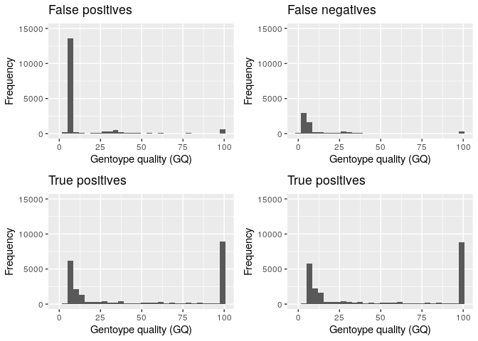<!-- -->

### Normalized Phred-scaled likelihoods for genotypes as defined in the VCF specification (PL)

``` r
plFP <- extract.gt(chromFP, element="PL", as.numeric=TRUE) %>% as.data.frame()
plFN <- extract.gt(chromFN, element="PL", as.numeric=TRUE) %>% as.data.frame()
plTP <- extract.gt(chromTP, element="PL", as.numeric=TRUE) %>% as.data.frame()
plTP2 <- extract.gt(chromTP2, element="PL", as.numeric=TRUE) %>% as.data.frame()
```

``` r
summary(plFP)
```

    ##  NIST7035_NIST     
    ##  Min.   :   38.00  
    ##  1st Qu.:   49.00  
    ##  Median :   49.00  
    ##  Mean   :   78.61  
    ##  3rd Qu.:   49.00  
    ##  Max.   :35699.00

``` r
summary(plFN)
```

    ##     NIST7035      
    ##  Min.   :   0.00  
    ##  1st Qu.:  30.00  
    ##  Median :  38.00  
    ##  Mean   :  60.77  
    ##  3rd Qu.:  70.00  
    ##  Max.   :5489.00  
    ##  NA's   :6939

``` r
summary(plTP)
```

    ##  NIST7035_NIST    
    ##  Min.   :   38.0  
    ##  1st Qu.:   83.0  
    ##  Median :  152.0  
    ##  Mean   :  559.7  
    ##  3rd Qu.:  612.0  
    ##  Max.   :47112.0

``` r
summary(plTP2)
```

    ##     NIST7035      
    ##  Min.   :    0.0  
    ##  1st Qu.:   81.0  
    ##  Median :  142.0  
    ##  Mean   :  536.5  
    ##  3rd Qu.:  592.0  
    ##  Max.   :14553.0  
    ##  NA's   :29

``` r
scale = scale_y_continuous(limits = c(0, 15000))
xlab = "Normalized Phred-scaled likelihood (PL)"
ylab = "Frequency"

par(mfrow = c(2, 2))
pFP <- ggplot2::ggplot(gqFP, mapping = aes(x = NIST7035_NIST)) + 
  geom_histogram(stat = "bin") +
  labs(title = "False positives", x = xlab, y = ylab) +
  scale
pFN <- ggplot2::ggplot(gqFN, mapping = aes(x = NIST7035)) + 
  geom_histogram(stat = "bin") +
  labs(title = "False negatives", x = xlab, y = ylab) +
  scale
pTP <- ggplot2::ggplot(gqTP, mapping = aes(x = NIST7035_NIST)) + 
  geom_histogram(stat = "bin") +
  labs(title = "True positives", x = xlab, y = ylab) +
  scale
pTP2 <- ggplot2::ggplot(gqTP2, mapping = aes(x = NIST7035)) + 
  geom_histogram(stat = "bin") +
  labs(title = "True positives", x = xlab, y = ylab) +
  scale

grid.arrange(pFP, pFN, pTP, pTP2, ncol = 2, nrow = 2)
```

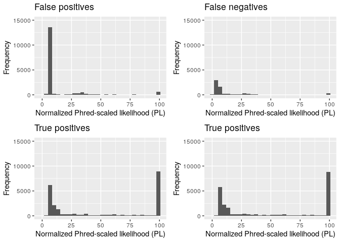<!-- -->

### Allelic depths for the ref and alt alleles in the order listed (AD)

``` r
adFP <- extract.gt(chromFP, element="AD", as.numeric=TRUE) %>% as.data.frame()
adFN <- extract.gt(chromFN, element="AD", as.numeric=TRUE) %>% as.data.frame()
adTP <- extract.gt(chromTP, element="AD", as.numeric=TRUE) %>% as.data.frame()
adTP2 <- extract.gt(chromTP2, element="AD", as.numeric=TRUE) %>% as.data.frame()
```

``` r
summary(adFP)
```

    ##  NIST7035_NIST    
    ##  Min.   :  0.000  
    ##  1st Qu.:  0.000  
    ##  Median :  0.000  
    ##  Mean   :  3.612  
    ##  3rd Qu.:  0.000  
    ##  Max.   :963.000

``` r
summary(adFN)
```

    ##     NIST7035      
    ##  Min.   :  0.000  
    ##  1st Qu.:  0.000  
    ##  Median :  0.000  
    ##  Mean   :  4.371  
    ##  3rd Qu.:  2.000  
    ##  Max.   :601.000  
    ##  NA's   :7013

``` r
summary(adTP)
```

    ##  NIST7035_NIST  
    ##  Min.   :  0.0  
    ##  1st Qu.:  0.0  
    ##  Median :  0.0  
    ##  Mean   : 12.3  
    ##  3rd Qu.:  9.0  
    ##  Max.   :941.0

``` r
summary(adTP2)
```

    ##     NIST7035     
    ##  Min.   :  0.00  
    ##  1st Qu.:  0.00  
    ##  Median :  0.00  
    ##  Mean   : 11.32  
    ##  3rd Qu.:  9.00  
    ##  Max.   :576.00  
    ##  NA's   :30

``` r
scale = scale_y_continuous(limits = c(0, 15000))
xlab = "Allelic depths (AD)"
ylab = "Frequency"

par(mfrow = c(2, 2))
pFP <- ggplot2::ggplot(adFP, mapping = aes(x = NIST7035_NIST)) + 
  geom_histogram(stat = "bin") +
  labs(title = "False positives", x = xlab, y = ylab) +
  scale
pFN <- ggplot2::ggplot(adFN, mapping = aes(x = NIST7035)) + 
  geom_histogram(stat = "bin") +
  labs(title = "False negatives", x = xlab, y = ylab) +
  scale
pTP <- ggplot2::ggplot(adTP, mapping = aes(x = NIST7035_NIST)) + 
  geom_histogram(stat = "bin") +
  labs(title = "True positives", x = xlab, y = ylab) +
  scale
pTP2 <- ggplot2::ggplot(adTP2, mapping = aes(x = NIST7035)) + 
  geom_histogram(stat = "bin") +
  labs(title = "True positives", x = xlab, y = ylab) +
  scale

grid.arrange(pFP, pFN, pTP, pTP2, ncol = 2, nrow = 2)
```

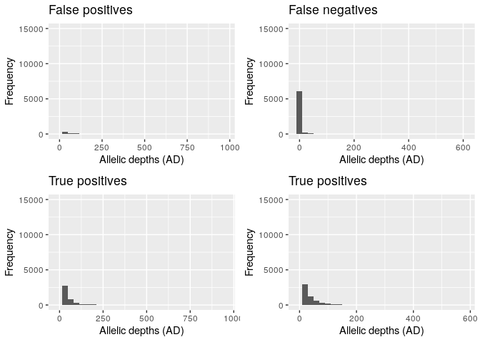<!-- -->

### No data (all NA’s) avaliable for…

  - INDEL truth resource sensitivity between 99.40 and 100.00 for info
    key CNN\_2D (CNN\_2D\_INDEL\_Tranche\_99.40\_100.00)
  - SNP truth resource sensitivity between 99.95 and 100.00 for info key
    CNN\_2D (CNN\_2D\_SNP\_Tranche\_99.95\_100.00)
  - RMS mapping quality (MQ)
  - Low quality (LowQual)
  - Variant Confidence/Quality by Depth (QD)
