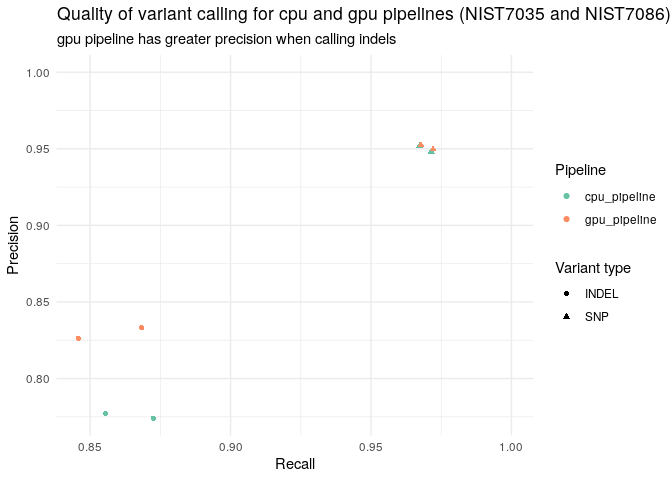
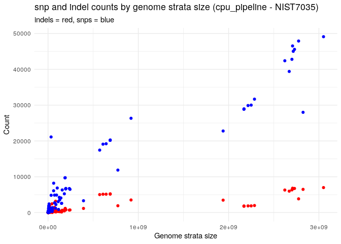
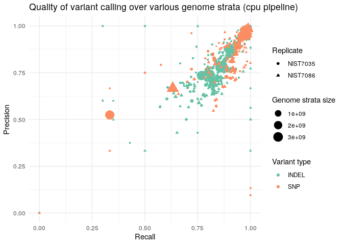
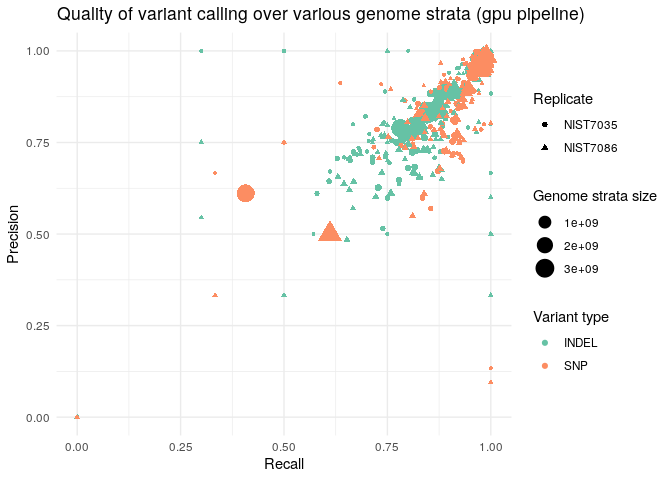

quality\_bench1.8
================

The aim of this document is to evaluate
[hap.py](https://github.com/Illumina/hap.py) outputs. This is a part of
a wider effort to benchmark the quality of three of our genomic
pipelines against a known vcf.

See related docs [benchmarking pipeline
quality](../../benchmarking_pipelines_quality.md) and [benchmarking
pipeline quality
results](../../benchmarking_pipelines_quality_results.md). This analysis
fits within quality\_bench1.8.

## Summary

  - METRIC.Recall = Recall for truth variant representation = TRUTH.TP /
    (TRUTH.TP + TRUTH.FN)
  - METRIC.Precision = Precision of query variants = QUERY.TP /
    (QUERY.TP + QUERY.FP)
  - METRIC.Frac\_NA = Fraction of non-assessed query calls = QUERY.UNK /
    QUERY.TOTAL
  - METRIC.F1\_Score = Harmonic mean of precision and recall =
    2METRIC.RecallMetric.Precision/(METRIC.Recall + METRIC.Precision)
  - TRUTH.TOTAL = Total number of truth variants
  - TRUTH.TP = Number of true-positive calls in truth representation
    (counted via the truth sample column)
  - TRUTH.FN = Number of false-negative calls = calls in truth without
    matching query call
  - QUERY.TOTAL = Total number of query calls
  - QUERY.TP = Number of true positive calls in query representation
    (counted via the query sample column)
  - QUERY.FP = Number of false-positive calls in the query file
    (mismatched query calls within the confident regions)
  - QUERY.UNK = Number of query calls outside the confident regions
  - FP.al = Number of allele mismatches (variants matched by position
    and not by haplotype)
  - FP.gt = Number of genotype mismatches (alleles match, but different
    zygosity)
  - Subset.Size = When using stratification regions, this gives the
    number of nucleotides contained in the current subset
  - Subset.IS\_CONF.Size = This gives the number of confident bases (-f
    regions) in the current
subset

<!--html_preserve-->

<!--/html_preserve-->

<!-- -->

## Evaluate genome stratifications

We want to identify genome strata which contain high quality variants -
variants with high F1 scores (a metric which balances precision and
recall). We also want to maximise the size of these genome strata in
order to maximise the amount of exome data that is analysed for
variants? (or do we want to maximise the number of variants called -
might not be the same as a large genome strata)

### See if genome strata size increases snp and indel counts

  - CPU pipeline - NIST7035

<!-- -->

Generally, more snps are included in genome strata that are larger.
However, a larger genome strata does not guaruntee a greater number of
snps are
captured.

### Plot genome strata by subset size for each pipeline

<!--html_preserve-->

<script type="application/json" data-for="htmlwidget-c057ec0a3c3ffe830cb4">{"x":{"filter":"top","filterHTML":"<tr>\n  <td><\/td>\n  <td data-type=\"character\" style=\"vertical-align: top;\">\n    
\n      <input type=\"search\" placeholder=\"All\" class=\"form-control\" style=\"width: 100%;\"/>\n      <\/span>\n    <\/div>\n  <\/td>\n  <td data-type=\"character\" style=\"vertical-align: top;\">\n    
\n      <input type=\"search\" placeholder=\"All\" class=\"form-control\" style=\"width: 100%;\"/>\n      <\/span>\n    <\/div>\n  <\/td>\n  <td data-type=\"character\" style=\"vertical-align: top;\">\n    
\n      <input type=\"search\" placeholder=\"All\" class=\"form-control\" style=\"width: 100%;\"/>\n      <\/span>\n    <\/div>\n  <\/td>\n  <td data-type=\"character\" style=\"vertical-align: top;\">\n    
\n      <input type=\"search\" placeholder=\"All\" class=\"form-control\" style=\"width: 100%;\"/>\n      <\/span>\n    <\/div>\n  <\/td>\n  <td data-type=\"character\" style=\"vertical-align: top;\">\n    
\n      <input type=\"search\" placeholder=\"All\" class=\"form-control\" style=\"width: 100%;\"/>\n      <\/span>\n    <\/div>\n  <\/td>\n  <td data-type=\"number\" style=\"vertical-align: top;\">\n    
\n      <input type=\"search\" placeholder=\"All\" class=\"form-control\" style=\"width: 100%;\"/>\n      <\/span>\n    <\/div>\n    
\n      
<\/div>\n      <\/span>\n      <\/span>\n    <\/div>\n  <\/td>\n  <td data-type=\"number\" style=\"vertical-align: top;\">\n    
\n      <input type=\"search\" placeholder=\"All\" class=\"form-control\" style=\"width: 100%;\"/>\n      <\/span>\n    <\/div>\n    
\n      
<\/div>\n      <\/span>\n      <\/span>\n    <\/div>\n  <\/td>\n  <td data-type=\"integer\" style=\"vertical-align: top;\">\n    
\n      <input type=\"search\" placeholder=\"All\" class=\"form-control\" style=\"width: 100%;\"/>\n      <\/span>\n    <\/div>\n    
\n      
<\/div>\n      <\/span>\n      <\/span>\n    <\/div>\n  <\/td>\n  <td data-type=\"integer\" style=\"vertical-align: top;\">\n    
\n      <input type=\"search\" placeholder=\"All\" class=\"form-control\" style=\"width: 100%;\"/>\n      <\/span>\n    <\/div>\n    
\n      
<\/div>\n      <\/span>\n      <\/span>\n    <\/div>\n  <\/td>\n  <td data-type=\"integer\" style=\"vertical-align: top;\">\n    
\n      <input type=\"search\" placeholder=\"All\" class=\"form-control\" style=\"width: 100%;\"/>\n      <\/span>\n    <\/div>\n    
\n      
<\/div>\n      <\/span>\n      <\/span>\n    <\/div>\n  <\/td>\n  <td data-type=\"integer\" style=\"vertical-align: top;\">\n    
\n      <input type=\"search\" placeholder=\"All\" class=\"form-control\" style=\"width: 100%;\"/>\n      <\/span>\n    <\/div>\n    
\n      
<\/div>\n      <\/span>\n      <\/span>\n    <\/div>\n  <\/td>\n  <td data-type=\"integer\" style=\"vertical-align: top;\">\n    
\n      <input type=\"search\" placeholder=\"All\" class=\"form-control\" style=\"width: 100%;\"/>\n      <\/span>\n    <\/div>\n    
\n      
<\/div>\n      <\/span>\n      <\/span>\n    <\/div>\n  <\/td>\n  <td data-type=\"integer\" style=\"vertical-align: top;\">\n    
\n      <input type=\"search\" placeholder=\"All\" class=\"form-control\" style=\"width: 100%;\"/>\n      <\/span>\n    <\/div>\n    
\n      
<\/div>\n      <\/span>\n      <\/span>\n    <\/div>\n  <\/td>\n  <td data-type=\"integer\" style=\"vertical-align: top;\">\n    
\n      <input type=\"search\" placeholder=\"All\" class=\"form-control\" style=\"width: 100%;\"/>\n      <\/span>\n    <\/div>\n    
\n      
<\/div>\n      <\/span>\n      <\/span>\n    <\/div>\n  <\/td>\n  <td data-type=\"integer\" style=\"vertical-align: top;\">\n    
\n      <input type=\"search\" placeholder=\"All\" class=\"form-control\" style=\"width: 100%;\"/>\n      <\/span>\n    <\/div>\n    
\n      
<\/div>\n      <\/span>\n      <\/span>\n    <\/div>\n  <\/td>\n  <td data-type=\"number\" style=\"vertical-align: top;\">\n    
\n      <input type=\"search\" placeholder=\"All\" class=\"form-control\" style=\"width: 100%;\"/>\n      <\/span>\n    <\/div>\n    
\n      
<\/div>\n      <\/span>\n      <\/span>\n    <\/div>\n  <\/td>\n  <td data-type=\"number\" style=\"vertical-align: top;\">\n    
\n      <input type=\"search\" placeholder=\"All\" class=\"form-control\" style=\"width: 100%;\"/>\n      <\/span>\n    <\/div>\n    
\n      
<\/div>\n      <\/span>\n      <\/span>\n    <\/div>\n  <\/td>\n  <td data-type=\"number\" style=\"vertical-align: top;\">\n    
\n      <input type=\"search\" placeholder=\"All\" class=\"form-control\" style=\"width: 100%;\"/>\n      <\/span>\n    <\/div>\n    
\n      
<\/div>\n      <\/span>\n      <\/span>\n    <\/div>\n  <\/td>\n<\/tr>","data":[["1","2","3","4","5","6","7","8","9","10","11","12","13","14","15","16","17","18","19","20","21","22","23","24","25","26","27","28","29","30","31","32","33","34","35","36","37","38","39","40","41","42","43","44","45","46","47","48","49","50","51","52","53","54","55","56","57","58","59","60","61","62","63","64","65","66","67","68","69","70","71","72","73","74","75","76","77","78","79","80","81","82","83","84","85","86","87","88","89","90","91","92","93","94","95","96","97","98","99","100","101","102","103","104","105","106","107","108","109","110","111","112","113","114","115","116","117","118","119","120","121","122","123","124","125","126","127","128","129","130","131","132","133","134","135","136","137","138","139","140","141","142","143","144","145","146","147","148","149","150","151","152","153","154","155","156","157","158","159","160","161","162","163","164","165","166","167","168","169","170","171","172","173","174","175","176","177","178","179","180","181","182","183","184","185","186","187","188","189","190","191","192","193","194","195","196","197","198","199","200","201","202","203","204","205","206","207","208","209","210","211","212","213","214","215","216","217","218","219","220","221","222","223","224","225","226","227","228","229","230","231","232","233","234","235","236","237","238","239","240","241","242","243","244","245","246","247","248","249","250","251","252","253","254","255","256","257","258","259","260","261","262","263","264","265","266","267","268","269","270","271","272","273","274","275","276","277","278","279","280","281","282","283","284","285","286","287","288","289","290","291","292","293","294","295","296","297","298","299","300","301","302","303","304","305","306","307","308","309","310","311","312","313","314","315","316","317","318","319","320","321","322","323","324","325","326","327","328","329","330","331","332","333","334","335","336","337","338","339","340","341","342","343","344","345","346","347","348","349","350","351","352","353","354","355","356","357","358","359","360","361","362","363","364","365","366","367","368","369","370","371","372","373","374","375","376","377","378","379","380","381","382","383","384","385","386","387","388","389","390","391","392","393","394","395","396","397","398","399","400","401","402","403","404","405","406","407","408","409","410","411","412","413","414","415","416","417","418","419","420","421","422","423","424","425","426","427","428","429","430","431","432","433","434","435","436","437","438","439","440","441","442","443","444","445","446","447","448","449","450","451","452","453","454","455","456","457","458","459","460","461","462","463","464","465","466","467","468","469","470","471","472","473","474","475","476","477","478","479","480","481","482","483","484","485","486","487","488","489","490","491","492","493","494","495","496","497","498","499","500","501","502","503","504","505","506","507","508","509","510","511","512","513","514","515","516","517","518","519","520","521","522","523","524","525","526","527","528","529","530","531","532","533","534","535","536","537","538","539","540","541","542","543","544","545","546","547","548","549","550","551","552","553","554","555","556","557","558","559","560","561","562","563","564","565","566","567","568","569","570","571","572","573","574","575","576","577","578","579","580","581","582","583","584","585","586","587","588","589","590","591","592","593","594","595","596","597","598","599","600","601","602","603","604","605","606","607","608","609","610","611","612","613","614","615","616","617","618","619","620","621","622","623","624","625","626","627","628","629","630","631","632","633","634","635","636","637","638","639","640","641","642","643","644","645","646","647","648","649","650","651","652","653","654","655","656","657","658","659","660","661","662","663","664","665","666","667","668","669","670","671","672","673","674","675","676","677","678","679","680","681","682","683","684","685","686","687","688","689","690","691","692","693","694","695","696","697","698","699","700","701","702","703","704","705","706","707","708","709","710","711","712","713","714","715","716","717","718","719","720","721","722","723","724","725","726","727","728","729","730","731","732","733","734","735","736","737","738","739","740","741","742","743","744","745","746","747","748","749","750","751","752","753","754","755","756","757","758","759","760","761","762","763","764","765","766","767","768","769","770","771","772","773","774","775","776","777","778","779","780","781","782","783","784","785","786","787","788","789","790","791","792","793","794","795","796","797","798","799","800","801","802","803","804","805","806","807","808","809","810","811","812","813","814","815","816","817","818","819","820","821","822","823","824","825","826","827","828","829","830","831","832","833","834","835","836","837","838","839","840","841","842","843","844","845","846","847","848","849","850","851","852","853","854","855","856","857","858","859","860","861","862","863","864","865","866","867","868","869","870","871","872","873","874","875","876","877","878","879","880","881","882","883","884","885","886","887","888","889","890","891","892","893","894","895","896","897","898","899","900","901","902","903","904","905","906","907","908","909","910","911","912","913","914","915","916","917","918","919","920","921","922","923","924","925","926","927","928","929","930","931","932","933","934","935","936","937","938","939","940","941","942","943","944","945","946","947","948","949","950","951","952","953","954","955","956","957","958","959","960","961","962","963","964","965","966","967","968","969","970","971","972","973","974","975","976","977","978","979","980","981","982","983","984","985","986","987","988","989","990","991","992","993","994","995","996","997","998","999","1000","1001","1002","1003","1004","1005","1006","1007","1008","1009","1010","1011","1012","1013","1014","1015","1016","1017","1018","1019","1020","1021","1022","1023","1024","1025","1026","1027","1028","1029","1030","1031","1032","1033","1034","1035","1036","1037","1038","1039","1040","1041","1042","1043","1044","1045","1046","1047","1048","1049","1050","1051","1052","1053","1054","1055","1056","1057","1058","1059","1060","1061","1062","1063","1064","1065","1066","1067","1068","1069","1070","1071","1072","1073","1074","1075","1076","1077","1078","1079","1080","1081","1082","1083","1084","1085","1086","1087","1088","1089","1090","1091","1092","1093","1094","1095","1096","1097","1098","1099","1100","1101","1102","1103","1104","1105","1106","1107","1108","1109","1110","1111","1112","1113","1114","1115","1116","1117","1118","1119","1120","1121","1122","1123","1124","1125","1126","1127","1128","1129","1130","1131","1132","1133","1134","1135","1136","1137","1138","1139","1140","1141","1142","1143","1144","1145","1146","1147","1148","1149","1150","1151","1152","1153","1154","1155","1156","1157","1158","1159","1160","1161","1162","1163","1164","1165","1166","1167","1168","1169","1170","1171","1172","1173","1174","1175","1176","1177","1178","1179","1180","1181","1182","1183","1184","1185","1186","1187","1188","1189","1190","1191","1192","1193","1194","1195","1196","1197","1198","1199","1200","1201","1202","1203","1204","1205","1206","1207","1208","1209","1210","1211","1212","1213","1214","1215","1216","1217","1218","1219","1220","1221","1222","1223","1224","1225","1226","1227","1228","1229","1230","1231","1232","1233","1234","1235","1236","1237","1238","1239","1240","1241","1242","1243","1244","1245","1246","1247","1248","1249","1250","1251","1252","1253","1254","1255","1256","1257","1258","1259","1260","1261","1262","1263","1264","1265","1266","1267","1268","1269","1270","1271","1272","1273","1274","1275","1276","1277","1278","1279","1280","1281","1282","1283","1284","1285","1286","1287","1288","1289","1290","1291","1292","1293","1294","1295","1296","1297","1298","1299","1300","1301","1302","1303","1304","1305","1306","1307","1308","1309","1310","1311","1312","1313","1314","1315","1316","1317","1318","1319","1320","1321","1322","1323","1324","1325","1326","1327","1328","1329","1330","1331","1332","1333","1334","1335","1336","1337","1338","1339","1340","1341","1342","1343","1344","1345","1346","1347","1348","1349","1350","1351","1352","1353","1354","1355","1356","1357","1358","1359","1360","1361","1362","1363","1364","1365","1366","1367","1368","1369","1370","1371","1372","1373","1374","1375","1376","1377","1378","1379","1380","1381","1382","1383","1384","1385","1386","1387","1388","1389","1390","1391","1392","1393","1394","1395","1396","1397","1398","1399","1400","1401","1402","1403","1404","1405","1406","1407","1408","1409","1410","1411","1412","1413","1414","1415","1416","1417","1418","1419","1420","1421","1422","1423","1424","1425","1426","1427","1428","1429","1430","1431","1432","1433","1434","1435","1436","1437","1438","1439","1440","1441","1442","1443","1444","1445","1446","1447","1448","1449","1450","1451","1452","1453","1454","1455","1456","1457","1458","1459","1460","1461","1462","1463","1464","1465","1466","1467","1468","1469","1470","1471","1472","1473","1474","1475","1476","1477","1478","1479","1480","1481","1482","1483","1484","1485","1486","1487","1488","1489","1490","1491","1492","1493","1494","1495","1496","1497","1498","1499","1500","1501","1502","1503","1504","1505","1506","1507","1508","1509","1510","1511","1512","1513","1514","1515","1516","1517","1518","1519","1520","1521","1522","1523","1524","1525","1526","1527","1528","1529","1530","1531","1532","1533","1534","1535","1536","1537","1538","1539","1540","1541","1542","1543","1544","1545","1546","1547","1548","1549","1550","1551","1552","1553","1554","1555","1556","1557","1558","1559","1560","1561","1562","1563","1564","1565","1566","1567","1568","1569","1570","1571","1572","1573","1574","1575","1576","1577","1578","1579","1580","1581","1582","1583","1584","1585","1586","1587","1588","1589","1590","1591","1592","1593","1594","1595","1596","1597","1598","1599","1600","1601","1602","1603","1604","1605","1606","1607","1608","1609","1610","1611","1612","1613","1614","1615","1616","1617","1618","1619","1620","1621","1622","1623","1624","1625","1626","1627","1628","1629","1630","1631","1632","1633","1634","1635","1636","1637","1638","1639","1640","1641","1642","1643","1644","1645","1646","1647","1648","1649","1650","1651","1652","1653","1654","1655","1656","1657","1658","1659","1660","1661","1662","1663","1664","1665","1666","1667","1668","1669","1670","1671","1672","1673","1674","1675","1676","1677","1678","1679","1680","1681","1682","1683","1684","1685","1686","1687","1688","1689","1690","1691","1692","1693","1694","1695","1696","1697","1698","1699","1700","1701","1702","1703","1704","1705","1706","1707","1708","1709","1710","1711","1712","1713","1714","1715","1716","1717","1718","1719","1720","1721","1722","1723","1724","1725","1726","1727","1728","1729","1730","1731","1732","1733","1734","1735","1736","1737","1738","1739","1740","1741","1742","1743","1744","1745","1746","1747","1748","1749","1750","1751","1752","1753","1754","1755","1756","1757","1758","1759","1760","1761","1762","1763","1764","1765","1766","1767","1768","1769","1770","1771","1772","1773","1774","1775","1776","1777","1778","1779","1780","1781","1782","1783","1784","1785","1786","1787","1788","1789","1790","1791","1792","1793","1794","1795","1796","1797","1798","1799","1800","1801","1802","1803","1804","1805","1806","1807","1808","1809","1810","1811","1812","1813","1814","1815","1816","1817","1818","1819","1820","1821","1822","1823","1824","1825","1826","1827","1828","1829","1830","1831","1832","1833","1834","1835","1836","1837","1838","1839","1840","1841","1842","1843","1844","1845","1846","1847","1848","1849","1850","1851","1852","1853","1854","1855","1856","1857","1858","1859","1860","1861","1862","1863","1864","1865","1866","1867","1868","1869","1870","1871","1872","1873","1874","1875","1876","1877","1878","1879","1880","1881","1882","1883","1884","1885","1886","1887","1888","1889","1890","1891","1892","1893","1894","1895","1896","1897","1898","1899","1900","1901","1902","1903","1904","1905","1906","1907","1908","1909","1910","1911","1912","1913","1914","1915","1916","1917","1918","1919","1920","1921","1922","1923","1924","1925","1926","1927","1928","1929","1930","1931","1932","1933","1934","1935","1936","1937","1938","1939","1940","1941","1942","1943","1944","1945","1946","1947","1948","1949","1950","1951","1952","1953","1954","1955","1956","1957","1958","1959","1960","1961","1962","1963","1964","1965","1966","1967","1968","1969","1970","1971","1972","1973","1974","1975","1976","1977","1978","1979","1980","1981","1982","1983","1984","1985","1986","1987","1988","1989","1990","1991","1992","1993","1994","1995","1996","1997","1998","1999","2000","2001","2002","2003","2004","2005","2006","2007","2008","2009","2010","2011","2012","2013","2014","2015","2016","2017","2018","2019","2020","2021","2022","2023","2024","2025","2026","2027","2028","2029","2030","2031","2032","2033","2034","2035","2036","2037","2038","2039","2040","2041","2042","2043","2044","2045","2046","2047","2048","2049","2050","2051","2052","2053","2054","2055","2056","2057","2058","2059","2060","2061","2062","2063","2064","2065","2066","2067","2068","2069","2070","2071","2072","2073","2074","2075","2076","2077","2078","2079","2080","2081","2082","2083","2084","2085","2086","2087","2088","2089","2090","2091","2092","2093","2094","2095","2096","2097","2098","2099","2100","2101","2102","2103","2104","2105","2106","2107","2108","2109","2110","2111","2112","2113","2114","2115","2116","2117","2118","2119","2120","2121","2122","2123","2124","2125","2126","2127","2128","2129","2130","2131","2132","2133","2134","2135","2136","2137","2138","2139","2140","2141","2142","2143","2144","2145","2146","2147","2148","2149","2150","2151","2152","2153","2154","2155","2156","2157","2158","2159","2160","2161","2162","2163","2164","2165","2166","2167","2168","2169","2170","2171","2172","2173","2174","2175","2176","2177","2178","2179","2180","2181","2182","2183","2184","2185","2186","2187","2188","2189","2190","2191","2192","2193","2194","2195","2196","2197","2198","2199","2200","2201","2202","2203","2204","2205","2206","2207","2208","2209","2210","2211","2212","2213","2214","2215","2216","2217","2218","2219","2220","2221","2222","2223","2224","2225","2226","2227","2228","2229","2230","2231","2232","2233","2234","2235","2236","2237","2238","2239","2240","2241","2242","2243","2244","2245","2246","2247","2248","2249","2250","2251","2252","2253","2254","2255","2256","2257","2258","2259","2260","2261","2262","2263","2264","2265","2266","2267","2268","2269","2270","2271","2272","2273","2274","2275","2276","2277","2278","2279","2280","2281","2282","2283","2284","2285","2286","2287","2288","2289","2290","2291","2292","2293","2294","2295","2296","2297","2298","2299","2300","2301","2302","2303","2304","2305","2306","2307","2308","2309","2310","2311","2312","2313","2314","2315","2316","2317","2318","2319","2320","2321","2322","2323","2324","2325","2326","2327","2328","2329","2330","2331","2332","2333","2334","2335","2336","2337","2338","2339","2340","2341","2342","2343","2344","2345","2346","2347","2348","2349","2350","2351","2352","2353","2354","2355","2356","2357","2358","2359","2360","2361","2362","2363","2364","2365","2366","2367","2368","2369","2370","2371","2372","2373","2374","2375","2376","2377","2378","2379","2380","2381","2382","2383","2384","2385","2386","2387","2388","2389","2390","2391","2392","2393","2394","2395","2396","2397","2398","2399","2400","2401","2402","2403","2404","2405","2406","2407","2408","2409","2410","2411","2412","2413","2414","2415","2416","2417","2418","2419","2420","2421","2422","2423","2424","2425","2426","2427","2428","2429","2430","2431","2432","2433","2434","2435","2436","2437","2438","2439","2440","2441","2442","2443","2444","2445","2446","2447","2448","2449","2450","2451","2452","2453","2454","2455","2456","2457","2458","2459","2460","2461","2462","2463","2464","2465","2466","2467","2468","2469","2470","2471","2472","2473","2474","2475","2476","2477","2478","2479","2480","2481","2482","2483","2484","2485","2486","2487","2488","2489","2490","2491","2492","2493","2494","2495","2496","2497","2498","2499","2500","2501","2502","2503","2504","2505","2506","2507","2508","2509","2510","2511","2512","2513","2514","2515","2516","2517","2518","2519","2520","2521","2522","2523","2524","2525","2526","2527","2528","2529","2530","2531","2532","2533","2534","2535","2536","2537","2538","2539","2540","2541","2542","2543","2544","2545","2546","2547","2548","2549","2550","2551","2552","2553","2554","2555","2556","2557","2558","2559","2560","2561","2562","2563","2564","2565","2566","2567","2568","2569","2570","2571","2572","2573","2574","2575","2576","2577","2578","2579","2580","2581","2582","2583","2584","2585","2586","2587","2588","2589","2590","2591","2592","2593","2594","2595","2596","2597","2598","2599","2600","2601","2602","2603","2604","2605","2606","2607","2608","2609","2610","2611","2612","2613","2614","2615","2616","2617","2618","2619","2620","2621","2622","2623","2624","2625","2626","2627","2628","2629","2630","2631","2632","2633","2634","2635","2636","2637","2638","2639","2640","2641","2642","2643","2644","2645","2646","2647","2648","2649","2650","2651","2652","2653","2654","2655","2656","2657","2658","2659","2660","2661","2662","2663","2664","2665","2666","2667","2668","2669","2670","2671","2672","2673","2674","2675","2676","2677","2678","2679","2680","2681","2682","2683","2684","2685","2686","2687","2688","2689","2690","2691","2692","2693","2694","2695","2696","2697","2698","2699","2700","2701","2702","2703","2704","2705","2706","2707","2708","2709","2710","2711","2712","2713","2714","2715","2716","2717","2718","2719","2720","2721","2722","2723","2724","2725","2726","2727","2728","2729","2730","2731","2732","2733","2734","2735","2736","2737","2738","2739","2740","2741","2742","2743","2744","2745","2746","2747","2748","2749","2750","2751","2752","2753","2754","2755","2756","2757","2758","2759","2760","2761","2762","2763","2764","2765","2766","2767","2768","2769","2770","2771","2772","2773","2774","2775","2776","2777","2778","2779","2780","2781","2782","2783","2784","2785","2786","2787","2788","2789","2790","2791","2792","2793","2794","2795","2796","2797","2798","2799","2800","2801","2802","2803","2804","2805","2806","2807","2808","2809","2810","2811","2812","2813","2814","2815","2816","2817","2818","2819","2820","2821","2822","2823","2824","2825","2826","2827","2828","2829","2830","2831","2832","2833","2834","2835","2836","2837","2838","2839","2840","2841","2842","2843","2844","2845","2846","2847","2848","2849","2850","2851","2852","2853","2854","2855","2856","2857","2858","2859","2860","2861","2862","2863","2864","2865","2866","2867","2868","2869","2870","2871","2872","2873","2874","2875","2876","2877","2878","2879","2880","2881","2882","2883","2884","2885","2886","2887","2888","2889","2890","2891","2892","2893","2894","2895","2896","2897","2898","2899","2900","2901","2902","2903","2904","2905","2906","2907","2908","2909","2910","2911","2912","2913","2914","2915","2916","2917","2918","2919","2920","2921","2922","2923","2924","2925","2926","2927","2928","2929","2930","2931","2932","2933","2934","2935","2936","2937","2938","2939","2940","2941","2942","2943","2944","2945","2946","2947","2948","2949","2950","2951","2952","2953","2954","2955","2956","2957","2958","2959","2960","2961","2962","2963","2964","2965","2966","2967","2968","2969","2970","2971","2972","2973","2974","2975","2976","2977","2978","2979","2980","2981","2982","2983","2984","2985","2986","2987","2988","2989","2990","2991","2992","2993","2994","2995","2996","2997","2998","2999","3000","3001","3002","3003","3004","3005","3006","3007","3008","3009","3010","3011","3012","3013","3014","3015","3016","3017","3018","3019","3020","3021","3022","3023","3024","3025","3026","3027","3028","3029","3030","3031","3032","3033","3034","3035","3036","3037","3038","3039","3040","3041","3042","3043","3044","3045","3046","3047","3048","3049","3050","3051","3052","3053","3054","3055","3056","3057","3058","3059","3060","3061","3062","3063","3064","3065","3066","3067","3068","3069","3070","3071","3072","3073","3074","3075","3076","3077","3078","3079","3080","3081","3082","3083","3084","3085","3086","3087","3088","3089","3090","3091","3092","3093","3094","3095","3096","3097","3098","3099","3100","3101","3102","3103","3104","3105","3106","3107","3108","3109","3110","3111","3112","3113","3114","3115","3116","3117","3118","3119","3120","3121","3122","3123","3124","3125","3126","3127","3128","3129","3130","3131","3132","3133","3134","3135","3136","3137","3138","3139","3140","3141","3142","3143","3144","3145","3146","3147","3148","3149","3150","3151","3152","3153","3154","3155","3156","3157","3158","3159","3160","3161","3162","3163","3164","3165","3166","3167","3168","3169","3170","3171","3172","3173","3174","3175","3176","3177","3178","3179","3180","3181","3182","3183","3184","3185","3186","3187","3188","3189","3190","3191","3192","3193","3194","3195","3196","3197","3198","3199","3200","3201","3202","3203","3204","3205","3206","3207","3208","3209","3210","3211","3212","3213","3214","3215","3216","3217","3218","3219","3220","3221","3222","3223","3224","3225","3226","3227","3228","3229","3230","3231","3232","3233","3234","3235","3236","3237","3238","3239","3240","3241","3242","3243","3244","3245","3246","3247","3248","3249","3250","3251","3252","3253","3254","3255","3256","3257","3258","3259","3260","3261","3262","3263","3264","3265","3266","3267","3268","3269","3270","3271","3272","3273","3274","3275","3276","3277","3278","3279","3280","3281","3282","3283","3284","3285","3286","3287","3288","3289","3290","3291","3292","3293","3294","3295","3296","3297","3298","3299","3300","3301","3302","3303","3304","3305","3306","3307","3308","3309","3310","3311","3312","3313","3314","3315","3316","3317","3318","3319","3320","3321","3322","3323","3324","3325","3326","3327","3328","3329","3330","3331","3332","3333","3334","3335","3336","3337","3338","3339","3340","3341","3342","3343","3344","3345","3346","3347","3348","3349","3350","3351","3352","3353","3354","3355","3356","3357","3358","3359","3360","3361","3362","3363","3364","3365","3366","3367","3368","3369","3370","3371","3372","3373","3374","3375","3376","3377","3378","3379","3380","3381","3382","3383","3384","3385","3386","3387","3388","3389","3390","3391","3392","3393","3394","3395","3396","3397","3398","3399","3400","3401","3402","3403","3404","3405","3406","3407","3408","3409","3410","3411","3412","3413","3414","3415","3416","3417","3418","3419","3420","3421","3422","3423","3424","3425","3426","3427","3428","3429","3430","3431","3432","3433","3434","3435","3436","3437","3438","3439","3440","3441","3442","3443","3444","3445","3446","3447","3448","3449","3450","3451","3452","3453","3454","3455","3456","3457","3458","3459","3460","3461","3462","3463","3464","3465","3466","3467","3468","3469","3470","3471","3472","3473","3474","3475","3476","3477","3478","3479","3480","3481","3482","3483","3484","3485","3486","3487","3488","3489","3490","3491","3492","3493","3494","3495","3496","3497","3498","3499","3500","3501","3502","3503","3504","3505","3506","3507","3508","3509","3510","3511","3512","3513","3514","3515","3516","3517","3518","3519","3520","3521","3522","3523","3524","3525","3526","3527","3528","3529","3530","3531","3532","3533","3534","3535","3536","3537","3538","3539","3540","3541","3542","3543","3544","3545","3546","3547","3548","3549","3550","3551","3552","3553","3554","3555","3556","3557","3558","3559","3560","3561","3562","3563","3564","3565","3566","3567","3568","3569","3570","3571","3572","3573","3574","3575","3576","3577","3578","3579","3580","3581","3582","3583","3584","3585","3586","3587","3588","3589","3590","3591","3592","3593","3594","3595","3596","3597","3598","3599","3600","3601","3602","3603","3604","3605","3606","3607","3608","3609","3610","3611","3612","3613","3614","3615","3616","3617","3618","3619","3620","3621","3622","3623","3624","3625","3626","3627","3628","3629","3630","3631","3632","3633","3634","3635","3636","3637","3638","3639","3640","3641","3642","3643","3644","3645","3646","3647","3648","3649","3650","3651","3652","3653","3654","3655","3656","3657","3658","3659","3660","3661","3662","3663","3664","3665","3666","3667","3668","3669","3670","3671","3672","3673","3674","3675","3676","3677","3678","3679","3680","3681","3682","3683","3684","3685","3686","3687","3688","3689","3690","3691","3692","3693","3694","3695","3696","3697","3698","3699","3700","3701","3702","3703","3704","3705","3706","3707","3708","3709","3710","3711","3712","3713","3714","3715","3716","3717","3718","3719","3720","3721","3722","3723","3724","3725","3726","3727","3728","3729","3730","3731","3732","3733","3734","3735","3736","3737","3738","3739","3740","3741","3742","3743","3744","3745","3746","3747","3748","3749","3750","3751","3752","3753","3754","3755","3756","3757","3758","3759","3760","3761","3762","3763","3764","3765","3766","3767","3768","3769","3770","3771","3772","3773","3774","3775","3776","3777","3778","3779","3780","3781","3782","3783","3784","3785","3786","3787","3788","3789","3790","3791","3792","3793","3794","3795","3796","3797","3798","3799","3800","3801","3802","3803","3804","3805","3806","3807","3808","3809","3810","3811","3812","3813","3814","3815","3816","3817","3818","3819","3820","3821","3822","3823","3824","3825","3826","3827","3828","3829","3830","3831","3832","3833","3834","3835","3836","3837","3838","3839","3840","3841","3842","3843","3844","3845","3846","3847","3848","3849","3850","3851","3852","3853","3854","3855","3856","3857","3858","3859","3860","3861","3862","3863","3864","3865","3866","3867","3868","3869","3870","3871","3872","3873","3874","3875","3876","3877","3878","3879","3880","3881","3882","3883","3884","3885","3886","3887","3888","3889","3890","3891","3892","3893","3894","3895","3896","3897","3898","3899","3900","3901","3902","3903","3904","3905","3906","3907","3908","3909","3910","3911","3912","3913","3914","3915","3916","3917","3918","3919","3920","3921","3922","3923","3924","3925","3926","3927","3928","3929","3930","3931","3932","3933","3934","3935","3936","3937","3938","3939","3940","3941","3942","3943","3944","3945","3946","3947","3948","3949","3950","3951","3952","3953","3954","3955","3956","3957","3958","3959","3960","3961","3962","3963","3964","3965","3966","3967","3968","3969","3970","3971","3972","3973","3974","3975","3976","3977","3978","3979","3980","3981","3982","3983","3984","3985","3986","3987","3988","3989","3990","3991","3992","3993","3994","3995","3996","3997","3998","3999","4000","4001","4002","4003","4004","4005","4006","4007","4008","4009","4010","4011","4012","4013","4014","4015","4016","4017","4018","4019","4020","4021","4022","4023","4024","4025","4026","4027","4028","4029","4030","4031","4032","4033","4034","4035","4036","4037","4038","4039","4040","4041","4042","4043","4044","4045","4046","4047","4048","4049","4050","4051","4052","4053","4054","4055","4056","4057","4058","4059","4060","4061","4062","4063","4064","4065","4066","4067","4068","4069","4070","4071","4072","4073","4074","4075","4076","4077","4078","4079","4080","4081","4082","4083","4084","4085","4086","4087","4088","4089","4090","4091","4092","4093","4094","4095","4096","4097","4098","4099","4100","4101","4102","4103","4104","4105","4106","4107","4108","4109","4110","4111","4112","4113","4114","4115","4116","4117","4118","4119","4120","4121","4122","4123","4124","4125","4126","4127","4128","4129","4130","4131","4132","4133","4134","4135","4136","4137","4138","4139","4140","4141","4142","4143","4144","4145","4146","4147","4148","4149","4150","4151","4152","4153","4154","4155","4156","4157","4158","4159","4160","4161","4162","4163","4164","4165","4166","4167","4168","4169","4170","4171","4172","4173","4174","4175","4176","4177","4178","4179","4180","4181","4182","4183","4184","4185","4186","4187","4188","4189","4190","4191","4192","4193","4194","4195","4196","4197","4198","4199","4200","4201","4202","4203","4204","4205","4206","4207","4208","4209","4210","4211","4212","4213","4214","4215","4216","4217","4218","4219","4220","4221","4222","4223","4224","4225","4226","4227","4228","4229","4230","4231","4232","4233","4234","4235","4236","4237","4238","4239","4240","4241","4242","4243","4244","4245","4246","4247","4248","4249","4250","4251","4252","4253","4254","4255","4256","4257","4258","4259","4260","4261","4262","4263","4264","4265","4266","4267","4268","4269","4270","4271","4272","4273","4274","4275","4276","4277","4278","4279","4280","4281","4282","4283","4284","4285","4286","4287","4288","4289","4290","4291","4292","4293","4294","4295","4296","4297","4298","4299","4300","4301","4302","4303","4304","4305","4306","4307","4308","4309","4310","4311","4312","4313","4314","4315","4316","4317","4318","4319","4320","4321","4322","4323","4324","4325","4326","4327","4328","4329","4330","4331","4332","4333","4334","4335","4336","4337","4338","4339","4340","4341","4342","4343","4344","4345","4346","4347","4348","4349","4350","4351","4352","4353","4354","4355","4356","4357","4358","4359","4360","4361","4362","4363","4364","4365","4366","4367","4368","4369","4370","4371","4372","4373","4374","4375","4376","4377","4378","4379","4380","4381","4382","4383","4384","4385","4386","4387","4388","4389","4390","4391","4392","4393","4394","4395","4396","4397","4398","4399","4400","4401","4402","4403","4404","4405","4406","4407","4408","4409","4410","4411","4412","4413","4414","4415","4416","4417","4418","4419","4420","4421","4422","4423","4424","4425","4426","4427","4428","4429","4430","4431","4432","4433","4434","4435","4436","4437","4438","4439","4440","4441","4442","4443","4444","4445","4446","4447","4448","4449","4450","4451","4452","4453","4454","4455","4456","4457","4458","4459","4460","4461","4462","4463","4464","4465","4466","4467","4468","4469","4470","4471","4472","4473","4474","4475","4476","4477","4478","4479","4480","4481","4482","4483","4484","4485","4486","4487","4488","4489","4490","4491","4492","4493","4494","4495","4496","4497","4498","4499","4500","4501","4502","4503","4504","4505","4506","4507","4508","4509","4510","4511","4512","4513","4514","4515","4516","4517","4518","4519","4520","4521","4522","4523","4524","4525","4526","4527","4528","4529","4530","4531","4532","4533","4534","4535","4536","4537","4538","4539","4540","4541","4542","4543","4544","4545","4546","4547","4548","4549","4550","4551","4552","4553","4554","4555","4556","4557","4558","4559","4560","4561","4562","4563","4564","4565","4566","4567","4568","4569","4570","4571","4572","4573","4574","4575","4576","4577","4578","4579","4580","4581","4582","4583","4584","4585","4586","4587","4588","4589","4590","4591","4592","4593","4594","4595","4596","4597","4598","4599","4600","4601","4602","4603","4604","4605","4606","4607","4608","4609","4610","4611","4612","4613","4614","4615","4616","4617","4618","4619","4620","4621","4622","4623","4624","4625","4626","4627","4628","4629","4630","4631","4632","4633","4634","4635","4636","4637","4638","4639","4640","4641","4642","4643","4644","4645","4646","4647","4648","4649","4650","4651","4652","4653","4654","4655","4656","4657","4658","4659","4660","4661","4662","4663","4664","4665","4666","4667","4668","4669","4670","4671","4672","4673","4674","4675","4676","4677","4678","4679","4680","4681","4682","4683","4684","4685","4686","4687","4688","4689","4690","4691","4692","4693","4694","4695","4696","4697","4698","4699","4700","4701","4702","4703","4704","4705","4706","4707","4708","4709","4710","4711","4712","4713","4714","4715","4716","4717","4718","4719","4720","4721","4722","4723","4724","4725","4726","4727","4728","4729","4730","4731","4732","4733","4734","4735","4736","4737","4738","4739","4740","4741","4742","4743","4744","4745","4746","4747","4748","4749","4750","4751","4752","4753","4754","4755","4756","4757","4758","4759","4760","4761","4762","4763","4764","4765","4766","4767","4768","4769","4770","4771","4772","4773","4774","4775","4776","4777","4778","4779","4780","4781","4782","4783","4784","4785","4786","4787","4788","4789","4790","4791","4792","4793","4794","4795","4796","4797","4798","4799","4800","4801","4802","4803","4804","4805","4806","4807","4808","4809","4810","4811","4812","4813","4814","4815","4816","4817","4818","4819","4820","4821","4822","4823","4824","4825","4826","4827","4828","4829","4830","4831","4832","4833","4834","4835","4836","4837","4838","4839","4840","4841","4842","4843","4844","4845","4846","4847","4848","4849","4850","4851","4852","4853","4854","4855","4856","4857","4858","4859","4860","4861","4862","4863","4864","4865","4866","4867","4868","4869","4870","4871","4872","4873","4874","4875","4876","4877","4878","4879","4880","4881","4882","4883","4884","4885","4886","4887","4888","4889","4890","4891","4892","4893","4894","4895","4896","4897","4898","4899","4900","4901","4902","4903","4904","4905","4906","4907","4908","4909","4910","4911","4912","4913","4914","4915","4916","4917","4918","4919","4920","4921","4922","4923","4924","4925","4926","4927","4928","4929","4930","4931","4932","4933","4934","4935","4936","4937","4938","4939","4940","4941","4942","4943","4944","4945","4946","4947","4948","4949","4950","4951","4952","4953","4954","4955","4956","4957","4958","4959","4960","4961","4962","4963","4964","4965","4966","4967","4968","4969","4970","4971","4972","4973","4974","4975","4976","4977","4978","4979","4980","4981","4982","4983","4984","4985","4986","4987","4988","4989","4990","4991","4992","4993","4994","4995","4996","4997","4998","4999","5000","5001","5002","5003","5004","5005","5006","5007","5008","5009","5010","5011","5012","5013","5014","5015","5016","5017","5018","5019","5020","5021","5022","5023","5024","5025","5026","5027","5028","5029","5030","5031","5032","5033","5034","5035","5036","5037","5038","5039","5040","5041","5042","5043","5044","5045","5046","5047","5048","5049","5050","5051","5052","5053","5054","5055","5056","5057","5058","5059","5060","5061","5062","5063","5064","5065","5066","5067","5068","5069","5070","5071","5072","5073","5074","5075","5076","5077","5078","5079","5080","5081","5082","5083","5084","5085","5086","5087","5088","5089","5090","5091","5092","5093","5094","5095","5096","5097","5098","5099","5100","5101","5102","5103","5104","5105","5106","5107","5108","5109","5110","5111","5112","5113","5114","5115","5116","5117","5118","5119","5120","5121","5122","5123","5124","5125","5126","5127","5128","5129","5130","5131","5132","5133","5134","5135","5136","5137","5138","5139","5140","5141","5142","5143","5144","5145","5146","5147","5148","5149","5150","5151","5152","5153","5154","5155","5156","5157","5158","5159","5160","5161","5162","5163","5164","5165","5166","5167","5168","5169","5170","5171","5172","5173","5174","5175","5176","5177","5178","5179","5180","5181","5182","5183","5184","5185","5186","5187","5188","5189","5190","5191","5192","5193","5194","5195","5196","5197","5198","5199","5200","5201","5202","5203","5204","5205","5206","5207","5208","5209","5210","5211","5212","5213","5214","5215","5216","5217","5218","5219","5220","5221","5222","5223","5224","5225","5226","5227","5228","5229","5230","5231","5232","5233","5234","5235","5236","5237","5238","5239","5240","5241","5242","5243","5244","5245","5246","5247","5248","5249","5250","5251","5252","5253","5254","5255","5256","5257","5258","5259","5260","5261","5262","5263","5264","5265","5266","5267","5268","5269","5270","5271","5272","5273","5274","5275","5276","5277","5278","5279","5280","5281","5282","5283","5284","5285","5286","5287","5288","5289","5290","5291","5292","5293","5294","5295","5296","5297","5298","5299","5300","5301","5302","5303","5304","5305","5306","5307","5308","5309","5310","5311","5312","5313","5314","5315","5316","5317","5318","5319","5320","5321","5322","5323","5324","5325","5326","5327","5328","5329","5330","5331","5332","5333","5334","5335","5336","5337","5338","5339","5340","5341","5342","5343","5344","5345","5346","5347","5348","5349","5350","5351","5352","5353","5354","5355","5356","5357","5358","5359","5360","5361","5362","5363","5364","5365","5366","5367","5368","5369","5370","5371","5372","5373","5374","5375","5376","5377","5378","5379","5380","5381","5382","5383","5384","5385","5386","5387","5388","5389","5390","5391","5392","5393","5394","5395","5396","5397","5398","5399","5400","5401","5402","5403","5404","5405","5406","5407","5408","5409","5410","5411","5412","5413","5414","5415","5416","5417","5418","5419","5420","5421","5422","5423","5424","5425","5426","5427","5428","5429","5430","5431","5432","5433","5434","5435","5436","5437","5438","5439","5440","5441","5442","5443","5444","5445","5446","5447","5448","5449","5450","5451","5452","5453","5454","5455","5456","5457","5458","5459","5460","5461","5462","5463","5464","5465","5466","5467","5468","5469","5470","5471","5472","5473","5474","5475","5476","5477","5478","5479","5480","5481","5482","5483","5484","5485","5486","5487","5488","5489","5490","5491","5492","5493","5494","5495","5496","5497","5498","5499","5500","5501","5502","5503","5504","5505","5506","5507","5508","5509","5510","5511","5512","5513","5514","5515","5516","5517","5518","5519","5520","5521","5522","5523","5524","5525","5526","5527","5528","5529","5530","5531","5532","5533","5534","5535","5536","5537","5538","5539","5540","5541","5542","5543","5544","5545","5546","5547","5548","5549","5550","5551","5552","5553","5554","5555","5556","5557","5558","5559","5560","5561","5562","5563","5564","5565","5566","5567","5568","5569","5570","5571","5572","5573","5574","5575","5576","5577","5578","5579","5580","5581","5582","5583","5584","5585","5586","5587","5588","5589","5590","5591","5592","5593","5594","5595","5596","5597","5598","5599","5600","5601","5602","5603","5604","5605","5606","5607","5608","5609","5610","5611","5612","5613","5614","5615","5616","5617","5618","5619","5620","5621","5622","5623","5624","5625","5626","5627","5628","5629","5630","5631","5632","5633","5634","5635","5636","5637","5638","5639","5640","5641","5642","5643","5644","5645","5646","5647","5648","5649","5650","5651","5652","5653","5654","5655","5656","5657","5658","5659","5660","5661","5662","5663","5664","5665","5666","5667","5668","5669","5670","5671","5672","5673","5674","5675","5676","5677","5678","5679","5680","5681","5682","5683","5684","5685","5686","5687","5688","5689","5690","5691","5692","5693","5694","5695","5696","5697","5698","5699","5700","5701","5702","5703","5704","5705","5706","5707","5708","5709","5710","5711","5712","5713","5714","5715","5716","5717","5718","5719","5720","5721","5722","5723","5724","5725","5726","5727","5728","5729","5730","5731","5732","5733","5734","5735","5736","5737","5738","5739","5740","5741","5742","5743","5744","5745","5746","5747","5748","5749","5750","5751","5752","5753","5754","5755","5756","5757","5758","5759","5760","5761","5762","5763","5764","5765","5766","5767","5768","5769","5770","5771","5772","5773","5774","5775","5776","5777","5778","5779","5780","5781","5782","5783","5784","5785","5786","5787","5788","5789","5790","5791","5792","5793","5794","5795","5796","5797","5798","5799","5800","5801","5802","5803","5804","5805","5806","5807","5808","5809","5810","5811","5812","5813","5814","5815","5816","5817","5818","5819","5820","5821","5822","5823","5824","5825","5826","5827","5828","5829","5830","5831","5832","5833","5834","5835","5836","5837","5838","5839","5840","5841","5842","5843","5844","5845","5846","5847","5848","5849","5850","5851","5852","5853","5854","5855","5856","5857","5858","5859","5860","5861","5862","5863","5864","5865","5866","5867","5868","5869","5870","5871","5872","5873","5874","5875","5876","5877","5878","5879","5880","5881","5882","5883","5884","5885","5886","5887","5888","5889","5890","5891","5892","5893","5894","5895","5896"],["cpu_pipeline","cpu_pipeline","cpu_pipeline","cpu_pipeline","cpu_pipeline","cpu_pipeline","cpu_pipeline","cpu_pipeline","cpu_pipeline","cpu_pipeline","cpu_pipeline","cpu_pipeline","cpu_pipeline","cpu_pipeline","cpu_pipeline","cpu_pipeline","cpu_pipeline","cpu_pipeline","cpu_pipeline","cpu_pipeline","cpu_pipeline","cpu_pipeline","cpu_pipeline","cpu_pipeline","cpu_pipeline","cpu_pipeline","cpu_pipeline","cpu_pipeline","cpu_pipeline","cpu_pipeline","cpu_pipeline","cpu_pipeline","cpu_pipeline","cpu_pipeline","cpu_pipeline","cpu_pipeline","cpu_pipeline","cpu_pipeline","cpu_pipeline","cpu_pipeline","cpu_pipeline","cpu_pipeline","cpu_pipeline","cpu_pipeline","cpu_pipeline","cpu_pipeline","cpu_pipeline","cpu_pipeline","cpu_pipeline","cpu_pipeline","cpu_pipeline","cpu_pipeline","cpu_pipeline","cpu_pipeline","cpu_pipeline","cpu_pipeline","cpu_pipeline","cpu_pipeline","cpu_pipeline","cpu_pipeline","cpu_pipeline","cpu_pipeline","cpu_pipeline","cpu_pipeline","cpu_pipeline","cpu_pipeline","cpu_pipeline","cpu_pipeline","cpu_pipeline","cpu_pipeline","cpu_pipeline","cpu_pipeline","cpu_pipeline","cpu_pipeline","cpu_pipeline","cpu_pipeline","cpu_pipeline","cpu_pipeline","cpu_pipeline","cpu_pipeline","cpu_pipeline","cpu_pipeline","cpu_pipeline","cpu_pipeline","cpu_pipeline","cpu_pipeline","cpu_pipeline","cpu_pipeline","cpu_pipeline","cpu_pipeline","cpu_pipeline","cpu_pipeline","cpu_pipeline","cpu_pipeline","cpu_pipeline","cpu_pipeline","cpu_pipeline","cpu_pipeline","cpu_pipeline","cpu_pipeline","cpu_pipeline","cpu_pipeline","cpu_pipeline","cpu_pipeline","cpu_pipeline","cpu_pipeline","cpu_pipeline","cpu_pipeline","cpu_pipeline","cpu_pipeline","cpu_pipeline","cpu_pipeline","cpu_pipeline","cpu_pipeline","cpu_pipeline","cpu_pipeline","cpu_pipeline","gpu_pipeline","gpu_pipeline","gpu_pipeline","gpu_pipeline","gpu_pipeline","gpu_pipeline","gpu_pipeline","gpu_pipeline","gpu_pipeline","gpu_pipeline","gpu_pipeline","gpu_pipeline","gpu_pipeline","gpu_pipeline","gpu_pipeline","gpu_pipeline","gpu_pipeline","gpu_pipeline","gpu_pipeline","gpu_pipeline","gpu_pipeline","gpu_pipeline","gpu_pipeline","gpu_pipeline","gpu_pipeline","gpu_pipeline","gpu_pipeline","gpu_pipeline","gpu_pipeline","gpu_pipeline","gpu_pipeline","gpu_pipeline","gpu_pipeline","gpu_pipeline","gpu_pipeline","gpu_pipeline","gpu_pipeline","gpu_pipeline","gpu_pipeline","gpu_pipeline","gpu_pipeline","gpu_pipeline","gpu_pipeline","gpu_pipeline","gpu_pipeline","gpu_pipeline","gpu_pipeline","gpu_pipeline","gpu_pipeline","gpu_pipeline","gpu_pipeline","gpu_pipeline","gpu_pipeline","gpu_pipeline","gpu_pipeline","gpu_pipeline","gpu_pipeline","gpu_pipeline","gpu_pipeline","gpu_pipeline","gpu_pipeline","gpu_pipeline","gpu_pipeline","gpu_pipeline","gpu_pipeline","gpu_pipeline","gpu_pipeline","gpu_pipeline","gpu_pipeline","gpu_pipeline","gpu_pipeline","gpu_pipeline","gpu_pipeline","gpu_pipeline","gpu_pipeline","gpu_pipeline","gpu_pipeline","gpu_pipeline","gpu_pipeline","gpu_pipeline","gpu_pipeline","gpu_pipeline","gpu_pipeline","gpu_pipeline","gpu_pipeline","gpu_pipeline","gpu_pipeline","gpu_pipeline","gpu_pipeline","gpu_pipeline","gpu_pipeline","gpu_pipeline","gpu_pipeline","gpu_pipeline","gpu_pipeline","gpu_pipeline","gpu_pipeline","gpu_pipeline","gpu_pipeline","gpu_pipeline","gpu_pipeline","gpu_pipeline","gpu_pipeline","gpu_pipeline","gpu_pipeline","gpu_pipeline","gpu_pipeline","gpu_pipeline","gpu_pipeline","gpu_pipeline","gpu_pipeline","gpu_pipeline","gpu_pipeline","gpu_pipeline","gpu_pipeline","gpu_pipeline","gpu_pipeline","gpu_pipeline","gpu_pipeline","gpu_pipeline","gpu_pipeline","gpu_pipeline","gpu_pipeline","gpu_pipeline","gpu_pipeline","gpu_pipeline","gpu_pipeline","gpu_pipeline","cpu_pipeline","gpu_pipeline","gpu_pipeline","gpu_pipeline","cpu_pipeline","gpu_pipeline","gpu_pipeline","gpu_pipeline","cpu_pipeline","gpu_pipeline","gpu_pipeline","gpu_pipeline","gpu_pipeline","gpu_pipeline","gpu_pipeline","gpu_pipeline","cpu_pipeline","gpu_pipeline","cpu_pipeline","gpu_pipeline","gpu_pipeline","cpu_pipeline","gpu_pipeline","gpu_pipeline","gpu_pipeline","cpu_pipeline","gpu_pipeline","gpu_pipeline","cpu_pipeline","cpu_pipeline","cpu_pipeline","cpu_pipeline","cpu_pipeline","cpu_pipeline","cpu_pipeline","cpu_pipeline","cpu_pipeline","cpu_pipeline","cpu_pipeline","cpu_pipeline","gpu_pipeline","cpu_pipeline","gpu_pipeline","gpu_pipeline","gpu_pipeline","gpu_pipeline","cpu_pipeline","gpu_pipeline","gpu_pipeline","gpu_pipeline","cpu_pipeline","gpu_pipeline","cpu_pipeline","cpu_pipeline","gpu_pipeline","gpu_pipeline","gpu_pipeline","cpu_pipeline","cpu_pipeline","gpu_pipeline","gpu_pipeline","cpu_pipeline","gpu_pipeline","cpu_pipeline","gpu_pipeline","cpu_pipeline","cpu_pipeline","gpu_pipeline","cpu_pipeline","gpu_pipeline","cpu_pipeline","gpu_pipeline","gpu_pipeline","cpu_pipeline","cpu_pipeline","gpu_pipeline","cpu_pipeline","cpu_pipeline","cpu_pipeline","gpu_pipeline","cpu_pipeline","cpu_pipeline","gpu_pipeline","gpu_pipeline","gpu_pipeline","cpu_pipeline","gpu_pipeline","gpu_pipeline","cpu_pipeline","gpu_pipeline","gpu_pipeline","cpu_pipeline","cpu_pipeline","cpu_pipeline","cpu_pipeline","gpu_pipeline","gpu_pipeline","gpu_pipeline","gpu_pipeline","gpu_pipeline","gpu_pipeline","cpu_pipeline","gpu_pipeline","gpu_pipeline","gpu_pipeline","gpu_pipeline","gpu_pipeline","gpu_pipeline","cpu_pipeline","gpu_pipeline","cpu_pipeline","gpu_pipeline","gpu_pipeline","gpu_pipeline","gpu_pipeline","gpu_pipeline","gpu_pipeline","gpu_pipeline","gpu_pipeline","gpu_pipeline","gpu_pipeline","gpu_pipeline","cpu_pipeline","gpu_pipeline","gpu_pipeline","gpu_pipeline","gpu_pipeline","cpu_pipeline","gpu_pipeline","cpu_pipeline","gpu_pipeline","cpu_pipeline","gpu_pipeline","cpu_pipeline","cpu_pipeline","gpu_pipeline","gpu_pipeline","cpu_pipeline","cpu_pipeline","gpu_pipeline","gpu_pipeline","gpu_pipeline","gpu_pipeline","cpu_pipeline","gpu_pipeline","cpu_pipeline","cpu_pipeline","gpu_pipeline","cpu_pipeline","cpu_pipeline","cpu_pipeline","cpu_pipeline","gpu_pipeline","cpu_pipeline","gpu_pipeline","gpu_pipeline","gpu_pipeline","cpu_pipeline","cpu_pipeline","gpu_pipeline","cpu_pipeline","cpu_pipeline","gpu_pipeline","cpu_pipeline","cpu_pipeline","cpu_pipeline","cpu_pipeline","cpu_pipeline","cpu_pipeline","cpu_pipeline","cpu_pipeline","gpu_pipeline","cpu_pipeline","cpu_pipeline","cpu_pipeline","cpu_pipeline","gpu_pipeline","cpu_pipeline","cpu_pipeline","cpu_pipeline","gpu_pipeline","gpu_pipeline","cpu_pipeline","cpu_pipeline","gpu_pipeline","gpu_pipeline","cpu_pipeline","cpu_pipeline","cpu_pipeline","gpu_pipeline","gpu_pipeline","gpu_pipeline","cpu_pipeline","cpu_pipeline","cpu_pipeline","cpu_pipeline","cpu_pipeline","cpu_pipeline","cpu_pipeline","cpu_pipeline","gpu_pipeline","cpu_pipeline","cpu_pipeline","gpu_pipeline","gpu_pipeline","cpu_pipeline","cpu_pipeline","gpu_pipeline","gpu_pipeline","gpu_pipeline","gpu_pipeline","cpu_pipeline","cpu_pipeline","gpu_pipeline","gpu_pipeline","cpu_pipeline","cpu_pipeline","gpu_pipeline","cpu_pipeline","gpu_pipeline","gpu_pipeline","gpu_pipeline","cpu_pipeline","gpu_pipeline","gpu_pipeline","cpu_pipeline","cpu_pipeline","cpu_pipeline","gpu_pipeline","gpu_pipeline","gpu_pipeline","cpu_pipeline","cpu_pipeline","cpu_pipeline","gpu_pipeline","cpu_pipeline","gpu_pipeline","gpu_pipeline","cpu_pipeline","cpu_pipeline","cpu_pipeline","gpu_pipeline","gpu_pipeline","cpu_pipeline","cpu_pipeline","cpu_pipeline","cpu_pipeline","gpu_pipeline","gpu_pipeline","gpu_pipeline","cpu_pipeline","cpu_pipeline","gpu_pipeline","gpu_pipeline","gpu_pipeline","cpu_pipeline","gpu_pipeline","cpu_pipeline","cpu_pipeline","cpu_pipeline","cpu_pipeline","gpu_pipeline","cpu_pipeline","gpu_pipeline","cpu_pipeline","cpu_pipeline","cpu_pipeline","cpu_pipeline","gpu_pipeline","gpu_pipeline","gpu_pipeline","cpu_pipeline","gpu_pipeline","cpu_pipeline","gpu_pipeline","cpu_pipeline","cpu_pipeline","gpu_pipeline","gpu_pipeline","cpu_pipeline","cpu_pipeline","cpu_pipeline","cpu_pipeline","gpu_pipeline","gpu_pipeline","gpu_pipeline","cpu_pipeline","cpu_pipeline","gpu_pipeline","cpu_pipeline","gpu_pipeline","cpu_pipeline","gpu_pipeline","cpu_pipeline","gpu_pipeline","cpu_pipeline","cpu_pipeline","gpu_pipeline","gpu_pipeline","gpu_pipeline","gpu_pipeline","gpu_pipeline","cpu_pipeline","gpu_pipeline","gpu_pipeline","gpu_pipeline","cpu_pipeline","cpu_pipeline","cpu_pipeline","gpu_pipeline","cpu_pipeline","cpu_pipeline","cpu_pipeline","gpu_pipeline","gpu_pipeline","gpu_pipeline","cpu_pipeline","cpu_pipeline","cpu_pipeline","cpu_pipeline","cpu_pipeline","gpu_pipeline","gpu_pipeline","gpu_pipeline","cpu_pipeline","cpu_pipeline","gpu_pipeline","gpu_pipeline","cpu_pipeline","cpu_pipeline","gpu_pipeline","cpu_pipeline","cpu_pipeline","gpu_pipeline","gpu_pipeline","gpu_pipeline","gpu_pipeline","gpu_pipeline","cpu_pipeline","cpu_pipeline","gpu_pipeline","gpu_pipeline","gpu_pipeline","cpu_pipeline","cpu_pipeline","gpu_pipeline","cpu_pipeline","gpu_pipeline","gpu_pipeline","cpu_pipeline","gpu_pipeline","gpu_pipeline","gpu_pipeline","gpu_pipeline","gpu_pipeline","gpu_pipeline","gpu_pipeline","gpu_pipeline","cpu_pipeline","cpu_pipeline","cpu_pipeline","gpu_pipeline","cpu_pipeline","gpu_pipeline","gpu_pipeline","cpu_pipeline","gpu_pipeline","cpu_pipeline","cpu_pipeline","gpu_pipeline","cpu_pipeline","gpu_pipeline","gpu_pipeline","gpu_pipeline","gpu_pipeline","gpu_pipeline","gpu_pipeline","cpu_pipeline","cpu_pipeline","cpu_pipeline","cpu_pipeline","gpu_pipeline","gpu_pipeline","gpu_pipeline","cpu_pipeline","gpu_pipeline","gpu_pipeline","gpu_pipeline","gpu_pipeline","cpu_pipeline","gpu_pipeline","gpu_pipeline","cpu_pipeline","gpu_pipeline","cpu_pipeline","cpu_pipeline","cpu_pipeline","gpu_pipeline","cpu_pipeline","gpu_pipeline","cpu_pipeline","gpu_pipeline","cpu_pipeline","cpu_pipeline","cpu_pipeline","gpu_pipeline","gpu_pipeline","gpu_pipeline","gpu_pipeline","cpu_pipeline","gpu_pipeline","gpu_pipeline","gpu_pipeline","gpu_pipeline","cpu_pipeline","gpu_pipeline","cpu_pipeline","gpu_pipeline","gpu_pipeline","gpu_pipeline","cpu_pipeline","cpu_pipeline","cpu_pipeline","gpu_pipeline","cpu_pipeline","cpu_pipeline","cpu_pipeline","gpu_pipeline","gpu_pipeline","cpu_pipeline","cpu_pipeline","cpu_pipeline","gpu_pipeline","cpu_pipeline","cpu_pipeline","gpu_pipeline","cpu_pipeline","gpu_pipeline","gpu_pipeline","gpu_pipeline","cpu_pipeline","cpu_pipeline","cpu_pipeline","cpu_pipeline","cpu_pipeline","cpu_pipeline","cpu_pipeline","gpu_pipeline","gpu_pipeline","gpu_pipeline","gpu_pipeline","cpu_pipeline","cpu_pipeline","gpu_pipeline","cpu_pipeline","cpu_pipeline","gpu_pipeline","cpu_pipeline","cpu_pipeline","cpu_pipeline","cpu_pipeline","gpu_pipeline","cpu_pipeline","cpu_pipeline","cpu_pipeline","gpu_pipeline","cpu_pipeline","cpu_pipeline","gpu_pipeline","gpu_pipeline","cpu_pipeline","cpu_pipeline","cpu_pipeline","cpu_pipeline","cpu_pipeline","gpu_pipeline","gpu_pipeline","cpu_pipeline","gpu_pipeline","gpu_pipeline","cpu_pipeline","gpu_pipeline","gpu_pipeline","cpu_pipeline","gpu_pipeline","gpu_pipeline","cpu_pipeline","gpu_pipeline","gpu_pipeline","gpu_pipeline","gpu_pipeline","cpu_pipeline","cpu_pipeline","cpu_pipeline","cpu_pipeline","cpu_pipeline","cpu_pipeline","cpu_pipeline","cpu_pipeline","gpu_pipeline","gpu_pipeline","gpu_pipeline","gpu_pipeline","gpu_pipeline","gpu_pipeline","gpu_pipeline","gpu_pipeline","gpu_pipeline","gpu_pipeline","gpu_pipeline","gpu_pipeline","gpu_pipeline","gpu_pipeline","gpu_pipeline","gpu_pipeline","cpu_pipeline","gpu_pipeline","gpu_pipeline","cpu_pipeline","gpu_pipeline","cpu_pipeline","gpu_pipeline","gpu_pipeline","cpu_pipeline","gpu_pipeline","cpu_pipeline","cpu_pipeline","gpu_pipeline","cpu_pipeline","cpu_pipeline","cpu_pipeline","cpu_pipeline","cpu_pipeline","gpu_pipeline","cpu_pipeline","cpu_pipeline","gpu_pipeline","gpu_pipeline","cpu_pipeline","gpu_pipeline","gpu_pipeline","gpu_pipeline","gpu_pipeline","gpu_pipeline","cpu_pipeline","cpu_pipeline","gpu_pipeline","gpu_pipeline","cpu_pipeline","gpu_pipeline","cpu_pipeline","gpu_pipeline","gpu_pipeline","gpu_pipeline","gpu_pipeline","cpu_pipeline","gpu_pipeline","cpu_pipeline","cpu_pipeline","gpu_pipeline","cpu_pipeline","cpu_pipeline","cpu_pipeline","cpu_pipeline","cpu_pipeline","gpu_pipeline","cpu_pipeline","gpu_pipeline","gpu_pipeline","gpu_pipeline","cpu_pipeline","gpu_pipeline","gpu_pipeline","cpu_pipeline","cpu_pipeline","cpu_pipeline","cpu_pipeline","cpu_pipeline","gpu_pipeline","gpu_pipeline","cpu_pipeline","gpu_pipeline","cpu_pipeline","cpu_pipeline","cpu_pipeline","gpu_pipeline","gpu_pipeline","gpu_pipeline","gpu_pipeline","gpu_pipeline","cpu_pipeline","gpu_pipeline","gpu_pipeline","gpu_pipeline","cpu_pipeline","gpu_pipeline","cpu_pipeline","cpu_pipeline","gpu_pipeline","gpu_pipeline","cpu_pipeline","cpu_pipeline","gpu_pipeline","gpu_pipeline","cpu_pipeline","gpu_pipeline","gpu_pipeline","cpu_pipeline","gpu_pipeline","gpu_pipeline","cpu_pipeline","gpu_pipeline","cpu_pipeline","cpu_pipeline","cpu_pipeline","cpu_pipeline","cpu_pipeline","cpu_pipeline","cpu_pipeline","gpu_pipeline","gpu_pipeline","gpu_pipeline","gpu_pipeline","gpu_pipeline","gpu_pipeline","gpu_pipeline","gpu_pipeline","gpu_pipeline","gpu_pipeline","gpu_pipeline","cpu_pipeline","cpu_pipeline","gpu_pipeline","gpu_pipeline","gpu_pipeline","cpu_pipeline","gpu_pipeline","gpu_pipeline","gpu_pipeline","gpu_pipeline","gpu_pipeline","gpu_pipeline","gpu_pipeline","gpu_pipeline","cpu_pipeline","gpu_pipeline","gpu_pipeline","cpu_pipeline","gpu_pipeline","gpu_pipeline","cpu_pipeline","cpu_pipeline","gpu_pipeline","cpu_pipeline","cpu_pipeline","cpu_pipeline","cpu_pipeline","cpu_pipeline","gpu_pipeline","cpu_pipeline","cpu_pipeline","cpu_pipeline","cpu_pipeline","gpu_pipeline","gpu_pipeline","gpu_pipeline","gpu_pipeline","cpu_pipeline","gpu_pipeline","gpu_pipeline","cpu_pipeline","gpu_pipeline","cpu_pipeline","gpu_pipeline","cpu_pipeline","cpu_pipeline","gpu_pipeline","cpu_pipeline","cpu_pipeline","gpu_pipeline","gpu_pipeline","gpu_pipeline","gpu_pipeline","gpu_pipeline","gpu_pipeline","gpu_pipeline","gpu_pipeline","gpu_pipeline","cpu_pipeline","cpu_pipeline","cpu_pipeline","cpu_pipeline","cpu_pipeline","gpu_pipeline","gpu_pipeline","gpu_pipeline","gpu_pipeline","gpu_pipeline","gpu_pipeline","cpu_pipeline","cpu_pipeline","gpu_pipeline","gpu_pipeline","cpu_pipeline","cpu_pipeline","cpu_pipeline","gpu_pipeline","cpu_pipeline","gpu_pipeline","gpu_pipeline","gpu_pipeline","cpu_pipeline","gpu_pipeline","cpu_pipeline","gpu_pipeline","cpu_pipeline","cpu_pipeline","gpu_pipeline","cpu_pipeline","cpu_pipeline","cpu_pipeline","cpu_pipeline","cpu_pipeline","cpu_pipeline","cpu_pipeline","cpu_pipeline","cpu_pipeline","cpu_pipeline","cpu_pipeline","cpu_pipeline","cpu_pipeline","cpu_pipeline","gpu_pipeline","gpu_pipeline","gpu_pipeline","gpu_pipeline","gpu_pipeline","gpu_pipeline","gpu_pipeline","gpu_pipeline","gpu_pipeline","gpu_pipeline","gpu_pipeline","cpu_pipeline","cpu_pipeline","gpu_pipeline","gpu_pipeline","cpu_pipeline","gpu_pipeline","gpu_pipeline","cpu_pipeline","gpu_pipeline","gpu_pipeline","gpu_pipeline","cpu_pipeline","gpu_pipeline","cpu_pipeline","gpu_pipeline","gpu_pipeline","cpu_pipeline","cpu_pipeline","cpu_pipeline","gpu_pipeline","cpu_pipeline","gpu_pipeline","gpu_pipeline","gpu_pipeline","cpu_pipeline","gpu_pipeline","cpu_pipeline","cpu_pipeline","cpu_pipeline","gpu_pipeline","cpu_pipeline","cpu_pipeline","gpu_pipeline","gpu_pipeline","cpu_pipeline","gpu_pipeline","gpu_pipeline","cpu_pipeline","gpu_pipeline","gpu_pipeline","cpu_pipeline","cpu_pipeline","gpu_pipeline","gpu_pipeline","gpu_pipeline","gpu_pipeline","cpu_pipeline","gpu_pipeline","gpu_pipeline","gpu_pipeline","gpu_pipeline","cpu_pipeline","gpu_pipeline","gpu_pipeline","gpu_pipeline","gpu_pipeline","cpu_pipeline","cpu_pipeline","gpu_pipeline","gpu_pipeline","cpu_pipeline","gpu_pipeline","cpu_pipeline","gpu_pipeline","cpu_pipeline","gpu_pipeline","gpu_pipeline","gpu_pipeline","gpu_pipeline","gpu_pipeline","cpu_pipeline","cpu_pipeline","cpu_pipeline","gpu_pipeline","gpu_pipeline","gpu_pipeline","gpu_pipeline","gpu_pipeline","gpu_pipeline","gpu_pipeline","cpu_pipeline","cpu_pipeline","cpu_pipeline","gpu_pipeline","gpu_pipeline","cpu_pipeline","cpu_pipeline","cpu_pipeline","cpu_pipeline","cpu_pipeline","cpu_pipeline","gpu_pipeline","gpu_pipeline","cpu_pipeline","gpu_pipeline","gpu_pipeline","gpu_pipeline","gpu_pipeline","cpu_pipeline","cpu_pipeline","gpu_pipeline","cpu_pipeline","cpu_pipeline","gpu_pipeline","cpu_pipeline","gpu_pipeline","gpu_pipeline","cpu_pipeline","gpu_pipeline","gpu_pipeline","cpu_pipeline","gpu_pipeline","cpu_pipeline","gpu_pipeline","cpu_pipeline","cpu_pipeline","gpu_pipeline","gpu_pipeline","gpu_pipeline","gpu_pipeline","cpu_pipeline","gpu_pipeline","gpu_pipeline","cpu_pipeline","gpu_pipeline","gpu_pipeline","gpu_pipeline","cpu_pipeline","cpu_pipeline","cpu_pipeline","cpu_pipeline","gpu_pipeline","gpu_pipeline","cpu_pipeline","cpu_pipeline","cpu_pipeline","gpu_pipeline","cpu_pipeline","gpu_pipeline","gpu_pipeline","gpu_pipeline","cpu_pipeline","cpu_pipeline","cpu_pipeline","gpu_pipeline","cpu_pipeline","gpu_pipeline","gpu_pipeline","cpu_pipeline","cpu_pipeline","gpu_pipeline","gpu_pipeline","gpu_pipeline","gpu_pipeline","gpu_pipeline","cpu_pipeline","cpu_pipeline","gpu_pipeline","cpu_pipeline","gpu_pipeline","gpu_pipeline","gpu_pipeline","gpu_pipeline","gpu_pipeline","cpu_pipeline","cpu_pipeline","cpu_pipeline","gpu_pipeline","gpu_pipeline","cpu_pipeline","gpu_pipeline","gpu_pipeline","gpu_pipeline","gpu_pipeline","cpu_pipeline","cpu_pipeline","cpu_pipeline","cpu_pipeline","cpu_pipeline","cpu_pipeline","cpu_pipeline","cpu_pipeline","cpu_pipeline","cpu_pipeline","cpu_pipeline","gpu_pipeline","cpu_pipeline","cpu_pipeline","cpu_pipeline","gpu_pipeline","cpu_pipeline","gpu_pipeline","gpu_pipeline","cpu_pipeline","cpu_pipeline","cpu_pipeline","cpu_pipeline","cpu_pipeline","cpu_pipeline","cpu_pipeline","cpu_pipeline","cpu_pipeline","cpu_pipeline","cpu_pipeline","cpu_pipeline","cpu_pipeline","cpu_pipeline","cpu_pipeline","cpu_pipeline","cpu_pipeline","cpu_pipeline","cpu_pipeline","cpu_pipeline","cpu_pipeline","cpu_pipeline","cpu_pipeline","cpu_pipeline","cpu_pipeline","gpu_pipeline","gpu_pipeline","gpu_pipeline","gpu_pipeline","gpu_pipeline","gpu_pipeline","gpu_pipeline","gpu_pipeline","gpu_pipeline","gpu_pipeline","gpu_pipeline","gpu_pipeline","gpu_pipeline","gpu_pipeline","gpu_pipeline","gpu_pipeline","gpu_pipeline","gpu_pipeline","gpu_pipeline","gpu_pipeline","gpu_pipeline","gpu_pipeline","gpu_pipeline","cpu_pipeline","cpu_pipeline","cpu_pipeline","gpu_pipeline","gpu_pipeline","cpu_pipeline","cpu_pipeline","gpu_pipeline","cpu_pipeline","cpu_pipeline","cpu_pipeline","cpu_pipeline","gpu_pipeline","gpu_pipeline","gpu_pipeline","gpu_pipeline","cpu_pipeline","cpu_pipeline","cpu_pipeline","gpu_pipeline","cpu_pipeline","gpu_pipeline","cpu_pipeline","cpu_pipeline","cpu_pipeline","cpu_pipeline","gpu_pipeline","cpu_pipeline","cpu_pipeline","cpu_pipeline","gpu_pipeline","cpu_pipeline","cpu_pipeline","cpu_pipeline","gpu_pipeline","gpu_pipeline","gpu_pipeline","cpu_pipeline","gpu_pipeline","gpu_pipeline","gpu_pipeline","cpu_pipeline","gpu_pipeline","cpu_pipeline","cpu_pipeline","cpu_pipeline","gpu_pipeline","cpu_pipeline","cpu_pipeline","cpu_pipeline","cpu_pipeline","gpu_pipeline","gpu_pipeline","gpu_pipeline","gpu_pipeline","cpu_pipeline","gpu_pipeline","gpu_pipeline","gpu_pipeline","gpu_pipeline","cpu_pipeline","cpu_pipeline","cpu_pipeline","gpu_pipeline","gpu_pipeline","gpu_pipeline","cpu_pipeline","cpu_pipeline","cpu_pipeline","gpu_pipeline","gpu_pipeline","gpu_pipeline","gpu_pipeline","gpu_pipeline","gpu_pipeline","gpu_pipeline","gpu_pipeline","gpu_pipeline","cpu_pipeline","gpu_pipeline","cpu_pipeline","gpu_pipeline","gpu_pipeline","gpu_pipeline","gpu_pipeline","cpu_pipeline","cpu_pipeline","gpu_pipeline","gpu_pipeline","gpu_pipeline","cpu_pipeline","gpu_pipeline","cpu_pipeline","gpu_pipeline","cpu_pipeline","gpu_pipeline","cpu_pipeline","gpu_pipeline","cpu_pipeline","gpu_pipeline","cpu_pipeline","cpu_pipeline","cpu_pipeline","gpu_pipeline","gpu_pipeline","gpu_pipeline","gpu_pipeline","cpu_pipeline","cpu_pipeline","cpu_pipeline","gpu_pipeline","cpu_pipeline","gpu_pipeline","gpu_pipeline","gpu_pipeline","cpu_pipeline","gpu_pipeline","gpu_pipeline","gpu_pipeline","gpu_pipeline","gpu_pipeline","gpu_pipeline","gpu_pipeline","cpu_pipeline","gpu_pipeline","cpu_pipeline","gpu_pipeline","cpu_pipeline","cpu_pipeline","cpu_pipeline","gpu_pipeline","gpu_pipeline","cpu_pipeline","cpu_pipeline","gpu_pipeline","cpu_pipeline","gpu_pipeline","gpu_pipeline","gpu_pipeline","gpu_pipeline","gpu_pipeline","cpu_pipeline","gpu_pipeline","gpu_pipeline","gpu_pipeline","cpu_pipeline","cpu_pipeline","cpu_pipeline","gpu_pipeline","gpu_pipeline","gpu_pipeline","cpu_pipeline","gpu_pipeline","gpu_pipeline","cpu_pipeline","gpu_pipeline","cpu_pipeline","gpu_pipeline","cpu_pipeline","cpu_pipeline","gpu_pipeline","gpu_pipeline","gpu_pipeline","gpu_pipeline","gpu_pipeline","cpu_pipeline","gpu_pipeline","cpu_pipeline","cpu_pipeline","cpu_pipeline","cpu_pipeline","cpu_pipeline","gpu_pipeline","gpu_pipeline","gpu_pipeline","gpu_pipeline","cpu_pipeline","gpu_pipeline","gpu_pipeline","gpu_pipeline","cpu_pipeline","gpu_pipeline","gpu_pipeline","gpu_pipeline","gpu_pipeline","cpu_pipeline","gpu_pipeline","gpu_pipeline","gpu_pipeline","gpu_pipeline","cpu_pipeline","cpu_pipeline","gpu_pipeline","gpu_pipeline","cpu_pipeline","gpu_pipeline","cpu_pipeline","cpu_pipeline","cpu_pipeline","gpu_pipeline","gpu_pipeline","gpu_pipeline","cpu_pipeline","gpu_pipeline","cpu_pipeline","gpu_pipeline","gpu_pipeline","gpu_pipeline","gpu_pipeline","cpu_pipeline","gpu_pipeline","gpu_pipeline","gpu_pipeline","gpu_pipeline","gpu_pipeline","gpu_pipeline","cpu_pipeline","cpu_pipeline","gpu_pipeline","cpu_pipeline","cpu_pipeline","cpu_pipeline","gpu_pipeline","cpu_pipeline","cpu_pipeline","cpu_pipeline","cpu_pipeline","gpu_pipeline","gpu_pipeline","gpu_pipeline","gpu_pipeline","cpu_pipeline","cpu_pipeline","gpu_pipeline","gpu_pipeline","cpu_pipeline","gpu_pipeline","gpu_pipeline","cpu_pipeline","gpu_pipeline","gpu_pipeline","gpu_pipeline","gpu_pipeline","gpu_pipeline","cpu_pipeline","cpu_pipeline","gpu_pipeline","gpu_pipeline","gpu_pipeline","gpu_pipeline","cpu_pipeline","cpu_pipeline","gpu_pipeline","gpu_pipeline","cpu_pipeline","cpu_pipeline","gpu_pipeline","gpu_pipeline","cpu_pipeline","cpu_pipeline","cpu_pipeline","gpu_pipeline","cpu_pipeline","cpu_pipeline","gpu_pipeline","cpu_pipeline","cpu_pipeline","cpu_pipeline","cpu_pipeline","cpu_pipeline","cpu_pipeline","cpu_pipeline","gpu_pipeline","gpu_pipeline","gpu_pipeline","gpu_pipeline","gpu_pipeline","gpu_pipeline","cpu_pipeline","gpu_pipeline","cpu_pipeline","gpu_pipeline","cpu_pipeline","gpu_pipeline","cpu_pipeline","cpu_pipeline","cpu_pipeline","gpu_pipeline","cpu_pipeline","cpu_pipeline","cpu_pipeline","cpu_pipeline","gpu_pipeline","cpu_pipeline","cpu_pipeline","gpu_pipeline","cpu_pipeline","gpu_pipeline","cpu_pipeline","gpu_pipeline","gpu_pipeline","gpu_pipeline","cpu_pipeline","cpu_pipeline","gpu_pipeline","gpu_pipeline","gpu_pipeline","cpu_pipeline","cpu_pipeline","cpu_pipeline","cpu_pipeline","gpu_pipeline","gpu_pipeline","cpu_pipeline","cpu_pipeline","gpu_pipeline","cpu_pipeline","cpu_pipeline","gpu_pipeline","cpu_pipeline","cpu_pipeline","gpu_pipeline","cpu_pipeline","gpu_pipeline","gpu_pipeline","cpu_pipeline","cpu_pipeline","cpu_pipeline","gpu_pipeline","gpu_pipeline","gpu_pipeline","gpu_pipeline","cpu_pipeline","cpu_pipeline","cpu_pipeline","gpu_pipeline","gpu_pipeline","cpu_pipeline","cpu_pipeline","cpu_pipeline","cpu_pipeline","gpu_pipeline","cpu_pipeline","gpu_pipeline","cpu_pipeline","gpu_pipeline","cpu_pipeline","cpu_pipeline","cpu_pipeline","gpu_pipeline","cpu_pipeline","cpu_pipeline","gpu_pipeline","gpu_pipeline","gpu_pipeline","gpu_pipeline","cpu_pipeline","gpu_pipeline","gpu_pipeline","cpu_pipeline","cpu_pipeline","cpu_pipeline","gpu_pipeline","gpu_pipeline","gpu_pipeline","gpu_pipeline","cpu_pipeline","gpu_pipeline","cpu_pipeline","gpu_pipeline","gpu_pipeline","gpu_pipeline","cpu_pipeline","cpu_pipeline","cpu_pipeline","gpu_pipeline","gpu_pipeline","gpu_pipeline","gpu_pipeline","gpu_pipeline","gpu_pipeline","gpu_pipeline","cpu_pipeline","gpu_pipeline","cpu_pipeline","gpu_pipeline","cpu_pipeline","cpu_pipeline","gpu_pipeline","gpu_pipeline","gpu_pipeline","cpu_pipeline","cpu_pipeline","gpu_pipeline","cpu_pipeline","cpu_pipeline","gpu_pipeline","gpu_pipeline","gpu_pipeline","gpu_pipeline","cpu_pipeline","cpu_pipeline","gpu_pipeline","cpu_pipeline","gpu_pipeline","gpu_pipeline","gpu_pipeline","gpu_pipeline","gpu_pipeline","gpu_pipeline","gpu_pipeline","cpu_pipeline","cpu_pipeline","gpu_pipeline","gpu_pipeline","gpu_pipeline","gpu_pipeline","cpu_pipeline","cpu_pipeline","gpu_pipeline","cpu_pipeline","cpu_pipeline","gpu_pipeline","cpu_pipeline","cpu_pipeline","gpu_pipeline","gpu_pipeline","gpu_pipeline","gpu_pipeline","gpu_pipeline","cpu_pipeline","gpu_pipeline","gpu_pipeline","cpu_pipeline","cpu_pipeline","cpu_pipeline","cpu_pipeline","cpu_pipeline","gpu_pipeline","gpu_pipeline","gpu_pipeline","cpu_pipeline","cpu_pipeline","cpu_pipeline","gpu_pipeline","gpu_pipeline","cpu_pipeline","gpu_pipeline","cpu_pipeline","cpu_pipeline","gpu_pipeline","gpu_pipeline","gpu_pipeline","gpu_pipeline","gpu_pipeline","cpu_pipeline","gpu_pipeline","cpu_pipeline","cpu_pipeline","gpu_pipeline","cpu_pipeline","gpu_pipeline","cpu_pipeline","cpu_pipeline","gpu_pipeline","cpu_pipeline","cpu_pipeline","cpu_pipeline","gpu_pipeline","gpu_pipeline","gpu_pipeline","cpu_pipeline","gpu_pipeline","gpu_pipeline","gpu_pipeline","gpu_pipeline","cpu_pipeline","cpu_pipeline","cpu_pipeline","cpu_pipeline","gpu_pipeline","gpu_pipeline","cpu_pipeline","gpu_pipeline","gpu_pipeline","cpu_pipeline","gpu_pipeline","cpu_pipeline","cpu_pipeline","cpu_pipeline","gpu_pipeline","cpu_pipeline","cpu_pipeline","gpu_pipeline","cpu_pipeline","gpu_pipeline","cpu_pipeline","gpu_pipeline","cpu_pipeline","cpu_pipeline","cpu_pipeline","gpu_pipeline","cpu_pipeline","cpu_pipeline","gpu_pipeline","cpu_pipeline","cpu_pipeline","cpu_pipeline","gpu_pipeline","gpu_pipeline","cpu_pipeline","cpu_pipeline","cpu_pipeline","cpu_pipeline","gpu_pipeline","gpu_pipeline","cpu_pipeline","cpu_pipeline","gpu_pipeline","cpu_pipeline","gpu_pipeline","gpu_pipeline","cpu_pipeline","cpu_pipeline","cpu_pipeline","gpu_pipeline","gpu_pipeline","gpu_pipeline","gpu_pipeline","gpu_pipeline","cpu_pipeline","cpu_pipeline","gpu_pipeline","cpu_pipeline","cpu_pipeline","cpu_pipeline","cpu_pipeline","gpu_pipeline","gpu_pipeline","cpu_pipeline","cpu_pipeline","gpu_pipeline","cpu_pipeline","cpu_pipeline","cpu_pipeline","cpu_pipeline","cpu_pipeline","cpu_pipeline","cpu_pipeline","cpu_pipeline","cpu_pipeline","cpu_pipeline","cpu_pipeline","cpu_pipeline","cpu_pipeline","cpu_pipeline","cpu_pipeline","cpu_pipeline","cpu_pipeline","cpu_pipeline","cpu_pipeline","cpu_pipeline","cpu_pipeline","cpu_pipeline","cpu_pipeline","cpu_pipeline","cpu_pipeline","cpu_pipeline","cpu_pipeline","cpu_pipeline","cpu_pipeline","cpu_pipeline","cpu_pipeline","cpu_pipeline","cpu_pipeline","cpu_pipeline","cpu_pipeline","cpu_pipeline","cpu_pipeline","cpu_pipeline","cpu_pipeline","cpu_pipeline","cpu_pipeline","gpu_pipeline","gpu_pipeline","gpu_pipeline","gpu_pipeline","gpu_pipeline","gpu_pipeline","gpu_pipeline","gpu_pipeline","gpu_pipeline","gpu_pipeline","gpu_pipeline","gpu_pipeline","gpu_pipeline","gpu_pipeline","gpu_pipeline","gpu_pipeline","gpu_pipeline","gpu_pipeline","gpu_pipeline","gpu_pipeline","gpu_pipeline","gpu_pipeline","gpu_pipeline","gpu_pipeline","gpu_pipeline","gpu_pipeline","gpu_pipeline","gpu_pipeline","gpu_pipeline","gpu_pipeline","gpu_pipeline","gpu_pipeline","gpu_pipeline","gpu_pipeline","gpu_pipeline","gpu_pipeline","gpu_pipeline","cpu_pipeline","cpu_pipeline","gpu_pipeline","cpu_pipeline","gpu_pipeline","gpu_pipeline","cpu_pipeline","cpu_pipeline","gpu_pipeline","gpu_pipeline","gpu_pipeline","gpu_pipeline","cpu_pipeline","cpu_pipeline","cpu_pipeline","gpu_pipeline","cpu_pipeline","cpu_pipeline","cpu_pipeline","cpu_pipeline","gpu_pipeline","gpu_pipeline","cpu_pipeline","gpu_pipeline","cpu_pipeline","cpu_pipeline","cpu_pipeline","cpu_pipeline","cpu_pipeline","cpu_pipeline","cpu_pipeline","gpu_pipeline","cpu_pipeline","gpu_pipeline","gpu_pipeline","cpu_pipeline","cpu_pipeline","gpu_pipeline","cpu_pipeline","cpu_pipeline","gpu_pipeline","cpu_pipeline","cpu_pipeline","gpu_pipeline","cpu_pipeline","cpu_pipeline","gpu_pipeline","cpu_pipeline","gpu_pipeline","cpu_pipeline","cpu_pipeline","gpu_pipeline","cpu_pipeline","gpu_pipeline","cpu_pipeline","cpu_pipeline","gpu_pipeline","gpu_pipeline","gpu_pipeline","gpu_pipeline","cpu_pipeline","cpu_pipeline","cpu_pipeline","gpu_pipeline","gpu_pipeline","gpu_pipeline","cpu_pipeline","gpu_pipeline","gpu_pipeline","gpu_pipeline","cpu_pipeline","cpu_pipeline","cpu_pipeline","gpu_pipeline","gpu_pipeline","gpu_pipeline","gpu_pipeline","gpu_pipeline","cpu_pipeline","gpu_pipeline","gpu_pipeline","gpu_pipeline","gpu_pipeline","gpu_pipeline","gpu_pipeline","cpu_pipeline","gpu_pipeline","cpu_pipeline","gpu_pipeline","cpu_pipeline","cpu_pipeline","gpu_pipeline","gpu_pipeline","gpu_pipeline","cpu_pipeline","cpu_pipeline","gpu_pipeline","gpu_pipeline","cpu_pipeline","gpu_pipeline","gpu_pipeline","cpu_pipeline","cpu_pipeline","cpu_pipeline","gpu_pipeline","gpu_pipeline","gpu_pipeline","cpu_pipeline","gpu_pipeline","cpu_pipeline","gpu_pipeline","gpu_pipeline","cpu_pipeline","gpu_pipeline","gpu_pipeline","cpu_pipeline","gpu_pipeline","gpu_pipeline","gpu_pipeline","gpu_pipeline","cpu_pipeline","cpu_pipeline","cpu_pipeline","gpu_pipeline","gpu_pipeline","gpu_pipeline","cpu_pipeline","cpu_pipeline","gpu_pipeline","gpu_pipeline","gpu_pipeline","cpu_pipeline","gpu_pipeline","gpu_pipeline","gpu_pipeline","cpu_pipeline","cpu_pipeline","cpu_pipeline","cpu_pipeline","cpu_pipeline","gpu_pipeline","gpu_pipeline","gpu_pipeline","gpu_pipeline","gpu_pipeline","gpu_pipeline","cpu_pipeline","gpu_pipeline","cpu_pipeline","cpu_pipeline","gpu_pipeline","gpu_pipeline","gpu_pipeline","cpu_pipeline","cpu_pipeline","cpu_pipeline","gpu_pipeline","gpu_pipeline","cpu_pipeline","cpu_pipeline","gpu_pipeline","cpu_pipeline","cpu_pipeline","gpu_pipeline","cpu_pipeline","cpu_pipeline","gpu_pipeline","cpu_pipeline","cpu_pipeline","gpu_pipeline","cpu_pipeline","cpu_pipeline","gpu_pipeline","gpu_pipeline","cpu_pipeline","gpu_pipeline","gpu_pipeline","cpu_pipeline","cpu_pipeline","cpu_pipeline","cpu_pipeline","cpu_pipeline","gpu_pipeline","gpu_pipeline","gpu_pipeline","cpu_pipeline","cpu_pipeline","cpu_pipeline","gpu_pipeline","cpu_pipeline","cpu_pipeline","cpu_pipeline","gpu_pipeline","cpu_pipeline","gpu_pipeline","cpu_pipeline","gpu_pipeline","gpu_pipeline","cpu_pipeline","gpu_pipeline","gpu_pipeline","gpu_pipeline","gpu_pipeline","gpu_pipeline","gpu_pipeline","cpu_pipeline","gpu_pipeline","gpu_pipeline","gpu_pipeline","cpu_pipeline","gpu_pipeline","cpu_pipeline","cpu_pipeline","gpu_pipeline","gpu_pipeline","cpu_pipeline","cpu_pipeline","gpu_pipeline","cpu_pipeline","cpu_pipeline","gpu_pipeline","gpu_pipeline","gpu_pipeline","gpu_pipeline","cpu_pipeline","gpu_pipeline","gpu_pipeline","cpu_pipeline","gpu_pipeline","cpu_pipeline","cpu_pipeline","cpu_pipeline","cpu_pipeline","cpu_pipeline","cpu_pipeline","cpu_pipeline","cpu_pipeline","cpu_pipeline","cpu_pipeline","cpu_pipeline","cpu_pipeline","gpu_pipeline","gpu_pipeline","gpu_pipeline","gpu_pipeline","gpu_pipeline","gpu_pipeline","cpu_pipeline","cpu_pipeline","gpu_pipeline","cpu_pipeline","gpu_pipeline","cpu_pipeline","cpu_pipeline","cpu_pipeline","cpu_pipeline","gpu_pipeline","cpu_pipeline","cpu_pipeline","cpu_pipeline","gpu_pipeline","cpu_pipeline","gpu_pipeline","cpu_pipeline","gpu_pipeline","cpu_pipeline","gpu_pipeline","cpu_pipeline","cpu_pipeline","gpu_pipeline","gpu_pipeline","cpu_pipeline","cpu_pipeline","cpu_pipeline","cpu_pipeline","cpu_pipeline","gpu_pipeline","gpu_pipeline","gpu_pipeline","cpu_pipeline","cpu_pipeline","gpu_pipeline","gpu_pipeline","cpu_pipeline","gpu_pipeline","gpu_pipeline","cpu_pipeline","cpu_pipeline","cpu_pipeline","cpu_pipeline","cpu_pipeline","gpu_pipeline","gpu_pipeline","cpu_pipeline","cpu_pipeline","gpu_pipeline","gpu_pipeline","cpu_pipeline","gpu_pipeline","gpu_pipeline","gpu_pipeline","gpu_pipeline","cpu_pipeline","cpu_pipeline","cpu_pipeline","cpu_pipeline","cpu_pipeline","cpu_pipeline","gpu_pipeline","cpu_pipeline","cpu_pipeline","cpu_pipeline","gpu_pipeline","gpu_pipeline","gpu_pipeline","cpu_pipeline","cpu_pipeline","gpu_pipeline","gpu_pipeline","gpu_pipeline","gpu_pipeline","gpu_pipeline","cpu_pipeline","cpu_pipeline","cpu_pipeline","cpu_pipeline","cpu_pipeline","cpu_pipeline","cpu_pipeline","cpu_pipeline","gpu_pipeline","gpu_pipeline","gpu_pipeline","gpu_pipeline","cpu_pipeline","cpu_pipeline","cpu_pipeline","cpu_pipeline","cpu_pipeline","gpu_pipeline","cpu_pipeline","gpu_pipeline","cpu_pipeline","cpu_pipeline","gpu_pipeline","gpu_pipeline","gpu_pipeline","gpu_pipeline","cpu_pipeline","cpu_pipeline","gpu_pipeline","cpu_pipeline","gpu_pipeline","cpu_pipeline","cpu_pipeline","cpu_pipeline","cpu_pipeline","cpu_pipeline","gpu_pipeline","cpu_pipeline","cpu_pipeline","cpu_pipeline","gpu_pipeline","gpu_pipeline","gpu_pipeline","cpu_pipeline","gpu_pipeline","gpu_pipeline","gpu_pipeline","cpu_pipeline","cpu_pipeline","cpu_pipeline","gpu_pipeline","gpu_pipeline","cpu_pipeline","gpu_pipeline","gpu_pipeline","cpu_pipeline","gpu_pipeline","gpu_pipeline","cpu_pipeline","gpu_pipeline","gpu_pipeline","cpu_pipeline","gpu_pipeline","cpu_pipeline","cpu_pipeline","cpu_pipeline","cpu_pipeline","cpu_pipeline","cpu_pipeline","cpu_pipeline","cpu_pipeline","cpu_pipeline","cpu_pipeline","cpu_pipeline","gpu_pipeline","gpu_pipeline","cpu_pipeline","cpu_pipeline","cpu_pipeline","cpu_pipeline","gpu_pipeline","cpu_pipeline","cpu_pipeline","gpu_pipeline","cpu_pipeline","cpu_pipeline","cpu_pipeline","gpu_pipeline","cpu_pipeline","cpu_pipeline","cpu_pipeline","gpu_pipeline","cpu_pipeline","gpu_pipeline","gpu_pipeline","gpu_pipeline","cpu_pipeline","gpu_pipeline","cpu_pipeline","cpu_pipeline","gpu_pipeline","cpu_pipeline","gpu_pipeline","gpu_pipeline","cpu_pipeline","cpu_pipeline","gpu_pipeline","cpu_pipeline","cpu_pipeline","cpu_pipeline","gpu_pipeline","gpu_pipeline","cpu_pipeline","cpu_pipeline","cpu_pipeline","cpu_pipeline","cpu_pipeline","cpu_pipeline","cpu_pipeline","cpu_pipeline","gpu_pipeline","cpu_pipeline","cpu_pipeline","gpu_pipeline","gpu_pipeline","cpu_pipeline","cpu_pipeline","gpu_pipeline","gpu_pipeline","cpu_pipeline","gpu_pipeline","gpu_pipeline","cpu_pipeline","cpu_pipeline","cpu_pipeline","gpu_pipeline","gpu_pipeline","gpu_pipeline","cpu_pipeline","gpu_pipeline","cpu_pipeline","cpu_pipeline","cpu_pipeline","gpu_pipeline","gpu_pipeline","cpu_pipeline","gpu_pipeline","cpu_pipeline","cpu_pipeline","cpu_pipeline","cpu_pipeline","cpu_pipeline","cpu_pipeline","cpu_pipeline","cpu_pipeline","cpu_pipeline","cpu_pipeline","cpu_pipeline","cpu_pipeline","cpu_pipeline","cpu_pipeline","gpu_pipeline","gpu_pipeline","gpu_pipeline","gpu_pipeline","gpu_pipeline","gpu_pipeline","gpu_pipeline","gpu_pipeline","gpu_pipeline","gpu_pipeline","gpu_pipeline","gpu_pipeline","gpu_pipeline","gpu_pipeline","gpu_pipeline","gpu_pipeline","gpu_pipeline","gpu_pipeline","cpu_pipeline","cpu_pipeline","cpu_pipeline","cpu_pipeline","cpu_pipeline","cpu_pipeline","gpu_pipeline","cpu_pipeline","cpu_pipeline","gpu_pipeline","cpu_pipeline","cpu_pipeline","cpu_pipeline","gpu_pipeline","cpu_pipeline","gpu_pipeline","gpu_pipeline","gpu_pipeline","gpu_pipeline","cpu_pipeline","gpu_pipeline","gpu_pipeline","cpu_pipeline","gpu_pipeline","gpu_pipeline","gpu_pipeline","cpu_pipeline","cpu_pipeline","gpu_pipeline","gpu_pipeline","gpu_pipeline","cpu_pipeline","cpu_pipeline","gpu_pipeline","cpu_pipeline","gpu_pipeline","cpu_pipeline","cpu_pipeline","gpu_pipeline","gpu_pipeline","cpu_pipeline","gpu_pipeline","gpu_pipeline","cpu_pipeline","cpu_pipeline","cpu_pipeline","gpu_pipeline","gpu_pipeline","gpu_pipeline","gpu_pipeline","gpu_pipeline","gpu_pipeline","cpu_pipeline","cpu_pipeline","gpu_pipeline","cpu_pipeline","gpu_pipeline","cpu_pipeline","gpu_pipeline","gpu_pipeline","gpu_pipeline","gpu_pipeline","gpu_pipeline","cpu_pipeline","cpu_pipeline","cpu_pipeline","gpu_pipeline","gpu_pipeline","cpu_pipeline","cpu_pipeline","gpu_pipeline","gpu_pipeline","gpu_pipeline","gpu_pipeline","gpu_pipeline","gpu_pipeline","cpu_pipeline","cpu_pipeline","gpu_pipeline","gpu_pipeline","gpu_pipeline","cpu_pipeline","cpu_pipeline","cpu_pipeline","gpu_pipeline","gpu_pipeline","gpu_pipeline","cpu_pipeline","cpu_pipeline","gpu_pipeline","gpu_pipeline","cpu_pipeline","cpu_pipeline","cpu_pipeline","gpu_pipeline","cpu_pipeline","gpu_pipeline","gpu_pipeline","cpu_pipeline","cpu_pipeline","cpu_pipeline","cpu_pipeline","cpu_pipeline","cpu_pipeline","gpu_pipeline","gpu_pipeline","cpu_pipeline","cpu_pipeline","cpu_pipeline","cpu_pipeline","gpu_pipeline","cpu_pipeline","cpu_pipeline","gpu_pipeline","cpu_pipeline","cpu_pipeline","cpu_pipeline","gpu_pipeline","gpu_pipeline","gpu_pipeline","gpu_pipeline","cpu_pipeline","cpu_pipeline","cpu_pipeline","cpu_pipeline","gpu_pipeline","cpu_pipeline","cpu_pipeline","cpu_pipeline","cpu_pipeline","cpu_pipeline","gpu_pipeline","cpu_pipeline","gpu_pipeline","cpu_pipeline","gpu_pipeline","gpu_pipeline","gpu_pipeline","cpu_pipeline","gpu_pipeline","gpu_pipeline","gpu_pipeline","gpu_pipeline","gpu_pipeline","cpu_pipeline","cpu_pipeline","cpu_pipeline","cpu_pipeline","gpu_pipeline","gpu_pipeline","gpu_pipeline","gpu_pipeline","gpu_pipeline","cpu_pipeline","cpu_pipeline","gpu_pipeline","cpu_pipeline","cpu_pipeline","gpu_pipeline","gpu_pipeline","gpu_pipeline","gpu_pipeline","cpu_pipeline","cpu_pipeline","cpu_pipeline","gpu_pipeline","gpu_pipeline","cpu_pipeline","gpu_pipeline","cpu_pipeline","cpu_pipeline","cpu_pipeline","gpu_pipeline","gpu_pipeline","gpu_pipeline","gpu_pipeline","gpu_pipeline","cpu_pipeline","cpu_pipeline","gpu_pipeline","cpu_pipeline","gpu_pipeline","cpu_pipeline","cpu_pipeline","cpu_pipeline","gpu_pipeline","cpu_pipeline","cpu_pipeline","cpu_pipeline","cpu_pipeline","gpu_pipeline","gpu_pipeline","gpu_pipeline","gpu_pipeline","gpu_pipeline","gpu_pipeline","gpu_pipeline","gpu_pipeline","gpu_pipeline","gpu_pipeline","cpu_pipeline","cpu_pipeline","gpu_pipeline","cpu_pipeline","cpu_pipeline","cpu_pipeline","gpu_pipeline","cpu_pipeline","gpu_pipeline","gpu_pipeline","cpu_pipeline","cpu_pipeline","cpu_pipeline","gpu_pipeline","gpu_pipeline","cpu_pipeline","cpu_pipeline","cpu_pipeline","cpu_pipeline","cpu_pipeline","gpu_pipeline","gpu_pipeline","cpu_pipeline","gpu_pipeline","cpu_pipeline","cpu_pipeline","gpu_pipeline","cpu_pipeline","gpu_pipeline","cpu_pipeline","cpu_pipeline","cpu_pipeline","gpu_pipeline","gpu_pipeline","cpu_pipeline","gpu_pipeline","cpu_pipeline","cpu_pipeline","cpu_pipeline","cpu_pipeline","gpu_pipeline","gpu_pipeline","gpu_pipeline","cpu_pipeline","gpu_pipeline","gpu_pipeline","gpu_pipeline","gpu_pipeline","cpu_pipeline","gpu_pipeline","cpu_pipeline","cpu_pipeline","gpu_pipeline","cpu_pipeline","cpu_pipeline","gpu_pipeline","gpu_pipeline","cpu_pipeline","cpu_pipeline","cpu_pipeline","gpu_pipeline","cpu_pipeline","gpu_pipeline","gpu_pipeline","gpu_pipeline","cpu_pipeline","cpu_pipeline","cpu_pipeline","cpu_pipeline","gpu_pipeline","gpu_pipeline","cpu_pipeline","cpu_pipeline","cpu_pipeline","gpu_pipeline","cpu_pipeline","cpu_pipeline","cpu_pipeline","gpu_pipeline","gpu_pipeline","gpu_pipeline","cpu_pipeline","gpu_pipeline","cpu_pipeline","gpu_pipeline","cpu_pipeline","cpu_pipeline","cpu_pipeline","cpu_pipeline","cpu_pipeline","gpu_pipeline","cpu_pipeline","cpu_pipeline","cpu_pipeline","cpu_pipeline","gpu_pipeline","cpu_pipeline","gpu_pipeline","cpu_pipeline","cpu_pipeline","gpu_pipeline","gpu_pipeline","gpu_pipeline","cpu_pipeline","cpu_pipeline","cpu_pipeline","cpu_pipeline","cpu_pipeline","gpu_pipeline","gpu_pipeline","gpu_pipeline","gpu_pipeline","gpu_pipeline","gpu_pipeline","gpu_pipeline","gpu_pipeline","cpu_pipeline","gpu_pipeline","cpu_pipeline","gpu_pipeline","gpu_pipeline","cpu_pipeline","cpu_pipeline","cpu_pipeline","gpu_pipeline","gpu_pipeline","gpu_pipeline","gpu_pipeline","cpu_pipeline","gpu_pipeline","gpu_pipeline","cpu_pipeline","gpu_pipeline","gpu_pipeline","cpu_pipeline","cpu_pipeline","cpu_pipeline","gpu_pipeline","gpu_pipeline","cpu_pipeline","cpu_pipeline","gpu_pipeline","gpu_pipeline","gpu_pipeline","gpu_pipeline","gpu_pipeline","cpu_pipeline","gpu_pipeline","gpu_pipeline","cpu_pipeline","cpu_pipeline","cpu_pipeline","gpu_pipeline","gpu_pipeline","gpu_pipeline","gpu_pipeline","gpu_pipeline","cpu_pipeline","gpu_pipeline","gpu_pipeline","gpu_pipeline","gpu_pipeline","gpu_pipeline","gpu_pipeline","gpu_pipeline","gpu_pipeline","cpu_pipeline","cpu_pipeline","gpu_pipeline","gpu_pipeline","gpu_pipeline","cpu_pipeline","cpu_pipeline","cpu_pipeline","cpu_pipeline","cpu_pipeline","gpu_pipeline","cpu_pipeline","gpu_pipeline","gpu_pipeline","gpu_pipeline","cpu_pipeline","cpu_pipeline","cpu_pipeline","gpu_pipeline","cpu_pipeline","gpu_pipeline","cpu_pipeline","cpu_pipeline","cpu_pipeline","cpu_pipeline","cpu_pipeline","gpu_pipeline","cpu_pipeline","cpu_pipeline","gpu_pipeline","gpu_pipeline","gpu_pipeline","gpu_pipeline","cpu_pipeline","cpu_pipeline","cpu_pipeline","cpu_pipeline","gpu_pipeline","cpu_pipeline","gpu_pipeline","cpu_pipeline","gpu_pipeline","cpu_pipeline","cpu_pipeline","cpu_pipeline","cpu_pipeline","gpu_pipeline","gpu_pipeline","gpu_pipeline","gpu_pipeline","cpu_pipeline","gpu_pipeline","gpu_pipeline","gpu_pipeline","cpu_pipeline","cpu_pipeline","cpu_pipeline","cpu_pipeline","cpu_pipeline","cpu_pipeline","gpu_pipeline","cpu_pipeline","cpu_pipeline","gpu_pipeline","cpu_pipeline","cpu_pipeline","cpu_pipeline","gpu_pipeline","gpu_pipeline","cpu_pipeline","cpu_pipeline","gpu_pipeline","gpu_pipeline","gpu_pipeline","cpu_pipeline","gpu_pipeline","cpu_pipeline","cpu_pipeline","cpu_pipeline","gpu_pipeline","gpu_pipeline","gpu_pipeline","cpu_pipeline","cpu_pipeline","gpu_pipeline","cpu_pipeline","gpu_pipeline","gpu_pipeline","gpu_pipeline","gpu_pipeline","gpu_pipeline","cpu_pipeline","cpu_pipeline","cpu_pipeline","cpu_pipeline","cpu_pipeline","gpu_pipeline","gpu_pipeline","cpu_pipeline","cpu_pipeline","cpu_pipeline","cpu_pipeline","gpu_pipeline","gpu_pipeline","cpu_pipeline","cpu_pipeline","cpu_pipeline","cpu_pipeline","gpu_pipeline","gpu_pipeline","gpu_pipeline","gpu_pipeline","gpu_pipeline","cpu_pipeline","cpu_pipeline","cpu_pipeline","cpu_pipeline","gpu_pipeline","cpu_pipeline","cpu_pipeline","cpu_pipeline","cpu_pipeline","gpu_pipeline","cpu_pipeline","cpu_pipeline","gpu_pipeline","cpu_pipeline","cpu_pipeline","cpu_pipeline","cpu_pipeline","cpu_pipeline","gpu_pipeline","gpu_pipeline","cpu_pipeline","gpu_pipeline","cpu_pipeline","cpu_pipeline","gpu_pipeline","cpu_pipeline","cpu_pipeline","cpu_pipeline","cpu_pipeline","cpu_pipeline","cpu_pipeline","gpu_pipeline","gpu_pipeline","gpu_pipeline","cpu_pipeline","gpu_pipeline","gpu_pipeline","gpu_pipeline","gpu_pipeline","gpu_pipeline","cpu_pipeline","cpu_pipeline","cpu_pipeline","gpu_pipeline","cpu_pipeline","gpu_pipeline","cpu_pipeline","cpu_pipeline","cpu_pipeline","cpu_pipeline","cpu_pipeline","cpu_pipeline","cpu_pipeline","cpu_pipeline","cpu_pipeline","cpu_pipeline","cpu_pipeline","gpu_pipeline","cpu_pipeline","gpu_pipeline","cpu_pipeline","gpu_pipeline","gpu_pipeline","cpu_pipeline","cpu_pipeline","cpu_pipeline","gpu_pipeline","gpu_pipeline","gpu_pipeline","gpu_pipeline","cpu_pipeline","cpu_pipeline","cpu_pipeline","cpu_pipeline","gpu_pipeline","gpu_pipeline","cpu_pipeline","gpu_pipeline","cpu_pipeline","gpu_pipeline","cpu_pipeline","cpu_pipeline","cpu_pipeline","gpu_pipeline","gpu_pipeline","gpu_pipeline","gpu_pipeline","cpu_pipeline","gpu_pipeline","gpu_pipeline","gpu_pipeline","cpu_pipeline","cpu_pipeline","gpu_pipeline","gpu_pipeline","cpu_pipeline","gpu_pipeline","gpu_pipeline","gpu_pipeline","gpu_pipeline","cpu_pipeline","cpu_pipeline","cpu_pipeline","cpu_pipeline","cpu_pipeline","cpu_pipeline","cpu_pipeline","cpu_pipeline","cpu_pipeline","gpu_pipeline","cpu_pipeline","cpu_pipeline","gpu_pipeline","cpu_pipeline","cpu_pipeline","cpu_pipeline","cpu_pipeline","cpu_pipeline","cpu_pipeline","cpu_pipeline","cpu_pipeline","cpu_pipeline","cpu_pipeline","cpu_pipeline","cpu_pipeline","cpu_pipeline","cpu_pipeline","cpu_pipeline","cpu_pipeline","cpu_pipeline","cpu_pipeline","cpu_pipeline","cpu_pipeline","cpu_pipeline","cpu_pipeline","cpu_pipeline","cpu_pipeline","cpu_pipeline","cpu_pipeline","cpu_pipeline","cpu_pipeline","cpu_pipeline","cpu_pipeline","cpu_pipeline","cpu_pipeline","cpu_pipeline","cpu_pipeline","cpu_pipeline","cpu_pipeline","cpu_pipeline","cpu_pipeline","cpu_pipeline","cpu_pipeline","cpu_pipeline","cpu_pipeline","cpu_pipeline","cpu_pipeline","cpu_pipeline","cpu_pipeline","cpu_pipeline","cpu_pipeline","cpu_pipeline","cpu_pipeline","cpu_pipeline","cpu_pipeline","cpu_pipeline","cpu_pipeline","cpu_pipeline","cpu_pipeline","cpu_pipeline","cpu_pipeline","cpu_pipeline","cpu_pipeline","cpu_pipeline","cpu_pipeline","cpu_pipeline","cpu_pipeline","cpu_pipeline","cpu_pipeline","cpu_pipeline","cpu_pipeline","cpu_pipeline","cpu_pipeline","cpu_pipeline","cpu_pipeline","cpu_pipeline","cpu_pipeline","cpu_pipeline","cpu_pipeline","cpu_pipeline","cpu_pipeline","cpu_pipeline","cpu_pipeline","cpu_pipeline","cpu_pipeline","cpu_pipeline","cpu_pipeline","cpu_pipeline","cpu_pipeline","gpu_pipeline","gpu_pipeline","gpu_pipeline","gpu_pipeline","gpu_pipeline","gpu_pipeline","gpu_pipeline","gpu_pipeline","gpu_pipeline","gpu_pipeline","gpu_pipeline","gpu_pipeline","gpu_pipeline","gpu_pipeline","gpu_pipeline","gpu_pipeline","gpu_pipeline","gpu_pipeline","gpu_pipeline","gpu_pipeline","gpu_pipeline","gpu_pipeline","gpu_pipeline","gpu_pipeline","gpu_pipeline","gpu_pipeline","gpu_pipeline","gpu_pipeline","gpu_pipeline","gpu_pipeline","gpu_pipeline","gpu_pipeline","gpu_pipeline","gpu_pipeline","gpu_pipeline","gpu_pipeline","gpu_pipeline","gpu_pipeline","gpu_pipeline","gpu_pipeline","gpu_pipeline","gpu_pipeline","gpu_pipeline","gpu_pipeline","gpu_pipeline","gpu_pipeline","gpu_pipeline","gpu_pipeline","gpu_pipeline","gpu_pipeline","gpu_pipeline","gpu_pipeline","gpu_pipeline","gpu_pipeline","gpu_pipeline","gpu_pipeline","gpu_pipeline","gpu_pipeline","gpu_pipeline","gpu_pipeline","gpu_pipeline","gpu_pipeline","gpu_pipeline","gpu_pipeline","gpu_pipeline","gpu_pipeline","gpu_pipeline","gpu_pipeline","gpu_pipeline","gpu_pipeline","gpu_pipeline","gpu_pipeline","gpu_pipeline","gpu_pipeline","gpu_pipeline","gpu_pipeline","gpu_pipeline","gpu_pipeline","gpu_pipeline","gpu_pipeline","gpu_pipeline","gpu_pipeline","gpu_pipeline","gpu_pipeline","gpu_pipeline","gpu_pipeline","gpu_pipeline","gpu_pipeline","gpu_pipeline","gpu_pipeline","gpu_pipeline","cpu_pipeline","cpu_pipeline","cpu_pipeline","gpu_pipeline","gpu_pipeline","gpu_pipeline","cpu_pipeline","cpu_pipeline","cpu_pipeline","gpu_pipeline","cpu_pipeline","gpu_pipeline","cpu_pipeline","cpu_pipeline","gpu_pipeline","cpu_pipeline","cpu_pipeline","cpu_pipeline","cpu_pipeline","gpu_pipeline","cpu_pipeline","gpu_pipeline","gpu_pipeline","gpu_pipeline","cpu_pipeline","cpu_pipeline","gpu_pipeline","cpu_pipeline","gpu_pipeline","cpu_pipeline","gpu_pipeline","cpu_pipeline","cpu_pipeline","cpu_pipeline","cpu_pipeline","gpu_pipeline","gpu_pipeline","cpu_pipeline","gpu_pipeline","cpu_pipeline","gpu_pipeline","cpu_pipeline","gpu_pipeline","cpu_pipeline","cpu_pipeline","cpu_pipeline","gpu_pipeline","cpu_pipeline","gpu_pipeline","gpu_pipeline","gpu_pipeline","gpu_pipeline","gpu_pipeline","cpu_pipeline","gpu_pipeline","gpu_pipeline","gpu_pipeline","gpu_pipeline","gpu_pipeline","gpu_pipeline","gpu_pipeline","cpu_pipeline","cpu_pipeline","gpu_pipeline","cpu_pipeline","gpu_pipeline","gpu_pipeline","cpu_pipeline","cpu_pipeline","gpu_pipeline","cpu_pipeline","gpu_pipeline","cpu_pipeline","cpu_pipeline","cpu_pipeline","cpu_pipeline","gpu_pipeline","cpu_pipeline","gpu_pipeline","cpu_pipeline","cpu_pipeline","cpu_pipeline","gpu_pipeline","cpu_pipeline","gpu_pipeline","cpu_pipeline","cpu_pipeline","cpu_pipeline","cpu_pipeline","cpu_pipeline","gpu_pipeline","gpu_pipeline","gpu_pipeline","gpu_pipeline","gpu_pipeline","gpu_pipeline","cpu_pipeline","cpu_pipeline","gpu_pipeline","cpu_pipeline","cpu_pipeline","cpu_pipeline","gpu_pipeline","cpu_pipeline","gpu_pipeline","gpu_pipeline","gpu_pipeline","cpu_pipeline","cpu_pipeline","gpu_pipeline","cpu_pipeline","cpu_pipeline","gpu_pipeline","gpu_pipeline","gpu_pipeline","gpu_pipeline","gpu_pipeline","gpu_pipeline","gpu_pipeline","cpu_pipeline","cpu_pipeline","cpu_pipeline","cpu_pipeline","cpu_pipeline","cpu_pipeline","gpu_pipeline","gpu_pipeline","cpu_pipeline","cpu_pipeline","cpu_pipeline","cpu_pipeline","gpu_pipeline","gpu_pipeline","cpu_pipeline","gpu_pipeline","cpu_pipeline","gpu_pipeline","cpu_pipeline","gpu_pipeline","cpu_pipeline","cpu_pipeline","gpu_pipeline","gpu_pipeline","cpu_pipeline","cpu_pipeline","cpu_pipeline","gpu_pipeline","gpu_pipeline","gpu_pipeline","gpu_pipeline","cpu_pipeline","gpu_pipeline","gpu_pipeline","gpu_pipeline","cpu_pipeline","cpu_pipeline","cpu_pipeline","gpu_pipeline","cpu_pipeline","cpu_pipeline","cpu_pipeline","cpu_pipeline","cpu_pipeline","cpu_pipeline","cpu_pipeline","cpu_pipeline","cpu_pipeline","cpu_pipeline","cpu_pipeline","gpu_pipeline","gpu_pipeline","gpu_pipeline","gpu_pipeline","gpu_pipeline","gpu_pipeline","gpu_pipeline","gpu_pipeline","cpu_pipeline","cpu_pipeline","gpu_pipeline","gpu_pipeline","gpu_pipeline","gpu_pipeline","gpu_pipeline","cpu_pipeline","cpu_pipeline","gpu_pipeline","gpu_pipeline","gpu_pipeline","cpu_pipeline","cpu_pipeline","cpu_pipeline","cpu_pipeline","gpu_pipeline","cpu_pipeline","cpu_pipeline","gpu_pipeline","gpu_pipeline","gpu_pipeline","gpu_pipeline","gpu_pipeline","gpu_pipeline","cpu_pipeline","cpu_pipeline","cpu_pipeline","cpu_pipeline","gpu_pipeline","gpu_pipeline","cpu_pipeline","gpu_pipeline","cpu_pipeline","gpu_pipeline","gpu_pipeline","cpu_pipeline","gpu_pipeline","gpu_pipeline","cpu_pipeline","cpu_pipeline","cpu_pipeline","gpu_pipeline","cpu_pipeline","cpu_pipeline","cpu_pipeline","cpu_pipeline","cpu_pipeline","cpu_pipeline","cpu_pipeline","cpu_pipeline","cpu_pipeline","cpu_pipeline","cpu_pipeline","cpu_pipeline","cpu_pipeline","cpu_pipeline","cpu_pipeline","cpu_pipeline","gpu_pipeline","gpu_pipeline","gpu_pipeline","gpu_pipeline","gpu_pipeline","gpu_pipeline","gpu_pipeline","gpu_pipeline","gpu_pipeline","gpu_pipeline","gpu_pipeline","gpu_pipeline","gpu_pipeline","gpu_pipeline","cpu_pipeline","gpu_pipeline","cpu_pipeline","gpu_pipeline","cpu_pipeline","gpu_pipeline","cpu_pipeline","gpu_pipeline","gpu_pipeline","cpu_pipeline","gpu_pipeline","gpu_pipeline","gpu_pipeline","gpu_pipeline","cpu_pipeline","cpu_pipeline","cpu_pipeline","gpu_pipeline","gpu_pipeline","gpu_pipeline","gpu_pipeline","cpu_pipeline","cpu_pipeline","cpu_pipeline","gpu_pipeline","cpu_pipeline","cpu_pipeline","cpu_pipeline","cpu_pipeline","cpu_pipeline","gpu_pipeline","gpu_pipeline","gpu_pipeline","gpu_pipeline","cpu_pipeline","gpu_pipeline","cpu_pipeline","cpu_pipeline","gpu_pipeline","cpu_pipeline","gpu_pipeline","cpu_pipeline","cpu_pipeline","cpu_pipeline","cpu_pipeline","cpu_pipeline","cpu_pipeline","cpu_pipeline","cpu_pipeline","cpu_pipeline","gpu_pipeline","gpu_pipeline","gpu_pipeline","gpu_pipeline","gpu_pipeline","cpu_pipeline","cpu_pipeline","cpu_pipeline","cpu_pipeline","cpu_pipeline","cpu_pipeline","cpu_pipeline","cpu_pipeline","cpu_pipeline","cpu_pipeline","cpu_pipeline","cpu_pipeline","cpu_pipeline","cpu_pipeline","gpu_pipeline","gpu_pipeline","gpu_pipeline","gpu_pipeline","gpu_pipeline","cpu_pipeline","cpu_pipeline","gpu_pipeline","gpu_pipeline","cpu_pipeline","gpu_pipeline","cpu_pipeline","cpu_pipeline","cpu_pipeline","cpu_pipeline","cpu_pipeline","cpu_pipeline","gpu_pipeline","cpu_pipeline","cpu_pipeline","cpu_pipeline","gpu_pipeline","gpu_pipeline","cpu_pipeline","gpu_pipeline","cpu_pipeline","cpu_pipeline","cpu_pipeline","cpu_pipeline","gpu_pipeline","gpu_pipeline","cpu_pipeline","gpu_pipeline","cpu_pipeline","cpu_pipeline","cpu_pipeline","cpu_pipeline","cpu_pipeline","cpu_pipeline","cpu_pipeline","cpu_pipeline","cpu_pipeline","cpu_pipeline","cpu_pipeline","cpu_pipeline","cpu_pipeline","cpu_pipeline","cpu_pipeline","cpu_pipeline","cpu_pipeline","cpu_pipeline","cpu_pipeline","cpu_pipeline","cpu_pipeline","cpu_pipeline","cpu_pipeline","cpu_pipeline","gpu_pipeline","gpu_pipeline","gpu_pipeline","gpu_pipeline","gpu_pipeline","gpu_pipeline","gpu_pipeline","gpu_pipeline","gpu_pipeline","gpu_pipeline","gpu_pipeline","gpu_pipeline","gpu_pipeline","gpu_pipeline","gpu_pipeline","gpu_pipeline","gpu_pipeline","gpu_pipeline","gpu_pipeline","gpu_pipeline","gpu_pipeline","gpu_pipeline","gpu_pipeline","gpu_pipeline","gpu_pipeline","cpu_pipeline","cpu_pipeline","cpu_pipeline","gpu_pipeline","gpu_pipeline","cpu_pipeline","cpu_pipeline","cpu_pipeline","cpu_pipeline","cpu_pipeline","cpu_pipeline","gpu_pipeline","gpu_pipeline","cpu_pipeline","cpu_pipeline","cpu_pipeline","cpu_pipeline","gpu_pipeline","gpu_pipeline","cpu_pipeline","cpu_pipeline","gpu_pipeline","cpu_pipeline","cpu_pipeline","gpu_pipeline","gpu_pipeline","cpu_pipeline","gpu_pipeline","gpu_pipeline","cpu_pipeline","gpu_pipeline","cpu_pipeline","gpu_pipeline","gpu_pipeline","gpu_pipeline","gpu_pipeline","cpu_pipeline","cpu_pipeline","cpu_pipeline","cpu_pipeline","gpu_pipeline","gpu_pipeline","gpu_pipeline","gpu_pipeline","cpu_pipeline","gpu_pipeline","gpu_pipeline","cpu_pipeline","gpu_pipeline","gpu_pipeline","gpu_pipeline","gpu_pipeline","cpu_pipeline","cpu_pipeline","cpu_pipeline","gpu_pipeline","gpu_pipeline","gpu_pipeline","cpu_pipeline","cpu_pipeline","cpu_pipeline","cpu_pipeline","cpu_pipeline","cpu_pipeline","cpu_pipeline","cpu_pipeline","cpu_pipeline","cpu_pipeline","cpu_pipeline","cpu_pipeline","cpu_pipeline","cpu_pipeline","cpu_pipeline","cpu_pipeline","cpu_pipeline","cpu_pipeline","cpu_pipeline","cpu_pipeline","cpu_pipeline","cpu_pipeline","cpu_pipeline","cpu_pipeline","cpu_pipeline","gpu_pipeline","gpu_pipeline","gpu_pipeline","gpu_pipeline","gpu_pipeline","gpu_pipeline","gpu_pipeline","gpu_pipeline","gpu_pipeline","gpu_pipeline","gpu_pipeline","gpu_pipeline","cpu_pipeline","cpu_pipeline","gpu_pipeline","gpu_pipeline","gpu_pipeline","cpu_pipeline","cpu_pipeline","cpu_pipeline","cpu_pipeline","gpu_pipeline","gpu_pipeline","cpu_pipeline","gpu_pipeline","cpu_pipeline","cpu_pipeline","cpu_pipeline","cpu_pipeline","cpu_pipeline","gpu_pipeline","gpu_pipeline","gpu_pipeline","gpu_pipeline","gpu_pipeline","gpu_pipeline","gpu_pipeline","gpu_pipeline","cpu_pipeline","cpu_pipeline","cpu_pipeline","cpu_pipeline","gpu_pipeline","cpu_pipeline","cpu_pipeline","cpu_pipeline","gpu_pipeline","gpu_pipeline","gpu_pipeline","gpu_pipeline","cpu_pipeline","cpu_pipeline","cpu_pipeline","cpu_pipeline","cpu_pipeline","gpu_pipeline","cpu_pipeline","gpu_pipeline","gpu_pipeline","gpu_pipeline","cpu_pipeline","gpu_pipeline","cpu_pipeline","gpu_pipeline","gpu_pipeline","cpu_pipeline","cpu_pipeline","cpu_pipeline","cpu_pipeline","cpu_pipeline","cpu_pipeline","cpu_pipeline","cpu_pipeline","cpu_pipeline","cpu_pipeline","cpu_pipeline","cpu_pipeline","cpu_pipeline","cpu_pipeline","cpu_pipeline","cpu_pipeline","cpu_pipeline","cpu_pipeline","cpu_pipeline","cpu_pipeline","cpu_pipeline","cpu_pipeline","cpu_pipeline","cpu_pipeline","cpu_pipeline","cpu_pipeline","cpu_pipeline","cpu_pipeline","cpu_pipeline","cpu_pipeline","cpu_pipeline","cpu_pipeline","cpu_pipeline","cpu_pipeline","cpu_pipeline","cpu_pipeline","cpu_pipeline","cpu_pipeline","cpu_pipeline","cpu_pipeline","cpu_pipeline","cpu_pipeline","cpu_pipeline","cpu_pipeline","cpu_pipeline","cpu_pipeline","cpu_pipeline","cpu_pipeline","cpu_pipeline","cpu_pipeline","cpu_pipeline","cpu_pipeline","cpu_pipeline","cpu_pipeline","cpu_pipeline","cpu_pipeline","cpu_pipeline","cpu_pipeline","cpu_pipeline","cpu_pipeline","cpu_pipeline","cpu_pipeline","cpu_pipeline","cpu_pipeline","cpu_pipeline","cpu_pipeline","cpu_pipeline","cpu_pipeline","cpu_pipeline","cpu_pipeline","cpu_pipeline","cpu_pipeline","cpu_pipeline","cpu_pipeline","cpu_pipeline","cpu_pipeline","cpu_pipeline","cpu_pipeline","cpu_pipeline","cpu_pipeline","cpu_pipeline","cpu_pipeline","cpu_pipeline","cpu_pipeline","cpu_pipeline","cpu_pipeline","cpu_pipeline","cpu_pipeline","cpu_pipeline","cpu_pipeline","cpu_pipeline","cpu_pipeline","cpu_pipeline","cpu_pipeline","cpu_pipeline","cpu_pipeline","cpu_pipeline","cpu_pipeline","cpu_pipeline","cpu_pipeline","cpu_pipeline","cpu_pipeline","cpu_pipeline","cpu_pipeline","cpu_pipeline","cpu_pipeline","cpu_pipeline","cpu_pipeline","cpu_pipeline","cpu_pipeline","cpu_pipeline","cpu_pipeline","cpu_pipeline","cpu_pipeline","cpu_pipeline","cpu_pipeline","cpu_pipeline","cpu_pipeline","cpu_pipeline","cpu_pipeline","cpu_pipeline","cpu_pipeline","cpu_pipeline","cpu_pipeline","cpu_pipeline","cpu_pipeline","cpu_pipeline","cpu_pipeline","cpu_pipeline","cpu_pipeline","cpu_pipeline","cpu_pipeline","cpu_pipeline","cpu_pipeline","cpu_pipeline","cpu_pipeline","cpu_pipeline","cpu_pipeline","cpu_pipeline","cpu_pipeline","cpu_pipeline","cpu_pipeline","cpu_pipeline","cpu_pipeline","cpu_pipeline","cpu_pipeline","cpu_pipeline","cpu_pipeline","cpu_pipeline","cpu_pipeline","cpu_pipeline","cpu_pipeline","cpu_pipeline","cpu_pipeline","cpu_pipeline","cpu_pipeline","cpu_pipeline","cpu_pipeline","cpu_pipeline","cpu_pipeline","cpu_pipeline","cpu_pipeline","cpu_pipeline","cpu_pipeline","cpu_pipeline","cpu_pipeline","cpu_pipeline","cpu_pipeline","cpu_pipeline","cpu_pipeline","cpu_pipeline","cpu_pipeline","cpu_pipeline","cpu_pipeline","cpu_pipeline","cpu_pipeline","cpu_pipeline","cpu_pipeline","cpu_pipeline","cpu_pipeline","cpu_pipeline","cpu_pipeline","cpu_pipeline","cpu_pipeline","cpu_pipeline","cpu_pipeline","cpu_pipeline","cpu_pipeline","cpu_pipeline","cpu_pipeline","cpu_pipeline","cpu_pipeline","cpu_pipeline","cpu_pipeline","cpu_pipeline","cpu_pipeline","cpu_pipeline","cpu_pipeline","cpu_pipeline","cpu_pipeline","cpu_pipeline","cpu_pipeline","cpu_pipeline","cpu_pipeline","cpu_pipeline","cpu_pipeline","cpu_pipeline","cpu_pipeline","cpu_pipeline","cpu_pipeline","cpu_pipeline","cpu_pipeline","cpu_pipeline","cpu_pipeline","cpu_pipeline","cpu_pipeline","cpu_pipeline","cpu_pipeline","cpu_pipeline","cpu_pipeline","cpu_pipeline","cpu_pipeline","cpu_pipeline","cpu_pipeline","cpu_pipeline","cpu_pipeline","cpu_pipeline","cpu_pipeline","cpu_pipeline","cpu_pipeline","cpu_pipeline","cpu_pipeline","cpu_pipeline","cpu_pipeline","cpu_pipeline","cpu_pipeline","cpu_pipeline","cpu_pipeline","cpu_pipeline","cpu_pipeline","cpu_pipeline","cpu_pipeline","cpu_pipeline","cpu_pipeline","cpu_pipeline","cpu_pipeline","cpu_pipeline","cpu_pipeline","cpu_pipeline","cpu_pipeline","cpu_pipeline","cpu_pipeline","cpu_pipeline","cpu_pipeline","cpu_pipeline","cpu_pipeline","cpu_pipeline","cpu_pipeline","cpu_pipeline","cpu_pipeline","cpu_pipeline","cpu_pipeline","cpu_pipeline","cpu_pipeline","cpu_pipeline","cpu_pipeline","cpu_pipeline","cpu_pipeline","cpu_pipeline","cpu_pipeline","cpu_pipeline","cpu_pipeline","cpu_pipeline","cpu_pipeline","cpu_pipeline","cpu_pipeline","cpu_pipeline","cpu_pipeline","cpu_pipeline","cpu_pipeline","cpu_pipeline","cpu_pipeline","cpu_pipeline","cpu_pipeline","cpu_pipeline","cpu_pipeline","cpu_pipeline","cpu_pipeline","cpu_pipeline","cpu_pipeline","cpu_pipeline","cpu_pipeline","cpu_pipeline","cpu_pipeline","cpu_pipeline","cpu_pipeline","cpu_pipeline","cpu_pipeline","cpu_pipeline","cpu_pipeline","cpu_pipeline","cpu_pipeline","cpu_pipeline","cpu_pipeline","cpu_pipeline","cpu_pipeline","cpu_pipeline","cpu_pipeline","cpu_pipeline","cpu_pipeline","cpu_pipeline","cpu_pipeline","cpu_pipeline","cpu_pipeline","cpu_pipeline","cpu_pipeline","cpu_pipeline","cpu_pipeline","cpu_pipeline","cpu_pipeline","cpu_pipeline","cpu_pipeline","cpu_pipeline","cpu_pipeline","cpu_pipeline","cpu_pipeline","cpu_pipeline","cpu_pipeline","cpu_pipeline","cpu_pipeline","cpu_pipeline","cpu_pipeline","cpu_pipeline","cpu_pipeline","cpu_pipeline","cpu_pipeline","cpu_pipeline","cpu_pipeline","cpu_pipeline","cpu_pipeline","cpu_pipeline","cpu_pipeline","cpu_pipeline","cpu_pipeline","cpu_pipeline","cpu_pipeline","cpu_pipeline","cpu_pipeline","cpu_pipeline","cpu_pipeline","cpu_pipeline","cpu_pipeline","cpu_pipeline","cpu_pipeline","cpu_pipeline","cpu_pipeline","cpu_pipeline","cpu_pipeline","cpu_pipeline","cpu_pipeline","cpu_pipeline","cpu_pipeline","cpu_pipeline","cpu_pipeline","cpu_pipeline","cpu_pipeline","cpu_pipeline","cpu_pipeline","cpu_pipeline","cpu_pipeline","cpu_pipeline","cpu_pipeline","cpu_pipeline","cpu_pipeline","cpu_pipeline","cpu_pipeline","cpu_pipeline","cpu_pipeline","cpu_pipeline","cpu_pipeline","cpu_pipeline","cpu_pipeline","cpu_pipeline","cpu_pipeline","cpu_pipeline","cpu_pipeline","cpu_pipeline","cpu_pipeline","cpu_pipeline","cpu_pipeline","cpu_pipeline","cpu_pipeline","cpu_pipeline","cpu_pipeline","cpu_pipeline","cpu_pipeline","cpu_pipeline","cpu_pipeline","cpu_pipeline","cpu_pipeline","cpu_pipeline","cpu_pipeline","cpu_pipeline","cpu_pipeline","cpu_pipeline","cpu_pipeline","cpu_pipeline","cpu_pipeline","cpu_pipeline","cpu_pipeline","cpu_pipeline","cpu_pipeline","cpu_pipeline","cpu_pipeline","cpu_pipeline","cpu_pipeline","cpu_pipeline","cpu_pipeline","cpu_pipeline","cpu_pipeline","cpu_pipeline","cpu_pipeline","cpu_pipeline","cpu_pipeline","cpu_pipeline","cpu_pipeline","cpu_pipeline","cpu_pipeline","cpu_pipeline","cpu_pipeline","cpu_pipeline","cpu_pipeline","cpu_pipeline","cpu_pipeline","cpu_pipeline","cpu_pipeline","cpu_pipeline","cpu_pipeline","cpu_pipeline","cpu_pipeline","cpu_pipeline","cpu_pipeline","cpu_pipeline","cpu_pipeline","cpu_pipeline","cpu_pipeline","cpu_pipeline","cpu_pipeline","cpu_pipeline","cpu_pipeline","cpu_pipeline","cpu_pipeline","cpu_pipeline","cpu_pipeline","cpu_pipeline","cpu_pipeline","cpu_pipeline","cpu_pipeline","cpu_pipeline","cpu_pipeline","cpu_pipeline","cpu_pipeline","cpu_pipeline","cpu_pipeline","cpu_pipeline","cpu_pipeline","cpu_pipeline","cpu_pipeline","cpu_pipeline","cpu_pipeline","cpu_pipeline","cpu_pipeline","cpu_pipeline","cpu_pipeline","cpu_pipeline","cpu_pipeline","cpu_pipeline","cpu_pipeline","cpu_pipeline","cpu_pipeline","cpu_pipeline","cpu_pipeline","cpu_pipeline","cpu_pipeline","cpu_pipeline","cpu_pipeline","cpu_pipeline","cpu_pipeline","cpu_pipeline","cpu_pipeline","cpu_pipeline","cpu_pipeline","cpu_pipeline","cpu_pipeline","cpu_pipeline","cpu_pipeline","cpu_pipeline","cpu_pipeline","cpu_pipeline","cpu_pipeline","cpu_pipeline","cpu_pipeline","cpu_pipeline","cpu_pipeline","cpu_pipeline","cpu_pipeline","cpu_pipeline","cpu_pipeline","cpu_pipeline","cpu_pipeline","cpu_pipeline","cpu_pipeline","cpu_pipeline","cpu_pipeline","cpu_pipeline","cpu_pipeline","cpu_pipeline","cpu_pipeline","cpu_pipeline","cpu_pipeline","cpu_pipeline","cpu_pipeline","cpu_pipeline","cpu_pipeline","cpu_pipeline","cpu_pipeline","cpu_pipeline","cpu_pipeline","cpu_pipeline","cpu_pipeline","cpu_pipeline","cpu_pipeline","cpu_pipeline","cpu_pipeline","cpu_pipeline","cpu_pipeline","cpu_pipeline","cpu_pipeline","cpu_pipeline","cpu_pipeline","cpu_pipeline","cpu_pipeline","cpu_pipeline","cpu_pipeline","cpu_pipeline","cpu_pipeline","cpu_pipeline","cpu_pipeline","cpu_pipeline","cpu_pipeline","cpu_pipeline","cpu_pipeline","cpu_pipeline","cpu_pipeline","cpu_pipeline","cpu_pipeline","cpu_pipeline","cpu_pipeline","cpu_pipeline","cpu_pipeline","cpu_pipeline","cpu_pipeline","cpu_pipeline","cpu_pipeline","cpu_pipeline","cpu_pipeline","cpu_pipeline","cpu_pipeline","cpu_pipeline","cpu_pipeline","cpu_pipeline","cpu_pipeline","cpu_pipeline","cpu_pipeline","cpu_pipeline","cpu_pipeline","cpu_pipeline","cpu_pipeline","cpu_pipeline","cpu_pipeline","cpu_pipeline","cpu_pipeline","cpu_pipeline","cpu_pipeline","cpu_pipeline","cpu_pipeline","cpu_pipeline","cpu_pipeline","cpu_pipeline","cpu_pipeline","cpu_pipeline","cpu_pipeline","cpu_pipeline","cpu_pipeline","cpu_pipeline","cpu_pipeline","cpu_pipeline","cpu_pipeline","cpu_pipeline","cpu_pipeline","cpu_pipeline","cpu_pipeline","cpu_pipeline","cpu_pipeline","cpu_pipeline","cpu_pipeline","cpu_pipeline","cpu_pipeline","cpu_pipeline","cpu_pipeline","cpu_pipeline","cpu_pipeline","cpu_pipeline","cpu_pipeline","cpu_pipeline","cpu_pipeline","cpu_pipeline","cpu_pipeline","cpu_pipeline","cpu_pipeline","cpu_pipeline","cpu_pipeline","cpu_pipeline","cpu_pipeline","cpu_pipeline","cpu_pipeline","cpu_pipeline","cpu_pipeline","cpu_pipeline","cpu_pipeline","cpu_pipeline","cpu_pipeline","cpu_pipeline","cpu_pipeline","cpu_pipeline","cpu_pipeline","cpu_pipeline","cpu_pipeline","cpu_pipeline","cpu_pipeline","cpu_pipeline","cpu_pipeline","cpu_pipeline","cpu_pipeline","cpu_pipeline","cpu_pipeline","cpu_pipeline","cpu_pipeline","cpu_pipeline","cpu_pipeline","cpu_pipeline","cpu_pipeline","cpu_pipeline","cpu_pipeline","cpu_pipeline","cpu_pipeline","cpu_pipeline","cpu_pipeline","cpu_pipeline","cpu_pipeline","cpu_pipeline","cpu_pipeline","cpu_pipeline","cpu_pipeline","cpu_pipeline","cpu_pipeline","cpu_pipeline","cpu_pipeline","cpu_pipeline","cpu_pipeline","cpu_pipeline","cpu_pipeline","cpu_pipeline","cpu_pipeline","cpu_pipeline","cpu_pipeline","cpu_pipeline","cpu_pipeline","cpu_pipeline","cpu_pipeline","cpu_pipeline","cpu_pipeline","cpu_pipeline","cpu_pipeline","cpu_pipeline","cpu_pipeline","cpu_pipeline","cpu_pipeline","cpu_pipeline","cpu_pipeline","cpu_pipeline","cpu_pipeline","cpu_pipeline","cpu_pipeline","cpu_pipeline","cpu_pipeline","cpu_pipeline","cpu_pipeline","cpu_pipeline","cpu_pipeline","cpu_pipeline","cpu_pipeline","cpu_pipeline","cpu_pipeline","cpu_pipeline","cpu_pipeline","cpu_pipeline","cpu_pipeline","cpu_pipeline","cpu_pipeline","cpu_pipeline","cpu_pipeline","cpu_pipeline","cpu_pipeline","cpu_pipeline","cpu_pipeline","cpu_pipeline","cpu_pipeline","cpu_pipeline","cpu_pipeline","cpu_pipeline","cpu_pipeline","cpu_pipeline","cpu_pipeline","cpu_pipeline","cpu_pipeline","cpu_pipeline","cpu_pipeline","cpu_pipeline","cpu_pipeline","cpu_pipeline","cpu_pipeline","cpu_pipeline","cpu_pipeline","cpu_pipeline","cpu_pipeline","cpu_pipeline","cpu_pipeline","cpu_pipeline","cpu_pipeline","cpu_pipeline","cpu_pipeline","cpu_pipeline","cpu_pipeline","cpu_pipeline","cpu_pipeline","cpu_pipeline","cpu_pipeline","cpu_pipeline","cpu_pipeline","cpu_pipeline","cpu_pipeline","cpu_pipeline","cpu_pipeline","cpu_pipeline","cpu_pipeline","cpu_pipeline","cpu_pipeline","cpu_pipeline","cpu_pipeline","cpu_pipeline","cpu_pipeline","cpu_pipeline","cpu_pipeline","cpu_pipeline","cpu_pipeline","cpu_pipeline","cpu_pipeline","cpu_pipeline","cpu_pipeline","cpu_pipeline","cpu_pipeline","cpu_pipeline","cpu_pipeline","cpu_pipeline","cpu_pipeline","cpu_pipeline","cpu_pipeline","cpu_pipeline","cpu_pipeline","cpu_pipeline","cpu_pipeline","cpu_pipeline","cpu_pipeline","cpu_pipeline","cpu_pipeline","cpu_pipeline","cpu_pipeline","cpu_pipeline","cpu_pipeline","cpu_pipeline","cpu_pipeline","cpu_pipeline","cpu_pipeline","cpu_pipeline","cpu_pipeline","cpu_pipeline","cpu_pipeline","cpu_pipeline","cpu_pipeline","cpu_pipeline","cpu_pipeline","cpu_pipeline","cpu_pipeline","cpu_pipeline","cpu_pipeline","cpu_pipeline","cpu_pipeline","cpu_pipeline","cpu_pipeline","cpu_pipeline","cpu_pipeline","cpu_pipeline","cpu_pipeline","cpu_pipeline","cpu_pipeline","cpu_pipeline","cpu_pipeline","cpu_pipeline","cpu_pipeline","cpu_pipeline","cpu_pipeline","cpu_pipeline","cpu_pipeline","cpu_pipeline","cpu_pipeline","cpu_pipeline","cpu_pipeline","cpu_pipeline","cpu_pipeline","cpu_pipeline","cpu_pipeline","cpu_pipeline","cpu_pipeline","cpu_pipeline","cpu_pipeline","cpu_pipeline","cpu_pipeline","cpu_pipeline","cpu_pipeline","cpu_pipeline","cpu_pipeline","cpu_pipeline","cpu_pipeline","cpu_pipeline","cpu_pipeline","cpu_pipeline","cpu_pipeline","cpu_pipeline","cpu_pipeline","cpu_pipeline","cpu_pipeline","cpu_pipeline","cpu_pipeline","cpu_pipeline","cpu_pipeline","cpu_pipeline","cpu_pipeline","cpu_pipeline","cpu_pipeline","cpu_pipeline","cpu_pipeline","cpu_pipeline","cpu_pipeline","cpu_pipeline","cpu_pipeline","cpu_pipeline","cpu_pipeline","cpu_pipeline","cpu_pipeline","cpu_pipeline","cpu_pipeline","cpu_pipeline","cpu_pipeline","cpu_pipeline","cpu_pipeline","cpu_pipeline","cpu_pipeline","cpu_pipeline","cpu_pipeline","cpu_pipeline","cpu_pipeline","cpu_pipeline","cpu_pipeline","cpu_pipeline","cpu_pipeline","cpu_pipeline","cpu_pipeline","cpu_pipeline","cpu_pipeline","cpu_pipeline","cpu_pipeline","cpu_pipeline","cpu_pipeline","cpu_pipeline","cpu_pipeline","cpu_pipeline","cpu_pipeline","cpu_pipeline","cpu_pipeline","cpu_pipeline","cpu_pipeline","cpu_pipeline","cpu_pipeline","cpu_pipeline","cpu_pipeline","cpu_pipeline","cpu_pipeline","cpu_pipeline","cpu_pipeline","cpu_pipeline","cpu_pipeline","cpu_pipeline","cpu_pipeline","cpu_pipeline","cpu_pipeline","cpu_pipeline","cpu_pipeline","cpu_pipeline","cpu_pipeline","cpu_pipeline","cpu_pipeline","cpu_pipeline","cpu_pipeline","cpu_pipeline","cpu_pipeline","cpu_pipeline","cpu_pipeline","cpu_pipeline","cpu_pipeline","cpu_pipeline","cpu_pipeline","cpu_pipeline","cpu_pipeline","cpu_pipeline","cpu_pipeline","cpu_pipeline","cpu_pipeline","cpu_pipeline","cpu_pipeline","cpu_pipeline","cpu_pipeline","cpu_pipeline","cpu_pipeline","cpu_pipeline","cpu_pipeline","cpu_pipeline","cpu_pipeline","cpu_pipeline","cpu_pipeline","cpu_pipeline","cpu_pipeline","cpu_pipeline","cpu_pipeline","cpu_pipeline","cpu_pipeline","cpu_pipeline","cpu_pipeline","cpu_pipeline","cpu_pipeline","cpu_pipeline","cpu_pipeline","cpu_pipeline","cpu_pipeline","cpu_pipeline","cpu_pipeline","cpu_pipeline","cpu_pipeline","cpu_pipeline","cpu_pipeline","cpu_pipeline","cpu_pipeline","cpu_pipeline","cpu_pipeline","cpu_pipeline","cpu_pipeline","cpu_pipeline","cpu_pipeline","cpu_pipeline","cpu_pipeline","cpu_pipeline","cpu_pipeline","cpu_pipeline","cpu_pipeline","cpu_pipeline","cpu_pipeline","cpu_pipeline","cpu_pipeline","cpu_pipeline","cpu_pipeline","cpu_pipeline","cpu_pipeline","cpu_pipeline","cpu_pipeline","cpu_pipeline","cpu_pipeline","cpu_pipeline","cpu_pipeline","cpu_pipeline","cpu_pipeline","cpu_pipeline","cpu_pipeline","cpu_pipeline","cpu_pipeline","cpu_pipeline","cpu_pipeline","cpu_pipeline","cpu_pipeline","cpu_pipeline","cpu_pipeline","cpu_pipeline","cpu_pipeline","cpu_pipeline","cpu_pipeline","cpu_pipeline","cpu_pipeline","cpu_pipeline","cpu_pipeline","cpu_pipeline","cpu_pipeline","cpu_pipeline","cpu_pipeline","cpu_pipeline","cpu_pipeline","cpu_pipeline","cpu_pipeline","cpu_pipeline","cpu_pipeline","cpu_pipeline","cpu_pipeline","cpu_pipeline","cpu_pipeline","cpu_pipeline","cpu_pipeline","cpu_pipeline","cpu_pipeline","cpu_pipeline","cpu_pipeline","cpu_pipeline","cpu_pipeline","cpu_pipeline","cpu_pipeline","cpu_pipeline","cpu_pipeline","cpu_pipeline","cpu_pipeline","cpu_pipeline","cpu_pipeline","cpu_pipeline","cpu_pipeline","cpu_pipeline","cpu_pipeline","cpu_pipeline","cpu_pipeline","cpu_pipeline","cpu_pipeline","cpu_pipeline","cpu_pipeline","cpu_pipeline","cpu_pipeline","cpu_pipeline","cpu_pipeline","cpu_pipeline","cpu_pipeline","cpu_pipeline","cpu_pipeline","cpu_pipeline","cpu_pipeline","cpu_pipeline","cpu_pipeline","cpu_pipeline","cpu_pipeline","cpu_pipeline","cpu_pipeline","cpu_pipeline","cpu_pipeline","cpu_pipeline","cpu_pipeline","cpu_pipeline","cpu_pipeline","cpu_pipeline","cpu_pipeline","cpu_pipeline","cpu_pipeline","cpu_pipeline","cpu_pipeline","cpu_pipeline","cpu_pipeline","cpu_pipeline","cpu_pipeline","cpu_pipeline","cpu_pipeline","cpu_pipeline","cpu_pipeline","cpu_pipeline","cpu_pipeline","cpu_pipeline","cpu_pipeline","cpu_pipeline","cpu_pipeline","cpu_pipeline","cpu_pipeline","cpu_pipeline","cpu_pipeline","cpu_pipeline","cpu_pipeline","cpu_pipeline","cpu_pipeline","cpu_pipeline","cpu_pipeline","cpu_pipeline","cpu_pipeline","cpu_pipeline","gpu_pipeline","gpu_pipeline","gpu_pipeline","gpu_pipeline","gpu_pipeline","gpu_pipeline","gpu_pipeline","gpu_pipeline","gpu_pipeline","gpu_pipeline","gpu_pipeline","gpu_pipeline","gpu_pipeline","gpu_pipeline","gpu_pipeline","gpu_pipeline","gpu_pipeline","gpu_pipeline","gpu_pipeline","gpu_pipeline","gpu_pipeline","gpu_pipeline","gpu_pipeline","gpu_pipeline","gpu_pipeline","gpu_pipeline","gpu_pipeline","gpu_pipeline","gpu_pipeline","gpu_pipeline","gpu_pipeline","gpu_pipeline","gpu_pipeline","gpu_pipeline","gpu_pipeline","gpu_pipeline","gpu_pipeline","gpu_pipeline","gpu_pipeline","gpu_pipeline","gpu_pipeline","gpu_pipeline","gpu_pipeline","gpu_pipeline","gpu_pipeline","gpu_pipeline","gpu_pipeline","gpu_pipeline","gpu_pipeline","gpu_pipeline","gpu_pipeline","gpu_pipeline","gpu_pipeline","gpu_pipeline","gpu_pipeline","gpu_pipeline","gpu_pipeline","gpu_pipeline","gpu_pipeline","gpu_pipeline","gpu_pipeline","gpu_pipeline","gpu_pipeline","gpu_pipeline","gpu_pipeline","gpu_pipeline","gpu_pipeline","gpu_pipeline","gpu_pipeline","gpu_pipeline","gpu_pipeline","gpu_pipeline","gpu_pipeline","gpu_pipeline","gpu_pipeline","gpu_pipeline","gpu_pipeline","gpu_pipeline","gpu_pipeline","gpu_pipeline","gpu_pipeline","gpu_pipeline","gpu_pipeline","gpu_pipeline","gpu_pipeline","gpu_pipeline","gpu_pipeline","gpu_pipeline","gpu_pipeline","gpu_pipeline","gpu_pipeline","gpu_pipeline","gpu_pipeline","gpu_pipeline","gpu_pipeline","gpu_pipeline","gpu_pipeline","gpu_pipeline","gpu_pipeline","gpu_pipeline","gpu_pipeline","gpu_pipeline","gpu_pipeline","gpu_pipeline","gpu_pipeline","gpu_pipeline","gpu_pipeline","gpu_pipeline","gpu_pipeline","gpu_pipeline","gpu_pipeline","gpu_pipeline","gpu_pipeline","gpu_pipeline","gpu_pipeline","gpu_pipeline","gpu_pipeline","gpu_pipeline","gpu_pipeline","gpu_pipeline","gpu_pipeline","gpu_pipeline","gpu_pipeline","gpu_pipeline","gpu_pipeline","gpu_pipeline","gpu_pipeline","gpu_pipeline","gpu_pipeline","gpu_pipeline","gpu_pipeline","gpu_pipeline","gpu_pipeline","gpu_pipeline","gpu_pipeline","gpu_pipeline","gpu_pipeline","gpu_pipeline","gpu_pipeline","gpu_pipeline","gpu_pipeline","gpu_pipeline","gpu_pipeline","gpu_pipeline","gpu_pipeline","gpu_pipeline","gpu_pipeline","gpu_pipeline","gpu_pipeline","gpu_pipeline","gpu_pipeline","gpu_pipeline","gpu_pipeline","gpu_pipeline","gpu_pipeline","gpu_pipeline","gpu_pipeline","gpu_pipeline","gpu_pipeline","gpu_pipeline","gpu_pipeline","gpu_pipeline","gpu_pipeline","gpu_pipeline","gpu_pipeline","gpu_pipeline","gpu_pipeline","gpu_pipeline","gpu_pipeline","gpu_pipeline","gpu_pipeline","gpu_pipeline","gpu_pipeline","gpu_pipeline","gpu_pipeline","gpu_pipeline","gpu_pipeline","gpu_pipeline","gpu_pipeline","gpu_pipeline","gpu_pipeline","gpu_pipeline","gpu_pipeline","gpu_pipeline","gpu_pipeline","gpu_pipeline","gpu_pipeline","gpu_pipeline","gpu_pipeline","gpu_pipeline","gpu_pipeline","gpu_pipeline","gpu_pipeline","gpu_pipeline","gpu_pipeline","gpu_pipeline","gpu_pipeline","gpu_pipeline","gpu_pipeline","gpu_pipeline","gpu_pipeline","gpu_pipeline","gpu_pipeline","gpu_pipeline","gpu_pipeline","gpu_pipeline","gpu_pipeline","gpu_pipeline","gpu_pipeline","gpu_pipeline","gpu_pipeline","gpu_pipeline","gpu_pipeline","gpu_pipeline","gpu_pipeline","gpu_pipeline","gpu_pipeline","gpu_pipeline","gpu_pipeline","gpu_pipeline","gpu_pipeline","gpu_pipeline","gpu_pipeline","gpu_pipeline","gpu_pipeline","gpu_pipeline","gpu_pipeline","gpu_pipeline","gpu_pipeline","gpu_pipeline","gpu_pipeline","gpu_pipeline","gpu_pipeline","gpu_pipeline","gpu_pipeline","gpu_pipeline","gpu_pipeline","gpu_pipeline","gpu_pipeline","gpu_pipeline","gpu_pipeline","gpu_pipeline","gpu_pipeline","gpu_pipeline","gpu_pipeline","gpu_pipeline","gpu_pipeline","gpu_pipeline","gpu_pipeline","gpu_pipeline","gpu_pipeline","gpu_pipeline","gpu_pipeline","gpu_pipeline","gpu_pipeline","gpu_pipeline","gpu_pipeline","gpu_pipeline","gpu_pipeline","gpu_pipeline","gpu_pipeline","gpu_pipeline","gpu_pipeline","gpu_pipeline","gpu_pipeline","gpu_pipeline","gpu_pipeline","gpu_pipeline","gpu_pipeline","gpu_pipeline","gpu_pipeline","gpu_pipeline","gpu_pipeline","gpu_pipeline","gpu_pipeline","gpu_pipeline","gpu_pipeline","gpu_pipeline","gpu_pipeline","gpu_pipeline","gpu_pipeline","gpu_pipeline","gpu_pipeline","gpu_pipeline","gpu_pipeline","gpu_pipeline","gpu_pipeline","gpu_pipeline","gpu_pipeline","gpu_pipeline","gpu_pipeline","gpu_pipeline","gpu_pipeline","gpu_pipeline","gpu_pipeline","gpu_pipeline","gpu_pipeline","gpu_pipeline","gpu_pipeline","gpu_pipeline","gpu_pipeline","gpu_pipeline","gpu_pipeline","gpu_pipeline","gpu_pipeline","gpu_pipeline","gpu_pipeline","gpu_pipeline","gpu_pipeline","gpu_pipeline","gpu_pipeline","gpu_pipeline","gpu_pipeline","gpu_pipeline","gpu_pipeline","gpu_pipeline","gpu_pipeline","gpu_pipeline","gpu_pipeline","gpu_pipeline","gpu_pipeline","gpu_pipeline","gpu_pipeline","gpu_pipeline","gpu_pipeline","gpu_pipeline","gpu_pipeline","gpu_pipeline","gpu_pipeline","gpu_pipeline","gpu_pipeline","gpu_pipeline","gpu_pipeline","gpu_pipeline","gpu_pipeline","gpu_pipeline","gpu_pipeline","gpu_pipeline","gpu_pipeline","gpu_pipeline","gpu_pipeline","gpu_pipeline","gpu_pipeline","gpu_pipeline","gpu_pipeline","gpu_pipeline","gpu_pipeline","gpu_pipeline","gpu_pipeline","gpu_pipeline","gpu_pipeline","gpu_pipeline","gpu_pipeline","gpu_pipeline","gpu_pipeline","gpu_pipeline","gpu_pipeline","gpu_pipeline","gpu_pipeline","gpu_pipeline","gpu_pipeline","gpu_pipeline","gpu_pipeline","gpu_pipeline","gpu_pipeline","gpu_pipeline","gpu_pipeline","gpu_pipeline","gpu_pipeline","gpu_pipeline","gpu_pipeline","gpu_pipeline","gpu_pipeline","gpu_pipeline","gpu_pipeline","gpu_pipeline","gpu_pipeline","gpu_pipeline","gpu_pipeline","gpu_pipeline","gpu_pipeline","gpu_pipeline","gpu_pipeline","gpu_pipeline","gpu_pipeline","gpu_pipeline","gpu_pipeline","gpu_pipeline","gpu_pipeline","gpu_pipeline","gpu_pipeline","gpu_pipeline","gpu_pipeline","gpu_pipeline","gpu_pipeline","gpu_pipeline","gpu_pipeline","gpu_pipeline","gpu_pipeline","gpu_pipeline","gpu_pipeline","gpu_pipeline","gpu_pipeline","gpu_pipeline","gpu_pipeline","gpu_pipeline","gpu_pipeline","gpu_pipeline","gpu_pipeline","gpu_pipeline","gpu_pipeline","gpu_pipeline","gpu_pipeline","gpu_pipeline","gpu_pipeline","gpu_pipeline","gpu_pipeline","gpu_pipeline","gpu_pipeline","gpu_pipeline","gpu_pipeline","gpu_pipeline","gpu_pipeline","gpu_pipeline","gpu_pipeline","gpu_pipeline","gpu_pipeline","gpu_pipeline","gpu_pipeline","gpu_pipeline","gpu_pipeline","gpu_pipeline","gpu_pipeline","gpu_pipeline","gpu_pipeline","gpu_pipeline","gpu_pipeline","gpu_pipeline","gpu_pipeline","gpu_pipeline","gpu_pipeline","gpu_pipeline","gpu_pipeline","gpu_pipeline","gpu_pipeline","gpu_pipeline","gpu_pipeline","gpu_pipeline","gpu_pipeline","gpu_pipeline","gpu_pipeline","gpu_pipeline","gpu_pipeline","gpu_pipeline","gpu_pipeline","gpu_pipeline","gpu_pipeline","gpu_pipeline","gpu_pipeline","gpu_pipeline","gpu_pipeline","gpu_pipeline","gpu_pipeline","gpu_pipeline","gpu_pipeline","gpu_pipeline","gpu_pipeline","gpu_pipeline","gpu_pipeline","gpu_pipeline","gpu_pipeline","gpu_pipeline","gpu_pipeline","gpu_pipeline","gpu_pipeline","gpu_pipeline","gpu_pipeline","gpu_pipeline","gpu_pipeline","gpu_pipeline","gpu_pipeline","gpu_pipeline","gpu_pipeline","gpu_pipeline","gpu_pipeline","gpu_pipeline","gpu_pipeline","gpu_pipeline","gpu_pipeline","gpu_pipeline","gpu_pipeline","gpu_pipeline","gpu_pipeline","gpu_pipeline","gpu_pipeline","gpu_pipeline","gpu_pipeline","gpu_pipeline","gpu_pipeline","gpu_pipeline","gpu_pipeline","gpu_pipeline","gpu_pipeline","gpu_pipeline","gpu_pipeline","gpu_pipeline","gpu_pipeline","gpu_pipeline","gpu_pipeline","gpu_pipeline","gpu_pipeline","gpu_pipeline","gpu_pipeline","gpu_pipeline","gpu_pipeline","gpu_pipeline","gpu_pipeline","gpu_pipeline","gpu_pipeline","gpu_pipeline","gpu_pipeline","gpu_pipeline","gpu_pipeline","gpu_pipeline","gpu_pipeline","gpu_pipeline","gpu_pipeline","gpu_pipeline","gpu_pipeline","gpu_pipeline","gpu_pipeline","gpu_pipeline","gpu_pipeline","gpu_pipeline","gpu_pipeline","gpu_pipeline","gpu_pipeline","gpu_pipeline","gpu_pipeline","gpu_pipeline","gpu_pipeline","gpu_pipeline","gpu_pipeline","gpu_pipeline","gpu_pipeline","gpu_pipeline","gpu_pipeline","gpu_pipeline","gpu_pipeline","gpu_pipeline","gpu_pipeline","gpu_pipeline","gpu_pipeline","gpu_pipeline","gpu_pipeline","gpu_pipeline","gpu_pipeline","gpu_pipeline","gpu_pipeline","gpu_pipeline","gpu_pipeline","gpu_pipeline","gpu_pipeline","gpu_pipeline","gpu_pipeline","gpu_pipeline","gpu_pipeline","gpu_pipeline","gpu_pipeline","gpu_pipeline","gpu_pipeline","gpu_pipeline","gpu_pipeline","gpu_pipeline","gpu_pipeline","gpu_pipeline","gpu_pipeline","gpu_pipeline","gpu_pipeline","gpu_pipeline","gpu_pipeline","gpu_pipeline","gpu_pipeline","gpu_pipeline","gpu_pipeline","gpu_pipeline","gpu_pipeline","gpu_pipeline","gpu_pipeline","gpu_pipeline","gpu_pipeline","gpu_pipeline","gpu_pipeline","gpu_pipeline","gpu_pipeline","gpu_pipeline","gpu_pipeline","gpu_pipeline","gpu_pipeline","gpu_pipeline","gpu_pipeline","gpu_pipeline","gpu_pipeline","gpu_pipeline","gpu_pipeline","gpu_pipeline","gpu_pipeline","gpu_pipeline","gpu_pipeline","gpu_pipeline","gpu_pipeline","gpu_pipeline","gpu_pipeline","gpu_pipeline","gpu_pipeline","gpu_pipeline","gpu_pipeline","gpu_pipeline","gpu_pipeline","gpu_pipeline","gpu_pipeline","gpu_pipeline","gpu_pipeline","gpu_pipeline","gpu_pipeline","gpu_pipeline","gpu_pipeline","gpu_pipeline","gpu_pipeline","gpu_pipeline","gpu_pipeline","gpu_pipeline","gpu_pipeline","gpu_pipeline","gpu_pipeline","gpu_pipeline","gpu_pipeline","gpu_pipeline","gpu_pipeline","gpu_pipeline","gpu_pipeline","gpu_pipeline","gpu_pipeline","gpu_pipeline","gpu_pipeline","gpu_pipeline","gpu_pipeline","gpu_pipeline","gpu_pipeline","gpu_pipeline","gpu_pipeline","gpu_pipeline","gpu_pipeline","gpu_pipeline","gpu_pipeline","gpu_pipeline","gpu_pipeline","gpu_pipeline","gpu_pipeline","gpu_pipeline","gpu_pipeline","gpu_pipeline","gpu_pipeline","gpu_pipeline","gpu_pipeline","gpu_pipeline","gpu_pipeline","gpu_pipeline","gpu_pipeline","gpu_pipeline","gpu_pipeline","gpu_pipeline","gpu_pipeline","gpu_pipeline","gpu_pipeline","gpu_pipeline","gpu_pipeline","gpu_pipeline","gpu_pipeline","gpu_pipeline","gpu_pipeline","gpu_pipeline","gpu_pipeline","gpu_pipeline","gpu_pipeline","gpu_pipeline","gpu_pipeline","gpu_pipeline","gpu_pipeline","gpu_pipeline","gpu_pipeline","gpu_pipeline","gpu_pipeline","gpu_pipeline","gpu_pipeline","gpu_pipeline","gpu_pipeline","gpu_pipeline","gpu_pipeline","gpu_pipeline","gpu_pipeline","gpu_pipeline","gpu_pipeline","gpu_pipeline","gpu_pipeline","gpu_pipeline","gpu_pipeline","gpu_pipeline","gpu_pipeline","gpu_pipeline","gpu_pipeline","gpu_pipeline","gpu_pipeline","gpu_pipeline","gpu_pipeline","gpu_pipeline","gpu_pipeline","gpu_pipeline","gpu_pipeline","gpu_pipeline","gpu_pipeline","gpu_pipeline","gpu_pipeline","gpu_pipeline","gpu_pipeline","gpu_pipeline","gpu_pipeline","gpu_pipeline","gpu_pipeline","gpu_pipeline","gpu_pipeline","gpu_pipeline","gpu_pipeline","gpu_pipeline","gpu_pipeline","gpu_pipeline","gpu_pipeline","gpu_pipeline","gpu_pipeline","gpu_pipeline","gpu_pipeline","gpu_pipeline","gpu_pipeline","gpu_pipeline","gpu_pipeline","gpu_pipeline","gpu_pipeline","gpu_pipeline","gpu_pipeline","gpu_pipeline","gpu_pipeline","gpu_pipeline","gpu_pipeline","gpu_pipeline","gpu_pipeline","gpu_pipeline","gpu_pipeline","gpu_pipeline","gpu_pipeline","gpu_pipeline","gpu_pipeline","gpu_pipeline","gpu_pipeline","gpu_pipeline","gpu_pipeline","gpu_pipeline","gpu_pipeline","gpu_pipeline","gpu_pipeline","gpu_pipeline","gpu_pipeline","gpu_pipeline","gpu_pipeline","gpu_pipeline","gpu_pipeline","gpu_pipeline","gpu_pipeline","gpu_pipeline","gpu_pipeline","gpu_pipeline","gpu_pipeline","gpu_pipeline","gpu_pipeline","gpu_pipeline","gpu_pipeline","gpu_pipeline","gpu_pipeline","gpu_pipeline","gpu_pipeline","gpu_pipeline","gpu_pipeline","gpu_pipeline","gpu_pipeline","gpu_pipeline","gpu_pipeline","gpu_pipeline","gpu_pipeline","gpu_pipeline","gpu_pipeline","gpu_pipeline","gpu_pipeline","gpu_pipeline","gpu_pipeline","gpu_pipeline","gpu_pipeline","gpu_pipeline","gpu_pipeline","gpu_pipeline","gpu_pipeline","gpu_pipeline","gpu_pipeline","gpu_pipeline","gpu_pipeline","gpu_pipeline","gpu_pipeline","gpu_pipeline","gpu_pipeline","gpu_pipeline","gpu_pipeline","gpu_pipeline","gpu_pipeline","gpu_pipeline","gpu_pipeline","gpu_pipeline","gpu_pipeline","gpu_pipeline","gpu_pipeline","gpu_pipeline","gpu_pipeline","gpu_pipeline","gpu_pipeline","gpu_pipeline","gpu_pipeline","gpu_pipeline","gpu_pipeline","gpu_pipeline","gpu_pipeline","gpu_pipeline","gpu_pipeline","gpu_pipeline","gpu_pipeline","gpu_pipeline","gpu_pipeline","gpu_pipeline","gpu_pipeline","gpu_pipeline","gpu_pipeline","gpu_pipeline","gpu_pipeline","gpu_pipeline","gpu_pipeline","gpu_pipeline","gpu_pipeline","gpu_pipeline","gpu_pipeline","gpu_pipeline","gpu_pipeline","gpu_pipeline","gpu_pipeline","gpu_pipeline","gpu_pipeline","gpu_pipeline","gpu_pipeline","gpu_pipeline","gpu_pipeline","gpu_pipeline","gpu_pipeline","gpu_pipeline","gpu_pipeline","gpu_pipeline","gpu_pipeline","gpu_pipeline","gpu_pipeline","gpu_pipeline","gpu_pipeline","gpu_pipeline","gpu_pipeline","gpu_pipeline","gpu_pipeline","gpu_pipeline","gpu_pipeline","gpu_pipeline","gpu_pipeline","gpu_pipeline","gpu_pipeline","gpu_pipeline","gpu_pipeline","gpu_pipeline","gpu_pipeline","gpu_pipeline","gpu_pipeline","gpu_pipeline","gpu_pipeline","gpu_pipeline","gpu_pipeline","gpu_pipeline","gpu_pipeline","gpu_pipeline","gpu_pipeline","gpu_pipeline","gpu_pipeline","gpu_pipeline","gpu_pipeline","gpu_pipeline","gpu_pipeline","gpu_pipeline","gpu_pipeline","gpu_pipeline","gpu_pipeline","gpu_pipeline","gpu_pipeline","gpu_pipeline","gpu_pipeline","gpu_pipeline","gpu_pipeline","gpu_pipeline","gpu_pipeline","gpu_pipeline","gpu_pipeline","gpu_pipeline","gpu_pipeline","gpu_pipeline","gpu_pipeline","gpu_pipeline","gpu_pipeline","gpu_pipeline","gpu_pipeline","gpu_pipeline","gpu_pipeline","gpu_pipeline","gpu_pipeline","gpu_pipeline","gpu_pipeline","gpu_pipeline","gpu_pipeline","gpu_pipeline","gpu_pipeline","gpu_pipeline","gpu_pipeline","gpu_pipeline","gpu_pipeline","gpu_pipeline","gpu_pipeline","gpu_pipeline","gpu_pipeline","gpu_pipeline","gpu_pipeline","gpu_pipeline","gpu_pipeline","gpu_pipeline","gpu_pipeline","gpu_pipeline","gpu_pipeline","gpu_pipeline","gpu_pipeline","gpu_pipeline","gpu_pipeline","gpu_pipeline","gpu_pipeline","gpu_pipeline","gpu_pipeline","gpu_pipeline","gpu_pipeline","gpu_pipeline","gpu_pipeline","gpu_pipeline","gpu_pipeline","gpu_pipeline","gpu_pipeline","gpu_pipeline","gpu_pipeline","gpu_pipeline","gpu_pipeline","gpu_pipeline","gpu_pipeline","gpu_pipeline","gpu_pipeline","gpu_pipeline","gpu_pipeline","gpu_pipeline","gpu_pipeline","gpu_pipeline","gpu_pipeline","gpu_pipeline","gpu_pipeline","gpu_pipeline","gpu_pipeline","gpu_pipeline","gpu_pipeline","gpu_pipeline","gpu_pipeline","gpu_pipeline","gpu_pipeline","gpu_pipeline","gpu_pipeline","gpu_pipeline","gpu_pipeline","gpu_pipeline","gpu_pipeline","gpu_pipeline","gpu_pipeline","gpu_pipeline","gpu_pipeline","gpu_pipeline","gpu_pipeline","gpu_pipeline","gpu_pipeline","gpu_pipeline","gpu_pipeline","gpu_pipeline","gpu_pipeline","gpu_pipeline","gpu_pipeline","gpu_pipeline","gpu_pipeline","gpu_pipeline","gpu_pipeline","gpu_pipeline","gpu_pipeline","gpu_pipeline","gpu_pipeline","gpu_pipeline","gpu_pipeline","gpu_pipeline","gpu_pipeline","gpu_pipeline","gpu_pipeline","gpu_pipeline","gpu_pipeline","gpu_pipeline","gpu_pipeline","gpu_pipeline","gpu_pipeline","gpu_pipeline","gpu_pipeline","gpu_pipeline","gpu_pipeline","gpu_pipeline","gpu_pipeline","gpu_pipeline","gpu_pipeline","gpu_pipeline","gpu_pipeline","gpu_pipeline","gpu_pipeline","gpu_pipeline","gpu_pipeline","gpu_pipeline","gpu_pipeline","gpu_pipeline","gpu_pipeline","gpu_pipeline","gpu_pipeline","gpu_pipeline","gpu_pipeline","gpu_pipeline","gpu_pipeline","gpu_pipeline","gpu_pipeline","gpu_pipeline","gpu_pipeline","gpu_pipeline","gpu_pipeline","gpu_pipeline","gpu_pipeline","gpu_pipeline","gpu_pipeline","gpu_pipeline","gpu_pipeline","gpu_pipeline","gpu_pipeline","gpu_pipeline","gpu_pipeline","gpu_pipeline","gpu_pipeline","gpu_pipeline","gpu_pipeline","gpu_pipeline","gpu_pipeline","gpu_pipeline","gpu_pipeline","gpu_pipeline","gpu_pipeline","gpu_pipeline","gpu_pipeline","gpu_pipeline","gpu_pipeline","gpu_pipeline","gpu_pipeline","gpu_pipeline","gpu_pipeline","gpu_pipeline","gpu_pipeline","gpu_pipeline","gpu_pipeline","gpu_pipeline","gpu_pipeline","gpu_pipeline","gpu_pipeline","gpu_pipeline","gpu_pipeline","gpu_pipeline","gpu_pipeline","gpu_pipeline","gpu_pipeline","gpu_pipeline","gpu_pipeline","gpu_pipeline","gpu_pipeline","gpu_pipeline","gpu_pipeline","gpu_pipeline","gpu_pipeline","gpu_pipeline","gpu_pipeline"],["NIST7035","NIST7035","NIST7035","NIST7035","NIST7035","NIST7035","NIST7035","NIST7035","NIST7035","NIST7035","NIST7035","NIST7035","NIST7035","NIST7035","NIST7035","NIST7035","NIST7035","NIST7035","NIST7035","NIST7035","NIST7035","NIST7035","NIST7035","NIST7035","NIST7035","NIST7035","NIST7035","NIST7035","NIST7035","NIST7035","NIST7035","NIST7035","NIST7035","NIST7035","NIST7035","NIST7035","NIST7035","NIST7035","NIST7035","NIST7035","NIST7035","NIST7035","NIST7035","NIST7035","NIST7035","NIST7035","NIST7035","NIST7035","NIST7035","NIST7035","NIST7035","NIST7035","NIST7035","NIST7086","NIST7086","NIST7086","NIST7086","NIST7086","NIST7086","NIST7086","NIST7086","NIST7086","NIST7086","NIST7086","NIST7086","NIST7086","NIST7086","NIST7086","NIST7086","NIST7086","NIST7086","NIST7086","NIST7086","NIST7086","NIST7086","NIST7086","NIST7086","NIST7086","NIST7086","NIST7086","NIST7086","NIST7086","NIST7086","NIST7086","NIST7086","NIST7086","NIST7086","NIST7086","NIST7086","NIST7086","NIST7086","NIST7086","NIST7086","NIST7086","NIST7086","NIST7086","NIST7086","NIST7086","NIST7086","NIST7086","NIST7086","NIST7086","NIST7086","NIST7086","NIST7086","NIST7086","NIST7086","NIST7086","NIST7086","NIST7086","NIST7086","NIST7086","NIST7086","NIST7086","NIST7086","NIST7086","NIST7086","NIST7035","NIST7035","NIST7035","NIST7035","NIST7035","NIST7035","NIST7035","NIST7035","NIST7035","NIST7035","NIST7035","NIST7035","NIST7035","NIST7035","NIST7035","NIST7035","NIST7035","NIST7035","NIST7035","NIST7035","NIST7035","NIST7035","NIST7035","NIST7035","NIST7035","NIST7035","NIST7035","NIST7035","NIST7035","NIST7035","NIST7035","NIST7035","NIST7035","NIST7035","NIST7035","NIST7035","NIST7035","NIST7035","NIST7035","NIST7035","NIST7035","NIST7035","NIST7035","NIST7035","NIST7035","NIST7035","NIST7035","NIST7035","NIST7035","NIST7035","NIST7035","NIST7035","NIST7035","NIST7035","NIST7035","NIST7035","NIST7035","NIST7035","NIST7035","NIST7035","NIST7035","NIST7035","NIST7086","NIST7086","NIST7086","NIST7086","NIST7086","NIST7086","NIST7086","NIST7086","NIST7086","NIST7086","NIST7086","NIST7086","NIST7086","NIST7086","NIST7086","NIST7086","NIST7086","NIST7086","NIST7086","NIST7086","NIST7086","NIST7086","NIST7086","NIST7086","NIST7086","NIST7086","NIST7086","NIST7086","NIST7086","NIST7086","NIST7086","NIST7086","NIST7086","NIST7086","NIST7086","NIST7086","NIST7086","NIST7086","NIST7086","NIST7086","NIST7086","NIST7086","NIST7086","NIST7086","NIST7086","NIST7086","NIST7086","NIST7086","NIST7086","NIST7086","NIST7086","NIST7086","NIST7086","NIST7086","NIST7086","NIST7086","NIST7086","NIST7086","NIST7086","NIST7086","NIST7086","NIST7086","NIST7086","NIST7086","NIST7086","NIST7086","NIST7035","NIST7035","NIST7086","NIST7035","NIST7086","NIST7086","NIST7086","NIST7086","NIST7035","NIST7086","NIST7086","NIST7035","NIST7086","NIST7086","NIST7035","NIST7086","NIST7086","NIST7086","NIST7086","NIST7035","NIST7035","NIST7086","NIST7035","NIST7035","NIST7035","NIST7086","NIST7086","NIST7086","NIST7086","NIST7086","NIST7035","NIST7086","NIST7086","NIST7086","NIST7035","NIST7035","NIST7035","NIST7035","NIST7035","NIST7035","NIST7035","NIST7086","NIST7086","NIST7086","NIST7035","NIST7086","NIST7035","NIST7086","NIST7035","NIST7086","NIST7086","NIST7086","NIST7035","NIST7035","NIST7035","NIST7035","NIST7035","NIST7035","NIST7086","NIST7035","NIST7035","NIST7035","NIST7086","NIST7086","NIST7035","NIST7035","NIST7086","NIST7086","NIST7086","NIST7035","NIST7086","NIST7035","NIST7035","NIST7086","NIST7086","NIST7086","NIST7086","NIST7035","NIST7086","NIST7086","NIST7086","NIST7086","NIST7035","NIST7086","NIST7086","NIST7035","NIST7035","NIST7035","NIST7035","NIST7035","NIST7086","NIST7035","NIST7086","NIST7086","NIST7086","NIST7086","NIST7086","NIST7086","NIST7035","NIST7086","NIST7086","NIST7035","NIST7035","NIST7035","NIST7086","NIST7086","NIST7086","NIST7086","NIST7035","NIST7086","NIST7035","NIST7086","NIST7035","NIST7035","NIST7086","NIST7035","NIST7086","NIST7086","NIST7035","NIST7086","NIST7035","NIST7086","NIST7086","NIST7086","NIST7086","NIST7035","NIST7086","NIST7086","NIST7086","NIST7035","NIST7035","NIST7035","NIST7035","NIST7035","NIST7035","NIST7035","NIST7035","NIST7086","NIST7086","NIST7086","NIST7035","NIST7086","NIST7086","NIST7086","NIST7086","NIST7035","NIST7086","NIST7035","NIST7035","NIST7035","NIST7035","NIST7086","NIST7086","NIST7035","NIST7086","NIST7035","NIST7035","NIST7086","NIST7086","NIST7086","NIST7086","NIST7035","NIST7035","NIST7035","NIST7035","NIST7086","NIST7086","NIST7035","NIST7035","NIST7086","NIST7086","NIST7086","NIST7086","NIST7035","NIST7035","NIST7086","NIST7086","NIST7086","NIST7086","NIST7086","NIST7035","NIST7035","NIST7086","NIST7035","NIST7035","NIST7035","NIST7035","NIST7086","NIST7086","NIST7035","NIST7035","NIST7086","NIST7086","NIST7086","NIST7086","NIST7086","NIST7086","NIST7035","NIST7086","NIST7035","NIST7086","NIST7086","NIST7086","NIST7086","NIST7086","NIST7035","NIST7035","NIST7086","NIST7035","NIST7035","NIST7035","NIST7086","NIST7035","NIST7035","NIST7086","NIST7086","NIST7035","NIST7035","NIST7086","NIST7086","NIST7035","NIST7086","NIST7086","NIST7035","NIST7035","NIST7086","NIST7035","NIST7086","NIST7086","NIST7086","NIST7035","NIST7035","NIST7035","NIST7086","NIST7086","NIST7035","NIST7035","NIST7035","NIST7035","NIST7035","NIST7086","NIST7086","NIST7035","NIST7086","NIST7086","NIST7035","NIST7086","NIST7086","NIST7086","NIST7086","NIST7035","NIST7086","NIST7086","NIST7035","NIST7086","NIST7035","NIST7035","NIST7035","NIST7035","NIST7086","NIST7035","NIST7035","NIST7035","NIST7035","NIST7035","NIST7035","NIST7035","NIST7086","NIST7086","NIST7035","NIST7086","NIST7035","NIST7035","NIST7035","NIST7035","NIST7086","NIST7086","NIST7035","NIST7035","NIST7035","NIST7035","NIST7035","NIST7035","NIST7035","NIST7035","NIST7086","NIST7086","NIST7035","NIST7086","NIST7035","NIST7086","NIST7086","NIST7086","NIST7086","NIST7086","NIST7035","NIST7035","NIST7086","NIST7035","NIST7035","NIST7086","NIST7035","NIST7035","NIST7035","NIST7035","NIST7035","NIST7035","NIST7086","NIST7086","NIST7086","NIST7086","NIST7035","NIST7035","NIST7086","NIST7086","NIST7035","NIST7035","NIST7086","NIST7086","NIST7035","NIST7086","NIST7086","NIST7035","NIST7035","NIST7086","NIST7086","NIST7035","NIST7035","NIST7086","NIST7035","NIST7035","NIST7035","NIST7086","NIST7035","NIST7086","NIST7035","NIST7086","NIST7035","NIST7035","NIST7086","NIST7086","NIST7035","NIST7086","NIST7086","NIST7035","NIST7035","NIST7035","NIST7086","NIST7035","NIST7086","NIST7086","NIST7035","NIST7086","NIST7035","NIST7035","NIST7086","NIST7035","NIST7086","NIST7086","NIST7035","NIST7086","NIST7035","NIST7035","NIST7035","NIST7086","NIST7035","NIST7035","NIST7035","NIST7086","NIST7035","NIST7035","NIST7086","NIST7086","NIST7086","NIST7035","NIST7035","NIST7086","NIST7035","NIST7035","NIST7035","NIST7086","NIST7035","NIST7035","NIST7035","NIST7035","NIST7035","NIST7086","NIST7035","NIST7086","NIST7086","NIST7086","NIST7035","NIST7086","NIST7086","NIST7035","NIST7035","NIST7086","NIST7086","NIST7086","NIST7086","NIST7035","NIST7035","NIST7035","NIST7035","NIST7086","NIST7035","NIST7035","NIST7086","NIST7086","NIST7035","NIST7035","NIST7086","NIST7086","NIST7035","NIST7086","NIST7035","NIST7035","NIST7035","NIST7035","NIST7035","NIST7035","NIST7086","NIST7035","NIST7035","NIST7035","NIST7086","NIST7086","NIST7035","NIST7086","NIST7086","NIST7086","NIST7086","NIST7086","NIST7086","NIST7086","NIST7086","NIST7086","NIST7086","NIST7035","NIST7035","NIST7086","NIST7035","NIST7035","NIST7086","NIST7035","NIST7035","NIST7035","NIST7035","NIST7035","NIST7086","NIST7086","NIST7035","NIST7086","NIST7035","NIST7035","NIST7086","NIST7035","NIST7086","NIST7086","NIST7035","NIST7035","NIST7086","NIST7035","NIST7035","NIST7086","NIST7086","NIST7035","NIST7035","NIST7086","NIST7086","NIST7086","NIST7086","NIST7035","NIST7035","NIST7086","NIST7035","NIST7035","NIST7035","NIST7035","NIST7086","NIST7086","NIST7086","NIST7086","NIST7086","NIST7086","NIST7086","NIST7086","NIST7035","NIST7035","NIST7086","NIST7086","NIST7035","NIST7035","NIST7035","NIST7035","NIST7086","NIST7086","NIST7086","NIST7086","NIST7035","NIST7035","NIST7035","NIST7035","NIST7035","NIST7086","NIST7086","NIST7086","NIST7086","NIST7086","NIST7086","NIST7086","NIST7086","NIST7086","NIST7086","NIST7086","NIST7086","NIST7035","NIST7035","NIST7035","NIST7035","NIST7035","NIST7035","NIST7086","NIST7035","NIST7086","NIST7086","NIST7086","NIST7086","NIST7086","NIST7086","NIST7086","NIST7035","NIST7086","NIST7086","NIST7086","NIST7035","NIST7086","NIST7086","NIST7086","NIST7086","NIST7086","NIST7086","NIST7035","NIST7035","NIST7035","NIST7086","NIST7086","NIST7035","NIST7035","NIST7086","NIST7035","NIST7035","NIST7035","NIST7035","NIST7035","NIST7035","NIST7035","NIST7086","NIST7086","NIST7035","NIST7086","NIST7086","NIST7035","NIST7086","NIST7035","NIST7035","NIST7086","NIST7035","NIST7035","NIST7086","NIST7035","NIST7086","NIST7035","NIST7035","NIST7086","NIST7086","NIST7035","NIST7035","NIST7086","NIST7035","NIST7086","NIST7086","NIST7035","NIST7035","NIST7086","NIST7035","NIST7035","NIST7035","NIST7035","NIST7086","NIST7086","NIST7086","NIST7035","NIST7086","NIST7035","NIST7086","NIST7086","NIST7086","NIST7035","NIST7086","NIST7086","NIST7086","NIST7035","NIST7035","NIST7035","NIST7086","NIST7035","NIST7086","NIST7035","NIST7086","NIST7086","NIST7035","NIST7035","NIST7035","NIST7035","NIST7086","NIST7086","NIST7086","NIST7086","NIST7035","NIST7035","NIST7035","NIST7086","NIST7086","NIST7086","NIST7086","NIST7086","NIST7086","NIST7086","NIST7086","NIST7086","NIST7035","NIST7035","NIST7035","NIST7035","NIST7035","NIST7086","NIST7035","NIST7035","NIST7035","NIST7086","NIST7086","NIST7086","NIST7035","NIST7086","NIST7086","NIST7035","NIST7035","NIST7035","NIST7035","NIST7035","NIST7035","NIST7086","NIST7035","NIST7035","NIST7086","NIST7035","NIST7086","NIST7035","NIST7035","NIST7086","NIST7086","NIST7086","NIST7035","NIST7086","NIST7086","NIST7086","NIST7035","NIST7086","NIST7086","NIST7086","NIST7086","NIST7086","NIST7086","NIST7086","NIST7086","NIST7086","NIST7035","NIST7086","NIST7086","NIST7086","NIST7086","NIST7086","NIST7035","NIST7035","NIST7035","NIST7035","NIST7086","NIST7086","NIST7035","NIST7035","NIST7035","NIST7035","NIST7035","NIST7035","NIST7086","NIST7035","NIST7035","NIST7035","NIST7086","NIST7086","NIST7035","NIST7086","NIST7035","NIST7035","NIST7086","NIST7035","NIST7035","NIST7035","NIST7086","NIST7086","NIST7086","NIST7086","NIST7086","NIST7086","NIST7035","NIST7086","NIST7035","NIST7086","NIST7035","NIST7035","NIST7035","NIST7035","NIST7035","NIST7086","NIST7086","NIST7086","NIST7086","NIST7086","NIST7086","NIST7086","NIST7086","NIST7035","NIST7035","NIST7035","NIST7035","NIST7086","NIST7086","NIST7086","NIST7086","NIST7086","NIST7086","NIST7035","NIST7035","NIST7035","NIST7035","NIST7035","NIST7035","NIST7086","NIST7086","NIST7086","NIST7086","NIST7035","NIST7086","NIST7035","NIST7035","NIST7035","NIST7035","NIST7035","NIST7086","NIST7035","NIST7086","NIST7086","NIST7035","NIST7086","NIST7035","NIST7086","NIST7035","NIST7086","NIST7035","NIST7086","NIST7086","NIST7086","NIST7035","NIST7086","NIST7086","NIST7086","NIST7035","NIST7035","NIST7086","NIST7086","NIST7086","NIST7086","NIST7086","NIST7086","NIST7086","NIST7086","NIST7086","NIST7086","NIST7086","NIST7086","NIST7086","NIST7035","NIST7086","NIST7035","NIST7086","NIST7086","NIST7086","NIST7035","NIST7035","NIST7035","NIST7086","NIST7086","NIST7035","NIST7035","NIST7086","NIST7086","NIST7035","NIST7086","NIST7086","NIST7086","NIST7035","NIST7035","NIST7086","NIST7035","NIST7086","NIST7035","NIST7035","NIST7086","NIST7086","NIST7086","NIST7035","NIST7086","NIST7035","NIST7086","NIST7035","NIST7035","NIST7086","NIST7035","NIST7035","NIST7035","NIST7035","NIST7035","NIST7086","NIST7086","NIST7035","NIST7035","NIST7086","NIST7086","NIST7035","NIST7086","NIST7086","NIST7035","NIST7035","NIST7086","NIST7086","NIST7035","NIST7086","NIST7086","NIST7035","NIST7035","NIST7086","NIST7035","NIST7035","NIST7035","NIST7086","NIST7086","NIST7035","NIST7086","NIST7035","NIST7086","NIST7035","NIST7035","NIST7086","NIST7086","NIST7035","NIST7035","NIST7086","NIST7035","NIST7035","NIST7035","NIST7035","NIST7035","NIST7086","NIST7035","NIST7035","NIST7035","NIST7035","NIST7035","NIST7086","NIST7086","NIST7086","NIST7035","NIST7086","NIST7086","NIST7086","NIST7035","NIST7086","NIST7086","NIST7035","NIST7035","NIST7086","NIST7086","NIST7035","NIST7086","NIST7086","NIST7035","NIST7035","NIST7035","NIST7035","NIST7086","NIST7086","NIST7086","NIST7086","NIST7035","NIST7086","NIST7086","NIST7086","NIST7086","NIST7086","NIST7086","NIST7086","NIST7086","NIST7035","NIST7086","NIST7035","NIST7035","NIST7035","NIST7086","NIST7086","NIST7086","NIST7035","NIST7086","NIST7086","NIST7035","NIST7035","NIST7086","NIST7035","NIST7086","NIST7086","NIST7086","NIST7035","NIST7035","NIST7035","NIST7035","NIST7086","NIST7086","NIST7035","NIST7035","NIST7035","NIST7035","NIST7035","NIST7035","NIST7035","NIST7035","NIST7035","NIST7035","NIST7086","NIST7086","NIST7086","NIST7086","NIST7086","NIST7086","NIST7086","NIST7086","NIST7086","NIST7086","NIST7086","NIST7086","NIST7086","NIST7086","NIST7035","NIST7035","NIST7035","NIST7035","NIST7035","NIST7035","NIST7035","NIST7035","NIST7035","NIST7035","NIST7086","NIST7086","NIST7086","NIST7086","NIST7086","NIST7086","NIST7086","NIST7086","NIST7086","NIST7086","NIST7086","NIST7086","NIST7035","NIST7035","NIST7035","NIST7035","NIST7086","NIST7086","NIST7086","NIST7035","NIST7086","NIST7035","NIST7035","NIST7086","NIST7086","NIST7035","NIST7086","NIST7035","NIST7086","NIST7086","NIST7086","NIST7035","NIST7086","NIST7086","NIST7086","NIST7035","NIST7086","NIST7035","NIST7035","NIST7086","NIST7086","NIST7086","NIST7035","NIST7086","NIST7035","NIST7086","NIST7086","NIST7086","NIST7035","NIST7035","NIST7086","NIST7086","NIST7035","NIST7086","NIST7086","NIST7086","NIST7035","NIST7035","NIST7035","NIST7035","NIST7035","NIST7086","NIST7086","NIST7086","NIST7086","NIST7086","NIST7035","NIST7086","NIST7086","NIST7086","NIST7086","NIST7086","NIST7086","NIST7086","NIST7035","NIST7086","NIST7086","NIST7086","NIST7086","NIST7035","NIST7086","NIST7086","NIST7035","NIST7086","NIST7086","NIST7086","NIST7035","NIST7086","NIST7086","NIST7035","NIST7086","NIST7086","NIST7035","NIST7035","NIST7086","NIST7086","NIST7086","NIST7086","NIST7086","NIST7086","NIST7086","NIST7086","NIST7086","NIST7035","NIST7035","NIST7086","NIST7035","NIST7035","NIST7035","NIST7086","NIST7035","NIST7035","NIST7035","NIST7035","NIST7086","NIST7086","NIST7086","NIST7086","NIST7086","NIST7086","NIST7086","NIST7086","NIST7086","NIST7035","NIST7086","NIST7086","NIST7035","NIST7035","NIST7035","NIST7035","NIST7035","NIST7035","NIST7086","NIST7086","NIST7086","NIST7035","NIST7086","NIST7086","NIST7086","NIST7035","NIST7035","NIST7035","NIST7035","NIST7035","NIST7035","NIST7035","NIST7086","NIST7086","NIST7086","NIST7035","NIST7035","NIST7035","NIST7086","NIST7035","NIST7035","NIST7086","NIST7086","NIST7035","NIST7035","NIST7035","NIST7086","NIST7035","NIST7035","NIST7086","NIST7035","NIST7086","NIST7086","NIST7035","NIST7035","NIST7086","NIST7035","NIST7035","NIST7035","NIST7086","NIST7035","NIST7035","NIST7035","NIST7035","NIST7035","NIST7086","NIST7086","NIST7035","NIST7086","NIST7086","NIST7086","NIST7035","NIST7035","NIST7035","NIST7035","NIST7086","NIST7086","NIST7035","NIST7086","NIST7086","NIST7086","NIST7035","NIST7035","NIST7035","NIST7086","NIST7035","NIST7086","NIST7086","NIST7086","NIST7035","NIST7086","NIST7086","NIST7086","NIST7086","NIST7086","NIST7035","NIST7035","NIST7086","NIST7035","NIST7035","NIST7035","NIST7086","NIST7086","NIST7086","NIST7035","NIST7086","NIST7035","NIST7035","NIST7035","NIST7086","NIST7086","NIST7035","NIST7035","NIST7086","NIST7035","NIST7035","NIST7035","NIST7035","NIST7086","NIST7086","NIST7035","NIST7035","NIST7086","NIST7086","NIST7086","NIST7086","NIST7035","NIST7086","NIST7086","NIST7086","NIST7035","NIST7086","NIST7086","NIST7035","NIST7086","NIST7035","NIST7035","NIST7086","NIST7086","NIST7035","NIST7086","NIST7086","NIST7086","NIST7086","NIST7035","NIST7035","NIST7035","NIST7035","NIST7086","NIST7086","NIST7035","NIST7035","NIST7086","NIST7035","NIST7086","NIST7035","NIST7086","NIST7086","NIST7035","NIST7086","NIST7086","NIST7035","NIST7086","NIST7086","NIST7086","NIST7035","NIST7035","NIST7035","NIST7086","NIST7086","NIST7086","NIST7035","NIST7086","NIST7086","NIST7086","NIST7086","NIST7086","NIST7086","NIST7035","NIST7086","NIST7035","NIST7086","NIST7086","NIST7035","NIST7035","NIST7086","NIST7035","NIST7086","NIST7035","NIST7035","NIST7035","NIST7086","NIST7086","NIST7035","NIST7086","NIST7035","NIST7086","NIST7086","NIST7086","NIST7086","NIST7086","NIST7086","NIST7035","NIST7086","NIST7086","NIST7035","NIST7086","NIST7086","NIST7035","NIST7086","NIST7035","NIST7035","NIST7086","NIST7035","NIST7035","NIST7035","NIST7035","NIST7086","NIST7035","NIST7086","NIST7086","NIST7086","NIST7035","NIST7086","NIST7035","NIST7086","NIST7086","NIST7035","NIST7035","NIST7086","NIST7035","NIST7086","NIST7086","NIST7035","NIST7035","NIST7086","NIST7035","NIST7035","NIST7035","NIST7086","NIST7035","NIST7035","NIST7035","NIST7086","NIST7086","NIST7035","NIST7035","NIST7035","NIST7035","NIST7086","NIST7086","NIST7086","NIST7086","NIST7035","NIST7086","NIST7035","NIST7086","NIST7086","NIST7086","NIST7035","NIST7035","NIST7086","NIST7086","NIST7035","NIST7086","NIST7035","NIST7086","NIST7086","NIST7086","NIST7035","NIST7035","NIST7035","NIST7035","NIST7086","NIST7035","NIST7035","NIST7035","NIST7035","NIST7035","NIST7035","NIST7086","NIST7035","NIST7086","NIST7086","NIST7035","NIST7035","NIST7035","NIST7086","NIST7086","NIST7086","NIST7086","NIST7086","NIST7035","NIST7035","NIST7086","NIST7086","NIST7035","NIST7086","NIST7035","NIST7035","NIST7086","NIST7086","NIST7035","NIST7086","NIST7086","NIST7035","NIST7086","NIST7035","NIST7086","NIST7035","NIST7035","NIST7086","NIST7035","NIST7086","NIST7035","NIST7086","NIST7035","NIST7035","NIST7035","NIST7035","NIST7086","NIST7086","NIST7035","NIST7035","NIST7086","NIST7035","NIST7035","NIST7086","NIST7086","NIST7086","NIST7035","NIST7086","NIST7035","NIST7086","NIST7035","NIST7086","NIST7086","NIST7035","NIST7035","NIST7035","NIST7035","NIST7086","NIST7086","NIST7035","NIST7086","NIST7086","NIST7086","NIST7035","NIST7035","NIST7035","NIST7086","NIST7086","NIST7035","NIST7086","NIST7035","NIST7086","NIST7086","NIST7086","NIST7086","NIST7086","NIST7086","NIST7086","NIST7086","NIST7086","NIST7035","NIST7035","NIST7086","NIST7035","NIST7035","NIST7086","NIST7086","NIST7086","NIST7086","NIST7086","NIST7086","NIST7086","NIST7086","NIST7086","NIST7086","NIST7086","NIST7086","NIST7035","NIST7086","NIST7035","NIST7035","NIST7086","NIST7086","NIST7086","NIST7035","NIST7035","NIST7035","NIST7086","NIST7035","NIST7035","NIST7086","NIST7035","NIST7086","NIST7086","NIST7035","NIST7035","NIST7086","NIST7086","NIST7035","NIST7086","NIST7086","NIST7086","NIST7086","NIST7086","NIST7086","NIST7035","NIST7086","NIST7035","NIST7035","NIST7086","NIST7086","NIST7035","NIST7035","NIST7086","NIST7086","NIST7035","NIST7086","NIST7086","NIST7086","NIST7086","NIST7086","NIST7086","NIST7086","NIST7086","NIST7035","NIST7086","NIST7035","NIST7086","NIST7035","NIST7035","NIST7035","NIST7035","NIST7086","NIST7086","NIST7035","NIST7035","NIST7086","NIST7035","NIST7086","NIST7035","NIST7035","NIST7035","NIST7035","NIST7035","NIST7035","NIST7035","NIST7035","NIST7035","NIST7035","NIST7035","NIST7035","NIST7035","NIST7035","NIST7035","NIST7035","NIST7035","NIST7035","NIST7035","NIST7035","NIST7035","NIST7086","NIST7086","NIST7086","NIST7086","NIST7086","NIST7086","NIST7086","NIST7086","NIST7086","NIST7086","NIST7086","NIST7086","NIST7086","NIST7086","NIST7086","NIST7086","NIST7086","NIST7086","NIST7035","NIST7035","NIST7035","NIST7035","NIST7035","NIST7035","NIST7035","NIST7035","NIST7035","NIST7035","NIST7035","NIST7035","NIST7035","NIST7035","NIST7035","NIST7035","NIST7035","NIST7035","NIST7035","NIST7086","NIST7086","NIST7086","NIST7086","NIST7086","NIST7086","NIST7086","NIST7086","NIST7086","NIST7086","NIST7086","NIST7086","NIST7086","NIST7086","NIST7086","NIST7086","NIST7086","NIST7086","NIST7035","NIST7035","NIST7035","NIST7086","NIST7086","NIST7035","NIST7035","NIST7035","NIST7035","NIST7035","NIST7035","NIST7035","NIST7086","NIST7086","NIST7086","NIST7035","NIST7035","NIST7086","NIST7035","NIST7086","NIST7035","NIST7086","NIST7035","NIST7086","NIST7035","NIST7086","NIST7035","NIST7086","NIST7035","NIST7086","NIST7035","NIST7035","NIST7035","NIST7086","NIST7086","NIST7035","NIST7035","NIST7086","NIST7035","NIST7035","NIST7086","NIST7086","NIST7035","NIST7035","NIST7086","NIST7086","NIST7086","NIST7086","NIST7086","NIST7035","NIST7086","NIST7035","NIST7035","NIST7035","NIST7086","NIST7086","NIST7035","NIST7035","NIST7086","NIST7035","NIST7035","NIST7086","NIST7086","NIST7035","NIST7086","NIST7086","NIST7086","NIST7086","NIST7035","NIST7035","NIST7086","NIST7086","NIST7035","NIST7035","NIST7086","NIST7086","NIST7035","NIST7035","NIST7086","NIST7035","NIST7035","NIST7035","NIST7035","NIST7086","NIST7086","NIST7086","NIST7035","NIST7086","NIST7086","NIST7086","NIST7035","NIST7086","NIST7035","NIST7035","NIST7086","NIST7086","NIST7086","NIST7035","NIST7086","NIST7086","NIST7035","NIST7035","NIST7086","NIST7035","NIST7035","NIST7035","NIST7035","NIST7035","NIST7035","NIST7035","NIST7086","NIST7035","NIST7086","NIST7035","NIST7035","NIST7086","NIST7086","NIST7086","NIST7035","NIST7086","NIST7035","NIST7086","NIST7035","NIST7035","NIST7035","NIST7086","NIST7035","NIST7086","NIST7086","NIST7086","NIST7035","NIST7086","NIST7035","NIST7086","NIST7086","NIST7086","NIST7035","NIST7086","NIST7035","NIST7035","NIST7035","NIST7035","NIST7035","NIST7086","NIST7086","NIST7086","NIST7086","NIST7086","NIST7035","NIST7035","NIST7035","NIST7086","NIST7086","NIST7035","NIST7035","NIST7035","NIST7035","NIST7035","NIST7035","NIST7086","NIST7086","NIST7086","NIST7086","NIST7086","NIST7035","NIST7035","NIST7086","NIST7086","NIST7086","NIST7086","NIST7035","NIST7086","NIST7086","NIST7035","NIST7086","NIST7035","NIST7035","NIST7086","NIST7035","NIST7035","NIST7035","NIST7086","NIST7035","NIST7035","NIST7035","NIST7035","NIST7035","NIST7035","NIST7035","NIST7086","NIST7086","NIST7035","NIST7035","NIST7035","NIST7086","NIST7086","NIST7086","NIST7086","NIST7086","NIST7086","NIST7086","NIST7086","NIST7035","NIST7035","NIST7035","NIST7086","NIST7035","NIST7035","NIST7035","NIST7086","NIST7035","NIST7086","NIST7086","NIST7086","NIST7035","NIST7086","NIST7086","NIST7035","NIST7086","NIST7035","NIST7035","NIST7086","NIST7086","NIST7086","NIST7086","NIST7035","NIST7086","NIST7035","NIST7086","NIST7086","NIST7086","NIST7086","NIST7035","NIST7035","NIST7035","NIST7035","NIST7035","NIST7035","NIST7035","NIST7035","NIST7086","NIST7035","NIST7035","NIST7035","NIST7086","NIST7086","NIST7086","NIST7035","NIST7035","NIST7035","NIST7035","NIST7035","NIST7086","NIST7035","NIST7086","NIST7035","NIST7086","NIST7035","NIST7086","NIST7086","NIST7086","NIST7035","NIST7035","NIST7086","NIST7035","NIST7035","NIST7035","NIST7035","NIST7086","NIST7086","NIST7035","NIST7086","NIST7035","NIST7035","NIST7035","NIST7086","NIST7086","NIST7086","NIST7035","NIST7086","NIST7086","NIST7086","NIST7035","NIST7035","NIST7035","NIST7086","NIST7086","NIST7035","NIST7035","NIST7035","NIST7035","NIST7086","NIST7035","NIST7086","NIST7035","NIST7035","NIST7086","NIST7086","NIST7035","NIST7035","NIST7035","NIST7086","NIST7086","NIST7086","NIST7086","NIST7035","NIST7086","NIST7086","NIST7035","NIST7086","NIST7035","NIST7035","NIST7035","NIST7086","NIST7035","NIST7035","NIST7086","NIST7086","NIST7086","NIST7086","NIST7086","NIST7035","NIST7035","NIST7035","NIST7035","NIST7086","NIST7086","NIST7086","NIST7086","NIST7086","NIST7035","NIST7035","NIST7086","NIST7086","NIST7035","NIST7035","NIST7086","NIST7086","NIST7035","NIST7086","NIST7035","NIST7035","NIST7035","NIST7086","NIST7086","NIST7086","NIST7035","NIST7086","NIST7035","NIST7035","NIST7035","NIST7086","NIST7086","NIST7035","NIST7086","NIST7035","NIST7035","NIST7086","NIST7086","NIST7035","NIST7086","NIST7035","NIST7035","NIST7086","NIST7086","NIST7035","NIST7086","NIST7086","NIST7035","NIST7086","NIST7086","NIST7086","NIST7035","NIST7086","NIST7035","NIST7086","NIST7086","NIST7035","NIST7035","NIST7086","NIST7086","NIST7086","NIST7086","NIST7086","NIST7086","NIST7086","NIST7035","NIST7035","NIST7035","NIST7086","NIST7035","NIST7035","NIST7035","NIST7086","NIST7086","NIST7086","NIST7035","NIST7035","NIST7086","NIST7035","NIST7086","NIST7035","NIST7086","NIST7035","NIST7035","NIST7086","NIST7035","NIST7086","NIST7035","NIST7035","NIST7086","NIST7035","NIST7035","NIST7086","NIST7035","NIST7035","NIST7035","NIST7035","NIST7035","NIST7035","NIST7086","NIST7035","NIST7035","NIST7086","NIST7035","NIST7086","NIST7086","NIST7086","NIST7086","NIST7035","NIST7086","NIST7086","NIST7086","NIST7035","NIST7035","NIST7035","NIST7086","NIST7086","NIST7086","NIST7086","NIST7086","NIST7035","NIST7035","NIST7035","NIST7035","NIST7035","NIST7035","NIST7086","NIST7086","NIST7035","NIST7086","NIST7086","NIST7086","NIST7086","NIST7035","NIST7035","NIST7086","NIST7086","NIST7035","NIST7086","NIST7086","NIST7086","NIST7086","NIST7086","NIST7086","NIST7086","NIST7035","NIST7035","NIST7086","NIST7035","NIST7035","NIST7035","NIST7035","NIST7035","NIST7035","NIST7035","NIST7086","NIST7086","NIST7086","NIST7086","NIST7086","NIST7086","NIST7086","NIST7035","NIST7035","NIST7035","NIST7035","NIST7035","NIST7035","NIST7035","NIST7086","NIST7086","NIST7086","NIST7086","NIST7086","NIST7086","NIST7086","NIST7086","NIST7086","NIST7086","NIST7086","NIST7086","NIST7035","NIST7035","NIST7035","NIST7086","NIST7086","NIST7086","NIST7035","NIST7086","NIST7086","NIST7035","NIST7086","NIST7086","NIST7086","NIST7086","NIST7086","NIST7086","NIST7035","NIST7086","NIST7086","NIST7035","NIST7086","NIST7086","NIST7086","NIST7035","NIST7086","NIST7086","NIST7035","NIST7086","NIST7086","NIST7086","NIST7035","NIST7035","NIST7035","NIST7035","NIST7035","NIST7035","NIST7086","NIST7086","NIST7035","NIST7086","NIST7035","NIST7086","NIST7035","NIST7035","NIST7035","NIST7086","NIST7086","NIST7035","NIST7035","NIST7086","NIST7086","NIST7086","NIST7035","NIST7035","NIST7086","NIST7035","NIST7035","NIST7035","NIST7086","NIST7086","NIST7086","NIST7086","NIST7086","NIST7035","NIST7035","NIST7086","NIST7086","NIST7035","NIST7086","NIST7035","NIST7035","NIST7035","NIST7035","NIST7086","NIST7086","NIST7035","NIST7086","NIST7086","NIST7086","NIST7086","NIST7035","NIST7035","NIST7086","NIST7086","NIST7035","NIST7086","NIST7035","NIST7035","NIST7035","NIST7035","NIST7086","NIST7086","NIST7086","NIST7035","NIST7035","NIST7086","NIST7086","NIST7086","NIST7086","NIST7086","NIST7086","NIST7035","NIST7086","NIST7035","NIST7086","NIST7086","NIST7086","NIST7086","NIST7086","NIST7035","NIST7035","NIST7086","NIST7035","NIST7035","NIST7035","NIST7035","NIST7035","NIST7086","NIST7035","NIST7086","NIST7035","NIST7035","NIST7035","NIST7086","NIST7035","NIST7086","NIST7086","NIST7035","NIST7086","NIST7086","NIST7035","NIST7086","NIST7035","NIST7086","NIST7086","NIST7086","NIST7035","NIST7035","NIST7086","NIST7086","NIST7035","NIST7086","NIST7086","NIST7086","NIST7086","NIST7086","NIST7035","NIST7035","NIST7086","NIST7035","NIST7035","NIST7035","NIST7086","NIST7086","NIST7086","NIST7086","NIST7035","NIST7035","NIST7035","NIST7086","NIST7035","NIST7035","NIST7086","NIST7035","NIST7035","NIST7086","NIST7086","NIST7086","NIST7086","NIST7035","NIST7035","NIST7035","NIST7035","NIST7035","NIST7035","NIST7035","NIST7086","NIST7086","NIST7035","NIST7086","NIST7035","NIST7086","NIST7035","NIST7086","NIST7035","NIST7035","NIST7035","NIST7086","NIST7086","NIST7035","NIST7035","NIST7035","NIST7035","NIST7035","NIST7086","NIST7086","NIST7086","NIST7086","NIST7035","NIST7086","NIST7035","NIST7035","NIST7086","NIST7086","NIST7086","NIST7035","NIST7086","NIST7035","NIST7035","NIST7086","NIST7035","NIST7086","NIST7086","NIST7035","NIST7035","NIST7035","NIST7035","NIST7035","NIST7035","NIST7035","NIST7086","NIST7086","NIST7035","NIST7086","NIST7086","NIST7035","NIST7035","NIST7086","NIST7035","NIST7035","NIST7086","NIST7035","NIST7035","NIST7035","NIST7035","NIST7035","NIST7035","NIST7035","NIST7035","NIST7086","NIST7086","NIST7035","NIST7035","NIST7035","NIST7035","NIST7035","NIST7086","NIST7086","NIST7035","NIST7086","NIST7086","NIST7035","NIST7086","NIST7086","NIST7086","NIST7035","NIST7086","NIST7035","NIST7035","NIST7035","NIST7035","NIST7086","NIST7086","NIST7086","NIST7035","NIST7035","NIST7086","NIST7086","NIST7086","NIST7086","NIST7035","NIST7035","NIST7086","NIST7035","NIST7086","NIST7086","NIST7035","NIST7086","NIST7086","NIST7086","NIST7086","NIST7086","NIST7035","NIST7086","NIST7086","NIST7035","NIST7035","NIST7035","NIST7086","NIST7086","NIST7086","NIST7035","NIST7086","NIST7035","NIST7086","NIST7035","NIST7035","NIST7035","NIST7035","NIST7086","NIST7035","NIST7035","NIST7086","NIST7035","NIST7035","NIST7035","NIST7086","NIST7035","NIST7035","NIST7086","NIST7086","NIST7086","NIST7086","NIST7086","NIST7035","NIST7035","NIST7035","NIST7086","NIST7035","NIST7086","NIST7035","NIST7086","NIST7086","NIST7035","NIST7035","NIST7086","NIST7086","NIST7035","NIST7086","NIST7086","NIST7086","NIST7035","NIST7035","NIST7035","NIST7035","NIST7035","NIST7086","NIST7086","NIST7086","NIST7086","NIST7035","NIST7035","NIST7086","NIST7035","NIST7035","NIST7035","NIST7035","NIST7086","NIST7086","NIST7086","NIST7035","NIST7035","NIST7086","NIST7035","NIST7086","NIST7035","NIST7035","NIST7035","NIST7035","NIST7035","NIST7035","NIST7086","NIST7086","NIST7086","NIST7086","NIST7035","NIST7086","NIST7035","NIST7035","NIST7086","NIST7035","NIST7086","NIST7086","NIST7086","NIST7086","NIST7035","NIST7035","NIST7086","NIST7035","NIST7035","NIST7086","NIST7035","NIST7086","NIST7086","NIST7086","NIST7035","NIST7086","NIST7086","NIST7086","NIST7086","NIST7086","NIST7035","NIST7035","NIST7086","NIST7035","NIST7035","NIST7035","NIST7086","NIST7086","NIST7086","NIST7035","NIST7035","NIST7086","NIST7086","NIST7035","NIST7086","NIST7035","NIST7086","NIST7035","NIST7035","NIST7035","NIST7035","NIST7035","NIST7035","NIST7086","NIST7086","NIST7086","NIST7086","NIST7086","NIST7035","NIST7035","NIST7035","NIST7035","NIST7086","NIST7086","NIST7086","NIST7035","NIST7035","NIST7035","NIST7035","NIST7086","NIST7035","NIST7035","NIST7035","NIST7086","NIST7035","NIST7086","NIST7035","NIST7035","NIST7035","NIST7035","NIST7086","NIST7035","NIST7035","NIST7035","NIST7086","NIST7086","NIST7035","NIST7035","NIST7035","NIST7035","NIST7035","NIST7035","NIST7035","NIST7035","NIST7035","NIST7035","NIST7035","NIST7086","NIST7086","NIST7035","NIST7086","NIST7035","NIST7035","NIST7035","NIST7035","NIST7086","NIST7086","NIST7086","NIST7035","NIST7035","NIST7086","NIST7086","NIST7035","NIST7035","NIST7035","NIST7086","NIST7086","NIST7086","NIST7086","NIST7035","NIST7086","NIST7035","NIST7035","NIST7086","NIST7086","NIST7086","NIST7086","NIST7086","NIST7086","NIST7035","NIST7035","NIST7086","NIST7035","NIST7035","NIST7035","NIST7035","NIST7035","NIST7086","NIST7086","NIST7035","NIST7035","NIST7086","NIST7035","NIST7035","NIST7035","NIST7035","NIST7086","NIST7086","NIST7035","NIST7035","NIST7086","NIST7086","NIST7035","NIST7086","NIST7035","NIST7035","NIST7086","NIST7035","NIST7086","NIST7086","NIST7035","NIST7035","NIST7035","NIST7086","NIST7086","NIST7086","NIST7086","NIST7035","NIST7035","NIST7035","NIST7035","NIST7035","NIST7086","NIST7035","NIST7086","NIST7035","NIST7035","NIST7035","NIST7035","NIST7035","NIST7035","NIST7035","NIST7035","NIST7035","NIST7086","NIST7086","NIST7035","NIST7086","NIST7086","NIST7086","NIST7086","NIST7086","NIST7035","NIST7086","NIST7035","NIST7035","NIST7086","NIST7086","NIST7035","NIST7035","NIST7035","NIST7086","NIST7086","NIST7086","NIST7086","NIST7035","NIST7035","NIST7035","NIST7035","NIST7086","NIST7035","NIST7035","NIST7035","NIST7035","NIST7035","NIST7035","NIST7035","NIST7086","NIST7035","NIST7035","NIST7035","NIST7035","NIST7086","NIST7086","NIST7086","NIST7035","NIST7086","NIST7035","NIST7035","NIST7086","NIST7035","NIST7035","NIST7035","NIST7035","NIST7035","NIST7035","NIST7035","NIST7035","NIST7035","NIST7035","NIST7035","NIST7035","NIST7035","NIST7035","NIST7035","NIST7035","NIST7035","NIST7035","NIST7035","NIST7035","NIST7035","NIST7035","NIST7035","NIST7035","NIST7035","NIST7035","NIST7035","NIST7035","NIST7035","NIST7035","NIST7035","NIST7035","NIST7035","NIST7035","NIST7035","NIST7035","NIST7035","NIST7035","NIST7035","NIST7035","NIST7035","NIST7035","NIST7035","NIST7035","NIST7086","NIST7086","NIST7086","NIST7086","NIST7086","NIST7086","NIST7086","NIST7086","NIST7086","NIST7086","NIST7086","NIST7086","NIST7086","NIST7086","NIST7086","NIST7086","NIST7086","NIST7086","NIST7086","NIST7086","NIST7086","NIST7086","NIST7086","NIST7086","NIST7086","NIST7086","NIST7086","NIST7086","NIST7086","NIST7086","NIST7086","NIST7086","NIST7086","NIST7086","NIST7086","NIST7086","NIST7086","NIST7086","NIST7086","NIST7086","NIST7086","NIST7086","NIST7035","NIST7035","NIST7035","NIST7035","NIST7035","NIST7035","NIST7035","NIST7035","NIST7035","NIST7035","NIST7035","NIST7035","NIST7035","NIST7035","NIST7035","NIST7035","NIST7035","NIST7035","NIST7035","NIST7035","NIST7035","NIST7035","NIST7035","NIST7035","NIST7035","NIST7035","NIST7035","NIST7035","NIST7035","NIST7035","NIST7035","NIST7035","NIST7035","NIST7035","NIST7035","NIST7035","NIST7035","NIST7035","NIST7035","NIST7035","NIST7035","NIST7086","NIST7086","NIST7086","NIST7086","NIST7086","NIST7086","NIST7086","NIST7086","NIST7086","NIST7086","NIST7086","NIST7086","NIST7086","NIST7086","NIST7086","NIST7086","NIST7086","NIST7086","NIST7086","NIST7086","NIST7086","NIST7086","NIST7086","NIST7086","NIST7086","NIST7086","NIST7086","NIST7086","NIST7086","NIST7086","NIST7086","NIST7086","NIST7086","NIST7086","NIST7086","NIST7086","NIST7086","NIST7086","NIST7086","NIST7086","NIST7086","NIST7086","NIST7086","NIST7035","NIST7035","NIST7086","NIST7035","NIST7035","NIST7035","NIST7035","NIST7086","NIST7086","NIST7035","NIST7086","NIST7035","NIST7035","NIST7035","NIST7086","NIST7035","NIST7086","NIST7035","NIST7035","NIST7086","NIST7086","NIST7086","NIST7035","NIST7035","NIST7086","NIST7086","NIST7086","NIST7086","NIST7086","NIST7086","NIST7086","NIST7035","NIST7035","NIST7086","NIST7035","NIST7035","NIST7035","NIST7086","NIST7086","NIST7035","NIST7035","NIST7035","NIST7035","NIST7035","NIST7086","NIST7035","NIST7086","NIST7035","NIST7035","NIST7035","NIST7086","NIST7086","NIST7035","NIST7035","NIST7086","NIST7086","NIST7086","NIST7035","NIST7086","NIST7086","NIST7035","NIST7035","NIST7086","NIST7035","NIST7086","NIST7086","NIST7086","NIST7086","NIST7035","NIST7086","NIST7086","NIST7035","NIST7035","NIST7086","NIST7035","NIST7086","NIST7035","NIST7086","NIST7035","NIST7035","NIST7035","NIST7086","NIST7086","NIST7035","NIST7035","NIST7035","NIST7086","NIST7086","NIST7086","NIST7086","NIST7086","NIST7035","NIST7035","NIST7035","NIST7035","NIST7086","NIST7086","NIST7086","NIST7086","NIST7086","NIST7035","NIST7086","NIST7086","NIST7086","NIST7086","NIST7035","NIST7086","NIST7035","NIST7086","NIST7035","NIST7035","NIST7035","NIST7086","NIST7035","NIST7035","NIST7086","NIST7086","NIST7035","NIST7035","NIST7035","NIST7035","NIST7035","NIST7086","NIST7035","NIST7035","NIST7035","NIST7035","NIST7086","NIST7086","NIST7086","NIST7086","NIST7086","NIST7035","NIST7086","NIST7035","NIST7035","NIST7086","NIST7086","NIST7035","NIST7086","NIST7035","NIST7086","NIST7086","NIST7086","NIST7035","NIST7035","NIST7035","NIST7086","NIST7086","NIST7086","NIST7035","NIST7035","NIST7086","NIST7035","NIST7086","NIST7035","NIST7035","NIST7035","NIST7035","NIST7035","NIST7086","NIST7035","NIST7086","NIST7035","NIST7086","NIST7035","NIST7035","NIST7035","NIST7086","NIST7086","NIST7086","NIST7086","NIST7086","NIST7086","NIST7086","NIST7086","NIST7035","NIST7035","NIST7035","NIST7086","NIST7086","NIST7086","NIST7086","NIST7086","NIST7086","NIST7086","NIST7035","NIST7035","NIST7035","NIST7086","NIST7035","NIST7035","NIST7086","NIST7035","NIST7086","NIST7035","NIST7086","NIST7086","NIST7035","NIST7035","NIST7086","NIST7035","NIST7035","NIST7035","NIST7035","NIST7035","NIST7035","NIST7035","NIST7035","NIST7086","NIST7086","NIST7035","NIST7086","NIST7035","NIST7086","NIST7035","NIST7035","NIST7035","NIST7035","NIST7035","NIST7035","NIST7086","NIST7086","NIST7035","NIST7086","NIST7086","NIST7086","NIST7035","NIST7035","NIST7035","NIST7035","NIST7035","NIST7035","NIST7035","NIST7035","NIST7086","NIST7086","NIST7086","NIST7086","NIST7086","NIST7086","NIST7086","NIST7086","NIST7035","NIST7035","NIST7035","NIST7035","NIST7035","NIST7035","NIST7035","NIST7035","NIST7035","NIST7086","NIST7086","NIST7086","NIST7086","NIST7035","NIST7035","NIST7086","NIST7086","NIST7035","NIST7086","NIST7035","NIST7035","NIST7086","NIST7086","NIST7035","NIST7035","NIST7086","NIST7086","NIST7086","NIST7035","NIST7035","NIST7086","NIST7035","NIST7035","NIST7086","NIST7035","NIST7035","NIST7035","NIST7086","NIST7035","NIST7035","NIST7035","NIST7035","NIST7035","NIST7086","NIST7086","NIST7086","NIST7086","NIST7086","NIST7086","NIST7035","NIST7035","NIST7035","NIST7086","NIST7086","NIST7035","NIST7035","NIST7035","NIST7035","NIST7035","NIST7035","NIST7035","NIST7086","NIST7086","NIST7086","NIST7035","NIST7035","NIST7086","NIST7086","NIST7086","NIST7086","NIST7035","NIST7035","NIST7035","NIST7035","NIST7035","NIST7086","NIST7086","NIST7086","NIST7035","NIST7035","NIST7086","NIST7086","NIST7086","NIST7035","NIST7035","NIST7035","NIST7035","NIST7086","NIST7035","NIST7086","NIST7086","NIST7035","NIST7086","NIST7035","NIST7086","NIST7086","NIST7086","NIST7035","NIST7086","NIST7086","NIST7035","NIST7035","NIST7035","NIST7086","NIST7035","NIST7035","NIST7035","NIST7086","NIST7086","NIST7035","NIST7035","NIST7035","NIST7035","NIST7086","NIST7086","NIST7035","NIST7086","NIST7035","NIST7035","NIST7035","NIST7035","NIST7035","NIST7035","NIST7035","NIST7035","NIST7035","NIST7035","NIST7035","NIST7035","NIST7035","NIST7086","NIST7086","NIST7086","NIST7086","NIST7086","NIST7086","NIST7086","NIST7086","NIST7086","NIST7086","NIST7035","NIST7035","NIST7035","NIST7035","NIST7035","NIST7035","NIST7035","NIST7035","NIST7035","NIST7086","NIST7086","NIST7086","NIST7086","NIST7086","NIST7086","NIST7086","NIST7086","NIST7086","NIST7086","NIST7086","NIST7086","NIST7086","NIST7086","NIST7035","NIST7035","NIST7086","NIST7086","NIST7086","NIST7086","NIST7086","NIST7035","NIST7035","NIST7035","NIST7035","NIST7086","NIST7086","NIST7086","NIST7086","NIST7086","NIST7035","NIST7035","NIST7086","NIST7035","NIST7035","NIST7086","NIST7086","NIST7086","NIST7086","NIST7086","NIST7035","NIST7086","NIST7035","NIST7035","NIST7035","NIST7035","NIST7035","NIST7035","NIST7035","NIST7035","NIST7035","NIST7035","NIST7035","NIST7035","NIST7035","NIST7035","NIST7035","NIST7035","NIST7035","NIST7086","NIST7035","NIST7086","NIST7035","NIST7035","NIST7035","NIST7035","NIST7086","NIST7086","NIST7035","NIST7035","NIST7086","NIST7035","NIST7035","NIST7086","NIST7035","NIST7035","NIST7035","NIST7086","NIST7035","NIST7035","NIST7035","NIST7035","NIST7035","NIST7035","NIST7035","NIST7035","NIST7035","NIST7035","NIST7035","NIST7035","NIST7035","NIST7086","NIST7086","NIST7086","NIST7086","NIST7086","NIST7086","NIST7086","NIST7086","NIST7035","NIST7035","NIST7035","NIST7035","NIST7086","NIST7086","NIST7086","NIST7086","NIST7035","NIST7086","NIST7035","NIST7035","NIST7086","NIST7086","NIST7035","NIST7086","NIST7086","NIST7035","NIST7035","NIST7035","NIST7086","NIST7035","NIST7035","NIST7035","NIST7035","NIST7035","NIST7035","NIST7035","NIST7086","NIST7086","NIST7035","NIST7035","NIST7035","NIST7035","NIST7086","NIST7086","NIST7086","NIST7086","NIST7035","NIST7035","NIST7035","NIST7086","NIST7035","NIST7035","NIST7035","NIST7086","NIST7035","NIST7086","NIST7086","NIST7086","NIST7086","NIST7035","NIST7035","NIST7035","NIST7086","NIST7035","NIST7035","NIST7035","NIST7086","NIST7035","NIST7086","NIST7086","NIST7035","NIST7035","NIST7086","NIST7035","NIST7035","NIST7035","NIST7035","NIST7035","NIST7035","NIST7035","NIST7035","NIST7035","NIST7035","NIST7035","NIST7035","NIST7035","NIST7035","NIST7035","NIST7035","NIST7035","NIST7035","NIST7035","NIST7035","NIST7035","NIST7035","NIST7035","NIST7035","NIST7035","NIST7035","NIST7035","NIST7035","NIST7035","NIST7035","NIST7035","NIST7035","NIST7035","NIST7035","NIST7035","NIST7035","NIST7035","NIST7035","NIST7035","NIST7035","NIST7035","NIST7035","NIST7035","NIST7035","NIST7035","NIST7035","NIST7035","NIST7035","NIST7035","NIST7035","NIST7035","NIST7035","NIST7035","NIST7035","NIST7035","NIST7035","NIST7035","NIST7035","NIST7035","NIST7035","NIST7035","NIST7035","NIST7035","NIST7035","NIST7035","NIST7035","NIST7035","NIST7035","NIST7035","NIST7035","NIST7035","NIST7035","NIST7035","NIST7035","NIST7035","NIST7035","NIST7035","NIST7035","NIST7035","NIST7035","NIST7035","NIST7035","NIST7035","NIST7035","NIST7035","NIST7035","NIST7035","NIST7035","NIST7035","NIST7035","NIST7035","NIST7035","NIST7035","NIST7035","NIST7035","NIST7035","NIST7035","NIST7035","NIST7035","NIST7035","NIST7035","NIST7035","NIST7035","NIST7035","NIST7035","NIST7035","NIST7035","NIST7035","NIST7035","NIST7035","NIST7035","NIST7035","NIST7035","NIST7035","NIST7035","NIST7035","NIST7035","NIST7035","NIST7035","NIST7035","NIST7035","NIST7035","NIST7035","NIST7035","NIST7035","NIST7035","NIST7035","NIST7035","NIST7035","NIST7035","NIST7035","NIST7035","NIST7035","NIST7035","NIST7035","NIST7035","NIST7035","NIST7035","NIST7035","NIST7035","NIST7035","NIST7035","NIST7035","NIST7035","NIST7035","NIST7035","NIST7035","NIST7035","NIST7035","NIST7035","NIST7035","NIST7035","NIST7035","NIST7035","NIST7035","NIST7035","NIST7035","NIST7035","NIST7035","NIST7035","NIST7035","NIST7035","NIST7035","NIST7035","NIST7035","NIST7035","NIST7035","NIST7035","NIST7035","NIST7035","NIST7035","NIST7035","NIST7035","NIST7035","NIST7035","NIST7035","NIST7035","NIST7035","NIST7035","NIST7035","NIST7035","NIST7035","NIST7035","NIST7035","NIST7035","NIST7035","NIST7035","NIST7035","NIST7035","NIST7035","NIST7035","NIST7035","NIST7035","NIST7035","NIST7035","NIST7035","NIST7035","NIST7035","NIST7035","NIST7035","NIST7035","NIST7035","NIST7035","NIST7035","NIST7035","NIST7035","NIST7035","NIST7035","NIST7035","NIST7035","NIST7035","NIST7035","NIST7035","NIST7035","NIST7035","NIST7035","NIST7035","NIST7035","NIST7035","NIST7035","NIST7035","NIST7035","NIST7035","NIST7035","NIST7035","NIST7035","NIST7035","NIST7035","NIST7035","NIST7035","NIST7035","NIST7035","NIST7035","NIST7035","NIST7035","NIST7035","NIST7035","NIST7035","NIST7035","NIST7035","NIST7035","NIST7035","NIST7035","NIST7035","NIST7035","NIST7035","NIST7035","NIST7035","NIST7035","NIST7035","NIST7035","NIST7035","NIST7035","NIST7035","NIST7035","NIST7035","NIST7035","NIST7035","NIST7035","NIST7035","NIST7035","NIST7035","NIST7035","NIST7035","NIST7035","NIST7035","NIST7035","NIST7035","NIST7035","NIST7035","NIST7035","NIST7035","NIST7035","NIST7035","NIST7035","NIST7035","NIST7035","NIST7035","NIST7035","NIST7035","NIST7035","NIST7035","NIST7035","NIST7035","NIST7035","NIST7035","NIST7035","NIST7035","NIST7035","NIST7035","NIST7035","NIST7035","NIST7035","NIST7035","NIST7035","NIST7035","NIST7035","NIST7035","NIST7035","NIST7035","NIST7035","NIST7035","NIST7035","NIST7035","NIST7035","NIST7035","NIST7035","NIST7035","NIST7035","NIST7035","NIST7035","NIST7035","NIST7035","NIST7035","NIST7035","NIST7035","NIST7035","NIST7035","NIST7035","NIST7035","NIST7035","NIST7035","NIST7035","NIST7035","NIST7035","NIST7035","NIST7035","NIST7035","NIST7035","NIST7035","NIST7035","NIST7035","NIST7035","NIST7035","NIST7035","NIST7035","NIST7035","NIST7035","NIST7035","NIST7035","NIST7035","NIST7035","NIST7035","NIST7035","NIST7035","NIST7035","NIST7035","NIST7035","NIST7035","NIST7035","NIST7035","NIST7035","NIST7035","NIST7035","NIST7035","NIST7035","NIST7035","NIST7035","NIST7035","NIST7035","NIST7035","NIST7035","NIST7035","NIST7035","NIST7035","NIST7035","NIST7035","NIST7035","NIST7035","NIST7035","NIST7035","NIST7035","NIST7035","NIST7035","NIST7035","NIST7035","NIST7035","NIST7035","NIST7035","NIST7035","NIST7035","NIST7035","NIST7035","NIST7035","NIST7035","NIST7035","NIST7035","NIST7035","NIST7035","NIST7035","NIST7035","NIST7035","NIST7035","NIST7035","NIST7035","NIST7035","NIST7035","NIST7035","NIST7035","NIST7035","NIST7035","NIST7035","NIST7035","NIST7035","NIST7035","NIST7035","NIST7035","NIST7035","NIST7035","NIST7035","NIST7035","NIST7035","NIST7035","NIST7035","NIST7035","NIST7035","NIST7035","NIST7035","NIST7035","NIST7035","NIST7035","NIST7035","NIST7035","NIST7035","NIST7035","NIST7035","NIST7035","NIST7035","NIST7035","NIST7035","NIST7035","NIST7035","NIST7035","NIST7035","NIST7035","NIST7035","NIST7035","NIST7035","NIST7035","NIST7035","NIST7035","NIST7035","NIST7035","NIST7035","NIST7035","NIST7035","NIST7035","NIST7035","NIST7035","NIST7035","NIST7035","NIST7035","NIST7035","NIST7035","NIST7035","NIST7035","NIST7035","NIST7035","NIST7035","NIST7035","NIST7035","NIST7035","NIST7035","NIST7035","NIST7035","NIST7035","NIST7035","NIST7035","NIST7035","NIST7035","NIST7035","NIST7035","NIST7035","NIST7035","NIST7035","NIST7035","NIST7035","NIST7035","NIST7035","NIST7035","NIST7035","NIST7035","NIST7035","NIST7035","NIST7035","NIST7035","NIST7035","NIST7035","NIST7035","NIST7035","NIST7035","NIST7035","NIST7035","NIST7035","NIST7035","NIST7035","NIST7035","NIST7035","NIST7035","NIST7035","NIST7035","NIST7035","NIST7035","NIST7035","NIST7035","NIST7035","NIST7035","NIST7035","NIST7035","NIST7035","NIST7035","NIST7035","NIST7035","NIST7035","NIST7035","NIST7035","NIST7035","NIST7035","NIST7035","NIST7035","NIST7035","NIST7035","NIST7035","NIST7035","NIST7035","NIST7035","NIST7035","NIST7035","NIST7035","NIST7035","NIST7035","NIST7035","NIST7035","NIST7035","NIST7035","NIST7035","NIST7035","NIST7035","NIST7035","NIST7035","NIST7035","NIST7035","NIST7035","NIST7035","NIST7035","NIST7035","NIST7035","NIST7035","NIST7035","NIST7035","NIST7035","NIST7035","NIST7035","NIST7035","NIST7035","NIST7035","NIST7035","NIST7035","NIST7035","NIST7035","NIST7086","NIST7086","NIST7086","NIST7086","NIST7086","NIST7086","NIST7086","NIST7086","NIST7086","NIST7086","NIST7086","NIST7086","NIST7086","NIST7086","NIST7086","NIST7086","NIST7086","NIST7086","NIST7086","NIST7086","NIST7086","NIST7086","NIST7086","NIST7086","NIST7086","NIST7086","NIST7086","NIST7086","NIST7086","NIST7086","NIST7086","NIST7086","NIST7086","NIST7086","NIST7086","NIST7086","NIST7086","NIST7086","NIST7086","NIST7086","NIST7086","NIST7086","NIST7086","NIST7086","NIST7086","NIST7086","NIST7086","NIST7086","NIST7086","NIST7086","NIST7086","NIST7086","NIST7086","NIST7086","NIST7086","NIST7086","NIST7086","NIST7086","NIST7086","NIST7086","NIST7086","NIST7086","NIST7086","NIST7086","NIST7086","NIST7086","NIST7086","NIST7086","NIST7086","NIST7086","NIST7086","NIST7086","NIST7086","NIST7086","NIST7086","NIST7086","NIST7086","NIST7086","NIST7086","NIST7086","NIST7086","NIST7086","NIST7086","NIST7086","NIST7086","NIST7086","NIST7086","NIST7086","NIST7086","NIST7086","NIST7086","NIST7086","NIST7086","NIST7086","NIST7086","NIST7086","NIST7086","NIST7086","NIST7086","NIST7086","NIST7086","NIST7086","NIST7086","NIST7086","NIST7086","NIST7086","NIST7086","NIST7086","NIST7086","NIST7086","NIST7086","NIST7086","NIST7086","NIST7086","NIST7086","NIST7086","NIST7086","NIST7086","NIST7086","NIST7086","NIST7086","NIST7086","NIST7086","NIST7086","NIST7086","NIST7086","NIST7086","NIST7086","NIST7086","NIST7086","NIST7086","NIST7086","NIST7086","NIST7086","NIST7086","NIST7086","NIST7086","NIST7086","NIST7086","NIST7086","NIST7086","NIST7086","NIST7086","NIST7086","NIST7086","NIST7086","NIST7086","NIST7086","NIST7086","NIST7086","NIST7086","NIST7086","NIST7086","NIST7086","NIST7086","NIST7086","NIST7086","NIST7086","NIST7086","NIST7086","NIST7086","NIST7086","NIST7086","NIST7086","NIST7086","NIST7086","NIST7086","NIST7086","NIST7086","NIST7086","NIST7086","NIST7086","NIST7086","NIST7086","NIST7086","NIST7086","NIST7086","NIST7086","NIST7086","NIST7086","NIST7086","NIST7086","NIST7086","NIST7086","NIST7086","NIST7086","NIST7086","NIST7086","NIST7086","NIST7086","NIST7086","NIST7086","NIST7086","NIST7086","NIST7086","NIST7086","NIST7086","NIST7086","NIST7086","NIST7086","NIST7086","NIST7086","NIST7086","NIST7086","NIST7086","NIST7086","NIST7086","NIST7086","NIST7086","NIST7086","NIST7086","NIST7086","NIST7086","NIST7086","NIST7086","NIST7086","NIST7086","NIST7086","NIST7086","NIST7086","NIST7086","NIST7086","NIST7086","NIST7086","NIST7086","NIST7086","NIST7086","NIST7086","NIST7086","NIST7086","NIST7086","NIST7086","NIST7086","NIST7086","NIST7086","NIST7086","NIST7086","NIST7086","NIST7086","NIST7086","NIST7086","NIST7086","NIST7086","NIST7086","NIST7086","NIST7086","NIST7086","NIST7086","NIST7086","NIST7086","NIST7086","NIST7086","NIST7086","NIST7086","NIST7086","NIST7086","NIST7086","NIST7086","NIST7086","NIST7086","NIST7086","NIST7086","NIST7086","NIST7086","NIST7086","NIST7086","NIST7086","NIST7086","NIST7086","NIST7086","NIST7086","NIST7086","NIST7086","NIST7086","NIST7086","NIST7086","NIST7086","NIST7086","NIST7086","NIST7086","NIST7086","NIST7086","NIST7086","NIST7086","NIST7086","NIST7086","NIST7086","NIST7086","NIST7086","NIST7086","NIST7086","NIST7086","NIST7086","NIST7086","NIST7086","NIST7086","NIST7086","NIST7086","NIST7086","NIST7086","NIST7086","NIST7086","NIST7086","NIST7086","NIST7086","NIST7086","NIST7086","NIST7086","NIST7086","NIST7086","NIST7086","NIST7086","NIST7086","NIST7086","NIST7086","NIST7086","NIST7086","NIST7086","NIST7086","NIST7086","NIST7086","NIST7086","NIST7086","NIST7086","NIST7086","NIST7086","NIST7086","NIST7086","NIST7086","NIST7086","NIST7086","NIST7086","NIST7086","NIST7086","NIST7086","NIST7086","NIST7086","NIST7086","NIST7086","NIST7086","NIST7086","NIST7086","NIST7086","NIST7086","NIST7086","NIST7086","NIST7086","NIST7086","NIST7086","NIST7086","NIST7086","NIST7086","NIST7086","NIST7086","NIST7086","NIST7086","NIST7086","NIST7086","NIST7086","NIST7086","NIST7086","NIST7086","NIST7086","NIST7086","NIST7086","NIST7086","NIST7086","NIST7086","NIST7086","NIST7086","NIST7086","NIST7086","NIST7086","NIST7086","NIST7086","NIST7086","NIST7086","NIST7086","NIST7086","NIST7086","NIST7086","NIST7086","NIST7086","NIST7086","NIST7086","NIST7086","NIST7086","NIST7086","NIST7086","NIST7086","NIST7086","NIST7086","NIST7086","NIST7086","NIST7086","NIST7086","NIST7086","NIST7086","NIST7086","NIST7086","NIST7086","NIST7086","NIST7086","NIST7086","NIST7086","NIST7086","NIST7086","NIST7086","NIST7086","NIST7086","NIST7086","NIST7086","NIST7086","NIST7086","NIST7086","NIST7086","NIST7086","NIST7086","NIST7086","NIST7086","NIST7086","NIST7086","NIST7086","NIST7086","NIST7086","NIST7086","NIST7086","NIST7086","NIST7086","NIST7086","NIST7086","NIST7086","NIST7086","NIST7086","NIST7086","NIST7086","NIST7086","NIST7086","NIST7086","NIST7086","NIST7086","NIST7086","NIST7086","NIST7086","NIST7086","NIST7086","NIST7086","NIST7086","NIST7086","NIST7086","NIST7086","NIST7086","NIST7086","NIST7086","NIST7086","NIST7086","NIST7086","NIST7086","NIST7086","NIST7086","NIST7086","NIST7086","NIST7086","NIST7086","NIST7086","NIST7086","NIST7086","NIST7086","NIST7086","NIST7086","NIST7086","NIST7086","NIST7086","NIST7086","NIST7086","NIST7086","NIST7086","NIST7086","NIST7086","NIST7086","NIST7086","NIST7086","NIST7086","NIST7086","NIST7086","NIST7086","NIST7086","NIST7086","NIST7086","NIST7086","NIST7086","NIST7086","NIST7086","NIST7086","NIST7086","NIST7086","NIST7086","NIST7086","NIST7086","NIST7086","NIST7086","NIST7086","NIST7086","NIST7086","NIST7086","NIST7086","NIST7086","NIST7086","NIST7086","NIST7086","NIST7086","NIST7086","NIST7086","NIST7086","NIST7086","NIST7086","NIST7086","NIST7086","NIST7086","NIST7086","NIST7086","NIST7086","NIST7086","NIST7086","NIST7086","NIST7086","NIST7086","NIST7086","NIST7086","NIST7086","NIST7086","NIST7086","NIST7086","NIST7086","NIST7086","NIST7086","NIST7086","NIST7086","NIST7086","NIST7086","NIST7086","NIST7086","NIST7086","NIST7086","NIST7086","NIST7086","NIST7086","NIST7086","NIST7086","NIST7086","NIST7086","NIST7086","NIST7086","NIST7035","NIST7035","NIST7035","NIST7035","NIST7035","NIST7035","NIST7035","NIST7035","NIST7035","NIST7035","NIST7035","NIST7035","NIST7035","NIST7035","NIST7035","NIST7035","NIST7035","NIST7035","NIST7035","NIST7035","NIST7035","NIST7035","NIST7035","NIST7035","NIST7035","NIST7035","NIST7035","NIST7035","NIST7035","NIST7035","NIST7035","NIST7035","NIST7035","NIST7035","NIST7035","NIST7035","NIST7035","NIST7035","NIST7035","NIST7035","NIST7035","NIST7035","NIST7035","NIST7035","NIST7035","NIST7035","NIST7035","NIST7035","NIST7035","NIST7035","NIST7035","NIST7035","NIST7035","NIST7035","NIST7035","NIST7035","NIST7035","NIST7035","NIST7035","NIST7035","NIST7035","NIST7035","NIST7035","NIST7035","NIST7035","NIST7035","NIST7035","NIST7035","NIST7035","NIST7035","NIST7035","NIST7035","NIST7035","NIST7035","NIST7035","NIST7035","NIST7035","NIST7035","NIST7035","NIST7035","NIST7035","NIST7035","NIST7035","NIST7035","NIST7035","NIST7035","NIST7035","NIST7035","NIST7035","NIST7035","NIST7035","NIST7035","NIST7035","NIST7035","NIST7035","NIST7035","NIST7035","NIST7035","NIST7035","NIST7035","NIST7035","NIST7035","NIST7035","NIST7035","NIST7035","NIST7035","NIST7035","NIST7035","NIST7035","NIST7035","NIST7035","NIST7035","NIST7035","NIST7035","NIST7035","NIST7035","NIST7035","NIST7035","NIST7035","NIST7035","NIST7035","NIST7035","NIST7035","NIST7035","NIST7035","NIST7035","NIST7035","NIST7035","NIST7035","NIST7035","NIST7035","NIST7035","NIST7035","NIST7035","NIST7035","NIST7035","NIST7035","NIST7035","NIST7035","NIST7035","NIST7035","NIST7035","NIST7035","NIST7035","NIST7035","NIST7035","NIST7035","NIST7035","NIST7035","NIST7035","NIST7035","NIST7035","NIST7035","NIST7035","NIST7035","NIST7035","NIST7035","NIST7035","NIST7035","NIST7035","NIST7035","NIST7035","NIST7035","NIST7035","NIST7035","NIST7035","NIST7035","NIST7035","NIST7035","NIST7035","NIST7035","NIST7035","NIST7035","NIST7035","NIST7035","NIST7035","NIST7035","NIST7035","NIST7035","NIST7035","NIST7035","NIST7035","NIST7035","NIST7035","NIST7035","NIST7035","NIST7035","NIST7035","NIST7035","NIST7035","NIST7035","NIST7035","NIST7035","NIST7035","NIST7035","NIST7035","NIST7035","NIST7035","NIST7035","NIST7035","NIST7035","NIST7035","NIST7035","NIST7035","NIST7035","NIST7035","NIST7035","NIST7035","NIST7035","NIST7035","NIST7035","NIST7035","NIST7035","NIST7035","NIST7035","NIST7035","NIST7035","NIST7035","NIST7035","NIST7035","NIST7035","NIST7035","NIST7035","NIST7035","NIST7035","NIST7035","NIST7035","NIST7035","NIST7035","NIST7035","NIST7035","NIST7035","NIST7035","NIST7035","NIST7035","NIST7035","NIST7035","NIST7035","NIST7035","NIST7035","NIST7035","NIST7035","NIST7035","NIST7035","NIST7035","NIST7035","NIST7035","NIST7035","NIST7035","NIST7035","NIST7035","NIST7035","NIST7035","NIST7035","NIST7035","NIST7035","NIST7035","NIST7035","NIST7035","NIST7035","NIST7035","NIST7035","NIST7035","NIST7035","NIST7035","NIST7035","NIST7035","NIST7035","NIST7035","NIST7035","NIST7035","NIST7035","NIST7035","NIST7035","NIST7035","NIST7035","NIST7035","NIST7035","NIST7035","NIST7035","NIST7035","NIST7035","NIST7035","NIST7035","NIST7035","NIST7035","NIST7035","NIST7035","NIST7035","NIST7035","NIST7035","NIST7035","NIST7035","NIST7035","NIST7035","NIST7035","NIST7035","NIST7035","NIST7035","NIST7035","NIST7035","NIST7035","NIST7035","NIST7035","NIST7035","NIST7035","NIST7035","NIST7035","NIST7035","NIST7035","NIST7035","NIST7035","NIST7035","NIST7035","NIST7035","NIST7035","NIST7035","NIST7035","NIST7035","NIST7035","NIST7035","NIST7035","NIST7035","NIST7035","NIST7035","NIST7035","NIST7035","NIST7035","NIST7035","NIST7035","NIST7035","NIST7035","NIST7035","NIST7035","NIST7035","NIST7035","NIST7035","NIST7035","NIST7035","NIST7035","NIST7035","NIST7035","NIST7035","NIST7035","NIST7035","NIST7035","NIST7035","NIST7035","NIST7035","NIST7035","NIST7035","NIST7035","NIST7035","NIST7035","NIST7035","NIST7035","NIST7035","NIST7035","NIST7035","NIST7035","NIST7035","NIST7035","NIST7035","NIST7035","NIST7035","NIST7035","NIST7035","NIST7035","NIST7035","NIST7035","NIST7035","NIST7035","NIST7035","NIST7035","NIST7035","NIST7035","NIST7035","NIST7035","NIST7035","NIST7035","NIST7035","NIST7035","NIST7035","NIST7035","NIST7035","NIST7035","NIST7035","NIST7035","NIST7035","NIST7035","NIST7035","NIST7035","NIST7035","NIST7035","NIST7035","NIST7035","NIST7035","NIST7035","NIST7035","NIST7035","NIST7035","NIST7035","NIST7035","NIST7035","NIST7035","NIST7035","NIST7035","NIST7035","NIST7035","NIST7035","NIST7035","NIST7035","NIST7035","NIST7035","NIST7035","NIST7035","NIST7035","NIST7035","NIST7035","NIST7035","NIST7035","NIST7035","NIST7035","NIST7035","NIST7035","NIST7035","NIST7035","NIST7035","NIST7035","NIST7035","NIST7035","NIST7035","NIST7035","NIST7035","NIST7035","NIST7035","NIST7035","NIST7035","NIST7035","NIST7035","NIST7035","NIST7035","NIST7035","NIST7035","NIST7035","NIST7035","NIST7035","NIST7035","NIST7035","NIST7035","NIST7035","NIST7035","NIST7035","NIST7035","NIST7035","NIST7035","NIST7035","NIST7035","NIST7035","NIST7035","NIST7035","NIST7035","NIST7035","NIST7035","NIST7035","NIST7035","NIST7035","NIST7035","NIST7035","NIST7035","NIST7035","NIST7035","NIST7035","NIST7035","NIST7035","NIST7035","NIST7035","NIST7035","NIST7035","NIST7035","NIST7035","NIST7035","NIST7035","NIST7035","NIST7035","NIST7035","NIST7035","NIST7035","NIST7035","NIST7035","NIST7035","NIST7035","NIST7035","NIST7035","NIST7035","NIST7035","NIST7035","NIST7035","NIST7035","NIST7035","NIST7035","NIST7035","NIST7035","NIST7035","NIST7035","NIST7035","NIST7035","NIST7035","NIST7035","NIST7035","NIST7035","NIST7035","NIST7035","NIST7035","NIST7035","NIST7035","NIST7035","NIST7035","NIST7035","NIST7035","NIST7035","NIST7035","NIST7035","NIST7035","NIST7035","NIST7035","NIST7035","NIST7035","NIST7035","NIST7035","NIST7035","NIST7035","NIST7035","NIST7035","NIST7035","NIST7035","NIST7035","NIST7035","NIST7035","NIST7035","NIST7035","NIST7035","NIST7035","NIST7035","NIST7035","NIST7035","NIST7035","NIST7035","NIST7035","NIST7035","NIST7035","NIST7035","NIST7035","NIST7035","NIST7035","NIST7035","NIST7035","NIST7035","NIST7035","NIST7035","NIST7086","NIST7086","NIST7086","NIST7086","NIST7086","NIST7086","NIST7086","NIST7086","NIST7086","NIST7086","NIST7086","NIST7086","NIST7086","NIST7086","NIST7086","NIST7086","NIST7086","NIST7086","NIST7086","NIST7086","NIST7086","NIST7086","NIST7086","NIST7086","NIST7086","NIST7086","NIST7086","NIST7086","NIST7086","NIST7086","NIST7086","NIST7086","NIST7086","NIST7086","NIST7086","NIST7086","NIST7086","NIST7086","NIST7086","NIST7086","NIST7086","NIST7086","NIST7086","NIST7086","NIST7086","NIST7086","NIST7086","NIST7086","NIST7086","NIST7086","NIST7086","NIST7086","NIST7086","NIST7086","NIST7086","NIST7086","NIST7086","NIST7086","NIST7086","NIST7086","NIST7086","NIST7086","NIST7086","NIST7086","NIST7086","NIST7086","NIST7086","NIST7086","NIST7086","NIST7086","NIST7086","NIST7086","NIST7086","NIST7086","NIST7086","NIST7086","NIST7086","NIST7086","NIST7086","NIST7086","NIST7086","NIST7086","NIST7086","NIST7086","NIST7086","NIST7086","NIST7086","NIST7086","NIST7086","NIST7086","NIST7086","NIST7086","NIST7086","NIST7086","NIST7086","NIST7086","NIST7086","NIST7086","NIST7086","NIST7086","NIST7086","NIST7086","NIST7086","NIST7086","NIST7086","NIST7086","NIST7086","NIST7086","NIST7086","NIST7086","NIST7086","NIST7086","NIST7086","NIST7086","NIST7086","NIST7086","NIST7086","NIST7086","NIST7086","NIST7086","NIST7086","NIST7086","NIST7086","NIST7086","NIST7086","NIST7086","NIST7086","NIST7086","NIST7086","NIST7086","NIST7086","NIST7086","NIST7086","NIST7086","NIST7086","NIST7086","NIST7086","NIST7086","NIST7086","NIST7086","NIST7086","NIST7086","NIST7086","NIST7086","NIST7086","NIST7086","NIST7086","NIST7086","NIST7086","NIST7086","NIST7086","NIST7086","NIST7086","NIST7086","NIST7086","NIST7086","NIST7086","NIST7086","NIST7086","NIST7086","NIST7086","NIST7086","NIST7086","NIST7086","NIST7086","NIST7086","NIST7086","NIST7086","NIST7086","NIST7086","NIST7086","NIST7086","NIST7086","NIST7086","NIST7086","NIST7086","NIST7086","NIST7086","NIST7086","NIST7086","NIST7086","NIST7086","NIST7086","NIST7086","NIST7086","NIST7086","NIST7086","NIST7086","NIST7086","NIST7086","NIST7086","NIST7086","NIST7086","NIST7086","NIST7086","NIST7086","NIST7086","NIST7086","NIST7086","NIST7086","NIST7086","NIST7086","NIST7086","NIST7086","NIST7086","NIST7086","NIST7086","NIST7086","NIST7086","NIST7086","NIST7086","NIST7086","NIST7086","NIST7086","NIST7086","NIST7086","NIST7086","NIST7086","NIST7086","NIST7086","NIST7086","NIST7086","NIST7086","NIST7086","NIST7086","NIST7086","NIST7086","NIST7086","NIST7086","NIST7086","NIST7086","NIST7086","NIST7086","NIST7086","NIST7086","NIST7086","NIST7086","NIST7086","NIST7086","NIST7086","NIST7086","NIST7086","NIST7086","NIST7086","NIST7086","NIST7086","NIST7086","NIST7086","NIST7086","NIST7086","NIST7086","NIST7086","NIST7086","NIST7086","NIST7086","NIST7086","NIST7086","NIST7086","NIST7086","NIST7086","NIST7086","NIST7086","NIST7086","NIST7086","NIST7086","NIST7086","NIST7086","NIST7086","NIST7086","NIST7086","NIST7086","NIST7086","NIST7086","NIST7086","NIST7086","NIST7086","NIST7086","NIST7086","NIST7086","NIST7086","NIST7086","NIST7086","NIST7086","NIST7086","NIST7086","NIST7086","NIST7086","NIST7086","NIST7086","NIST7086","NIST7086","NIST7086","NIST7086","NIST7086","NIST7086","NIST7086","NIST7086","NIST7086","NIST7086","NIST7086","NIST7086","NIST7086","NIST7086","NIST7086","NIST7086","NIST7086","NIST7086","NIST7086","NIST7086","NIST7086","NIST7086","NIST7086","NIST7086","NIST7086","NIST7086","NIST7086","NIST7086","NIST7086","NIST7086","NIST7086","NIST7086","NIST7086","NIST7086","NIST7086","NIST7086","NIST7086","NIST7086","NIST7086","NIST7086","NIST7086","NIST7086","NIST7086","NIST7086","NIST7086","NIST7086","NIST7086","NIST7086","NIST7086","NIST7086","NIST7086","NIST7086","NIST7086","NIST7086","NIST7086","NIST7086","NIST7086","NIST7086","NIST7086","NIST7086","NIST7086","NIST7086","NIST7086","NIST7086","NIST7086","NIST7086","NIST7086","NIST7086","NIST7086","NIST7086","NIST7086","NIST7086","NIST7086","NIST7086","NIST7086","NIST7086","NIST7086","NIST7086","NIST7086","NIST7086","NIST7086","NIST7086","NIST7086","NIST7086","NIST7086","NIST7086","NIST7086","NIST7086","NIST7086","NIST7086","NIST7086","NIST7086","NIST7086","NIST7086","NIST7086","NIST7086","NIST7086","NIST7086","NIST7086","NIST7086","NIST7086","NIST7086","NIST7086","NIST7086","NIST7086","NIST7086","NIST7086","NIST7086","NIST7086","NIST7086","NIST7086","NIST7086","NIST7086","NIST7086","NIST7086","NIST7086","NIST7086","NIST7086","NIST7086","NIST7086","NIST7086","NIST7086","NIST7086","NIST7086","NIST7086","NIST7086","NIST7086","NIST7086","NIST7086","NIST7086","NIST7086","NIST7086","NIST7086","NIST7086","NIST7086","NIST7086","NIST7086","NIST7086","NIST7086","NIST7086","NIST7086","NIST7086","NIST7086","NIST7086","NIST7086","NIST7086","NIST7086","NIST7086","NIST7086","NIST7086","NIST7086","NIST7086","NIST7086","NIST7086","NIST7086","NIST7086","NIST7086","NIST7086","NIST7086","NIST7086","NIST7086","NIST7086","NIST7086","NIST7086","NIST7086","NIST7086","NIST7086","NIST7086","NIST7086","NIST7086","NIST7086","NIST7086","NIST7086","NIST7086","NIST7086","NIST7086","NIST7086","NIST7086","NIST7086","NIST7086","NIST7086","NIST7086","NIST7086","NIST7086","NIST7086","NIST7086","NIST7086","NIST7086","NIST7086","NIST7086","NIST7086","NIST7086","NIST7086","NIST7086","NIST7086","NIST7086","NIST7086","NIST7086","NIST7086","NIST7086","NIST7086","NIST7086","NIST7086","NIST7086","NIST7086","NIST7086","NIST7086","NIST7086","NIST7086","NIST7086","NIST7086","NIST7086","NIST7086","NIST7086","NIST7086","NIST7086","NIST7086","NIST7086","NIST7086","NIST7086","NIST7086","NIST7086","NIST7086","NIST7086","NIST7086","NIST7086","NIST7086","NIST7086","NIST7086","NIST7086","NIST7086","NIST7086","NIST7086","NIST7086","NIST7086","NIST7086","NIST7086","NIST7086","NIST7086","NIST7086","NIST7086","NIST7086","NIST7086","NIST7086","NIST7086","NIST7086","NIST7086","NIST7086","NIST7086","NIST7086","NIST7086","NIST7086","NIST7086","NIST7086","NIST7086","NIST7086","NIST7086","NIST7086","NIST7086","NIST7086","NIST7086","NIST7086","NIST7086","NIST7086","NIST7086","NIST7086"],["INDEL","INDEL","INDEL","INDEL","INDEL","INDEL","INDEL","INDEL","INDEL","INDEL","INDEL","INDEL","INDEL","INDEL","INDEL","INDEL","INDEL","INDEL","INDEL","INDEL","INDEL","INDEL","INDEL","INDEL","INDEL","INDEL","INDEL","INDEL","INDEL","INDEL","INDEL","INDEL","INDEL","INDEL","INDEL","INDEL","INDEL","INDEL","INDEL","INDEL","INDEL","INDEL","INDEL","INDEL","INDEL","INDEL","INDEL","INDEL","INDEL","INDEL","INDEL","INDEL","INDEL","INDEL","INDEL","INDEL","INDEL","INDEL","INDEL","INDEL","INDEL","INDEL","INDEL","INDEL","INDEL","INDEL","INDEL","INDEL","INDEL","INDEL","INDEL","INDEL","INDEL","INDEL","INDEL","INDEL","INDEL","INDEL","INDEL","INDEL","INDEL","INDEL","INDEL","INDEL","INDEL","INDEL","INDEL","INDEL","INDEL","INDEL","INDEL","INDEL","INDEL","INDEL","INDEL","INDEL","INDEL","INDEL","INDEL","INDEL","INDEL","INDEL","INDEL","INDEL","INDEL","INDEL","INDEL","INDEL","INDEL","INDEL","INDEL","INDEL","INDEL","INDEL","INDEL","INDEL","INDEL","INDEL","INDEL","INDEL","INDEL","INDEL","INDEL","INDEL","INDEL","INDEL","INDEL","INDEL","INDEL","INDEL","INDEL","INDEL","INDEL","INDEL","INDEL","INDEL","INDEL","INDEL","INDEL","INDEL","INDEL","INDEL","INDEL","INDEL","INDEL","INDEL","INDEL","INDEL","INDEL","INDEL","INDEL","INDEL","INDEL","INDEL","INDEL","INDEL","INDEL","INDEL","INDEL","INDEL","INDEL","INDEL","INDEL","INDEL","INDEL","INDEL","INDEL","INDEL","INDEL","INDEL","INDEL","INDEL","INDEL","INDEL","INDEL","INDEL","INDEL","INDEL","INDEL","INDEL","INDEL","INDEL","INDEL","INDEL","INDEL","INDEL","INDEL","INDEL","INDEL","INDEL","INDEL","INDEL","INDEL","INDEL","INDEL","INDEL","INDEL","INDEL","INDEL","INDEL","INDEL","INDEL","INDEL","INDEL","INDEL","INDEL","INDEL","INDEL","INDEL","INDEL","INDEL","INDEL","INDEL","INDEL","INDEL","INDEL","INDEL","INDEL","INDEL","INDEL","INDEL","INDEL","INDEL","INDEL","INDEL","INDEL","INDEL","INDEL","INDEL","INDEL","INDEL","INDEL","INDEL","INDEL","INDEL","INDEL","INDEL","INDEL","INDEL","INDEL","INDEL","INDEL","INDEL","INDEL","INDEL","SNP","SNP","SNP","SNP","SNP","SNP","SNP","SNP","SNP","SNP","SNP","SNP","SNP","SNP","SNP","SNP","SNP","SNP","SNP","SNP","SNP","SNP","SNP","SNP","SNP","SNP","INDEL","INDEL","SNP","SNP","SNP","SNP","SNP","SNP","SNP","SNP","SNP","SNP","SNP","SNP","SNP","INDEL","INDEL","INDEL","SNP","INDEL","SNP","INDEL","SNP","INDEL","INDEL","INDEL","INDEL","SNP","SNP","SNP","INDEL","SNP","INDEL","INDEL","SNP","SNP","SNP","INDEL","SNP","INDEL","INDEL","INDEL","INDEL","INDEL","INDEL","INDEL","INDEL","INDEL","SNP","INDEL","INDEL","INDEL","SNP","SNP","INDEL","INDEL","INDEL","INDEL","INDEL","INDEL","SNP","INDEL","INDEL","INDEL","INDEL","INDEL","INDEL","INDEL","INDEL","INDEL","INDEL","INDEL","SNP","INDEL","INDEL","INDEL","INDEL","INDEL","INDEL","INDEL","INDEL","INDEL","SNP","INDEL","INDEL","INDEL","INDEL","INDEL","SNP","INDEL","INDEL","INDEL","INDEL","SNP","SNP","INDEL","INDEL","INDEL","INDEL","INDEL","INDEL","SNP","SNP","SNP","INDEL","INDEL","INDEL","INDEL","INDEL","INDEL","INDEL","SNP","INDEL","INDEL","SNP","SNP","SNP","SNP","SNP","INDEL","INDEL","SNP","INDEL","INDEL","INDEL","INDEL","INDEL","SNP","SNP","INDEL","SNP","INDEL","SNP","SNP","SNP","INDEL","SNP","SNP","INDEL","SNP","INDEL","INDEL","SNP","INDEL","SNP","SNP","SNP","SNP","INDEL","INDEL","SNP","SNP","INDEL","SNP","SNP","INDEL","INDEL","INDEL","INDEL","INDEL","SNP","INDEL","INDEL","INDEL","INDEL","INDEL","INDEL","INDEL","INDEL","INDEL","INDEL","INDEL","INDEL","INDEL","SNP","INDEL","INDEL","INDEL","INDEL","SNP","SNP","SNP","SNP","SNP","INDEL","SNP","SNP","SNP","SNP","SNP","SNP","INDEL","SNP","SNP","SNP","SNP","SNP","INDEL","INDEL","SNP","SNP","SNP","SNP","INDEL","SNP","SNP","SNP","SNP","SNP","INDEL","INDEL","SNP","INDEL","INDEL","INDEL","INDEL","SNP","INDEL","SNP","SNP","INDEL","SNP","SNP","SNP","SNP","SNP","SNP","INDEL","SNP","INDEL","SNP","SNP","INDEL","SNP","SNP","SNP","SNP","SNP","INDEL","INDEL","INDEL","SNP","SNP","INDEL","SNP","SNP","SNP","SNP","SNP","SNP","SNP","SNP","INDEL","INDEL","SNP","INDEL","SNP","INDEL","SNP","SNP","SNP","SNP","SNP","INDEL","INDEL","SNP","SNP","SNP","SNP","INDEL","SNP","INDEL","SNP","SNP","SNP","SNP","INDEL","INDEL","INDEL","SNP","SNP","SNP","SNP","SNP","SNP","SNP","SNP","INDEL","INDEL","SNP","SNP","INDEL","INDEL","INDEL","SNP","SNP","SNP","SNP","INDEL","INDEL","INDEL","INDEL","INDEL","SNP","INDEL","SNP","SNP","SNP","SNP","INDEL","SNP","SNP","INDEL","SNP","SNP","SNP","INDEL","SNP","SNP","INDEL","SNP","SNP","SNP","SNP","SNP","INDEL","SNP","SNP","INDEL","SNP","INDEL","INDEL","SNP","SNP","SNP","SNP","INDEL","INDEL","INDEL","SNP","INDEL","SNP","INDEL","SNP","SNP","INDEL","INDEL","INDEL","INDEL","INDEL","INDEL","INDEL","INDEL","INDEL","INDEL","INDEL","INDEL","INDEL","SNP","SNP","INDEL","INDEL","INDEL","INDEL","SNP","SNP","SNP","SNP","INDEL","INDEL","INDEL","INDEL","INDEL","SNP","INDEL","SNP","SNP","INDEL","INDEL","INDEL","INDEL","INDEL","INDEL","SNP","SNP","SNP","INDEL","SNP","SNP","INDEL","INDEL","INDEL","INDEL","INDEL","SNP","INDEL","INDEL","INDEL","SNP","INDEL","INDEL","SNP","INDEL","SNP","INDEL","INDEL","INDEL","INDEL","INDEL","INDEL","INDEL","INDEL","INDEL","INDEL","INDEL","INDEL","SNP","SNP","INDEL","INDEL","INDEL","INDEL","INDEL","INDEL","INDEL","INDEL","SNP","INDEL","INDEL","INDEL","INDEL","INDEL","INDEL","SNP","INDEL","INDEL","INDEL","INDEL","SNP","INDEL","INDEL","INDEL","INDEL","INDEL","SNP","INDEL","INDEL","INDEL","INDEL","INDEL","INDEL","INDEL","INDEL","INDEL","INDEL","INDEL","SNP","SNP","SNP","INDEL","INDEL","SNP","SNP","SNP","SNP","INDEL","INDEL","INDEL","SNP","INDEL","INDEL","INDEL","INDEL","INDEL","INDEL","INDEL","SNP","SNP","INDEL","INDEL","INDEL","INDEL","INDEL","INDEL","INDEL","INDEL","INDEL","SNP","SNP","INDEL","SNP","SNP","SNP","SNP","SNP","SNP","SNP","SNP","SNP","SNP","SNP","INDEL","SNP","SNP","INDEL","INDEL","SNP","SNP","INDEL","SNP","SNP","SNP","INDEL","INDEL","SNP","SNP","SNP","SNP","SNP","SNP","INDEL","INDEL","SNP","SNP","INDEL","INDEL","INDEL","INDEL","INDEL","SNP","SNP","SNP","SNP","SNP","SNP","SNP","SNP","SNP","SNP","SNP","INDEL","SNP","SNP","SNP","SNP","SNP","SNP","SNP","INDEL","SNP","SNP","SNP","SNP","INDEL","SNP","SNP","INDEL","INDEL","INDEL","INDEL","INDEL","INDEL","INDEL","INDEL","SNP","INDEL","SNP","SNP","INDEL","INDEL","INDEL","SNP","INDEL","SNP","SNP","INDEL","SNP","SNP","SNP","INDEL","INDEL","SNP","INDEL","INDEL","INDEL","SNP","INDEL","INDEL","INDEL","INDEL","INDEL","INDEL","INDEL","INDEL","INDEL","INDEL","INDEL","INDEL","INDEL","INDEL","INDEL","SNP","INDEL","INDEL","SNP","SNP","INDEL","INDEL","INDEL","INDEL","INDEL","INDEL","INDEL","INDEL","SNP","SNP","INDEL","INDEL","SNP","INDEL","INDEL","INDEL","INDEL","INDEL","SNP","INDEL","SNP","SNP","SNP","SNP","SNP","INDEL","SNP","INDEL","INDEL","INDEL","INDEL","INDEL","INDEL","SNP","INDEL","INDEL","INDEL","INDEL","INDEL","SNP","SNP","INDEL","SNP","INDEL","INDEL","SNP","INDEL","SNP","INDEL","INDEL","INDEL","SNP","SNP","SNP","SNP","INDEL","INDEL","INDEL","INDEL","INDEL","INDEL","INDEL","INDEL","INDEL","INDEL","INDEL","INDEL","INDEL","SNP","INDEL","INDEL","INDEL","SNP","SNP","INDEL","SNP","SNP","INDEL","INDEL","SNP","SNP","INDEL","SNP","INDEL","INDEL","INDEL","SNP","INDEL","INDEL","INDEL","INDEL","SNP","INDEL","INDEL","INDEL","INDEL","INDEL","INDEL","INDEL","INDEL","INDEL","INDEL","INDEL","INDEL","INDEL","INDEL","INDEL","INDEL","INDEL","INDEL","INDEL","SNP","SNP","SNP","SNP","INDEL","INDEL","INDEL","INDEL","INDEL","SNP","INDEL","SNP","INDEL","INDEL","INDEL","SNP","INDEL","SNP","SNP","INDEL","INDEL","SNP","SNP","INDEL","SNP","INDEL","INDEL","INDEL","SNP","INDEL","SNP","INDEL","INDEL","INDEL","INDEL","INDEL","INDEL","INDEL","INDEL","INDEL","INDEL","INDEL","INDEL","INDEL","INDEL","INDEL","INDEL","INDEL","INDEL","SNP","INDEL","SNP","INDEL","SNP","INDEL","INDEL","INDEL","INDEL","INDEL","INDEL","INDEL","INDEL","INDEL","INDEL","INDEL","INDEL","INDEL","INDEL","INDEL","INDEL","INDEL","INDEL","INDEL","INDEL","INDEL","INDEL","INDEL","INDEL","INDEL","INDEL","SNP","INDEL","SNP","INDEL","INDEL","INDEL","SNP","INDEL","SNP","INDEL","INDEL","INDEL","SNP","INDEL","INDEL","INDEL","SNP","SNP","SNP","INDEL","INDEL","INDEL","INDEL","INDEL","INDEL","INDEL","INDEL","INDEL","INDEL","INDEL","SNP","INDEL","INDEL","INDEL","INDEL","INDEL","SNP","INDEL","INDEL","INDEL","SNP","INDEL","INDEL","INDEL","INDEL","INDEL","INDEL","INDEL","INDEL","INDEL","INDEL","INDEL","INDEL","INDEL","INDEL","INDEL","SNP","SNP","INDEL","INDEL","INDEL","INDEL","INDEL","INDEL","INDEL","SNP","INDEL","INDEL","INDEL","SNP","INDEL","INDEL","INDEL","INDEL","INDEL","INDEL","INDEL","INDEL","INDEL","SNP","SNP","INDEL","INDEL","INDEL","SNP","INDEL","SNP","INDEL","SNP","SNP","INDEL","INDEL","INDEL","INDEL","INDEL","INDEL","INDEL","INDEL","INDEL","INDEL","INDEL","INDEL","INDEL","INDEL","SNP","INDEL","INDEL","INDEL","INDEL","SNP","SNP","INDEL","INDEL","SNP","INDEL","INDEL","INDEL","INDEL","INDEL","INDEL","INDEL","INDEL","INDEL","INDEL","INDEL","INDEL","INDEL","INDEL","INDEL","INDEL","INDEL","INDEL","INDEL","INDEL","INDEL","INDEL","INDEL","INDEL","INDEL","INDEL","INDEL","INDEL","INDEL","INDEL","INDEL","INDEL","INDEL","INDEL","INDEL","INDEL","INDEL","INDEL","INDEL","INDEL","INDEL","INDEL","INDEL","INDEL","INDEL","INDEL","SNP","INDEL","INDEL","INDEL","SNP","INDEL","INDEL","INDEL","INDEL","INDEL","INDEL","INDEL","INDEL","INDEL","INDEL","INDEL","INDEL","INDEL","INDEL","INDEL","INDEL","INDEL","INDEL","INDEL","INDEL","INDEL","INDEL","INDEL","INDEL","INDEL","INDEL","INDEL","INDEL","INDEL","SNP","INDEL","INDEL","INDEL","INDEL","INDEL","INDEL","INDEL","INDEL","INDEL","INDEL","INDEL","INDEL","INDEL","INDEL","INDEL","INDEL","INDEL","INDEL","INDEL","INDEL","INDEL","INDEL","INDEL","SNP","INDEL","INDEL","INDEL","SNP","INDEL","INDEL","INDEL","INDEL","INDEL","INDEL","INDEL","INDEL","INDEL","INDEL","INDEL","INDEL","INDEL","INDEL","INDEL","INDEL","INDEL","INDEL","INDEL","SNP","INDEL","INDEL","INDEL","INDEL","INDEL","INDEL","INDEL","INDEL","INDEL","INDEL","SNP","INDEL","INDEL","SNP","INDEL","INDEL","INDEL","INDEL","INDEL","INDEL","INDEL","INDEL","INDEL","SNP","INDEL","INDEL","SNP","SNP","INDEL","INDEL","INDEL","INDEL","SNP","INDEL","SNP","INDEL","INDEL","INDEL","INDEL","INDEL","INDEL","INDEL","INDEL","INDEL","INDEL","INDEL","INDEL","INDEL","INDEL","INDEL","INDEL","INDEL","INDEL","INDEL","SNP","INDEL","INDEL","INDEL","INDEL","INDEL","INDEL","INDEL","INDEL","SNP","SNP","INDEL","INDEL","INDEL","SNP","SNP","INDEL","INDEL","INDEL","INDEL","INDEL","INDEL","SNP","INDEL","INDEL","SNP","INDEL","SNP","INDEL","SNP","INDEL","INDEL","INDEL","INDEL","INDEL","INDEL","INDEL","INDEL","INDEL","INDEL","INDEL","INDEL","INDEL","INDEL","SNP","INDEL","INDEL","INDEL","INDEL","INDEL","INDEL","INDEL","INDEL","INDEL","INDEL","SNP","SNP","INDEL","INDEL","SNP","SNP","INDEL","INDEL","INDEL","INDEL","INDEL","INDEL","SNP","SNP","INDEL","INDEL","SNP","INDEL","INDEL","INDEL","INDEL","SNP","INDEL","SNP","INDEL","INDEL","SNP","INDEL","INDEL","INDEL","INDEL","INDEL","INDEL","INDEL","INDEL","INDEL","INDEL","INDEL","INDEL","INDEL","SNP","SNP","SNP","SNP","INDEL","INDEL","INDEL","INDEL","INDEL","SNP","INDEL","INDEL","INDEL","INDEL","INDEL","INDEL","INDEL","INDEL","INDEL","INDEL","SNP","INDEL","INDEL","INDEL","INDEL","INDEL","INDEL","INDEL","SNP","INDEL","INDEL","INDEL","SNP","SNP","SNP","INDEL","INDEL","SNP","INDEL","INDEL","INDEL","INDEL","INDEL","INDEL","SNP","INDEL","SNP","INDEL","INDEL","INDEL","SNP","INDEL","INDEL","INDEL","INDEL","INDEL","SNP","INDEL","INDEL","INDEL","INDEL","INDEL","INDEL","INDEL","INDEL","INDEL","SNP","INDEL","INDEL","INDEL","INDEL","INDEL","INDEL","SNP","INDEL","INDEL","INDEL","INDEL","INDEL","SNP","INDEL","INDEL","INDEL","INDEL","INDEL","INDEL","INDEL","INDEL","INDEL","INDEL","INDEL","SNP","SNP","INDEL","INDEL","INDEL","INDEL","INDEL","INDEL","INDEL","INDEL","INDEL","INDEL","INDEL","INDEL","INDEL","INDEL","INDEL","INDEL","SNP","INDEL","INDEL","INDEL","INDEL","INDEL","INDEL","INDEL","INDEL","INDEL","INDEL","INDEL","INDEL","INDEL","INDEL","INDEL","INDEL","INDEL","INDEL","INDEL","INDEL","INDEL","INDEL","INDEL","INDEL","INDEL","INDEL","INDEL","INDEL","INDEL","INDEL","INDEL","INDEL","INDEL","INDEL","INDEL","INDEL","INDEL","INDEL","INDEL","INDEL","INDEL","INDEL","INDEL","SNP","INDEL","INDEL","INDEL","INDEL","INDEL","INDEL","INDEL","INDEL","SNP","INDEL","INDEL","INDEL","INDEL","INDEL","INDEL","INDEL","INDEL","INDEL","INDEL","INDEL","INDEL","INDEL","INDEL","INDEL","INDEL","INDEL","INDEL","INDEL","INDEL","INDEL","INDEL","INDEL","INDEL","INDEL","INDEL","INDEL","SNP","INDEL","INDEL","INDEL","INDEL","INDEL","INDEL","INDEL","INDEL","INDEL","INDEL","INDEL","INDEL","SNP","SNP","INDEL","INDEL","INDEL","INDEL","SNP","INDEL","INDEL","INDEL","INDEL","SNP","INDEL","INDEL","INDEL","INDEL","INDEL","SNP","INDEL","INDEL","INDEL","INDEL","INDEL","INDEL","INDEL","INDEL","INDEL","INDEL","INDEL","INDEL","INDEL","SNP","INDEL","INDEL","INDEL","INDEL","INDEL","INDEL","INDEL","INDEL","INDEL","INDEL","INDEL","INDEL","INDEL","INDEL","SNP","INDEL","SNP","INDEL","SNP","INDEL","INDEL","INDEL","INDEL","INDEL","INDEL","INDEL","SNP","INDEL","INDEL","SNP","INDEL","SNP","INDEL","INDEL","INDEL","INDEL","INDEL","INDEL","INDEL","INDEL","INDEL","SNP","INDEL","INDEL","SNP","INDEL","INDEL","INDEL","INDEL","SNP","INDEL","SNP","SNP","INDEL","INDEL","INDEL","SNP","INDEL","INDEL","INDEL","INDEL","INDEL","INDEL","INDEL","INDEL","INDEL","SNP","INDEL","INDEL","INDEL","INDEL","SNP","SNP","INDEL","INDEL","INDEL","INDEL","INDEL","INDEL","INDEL","INDEL","INDEL","INDEL","INDEL","INDEL","INDEL","INDEL","INDEL","INDEL","INDEL","INDEL","INDEL","INDEL","INDEL","INDEL","INDEL","INDEL","INDEL","INDEL","INDEL","INDEL","INDEL","INDEL","INDEL","INDEL","INDEL","INDEL","INDEL","INDEL","INDEL","INDEL","INDEL","INDEL","INDEL","INDEL","INDEL","INDEL","INDEL","INDEL","INDEL","INDEL","INDEL","INDEL","INDEL","INDEL","INDEL","INDEL","INDEL","INDEL","INDEL","INDEL","INDEL","INDEL","INDEL","INDEL","INDEL","INDEL","INDEL","INDEL","INDEL","INDEL","INDEL","INDEL","INDEL","INDEL","INDEL","INDEL","INDEL","INDEL","INDEL","INDEL","INDEL","INDEL","INDEL","SNP","SNP","INDEL","INDEL","INDEL","INDEL","INDEL","INDEL","SNP","SNP","SNP","INDEL","SNP","SNP","INDEL","INDEL","INDEL","INDEL","INDEL","INDEL","SNP","INDEL","INDEL","INDEL","INDEL","INDEL","INDEL","INDEL","INDEL","INDEL","INDEL","INDEL","INDEL","INDEL","INDEL","INDEL","INDEL","INDEL","INDEL","INDEL","INDEL","INDEL","INDEL","INDEL","INDEL","INDEL","INDEL","INDEL","INDEL","INDEL","INDEL","INDEL","INDEL","INDEL","INDEL","INDEL","INDEL","INDEL","INDEL","INDEL","SNP","INDEL","INDEL","INDEL","INDEL","INDEL","INDEL","SNP","INDEL","INDEL","INDEL","INDEL","INDEL","INDEL","INDEL","INDEL","INDEL","INDEL","INDEL","INDEL","INDEL","INDEL","INDEL","INDEL","INDEL","INDEL","INDEL","INDEL","INDEL","INDEL","INDEL","INDEL","INDEL","INDEL","INDEL","INDEL","INDEL","SNP","INDEL","INDEL","INDEL","INDEL","INDEL","INDEL","INDEL","INDEL","INDEL","INDEL","INDEL","SNP","INDEL","INDEL","INDEL","INDEL","INDEL","INDEL","INDEL","INDEL","INDEL","INDEL","INDEL","INDEL","INDEL","INDEL","INDEL","INDEL","INDEL","INDEL","INDEL","INDEL","INDEL","INDEL","INDEL","INDEL","INDEL","INDEL","INDEL","INDEL","INDEL","INDEL","INDEL","INDEL","INDEL","INDEL","INDEL","INDEL","INDEL","INDEL","INDEL","INDEL","INDEL","INDEL","INDEL","INDEL","INDEL","INDEL","INDEL","INDEL","INDEL","INDEL","INDEL","INDEL","INDEL","INDEL","INDEL","INDEL","INDEL","INDEL","INDEL","SNP","INDEL","INDEL","INDEL","INDEL","INDEL","INDEL","INDEL","INDEL","INDEL","INDEL","INDEL","INDEL","INDEL","INDEL","INDEL","INDEL","INDEL","INDEL","INDEL","INDEL","SNP","INDEL","INDEL","INDEL","INDEL","INDEL","INDEL","INDEL","INDEL","INDEL","INDEL","INDEL","INDEL","INDEL","INDEL","INDEL","INDEL","INDEL","INDEL","INDEL","INDEL","INDEL","INDEL","INDEL","INDEL","INDEL","INDEL","INDEL","INDEL","SNP","INDEL","INDEL","INDEL","INDEL","INDEL","INDEL","INDEL","INDEL","INDEL","INDEL","INDEL","INDEL","INDEL","INDEL","INDEL","INDEL","INDEL","INDEL","INDEL","INDEL","INDEL","INDEL","INDEL","INDEL","INDEL","INDEL","INDEL","INDEL","INDEL","SNP","INDEL","INDEL","INDEL","INDEL","INDEL","INDEL","INDEL","INDEL","SNP","INDEL","INDEL","INDEL","INDEL","INDEL","INDEL","INDEL","INDEL","INDEL","INDEL","SNP","INDEL","INDEL","INDEL","INDEL","INDEL","INDEL","INDEL","INDEL","INDEL","INDEL","INDEL","INDEL","INDEL","INDEL","INDEL","INDEL","INDEL","INDEL","INDEL","INDEL","INDEL","INDEL","INDEL","INDEL","INDEL","INDEL","INDEL","SNP","INDEL","INDEL","INDEL","INDEL","INDEL","INDEL","INDEL","INDEL","INDEL","INDEL","INDEL","INDEL","INDEL","INDEL","INDEL","INDEL","INDEL","INDEL","INDEL","INDEL","INDEL","INDEL","INDEL","INDEL","INDEL","INDEL","INDEL","INDEL","INDEL","INDEL","INDEL","INDEL","INDEL","INDEL","INDEL","INDEL","INDEL","INDEL","INDEL","INDEL","INDEL","INDEL","INDEL","INDEL","INDEL","INDEL","INDEL","INDEL","INDEL","INDEL","INDEL","INDEL","INDEL","INDEL","INDEL","INDEL","INDEL","INDEL","INDEL","INDEL","INDEL","INDEL","INDEL","INDEL","INDEL","INDEL","INDEL","INDEL","INDEL","SNP","INDEL","INDEL","INDEL","INDEL","INDEL","INDEL","INDEL","INDEL","INDEL","INDEL","INDEL","INDEL","INDEL","INDEL","INDEL","SNP","SNP","INDEL","INDEL","INDEL","INDEL","INDEL","INDEL","INDEL","INDEL","INDEL","INDEL","INDEL","SNP","INDEL","INDEL","INDEL","INDEL","INDEL","INDEL","SNP","INDEL","INDEL","INDEL","SNP","SNP","INDEL","INDEL","INDEL","INDEL","SNP","INDEL","INDEL","INDEL","SNP","INDEL","INDEL","INDEL","INDEL","INDEL","INDEL","INDEL","INDEL","INDEL","INDEL","INDEL","INDEL","INDEL","INDEL","INDEL","INDEL","INDEL","INDEL","INDEL","INDEL","INDEL","INDEL","INDEL","INDEL","INDEL","INDEL","INDEL","INDEL","INDEL","INDEL","INDEL","SNP","INDEL","INDEL","INDEL","INDEL","INDEL","INDEL","INDEL","INDEL","INDEL","INDEL","INDEL","INDEL","SNP","INDEL","INDEL","INDEL","INDEL","INDEL","INDEL","INDEL","INDEL","INDEL","INDEL","INDEL","INDEL","INDEL","INDEL","INDEL","INDEL","INDEL","INDEL","INDEL","INDEL","INDEL","INDEL","INDEL","INDEL","INDEL","INDEL","SNP","INDEL","INDEL","INDEL","INDEL","INDEL","INDEL","INDEL","INDEL","INDEL","INDEL","INDEL","INDEL","INDEL","INDEL","INDEL","INDEL","INDEL","INDEL","INDEL","INDEL","INDEL","INDEL","INDEL","INDEL","INDEL","INDEL","INDEL","INDEL","INDEL","INDEL","INDEL","INDEL","INDEL","INDEL","INDEL","INDEL","INDEL","INDEL","INDEL","INDEL","INDEL","INDEL","INDEL","INDEL","INDEL","INDEL","INDEL","INDEL","INDEL","INDEL","INDEL","INDEL","INDEL","INDEL","INDEL","INDEL","INDEL","INDEL","INDEL","INDEL","INDEL","INDEL","INDEL","INDEL","SNP","INDEL","INDEL","INDEL","INDEL","INDEL","INDEL","INDEL","INDEL","INDEL","INDEL","INDEL","INDEL","INDEL","INDEL","INDEL","INDEL","INDEL","INDEL","INDEL","INDEL","INDEL","INDEL","INDEL","INDEL","INDEL","INDEL","INDEL","INDEL","INDEL","INDEL","INDEL","INDEL","INDEL","INDEL","INDEL","INDEL","INDEL","INDEL","INDEL","INDEL","INDEL","INDEL","INDEL","INDEL","INDEL","INDEL","INDEL","INDEL","INDEL","INDEL","INDEL","INDEL","INDEL","INDEL","INDEL","INDEL","INDEL","INDEL","INDEL","INDEL","INDEL","INDEL","INDEL","INDEL","INDEL","INDEL","INDEL","INDEL","INDEL","INDEL","INDEL","INDEL","INDEL","INDEL","INDEL","INDEL","INDEL","INDEL","INDEL","INDEL","INDEL","INDEL","INDEL","INDEL","INDEL","INDEL","INDEL","INDEL","INDEL","INDEL","INDEL","INDEL","INDEL","INDEL","INDEL","INDEL","INDEL","INDEL","INDEL","INDEL","INDEL","INDEL","INDEL","INDEL","INDEL","INDEL","INDEL","INDEL","INDEL","INDEL","INDEL","INDEL","INDEL","INDEL","INDEL","INDEL","INDEL","INDEL","INDEL","INDEL","INDEL","INDEL","INDEL","INDEL","INDEL","INDEL","INDEL","INDEL","INDEL","INDEL","INDEL","INDEL","INDEL","INDEL","INDEL","INDEL","INDEL","INDEL","INDEL","INDEL","INDEL","INDEL","INDEL","INDEL","INDEL","SNP","INDEL","INDEL","INDEL","INDEL","INDEL","SNP","INDEL","INDEL","INDEL","INDEL","INDEL","INDEL","INDEL","INDEL","INDEL","INDEL","INDEL","INDEL","INDEL","INDEL","INDEL","INDEL","INDEL","INDEL","INDEL","INDEL","INDEL","INDEL","INDEL","INDEL","INDEL","INDEL","INDEL","INDEL","INDEL","INDEL","INDEL","INDEL","INDEL","INDEL","INDEL","INDEL","INDEL","INDEL","INDEL","INDEL","INDEL","INDEL","INDEL","INDEL","INDEL","INDEL","INDEL","INDEL","INDEL","INDEL","INDEL","INDEL","INDEL","INDEL","INDEL","INDEL","INDEL","INDEL","INDEL","INDEL","INDEL","INDEL","INDEL","INDEL","INDEL","INDEL","INDEL","INDEL","INDEL","INDEL","INDEL","INDEL","INDEL","INDEL","INDEL","INDEL","INDEL","INDEL","SNP","INDEL","INDEL","INDEL","INDEL","INDEL","INDEL","INDEL","INDEL","INDEL","INDEL","INDEL","INDEL","INDEL","INDEL","INDEL","INDEL","INDEL","INDEL","INDEL","INDEL","INDEL","INDEL","INDEL","INDEL","INDEL","INDEL","INDEL","INDEL","INDEL","INDEL","INDEL","INDEL","INDEL","INDEL","INDEL","INDEL","INDEL","INDEL","INDEL","INDEL","INDEL","INDEL","INDEL","INDEL","INDEL","INDEL","INDEL","INDEL","INDEL","INDEL","INDEL","INDEL","INDEL","INDEL","INDEL","INDEL","INDEL","INDEL","INDEL","INDEL","INDEL","INDEL","INDEL","INDEL","INDEL","INDEL","INDEL","INDEL","INDEL","INDEL","INDEL","INDEL","INDEL","INDEL","INDEL","INDEL","INDEL","SNP","INDEL","INDEL","INDEL","INDEL","INDEL","INDEL","INDEL","INDEL","INDEL","INDEL","INDEL","INDEL","INDEL","INDEL","INDEL","INDEL","INDEL","INDEL","INDEL","INDEL","INDEL","INDEL","SNP","INDEL","INDEL","INDEL","INDEL","INDEL","INDEL","INDEL","INDEL","INDEL","INDEL","INDEL","INDEL","INDEL","INDEL","INDEL","SNP","INDEL","INDEL","INDEL","INDEL","INDEL","INDEL","INDEL","INDEL","INDEL","INDEL","INDEL","INDEL","INDEL","INDEL","INDEL","INDEL","INDEL","INDEL","INDEL","SNP","INDEL","INDEL","INDEL","INDEL","INDEL","INDEL","INDEL","INDEL","INDEL","INDEL","INDEL","INDEL","SNP","INDEL","INDEL","INDEL","INDEL","INDEL","INDEL","INDEL","INDEL","INDEL","INDEL","INDEL","INDEL","INDEL","INDEL","INDEL","INDEL","INDEL","INDEL","INDEL","INDEL","INDEL","INDEL","INDEL","INDEL","INDEL","INDEL","INDEL","INDEL","INDEL","INDEL","INDEL","INDEL","INDEL","INDEL","INDEL","INDEL","INDEL","INDEL","INDEL","INDEL","INDEL","INDEL","INDEL","INDEL","INDEL","INDEL","INDEL","INDEL","INDEL","INDEL","INDEL","INDEL","INDEL","INDEL","INDEL","INDEL","INDEL","INDEL","INDEL","INDEL","INDEL","INDEL","INDEL","INDEL","INDEL","INDEL","INDEL","INDEL","INDEL","INDEL","INDEL","INDEL","INDEL","INDEL","INDEL","INDEL","INDEL","INDEL","INDEL","INDEL","INDEL","INDEL","SNP","INDEL","INDEL","INDEL","INDEL","INDEL","INDEL","INDEL","INDEL","INDEL","INDEL","INDEL","INDEL","INDEL","INDEL","INDEL","INDEL","INDEL","INDEL","INDEL","INDEL","INDEL","INDEL","INDEL","INDEL","INDEL","SNP","INDEL","INDEL","INDEL","INDEL","INDEL","INDEL","INDEL","INDEL","INDEL","INDEL","INDEL","INDEL","INDEL","INDEL","INDEL","INDEL","INDEL","INDEL","INDEL","INDEL","INDEL","INDEL","INDEL","INDEL","INDEL","INDEL","INDEL","INDEL","INDEL","INDEL","INDEL","INDEL","INDEL","INDEL","INDEL","INDEL","INDEL","INDEL","INDEL","INDEL","INDEL","INDEL","INDEL","INDEL","INDEL","INDEL","INDEL","INDEL","INDEL","INDEL","INDEL","INDEL","INDEL","INDEL","INDEL","INDEL","INDEL","INDEL","INDEL","INDEL","INDEL","INDEL","INDEL","INDEL","INDEL","INDEL","INDEL","INDEL","INDEL","INDEL","INDEL","INDEL","INDEL","INDEL","INDEL","INDEL","INDEL","INDEL","INDEL","INDEL","INDEL","INDEL","INDEL","INDEL","INDEL","INDEL","INDEL","INDEL","INDEL","INDEL","INDEL","SNP","INDEL","INDEL","INDEL","INDEL","INDEL","INDEL","INDEL","INDEL","INDEL","INDEL","INDEL","INDEL","INDEL","INDEL","INDEL","INDEL","INDEL","INDEL","INDEL","INDEL","INDEL","INDEL","INDEL","INDEL","INDEL","INDEL","INDEL","INDEL","INDEL","INDEL","INDEL","INDEL","INDEL","INDEL","INDEL","INDEL","INDEL","INDEL","INDEL","INDEL","INDEL","INDEL","INDEL","INDEL","INDEL","INDEL","INDEL","INDEL","INDEL","INDEL","INDEL","INDEL","INDEL","INDEL","INDEL","INDEL","INDEL","INDEL","INDEL","INDEL","INDEL","INDEL","INDEL","INDEL","INDEL","INDEL","INDEL","INDEL","INDEL","INDEL","INDEL","INDEL","INDEL","INDEL","INDEL","INDEL","INDEL","INDEL","INDEL","INDEL","INDEL","INDEL","INDEL","INDEL","INDEL","INDEL","INDEL","INDEL","INDEL","INDEL","INDEL","INDEL","INDEL","INDEL","INDEL","INDEL","INDEL","INDEL","INDEL","INDEL","INDEL","INDEL","INDEL","INDEL","INDEL","INDEL","INDEL","INDEL","INDEL","INDEL","INDEL","INDEL","INDEL","INDEL","INDEL","INDEL","INDEL","INDEL","INDEL","INDEL","INDEL","INDEL","INDEL","INDEL","INDEL","INDEL","INDEL","INDEL","INDEL","INDEL","INDEL","INDEL","INDEL","INDEL","INDEL","INDEL","INDEL","INDEL","INDEL","INDEL","INDEL","INDEL","INDEL","INDEL","INDEL","SNP","INDEL","INDEL","INDEL","INDEL","INDEL","INDEL","INDEL","INDEL","INDEL","INDEL","INDEL","INDEL","INDEL","SNP","INDEL","INDEL","INDEL","INDEL","INDEL","INDEL","INDEL","INDEL","INDEL","INDEL","INDEL","INDEL","SNP","INDEL","INDEL","INDEL","INDEL","SNP","INDEL","INDEL","INDEL","INDEL","INDEL","INDEL","INDEL","INDEL","INDEL","INDEL","INDEL","INDEL","INDEL","INDEL","INDEL","INDEL","INDEL","INDEL","INDEL","INDEL","INDEL","INDEL","INDEL","INDEL","INDEL","INDEL","INDEL","INDEL","INDEL","INDEL","INDEL","INDEL","INDEL","INDEL","INDEL","INDEL","INDEL","INDEL","INDEL","INDEL","INDEL","INDEL","INDEL","INDEL","INDEL","INDEL","INDEL","INDEL","INDEL","INDEL","INDEL","INDEL","INDEL","INDEL","INDEL","INDEL","INDEL","INDEL","INDEL","INDEL","INDEL","INDEL","INDEL","INDEL","INDEL","INDEL","INDEL","INDEL","INDEL","INDEL","INDEL","INDEL","INDEL","INDEL","INDEL","INDEL","INDEL","INDEL","INDEL","INDEL","INDEL","INDEL","INDEL","INDEL","INDEL","INDEL","INDEL","INDEL","INDEL","INDEL","INDEL","INDEL","INDEL","INDEL","INDEL","INDEL","INDEL","INDEL","INDEL","INDEL","INDEL","INDEL","INDEL","INDEL","INDEL","INDEL","INDEL","INDEL","INDEL","INDEL","INDEL","INDEL","INDEL","INDEL","INDEL","SNP","INDEL","INDEL","INDEL","INDEL","INDEL","INDEL","INDEL","SNP","INDEL","INDEL","SNP","INDEL","INDEL","INDEL","INDEL","SNP","INDEL","INDEL","INDEL","INDEL","INDEL","INDEL","INDEL","INDEL","INDEL","INDEL","INDEL","INDEL","INDEL","INDEL","INDEL","INDEL","INDEL","INDEL","INDEL","INDEL","INDEL","INDEL","INDEL","INDEL","INDEL","INDEL","INDEL","INDEL","INDEL","INDEL","INDEL","INDEL","INDEL","INDEL","INDEL","INDEL","INDEL","INDEL","INDEL","INDEL","INDEL","INDEL","INDEL","INDEL","INDEL","INDEL","INDEL","INDEL","INDEL","INDEL","INDEL","INDEL","INDEL","INDEL","INDEL","INDEL","INDEL","INDEL","INDEL","INDEL","INDEL","INDEL","INDEL","INDEL","INDEL","INDEL","INDEL","INDEL","INDEL","INDEL","INDEL","INDEL","INDEL","INDEL","INDEL","INDEL","INDEL","INDEL","INDEL","INDEL","INDEL","INDEL","INDEL","INDEL","INDEL","INDEL","INDEL","INDEL","INDEL","INDEL","INDEL","INDEL","INDEL","INDEL","INDEL","INDEL","INDEL","INDEL","INDEL","INDEL","INDEL","INDEL","INDEL","INDEL","INDEL","INDEL","INDEL","INDEL","INDEL","INDEL","INDEL","SNP","INDEL","INDEL","INDEL","INDEL","INDEL","INDEL","INDEL","INDEL","INDEL","INDEL","INDEL","INDEL","INDEL","INDEL","INDEL","INDEL","INDEL","INDEL","INDEL","INDEL","INDEL","INDEL","INDEL","INDEL","INDEL","INDEL","INDEL","INDEL","INDEL","INDEL","INDEL","INDEL","INDEL","INDEL","INDEL","INDEL","INDEL","INDEL","INDEL","INDEL","INDEL","INDEL","INDEL","INDEL","INDEL","INDEL","INDEL","INDEL","INDEL","INDEL","INDEL","INDEL","INDEL","INDEL","INDEL","INDEL","INDEL","INDEL","INDEL","INDEL","INDEL","INDEL","INDEL","INDEL","INDEL","INDEL","INDEL","INDEL","INDEL","INDEL","INDEL","INDEL","INDEL","INDEL","INDEL","INDEL","INDEL","INDEL","INDEL","INDEL","INDEL","INDEL","INDEL","INDEL","INDEL","INDEL","INDEL","INDEL","INDEL","INDEL","INDEL","INDEL","INDEL","INDEL","INDEL","INDEL","INDEL","INDEL","INDEL","INDEL","INDEL","INDEL","INDEL","INDEL","INDEL","INDEL","INDEL","INDEL","INDEL","INDEL","INDEL","SNP","INDEL","INDEL","INDEL","INDEL","INDEL","INDEL","INDEL","INDEL","INDEL","INDEL","INDEL","INDEL","INDEL","INDEL","INDEL","INDEL","INDEL","INDEL","INDEL","INDEL","INDEL","INDEL","INDEL","INDEL","INDEL","INDEL","INDEL","INDEL","INDEL","INDEL","INDEL","INDEL","INDEL","INDEL","INDEL","INDEL","INDEL","INDEL","INDEL","SNP","INDEL","INDEL","SNP","INDEL","INDEL","INDEL","INDEL","INDEL","INDEL","INDEL","INDEL","INDEL","INDEL","INDEL","INDEL","INDEL","INDEL","INDEL","INDEL","INDEL","INDEL","INDEL","INDEL","SNP","INDEL","INDEL","INDEL","INDEL","INDEL","INDEL","INDEL","INDEL","INDEL","INDEL","INDEL","INDEL","INDEL","INDEL","INDEL","INDEL","INDEL","INDEL","INDEL","INDEL","INDEL","INDEL","INDEL","INDEL","INDEL","INDEL","INDEL","INDEL","INDEL","INDEL","INDEL","INDEL","INDEL","INDEL","INDEL","INDEL","INDEL","INDEL","INDEL","INDEL","INDEL","INDEL","INDEL","INDEL","INDEL","INDEL","INDEL","INDEL","SNP","INDEL","INDEL","INDEL","INDEL","INDEL","INDEL","INDEL","SNP","INDEL","INDEL","INDEL","INDEL","INDEL","INDEL","INDEL","INDEL","INDEL","INDEL","INDEL","INDEL","INDEL","INDEL","INDEL","INDEL","INDEL","INDEL","SNP","SNP","INDEL","INDEL","SNP","SNP","INDEL","INDEL","INDEL","INDEL","INDEL","INDEL","INDEL","INDEL","INDEL","INDEL","INDEL","INDEL","INDEL","INDEL","INDEL","INDEL","INDEL","INDEL","INDEL","INDEL","INDEL","INDEL","INDEL","INDEL","INDEL","INDEL","INDEL","INDEL","INDEL","INDEL","INDEL","INDEL","INDEL","INDEL","INDEL","INDEL","INDEL","INDEL","INDEL","INDEL","INDEL","INDEL","INDEL","INDEL","INDEL","INDEL","INDEL","INDEL","INDEL","INDEL","INDEL","INDEL","INDEL","INDEL","INDEL","INDEL","INDEL","INDEL","INDEL","INDEL","INDEL","INDEL","INDEL","INDEL","INDEL","INDEL","INDEL","INDEL","INDEL","INDEL","INDEL","INDEL","INDEL","INDEL","INDEL","INDEL","INDEL","INDEL","INDEL","INDEL","INDEL","INDEL","INDEL","INDEL","INDEL","INDEL","INDEL","INDEL","INDEL","INDEL","INDEL","INDEL","INDEL","INDEL","INDEL","INDEL","INDEL","INDEL","INDEL","INDEL","INDEL","INDEL","INDEL","INDEL","INDEL","INDEL","INDEL","INDEL","INDEL","INDEL","INDEL","INDEL","INDEL","INDEL","INDEL","INDEL","INDEL","INDEL","INDEL","INDEL","INDEL","INDEL","INDEL","INDEL","INDEL","INDEL","INDEL","INDEL","INDEL","INDEL","INDEL","INDEL","INDEL","INDEL","INDEL","INDEL","INDEL","INDEL","INDEL","INDEL","INDEL","INDEL","INDEL","INDEL","INDEL","INDEL","INDEL","INDEL","INDEL","INDEL","INDEL","INDEL","INDEL","INDEL","INDEL","INDEL","INDEL","INDEL","INDEL","INDEL","INDEL","INDEL","INDEL","INDEL","INDEL","INDEL","INDEL","INDEL","INDEL","INDEL","INDEL","INDEL","INDEL","INDEL","INDEL","INDEL","INDEL","INDEL","INDEL","INDEL","INDEL","INDEL","INDEL","INDEL","INDEL","INDEL","INDEL","INDEL","INDEL","INDEL","INDEL","INDEL","INDEL","INDEL","INDEL","INDEL","INDEL","INDEL","INDEL","INDEL","INDEL","INDEL","INDEL","INDEL","INDEL","INDEL","INDEL","INDEL","INDEL","INDEL","INDEL","INDEL","INDEL","INDEL","INDEL","INDEL","INDEL","INDEL","INDEL","INDEL","INDEL","INDEL","INDEL","INDEL","INDEL","INDEL","INDEL","INDEL","INDEL","INDEL","INDEL","INDEL","INDEL","INDEL","INDEL","INDEL","INDEL","INDEL","INDEL","INDEL","INDEL","INDEL","INDEL","INDEL","INDEL","INDEL","INDEL","INDEL","INDEL","INDEL","INDEL","INDEL","INDEL","INDEL","INDEL","INDEL","INDEL","INDEL","INDEL","INDEL","INDEL","INDEL","INDEL","INDEL","INDEL","INDEL","INDEL","INDEL","INDEL","INDEL","INDEL","INDEL","INDEL","INDEL","INDEL","INDEL","INDEL","INDEL","INDEL","INDEL","INDEL","INDEL","INDEL","INDEL","INDEL","INDEL","INDEL","INDEL","INDEL","INDEL","INDEL","INDEL","INDEL","INDEL","INDEL","INDEL","INDEL","INDEL","INDEL","INDEL","INDEL","INDEL","INDEL","INDEL","INDEL","INDEL","INDEL","INDEL","INDEL","INDEL","INDEL","INDEL","INDEL","INDEL","INDEL","INDEL","INDEL","INDEL","INDEL","INDEL","INDEL","INDEL","INDEL","INDEL","INDEL","INDEL","INDEL","INDEL","INDEL","INDEL","INDEL","INDEL","INDEL","INDEL","INDEL","INDEL","INDEL","INDEL","INDEL","INDEL","INDEL","INDEL","INDEL","INDEL","INDEL","INDEL","INDEL","INDEL","INDEL","INDEL","INDEL","INDEL","INDEL","INDEL","INDEL","INDEL","INDEL","INDEL","INDEL","INDEL","INDEL","INDEL","INDEL","INDEL","INDEL","INDEL","INDEL","INDEL","INDEL","INDEL","INDEL","INDEL","INDEL","INDEL","INDEL","INDEL","INDEL","INDEL","INDEL","INDEL","INDEL","INDEL","INDEL","INDEL","INDEL","INDEL","INDEL","INDEL","INDEL","INDEL","INDEL","INDEL","INDEL","INDEL","INDEL","INDEL","INDEL","INDEL","INDEL","INDEL","INDEL","INDEL","INDEL","INDEL","INDEL","INDEL","INDEL","INDEL","INDEL","INDEL","INDEL","INDEL","INDEL","INDEL","INDEL","INDEL","INDEL","INDEL","INDEL","INDEL","INDEL","INDEL","INDEL","INDEL","INDEL","INDEL","INDEL","INDEL","INDEL","INDEL","INDEL","INDEL","INDEL","INDEL","INDEL","INDEL","INDEL","INDEL","INDEL","INDEL","INDEL","INDEL","INDEL","INDEL","INDEL","INDEL","INDEL","INDEL","INDEL","INDEL","INDEL","INDEL","INDEL","INDEL","INDEL","INDEL","INDEL","INDEL","INDEL","INDEL","INDEL","INDEL","INDEL","INDEL","INDEL","INDEL","INDEL","INDEL","INDEL","INDEL","INDEL","INDEL","INDEL","INDEL","INDEL","INDEL","INDEL","INDEL","INDEL","INDEL","INDEL","INDEL","INDEL","INDEL","INDEL","INDEL","INDEL","INDEL","INDEL","INDEL","INDEL","INDEL","INDEL","INDEL","INDEL","INDEL","INDEL","INDEL","INDEL","INDEL","INDEL","INDEL","INDEL","INDEL","INDEL","INDEL","INDEL","INDEL","INDEL","INDEL","INDEL","INDEL","INDEL","INDEL","INDEL","INDEL","INDEL","INDEL","INDEL","INDEL","INDEL","INDEL","INDEL","INDEL","INDEL","INDEL","INDEL","INDEL","INDEL","INDEL","INDEL","INDEL","INDEL","INDEL","INDEL","INDEL","INDEL","INDEL","INDEL","INDEL","INDEL","INDEL","INDEL","INDEL","INDEL","INDEL","INDEL","INDEL","INDEL","INDEL","INDEL","INDEL","INDEL","INDEL","INDEL","INDEL","INDEL","SNP","SNP","SNP","SNP","SNP","SNP","INDEL","INDEL","INDEL","INDEL","INDEL","INDEL","INDEL","INDEL","INDEL","INDEL","INDEL","INDEL","INDEL","INDEL","INDEL","INDEL","INDEL","INDEL","INDEL","INDEL","INDEL","INDEL","INDEL","INDEL","INDEL","INDEL","INDEL","INDEL","INDEL","INDEL","INDEL","INDEL","INDEL","INDEL","INDEL","INDEL","INDEL","INDEL","INDEL","INDEL","INDEL","INDEL","INDEL","INDEL","INDEL","INDEL","INDEL","INDEL","INDEL","INDEL","INDEL","INDEL","INDEL","INDEL","INDEL","INDEL","INDEL","INDEL","INDEL","INDEL","INDEL","INDEL","INDEL","INDEL","INDEL","INDEL","INDEL","INDEL","INDEL","INDEL","INDEL","INDEL","INDEL","INDEL","INDEL","INDEL","INDEL","INDEL","INDEL","INDEL","INDEL","INDEL","INDEL","INDEL","INDEL","INDEL","INDEL","INDEL","INDEL","INDEL","INDEL","INDEL","INDEL","INDEL","INDEL","INDEL","INDEL","INDEL","INDEL","INDEL","INDEL","INDEL","INDEL","INDEL","INDEL","INDEL","INDEL","INDEL","INDEL","INDEL","INDEL","INDEL","INDEL","INDEL","INDEL","INDEL","INDEL","INDEL","INDEL","INDEL","INDEL","INDEL","INDEL","INDEL","INDEL","INDEL","INDEL","INDEL","INDEL","INDEL","INDEL","INDEL","INDEL","INDEL","INDEL","INDEL","INDEL","INDEL","INDEL","INDEL","INDEL","INDEL","INDEL","INDEL","INDEL","INDEL","INDEL","INDEL","INDEL","INDEL","INDEL","INDEL","INDEL","INDEL","INDEL","INDEL","INDEL","INDEL","INDEL","INDEL","INDEL","INDEL","INDEL","INDEL","INDEL","INDEL","INDEL","INDEL","INDEL","INDEL","INDEL","INDEL","INDEL","INDEL","INDEL","INDEL","INDEL","INDEL","INDEL","INDEL","INDEL","INDEL","INDEL","INDEL","INDEL","INDEL","INDEL","INDEL","INDEL","INDEL","INDEL","INDEL","INDEL","INDEL","INDEL","INDEL","INDEL","INDEL","INDEL","INDEL","INDEL","INDEL","INDEL","INDEL","INDEL","INDEL","INDEL","INDEL","INDEL","INDEL","INDEL","INDEL","INDEL","INDEL","INDEL","INDEL","INDEL","INDEL","INDEL","INDEL","INDEL","INDEL","INDEL","INDEL","INDEL","INDEL","INDEL","INDEL","INDEL","INDEL","INDEL","INDEL","INDEL","INDEL","INDEL","INDEL","INDEL","INDEL","INDEL","INDEL","INDEL","INDEL","INDEL","INDEL","INDEL","INDEL","INDEL","INDEL","INDEL","INDEL","INDEL","INDEL","INDEL","INDEL","INDEL","INDEL","INDEL","INDEL","INDEL","INDEL","INDEL","INDEL","INDEL","INDEL","INDEL","INDEL","INDEL","INDEL","INDEL","INDEL","INDEL","INDEL","INDEL","INDEL","INDEL","INDEL","INDEL","INDEL","INDEL","INDEL","INDEL","INDEL","INDEL","INDEL","INDEL","INDEL","INDEL","INDEL","INDEL","INDEL","INDEL","INDEL","INDEL","INDEL","INDEL","INDEL","INDEL","INDEL","INDEL","INDEL","INDEL","INDEL","INDEL","INDEL","INDEL","INDEL","INDEL","INDEL","INDEL","INDEL","INDEL","INDEL","INDEL","INDEL","INDEL","INDEL","INDEL","INDEL","INDEL","INDEL","INDEL","INDEL","INDEL","INDEL","INDEL","INDEL","INDEL","INDEL","INDEL","INDEL","INDEL","INDEL","INDEL","INDEL","INDEL","INDEL","INDEL","INDEL","INDEL","INDEL","INDEL","INDEL","INDEL","INDEL","INDEL","INDEL","INDEL","INDEL","INDEL","INDEL","INDEL","INDEL","INDEL","INDEL","INDEL","INDEL","INDEL","INDEL","INDEL","INDEL","INDEL","INDEL","INDEL","INDEL","INDEL","INDEL","INDEL","INDEL","INDEL","INDEL","INDEL","INDEL","INDEL","INDEL","INDEL","INDEL","INDEL","INDEL","INDEL","INDEL","INDEL","INDEL","INDEL","INDEL","INDEL","INDEL","INDEL","INDEL","INDEL","INDEL","INDEL","INDEL","INDEL","INDEL","INDEL","INDEL","INDEL","INDEL","INDEL","INDEL","INDEL","INDEL","INDEL","INDEL","INDEL","INDEL","INDEL","INDEL","INDEL","INDEL","INDEL","INDEL","INDEL","INDEL","INDEL","INDEL","INDEL","INDEL","INDEL","INDEL","INDEL","INDEL","INDEL","INDEL","INDEL","INDEL","INDEL","INDEL","INDEL","INDEL","INDEL","INDEL","INDEL","INDEL","INDEL","INDEL","INDEL","INDEL","INDEL","INDEL","INDEL","INDEL","INDEL","INDEL","INDEL","INDEL","INDEL","INDEL","INDEL","INDEL","INDEL","INDEL","INDEL","INDEL","INDEL","INDEL","INDEL","INDEL","INDEL","INDEL","INDEL","INDEL","INDEL","INDEL","INDEL","INDEL","INDEL","INDEL","INDEL","INDEL","INDEL","INDEL","INDEL","INDEL","INDEL","INDEL","INDEL","INDEL","INDEL","INDEL","INDEL","INDEL","INDEL","INDEL","INDEL","INDEL","INDEL","INDEL","INDEL","INDEL","INDEL","INDEL","INDEL","INDEL","INDEL","INDEL","INDEL","INDEL","INDEL","INDEL","INDEL","INDEL","INDEL","INDEL","INDEL","INDEL","INDEL","INDEL","INDEL","INDEL","INDEL","INDEL","INDEL","INDEL","INDEL","INDEL","INDEL","INDEL","INDEL","INDEL","INDEL","INDEL","INDEL","INDEL","INDEL","INDEL","INDEL","INDEL","INDEL","INDEL","INDEL","INDEL","INDEL","INDEL","INDEL","INDEL","INDEL","INDEL","INDEL","INDEL","INDEL","INDEL","INDEL","INDEL","INDEL","INDEL","INDEL","SNP","SNP","SNP","SNP","SNP","SNP","INDEL","INDEL","INDEL","INDEL","INDEL","INDEL","INDEL","INDEL","INDEL","INDEL","INDEL","INDEL","INDEL","INDEL","INDEL","INDEL","INDEL","INDEL","INDEL","INDEL","INDEL","INDEL","INDEL","INDEL","INDEL","INDEL","INDEL","INDEL","INDEL","INDEL","INDEL","INDEL","INDEL","INDEL","INDEL","INDEL","INDEL","INDEL","INDEL","INDEL","INDEL","INDEL","INDEL","INDEL","INDEL","INDEL","INDEL","INDEL","INDEL","INDEL","INDEL","INDEL","INDEL","INDEL","INDEL","INDEL","INDEL","INDEL","INDEL","INDEL","INDEL","INDEL","INDEL","INDEL","INDEL","INDEL","INDEL","INDEL","INDEL","INDEL","INDEL","INDEL","INDEL","INDEL","INDEL","INDEL","INDEL","INDEL","INDEL","INDEL","INDEL","INDEL","INDEL","INDEL","INDEL","INDEL","INDEL","INDEL","INDEL","INDEL","INDEL","INDEL","INDEL","INDEL","INDEL","INDEL","INDEL","INDEL","INDEL","INDEL","INDEL","INDEL","INDEL","INDEL","INDEL","INDEL","INDEL","INDEL","INDEL","INDEL","INDEL","INDEL","INDEL","INDEL","INDEL","INDEL","INDEL","INDEL","INDEL","INDEL","INDEL","INDEL","INDEL","INDEL","INDEL","INDEL","INDEL","INDEL","INDEL","INDEL","INDEL","INDEL","INDEL","INDEL","INDEL","INDEL","INDEL","INDEL","INDEL","INDEL","INDEL","INDEL","INDEL","INDEL","INDEL","INDEL","INDEL","INDEL","INDEL","INDEL","INDEL","INDEL","INDEL","INDEL","INDEL","INDEL","INDEL","INDEL","INDEL","INDEL","INDEL","INDEL","INDEL","INDEL","INDEL","INDEL","INDEL","INDEL","INDEL","INDEL","INDEL","INDEL","INDEL","INDEL","INDEL","INDEL","INDEL","INDEL","INDEL","INDEL","INDEL","INDEL","INDEL","INDEL","INDEL","INDEL","INDEL","INDEL","INDEL","INDEL","INDEL","INDEL","INDEL","INDEL","INDEL","INDEL","INDEL","INDEL","INDEL","INDEL","INDEL","INDEL","INDEL","INDEL","INDEL","INDEL","INDEL","INDEL","INDEL","INDEL","INDEL","INDEL","INDEL","INDEL","INDEL","INDEL","INDEL","INDEL","INDEL","INDEL","INDEL","INDEL","INDEL","INDEL","INDEL","INDEL","INDEL","INDEL","INDEL","INDEL","INDEL","INDEL","INDEL","INDEL","INDEL","INDEL","INDEL","INDEL","INDEL","INDEL","INDEL","INDEL","INDEL","INDEL","INDEL","INDEL","INDEL","INDEL","INDEL","INDEL","INDEL","INDEL","INDEL","INDEL","INDEL","INDEL","INDEL","INDEL","INDEL","INDEL","INDEL","INDEL","INDEL","INDEL","INDEL","INDEL","INDEL","INDEL","INDEL","INDEL","INDEL","INDEL","INDEL","INDEL","INDEL","INDEL","INDEL","INDEL","INDEL","INDEL","INDEL","INDEL","INDEL","INDEL","INDEL","INDEL","INDEL","INDEL","INDEL","INDEL","INDEL","INDEL","INDEL","INDEL","INDEL","INDEL","INDEL","INDEL","INDEL","INDEL","INDEL","INDEL","INDEL","INDEL","INDEL","INDEL","INDEL","INDEL","INDEL","INDEL","INDEL","INDEL","INDEL","INDEL","INDEL","INDEL","INDEL","INDEL","INDEL","INDEL","INDEL","INDEL","INDEL","INDEL","INDEL","INDEL","INDEL","INDEL","INDEL","INDEL","INDEL","INDEL","INDEL","INDEL","INDEL","INDEL","INDEL","INDEL","INDEL","INDEL","INDEL","INDEL","INDEL","INDEL","INDEL","INDEL","INDEL","INDEL","INDEL","INDEL","INDEL","INDEL","INDEL","INDEL","INDEL","INDEL","INDEL","INDEL","INDEL","INDEL","INDEL","INDEL","INDEL","INDEL","INDEL","INDEL","INDEL","INDEL","INDEL","INDEL","INDEL","INDEL","INDEL","INDEL","INDEL","INDEL","INDEL","INDEL","INDEL","INDEL","INDEL","INDEL","INDEL","INDEL","INDEL","INDEL","INDEL","INDEL","INDEL","INDEL","INDEL","INDEL","INDEL","INDEL","INDEL","INDEL","INDEL","INDEL","INDEL","INDEL","INDEL","INDEL","INDEL","INDEL","INDEL","INDEL","INDEL","INDEL","INDEL","INDEL","INDEL","INDEL","INDEL","INDEL","INDEL","INDEL","INDEL","INDEL","INDEL","INDEL","INDEL","INDEL","INDEL","INDEL","INDEL","INDEL","INDEL","INDEL","INDEL","INDEL","INDEL","INDEL","INDEL","INDEL","INDEL","INDEL","INDEL","INDEL","INDEL","INDEL","INDEL","INDEL","INDEL","INDEL","INDEL","INDEL","INDEL","INDEL","INDEL","INDEL","INDEL","INDEL","INDEL","INDEL","INDEL","INDEL","INDEL","INDEL","INDEL","INDEL","INDEL","INDEL","INDEL","INDEL","INDEL","INDEL","INDEL","INDEL","INDEL","INDEL","INDEL","INDEL","INDEL","INDEL","INDEL","INDEL","INDEL","INDEL","INDEL","INDEL","INDEL","INDEL","INDEL","INDEL","INDEL","INDEL","INDEL","INDEL","INDEL","INDEL","INDEL","INDEL","INDEL","INDEL","INDEL","INDEL","INDEL","INDEL","INDEL","INDEL","INDEL","INDEL","INDEL","INDEL","INDEL","INDEL","INDEL","INDEL","INDEL","INDEL","INDEL","INDEL","INDEL","INDEL","INDEL","INDEL","INDEL","INDEL","INDEL","INDEL","INDEL","INDEL","INDEL","INDEL","INDEL","INDEL","INDEL","INDEL","INDEL","INDEL","INDEL","INDEL","INDEL","INDEL","INDEL","INDEL","INDEL","INDEL","INDEL","INDEL","INDEL","INDEL","INDEL","INDEL","INDEL","INDEL","INDEL","INDEL","INDEL","INDEL","INDEL","INDEL","INDEL","INDEL","SNP","SNP","SNP","SNP","SNP","SNP","INDEL","INDEL","INDEL","INDEL","INDEL","INDEL","INDEL","INDEL","INDEL","INDEL","INDEL","INDEL","INDEL","INDEL","INDEL","INDEL","INDEL","INDEL","INDEL","INDEL","INDEL","INDEL","INDEL","INDEL","INDEL","INDEL","INDEL","INDEL","INDEL","INDEL","INDEL","INDEL","INDEL","INDEL","INDEL","INDEL","INDEL","INDEL","INDEL","INDEL","INDEL","INDEL","INDEL","INDEL","INDEL","INDEL","INDEL","INDEL","INDEL","INDEL","INDEL","INDEL","INDEL","INDEL","INDEL","INDEL","INDEL","INDEL","INDEL","INDEL","INDEL","INDEL","INDEL","INDEL","INDEL","INDEL","INDEL","INDEL","INDEL","INDEL","INDEL","INDEL","INDEL","INDEL","INDEL","INDEL","INDEL","INDEL","INDEL","INDEL","INDEL","INDEL","INDEL","INDEL","INDEL","INDEL","INDEL","INDEL","INDEL","INDEL","INDEL","INDEL","INDEL","INDEL","INDEL","INDEL","INDEL","INDEL","INDEL","INDEL","INDEL","INDEL","INDEL","INDEL","INDEL","INDEL","INDEL","INDEL","INDEL","INDEL","INDEL","INDEL","INDEL","INDEL","INDEL","INDEL","INDEL","INDEL","INDEL","INDEL","INDEL","INDEL","INDEL","INDEL","INDEL","INDEL","INDEL","INDEL","INDEL","INDEL","INDEL","INDEL","INDEL","INDEL","INDEL","INDEL","INDEL","INDEL","INDEL","INDEL","INDEL","INDEL","INDEL","INDEL","INDEL","INDEL","INDEL","INDEL","INDEL","INDEL","INDEL","INDEL","INDEL","INDEL","INDEL","INDEL","INDEL","INDEL","INDEL","INDEL","INDEL","INDEL","INDEL","INDEL","INDEL","INDEL","INDEL","INDEL","INDEL","INDEL","INDEL","INDEL","INDEL","INDEL","INDEL","INDEL","INDEL","INDEL","INDEL","INDEL","INDEL","INDEL","INDEL","INDEL","INDEL","INDEL","INDEL","INDEL","INDEL","INDEL","INDEL","INDEL","INDEL","INDEL","INDEL","INDEL","INDEL","INDEL","INDEL","INDEL","INDEL","INDEL","INDEL","INDEL","INDEL","INDEL","INDEL","INDEL","INDEL","INDEL","INDEL","INDEL","INDEL","INDEL","INDEL","INDEL","INDEL","INDEL","INDEL","INDEL","INDEL","INDEL","INDEL","INDEL","INDEL","INDEL","INDEL","INDEL","INDEL","INDEL","INDEL","INDEL","INDEL","INDEL","INDEL","INDEL","INDEL","INDEL","INDEL","INDEL","INDEL","INDEL","INDEL","INDEL","INDEL","INDEL","INDEL","INDEL","INDEL","INDEL","INDEL","INDEL","INDEL","INDEL","INDEL","INDEL","INDEL","INDEL","INDEL","INDEL","INDEL","INDEL","INDEL","INDEL","INDEL","INDEL","INDEL","INDEL","INDEL","INDEL","INDEL","INDEL","INDEL","INDEL","INDEL","INDEL","INDEL","INDEL","INDEL","INDEL","INDEL","INDEL","INDEL","INDEL","INDEL","INDEL","INDEL","INDEL","INDEL","INDEL","INDEL","INDEL","INDEL","INDEL","INDEL","INDEL","INDEL","INDEL","INDEL","INDEL","INDEL","INDEL","INDEL","INDEL","INDEL","INDEL","INDEL","INDEL","INDEL","INDEL","INDEL","INDEL","INDEL","INDEL","INDEL","INDEL","INDEL","INDEL","INDEL","INDEL","INDEL","INDEL","INDEL","INDEL","INDEL","INDEL","INDEL","INDEL","INDEL","INDEL","INDEL","INDEL","INDEL","INDEL","INDEL","INDEL","INDEL","INDEL","INDEL","INDEL","INDEL","INDEL","INDEL","INDEL","INDEL","INDEL","INDEL","INDEL","INDEL","INDEL","INDEL","INDEL","INDEL","INDEL","INDEL","INDEL","INDEL","INDEL","INDEL","INDEL","INDEL","INDEL","INDEL","INDEL","INDEL","INDEL","INDEL","INDEL","INDEL","INDEL","INDEL","INDEL","INDEL","INDEL","INDEL","INDEL","INDEL","INDEL","INDEL","INDEL","INDEL","INDEL","INDEL","INDEL","INDEL","INDEL","INDEL","INDEL","INDEL","INDEL","INDEL","INDEL","INDEL","INDEL","INDEL","INDEL","INDEL","INDEL","INDEL","INDEL","INDEL","INDEL","INDEL","INDEL","INDEL","INDEL","INDEL","INDEL","INDEL","INDEL","INDEL","INDEL","INDEL","INDEL","INDEL","INDEL","INDEL","INDEL","INDEL","INDEL","INDEL","INDEL","INDEL","INDEL","INDEL","INDEL","INDEL","INDEL","INDEL","INDEL","INDEL","INDEL","INDEL","INDEL","INDEL","INDEL","INDEL","INDEL","INDEL","INDEL","INDEL","INDEL","INDEL","INDEL","INDEL","INDEL","INDEL","INDEL","INDEL","INDEL","INDEL","INDEL","INDEL","INDEL","INDEL","INDEL","INDEL","INDEL","INDEL","INDEL","INDEL","INDEL","INDEL","INDEL","INDEL","INDEL","INDEL","INDEL","INDEL","INDEL","INDEL","INDEL","INDEL","INDEL","INDEL","INDEL","INDEL","INDEL","INDEL","INDEL","INDEL","INDEL","INDEL","INDEL","INDEL","INDEL","INDEL","INDEL","INDEL","INDEL","INDEL","INDEL","INDEL","INDEL","INDEL","INDEL","INDEL","INDEL","INDEL","INDEL","INDEL","INDEL","INDEL","INDEL","INDEL","INDEL","INDEL","INDEL","INDEL","INDEL","INDEL","INDEL","INDEL","INDEL","INDEL","INDEL","INDEL","INDEL","INDEL","INDEL","INDEL","INDEL","INDEL","INDEL","INDEL","INDEL","INDEL","INDEL","INDEL","INDEL","INDEL","INDEL","INDEL","INDEL","INDEL","INDEL","INDEL","INDEL","INDEL","INDEL","INDEL","INDEL","INDEL","INDEL","INDEL","INDEL","INDEL","INDEL","INDEL","SNP","SNP","SNP","SNP","SNP","SNP"],["*","D16_PLUS","D16_PLUS","D16_PLUS","D16_PLUS","D16_PLUS","D16_PLUS","D16_PLUS","D16_PLUS","D16_PLUS","D16_PLUS","D16_PLUS","D16_PLUS","D16_PLUS","D16_PLUS","D16_PLUS","D1_5","D1_5","D1_5","D6_15","D6_15","D6_15","D6_15","D6_15","D6_15","D6_15","D6_15","D6_15","D6_15","D6_15","I16_PLUS","I16_PLUS","I16_PLUS","I16_PLUS","I16_PLUS","I16_PLUS","I16_PLUS","I16_PLUS","I16_PLUS","I16_PLUS","I16_PLUS","I16_PLUS","I16_PLUS","I16_PLUS","I1_5","I1_5","I1_5","I6_15","I6_15","I6_15","I6_15","I6_15","I6_15","*","*","*","*","*","*","D16_PLUS","D16_PLUS","D16_PLUS","D16_PLUS","D16_PLUS","D16_PLUS","D16_PLUS","D16_PLUS","D16_PLUS","D16_PLUS","D16_PLUS","D16_PLUS","D16_PLUS","D16_PLUS","D16_PLUS","D16_PLUS","D1_5","D1_5","D1_5","D1_5","D1_5","D1_5","D1_5","D6_15","D6_15","D6_15","D6_15","D6_15","D6_15","D6_15","D6_15","D6_15","D6_15","I16_PLUS","I16_PLUS","I16_PLUS","I16_PLUS","I16_PLUS","I16_PLUS","I16_PLUS","I16_PLUS","I16_PLUS","I16_PLUS","I16_PLUS","I16_PLUS","I1_5","I1_5","I1_5","I1_5","I6_15","I6_15","I6_15","I6_15","I6_15","I6_15","I6_15","I6_15","I6_15","*","*","D16_PLUS","D16_PLUS","D16_PLUS","D16_PLUS","D16_PLUS","D16_PLUS","D16_PLUS","D16_PLUS","D16_PLUS","D16_PLUS","D16_PLUS","D16_PLUS","D16_PLUS","D16_PLUS","D16_PLUS","D1_5","D1_5","D1_5","D6_15","D6_15","D6_15","D6_15","D6_15","D6_15","D6_15","D6_15","D6_15","D6_15","D6_15","D6_15","D6_15","I16_PLUS","I16_PLUS","I16_PLUS","I16_PLUS","I16_PLUS","I16_PLUS","I16_PLUS","I16_PLUS","I16_PLUS","I16_PLUS","I16_PLUS","I16_PLUS","I16_PLUS","I16_PLUS","I1_5","I1_5","I1_5","I1_5","I6_15","I6_15","I6_15","I6_15","I6_15","I6_15","I6_15","I6_15","I6_15","I6_15","I6_15","*","*","*","*","*","D16_PLUS","D16_PLUS","D16_PLUS","D16_PLUS","D16_PLUS","D16_PLUS","D16_PLUS","D16_PLUS","D16_PLUS","D16_PLUS","D16_PLUS","D16_PLUS","D16_PLUS","D16_PLUS","D1_5","D1_5","D1_5","D1_5","D1_5","D1_5","D6_15","D6_15","D6_15","D6_15","D6_15","D6_15","D6_15","D6_15","D6_15","D6_15","D6_15","I16_PLUS","I16_PLUS","I16_PLUS","I16_PLUS","I16_PLUS","I16_PLUS","I16_PLUS","I16_PLUS","I16_PLUS","I16_PLUS","I16_PLUS","I16_PLUS","I1_5","I1_5","I1_5","I1_5","I1_5","I6_15","I6_15","I6_15","I6_15","I6_15","I6_15","I6_15","I6_15","I6_15","I6_15","I6_15","I6_15","I6_15","*","*","*","*","*","*","*","*","*","*","*","*","*","*","*","*","*","*","*","*","*","*","*","*","*","*","I1_5","I1_5","*","*","*","*","*","*","*","*","*","*","*","*","*","I1_5","I1_5","I1_5","*","I1_5","*","I1_5","*","I1_5","I6_15","I6_15","I1_5","*","*","*","I1_5","*","I1_5","D1_5","*","*","*","I1_5","*","I1_5","I6_15","I6_15","I1_5","D1_5","I1_5","D1_5","D1_5","I1_5","*","D16_PLUS","I1_5","I1_5","*","*","I6_15","I6_15","I6_15","I6_15","I6_15","I1_5","*","I1_5","I1_5","D1_5","*","I1_5","I6_15","I6_15","I6_15","I6_15","I6_15","I6_15","*","*","*","I1_5","D1_5","D1_5","D1_5","*","D1_5","D1_5","*","*","D1_5","*","I1_5","I1_5","*","I1_5","D1_5","D1_5","I1_5","*","*","D1_5","D16_PLUS","D16_PLUS","D1_5","I1_5","*","*","*","*","*","D1_5","*","D1_5","D1_5","*","*","*","D16_PLUS","D16_PLUS","*","*","*","*","*","*","*","*","*","*","*","D16_PLUS","D16_PLUS","*","*","*","*","*","*","*","*","D1_5","*","*","D1_5","*","*","*","*","*","*","*","*","*","D1_5","D1_5","*","*","*","*","*","*","*","I6_15","I6_15","*","*","D1_5","D16_PLUS","I6_15","I6_15","D16_PLUS","D1_5","D1_5","D1_5","D1_5","D1_5","*","*","*","*","D16_PLUS","D16_PLUS","D16_PLUS","D16_PLUS","*","*","*","*","*","I1_5","*","*","*","*","*","*","I6_15","*","*","*","*","*","*","I1_5","*","*","*","*","I1_5","*","*","*","*","*","I6_15","I6_15","*","I6_15","I6_15","I1_5","I1_5","*","I1_5","*","*","D1_5","*","*","*","*","*","*","I1_5","*","I6_15","*","*","D6_15","*","*","*","*","*","D6_15","D6_15","D6_15","*","*","I1_5","*","*","*","*","*","*","*","*","I1_5","I1_5","*","I6_15","*","I6_15","*","*","*","*","*","I6_15","D1_5","*","*","*","*","D6_15","*","*","*","*","*","*","D6_15","D1_5","I1_5","*","*","*","*","*","*","*","*","D16_PLUS","I6_15","*","*","D1_5","*","D6_15","*","*","*","*","D1_5","I1_5","D6_15","I1_5","*","*","D1_5","*","*","*","*","D1_5","*","*","D1_5","*","*","*","D6_15","*","*","I1_5","*","*","*","*","*","D6_15","*","*","*","*","D6_15","D1_5","*","*","*","*","*","D6_15","D6_15","*","*","*","I6_15","*","*","D6_15","D6_15","D6_15","D6_15","D6_15","D6_15","D16_PLUS","D1_5","I6_15","D6_15","D1_5","D6_15","I6_15","*","*","*","*","*","D16_PLUS","*","*","*","*","D16_PLUS","D16_PLUS","D16_PLUS","I1_5","D6_15","*","I1_5","*","*","D6_15","I1_5","D6_15","D6_15","D1_5","I1_5","*","*","*","*","*","*","*","*","*","I1_5","I6_15","*","D6_15","I1_5","I1_5","*","D6_15","D6_15","*","D1_5","*","*","I1_5","I1_5","D6_15","D1_5","D1_5","*","*","*","I1_5","I1_5","*","*","*","D1_5","I1_5","I6_15","I6_15","I6_15","D6_15","I6_15","I1_5","*","D1_5","*","I1_5","I1_5","I1_5","D1_5","*","I1_5","*","D16_PLUS","D16_PLUS","*","I1_5","I6_15","*","*","D1_5","*","*","I1_5","I1_5","D1_5","I1_5","D1_5","D1_5","D1_5","I1_5","D6_15","D1_5","*","*","*","I1_5","*","*","*","*","*","D1_5","I6_15","I6_15","*","I16_PLUS","I1_5","I6_15","I6_15","D6_15","I6_15","I6_15","*","*","D1_5","I16_PLUS","I16_PLUS","I16_PLUS","I16_PLUS","I1_5","I1_5","I6_15","I6_15","*","*","*","*","*","*","*","*","*","*","*","*","*","*","*","*","*","I1_5","D1_5","*","*","I1_5","*","*","*","D1_5","D1_5","*","*","*","*","*","*","*","*","*","*","I1_5","D16_PLUS","I16_PLUS","I16_PLUS","I16_PLUS","*","*","*","*","*","*","*","*","*","*","*","D1_5","*","*","*","*","*","*","*","*","*","*","*","*","I1_5","*","*","D1_5","I1_5","D1_5","D16_PLUS","D16_PLUS","D1_5","I1_5","D1_5","*","I1_5","*","*","*","I1_5","I1_5","*","I6_15","*","*","D1_5","*","*","*","*","D1_5","*","I1_5","I1_5","*","*","D1_5","D1_5","D6_15","*","D6_15","D6_15","D6_15","D1_5","D1_5","I16_PLUS","D6_15","D6_15","I1_5","I6_15","I6_15","*","D1_5","I1_5","*","*","I6_15","I1_5","*","D16_PLUS","*","D16_PLUS","D16_PLUS","D6_15","*","*","D1_5","*","*","D6_15","I1_5","I1_5","D1_5","I6_15","*","D1_5","*","*","*","*","*","D6_15","*","I6_15","I16_PLUS","I16_PLUS","I16_PLUS","I6_15","D16_PLUS","*","*","*","I1_5","D6_15","D1_5","*","*","D6_15","*","I1_5","*","*","I1_5","*","I1_5","D1_5","I16_PLUS","*","*","*","*","D1_5","D1_5","I16_PLUS","I16_PLUS","I16_PLUS","I6_15","*","I1_5","I1_5","D1_5","D1_5","D1_5","*","*","I1_5","D1_5","I1_5","*","*","*","*","*","*","D1_5","*","*","*","*","D1_5","I1_5","D1_5","*","D16_PLUS","D6_15","I1_5","I1_5","*","D1_5","D6_15","D6_15","D6_15","I16_PLUS","I16_PLUS","I1_5","I6_15","*","*","D6_15","I1_5","D6_15","I16_PLUS","I1_5","I1_5","I6_15","D1_5","I1_5","*","*","*","*","*","*","*","D1_5","D1_5","*","*","*","I1_5","I1_5","D16_PLUS","*","I1_5","*","*","D1_5","*","*","*","D1_5","*","I1_5","I1_5","I1_5","*","I1_5","*","I1_5","I1_5","I1_5","I1_5","I1_5","I1_5","I1_5","I1_5","I1_5","*","D6_15","*","D6_15","I16_PLUS","D1_5","D1_5","I1_5","I1_5","*","*","*","D1_5","*","I1_5","*","D1_5","I1_5","I1_5","I16_PLUS","*","D1_5","I1_5","I1_5","I1_5","I1_5","I1_5","I1_5","*","D1_5","*","I1_5","I6_15","I6_15","I6_15","D16_PLUS","D1_5","I6_15","D1_5","D6_15","*","D6_15","*","I1_5","I1_5","D1_5","*","I1_5","*","I1_5","*","*","*","I1_5","D1_5","D16_PLUS","*","*","*","*","*","*","*","I1_5","I6_15","I16_PLUS","*","D1_5","*","I1_5","*","I1_5","I1_5","*","I1_5","I16_PLUS","*","*","*","I1_5","*","I1_5","I1_5","I1_5","D6_15","I1_5","I1_5","D1_5","I16_PLUS","I6_15","I16_PLUS","D1_5","I1_5","*","D6_15","I1_5","*","*","*","I1_5","I6_15","D1_5","D1_5","D1_5","D16_PLUS","*","I1_5","I1_5","I6_15","*","D16_PLUS","D6_15","I6_15","I1_5","D1_5","*","I1_5","*","I1_5","*","*","*","D1_5","D1_5","*","I1_5","*","*","*","*","*","*","I1_5","I1_5","I6_15","I1_5","I1_5","I1_5","D1_5","I1_5","I1_5","D1_5","I1_5","*","*","*","I1_5","I1_5","I1_5","*","*","D1_5","*","*","D16_PLUS","D16_PLUS","D6_15","I16_PLUS","I1_5","I6_15","I6_15","I6_15","I6_15","I6_15","*","*","D16_PLUS","D16_PLUS","D16_PLUS","D1_5","I16_PLUS","I1_5","I1_5","I6_15","I6_15","I6_15","I6_15","I6_15","D16_PLUS","D16_PLUS","D6_15","I16_PLUS","I16_PLUS","I1_5","I6_15","I6_15","I6_15","I6_15","*","D16_PLUS","D16_PLUS","D16_PLUS","D16_PLUS","D1_5","D6_15","I16_PLUS","I16_PLUS","I6_15","I6_15","I6_15","*","I1_5","I1_5","I1_5","*","*","*","I1_5","*","I1_5","D6_15","I1_5","I1_5","I1_5","*","D1_5","*","I1_5","I16_PLUS","D1_5","I1_5","I1_5","D1_5","*","*","I1_5","I1_5","*","I1_5","*","I1_5","*","D6_15","D6_15","*","D6_15","*","*","I16_PLUS","I6_15","D1_5","*","I1_5","*","I1_5","*","D16_PLUS","*","I6_15","*","D1_5","I6_15","I1_5","*","D6_15","*","I1_5","D1_5","*","*","D1_5","*","*","I6_15","I6_15","D1_5","I1_5","D6_15","D16_PLUS","I1_5","I16_PLUS","D16_PLUS","I1_5","I1_5","D1_5","D1_5","D1_5","*","D1_5","D1_5","I6_15","I1_5","*","I1_5","D1_5","D1_5","D6_15","I16_PLUS","D6_15","I16_PLUS","I6_15","*","*","*","*","*","*","D1_5","*","*","*","I1_5","D16_PLUS","D6_15","D6_15","D6_15","*","D1_5","*","*","*","*","I1_5","D1_5","*","*","I1_5","*","*","*","I6_15","D1_5","*","*","*","D1_5","D1_5","D1_5","I1_5","*","I1_5","*","I16_PLUS","I1_5","D1_5","D16_PLUS","I1_5","*","*","*","I6_15","I1_5","D1_5","D1_5","I6_15","*","*","*","D1_5","*","D1_5","*","*","D1_5","I1_5","*","*","I1_5","D1_5","*","I1_5","I1_5","*","I1_5","*","*","*","I1_5","*","I1_5","I1_5","I6_15","I6_15","D16_PLUS","D1_5","D6_15","D6_15","D1_5","I6_15","D1_5","I1_5","*","I1_5","D1_5","I1_5","D1_5","D1_5","D1_5","D1_5","I1_5","D6_15","I1_5","*","*","D1_5","D6_15","*","*","*","*","I1_5","D1_5","D1_5","D1_5","*","*","I1_5","D16_PLUS","*","D1_5","I1_5","I1_5","I1_5","*","I6_15","*","D1_5","I1_5","*","D1_5","*","D1_5","*","I1_5","*","D16_PLUS","I16_PLUS","I1_5","D1_5","D1_5","I16_PLUS","I1_5","*","*","*","*","*","I6_15","D1_5","*","I1_5","*","D1_5","I1_5","D1_5","*","D6_15","D1_5","*","D6_15","*","*","*","D1_5","*","D6_15","*","D1_5","D6_15","*","*","*","D1_5","*","*","*","*","D16_PLUS","I1_5","*","D16_PLUS","D16_PLUS","D6_15","D16_PLUS","D16_PLUS","I6_15","*","D1_5","*","I1_5","D6_15","I1_5","*","I6_15","I6_15","D1_5","I6_15","*","*","D6_15","*","I16_PLUS","*","I1_5","*","*","D6_15","*","*","I6_15","D6_15","I1_5","D1_5","I6_15","*","*","*","I6_15","*","*","*","*","I16_PLUS","I1_5","*","*","I1_5","*","*","I1_5","D1_5","*","D1_5","*","*","D6_15","I16_PLUS","D16_PLUS","D16_PLUS","D6_15","I16_PLUS","I16_PLUS","I1_5","D1_5","D1_5","*","I1_5","D1_5","*","I6_15","*","*","I1_5","D6_15","D1_5","I1_5","I1_5","D1_5","*","I1_5","I1_5","I6_15","I1_5","D6_15","D6_15","D1_5","I16_PLUS","I1_5","*","D1_5","*","*","*","*","I1_5","I6_15","D6_15","*","*","I1_5","*","I1_5","I1_5","I16_PLUS","I16_PLUS","D16_PLUS","I16_PLUS","I1_5","*","D1_5","I1_5","D1_5","D6_15","*","I1_5","*","D1_5","D1_5","D1_5","I1_5","I6_15","I6_15","I1_5","D6_15","*","D16_PLUS","D16_PLUS","D6_15","I1_5","D1_5","D1_5","*","I1_5","I6_15","D16_PLUS","I1_5","I1_5","I1_5","D6_15","I1_5","I6_15","I1_5","D1_5","I1_5","I16_PLUS","I1_5","D1_5","*","I1_5","*","*","*","*","D1_5","I1_5","I6_15","*","*","I1_5","*","D6_15","I1_5","D1_5","I6_15","*","*","*","D1_5","I1_5","D1_5","I1_5","*","I1_5","*","I1_5","I16_PLUS","*","D1_5","I6_15","D1_5","D1_5","I1_5","*","I16_PLUS","I1_5","*","I1_5","*","I6_15","I1_5","*","D1_5","*","I1_5","I1_5","I1_5","*","I1_5","D1_5","*","I1_5","*","*","*","I1_5","*","D1_5","I1_5","D1_5","D1_5","D1_5","*","D16_PLUS","*","D1_5","*","I1_5","D6_15","I6_15","I6_15","I1_5","D6_15","I6_15","*","D6_15","D1_5","*","I1_5","*","I1_5","D1_5","I1_5","I1_5","I1_5","I1_5","D1_5","*","D1_5","*","I6_15","I6_15","*","I1_5","D1_5","D6_15","D6_15","*","D1_5","*","*","I1_5","*","*","*","D1_5","I6_15","D6_15","D1_5","D1_5","D1_5","D6_15","D1_5","D1_5","*","I1_5","D1_5","D1_5","I1_5","*","*","D1_5","I1_5","D1_5","D1_5","D1_5","*","D16_PLUS","D16_PLUS","D16_PLUS","D16_PLUS","D1_5","D1_5","D1_5","D6_15","D6_15","D6_15","D6_15","D6_15","I1_5","I1_5","I1_5","I6_15","I6_15","I6_15","I6_15","I6_15","D16_PLUS","D16_PLUS","D16_PLUS","D16_PLUS","D1_5","D6_15","D6_15","D6_15","D6_15","I16_PLUS","I16_PLUS","I16_PLUS","I1_5","I6_15","I6_15","I6_15","I6_15","I6_15","*","*","*","D16_PLUS","D16_PLUS","D16_PLUS","D1_5","D1_5","D1_5","D1_5","D6_15","D6_15","D6_15","D6_15","I16_PLUS","I16_PLUS","I1_5","I1_5","I6_15","D16_PLUS","D16_PLUS","D16_PLUS","D16_PLUS","D1_5","D1_5","D6_15","D6_15","I16_PLUS","I16_PLUS","I16_PLUS","I1_5","I1_5","I6_15","I6_15","I6_15","I6_15","D1_5","*","*","*","I1_5","D1_5","*","D1_5","D1_5","*","*","*","I6_15","*","*","D1_5","D6_15","D1_5","I6_15","D1_5","D1_5","*","D1_5","D1_5","D6_15","*","D1_5","I1_5","D6_15","D1_5","D6_15","D1_5","D6_15","D1_5","I1_5","I6_15","D1_5","D6_15","D6_15","D1_5","D1_5","*","I6_15","*","D6_15","D1_5","D6_15","*","D1_5","D1_5","D1_5","D6_15","D16_PLUS","D1_5","D6_15","D6_15","D16_PLUS","D6_15","*","D1_5","I6_15","*","I16_PLUS","I6_15","D1_5","D1_5","D6_15","D16_PLUS","*","I6_15","*","I6_15","I6_15","D1_5","D6_15","*","I1_5","I6_15","I6_15","I6_15","*","I6_15","I6_15","I6_15","D1_5","*","I1_5","D1_5","I6_15","I6_15","D1_5","D1_5","*","I6_15","D1_5","*","I6_15","*","*","D6_15","I16_PLUS","D6_15","*","D16_PLUS","I1_5","*","D1_5","*","D6_15","I1_5","*","*","*","D6_15","*","D6_15","I1_5","D6_15","D1_5","*","I1_5","D1_5","D6_15","I6_15","D6_15","D16_PLUS","I1_5","*","*","I16_PLUS","D6_15","*","D6_15","*","D16_PLUS","D1_5","*","D1_5","D6_15","D1_5","I1_5","D16_PLUS","D1_5","I1_5","D6_15","I1_5","I6_15","D6_15","*","D6_15","*","*","I16_PLUS","D16_PLUS","I1_5","I1_5","D6_15","D1_5","I1_5","I1_5","D6_15","D16_PLUS","I1_5","D1_5","*","D1_5","D6_15","I16_PLUS","D1_5","*","*","D6_15","D1_5","D1_5","*","*","D1_5","*","D16_PLUS","D6_15","I16_PLUS","I16_PLUS","I1_5","I6_15","I1_5","I1_5","D6_15","D1_5","D6_15","*","*","*","D1_5","D6_15","I6_15","I1_5","D16_PLUS","I1_5","D6_15","D6_15","I1_5","*","D16_PLUS","*","D1_5","D1_5","*","I16_PLUS","D1_5","*","I1_5","D1_5","D16_PLUS","D6_15","D1_5","D1_5","I1_5","I1_5","I1_5","*","*","D1_5","*","I16_PLUS","D16_PLUS","D16_PLUS","*","D6_15","*","D1_5","D1_5","D1_5","D1_5","D6_15","*","D1_5","D6_15","I16_PLUS","I1_5","I1_5","I6_15","I6_15","D6_15","I16_PLUS","I1_5","D1_5","I1_5","I1_5","I6_15","I6_15","*","I6_15","D1_5","D16_PLUS","D6_15","I1_5","D16_PLUS","I1_5","I6_15","*","*","D16_PLUS","D1_5","D1_5","I6_15","I1_5","*","*","D6_15","D1_5","*","I16_PLUS","*","*","D1_5","D1_5","I16_PLUS","I1_5","I6_15","*","I1_5","I1_5","D6_15","D6_15","*","D1_5","*","I16_PLUS","*","*","I6_15","I1_5","D16_PLUS","D6_15","I1_5","D1_5","*","D1_5","*","I1_5","I1_5","*","*","I16_PLUS","D16_PLUS","*","*","*","D16_PLUS","D1_5","*","I6_15","I6_15","D6_15","I1_5","I6_15","D16_PLUS","D6_15","D6_15","D6_15","D6_15","D6_15","*","I16_PLUS","I16_PLUS","I1_5","D16_PLUS","I16_PLUS","I16_PLUS","I1_5","I6_15","I16_PLUS","I1_5","D16_PLUS","I6_15","*","D6_15","*","*","D6_15","*","*","D1_5","I6_15","D16_PLUS","*","D1_5","*","*","*","D1_5","D16_PLUS","D6_15","D6_15","D1_5","*","*","I1_5","*","D6_15","I1_5","*","I1_5","I1_5","D16_PLUS","D16_PLUS","D6_15","D1_5","*","*","D16_PLUS","D1_5","D1_5","I1_5","*","D16_PLUS","D16_PLUS","D16_PLUS","D16_PLUS","I1_5","*","I1_5","D1_5","D6_15","*","*","D1_5","*","*","*","*","*","D6_15","I16_PLUS","D1_5","D1_5","I1_5","*","*","I16_PLUS","*","*","*","D16_PLUS","*","D6_15","I1_5","D16_PLUS","*","*","I6_15","*","D16_PLUS","I1_5","*","I16_PLUS","I6_15","D1_5","*","D1_5","*","D1_5","D1_5","D6_15","D6_15","D1_5","I6_15","D6_15","*","I1_5","*","I16_PLUS","D1_5","*","D1_5","I6_15","*","D16_PLUS","D1_5","D1_5","*","D1_5","*","D16_PLUS","D1_5","I6_15","*","D1_5","D1_5","D1_5","*","I16_PLUS","D1_5","*","*","I16_PLUS","I1_5","*","*","D16_PLUS","I1_5","*","D1_5","*","I1_5","D1_5","D1_5","I6_15","D6_15","*","*","I6_15","D1_5","D6_15","I1_5","I1_5","I6_15","D16_PLUS","D1_5","I16_PLUS","I16_PLUS","I1_5","I1_5","I6_15","D1_5","D6_15","I1_5","I1_5","I1_5","I6_15","*","*","*","D16_PLUS","D16_PLUS","D1_5","D6_15","D6_15","I16_PLUS","I1_5","I6_15","D1_5","D6_15","D16_PLUS","D1_5","*","D1_5","D6_15","D1_5","*","I1_5","D16_PLUS","D1_5","I1_5","I1_5","*","D6_15","*","D1_5","D16_PLUS","D6_15","*","D16_PLUS","I1_5","D6_15","D6_15","D6_15","D6_15","*","*","*","I16_PLUS","I16_PLUS","D1_5","D1_5","D16_PLUS","I1_5","D1_5","D1_5","D1_5","I1_5","D6_15","*","I16_PLUS","I16_PLUS","*","D1_5","D1_5","D1_5","D16_PLUS","I1_5","I1_5","D6_15","D6_15","I1_5","*","*","I6_15","D6_15","I1_5","D16_PLUS","D1_5","D1_5","D6_15","I16_PLUS","*","D1_5","D16_PLUS","D6_15","D1_5","I1_5","I1_5","I16_PLUS","I16_PLUS","I6_15","I6_15","D16_PLUS","I16_PLUS","D6_15","D1_5","D1_5","D16_PLUS","D1_5","D16_PLUS","D16_PLUS","*","D6_15","D1_5","D1_5","I16_PLUS","D1_5","D1_5","*","*","D1_5","D6_15","I1_5","D16_PLUS","I1_5","I1_5","D6_15","D6_15","D6_15","D6_15","I1_5","I1_5","I1_5","*","D1_5","D6_15","D1_5","D16_PLUS","*","I1_5","*","I1_5","*","D6_15","D1_5","I1_5","I1_5","D6_15","I6_15","*","I1_5","I1_5","*","I1_5","D1_5","D6_15","D16_PLUS","D6_15","I6_15","I6_15","D6_15","I6_15","D16_PLUS","*","*","D1_5","*","D1_5","I1_5","D16_PLUS","*","I6_15","D6_15","D1_5","I6_15","*","I1_5","*","D6_15","D6_15","D6_15","D16_PLUS","I16_PLUS","*","D6_15","*","*","D16_PLUS","D1_5","D6_15","I16_PLUS","D6_15","D16_PLUS","D16_PLUS","*","D1_5","D16_PLUS","D1_5","D6_15","D6_15","D1_5","D6_15","D6_15","D1_5","*","D1_5","D1_5","D6_15","D1_5","*","D16_PLUS","D16_PLUS","*","D16_PLUS","*","*","I16_PLUS","I16_PLUS","*","D16_PLUS","D6_15","I16_PLUS","I16_PLUS","I16_PLUS","I16_PLUS","I16_PLUS","I1_5","*","D1_5","I16_PLUS","I1_5","D16_PLUS","D16_PLUS","*","D1_5","I1_5","D16_PLUS","D16_PLUS","D6_15","D16_PLUS","*","*","D1_5","D1_5","D1_5","D1_5","*","D6_15","*","*","I1_5","D16_PLUS","I16_PLUS","D16_PLUS","*","D6_15","D1_5","*","D16_PLUS","D1_5","I16_PLUS","I6_15","D6_15","D6_15","*","D6_15","D16_PLUS","D16_PLUS","D1_5","D1_5","D1_5","D16_PLUS","D1_5","D1_5","D1_5","I1_5","*","D16_PLUS","D1_5","I16_PLUS","I16_PLUS","D16_PLUS","D16_PLUS","I16_PLUS","D16_PLUS","I16_PLUS","D1_5","I1_5","D16_PLUS","I1_5","I6_15","I6_15","I6_15","D6_15","I1_5","*","D6_15","D6_15","I16_PLUS","D1_5","D1_5","I6_15","I16_PLUS","D16_PLUS","D16_PLUS","D16_PLUS","I16_PLUS","I6_15","I6_15","D16_PLUS","I1_5","D16_PLUS","*","D1_5","D6_15","D6_15","D6_15","*","I16_PLUS","D6_15","D6_15","*","D6_15","D6_15","D1_5","D1_5","D1_5","D6_15","D16_PLUS","D16_PLUS","I6_15","D6_15","I16_PLUS","I6_15","I6_15","D1_5","I1_5","I6_15","D6_15","D6_15","I16_PLUS","I6_15","I6_15","I6_15","D6_15","D16_PLUS","D6_15","I1_5","D6_15","D6_15","I1_5","D1_5","D6_15","*","D16_PLUS","D16_PLUS","D1_5","D1_5","D6_15","D16_PLUS","D1_5","*","D1_5","D6_15","I16_PLUS","D16_PLUS","D16_PLUS","*","D1_5","D16_PLUS","D1_5","D1_5","D6_15","D1_5","I16_PLUS","I16_PLUS","D16_PLUS","D6_15","D1_5","I16_PLUS","D16_PLUS","I1_5","*","D6_15","*","D1_5","I16_PLUS","I16_PLUS","D6_15","*","*","I6_15","D16_PLUS","D16_PLUS","I6_15","D16_PLUS","D16_PLUS","I16_PLUS","I6_15","*","*","I6_15","I6_15","I6_15","*","I16_PLUS","I16_PLUS","D6_15","*","D16_PLUS","I6_15","D16_PLUS","D6_15","*","I6_15","I6_15","I6_15","D16_PLUS","D1_5","I16_PLUS","D6_15","D6_15","*","I6_15","I6_15","D6_15","*","*","I1_5","*","*","D16_PLUS","*","I6_15","D6_15","D1_5","D6_15","*","D1_5","I16_PLUS","*","I16_PLUS","I16_PLUS","*","I16_PLUS","I16_PLUS","I16_PLUS","I16_PLUS","I6_15","*","*","I6_15","D16_PLUS","D1_5","D16_PLUS","D16_PLUS","D16_PLUS","D16_PLUS","*","*","D6_15","D1_5","*","D1_5","D6_15","D16_PLUS","*","I1_5","D16_PLUS","I6_15","I16_PLUS","D16_PLUS","D1_5","I1_5","D6_15","I6_15","*","D6_15","D1_5","I16_PLUS","I16_PLUS","*","I1_5","D1_5","D6_15","D1_5","*","D1_5","*","I16_PLUS","I6_15","D6_15","D16_PLUS","I16_PLUS","I16_PLUS","I16_PLUS","D6_15","*","I16_PLUS","I16_PLUS","I16_PLUS","I16_PLUS","I16_PLUS","I16_PLUS","I6_15","D6_15","D16_PLUS","D1_5","I6_15","D16_PLUS","I16_PLUS","I16_PLUS","D1_5","D1_5","D1_5","I6_15","D6_15","*","*","I6_15","D6_15","I6_15","*","D16_PLUS","D6_15","D16_PLUS","D16_PLUS","D6_15","D16_PLUS","D16_PLUS","*","D6_15","D1_5","D1_5","*","I6_15","D1_5","I1_5","D16_PLUS","D16_PLUS","I6_15","I6_15","I16_PLUS","I6_15","*","*","D16_PLUS","I6_15","I16_PLUS","D6_15","D16_PLUS","I1_5","D16_PLUS","*","I1_5","D6_15","D1_5","*","D1_5","I6_15","I6_15","D6_15","I1_5","D6_15","D6_15","I1_5","*","*","I16_PLUS","D16_PLUS","I16_PLUS","*","I6_15","I6_15","D16_PLUS","I16_PLUS","I1_5","I16_PLUS","I16_PLUS","I16_PLUS","I16_PLUS","I16_PLUS","*","*","I1_5","I1_5","D1_5","D6_15","D1_5","D16_PLUS","D1_5","D1_5","*","*","D1_5","D6_15","*","I16_PLUS","I6_15","I6_15","D16_PLUS","D16_PLUS","D16_PLUS","D16_PLUS","D6_15","*","*","D16_PLUS","*","I1_5","I16_PLUS","I16_PLUS","D6_15","D6_15","D6_15","D1_5","D16_PLUS","D6_15","I6_15","D6_15","*","*","*","*","*","D16_PLUS","D16_PLUS","D16_PLUS","D16_PLUS","D16_PLUS","D16_PLUS","D16_PLUS","D16_PLUS","D1_5","D1_5","D6_15","D6_15","D6_15","D6_15","D6_15","D6_15","I16_PLUS","I16_PLUS","I16_PLUS","I16_PLUS","I16_PLUS","I16_PLUS","I16_PLUS","I16_PLUS","I16_PLUS","I16_PLUS","I16_PLUS","I1_5","I1_5","I1_5","I1_5","I6_15","I6_15","I6_15","I6_15","I6_15","I6_15","I6_15","*","*","D16_PLUS","D16_PLUS","D16_PLUS","D16_PLUS","D16_PLUS","D16_PLUS","D16_PLUS","D16_PLUS","D1_5","D1_5","D1_5","D1_5","D6_15","D6_15","D6_15","D6_15","D6_15","D6_15","D6_15","D6_15","D6_15","I16_PLUS","I16_PLUS","I16_PLUS","I16_PLUS","I16_PLUS","I16_PLUS","I16_PLUS","I16_PLUS","I16_PLUS","I16_PLUS","I16_PLUS","I1_5","I1_5","I1_5","I1_5","I1_5","I6_15","I6_15","I6_15","I6_15","*","*","D16_PLUS","D16_PLUS","D16_PLUS","D16_PLUS","D16_PLUS","D16_PLUS","D1_5","D1_5","D1_5","D1_5","D6_15","D6_15","D6_15","D6_15","D6_15","D6_15","I16_PLUS","I16_PLUS","I16_PLUS","I16_PLUS","I16_PLUS","I16_PLUS","I16_PLUS","I16_PLUS","I16_PLUS","I1_5","I1_5","I1_5","I6_15","I6_15","I6_15","I6_15","I6_15","I6_15","I6_15","I6_15","I6_15","I6_15","I6_15","*","D16_PLUS","D16_PLUS","D16_PLUS","D16_PLUS","D16_PLUS","D16_PLUS","D16_PLUS","D16_PLUS","D16_PLUS","D1_5","D1_5","D1_5","D1_5","D6_15","D6_15","D6_15","D6_15","D6_15","D6_15","I16_PLUS","I16_PLUS","I16_PLUS","I16_PLUS","I16_PLUS","I16_PLUS","I16_PLUS","I16_PLUS","I16_PLUS","I16_PLUS","I16_PLUS","I16_PLUS","I1_5","I1_5","I1_5","I1_5","I1_5","I6_15","I6_15","I6_15","I6_15","I6_15","I6_15","*","*","D16_PLUS","I16_PLUS","I16_PLUS","I16_PLUS","I6_15","*","*","D6_15","I1_5","D1_5","D6_15","D6_15","I1_5","*","I6_15","I6_15","I16_PLUS","*","D6_15","*","I16_PLUS","I16_PLUS","D16_PLUS","D6_15","*","I1_5","I16_PLUS","I6_15","I6_15","*","*","*","I6_15","I6_15","*","I6_15","*","I16_PLUS","I16_PLUS","I16_PLUS","I6_15","D6_15","D16_PLUS","D6_15","*","D1_5","D6_15","D16_PLUS","D16_PLUS","*","D16_PLUS","D16_PLUS","I6_15","I16_PLUS","D16_PLUS","D1_5","I1_5","*","*","D16_PLUS","I6_15","D6_15","D6_15","I6_15","D16_PLUS","*","I6_15","I6_15","I1_5","I6_15","*","*","*","I6_15","I6_15","*","D6_15","D6_15","I1_5","D6_15","I6_15","D16_PLUS","I6_15","D6_15","*","D16_PLUS","I16_PLUS","I16_PLUS","*","D6_15","I16_PLUS","I16_PLUS","I6_15","D16_PLUS","I16_PLUS","D6_15","I6_15","I6_15","I6_15","I16_PLUS","D16_PLUS","D6_15","I6_15","I1_5","*","D6_15","D6_15","*","D16_PLUS","I16_PLUS","D6_15","D16_PLUS","I6_15","I16_PLUS","I16_PLUS","D1_5","I6_15","D1_5","D6_15","I6_15","D16_PLUS","I6_15","D16_PLUS","D16_PLUS","D6_15","*","I1_5","I6_15","I6_15","I6_15","D6_15","*","I6_15","D16_PLUS","I6_15","I6_15","D6_15","I6_15","I6_15","I1_5","I16_PLUS","I16_PLUS","D16_PLUS","I6_15","D16_PLUS","D6_15","D16_PLUS","D6_15","D16_PLUS","D6_15","I16_PLUS","*","I16_PLUS","D16_PLUS","D16_PLUS","*","D6_15","I16_PLUS","D16_PLUS","D6_15","I1_5","D16_PLUS","D6_15","D16_PLUS","D16_PLUS","*","D16_PLUS","D16_PLUS","D6_15","D6_15","D6_15","I16_PLUS","I6_15","*","*","I6_15","*","D16_PLUS","D6_15","I6_15","I6_15","*","I6_15","D16_PLUS","D6_15","I16_PLUS","D6_15","I6_15","*","I16_PLUS","I16_PLUS","I16_PLUS","I16_PLUS","D16_PLUS","D6_15","I16_PLUS","D16_PLUS","D6_15","I16_PLUS","D6_15","D6_15","D16_PLUS","D6_15","D6_15","I6_15","I6_15","I16_PLUS","D16_PLUS","I6_15","D16_PLUS","D16_PLUS","D16_PLUS","I6_15","*","I16_PLUS","D1_5","D16_PLUS","I16_PLUS","D16_PLUS","D6_15","I1_5","I6_15","D16_PLUS","I6_15","I6_15","I6_15","D1_5","D1_5","D6_15","I16_PLUS","I1_5","I6_15","I6_15","*","D1_5","D1_5","D6_15","I16_PLUS","I16_PLUS","I6_15","I6_15","D16_PLUS","D16_PLUS","D16_PLUS","D1_5","D1_5","D6_15","D6_15","D6_15","I16_PLUS","D1_5","D6_15","I16_PLUS","I6_15","D6_15","*","I16_PLUS","D6_15","I16_PLUS","I1_5","D16_PLUS","I6_15","D16_PLUS","I6_15","I16_PLUS","I6_15","I16_PLUS","I16_PLUS","D16_PLUS","I16_PLUS","D16_PLUS","D6_15","D1_5","D6_15","D6_15","I16_PLUS","D16_PLUS","D16_PLUS","D16_PLUS","I16_PLUS","D16_PLUS","D6_15","I16_PLUS","I16_PLUS","D16_PLUS","*","I6_15","D16_PLUS","I6_15","I6_15","D6_15","D16_PLUS","D16_PLUS","*","I16_PLUS","I6_15","*","D16_PLUS","D6_15","I16_PLUS","I6_15","I6_15","D16_PLUS","I16_PLUS","I16_PLUS","I16_PLUS","I6_15","D16_PLUS","I16_PLUS","D16_PLUS","D16_PLUS","D16_PLUS","D16_PLUS","D1_5","I16_PLUS","I16_PLUS","I6_15","I6_15","D16_PLUS","D6_15","I16_PLUS","I16_PLUS","I16_PLUS","I16_PLUS","*","I16_PLUS","I16_PLUS","I6_15","I16_PLUS","I6_15","I16_PLUS","I16_PLUS","D6_15","D16_PLUS","I16_PLUS","D16_PLUS","I6_15","I6_15","I16_PLUS","I6_15","I6_15","I6_15","D16_PLUS","D16_PLUS","D16_PLUS","D16_PLUS","I16_PLUS","I16_PLUS","I6_15","*","D16_PLUS","I16_PLUS","D16_PLUS","D16_PLUS","I6_15","I6_15","D16_PLUS","I6_15","I6_15","D16_PLUS","D1_5","D1_5","D6_15","I16_PLUS","I16_PLUS","I16_PLUS","I6_15","I6_15","I6_15","I6_15","I6_15","*","D16_PLUS","D16_PLUS","D1_5","D6_15","I16_PLUS","I16_PLUS","I16_PLUS","I16_PLUS","I6_15","D16_PLUS","D6_15","D6_15","I16_PLUS","I1_5","I1_5","I6_15","I6_15","I6_15","*","D16_PLUS","D16_PLUS","D16_PLUS","D1_5","D6_15","D6_15","I16_PLUS","I16_PLUS","I16_PLUS","I6_15","I6_15","I6_15","I6_15","I6_15","*","D16_PLUS","D6_15","D6_15","D1_5","I16_PLUS","D16_PLUS","D6_15","I16_PLUS","I6_15","D16_PLUS","I6_15","D16_PLUS","D16_PLUS","I6_15","I6_15","I6_15","I16_PLUS","D16_PLUS","D16_PLUS","I16_PLUS","I6_15","I16_PLUS","I16_PLUS","I6_15","I6_15","I16_PLUS","*","*","D16_PLUS","I6_15","I6_15","I6_15","D6_15","D6_15","I16_PLUS","I16_PLUS","D16_PLUS","D6_15","I16_PLUS","*","D16_PLUS","I16_PLUS","*","D16_PLUS","*","I6_15","I6_15","D6_15","D16_PLUS","D16_PLUS","D6_15","D6_15","D16_PLUS","I6_15","D1_5","D16_PLUS","I6_15","*","I6_15","I6_15","I16_PLUS","*","D16_PLUS","*","I6_15","*","D16_PLUS","D1_5","D6_15","I16_PLUS","I16_PLUS","I1_5","I6_15","I6_15","I6_15","*","*","D16_PLUS","D6_15","I6_15","I6_15","I6_15","I6_15","D16_PLUS","D1_5","D6_15","I16_PLUS","*","D16_PLUS","D16_PLUS","D6_15","I6_15","I6_15","D16_PLUS","D16_PLUS","D16_PLUS","D16_PLUS","*","*","D16_PLUS","D16_PLUS","D6_15","D6_15","I16_PLUS","D16_PLUS","I6_15","I6_15","I6_15","D16_PLUS","D16_PLUS","D6_15","I6_15","*","D16_PLUS","D16_PLUS","D16_PLUS","I6_15","D6_15","I16_PLUS","I6_15","*","I6_15","D16_PLUS","D16_PLUS","I16_PLUS","D16_PLUS","D16_PLUS","D6_15","D16_PLUS","I16_PLUS","D16_PLUS","D16_PLUS","D16_PLUS","I6_15","D16_PLUS","D16_PLUS","I6_15","D16_PLUS","D6_15","*","*","D16_PLUS","I16_PLUS","*","*","I16_PLUS","I6_15","I6_15","*","*","*","*","*","*","*","*","*","C16_PLUS","C16_PLUS","C16_PLUS","C16_PLUS","C16_PLUS","C16_PLUS","C16_PLUS","C16_PLUS","C16_PLUS","C16_PLUS","C16_PLUS","C16_PLUS","C16_PLUS","C16_PLUS","C16_PLUS","C16_PLUS","C16_PLUS","C16_PLUS","C16_PLUS","C16_PLUS","C16_PLUS","C16_PLUS","C16_PLUS","C16_PLUS","C16_PLUS","C16_PLUS","C16_PLUS","C16_PLUS","C16_PLUS","C16_PLUS","C16_PLUS","C16_PLUS","C16_PLUS","C16_PLUS","C16_PLUS","C16_PLUS","C16_PLUS","C16_PLUS","C16_PLUS","C16_PLUS","C16_PLUS","C16_PLUS","C16_PLUS","C16_PLUS","C16_PLUS","C16_PLUS","C16_PLUS","C16_PLUS","C16_PLUS","C16_PLUS","C16_PLUS","C16_PLUS","C16_PLUS","C16_PLUS","C16_PLUS","C16_PLUS","C16_PLUS","C16_PLUS","C16_PLUS","C16_PLUS","C16_PLUS","C16_PLUS","C16_PLUS","C16_PLUS","C16_PLUS","C16_PLUS","C16_PLUS","C16_PLUS","C16_PLUS","C16_PLUS","C16_PLUS","C16_PLUS","C16_PLUS","C16_PLUS","C16_PLUS","C16_PLUS","C16_PLUS","C16_PLUS","C16_PLUS","C16_PLUS","C16_PLUS","C16_PLUS","C16_PLUS","C16_PLUS","C16_PLUS","C16_PLUS","C16_PLUS","C16_PLUS","C16_PLUS","C16_PLUS","C16_PLUS","C16_PLUS","C16_PLUS","C16_PLUS","C16_PLUS","C16_PLUS","C16_PLUS","C16_PLUS","C16_PLUS","C16_PLUS","C16_PLUS","C16_PLUS","C16_PLUS","C16_PLUS","C16_PLUS","C16_PLUS","C16_PLUS","C16_PLUS","C16_PLUS","C16_PLUS","C16_PLUS","C16_PLUS","C16_PLUS","C16_PLUS","C16_PLUS","C16_PLUS","C16_PLUS","C16_PLUS","C16_PLUS","C16_PLUS","C16_PLUS","C16_PLUS","C16_PLUS","C16_PLUS","C16_PLUS","C16_PLUS","C16_PLUS","C16_PLUS","C16_PLUS","C16_PLUS","C16_PLUS","C16_PLUS","C16_PLUS","C16_PLUS","C1_5","C1_5","C1_5","C1_5","C1_5","C1_5","C1_5","C1_5","C1_5","C1_5","C1_5","C1_5","C1_5","C1_5","C1_5","C1_5","C1_5","C1_5","C1_5","C1_5","C1_5","C1_5","C1_5","C1_5","C1_5","C1_5","C1_5","C1_5","C1_5","C1_5","C1_5","C1_5","C1_5","C1_5","C1_5","C1_5","C1_5","C1_5","C1_5","C1_5","C1_5","C1_5","C1_5","C1_5","C1_5","C1_5","C1_5","C1_5","C1_5","C1_5","C1_5","C1_5","C1_5","C1_5","C1_5","C1_5","C1_5","C1_5","C1_5","C1_5","C1_5","C1_5","C1_5","C1_5","C1_5","C1_5","C1_5","C1_5","C1_5","C1_5","C1_5","C1_5","C1_5","C1_5","C1_5","C1_5","C1_5","C1_5","C1_5","C1_5","C1_5","C1_5","C1_5","C1_5","C1_5","C1_5","C1_5","C1_5","C1_5","C1_5","C1_5","C1_5","C1_5","C1_5","C1_5","C1_5","C1_5","C1_5","C1_5","C1_5","C1_5","C1_5","C1_5","C1_5","C1_5","C1_5","C1_5","C1_5","C1_5","C1_5","C1_5","C1_5","C1_5","C1_5","C1_5","C1_5","C1_5","C1_5","C1_5","C1_5","C1_5","C1_5","C1_5","C1_5","C1_5","C1_5","C1_5","C1_5","C1_5","C1_5","C1_5","C1_5","C1_5","C1_5","C6_15","C6_15","C6_15","C6_15","C6_15","C6_15","C6_15","C6_15","C6_15","C6_15","C6_15","C6_15","C6_15","C6_15","C6_15","C6_15","C6_15","C6_15","C6_15","C6_15","C6_15","C6_15","C6_15","C6_15","C6_15","C6_15","C6_15","C6_15","C6_15","C6_15","C6_15","C6_15","C6_15","C6_15","C6_15","C6_15","C6_15","C6_15","C6_15","C6_15","C6_15","C6_15","C6_15","C6_15","C6_15","C6_15","C6_15","C6_15","C6_15","C6_15","C6_15","C6_15","C6_15","C6_15","C6_15","C6_15","C6_15","C6_15","C6_15","C6_15","C6_15","C6_15","C6_15","C6_15","C6_15","C6_15","C6_15","C6_15","C6_15","C6_15","C6_15","C6_15","C6_15","C6_15","C6_15","C6_15","C6_15","C6_15","C6_15","C6_15","C6_15","C6_15","C6_15","C6_15","C6_15","C6_15","C6_15","C6_15","C6_15","C6_15","C6_15","C6_15","C6_15","C6_15","C6_15","C6_15","C6_15","C6_15","C6_15","C6_15","C6_15","C6_15","C6_15","C6_15","C6_15","C6_15","C6_15","C6_15","C6_15","C6_15","C6_15","C6_15","C6_15","C6_15","C6_15","C6_15","C6_15","C6_15","C6_15","C6_15","C6_15","C6_15","C6_15","C6_15","C6_15","C6_15","C6_15","C6_15","C6_15","C6_15","C6_15","C6_15","C6_15","C6_15","D16_PLUS","D16_PLUS","D16_PLUS","D16_PLUS","D16_PLUS","D16_PLUS","D16_PLUS","D16_PLUS","D16_PLUS","D16_PLUS","D16_PLUS","D16_PLUS","D16_PLUS","D16_PLUS","D16_PLUS","D16_PLUS","D16_PLUS","D16_PLUS","D16_PLUS","D16_PLUS","D16_PLUS","D16_PLUS","D16_PLUS","D16_PLUS","D1_5","D1_5","D1_5","D1_5","D1_5","D1_5","D1_5","D1_5","D1_5","D1_5","D1_5","D1_5","D6_15","D6_15","D6_15","D6_15","D6_15","D6_15","D6_15","D6_15","D6_15","D6_15","D6_15","D6_15","D6_15","D6_15","D6_15","D6_15","D6_15","D6_15","D6_15","D6_15","D6_15","D6_15","I16_PLUS","I16_PLUS","I16_PLUS","I16_PLUS","I16_PLUS","I16_PLUS","I16_PLUS","I16_PLUS","I16_PLUS","I16_PLUS","I16_PLUS","I16_PLUS","I16_PLUS","I16_PLUS","I16_PLUS","I16_PLUS","I16_PLUS","I16_PLUS","I16_PLUS","I16_PLUS","I16_PLUS","I16_PLUS","I16_PLUS","I16_PLUS","I16_PLUS","I16_PLUS","I16_PLUS","I16_PLUS","I16_PLUS","I16_PLUS","I16_PLUS","I16_PLUS","I16_PLUS","I16_PLUS","I16_PLUS","I16_PLUS","I16_PLUS","I16_PLUS","I16_PLUS","I16_PLUS","I16_PLUS","I16_PLUS","I16_PLUS","I16_PLUS","I16_PLUS","I1_5","I1_5","I1_5","I1_5","I1_5","I1_5","I1_5","I1_5","I1_5","I1_5","I1_5","I1_5","I1_5","I1_5","I1_5","I1_5","I1_5","I6_15","I6_15","I6_15","I6_15","I6_15","I6_15","I6_15","I6_15","I6_15","I6_15","I6_15","I6_15","I6_15","I6_15","I6_15","I6_15","I6_15","I6_15","I6_15","I6_15","I6_15","I6_15","I6_15","*","*","*","*","*","*","*","*","*","*","*","*","*","*","C16_PLUS","C16_PLUS","C16_PLUS","C16_PLUS","C16_PLUS","C16_PLUS","C16_PLUS","C16_PLUS","C16_PLUS","C16_PLUS","C16_PLUS","C16_PLUS","C16_PLUS","C16_PLUS","C16_PLUS","C16_PLUS","C16_PLUS","C16_PLUS","C16_PLUS","C16_PLUS","C16_PLUS","C16_PLUS","C16_PLUS","C16_PLUS","C16_PLUS","C16_PLUS","C16_PLUS","C16_PLUS","C16_PLUS","C16_PLUS","C16_PLUS","C16_PLUS","C16_PLUS","C16_PLUS","C16_PLUS","C16_PLUS","C16_PLUS","C16_PLUS","C16_PLUS","C16_PLUS","C16_PLUS","C16_PLUS","C16_PLUS","C16_PLUS","C16_PLUS","C16_PLUS","C16_PLUS","C16_PLUS","C16_PLUS","C16_PLUS","C16_PLUS","C16_PLUS","C16_PLUS","C16_PLUS","C16_PLUS","C16_PLUS","C16_PLUS","C16_PLUS","C16_PLUS","C16_PLUS","C16_PLUS","C16_PLUS","C16_PLUS","C16_PLUS","C16_PLUS","C16_PLUS","C16_PLUS","C16_PLUS","C16_PLUS","C16_PLUS","C16_PLUS","C16_PLUS","C16_PLUS","C16_PLUS","C16_PLUS","C16_PLUS","C16_PLUS","C16_PLUS","C16_PLUS","C16_PLUS","C16_PLUS","C16_PLUS","C16_PLUS","C16_PLUS","C16_PLUS","C16_PLUS","C16_PLUS","C16_PLUS","C16_PLUS","C16_PLUS","C16_PLUS","C16_PLUS","C16_PLUS","C16_PLUS","C16_PLUS","C16_PLUS","C16_PLUS","C16_PLUS","C16_PLUS","C16_PLUS","C16_PLUS","C16_PLUS","C16_PLUS","C16_PLUS","C16_PLUS","C16_PLUS","C16_PLUS","C16_PLUS","C16_PLUS","C16_PLUS","C16_PLUS","C16_PLUS","C16_PLUS","C16_PLUS","C16_PLUS","C16_PLUS","C16_PLUS","C16_PLUS","C16_PLUS","C16_PLUS","C16_PLUS","C16_PLUS","C16_PLUS","C16_PLUS","C16_PLUS","C16_PLUS","C16_PLUS","C16_PLUS","C16_PLUS","C16_PLUS","C16_PLUS","C16_PLUS","C16_PLUS","C16_PLUS","C1_5","C1_5","C1_5","C1_5","C1_5","C1_5","C1_5","C1_5","C1_5","C1_5","C1_5","C1_5","C1_5","C1_5","C1_5","C1_5","C1_5","C1_5","C1_5","C1_5","C1_5","C1_5","C1_5","C1_5","C1_5","C1_5","C1_5","C1_5","C1_5","C1_5","C1_5","C1_5","C1_5","C1_5","C1_5","C1_5","C1_5","C1_5","C1_5","C1_5","C1_5","C1_5","C1_5","C1_5","C1_5","C1_5","C1_5","C1_5","C1_5","C1_5","C1_5","C1_5","C1_5","C1_5","C1_5","C1_5","C1_5","C1_5","C1_5","C1_5","C1_5","C1_5","C1_5","C1_5","C1_5","C1_5","C1_5","C1_5","C1_5","C1_5","C1_5","C1_5","C1_5","C1_5","C1_5","C1_5","C1_5","C1_5","C1_5","C1_5","C1_5","C1_5","C1_5","C1_5","C1_5","C1_5","C1_5","C1_5","C1_5","C1_5","C1_5","C1_5","C1_5","C1_5","C1_5","C1_5","C1_5","C1_5","C1_5","C1_5","C1_5","C1_5","C1_5","C1_5","C1_5","C1_5","C1_5","C1_5","C1_5","C1_5","C1_5","C1_5","C1_5","C1_5","C1_5","C1_5","C1_5","C1_5","C1_5","C1_5","C1_5","C1_5","C1_5","C1_5","C1_5","C1_5","C1_5","C1_5","C1_5","C1_5","C1_5","C1_5","C1_5","C1_5","C6_15","C6_15","C6_15","C6_15","C6_15","C6_15","C6_15","C6_15","C6_15","C6_15","C6_15","C6_15","C6_15","C6_15","C6_15","C6_15","C6_15","C6_15","C6_15","C6_15","C6_15","C6_15","C6_15","C6_15","C6_15","C6_15","C6_15","C6_15","C6_15","C6_15","C6_15","C6_15","C6_15","C6_15","C6_15","C6_15","C6_15","C6_15","C6_15","C6_15","C6_15","C6_15","C6_15","C6_15","C6_15","C6_15","C6_15","C6_15","C6_15","C6_15","C6_15","C6_15","C6_15","C6_15","C6_15","C6_15","C6_15","C6_15","C6_15","C6_15","C6_15","C6_15","C6_15","C6_15","C6_15","C6_15","C6_15","C6_15","C6_15","C6_15","C6_15","C6_15","C6_15","C6_15","C6_15","C6_15","C6_15","C6_15","C6_15","C6_15","C6_15","C6_15","C6_15","C6_15","C6_15","C6_15","C6_15","C6_15","C6_15","C6_15","C6_15","C6_15","C6_15","C6_15","C6_15","C6_15","C6_15","C6_15","C6_15","C6_15","C6_15","C6_15","C6_15","C6_15","C6_15","C6_15","C6_15","C6_15","C6_15","C6_15","C6_15","C6_15","C6_15","C6_15","C6_15","C6_15","C6_15","C6_15","C6_15","C6_15","C6_15","C6_15","C6_15","C6_15","C6_15","C6_15","C6_15","C6_15","C6_15","C6_15","C6_15","C6_15","C6_15","C6_15","D16_PLUS","D16_PLUS","D16_PLUS","D16_PLUS","D16_PLUS","D16_PLUS","D16_PLUS","D16_PLUS","D16_PLUS","D16_PLUS","D16_PLUS","D16_PLUS","D16_PLUS","D16_PLUS","D16_PLUS","D16_PLUS","D16_PLUS","D16_PLUS","D16_PLUS","D16_PLUS","D16_PLUS","D16_PLUS","D16_PLUS","D16_PLUS","D1_5","D1_5","D1_5","D1_5","D1_5","D1_5","D1_5","D1_5","D1_5","D1_5","D1_5","D6_15","D6_15","D6_15","D6_15","D6_15","D6_15","D6_15","D6_15","D6_15","D6_15","D6_15","D6_15","D6_15","D6_15","D6_15","D6_15","D6_15","D6_15","D6_15","D6_15","D6_15","D6_15","I16_PLUS","I16_PLUS","I16_PLUS","I16_PLUS","I16_PLUS","I16_PLUS","I16_PLUS","I16_PLUS","I16_PLUS","I16_PLUS","I16_PLUS","I16_PLUS","I16_PLUS","I16_PLUS","I16_PLUS","I16_PLUS","I16_PLUS","I16_PLUS","I16_PLUS","I16_PLUS","I16_PLUS","I16_PLUS","I16_PLUS","I16_PLUS","I16_PLUS","I16_PLUS","I16_PLUS","I16_PLUS","I16_PLUS","I16_PLUS","I16_PLUS","I16_PLUS","I16_PLUS","I16_PLUS","I16_PLUS","I16_PLUS","I16_PLUS","I16_PLUS","I16_PLUS","I16_PLUS","I16_PLUS","I1_5","I1_5","I1_5","I1_5","I1_5","I1_5","I1_5","I1_5","I1_5","I1_5","I1_5","I1_5","I1_5","I1_5","I1_5","I1_5","I6_15","I6_15","I6_15","I6_15","I6_15","I6_15","I6_15","I6_15","I6_15","I6_15","I6_15","I6_15","I6_15","I6_15","I6_15","I6_15","I6_15","I6_15","I6_15","I6_15","I6_15","I6_15","I6_15","*","*","*","*","*","*","*","*","*","*","*","*","*","*","*","C16_PLUS","C16_PLUS","C16_PLUS","C16_PLUS","C16_PLUS","C16_PLUS","C16_PLUS","C16_PLUS","C16_PLUS","C16_PLUS","C16_PLUS","C16_PLUS","C16_PLUS","C16_PLUS","C16_PLUS","C16_PLUS","C16_PLUS","C16_PLUS","C16_PLUS","C16_PLUS","C16_PLUS","C16_PLUS","C16_PLUS","C16_PLUS","C16_PLUS","C16_PLUS","C16_PLUS","C16_PLUS","C16_PLUS","C16_PLUS","C16_PLUS","C16_PLUS","C16_PLUS","C16_PLUS","C16_PLUS","C16_PLUS","C16_PLUS","C16_PLUS","C16_PLUS","C16_PLUS","C16_PLUS","C16_PLUS","C16_PLUS","C16_PLUS","C16_PLUS","C16_PLUS","C16_PLUS","C16_PLUS","C16_PLUS","C16_PLUS","C16_PLUS","C16_PLUS","C16_PLUS","C16_PLUS","C16_PLUS","C16_PLUS","C16_PLUS","C16_PLUS","C16_PLUS","C16_PLUS","C16_PLUS","C16_PLUS","C16_PLUS","C16_PLUS","C16_PLUS","C16_PLUS","C16_PLUS","C16_PLUS","C16_PLUS","C16_PLUS","C16_PLUS","C16_PLUS","C16_PLUS","C16_PLUS","C16_PLUS","C16_PLUS","C16_PLUS","C16_PLUS","C16_PLUS","C16_PLUS","C16_PLUS","C16_PLUS","C16_PLUS","C16_PLUS","C16_PLUS","C16_PLUS","C16_PLUS","C16_PLUS","C16_PLUS","C16_PLUS","C16_PLUS","C16_PLUS","C16_PLUS","C16_PLUS","C16_PLUS","C16_PLUS","C16_PLUS","C16_PLUS","C16_PLUS","C16_PLUS","C16_PLUS","C16_PLUS","C16_PLUS","C16_PLUS","C16_PLUS","C16_PLUS","C16_PLUS","C16_PLUS","C16_PLUS","C16_PLUS","C16_PLUS","C16_PLUS","C16_PLUS","C16_PLUS","C16_PLUS","C16_PLUS","C16_PLUS","C16_PLUS","C16_PLUS","C16_PLUS","C16_PLUS","C16_PLUS","C16_PLUS","C16_PLUS","C16_PLUS","C16_PLUS","C16_PLUS","C16_PLUS","C16_PLUS","C16_PLUS","C16_PLUS","C16_PLUS","C16_PLUS","C16_PLUS","C1_5","C1_5","C1_5","C1_5","C1_5","C1_5","C1_5","C1_5","C1_5","C1_5","C1_5","C1_5","C1_5","C1_5","C1_5","C1_5","C1_5","C1_5","C1_5","C1_5","C1_5","C1_5","C1_5","C1_5","C1_5","C1_5","C1_5","C1_5","C1_5","C1_5","C1_5","C1_5","C1_5","C1_5","C1_5","C1_5","C1_5","C1_5","C1_5","C1_5","C1_5","C1_5","C1_5","C1_5","C1_5","C1_5","C1_5","C1_5","C1_5","C1_5","C1_5","C1_5","C1_5","C1_5","C1_5","C1_5","C1_5","C1_5","C1_5","C1_5","C1_5","C1_5","C1_5","C1_5","C1_5","C1_5","C1_5","C1_5","C1_5","C1_5","C1_5","C1_5","C1_5","C1_5","C1_5","C1_5","C1_5","C1_5","C1_5","C1_5","C1_5","C1_5","C1_5","C1_5","C1_5","C1_5","C1_5","C1_5","C1_5","C1_5","C1_5","C1_5","C1_5","C1_5","C1_5","C1_5","C1_5","C1_5","C1_5","C1_5","C1_5","C1_5","C1_5","C1_5","C1_5","C1_5","C1_5","C1_5","C1_5","C1_5","C1_5","C1_5","C1_5","C1_5","C1_5","C1_5","C1_5","C1_5","C1_5","C1_5","C1_5","C1_5","C1_5","C1_5","C1_5","C1_5","C1_5","C1_5","C1_5","C1_5","C1_5","C1_5","C1_5","C1_5","C6_15","C6_15","C6_15","C6_15","C6_15","C6_15","C6_15","C6_15","C6_15","C6_15","C6_15","C6_15","C6_15","C6_15","C6_15","C6_15","C6_15","C6_15","C6_15","C6_15","C6_15","C6_15","C6_15","C6_15","C6_15","C6_15","C6_15","C6_15","C6_15","C6_15","C6_15","C6_15","C6_15","C6_15","C6_15","C6_15","C6_15","C6_15","C6_15","C6_15","C6_15","C6_15","C6_15","C6_15","C6_15","C6_15","C6_15","C6_15","C6_15","C6_15","C6_15","C6_15","C6_15","C6_15","C6_15","C6_15","C6_15","C6_15","C6_15","C6_15","C6_15","C6_15","C6_15","C6_15","C6_15","C6_15","C6_15","C6_15","C6_15","C6_15","C6_15","C6_15","C6_15","C6_15","C6_15","C6_15","C6_15","C6_15","C6_15","C6_15","C6_15","C6_15","C6_15","C6_15","C6_15","C6_15","C6_15","C6_15","C6_15","C6_15","C6_15","C6_15","C6_15","C6_15","C6_15","C6_15","C6_15","C6_15","C6_15","C6_15","C6_15","C6_15","C6_15","C6_15","C6_15","C6_15","C6_15","C6_15","C6_15","C6_15","C6_15","C6_15","C6_15","C6_15","C6_15","C6_15","C6_15","C6_15","C6_15","C6_15","C6_15","C6_15","C6_15","C6_15","C6_15","C6_15","C6_15","C6_15","C6_15","C6_15","C6_15","C6_15","C6_15","C6_15","D16_PLUS","D16_PLUS","D16_PLUS","D16_PLUS","D16_PLUS","D16_PLUS","D16_PLUS","D16_PLUS","D16_PLUS","D16_PLUS","D16_PLUS","D16_PLUS","D16_PLUS","D16_PLUS","D16_PLUS","D16_PLUS","D16_PLUS","D16_PLUS","D16_PLUS","D16_PLUS","D16_PLUS","D16_PLUS","D16_PLUS","D16_PLUS","D16_PLUS","D16_PLUS","D1_5","D1_5","D1_5","D1_5","D1_5","D1_5","D1_5","D1_5","D1_5","D1_5","D1_5","D1_5","D6_15","D6_15","D6_15","D6_15","D6_15","D6_15","D6_15","D6_15","D6_15","D6_15","D6_15","D6_15","D6_15","D6_15","D6_15","D6_15","D6_15","D6_15","D6_15","D6_15","D6_15","D6_15","I16_PLUS","I16_PLUS","I16_PLUS","I16_PLUS","I16_PLUS","I16_PLUS","I16_PLUS","I16_PLUS","I16_PLUS","I16_PLUS","I16_PLUS","I16_PLUS","I16_PLUS","I16_PLUS","I16_PLUS","I16_PLUS","I16_PLUS","I16_PLUS","I16_PLUS","I16_PLUS","I16_PLUS","I16_PLUS","I16_PLUS","I16_PLUS","I16_PLUS","I16_PLUS","I16_PLUS","I16_PLUS","I16_PLUS","I16_PLUS","I16_PLUS","I16_PLUS","I16_PLUS","I16_PLUS","I16_PLUS","I16_PLUS","I16_PLUS","I16_PLUS","I16_PLUS","I16_PLUS","I16_PLUS","I16_PLUS","I16_PLUS","I16_PLUS","I1_5","I1_5","I1_5","I1_5","I1_5","I1_5","I1_5","I1_5","I1_5","I1_5","I1_5","I1_5","I1_5","I1_5","I1_5","I1_5","I6_15","I6_15","I6_15","I6_15","I6_15","I6_15","I6_15","I6_15","I6_15","I6_15","I6_15","I6_15","I6_15","I6_15","I6_15","I6_15","I6_15","I6_15","I6_15","I6_15","I6_15","I6_15","I6_15","*","*","*","*","*","*","*","*","*","*","*","*","*","*","C16_PLUS","C16_PLUS","C16_PLUS","C16_PLUS","C16_PLUS","C16_PLUS","C16_PLUS","C16_PLUS","C16_PLUS","C16_PLUS","C16_PLUS","C16_PLUS","C16_PLUS","C16_PLUS","C16_PLUS","C16_PLUS","C16_PLUS","C16_PLUS","C16_PLUS","C16_PLUS","C16_PLUS","C16_PLUS","C16_PLUS","C16_PLUS","C16_PLUS","C16_PLUS","C16_PLUS","C16_PLUS","C16_PLUS","C16_PLUS","C16_PLUS","C16_PLUS","C16_PLUS","C16_PLUS","C16_PLUS","C16_PLUS","C16_PLUS","C16_PLUS","C16_PLUS","C16_PLUS","C16_PLUS","C16_PLUS","C16_PLUS","C16_PLUS","C16_PLUS","C16_PLUS","C16_PLUS","C16_PLUS","C16_PLUS","C16_PLUS","C16_PLUS","C16_PLUS","C16_PLUS","C16_PLUS","C16_PLUS","C16_PLUS","C16_PLUS","C16_PLUS","C16_PLUS","C16_PLUS","C16_PLUS","C16_PLUS","C16_PLUS","C16_PLUS","C16_PLUS","C16_PLUS","C16_PLUS","C16_PLUS","C16_PLUS","C16_PLUS","C16_PLUS","C16_PLUS","C16_PLUS","C16_PLUS","C16_PLUS","C16_PLUS","C16_PLUS","C16_PLUS","C16_PLUS","C16_PLUS","C16_PLUS","C16_PLUS","C16_PLUS","C16_PLUS","C16_PLUS","C16_PLUS","C16_PLUS","C16_PLUS","C16_PLUS","C16_PLUS","C16_PLUS","C16_PLUS","C16_PLUS","C16_PLUS","C16_PLUS","C16_PLUS","C16_PLUS","C16_PLUS","C16_PLUS","C16_PLUS","C16_PLUS","C16_PLUS","C16_PLUS","C16_PLUS","C16_PLUS","C16_PLUS","C16_PLUS","C16_PLUS","C16_PLUS","C16_PLUS","C16_PLUS","C16_PLUS","C16_PLUS","C16_PLUS","C16_PLUS","C16_PLUS","C16_PLUS","C16_PLUS","C16_PLUS","C16_PLUS","C16_PLUS","C16_PLUS","C16_PLUS","C16_PLUS","C16_PLUS","C16_PLUS","C16_PLUS","C16_PLUS","C16_PLUS","C16_PLUS","C16_PLUS","C16_PLUS","C16_PLUS","C16_PLUS","C1_5","C1_5","C1_5","C1_5","C1_5","C1_5","C1_5","C1_5","C1_5","C1_5","C1_5","C1_5","C1_5","C1_5","C1_5","C1_5","C1_5","C1_5","C1_5","C1_5","C1_5","C1_5","C1_5","C1_5","C1_5","C1_5","C1_5","C1_5","C1_5","C1_5","C1_5","C1_5","C1_5","C1_5","C1_5","C1_5","C1_5","C1_5","C1_5","C1_5","C1_5","C1_5","C1_5","C1_5","C1_5","C1_5","C1_5","C1_5","C1_5","C1_5","C1_5","C1_5","C1_5","C1_5","C1_5","C1_5","C1_5","C1_5","C1_5","C1_5","C1_5","C1_5","C1_5","C1_5","C1_5","C1_5","C1_5","C1_5","C1_5","C1_5","C1_5","C1_5","C1_5","C1_5","C1_5","C1_5","C1_5","C1_5","C1_5","C1_5","C1_5","C1_5","C1_5","C1_5","C1_5","C1_5","C1_5","C1_5","C1_5","C1_5","C1_5","C1_5","C1_5","C1_5","C1_5","C1_5","C1_5","C1_5","C1_5","C1_5","C1_5","C1_5","C1_5","C1_5","C1_5","C1_5","C1_5","C1_5","C1_5","C1_5","C1_5","C1_5","C1_5","C1_5","C1_5","C1_5","C1_5","C1_5","C1_5","C1_5","C1_5","C1_5","C1_5","C1_5","C1_5","C1_5","C1_5","C1_5","C1_5","C1_5","C1_5","C1_5","C1_5","C1_5","C6_15","C6_15","C6_15","C6_15","C6_15","C6_15","C6_15","C6_15","C6_15","C6_15","C6_15","C6_15","C6_15","C6_15","C6_15","C6_15","C6_15","C6_15","C6_15","C6_15","C6_15","C6_15","C6_15","C6_15","C6_15","C6_15","C6_15","C6_15","C6_15","C6_15","C6_15","C6_15","C6_15","C6_15","C6_15","C6_15","C6_15","C6_15","C6_15","C6_15","C6_15","C6_15","C6_15","C6_15","C6_15","C6_15","C6_15","C6_15","C6_15","C6_15","C6_15","C6_15","C6_15","C6_15","C6_15","C6_15","C6_15","C6_15","C6_15","C6_15","C6_15","C6_15","C6_15","C6_15","C6_15","C6_15","C6_15","C6_15","C6_15","C6_15","C6_15","C6_15","C6_15","C6_15","C6_15","C6_15","C6_15","C6_15","C6_15","C6_15","C6_15","C6_15","C6_15","C6_15","C6_15","C6_15","C6_15","C6_15","C6_15","C6_15","C6_15","C6_15","C6_15","C6_15","C6_15","C6_15","C6_15","C6_15","C6_15","C6_15","C6_15","C6_15","C6_15","C6_15","C6_15","C6_15","C6_15","C6_15","C6_15","C6_15","C6_15","C6_15","C6_15","C6_15","C6_15","C6_15","C6_15","C6_15","C6_15","C6_15","C6_15","C6_15","C6_15","C6_15","C6_15","C6_15","C6_15","C6_15","C6_15","C6_15","C6_15","C6_15","C6_15","C6_15","D16_PLUS","D16_PLUS","D16_PLUS","D16_PLUS","D16_PLUS","D16_PLUS","D16_PLUS","D16_PLUS","D16_PLUS","D16_PLUS","D16_PLUS","D16_PLUS","D16_PLUS","D16_PLUS","D16_PLUS","D16_PLUS","D16_PLUS","D16_PLUS","D16_PLUS","D16_PLUS","D16_PLUS","D16_PLUS","D16_PLUS","D16_PLUS","D1_5","D1_5","D1_5","D1_5","D1_5","D1_5","D1_5","D1_5","D1_5","D1_5","D1_5","D6_15","D6_15","D6_15","D6_15","D6_15","D6_15","D6_15","D6_15","D6_15","D6_15","D6_15","D6_15","D6_15","D6_15","D6_15","D6_15","D6_15","D6_15","D6_15","D6_15","D6_15","D6_15","I16_PLUS","I16_PLUS","I16_PLUS","I16_PLUS","I16_PLUS","I16_PLUS","I16_PLUS","I16_PLUS","I16_PLUS","I16_PLUS","I16_PLUS","I16_PLUS","I16_PLUS","I16_PLUS","I16_PLUS","I16_PLUS","I16_PLUS","I16_PLUS","I16_PLUS","I16_PLUS","I16_PLUS","I16_PLUS","I16_PLUS","I16_PLUS","I16_PLUS","I16_PLUS","I16_PLUS","I16_PLUS","I16_PLUS","I16_PLUS","I16_PLUS","I16_PLUS","I16_PLUS","I16_PLUS","I16_PLUS","I16_PLUS","I16_PLUS","I16_PLUS","I16_PLUS","I16_PLUS","I16_PLUS","I16_PLUS","I1_5","I1_5","I1_5","I1_5","I1_5","I1_5","I1_5","I1_5","I1_5","I1_5","I1_5","I1_5","I1_5","I1_5","I1_5","I1_5","I6_15","I6_15","I6_15","I6_15","I6_15","I6_15","I6_15","I6_15","I6_15","I6_15","I6_15","I6_15","I6_15","I6_15","I6_15","I6_15","I6_15","I6_15","I6_15","I6_15","I6_15","I6_15","I6_15","I6_15","*","*","*","*","*","*"],["GRCh37_HG005_GIABv3.3.2_comphetsnp10bp_slop50.bed.gz","GRCh37_HG001_GIABv3.3.2_complexindel10bp_slop50.bed.gz","GRCh37_HG002_GIABv3.3.2_comphetsnp10bp_slop50.bed.gz","GRCh37_HG002_GIABv3.3.2_complexindel10bp_slop50.bed.gz","GRCh37_HG002_GIABv4.1_CNV_gt2assemblycontigs_ONTCanu_ONTFlye_CCSCanu.bed.gz","GRCh37_HG002_GIABv4.1_complexindel10bp_slop50.bed.gz","GRCh37_HG002_GIABv4.1_snpswithin10bp_slop50.bed.gz","GRCh37_HG003_GIABv3.3.2_complexindel10bp_slop50.bed.gz","GRCh37_HG003_GIABv3.3.2_snpswithin10bp_slop50.bed.gz","GRCh37_HG004_GIABv3.3.2_complexindel10bp_slop50.bed.gz","GRCh37_HG005_GIABv3.3.2_complexindel10bp_slop50.bed.gz","GRCh37_HG005_GIABv3.3.2_snpswithin10bp_slop50.bed.gz","GRCh37_SimpleRepeat_quadTR_20to50_slop5.bed.gz","GRCh37_gc80to85_slop50.bed.gz","GRCh37_hg38_minimap2_asm20_N10_gt1contig_gt1kb.bed.gz","GRCh37_missing_and_multiple_alignments_of_GRCh38.bed.gz","GRCh37_BadPromoters.gz","GRCh37_HG002_GIABv4.1_comphetsnp10bp_slop50.bed.gz","GRCh37_MHC.bed.gz","GRCh37_BadPromoters.gz","GRCh37_HG001_GIABv3.3.2_snpswithin10bp_slop50.bed.gz","GRCh37_HG002_GIABv3.3.2_comphetsnp10bp_slop50.bed.gz","GRCh37_HG002_GIABv3.3.2_snpswithin10bp_slop50.bed.gz","GRCh37_HG002_GIABv4.1_complexindel10bp_slop50.bed.gz","GRCh37_HG002_GIABv4.1_snpswithin10bp_slop50.bed.gz","GRCh37_HG003_GIABv3.3.2_complexindel10bp_slop50.bed.gz","GRCh37_HG004_GIABv3.3.2_comphetsnp10bp_slop50.bed.gz","GRCh37_HG004_GIABv3.3.2_snpswithin10bp_slop50.bed.gz","GRCh37_HG005_GIABv3.3.2_complexindel10bp_slop50.bed.gz","GRCh37_HG005_GIABv3.3.2_snpswithin10bp_slop50.bed.gz","GRCh37_BadPromoters.gz","GRCh37_HG001_GIABv3.3.2_complexindel10bp_slop50.bed.gz","GRCh37_HG001_PG2016-1.0_complexindel10bp_slop50.bed.gz","GRCh37_HG001_RTG_37.7.3_complexindel10bp_slop50.bed.gz","GRCh37_HG002_GIABv3.3.2_comphetindel10bp_slop50.bed.gz","GRCh37_HG002_GIABv4.1_CNV_mrcanavarIllumina_CCShighcov_ONThighcov_intersection.bed.gz","GRCh37_HG002_GIABv4.1_comphetindel10bp_slop50..bed.gz","GRCh37_HG003_GIABv3.3.2_comphetindel10bp_slop50.bed.gz","GRCh37_HG003_GIABv3.3.2_complexindel10bp_slop50.bed.gz","GRCh37_HG004_GIABv3.3.2_complexindel10bp_slop50.bed.gz","GRCh37_SimpleRepeat_triTR_15to50_slop5.bed.gz","GRCh37_contigs_lt500kb.bed.gz","GRCh37_gaps_slop15kb.bed.gz","GRCh37_gc20to25_slop50.bed.gz","GRCh37_HG005_GIABv3.3.2_comphetsnp10bp_slop50.bed.gz","GRCh37_contigs_lt500kb.bed.gz","TS_boundary","GRCh37_HG003_GIABv3.3.2_complexindel10bp_slop50.bed.gz","GRCh37_HG004_GIABv3.3.2_comphetsnp10bp_slop50.bed.gz","GRCh37_HG005_GIABv3.3.2_complexindel10bp_slop50.bed.gz","GRCh37_SimpleRepeat_triTR_51to200_slop5.bed.gz","GRCh37_gc80to85_slop50.bed.gz","GRCh37_hg38_minimap2_asm20_N10_nocovgt1kb.bed.gz","GRCh37_HG001_GIABv3.3.2_comphetsnp10bp_slop50.bed.gz","GRCh37_HG001_PG2016-1.0_comphetsnp10bp_slop50.bed.gz","GRCh37_HG002_GIABv3.3.2_comphetsnp10bp_slop50.bed.gz","GRCh37_HG004_GIABv3.3.2_comphetsnp10bp_slop50.bed.gz","GRCh37_HG005_GIABv3.3.2_comphetsnp10bp_slop50.bed.gz","GRCh37_gc85_slop50.bed.gz","GRCh37_BadPromoters.gz","GRCh37_HG001_GIABv3.3.2_complexindel10bp_slop50.bed.gz","GRCh37_HG002_GIABv3.3.2_comphetsnp10bp_slop50.bed.gz","GRCh37_HG002_GIABv3.3.2_complexindel10bp_slop50.bed.gz","GRCh37_HG002_GIABv4.1_complexindel10bp_slop50.bed.gz","GRCh37_HG002_GIABv4.1_snpswithin10bp_slop50.bed.gz","GRCh37_HG003_GIABv3.3.2_complexindel10bp_slop50.bed.gz","GRCh37_HG003_GIABv3.3.2_snpswithin10bp_slop50.bed.gz","GRCh37_HG004_GIABv3.3.2_complexindel10bp_slop50.bed.gz","GRCh37_HG005_GIABv3.3.2_complexindel10bp_slop50.bed.gz","GRCh37_HG005_GIABv3.3.2_snpswithin10bp_slop50.bed.gz","GRCh37_SimpleRepeat_homopolymer_7to11_slop5.bed.gz","GRCh37_SimpleRepeat_quadTR_20to50_slop5.bed.gz","GRCh37_SimpleRepeat_triTR_51to200_slop5.bed.gz","GRCh37_gc15to20_slop50.bed.gz","GRCh37_gc80to85_slop50.bed.gz","GRCh37_BadPromoters.gz","GRCh37_HG001_GIABv3.3.2_comphetsnp10bp_slop50.bed.gz","GRCh37_HG001_PG2016-1.0_comphetsnp10bp_slop50.bed.gz","GRCh37_HG001_RTG_37.7.3_comphetsnp10bp_slop50.bed.gz","GRCh37_HG002_GIABv3.3.2_comphetsnp10bp_slop50.bed.gz","GRCh37_SimpleRepeat_triTR_51to200_slop5.bed.gz","GRCh37_gc85_slop50.bed.gz","GRCh37_BadPromoters.gz","GRCh37_HG001_GIABv3.3.2_snpswithin10bp_slop50.bed.gz","GRCh37_HG002_GIABv3.3.2_comphetsnp10bp_slop50.bed.gz","GRCh37_HG002_GIABv4.1_snpswithin10bp_slop50.bed.gz","GRCh37_HG003_GIABv3.3.2_complexindel10bp_slop50.bed.gz","GRCh37_HG004_GIABv3.3.2_comphetsnp10bp_slop50.bed.gz","GRCh37_HG004_GIABv3.3.2_snpswithin10bp_slop50.bed.gz","GRCh37_HG005_GIABv3.3.2_complexindel10bp_slop50.bed.gz","GRCh37_HG005_GIABv3.3.2_snpswithin10bp_slop50.bed.gz","GRCh37_gaps_slop15kb.bed.gz","GRCh37_BadPromoters.gz","GRCh37_HG001_GIABv3.3.2_complexindel10bp_slop50.bed.gz","GRCh37_HG001_PG2016-1.0_complexindel10bp_slop50.bed.gz","GRCh37_HG002_GIABv4.1_CNV_mrcanavarIllumina_CCShighcov_ONThighcov_intersection.bed.gz","GRCh37_HG003_GIABv3.3.2_comphetindel10bp_slop50.bed.gz","GRCh37_HG003_GIABv3.3.2_complexindel10bp_slop50.bed.gz","GRCh37_HG004_GIABv3.3.2_complexindel10bp_slop50.bed.gz","GRCh37_contigs_lt500kb.bed.gz","GRCh37_gaps_slop15kb.bed.gz","GRCh37_gc20to25_slop50.bed.gz","GRCh37_gc80to85_slop50.bed.gz","TS_boundary","GRCh37_HG001_PG2016-1.0_comphetsnp10bp_slop50.bed.gz","GRCh37_HG002_GIABv3.3.2_comphetsnp10bp_slop50.bed.gz","GRCh37_HG005_GIABv3.3.2_comphetsnp10bp_slop50.bed.gz","GRCh37_SimpleRepeat_quadTR_51to200_slop5.bed.gz","GRCh37_BadPromoters.gz","GRCh37_HG001_GIABv3.3.2_complexindel10bp_slop50.bed.gz","GRCh37_HG001_PG2016-1.0_complexindel10bp_slop50.bed.gz","GRCh37_HG003_GIABv3.3.2_complexindel10bp_slop50.bed.gz","GRCh37_HG004_GIABv3.3.2_comphetsnp10bp_slop50.bed.gz","GRCh37_SimpleRepeat_quadTR_51to200_slop5.bed.gz","GRCh37_contigs_lt500kb.bed.gz","GRCh37_gc15to20_slop50.bed.gz","GRCh37_hg38_minimap2_asm20_N10_nocovgt1kb.bed.gz","GRCh37_HG002_GIABv4.1_comphetsnp10bp_slop50.bed.gz","GRCh37_HG005_GIABv3.3.2_comphetsnp10bp_slop50.bed.gz","GRCh37_HG001_GIABv3.3.2_complexindel10bp_slop50.bed.gz","GRCh37_HG002_GIABv3.3.2_comphetsnp10bp_slop50.bed.gz","GRCh37_HG002_GIABv3.3.2_complexindel10bp_slop50.bed.gz","GRCh37_HG002_GIABv4.1_CNV_gt2assemblycontigs_ONTCanu_ONTFlye_CCSCanu.bed.gz","GRCh37_HG002_GIABv4.1_complexindel10bp_slop50.bed.gz","GRCh37_HG002_GIABv4.1_snpswithin10bp_slop50.bed.gz","GRCh37_HG003_GIABv3.3.2_complexindel10bp_slop50.bed.gz","GRCh37_HG003_GIABv3.3.2_snpswithin10bp_slop50.bed.gz","GRCh37_HG004_GIABv3.3.2_complexindel10bp_slop50.bed.gz","GRCh37_HG005_GIABv3.3.2_complexindel10bp_slop50.bed.gz","GRCh37_HG005_GIABv3.3.2_snpswithin10bp_slop50.bed.gz","GRCh37_SimpleRepeat_quadTR_20to50_slop5.bed.gz","GRCh37_gc80to85_slop50.bed.gz","GRCh37_hg38_minimap2_asm20_N10_gt1contig_gt1kb.bed.gz","GRCh37_missing_and_multiple_alignments_of_GRCh38.bed.gz","GRCh37_BadPromoters.gz","GRCh37_HG002_GIABv4.1_comphetsnp10bp_slop50.bed.gz","GRCh37_MHC.bed.gz","GRCh37_BadPromoters.gz","GRCh37_HG001_GIABv3.3.2_complexindel10bp_slop50.bed.gz","GRCh37_HG001_GIABv3.3.2_snpswithin10bp_slop50.bed.gz","GRCh37_HG002_GIABv3.3.2_comphetsnp10bp_slop50.bed.gz","GRCh37_HG002_GIABv3.3.2_complexindel10bp_slop50.bed.gz","GRCh37_HG002_GIABv3.3.2_snpswithin10bp_slop50.bed.gz","GRCh37_HG002_GIABv4.1_complexindel10bp_slop50.bed.gz","GRCh37_HG002_GIABv4.1_snpswithin10bp_slop50.bed.gz","GRCh37_HG003_GIABv3.3.2_complexindel10bp_slop50.bed.gz","GRCh37_HG004_GIABv3.3.2_comphetsnp10bp_slop50.bed.gz","GRCh37_HG004_GIABv3.3.2_snpswithin10bp_slop50.bed.gz","GRCh37_HG005_GIABv3.3.2_complexindel10bp_slop50.bed.gz","GRCh37_HG005_GIABv3.3.2_snpswithin10bp_slop50.bed.gz","GRCh37_BadPromoters.gz","GRCh37_HG001_GIABv3.3.2_complexindel10bp_slop50.bed.gz","GRCh37_HG001_PG2016-1.0_complexindel10bp_slop50.bed.gz","GRCh37_HG001_RTG_37.7.3_complexindel10bp_slop50.bed.gz","GRCh37_HG002_GIABv3.3.2_comphetindel10bp_slop50.bed.gz","GRCh37_HG002_GIABv4.1_CNV_mrcanavarIllumina_CCShighcov_ONThighcov_intersection.bed.gz","GRCh37_HG002_GIABv4.1_comphetindel10bp_slop50..bed.gz","GRCh37_HG003_GIABv3.3.2_comphetindel10bp_slop50.bed.gz","GRCh37_HG003_GIABv3.3.2_complexindel10bp_slop50.bed.gz","GRCh37_HG004_GIABv3.3.2_complexindel10bp_slop50.bed.gz","GRCh37_SimpleRepeat_triTR_15to50_slop5.bed.gz","GRCh37_contigs_lt500kb.bed.gz","GRCh37_gaps_slop15kb.bed.gz","GRCh37_gc20to25_slop50.bed.gz","GRCh37_HG001_RTG_37.7.3_comphetsnp10bp_slop50.bed.gz","GRCh37_HG002_GIABv3.3.2_comphetsnp10bp_slop50.bed.gz","GRCh37_HG005_GIABv3.3.2_comphetsnp10bp_slop50.bed.gz","TS_boundary","GRCh37_HG002_GIABv4.1_CNV_CCSandONT_elliptical_outlier.bed.gz","GRCh37_HG002_GIABv4.1_CNV_gt2assemblycontigs_ONTCanu_ONTFlye_CCSCanu.bed.gz","GRCh37_HG002_GIABv4.1_CNV_mrcanavarIllumina_CCShighcov_ONThighcov_intersection.bed.gz","GRCh37_HG003_GIABv3.3.2_complexindel10bp_slop50.bed.gz","GRCh37_HG004_GIABv3.3.2_comphetsnp10bp_slop50.bed.gz","GRCh37_HG005_GIABv3.3.2_complexindel10bp_slop50.bed.gz","GRCh37_SimpleRepeat_triTR_51to200_slop5.bed.gz","GRCh37_gc80to85_slop50.bed.gz","GRCh37_hg38_minimap2_asm20_N10_gt1contig_gt1kb.bed.gz","GRCh37_hg38_minimap2_asm20_N10_nocovgt1kb.bed.gz","GRCh37_missing_and_multiple_alignments_of_GRCh38.bed.gz","GRCh37_HG001_GIABv3.3.2_comphetsnp10bp_slop50.bed.gz","GRCh37_HG002_GIABv3.3.2_comphetsnp10bp_slop50.bed.gz","GRCh37_HG004_GIABv3.3.2_comphetsnp10bp_slop50.bed.gz","GRCh37_HG005_GIABv3.3.2_comphetsnp10bp_slop50.bed.gz","GRCh37_gc85_slop50.bed.gz","GRCh37_BadPromoters.gz","GRCh37_HG001_GIABv3.3.2_complexindel10bp_slop50.bed.gz","GRCh37_HG002_GIABv3.3.2_comphetsnp10bp_slop50.bed.gz","GRCh37_HG002_GIABv3.3.2_complexindel10bp_slop50.bed.gz","GRCh37_HG002_GIABv4.1_complexindel10bp_slop50.bed.gz","GRCh37_HG002_GIABv4.1_snpswithin10bp_slop50.bed.gz","GRCh37_HG003_GIABv3.3.2_complexindel10bp_slop50.bed.gz","GRCh37_HG003_GIABv3.3.2_snpswithin10bp_slop50.bed.gz","GRCh37_HG004_GIABv3.3.2_complexindel10bp_slop50.bed.gz","GRCh37_HG005_GIABv3.3.2_complexindel10bp_slop50.bed.gz","GRCh37_HG005_GIABv3.3.2_snpswithin10bp_slop50.bed.gz","GRCh37_SimpleRepeat_quadTR_20to50_slop5.bed.gz","GRCh37_gc15to20_slop50.bed.gz","GRCh37_gc80to85_slop50.bed.gz","GRCh37_BadPromoters.gz","GRCh37_HG001_GIABv3.3.2_comphetsnp10bp_slop50.bed.gz","GRCh37_HG001_PG2016-1.0_comphetsnp10bp_slop50.bed.gz","GRCh37_HG001_RTG_37.7.3_comphetsnp10bp_slop50.bed.gz","GRCh37_HG002_GIABv3.3.2_comphetsnp10bp_slop50.bed.gz","GRCh37_gc85_slop50.bed.gz","GRCh37_BadPromoters.gz","GRCh37_HG001_GIABv3.3.2_snpswithin10bp_slop50.bed.gz","GRCh37_HG002_GIABv3.3.2_comphetsnp10bp_slop50.bed.gz","GRCh37_HG002_GIABv3.3.2_complexindel10bp_slop50.bed.gz","GRCh37_HG002_GIABv3.3.2_snpswithin10bp_slop50.bed.gz","GRCh37_HG002_GIABv4.1_snpswithin10bp_slop50.bed.gz","GRCh37_HG003_GIABv3.3.2_complexindel10bp_slop50.bed.gz","GRCh37_HG004_GIABv3.3.2_comphetsnp10bp_slop50.bed.gz","GRCh37_HG004_GIABv3.3.2_snpswithin10bp_slop50.bed.gz","GRCh37_HG005_GIABv3.3.2_complexindel10bp_slop50.bed.gz","GRCh37_gaps_slop15kb.bed.gz","GRCh37_BadPromoters.gz","GRCh37_HG001_GIABv3.3.2_complexindel10bp_slop50.bed.gz","GRCh37_HG001_PG2016-1.0_complexindel10bp_slop50.bed.gz","GRCh37_HG002_GIABv4.1_CNV_mrcanavarIllumina_CCShighcov_ONThighcov_intersection.bed.gz","GRCh37_HG003_GIABv3.3.2_comphetindel10bp_slop50.bed.gz","GRCh37_HG003_GIABv3.3.2_complexindel10bp_slop50.bed.gz","GRCh37_HG004_GIABv3.3.2_complexindel10bp_slop50.bed.gz","GRCh37_contigs_lt500kb.bed.gz","GRCh37_gaps_slop15kb.bed.gz","GRCh37_gc20to25_slop50.bed.gz","GRCh37_gc80to85_slop50.bed.gz","TS_boundary","GRCh37_HG001_GIABv3.3.2_snpswithin10bp_slop50.bed.gz","GRCh37_HG002_GIABv3.3.2_comphetsnp10bp_slop50.bed.gz","GRCh37_HG005_GIABv3.3.2_comphetsnp10bp_slop50.bed.gz","GRCh37_SimpleRepeat_quadTR_51to200_slop5.bed.gz","GRCh37_SimpleRepeat_triTR_51to200_slop5.bed.gz","GRCh37_BadPromoters.gz","GRCh37_HG001_GIABv3.3.2_complexindel10bp_slop50.bed.gz","GRCh37_HG001_PG2016-1.0_complexindel10bp_slop50.bed.gz","GRCh37_HG002_GIABv4.1_CNV_CCSandONT_elliptical_outlier.bed.gz","GRCh37_HG002_GIABv4.1_CNV_gt2assemblycontigs_ONTCanu_ONTFlye_CCSCanu.bed.gz","GRCh37_HG002_GIABv4.1_CNV_mrcanavarIllumina_CCShighcov_ONThighcov_intersection.bed.gz","GRCh37_HG003_GIABv3.3.2_complexindel10bp_slop50.bed.gz","GRCh37_HG004_GIABv3.3.2_comphetsnp10bp_slop50.bed.gz","GRCh37_SimpleRepeat_quadTR_51to200_slop5.bed.gz","GRCh37_contigs_lt500kb.bed.gz","GRCh37_hg38_minimap2_asm20_N10_gt1contig_gt1kb.bed.gz","GRCh37_hg38_minimap2_asm20_N10_nocovgt1kb.bed.gz","GRCh37_missing_and_multiple_alignments_of_GRCh38.bed.gz","GRCh37_HG003_GIABv3.3.2_comphetsnp10bp_slop50.bed.gz","GRCh37_HG003_GIABv3.3.2_comphetsnp10bp_slop50.bed.gz","GRCh37_HG003_GIABv3.3.2_comphetsnp10bp_slop50.bed.gz","GRCh37_HG001_GIABv3.3.2_complexindel10bp_slop50.bed.gz","GRCh37_HG003_GIABv3.3.2_comphetsnp10bp_slop50.bed.gz","GRCh37_HG004_GIABv3.3.2_notin_complexandSVs_alldifficultregions.bed.gz","GRCh37_HG003_GIABv3.3.2_notin_complexandSVs_alldifficultregions.bed.gz","GRCh37_HG002_GIABv3.3.2_notin_complexandSVs_alldifficultregions.bed.gz","GRCh37_HG002_GIABv3.3.2_comphetsnp10bp_slop50.bed.gz","GRCh37_HG003_GIABv3.3.2_snpswithin10bp_slop50.bed.gz","GRCh37_HG001_GIABv3.3.2_RTG_PG_v3.3.2_SVs_notin_alldifficultregions.bed.gz","GRCh37_HG001_GIABv3.3.2_RTG_PG_v3.3.2_SVs_notin_alldifficultregions.bed.gz","GRCh37_notinalldifficultregions.bed.gz","GRCh37_HG005_GIABv3.3.2_notin_complexandSVs_alldifficultregions.bed.gz","GRCh37_HG002_GIABv3.3.2_notin_complexandSVs_alldifficultregions.bed.gz","GRCh37_HG001_GIABv3.3.2_snpswithin10bp_slop50.bed.gz","GRCh37_HG004_GIABv3.3.2_notin_complexandSVs_alldifficultregions.bed.gz","GRCh37_HG002_GIABv4.1_notin_complexandSVs_alldifficultregions.bed.gz","GRCh37_HG003_GIABv3.3.2_notin_complexandSVs_alldifficultregions.bed.gz","GRCh37_HG002_GIABv4.1_notin_complexandSVs_alldifficultregions.bed.gz","GRCh37_HG004_GIABv3.3.2_notin_complexandSVs_alldifficultregions.bed.gz","GRCh37_HG002_GIABv3.3.2_notin_complexandSVs_alldifficultregions.bed.gz","GRCh37_HG005_GIABv3.3.2_notin_complexandSVs_alldifficultregions.bed.gz","GRCh37_HG003_GIABv3.3.2_notin_complexandSVs_alldifficultregions.bed.gz","GRCh37_notinalldifficultregions.bed.gz","GRCh37_HG001_GIABv3.3.2_RTG_PG_v3.3.2_SVs_notin_alldifficultregions.bed.gz","GRCh37_HG001_GIABv3.3.2_RTG_PG_v3.3.2_SVs_notin_alldifficultregions.bed.gz","GRCh37_HG005_GIABv3.3.2_notin_complexandSVs_alldifficultregions.bed.gz","GRCh37_notinalldifficultregions.bed.gz","GRCh37_HG005_GIABv3.3.2_notin_complexandSVs_alldifficultregions.bed.gz","GRCh37_HG001_GIABv3.3.2_RTG_PG_v3.3.2_SVs_notin_alldifficultregions.bed.gz","GRCh37_HG002_GIABv4.1_notin_complexandSVs_alldifficultregions.bed.gz","GRCh37_HG003_GIABv3.3.2_snpswithin10bp_slop50.bed.gz","GRCh37_HG001_GIABv3.3.2_snpswithin10bp_slop50.bed.gz","GRCh37_HG002_GIABv3.3.2_notin_complexandSVs_alldifficultregions.bed.gz","GRCh37_HG004_GIABv3.3.2_notin_complexandSVs_alldifficultregions.bed.gz","GRCh37_HG002_GIABv4.1_notin_complexandSVs_alldifficultregions.bed.gz","GRCh37_HG003_GIABv3.3.2_notin_complexandSVs_alldifficultregions.bed.gz","GRCh37_HG005_GIABv3.3.2_notin_complexandSVs_alldifficultregions.bed.gz","GRCh37_notinalldifficultregions.bed.gz","GRCh37_HG001_GIABv3.3.2_snpswithin10bp_slop50.bed.gz","GRCh37_HG001_GIABv3.3.2_RTG_PG_v3.3.2_SVs_notin_alldifficultregions.bed.gz","GRCh37_HG003_GIABv3.3.2_notin_complexandSVs_alldifficultregions.bed.gz","GRCh37_HG004_GIABv3.3.2_notin_complexandSVs_alldifficultregions.bed.gz","GRCh37_HG002_GIABv3.3.2_comphetsnp10bp_slop50.bed.gz","GRCh37_HG002_GIABv4.1_notin_complexandSVs_alldifficultregions.bed.gz","GRCh37_HG001_GIABv3.3.2_complexindel10bp_slop50.bed.gz","GRCh37_notinalldifficultregions.bed.gz","GRCh37_HG005_GIABv3.3.2_complexindel10bp_slop50.bed.gz","GRCh37_HG002_GIABv3.3.2_notin_complexandSVs_alldifficultregions.bed.gz","GRCh37_HG001_GIABv3.3.2_RTG_PG_v3.3.2_SVs_notin_alldifficultregions.bed.gz","GRCh37_HG001_GIABv3.3.2_RTG_PG_v3.3.2_SVs_notin_alldifficultregions.bed.gz","GRCh37_HG001_GIABv3.3.2_RTG_PG_v3.3.2_SVs_notin_alldifficultregions.bed.gz","GRCh37_HG004_GIABv3.3.2_comphetsnp10bp_slop50.bed.gz","GRCh37_HG004_GIABv3.3.2_comphetsnp10bp_slop50.bed.gz","GRCh37_HG003_GIABv3.3.2_snpswithin10bp_slop50.bed.gz","GRCh37_HG001_GIABv3.3.2_RTG_PG_v3.3.2_SVs_notin_alldifficultregions.bed.gz","GRCh37_HG001_GIABv3.3.2_snpswithin10bp_slop50.bed.gz","GRCh37_HG005_GIABv3.3.2_notin_complexandSVs_alldifficultregions.bed.gz","GRCh37_HG001_GIABv3.3.2_RTG_PG_v3.3.2_SVs_notin_alldifficultregions.bed.gz","GRCh37_HG005_GIABv3.3.2_snpswithin10bp_slop50.bed.gz","GRCh37_HG003_GIABv3.3.2_snpswithin10bp_slop50.bed.gz","GRCh37_HG005_GIABv3.3.2_snpswithin10bp_slop50.bed.gz","GRCh37_HG004_GIABv3.3.2_notin_complexandSVs_alldifficultregions.bed.gz","GRCh37_HG003_GIABv3.3.2_complexindel10bp_slop50.bed.gz","GRCh37_HG005_GIABv3.3.2_notin_complexandSVs_alldifficultregions.bed.gz","GRCh37_notinalldifficultregions.bed.gz","GRCh37_notinalldifficultregions.bed.gz","GRCh37_HG002_GIABv4.1_notin_complexandSVs_alldifficultregions.bed.gz","GRCh37_HG003_GIABv3.3.2_notin_complexandSVs_alldifficultregions.bed.gz","GRCh37_HG003_GIABv3.3.2_notin_complexandSVs_alldifficultregions.bed.gz","GRCh37_HG002_GIABv3.3.2_notin_complexandSVs_alldifficultregions.bed.gz","GRCh37_HG004_GIABv3.3.2_notin_complexandSVs_alldifficultregions.bed.gz","GRCh37_notinalldifficultregions.bed.gz","GRCh37_HG005_GIABv3.3.2_snpswithin10bp_slop50.bed.gz","GRCh37_notinalldifficultregions.bed.gz","GRCh37_HG002_GIABv3.3.2_notin_complexandSVs_alldifficultregions.bed.gz","GRCh37_HG004_GIABv3.3.2_notin_complexandSVs_alldifficultregions.bed.gz","GRCh37_HG001_GIABv3.3.2_comphetsnp10bp_slop50.bed.gz","GRCh37_HG001_GIABv3.3.2_comphetsnp10bp_slop50.bed.gz","GRCh37_HG003_GIABv3.3.2_notin_complexandSVs_alldifficultregions.bed.gz","GRCh37_HG005_GIABv3.3.2_notin_complexandSVs_alldifficultregions.bed.gz","GRCh37_HG005_GIABv3.3.2_notin_complexandSVs_alldifficultregions.bed.gz","GRCh37_HG003_GIABv3.3.2_notin_complexandSVs_alldifficultregions.bed.gz","GRCh37_HG005_GIABv3.3.2_notin_complexandSVs_alldifficultregions.bed.gz","GRCh37_HG002_GIABv4.1_notin_complexandSVs_alldifficultregions.bed.gz","GRCh37_HG004_GIABv3.3.2_snpswithin10bp_slop50.bed.gz","GRCh37_HG005_GIABv3.3.2_notin_complexandSVs_alldifficultregions.bed.gz","GRCh37_HG003_GIABv3.3.2_notin_complexandSVs_alldifficultregions.bed.gz","GRCh37_HG002_GIABv4.1_notin_complexandSVs_alldifficultregions.bed.gz","GRCh37_HG003_GIABv3.3.2_notin_complexandSVs_alldifficultregions.bed.gz","GRCh37_notinalldifficultregions.bed.gz","GRCh37_HG002_GIABv3.3.2_notin_complexandSVs_alldifficultregions.bed.gz","GRCh37_HG002_GIABv4.1_notin_complexandSVs_alldifficultregions.bed.gz","GRCh37_HG004_GIABv3.3.2_notin_complexandSVs_alldifficultregions.bed.gz","GRCh37_HG002_GIABv3.3.2_notin_complexandSVs_alldifficultregions.bed.gz","GRCh37_HG002_GIABv4.1_notin_complexandSVs_alldifficultregions.bed.gz","GRCh37_HG004_GIABv3.3.2_notin_complexandSVs_alldifficultregions.bed.gz","GRCh37_HG002_GIABv3.3.2_complexindel10bp_slop50.bed.gz","GRCh37_HG002_GIABv3.3.2_notin_complexandSVs_alldifficultregions.bed.gz","GRCh37_HG004_GIABv3.3.2_notin_complexandSVs_alldifficultregions.bed.gz","GRCh37_HG002_GIABv3.3.2_notin_complexandSVs_alldifficultregions.bed.gz","GRCh37_HG005_GIABv3.3.2_notin_complexandSVs_alldifficultregions.bed.gz","GRCh37_notinalldifficultregions.bed.gz","GRCh37_HG003_GIABv3.3.2_notin_complexandSVs_alldifficultregions.bed.gz","GRCh37_HG005_GIABv3.3.2_notin_complexandSVs_alldifficultregions.bed.gz","GRCh37_HG002_GIABv3.3.2_notin_complexandSVs_alldifficultregions.bed.gz","GRCh37_HG005_GIABv3.3.2_notin_complexandSVs_alldifficultregions.bed.gz","GRCh37_HG005_GIABv3.3.2_snpswithin10bp_slop50.bed.gz","GRCh37_HG001_GIABv3.3.2_RTG_PG_v3.3.2_SVs_notin_alldifficultregions.bed.gz","GRCh37_HG001_GIABv3.3.2_RTG_PG_v3.3.2_SVs_notin_alldifficultregions.bed.gz","GRCh37_HG002_GIABv4.1_notin_complexandSVs_alldifficultregions.bed.gz","GRCh37_HG002_GIABv4.1_notin_complexandSVs_alldifficultregions.bed.gz","GRCh37_notinalldifficultregions.bed.gz","GRCh37_HG001_GIABv3.3.2_complexindel10bp_slop50.bed.gz","GRCh37_HG003_GIABv3.3.2_notin_complexandSVs_alldifficultregions.bed.gz","GRCh37_HG004_GIABv3.3.2_notin_complexandSVs_alldifficultregions.bed.gz","GRCh37_HG002_GIABv4.1_notin_complexandSVs_alldifficultregions.bed.gz","GRCh37_HG004_GIABv3.3.2_notin_complexandSVs_alldifficultregions.bed.gz","GRCh37_notinchainSelf.bed.gz","GRCh37_notinchainSelf.bed.gz","GRCh37_notinalldifficultregions.bed.gz","GRCh37_HG002_GIABv4.1_notin_complexandSVs_alldifficultregions.bed.gz","GRCh37_HG002_GIABv4.1_notin_complexandSVs_alldifficultregions.bed.gz","GRCh37_HG001_GIABv3.3.2_RTG_PG_v3.3.2_SVs_notin_alldifficultregions.bed.gz","GRCh37_HG002_GIABv3.3.2_notin_complexandSVs_alldifficultregions.bed.gz","GRCh37_notinalldifficultregions.bed.gz","GRCh37_HG005_GIABv3.3.2_comphetsnp10bp_slop50.bed.gz","GRCh37_HG005_GIABv3.3.2_comphetsnp10bp_slop50.bed.gz","GRCh37_notinchainSelf.bed.gz","GRCh37_HG001_GIABv3.3.2_RTG_PG_v3.3.2_SVs_notin_alldifficultregions.bed.gz","GRCh37_HG003_GIABv3.3.2_notin_complexandSVs_alldifficultregions.bed.gz","GRCh37_HG003_GIABv3.3.2_notin_complexandSVs_alldifficultregions.bed.gz","GRCh37_HG002_GIABv3.3.2_notin_complexandSVs_alldifficultregions.bed.gz","GRCh37_HG004_GIABv3.3.2_notin_complexandSVs_alldifficultregions.bed.gz","GRCh37_HG002_GIABv3.3.2_notin_complexandSVs_alldifficultregions.bed.gz","GRCh37_HG004_GIABv3.3.2_notin_complexandSVs_alldifficultregions.bed.gz","GRCh37_notinchainSelf.bed.gz","GRCh37_HG001_GIABv3.3.2_RTG_PG_v3.3.2_SVs_notin_alldifficultregions.bed.gz","GRCh37_HG001_GIABv3.3.2_RTG_PG_v3.3.2_SVs_notin_alldifficultregions.bed.gz","GRCh37_HG002_GIABv3.3.2_snpswithin10bp_slop50.bed.gz","GRCh37_HG002_GIABv3.3.2_snpswithin10bp_slop50.bed.gz","GRCh37_notinalllowmapandsegdupregions.bed.gz","GRCh37_HG002_GIABv3.3.2_comphetsnp10bp_slop50.bed.gz","GRCh37_HG002_GIABv3.3.2_comphetsnp10bp_slop50.bed.gz","GRCh37_HG004_GIABv3.3.2_notin_complexandSVs_alldifficultregions.bed.gz","GRCh37_HG001_GIABv3.3.2_RTG_PG_v3.3.2_SVs_notin_alldifficultregions.bed.gz","GRCh37_notinalllowmapandsegdupregions.bed.gz","GRCh37_HG001_GIABv3.3.2_RTG_PG_v3.3.2_SVs_notin_alldifficultregions.bed.gz","GRCh37_HG003_GIABv3.3.2_notin_complexandSVs_alldifficultregions.bed.gz","GRCh37_HG002_GIABv3.3.2_notin_complexandSVs_alldifficultregions.bed.gz","GRCh37_HG005_GIABv3.3.2_notin_complexandSVs_alldifficultregions.bed.gz","GRCh37_HG005_GIABv3.3.2_notin_complexandSVs_alldifficultregions.bed.gz","GRCh37_notinalllowmapandsegdupregions.bed.gz","GRCh37_HG001_GIABv3.2.2_varswithin50bp.bed.gz","GRCh37_HG005_GIABv3.3.2_notin_complexandSVs_alldifficultregions.bed.gz","GRCh37_notinsegdups.bed.gz","GRCh37_HG003_GIABv3.3.2_notin_complexandSVs_alldifficultregions.bed.gz","GRCh37_notinalllowmapandsegdupregions.bed.gz","GRCh37_notinsegdups.bed.gz","GRCh37_HG001_GIABv3.2.2_varswithin50bp.bed.gz","GRCh37_HG005_GIABv3.3.2_notin_complexandSVs_alldifficultregions.bed.gz","GRCh37_HG001_GIABv3.2.2_varswithin50bp.bed.gz","GRCh37_HG002_GIABv3.3.2_complexindel10bp_slop50.bed.gz","GRCh37_notinalldifficultregions.bed.gz","GRCh37_HG001_GIABv3.3.2_complexindel10bp_slop50.bed.gz","GRCh37_HG004_GIABv3.3.2_notin_complexandSVs_alldifficultregions.bed.gz","GRCh37_HG005_GIABv3.3.2_notin_complexandSVs_alldifficultregions.bed.gz","GRCh37_notinsegdups.bed.gz","GRCh37_HG002_GIABv3.3.2_notin_complexandSVs_alldifficultregions.bed.gz","GRCh37_HG004_GIABv3.3.2_comphetsnp10bp_slop50.bed.gz","GRCh37_HG004_GIABv3.3.2_comphetsnp10bp_slop50.bed.gz","GRCh37_HG002_GIABv3.3.2_snpswithin10bp_slop50.bed.gz","GRCh37_HG004_GIABv3.3.2_snpswithin10bp_slop50.bed.gz","GRCh37_HG002_GIABv4.1_notin_complexandSVs_alldifficultregions.bed.gz","GRCh37_HG001_GIABv3.3.2_RTG_PG_v3.3.2_SVs_notin_alldifficultregions.bed.gz","GRCh37_HG004_GIABv3.3.2_snpswithin10bp_slop50.bed.gz","GRCh37_HG004_GIABv3.3.2_snpswithin10bp_slop50.bed.gz","GRCh37_HG005_GIABv3.3.2_notin_complexandSVs_alldifficultregions.bed.gz","GRCh37_notinsegdups.bed.gz","GRCh37_HG002_GIABv3.2.2_varswithin50bp.bed.gz","GRCh37_HG002_GIABv4.1_notin_complexandSVs_alldifficultregions.bed.gz","GRCh37_HG002_GIABv4.1_notin_complexandSVs_alldifficultregions.bed.gz","GRCh37_HG005_GIABv3.3.2_notin_complexandSVs_alldifficultregions.bed.gz","GRCh37_HG003_GIABv3.3.2_notin_complexandSVs_alldifficultregions.bed.gz","GRCh37_notinalldifficultregions.bed.gz","GRCh37_HG001_GIABv3.2.2_varswithin50bp.bed.gz","GRCh37_HG003_GIABv3.3.2_notin_complexandSVs_alldifficultregions.bed.gz","GRCh37_HG003_GIABv3.3.2_notin_complexandSVs_alldifficultregions.bed.gz","GRCh37_HG002_GIABv3.3.2_notin_complexandSVs_alldifficultregions.bed.gz","GRCh37_HG004_GIABv3.3.2_notin_complexandSVs_alldifficultregions.bed.gz","GRCh37_HG003_GIABv3.3.2_notin_complexandSVs_alldifficultregions.bed.gz","GRCh37_HG005_GIABv3.3.2_notin_complexandSVs_alldifficultregions.bed.gz","GRCh37_HG002_GIABv3.3.2_notin_complexandSVs_alldifficultregions.bed.gz","GRCh37_HG002_GIABv4.1_notin_complexandSVs_alldifficultregions.bed.gz","GRCh37_notinalldifficultregions.bed.gz","GRCh37_HG004_GIABv3.3.2_notin_complexandSVs_alldifficultregions.bed.gz","GRCh37_notinalldifficultregions.bed.gz","GRCh37_notinalldifficultregions.bed.gz","GRCh37_HG002_GIABv4.1_notin_complexandSVs_alldifficultregions.bed.gz","GRCh37_HG002_GIABv3.2.2_varswithin50bp.bed.gz","GRCh37_HG002_GIABv3.3.2_notin_complexandSVs_alldifficultregions.bed.gz","GRCh37_HG004_GIABv3.3.2_notin_complexandSVs_alldifficultregions.bed.gz","GRCh37_HG002_GIABv3.3.2_notin_complexandSVs_alldifficultregions.bed.gz","GRCh37_HG004_GIABv3.3.2_notin_complexandSVs_alldifficultregions.bed.gz","GRCh37_HG002_GIABv3.2.2_varswithin50bp.bed.gz","GRCh37_HG002_GIABv3.3.2_snpswithin10bp_slop50.bed.gz","GRCh37_notinsegdups_gt10kb.bed.gz","GRCh37_notinsegdups_gt10kb.bed.gz","GRCh37_HG001_PG2016-1.0_snpswithin10bp_slop50.bed.gz","GRCh37_HG005_GIABv3.3.2_complexindel10bp_slop50.bed.gz","GRCh37_HG002_GIABv3.2.2_varswithin50bp.bed.gz","GRCh37_notinsegdups_gt10kb.bed.gz","GRCh37_notinchainSelf_gt10kb.bed.gz","GRCh37_notinchainSelf_gt10kb.bed.gz","GRCh37_notinsegdups_gt10kb.bed.gz","GRCh37_notinchainSelf_gt10kb.bed.gz","GRCh37_notinalldifficultregions.bed.gz","GRCh37_notinchainSelf_gt10kb.bed.gz","GRCh37_notinlowmappabilityall.bed.gz","GRCh37_notinlowmappabilityall.bed.gz","GRCh37_notinAllTandemRepeatsandHomopolymers_slop5.bed.gz","GRCh37_notinAllTandemRepeatsandHomopolymers_slop5.bed.gz","GRCh37_HG005_GIABv3.3.2_complexindel10bp_slop50.bed.gz","GRCh37_HG002_GIABv4.1_complexindel10bp_slop50.bed.gz","GRCh37_notinlowmappabilityall.bed.gz","GRCh37_notinlowmappabilityall.bed.gz","GRCh37_gc15to20_slop50.bed.gz","GRCh37_gc15to20_slop50.bed.gz","GRCh37_notinAllTandemRepeatsandHomopolymers_slop5.bed.gz","GRCh37_notinAllTandemRepeatsandHomopolymers_slop5.bed.gz","GRCh37_HG001_PG2016-1.0_snpswithin10bp_slop50.bed.gz","GRCh37_notinAllTandemRepeatsandHomopolymers_slop5.bed.gz","GRCh37_HG001_PG2016-1.0_comphetsnp10bp_slop50.bed.gz","GRCh37_gc30to55_slop50.bed.gz","GRCh37_HG003_GIABv3.3.2_notin_complexandSVs_alldifficultregions.bed.gz","GRCh37_HG002_GIABv4.1_notin_complexandSVs_alldifficultregions.bed.gz","GRCh37_gc30to55_slop50.bed.gz","GRCh37_HG002_GIABv3.3.2_notin_complexandSVs_alldifficultregions.bed.gz","GRCh37_HG004_GIABv3.3.2_notin_complexandSVs_alldifficultregions.bed.gz","GRCh37_HG002_GIABv4.1_snpswithin10bp_slop50.bed.gz","GRCh37_HG002_GIABv4.1_snpswithin10bp_slop50.bed.gz","GRCh37_HG002_GIABv4.1_snpswithin10bp_slop50.bed.gz","GRCh37_notinAllTandemRepeatsandHomopolymers_slop5.bed.gz","GRCh37_gc30to55_slop50.bed.gz","GRCh37_gc30to55_slop50.bed.gz","GRCh37_HG003_GIABv3.3.2_complexindel10bp_slop50.bed.gz","GRCh37_gc25to30_slop50.bed.gz","GRCh37_HG003_GIABv3.3.2_complexindel10bp_slop50.bed.gz","GRCh37_HG002_GIABv4.1_snpswithin10bp_slop50.bed.gz","GRCh37_HG001_GIABv3.3.2_comphetsnp10bp_slop50.bed.gz","GRCh37_gc25to30_slop50.bed.gz","GRCh37_HG001_PG2016-1.0_comphetsnp10bp_slop50.bed.gz","GRCh37_SimpleRepeat_quadTR_20to50_slop5.bed.gz","GRCh37_refseq_cds.bed.gz","GRCh37_notinalldifficultregions.bed.gz","GRCh37_HG001_RTG_37.7.3_snpswithin10bp_slop50.bed.gz","GRCh37_HG001_RTG_37.7.3_snpswithin10bp_slop50.bed.gz","GRCh37_HG005_GIABv3.3.2_notin_complexandSVs_alldifficultregions.bed.gz","GRCh37_refseq_cds.bed.gz","GRCh37_HG002_GIABv4.1_snpswithin10bp_slop50.bed.gz","GRCh37_HG001_GIABv3.3.2_comphetsnp10bp_slop50.bed.gz","GRCh37_refseq_cds.bed.gz","GRCh37_refseq_cds.bed.gz","GRCh37_HG002_GIABv3.3.2_notin_complexandSVs_alldifficultregions.bed.gz","GRCh37_HG003_GIABv3.3.2_notin_complexandSVs_alldifficultregions.bed.gz","GRCh37_HG004_GIABv3.3.2_notin_complexandSVs_alldifficultregions.bed.gz","GRCh37_HG002_GIABv4.1_snpswithin10bp_slop50.bed.gz","GRCh37_HG001_PG2016-1.0_snpswithin10bp_slop50.bed.gz","GRCh37_HG003_GIABv3.3.2_complexindel10bp_slop50.bed.gz","GRCh37_notinAllHomopolymers_gt6bp_imperfectgt10bp_slop5.bed.gz","GRCh37_gc25to30_slop50.bed.gz","GRCh37_gc25to30_slop50.bed.gz","GRCh37_HG005_GIABv3.3.2_comphetsnp10bp_slop50.bed.gz","GRCh37_HG005_GIABv3.3.2_comphetsnp10bp_slop50.bed.gz","GRCh37_HG001_PG2016-1.0_snpswithin10bp_slop50.bed.gz","GRCh37_notinAllHomopolymers_gt6bp_imperfectgt10bp_slop5.bed.gz","GRCh37_notinAllHomopolymers_gt6bp_imperfectgt10bp_slop5.bed.gz","GRCh37_notinAllTandemRepeatsandHomopolymers_slop5.bed.gz","GRCh37_notinAllTandemRepeatsandHomopolymers_slop5.bed.gz","GRCh37_notinAllHomopolymers_gt6bp_imperfectgt10bp_slop5.bed.gz","GRCh37_HG001_GIABv3.3.2_RTG_PG_v3.3.2_SVs_notin_alldifficultregions.bed.gz","GRCh37_gc15to20_slop50.bed.gz","GRCh37_HG001_GIABv3.3.2_RTG_PG_v3.3.2_SVs_notin_alldifficultregions.bed.gz","GRCh37_gc15to20_slop50.bed.gz","GRCh37_gc20to25_slop50.bed.gz","GRCh37_gc65to70_slop50.bed.gz","GRCh37_gc20to25_slop50.bed.gz","GRCh37_gc65to70_slop50.bed.gz","GRCh37_HG002_GIABv4.1_notin_complexandSVs_alldifficultregions.bed.gz","GRCh37_notinAllTandemRepeatsandHomopolymers_slop5.bed.gz","GRCh37_HG001_RTG_37.7.3_snpswithin10bp_slop50.bed.gz","TS_contained","GRCh37_gc20to25_slop50.bed.gz","*","GRCh37_notinalldifficultregions.bed.gz","GRCh37_HG003_GIABv3.3.2_complexindel10bp_slop50.bed.gz","GRCh37_notinAllTandemRepeatsandHomopolymers_slop5.bed.gz","GRCh37_gc20to25_slop50.bed.gz","TS_contained","GRCh37_HG001_RTG_37.7.3_snpswithin10bp_slop50.bed.gz","*","GRCh37_HG002_GIABv4.1_notin_complexandSVs_alldifficultregions.bed.gz","GRCh37_HG003_GIABv3.3.2_snpswithin10bp_slop50.bed.gz","GRCh37_HG004_GIABv3.3.2_snpswithin10bp_slop50.bed.gz","GRCh37_HG001_PG2016-1.0_complexindel10bp_slop50.bed.gz","TS_contained","TS_contained","GRCh37_gc60to65_slop50.bed.gz","GRCh37_gc60to65_slop50.bed.gz","*","*","GRCh37_gc65to70_slop50.bed.gz","GRCh37_notinAllTandemRepeatsandHomopolymers_slop5.bed.gz","GRCh37_notinAllTandemRepeatsandHomopolymers_slop5.bed.gz","GRCh37_gc60to65_slop50.bed.gz","GRCh37_gc60to65_slop50.bed.gz","GRCh37_notinAllTandemRepeatsandHomopolymers_slop5.bed.gz","GRCh37_HG003_GIABv3.3.2_complexindel10bp_slop50.bed.gz","GRCh37_HG001_GIABv3.3.2_RTG_PG_v3.3.2_SVs_notin_alldifficultregions.bed.gz","GRCh37_HG001_RTG_37.7.3_comphetsnp10bp_slop50.bed.gz","GRCh37_notinrefseq_union_cds.bed.gz","GRCh37_notinrefseq_union_cds.bed.gz","GRCh37_gc65to70_slop50.bed.gz","GRCh37_HG005_GIABv3.3.2_complexindel10bp_slop50.bed.gz","GRCh37_HG003_GIABv3.3.2_snpswithin10bp_slop50.bed.gz","GRCh37_HG002_GIABv3.3.2_notin_complexandSVs_alldifficultregions.bed.gz","GRCh37_contigs_lt500kb.bed.gz","GRCh37_notinAllTandemRepeatsandHomopolymers_slop5.bed.gz","GRCh37_gc70to75_slop50.bed.gz","GRCh37_notinAllTandemRepeatsandHomopolymers_slop5.bed.gz","GRCh37_notinrefseq_union_cds.bed.gz","GRCh37_notinrefseq_union_cds.bed.gz","GRCh37_gc70to75_slop50.bed.gz","GRCh37_HG001_PG2016-1.0_complexindel10bp_slop50.bed.gz","GRCh37_HG005_GIABv3.3.2_complexindel10bp_slop50.bed.gz","GRCh37_gclt25orgt65_slop50.bed.gz","GRCh37_HG004_GIABv3.3.2_complexindel10bp_slop50.bed.gz","GRCh37_notinAllTandemRepeatsandHomopolymers_slop5.bed.gz","GRCh37_gclt25orgt65_slop50.bed.gz","GRCh37_gclt30orgt55_slop50.bed.gz","GRCh37_HG001_PG2016-1.0_comphetsnp10bp_slop50.bed.gz","GRCh37_HG002_GIABv4.1_notin_complexandSVs_alldifficultregions.bed.gz","GRCh37_gclt30orgt55_slop50.bed.gz","GRCh37_gclt25orgt65_slop50.bed.gz","GRCh37_HG002_GIABv3.3.2_complexindel10bp_slop50.bed.gz","GRCh37_gclt30orgt55_slop50.bed.gz","GRCh37_HG001_RTG_37.7.3_comphetsnp10bp_slop50.bed.gz","GRCh37_gclt30orgt55_slop50.bed.gz","GRCh37_HG001_PG2016-1.0_complexindel10bp_slop50.bed.gz","GRCh37_HG002_GIABv3.3.2_complexindel10bp_slop50.bed.gz","GRCh37_HG002_GIABv4.1_notin_complexandSVs_alldifficultregions.bed.gz","GRCh37_SimpleRepeat_homopolymer_4to6_slop5.bed.gz","GRCh37_gclt25orgt65_slop50.bed.gz","GRCh37_notinAllTandemRepeatsandHomopolymers_slop5.bed.gz","GRCh37_gc70to75_slop50.bed.gz","GRCh37_HG001_PG2016-1.0_complexindel10bp_slop50.bed.gz","GRCh37_HG002_GIABv4.1_complexindel10bp_slop50.bed.gz","GRCh37_SimpleRepeat_homopolymer_4to6_slop5.bed.gz","GRCh37_HG002_GIABv4.1_inversions_slop25percent.bed.gz","GRCh37_gc70to75_slop50.bed.gz","GRCh37_SimpleRepeat_homopolymer_4to6_slop5.bed.gz","GRCh37_notinAllTandemRepeatsandHomopolymers_slop5.bed.gz","GRCh37_HG005_GIABv3.3.2_notin_complexandSVs_alldifficultregions.bed.gz","GRCh37_HG005_GIABv3.3.2_notin_complexandSVs_alldifficultregions.bed.gz","GRCh37_SimpleRepeat_homopolymer_4to6_slop5.bed.gz","GRCh37_HG002_GIABv4.1_complexindel10bp_slop50.bed.gz","GRCh37_HG001_PG2016-1.0_comphetsnp10bp_slop50.bed.gz","GRCh37_notinAllTandemRepeatsandHomopolymers_slop5.bed.gz","GRCh37_HG002_GIABv4.1_othercomplexwithin10bp_slop50.bed.gz","GRCh37_HG001_PG2016-1.0_complexindel10bp_slop50.bed.gz","GRCh37_HG002_GIABv3.3.2_notin_complexandSVs_alldifficultregions.bed.gz","GRCh37_HG003_GIABv3.3.2_notin_complexandSVs_alldifficultregions.bed.gz","GRCh37_HG004_GIABv3.3.2_notin_complexandSVs_alldifficultregions.bed.gz","GRCh37_HG003_GIABv3.3.2_notin_complexandSVs_alldifficultregions.bed.gz","GRCh37_HG004_GIABv3.3.2_notin_complexandSVs_alldifficultregions.bed.gz","GRCh37_notinalldifficultregions.bed.gz","GRCh37_HG003_GIABv3.3.2_notin_complexandSVs_alldifficultregions.bed.gz","GRCh37_HG002_GIABv4.1_snpswithin10bp_slop50.bed.gz","GRCh37_HG001_GIABv3.3.2_complexindel10bp_slop50.bed.gz","GRCh37_HG002_GIABv4.1_notin_complexandSVs_alldifficultregions.bed.gz","GRCh37_HG002_GIABv4.1_snpswithin10bp_slop50.bed.gz","GRCh37_notinalldifficultregions.bed.gz","GRCh37_HG001_GIABv3.3.2_complexindel10bp_slop50.bed.gz","GRCh37_HG002_GIABv4.1_comphetsnp10bp_slop50.bed.gz","GRCh37_HG002_GIABv4.1_comphetsnp10bp_slop50.bed.gz","GRCh37_HG003_GIABv3.3.2_complexindel10bp_slop50.bed.gz","GRCh37_HG003_GIABv3.3.2_complexindel10bp_slop50.bed.gz","GRCh37_HG001_GIABv3.3.2_snpswithin10bp_slop50.bed.gz","GRCh37_notinalldifficultregions.bed.gz","GRCh37_HG002_GIABv4.1_othercomplexwithin10bp_slop50.bed.gz","GRCh37_HG001_RTG_37.7.3_comphetsnp10bp_slop50.bed.gz","GRCh37_gc75to80_slop50.bed.gz","GRCh37_gc75to80_slop50.bed.gz","GRCh37_HG002_GIABv3.3.2_notin_complexandSVs_alldifficultregions.bed.gz","GRCh37_HG004_GIABv3.3.2_notin_complexandSVs_alldifficultregions.bed.gz","GRCh37_notinAllTandemRepeatsandHomopolymers_slop5.bed.gz","GRCh37_HG001_PG2016-1.0_complexindel10bp_slop50.bed.gz","GRCh37_HG003_GIABv3.3.2_notin_complexandSVs_alldifficultregions.bed.gz","GRCh37_HG002_GIABv4.1_complexindel10bp_slop50.bed.gz","GRCh37_HG002_GIABv3.3.2_complexindel10bp_slop50.bed.gz","GRCh37_gc55to60_slop50.bed.gz","GRCh37_gc55to60_slop50.bed.gz","GRCh37_SimpleRepeat_homopolymer_7to11_slop5.bed.gz","GRCh37_HG003_GIABv3.3.2_complexindel10bp_slop50.bed.gz","GRCh37_HG001_GIABv3.3.2_RTG_PG_v3.3.2_SVs_notin_alldifficultregions.bed.gz","GRCh37_SimpleRepeat_homopolymer_7to11_slop5.bed.gz","GRCh37_HG001_GIABv3.3.2_snpswithin10bp_slop50.bed.gz","GRCh37_HG003_GIABv3.3.2_complexindel10bp_slop50.bed.gz","GRCh37_HG001_RTG_37.7.3_comphetsnp10bp_slop50.bed.gz","GRCh37_HG004_GIABv3.3.2_comphetindel10bp_slop50.bed.gz","GRCh37_gc55to60_slop50.bed.gz","GRCh37_HG001_PG2016-1.0_complexindel10bp_slop50.bed.gz","GRCh37_gc75to80_slop50.bed.gz","GRCh37_gc55to60_slop50.bed.gz","GRCh37_HG001_GIABv3.3.2_complexindel10bp_slop50.bed.gz","GRCh37_HG002_GIABv4.1_snpswithin10bp_slop50.bed.gz","GRCh37_HG002_GIABv4.1_snpswithin10bp_slop50.bed.gz","GRCh37_HG004_GIABv3.3.2_complexindel10bp_slop50.bed.gz","GRCh37_notinAllTandemRepeatsandHomopolymers_slop5.bed.gz","GRCh37_HG005_GIABv3.3.2_complexindel10bp_slop50.bed.gz","GRCh37_HG005_GIABv3.3.2_notin_complexandSVs_alldifficultregions.bed.gz","GRCh37_HG002_GIABv4.1_snpswithin10bp_slop50.bed.gz","GRCh37_HG002_GIABv4.1_snpswithin10bp_slop50.bed.gz","GRCh37_HG002_GIABv4.1_othercomplexwithin10bp_slop50.bed.gz","GRCh37_HG002_GIABv3.3.2_notin_complexandSVs_alldifficultregions.bed.gz","GRCh37_HG004_GIABv3.3.2_notin_complexandSVs_alldifficultregions.bed.gz","GRCh37_HG002_GIABv4.1_complexindel10bp_slop50.bed.gz","GRCh37_HG001_PG2016-1.0_complexindel10bp_slop50.bed.gz","GRCh37_HG002_GIABv4.1_othercomplexwithin10bp_slop50.bed.gz","GRCh37_HG002_GIABv4.1_snpswithin10bp_slop50.bed.gz","GRCh37_HG002_GIABv3.3.2_complexindel10bp_slop50.bed.gz","GRCh37_HG002_GIABv3.3.2_complexindel10bp_slop50.bed.gz","GRCh37_notinalldifficultregions.bed.gz","GRCh37_HG001_PG2016-1.0_complexindel10bp_slop50.bed.gz","GRCh37_HG003_GIABv3.3.2_complexindel10bp_slop50.bed.gz","GRCh37_BadPromoters.gz","GRCh37_BadPromoters.gz","GRCh37_HG002_GIABv3.3.2_complexindel10bp_slop50.bed.gz","GRCh37_notinAllHomopolymers_gt6bp_imperfectgt10bp_slop5.bed.gz","GRCh37_HG001_PG2016-1.0_complexindel10bp_slop50.bed.gz","GRCh37_HG003_GIABv3.3.2_complexindel10bp_slop50.bed.gz","GRCh37_gc75to80_slop50.bed.gz","GRCh37_HG002_GIABv4.1_comphetsnp10bp_slop50.bed.gz","GRCh37_HG001_GIABv3.3.2_complexindel10bp_slop50.bed.gz","GRCh37_SimpleRepeat_quadTR_20to50_slop5.bed.gz","GRCh37_HG002_GIABv3.3.2_complexindel10bp_slop50.bed.gz","GRCh37_HG002_GIABv3.3.2_complexindel10bp_slop50.bed.gz","GRCh37_HG002_GIABv4.1_othercomplexwithin10bp_slop50.bed.gz","GRCh37_HG001_GIABv3.3.2_RTG_PG_v3.3.2_SVs_notin_alldifficultregions.bed.gz","GRCh37_HG002_GIABv3.3.2_complexindel10bp_slop50.bed.gz","GRCh37_notinAllHomopolymers_gt6bp_imperfectgt10bp_slop5.bed.gz","GRCh37_HG003_GIABv3.3.2_complexindel10bp_slop50.bed.gz","GRCh37_HG001_GIABv3.3.2_complexindel10bp_slop50.bed.gz","GRCh37_HG002_GIABv4.1_complexindel10bp_slop50.bed.gz","GRCh37_HG002_GIABv4.1_complexindel10bp_slop50.bed.gz","GRCh37_HG001_GIABv3.3.2_complexindel10bp_slop50.bed.gz","GRCh37_notinAllHomopolymers_gt6bp_imperfectgt10bp_slop5.bed.gz","GRCh37_HG001_GIABv3.3.2_complexindel10bp_slop50.bed.gz","GRCh37_HG004_GIABv3.3.2_comphetindel10bp_slop50.bed.gz","GRCh37_HG002_GIABv4.1_complexindel10bp_slop50.bed.gz","GRCh37_HG001_GIABv3.3.2_complexindel10bp_slop50.bed.gz","GRCh37_HG001_GIABv3.3.2_RTG_PG_v3.3.2_SVs_notin_alldifficultregions.bed.gz","GRCh37_HG005_GIABv3.3.2_notin_complexandSVs_alldifficultregions.bed.gz","GRCh37_HG002_GIABv3.3.2_complexindel10bp_slop50.bed.gz","GRCh37_notinAllHomopolymers_gt6bp_imperfectgt10bp_slop5.bed.gz","GRCh37_notinAllTandemRepeatsandHomopolymers_slop5.bed.gz","GRCh37_HG005_GIABv3.3.2_complexindel10bp_slop50.bed.gz","GRCh37_HG002_GIABv4.1_complexindel10bp_slop50.bed.gz","GRCh37_HG005_GIABv3.3.2_complexindel10bp_slop50.bed.gz","GRCh37_HG002_GIABv4.1_complexindel10bp_slop50.bed.gz","GRCh37_HG001_PG2016-1.0_complexindel10bp_slop50.bed.gz","GRCh37_HG001_PG2016-1.0_snpswithin10bp_slop50.bed.gz","GRCh37_HG003_GIABv3.3.2_complexindel10bp_slop50.bed.gz","GRCh37_HG002_GIABv4.1_complexindel10bp_slop50.bed.gz","GRCh37_HG001_PG2016-1.0_snpswithin10bp_slop50.bed.gz","GRCh37_HG001_PG2016-1.0_complexindel10bp_slop50.bed.gz","GRCh37_HG002_GIABv4.1_complexindel10bp_slop50.bed.gz","GRCh37_HG002_GIABv4.1_complexindel10bp_slop50.bed.gz","GRCh37_HG001_GIABv3.3.2_complexindel10bp_slop50.bed.gz","GRCh37_HG001_GIABv3.3.2_RTG_PG_v3.3.2_SVs_notin_alldifficultregions.bed.gz","GRCh37_HG001_GIABv3.3.2_complexindel10bp_slop50.bed.gz","GRCh37_HG002_GIABv4.1_comphetsnp10bp_slop50.bed.gz","GRCh37_HG005_GIABv3.3.2_complexindel10bp_slop50.bed.gz","GRCh37_HG005_GIABv3.3.2_complexindel10bp_slop50.bed.gz","GRCh37_HG002_GIABv4.1_othercomplexwithin10bp_slop50.bed.gz","GRCh37_HG002_GIABv4.1_complexindel10bp_slop50.bed.gz","GRCh37_HG001_GIABv3.3.2_comphetindel10bp_slop50.bed.gz","GRCh37_HG001_GIABv3.3.2_complexandSVs.bed.gz","GRCh37_HG002_GIABv3.3.2_complexandSVs_alldifficultregions.bed.gz","GRCh37_HG001_GIABv3.2.2_compoundhet_slop50.bed.gz","GRCh37_HG003_GIABv3.3.2_snpswithin10bp_slop50.bed.gz","GRCh37_HG002_GIABv4.1_complexindel10bp_slop50.bed.gz","GRCh37_HG004_GIABv3.3.2_complexindel10bp_slop50.bed.gz","GRCh37_gc85_slop50.bed.gz","GRCh37_gc75to80_slop50.bed.gz","GRCh37_contigs_lt500kb.bed.gz","GRCh37_HG002_GIABv4.1_complexindel10bp_slop50.bed.gz","GRCh37_HG004_GIABv3.3.2_complexindel10bp_slop50.bed.gz","GRCh37_HG002_GIABv4.1_othercomplexwithin10bp_slop50.bed.gz","GRCh37_HG002_GIABv4.1_complexindel10bp_slop50.bed.gz","GRCh37_HG004_GIABv3.3.2_complexindel10bp_slop50.bed.gz","GRCh37_HG002_GIABv4.1_inversions_slop25percent.bed.gz","GRCh37_gc85_slop50.bed.gz","GRCh37_HG003_GIABv3.3.2_snpswithin10bp_slop50.bed.gz","GRCh37_HG002_GIABv3.3.2_notin_complexandSVs_alldifficultregions.bed.gz","GRCh37_HG003_GIABv3.3.2_notin_complexandSVs_alldifficultregions.bed.gz","GRCh37_HG004_GIABv3.3.2_notin_complexandSVs_alldifficultregions.bed.gz","GRCh37_gc75to80_slop50.bed.gz","GRCh37_HG002_GIABv4.1_complexindel10bp_slop50.bed.gz","GRCh37_contigs_lt500kb.bed.gz","GRCh37_HG002_GIABv4.1_complexindel10bp_slop50.bed.gz","GRCh37_HG004_GIABv3.3.2_complexindel10bp_slop50.bed.gz","GRCh37_HG003_GIABv3.3.2_complexandSVs_alldifficultregions.bed.gz","GRCh37_HG004_GIABv3.3.2_complexandSVs_alldifficultregions.bed.gz","GRCh37_HG005_GIABv3.3.2_complexindel10bp_slop50.bed.gz","GRCh37_HG002_GIABv3.3.2_complexandSVs_alldifficultregions.bed.gz","GRCh37_HG003_GIABv3.3.2_complexandSVs_alldifficultregions.bed.gz","GRCh37_HG002_GIABv3.3.2_complexandSVs_alldifficultregions.bed.gz","GRCh37_HG004_GIABv3.3.2_complexandSVs_alldifficultregions.bed.gz","GRCh37_HG003_GIABv3.3.2_complexandSVs_alldifficultregions.bed.gz","GRCh37_HG001_RTG_37.7.3_complexindel10bp_slop50.bed.gz","GRCh37_HG001_GIABv3.3.2_RTG_PG_v3.3.2_SVs_alldifficultregions.bed.gz","GRCh37_HG004_GIABv3.3.2_complexandSVs_alldifficultregions.bed.gz","GRCh37_HG005_GIABv3.3.2_complexandSVs.bed.gz","GRCh37_HG002_GIABv3.3.2_complexandSVs_alldifficultregions.bed.gz","GRCh37_HG005_GIABv3.3.2_complexandSVs.bed.gz","GRCh37_HG002_GIABv4.1_snpswithin10bp_slop50.bed.gz","GRCh37_HG003_GIABv3.3.2_complexandSVs_alldifficultregions.bed.gz","GRCh37_HG004_GIABv3.3.2_complexandSVs_alldifficultregions.bed.gz","GRCh37_gc70to75_slop50.bed.gz","GRCh37_HG003_GIABv3.3.2_complexindel10bp_slop50.bed.gz","GRCh37_SimpleRepeat_quadTR_20to50_slop5.bed.gz","GRCh37_SimpleRepeat_quadTR_20to50_slop5.bed.gz","GRCh37_gc65to70_slop50.bed.gz","GRCh37_HG005_GIABv3.3.2_complexandSVs.bed.gz","GRCh37_HG004_GIABv3.3.2_complexindel10bp_slop50.bed.gz","GRCh37_HG005_GIABv3.3.2_complexandSVs_alldifficultregions.bed.gz","GRCh37_SimpleRepeat_quadTR_20to50_slop5.bed.gz","GRCh37_SimpleRepeat_quadTR_20to50_slop5.bed.gz","GRCh37_HG002_GIABv4.1_complexandSVs_alldifficultregions.bed.gz","GRCh37_HG001_GIABv3.3.2_complexandSVs.bed.gz","GRCh37_HG005_GIABv3.3.2_complexandSVs.bed.gz","GRCh37_HG001_GIABv3.3.2_RTG_PG_v3.3.2_SVs_alldifficultregions.bed.gz","GRCh37_HG001_GIABv3.3.2_complexandSVs.bed.gz","GRCh37_HG001_GIABv3.3.2_RTG_PG_v3.3.2_SVs_alldifficultregions.bed.gz","GRCh37_HG002_GIABv3.3.2_complexindel10bp_slop50.bed.gz","GRCh37_HG001_PG2016-1.0_complexindel10bp_slop50.bed.gz","GRCh37_HG001_GIABv3.3.2_RTG_PG_v3.3.2_SVs_alldifficultregions.bed.gz","GRCh37_HG001_GIABv3.3.2_comphetindel10bp_slop50.bed.gz","GRCh37_HG005_GIABv3.3.2_complexindel10bp_slop50.bed.gz","GRCh37_HG003_GIABv3.3.2_notin_complexandSVs_alldifficultregions.bed.gz","GRCh37_HG002_GIABv3.3.2_notin_complexandSVs_alldifficultregions.bed.gz","GRCh37_HG003_GIABv3.3.2_notin_complexandSVs_alldifficultregions.bed.gz","GRCh37_HG004_GIABv3.3.2_notin_complexandSVs_alldifficultregions.bed.gz","GRCh37_HG005_GIABv3.3.2_complexandSVs_alldifficultregions.bed.gz","GRCh37_HG005_GIABv3.3.2_complexandSVs_alldifficultregions.bed.gz","GRCh37_HG005_GIABv3.3.2_complexandSVs_alldifficultregions.bed.gz","GRCh37_HG001_PG2016-1.0_comphetindel10bp_slop50.bed.gz","GRCh37_HG002_GIABv4.1_complexandSVs_alldifficultregions.bed.gz","GRCh37_HG004_GIABv3.3.2_comphetindel10bp_slop50.bed.gz","GRCh37_HG002_GIABv4.1_complexandSVs_alldifficultregions.bed.gz","GRCh37_HG002_GIABv4.1_complexandSVs_alldifficultregions.bed.gz","GRCh37_HG001_GIABv3.3.2_complexandSVs.bed.gz","GRCh37_HG003_GIABv3.3.2_complexandSVs.bed.gz","GRCh37_HG003_GIABv3.3.2_complexandSVs.bed.gz","GRCh37_HG002_GIABv4.1_snpswithin10bp_slop50.bed.gz","GRCh37_HG002_GIABv3.3.2_complexandSVs.bed.gz","GRCh37_HG003_GIABv3.3.2_comphetindel10bp_slop50.bed.gz","GRCh37_HG001_RTG_37.7.3_complexindel10bp_slop50.bed.gz","GRCh37_HG002_GIABv3.3.2_complexandSVs.bed.gz","GRCh37_HG003_GIABv3.3.2_complexandSVs.bed.gz","GRCh37_HG004_GIABv3.3.2_complexandSVs.bed.gz","GRCh37_SimpleRepeat_triTR_15to50_slop5.bed.gz","GRCh37_HG001_GIABv3.3.2_complexindel10bp_slop50.bed.gz","GRCh37_HG002_GIABv4.1_inversions_slop25percent.bed.gz","GRCh37_HG004_GIABv3.3.2_complexandSVs.bed.gz","GRCh37_HG002_GIABv4.1_complexindel10bp_slop50.bed.gz","GRCh37_HG002_GIABv3.3.2_complexandSVs.bed.gz","GRCh37_HG001_PG2016-1.0_complexindel10bp_slop50.bed.gz","GRCh37_HG003_GIABv3.3.2_complexandSVs.bed.gz","GRCh37_HG004_GIABv3.3.2_complexandSVs.bed.gz","GRCh37_HG005_GIABv3.3.2_complexindel10bp_slop50.bed.gz","GRCh37_gc80to85_slop50.bed.gz","GRCh37_gc15to20_slop50.bed.gz","GRCh37_HG002_GIABv3.3.2_notin_complexandSVs_alldifficultregions.bed.gz","GRCh37_HG004_GIABv3.3.2_notin_complexandSVs_alldifficultregions.bed.gz","GRCh37_HG002_GIABv3.3.2_snpswithin10bp_slop50.bed.gz","GRCh37_gc80to85_slop50.bed.gz","GRCh37_gc15to20_slop50.bed.gz","GRCh37_SimpleRepeat_triTR_15to50_slop5.bed.gz","GRCh37_gc65to70_slop50.bed.gz","GRCh37_HG001_PG2016-1.0_comphetindel10bp_slop50.bed.gz","GRCh37_alldifficultregions.bed.gz","GRCh37_HG002_GIABv3.3.2_complexindel10bp_slop50.bed.gz","GRCh37_SimpleRepeat_homopolymer_4to6_slop5.bed.gz","GRCh37_HG002_GIABv4.1_othercomplexwithin10bp_slop50.bed.gz","GRCh37_HG002_GIABv3.3.2_complexandSVs.bed.gz","GRCh37_HG001_RTG_37.7.3_complexindel10bp_slop50.bed.gz","GRCh37_HG001_PG2016-1.0_comphetindel10bp_slop50.bed.gz","GRCh37_HG004_GIABv3.3.2_complexandSVs.bed.gz","GRCh37_HG004_GIABv3.3.2_complexindel10bp_slop50.bed.gz","GRCh37_SimpleRepeat_triTR_15to50_slop5.bed.gz","GRCh37_alldifficultregions.bed.gz","GRCh37_alldifficultregions.bed.gz","GRCh37_HG005_GIABv3.3.2_complexindel10bp_slop50.bed.gz","GRCh37_HG002_GIABv3.3.2_complexindel10bp_slop50.bed.gz","GRCh37_alldifficultregions.bed.gz","GRCh37_HG002_GIABv4.1_othercomplexwithin10bp_slop50.bed.gz","GRCh37_HG001_GIABv3.2.2_varswithin50bp.bed.gz","GRCh37_HG002_GIABv3.3.2_complexindel10bp_slop50.bed.gz","GRCh37_gc80to85_slop50.bed.gz","GRCh37_HG001_GIABv3.3.2_snpswithin10bp_slop50.bed.gz","GRCh37_HG004_GIABv3.3.2_snpswithin10bp_slop50.bed.gz","GRCh37_notinAllTandemRepeatsandHomopolymers_slop5.bed.gz","GRCh37_HG003_GIABv3.3.2_snpswithin10bp_slop50.bed.gz","GRCh37_HG001_PG2016-1.0_snpswithin10bp_slop50.bed.gz","GRCh37_SimpleRepeat_quadTR_20to50_slop5.bed.gz","GRCh37_gc75to80_slop50.bed.gz","GRCh37_HG001_GIABv3.3.2_snpswithin10bp_slop50.bed.gz","GRCh37_HG004_GIABv3.3.2_snpswithin10bp_slop50.bed.gz","GRCh37_chainSelf_gt10kb.bed.gz","GRCh37_SimpleRepeat_quadTR_20to50_slop5.bed.gz","GRCh37_gc75to80_slop50.bed.gz","GRCh37_HG003_GIABv3.3.2_snpswithin10bp_slop50.bed.gz","GRCh37_HG005_GIABv3.3.2_complexindel10bp_slop50.bed.gz","GRCh37_gc75to80_slop50.bed.gz","GRCh37_SimpleRepeat_triTR_15to50_slop5.bed.gz","GRCh37_notinAllHomopolymers_gt6bp_imperfectgt10bp_slop5.bed.gz","GRCh37_gc70to75_slop50.bed.gz","GRCh37_HG001_GIABv3.2.2_compoundhet_slop50.bed.gz","GRCh37_HG004_GIABv3.3.2_complexindel10bp_slop50.bed.gz","GRCh37_refseq_cds.bed.gz","GRCh37_gc70to75_slop50.bed.gz","GRCh37_HG004_GIABv3.3.2_complexindel10bp_slop50.bed.gz","GRCh37_notinalldifficultregions.bed.gz","GRCh37_HG003_GIABv3.3.2_snpswithin10bp_slop50.bed.gz","GRCh37_HG001_GIABv3.3.2_RTG_PG_v3.3.2_SVs_notin_alldifficultregions.bed.gz","GRCh37_HG005_GIABv3.3.2_notin_complexandSVs_alldifficultregions.bed.gz","GRCh37_notinAllTandemRepeatsandHomopolymers_slop5.bed.gz","GRCh37_gc80to85_slop50.bed.gz","GRCh37_HG004_GIABv3.3.2_comphetindel10bp_slop50.bed.gz","GRCh37_HG001_GIABv3.2.2_varswithin50bp.bed.gz","GRCh37_HG002_GIABv4.1_othercomplexwithin10bp_slop50.bed.gz","GRCh37_gc80to85_slop50.bed.gz","GRCh37_notinAllTandemRepeatsandHomopolymers_slop5.bed.gz","GRCh37_SimpleRepeat_homopolymer_4to6_slop5.bed.gz","GRCh37_SimpleRepeat_homopolymer_4to6_slop5.bed.gz","GRCh37_HG003_GIABv3.3.2_complexindel10bp_slop50.bed.gz","GRCh37_gc75to80_slop50.bed.gz","GRCh37_HG001_RTG_37.7.3_complexindel10bp_slop50.bed.gz","GRCh37_HG002_GIABv3.3.2_complexindel10bp_slop50.bed.gz","GRCh37_SimpleRepeat_homopolymer_7to11_slop5.bed.gz","GRCh37_SimpleRepeat_homopolymer_7to11_slop5.bed.gz","GRCh37_gc80to85_slop50.bed.gz","GRCh37_HG001_RTG_37.7.3_complexindel10bp_slop50.bed.gz","GRCh37_HG002_HG003_HG004_allsvs.bed.gz","GRCh37_HG001_RTG_37.7.3_complexindel10bp_slop50.bed.gz","GRCh37_HG002_HG003_HG004_allsvs.bed.gz","GRCh37_gc60to65_slop50.bed.gz","GRCh37_HG002_GIABv3.3.2_notin_complexandSVs_alldifficultregions.bed.gz","GRCh37_HG003_GIABv3.3.2_notin_complexandSVs_alldifficultregions.bed.gz","GRCh37_HG004_GIABv3.3.2_notin_complexandSVs_alldifficultregions.bed.gz","GRCh37_gc60to65_slop50.bed.gz","GRCh37_HG002_GIABv4.1_comphetindel10bp_slop50..bed.gz","GRCh37_HG002_HG003_HG004_allsvs.bed.gz","GRCh37_notinAllHomopolymers_gt6bp_imperfectgt10bp_slop5.bed.gz","GRCh37_HG001_GIABv3.3.2_complexindel10bp_slop50.bed.gz","GRCh37_gc60to65_slop50.bed.gz","GRCh37_HG001_PG2016-1.0_complexindel10bp_slop50.bed.gz","GRCh37_HG002_GIABv3.3.2_complexindel10bp_slop50.bed.gz","GRCh37_HG005_HG006_HG007_MetaSV_allsvs.bed.gz","GRCh37_HG002_HG003_HG004_allsvs.bed.gz","GRCh37_gc60to65_slop50.bed.gz","GRCh37_HG005_HG006_HG007_MetaSV_allsvs.bed.gz","GRCh37_HG001_GIABv3.3.2_complexindel10bp_slop50.bed.gz","GRCh37_HG001_GIABv3.2.2_varswithin50bp.bed.gz","GRCh37_HG005_HG006_HG007_MetaSV_allsvs.bed.gz","GRCh37_SimpleRepeat_homopolymer_4to6_slop5.bed.gz","GRCh37_HG002_GIABv3.3.2_comphetindel10bp_slop50.bed.gz","GRCh37_HG002_GIABv3.2.2_varswithin50bp.bed.gz","TS_boundary","GRCh37_gc65to70_slop50.bed.gz","GRCh37_HG002_GIABv3.2.2_compoundhet_slop50.bed.gz","GRCh37_HG002_GIABv3.3.2_comphetindel10bp_slop50.bed.gz","GRCh37_SimpleRepeat_homopolymer_7to11_slop5.bed.gz","GRCh37_HG005_HG006_HG007_MetaSV_allsvs.bed.gz","GRCh37_SimpleRepeat_homopolymer_4to6_slop5.bed.gz","GRCh37_notinAllHomopolymers_gt6bp_imperfectgt10bp_slop5.bed.gz","GRCh37_HG002_GIABv3.3.2_notin_complexandSVs_alldifficultregions.bed.gz","GRCh37_HG003_GIABv3.3.2_notin_complexandSVs_alldifficultregions.bed.gz","GRCh37_HG004_GIABv3.3.2_notin_complexandSVs_alldifficultregions.bed.gz","GRCh37_refseq_cds.bed.gz","GRCh37_HG004_GIABv3.3.2_snpswithin10bp_slop50.bed.gz","GRCh37_gc75to80_slop50.bed.gz","GRCh37_gc25to30_slop50.bed.gz","GRCh37_HG002_GIABv4.1_othercomplexwithin10bp_slop50.bed.gz","GRCh37_notinAllHomopolymers_gt6bp_imperfectgt10bp_slop5.bed.gz","GRCh37_HG004_GIABv3.3.2_complexindel10bp_slop50.bed.gz","GRCh37_HG004_GIABv3.3.2_complexindel10bp_slop50.bed.gz","GRCh37_SimpleRepeat_homopolymer_7to11_slop5.bed.gz","GRCh37_HG001_RTG_37.7.3_complexindel10bp_slop50.bed.gz","GRCh37_HG002_GIABv3.2.2_varswithin50bp.bed.gz","GRCh37_gc70to75_slop50.bed.gz","GRCh37_HG001_PG2016-1.0_comphetindel10bp_slop50.bed.gz","GRCh37_HG002_GIABv3.3.2_comphetindel10bp_slop50.bed.gz","GRCh37_notinAllHomopolymers_gt6bp_imperfectgt10bp_slop5.bed.gz","GRCh37_HG002_GIABv3.2.2_compoundhet_slop50.bed.gz","GRCh37_HG001_GIABv3.2.2_compoundhet_slop50.bed.gz","GRCh37_SimpleRepeat_homopolymer_4to6_slop5.bed.gz","GRCh37_HG002_GIABv3.3.2_complexindel10bp_slop50.bed.gz","GRCh37_hg38_minimap2_asm20_N10_nocovgt1kb.bed.gz","GRCh37_hg38_minimap2_asm20_N10_nocovgt1kb.bed.gz","GRCh37_notinAllHomopolymers_gt6bp_imperfectgt10bp_slop5.bed.gz","GRCh37_chainSelf.bed.gz","GRCh37_notinAllHomopolymers_gt6bp_imperfectgt10bp_slop5.bed.gz","GRCh37_HG001_GIABv3.2.2_varswithin50bp.bed.gz","GRCh37_HG001_GIABv3.2.2_varswithin50bp.bed.gz","GRCh37_chainSelf.bed.gz","GRCh37_HG002_GIABv4.1_notin_complexandSVs_alldifficultregions.bed.gz","GRCh37_gc20to25_slop50.bed.gz","GRCh37_HG004_GIABv3.3.2_snpswithin10bp_slop50.bed.gz","GRCh37_gaps_slop15kb.bed.gz","GRCh37_hg38_minimap2_asm20_N10_nocovgt1kb.bed.gz","GRCh37_HG003_GIABv3.3.2_snpswithin10bp_slop50.bed.gz","GRCh37_HG002_GIABv4.1_othercomplexwithin10bp_slop50.bed.gz","GRCh37_HG004_GIABv3.3.2_complexindel10bp_slop50.bed.gz","GRCh37_notinAllTandemRepeatsandHomopolymers_slop5.bed.gz","GRCh37_HG001_GIABv3.3.2_comphetindel10bp_slop50.bed.gz","GRCh37_HG001_RTG_37.7.3_complexindel10bp_slop50.bed.gz","GRCh37_HG001_PG2016-1.0_snpswithin10bp_slop50.bed.gz","GRCh37_HG005_GIABv3.3.2_snpswithin10bp_slop50.bed.gz","GRCh37_HG001_RTG_37.7.3_comphetsnp10bp_slop50.bed.gz","GRCh37_HG002_GIABv3.3.2_comphetsnp10bp_slop50.bed.gz","GRCh37_gc20to25_slop50.bed.gz","GRCh37_gaps_slop15kb.bed.gz","GRCh37_HG001_GIABv3.3.2_complexindel10bp_slop50.bed.gz","GRCh37_HG001_RTG_37.7.3_complexindel10bp_slop50.bed.gz","GRCh37_HG001_PG2016-1.0_snpswithin10bp_slop50.bed.gz","GRCh37_HG005_GIABv3.3.2_snpswithin10bp_slop50.bed.gz","GRCh37_HG005_GIABv3.3.2_snpswithin10bp_slop50.bed.gz","GRCh37_gc20to25_slop50.bed.gz","GRCh37_HG001_GIABv3.2.2_varswithin50bp.bed.gz","GRCh37_HG002_GIABv4.1_comphetindel10bp_slop50..bed.gz","GRCh37_chainSelf.bed.gz","GRCh37_AllTandemRepeats_lt51bp_slop5.bed.gz","GRCh37_chainSelf.bed.gz","GRCh37_notinAllHomopolymers_gt6bp_imperfectgt10bp_slop5.bed.gz","GRCh37_HG002_GIABv3.2.2_varswithin50bp.bed.gz","GRCh37_gc75to80_slop50.bed.gz","GRCh37_gc75to80_slop50.bed.gz","GRCh37_gc75to80_slop50.bed.gz","GRCh37_HG002_GIABv4.1_complexandSVs.bed.gz","GRCh37_HG002_GIABv4.1_othercomplexwithin10bp_slop50.bed.gz","GRCh37_HG002_GIABv4.1_complexandSVs.bed.gz","GRCh37_HG002_GIABv3.2.2_varswithin50bp.bed.gz","GRCh37_gc75to80_slop50.bed.gz","GRCh37_notinalldifficultregions.bed.gz","GRCh37_HG005_GIABv3.3.2_comphetindel10bp_slop50.bed.gz","GRCh37_HG001_PG2016-1.0_comphetindel10bp_slop50.bed.gz","GRCh37_HG001_GIABv3.2.2_compoundhet_slop50.bed.gz","GRCh37_HG004_GIABv3.3.2_complexindel10bp_slop50.bed.gz","GRCh37_HG002_GIABv4.1_othercomplexwithin10bp_slop50.bed.gz","GRCh37_HG004_GIABv3.3.2_snpswithin10bp_slop50.bed.gz","GRCh37_HG002_GIABv4.1_complexandSVs.bed.gz","GRCh37_hg38_minimap2_asm20_N10_nocovgt1kb.bed.gz","GRCh37_HG002_GIABv4.1_snpswithin10bp_slop50.bed.gz","GRCh37_AllTandemRepeats_lt51bp_slop5.bed.gz","GRCh37_notinalllowmapandsegdupregions.bed.gz","GRCh37_gc60to65_slop50.bed.gz","GRCh37_gc60to65_slop50.bed.gz","GRCh37_HG002_GIABv4.1_complexandSVs.bed.gz","GRCh37_notinsegdups.bed.gz","GRCh37_HG003_GIABv3.3.2_comphetindel10bp_slop50.bed.gz","GRCh37_gc75to80_slop50.bed.gz","GRCh37_gc75to80_slop50.bed.gz","GRCh37_SimpleRepeat_homopolymer_7to11_slop5.bed.gz","GRCh37_HG004_GIABv3.3.2_complexindel10bp_slop50.bed.gz","GRCh37_gc60to65_slop50.bed.gz","GRCh37_notinlowmappabilityall.bed.gz","GRCh37_HG002_GIABv3.2.2_varswithin50bp.bed.gz","GRCh37_notinchainSelf.bed.gz","GRCh37_gclt30orgt55_slop50.bed.gz","GRCh37_gc75to80_slop50.bed.gz","GRCh37_gc20to25_slop50.bed.gz","GRCh37_HG005_GIABv3.3.2_snpswithin10bp_slop50.bed.gz","GRCh37_gc20to25_slop50.bed.gz","GRCh37_gclt25orgt65_slop50.bed.gz","GRCh37_gc70to75_slop50.bed.gz","GRCh37_HG001_GIABv3.2.2_varswithin50bp.bed.gz","GRCh37_notinsegdups_gt10kb.bed.gz","GRCh37_notinchainSelf_gt10kb.bed.gz","GRCh37_VDJ.bed.gz","GRCh37_HG001_RTG_37.7.3_complexindel10bp_slop50.bed.gz","GRCh37_HG005_GIABv3.3.2_comphetindel10bp_slop50.bed.gz","GRCh37_HG001_RTG_37.7.3_complexindel10bp_slop50.bed.gz","GRCh37_AllTandemRepeats_lt51bp_slop5.bed.gz","GRCh37_HG001_RTG_37.7.3_complexindel10bp_slop50.bed.gz","GRCh37_HG001_GIABv3.2.2_varswithin50bp.bed.gz","GRCh37_HG001_GIABv3.2.2_varswithin50bp.bed.gz","GRCh37_HG002_GIABv3.2.2_varswithin50bp.bed.gz","GRCh37_gclt25orgt65_slop50.bed.gz","GRCh37_notinAllTandemRepeatsandHomopolymers_slop5.bed.gz","GRCh37_HG004_GIABv3.3.2_complexindel10bp_slop50.bed.gz","GRCh37_SimpleRepeat_homopolymer_4to6_slop5.bed.gz","GRCh37_HG005_GIABv3.3.2_complexindel10bp_slop50.bed.gz","GRCh37_HG005_GIABv3.3.2_complexindel10bp_slop50.bed.gz","GRCh37_HG001_RTG_37.7.3_complexindel10bp_slop50.bed.gz","TS_contained","*","GRCh37_notinrefseq_union_cds.bed.gz","GRCh37_SimpleRepeat_homopolymer_4to6_slop5.bed.gz","GRCh37_gc20to25_slop50.bed.gz","GRCh37_HG001_GIABv3.2.2_varswithin50bp.bed.gz","GRCh37_HG002_GIABv4.1_othercomplexwithin10bp_slop50.bed.gz","GRCh37_HG002_GIABv3.3.2_complexindel10bp_slop50.bed.gz","GRCh37_HG001_PG2016-1.0_complexindel10bp_slop50.bed.gz","GRCh37_gc65to70_slop50.bed.gz","GRCh37_HG002_GIABv3.3.2_comphetindel10bp_slop50.bed.gz","GRCh37_HG005_GIABv3.3.2_snpswithin10bp_slop50.bed.gz","GRCh37_SimpleRepeat_triTR_15to50_slop5.bed.gz","GRCh37_HG002_GIABv3.2.2_varswithin50bp.bed.gz","GRCh37_HG001_RTG_37.7.3_complexindel10bp_slop50.bed.gz","GRCh37_AllTandemRepeats_gt10000bp_slop5.bed.gz","GRCh37_refseq_cds.bed.gz","GRCh37_gaps_slop15kb.bed.gz","GRCh37_gclt25orgt65_slop50.bed.gz","GRCh37_gc30to55_slop50.bed.gz","GRCh37_HG004_GIABv3.3.2_complexindel10bp_slop50.bed.gz","GRCh37_HG002_GIABv3.3.2_comphetindel10bp_slop50.bed.gz","GRCh37_HG001_PG2016-1.0_comphetindel10bp_slop50.bed.gz","GRCh37_VDJ.bed.gz","GRCh37_HG001_GIABv3.2.2_varswithin50bp.bed.gz","GRCh37_HG005_GIABv3.3.2_snpswithin10bp_slop50.bed.gz","GRCh37_gc65to70_slop50.bed.gz","GRCh37_HG002_GIABv4.1_comphetindel10bp_slop50..bed.gz","GRCh37_gc65to70_slop50.bed.gz","GRCh37_gclt25orgt65_slop50.bed.gz","GRCh37_HG001_RTG_37.7.3_complexindel10bp_slop50.bed.gz","GRCh37_gaps_slop15kb.bed.gz","GRCh37_BadPromoters.gz","GRCh37_HG001_GIABv3.3.2_comphetindel10bp_slop50.bed.gz","GRCh37_HG002_GIABv4.1_othercomplexwithin10bp_slop50.bed.gz","GRCh37_HG002_GIABv3.2.2_varswithin50bp.bed.gz","GRCh37_gc65to70_slop50.bed.gz","GRCh37_SimpleRepeat_homopolymer_4to6_slop5.bed.gz","GRCh37_notinalllowmapandsegdupregions.bed.gz","GRCh37_HG001_RTG_37.7.3_complexindel10bp_slop50.bed.gz","GRCh37_HG001_GIABv3.3.2_RTG_PG_v3.3.2_SVs_notin_alldifficultregions.bed.gz","GRCh37_HG001_RTG_37.7.3_complexindel10bp_slop50.bed.gz","GRCh37_HG002_GIABv4.1_othercomplexwithin10bp_slop50.bed.gz","GRCh37_SimpleRepeat_homopolymer_7to11_slop5.bed.gz","GRCh37_notinsegdups.bed.gz","GRCh37_HG001_GIABv3.3.2_comphetindel10bp_slop50.bed.gz","GRCh37_notinchainSelf.bed.gz","GRCh37_gclt25orgt65_slop50.bed.gz","GRCh37_gc70to75_slop50.bed.gz","GRCh37_HG001_GIABv3.3.2_complexindel10bp_slop50.bed.gz","GRCh37_gclt25orgt65_slop50.bed.gz","GRCh37_AllTandemRepeats_gt10000bp_slop5.bed.gz","GRCh37_gc20to25_slop50.bed.gz","GRCh37_gc20to25_slop50.bed.gz","GRCh37_gc65to70_slop50.bed.gz","GRCh37_AllTandemRepeats_gt10000bp_slop5.bed.gz","GRCh37_HG004_GIABv3.3.2_complexindel10bp_slop50.bed.gz","GRCh37_notinlowmappabilityall.bed.gz","GRCh37_HG001_PG2016-1.0_complexindel10bp_slop50.bed.gz","GRCh37_HG005_GIABv3.3.2_comphetindel10bp_slop50.bed.gz","GRCh37_notinsegdups_gt10kb.bed.gz","GRCh37_notinchainSelf_gt10kb.bed.gz","GRCh37_HG001_PG2016-1.0_snpswithin10bp_slop50.bed.gz","GRCh37_gc65to70_slop50.bed.gz","GRCh37_gc75to80_slop50.bed.gz","GRCh37_gc65to70_slop50.bed.gz","GRCh37_HG001_PG2016-1.0_snpswithin10bp_slop50.bed.gz","GRCh37_gc30to55_slop50.bed.gz","GRCh37_SimpleRepeat_homopolymer_4to6_slop5.bed.gz","GRCh37_HG002_GIABv4.1_othercomplexwithin10bp_slop50.bed.gz","GRCh37_SimpleRepeat_triTR_15to50_slop5.bed.gz","GRCh37_gaps_slop15kb.bed.gz","GRCh37_HG002_GIABv4.1_comphetindel10bp_slop50..bed.gz","GRCh37_gclt25orgt65_slop50.bed.gz","GRCh37_gc20to25_slop50.bed.gz","GRCh37_HG001_RTG_37.7.3_complexindel10bp_slop50.bed.gz","GRCh37_SimpleRepeat_homopolymer_4to6_slop5.bed.gz","GRCh37_HG001_PG2016-1.0_comphetindel10bp_slop50.bed.gz","GRCh37_HG002_GIABv3.3.2_snpswithin10bp_slop50.bed.gz","GRCh37_HG002_GIABv3.2.2_varswithin50bp.bed.gz","GRCh37_gaps_slop15kb.bed.gz","*","TS_contained","GRCh37_gc70to75_slop50.bed.gz","GRCh37_BadPromoters.gz","GRCh37_HG002_GIABv4.1_notin_complexandSVs_alldifficultregions.bed.gz","GRCh37_gc70to75_slop50.bed.gz","GRCh37_gc70to75_slop50.bed.gz","GRCh37_notinrefseq_union_cds.bed.gz","TS_boundary","GRCh37_HG001_GIABv3.2.2_varswithin50bp.bed.gz","GRCh37_gclt25orgt65_slop50.bed.gz","GRCh37_HG004_GIABv3.3.2_complexindel10bp_slop50.bed.gz","GRCh37_gc25to30_slop50.bed.gz","GRCh37_HG002_GIABv3.2.2_compoundhet_slop50.bed.gz","GRCh37_segdups.bed.gz","GRCh37_gc75to80_slop50.bed.gz","GRCh37_refseq_cds.bed.gz","GRCh37_SimpleRepeat_homopolymer_7to11_slop5.bed.gz","GRCh37_HG002_GIABv3.2.2_compoundhet_slop50.bed.gz","GRCh37_gclt30orgt55_slop50.bed.gz","GRCh37_segdups.bed.gz","GRCh37_contigs_lt500kb.bed.gz","GRCh37_alllowmapandsegdupregions.bed.gz","GRCh37_alllowmapandsegdupregions.bed.gz","GRCh37_HG002_GIABv3.3.2_snpswithin10bp_slop50.bed.gz","GRCh37_gc25to30_slop50.bed.gz","GRCh37_gclt30orgt55_slop50.bed.gz","GRCh37_SimpleRepeat_homopolymer_7to11_slop5.bed.gz","GRCh37_HG001_RTG_37.7.3_complexindel10bp_slop50.bed.gz","GRCh37_notinalllowmapandsegdupregions.bed.gz","GRCh37_notinsegdups.bed.gz","GRCh37_notinlowmappabilityall.bed.gz","GRCh37_HG001_PG2016-1.0_comphetindel10bp_slop50.bed.gz","GRCh37_SimpleRepeat_triTR_15to50_slop5.bed.gz","GRCh37_notinchainSelf.bed.gz","GRCh37_SimpleRepeat_homopolymer_4to6_slop5.bed.gz","GRCh37_notinalllowmapandsegdupregions.bed.gz","GRCh37_gc70to75_slop50.bed.gz","GRCh37_alllowmapandsegdupregions.bed.gz","GRCh37_notinalllowmapandsegdupregions.bed.gz","GRCh37_notinsegdups_gt10kb.bed.gz","GRCh37_notinchainSelf_gt10kb.bed.gz","GRCh37_notinsegdups.bed.gz","GRCh37_alllowmapandsegdupregions.bed.gz","GRCh37_segdups.bed.gz","GRCh37_gc25to30_slop50.bed.gz","GRCh37_notinsegdups.bed.gz","GRCh37_AllTandemRepeats_lt51bp_slop5.bed.gz","GRCh37_HG002_GIABv4.1_othercomplexwithin10bp_slop50.bed.gz","GRCh37_HG004_GIABv3.3.2_snpswithin10bp_slop50.bed.gz","GRCh37_hg38_minimap2_asm20_N10_gt1contig_gt1kb.bed.gz","GRCh37_HG005_GIABv3.3.2_comphetindel10bp_slop50.bed.gz","GRCh37_HG005_GIABv3.3.2_comphetindel10bp_slop50.bed.gz","GRCh37_HG001_GIABv3.3.2_snpswithin10bp_slop50.bed.gz","GRCh37_HG001_PG2016-1.0_snpswithin10bp_slop50.bed.gz","GRCh37_HG001_RTG_37.7.3_snpswithin10bp_slop50.bed.gz","GRCh37_HG002_GIABv4.1_CNV_CCSandONT_elliptical_outlier.bed.gz","GRCh37_HG002_GIABv4.1_CNV_mrcanavarIllumina_CCShighcov_ONThighcov_intersection.bed.gz","GRCh37_HG001_RTG_37.7.3_comphetsnp10bp_slop50.bed.gz","GRCh37_gc15to20_slop50.bed.gz","GRCh37_HG002_GIABv4.1_comphetindel10bp_slop50..bed.gz","GRCh37_HG002_GIABv4.1_othercomplexwithin10bp_slop50.bed.gz","GRCh37_HG004_GIABv3.3.2_snpswithin10bp_slop50.bed.gz","GRCh37_HG001_GIABv3.3.2_snpswithin10bp_slop50.bed.gz","GRCh37_HG005_GIABv3.3.2_comphetindel10bp_slop50.bed.gz","GRCh37_HG001_GIABv3.3.2_snpswithin10bp_slop50.bed.gz","GRCh37_HG005_GIABv3.3.2_snpswithin10bp_slop50.bed.gz","GRCh37_HG001_GIABv3.3.2_snpswithin10bp_slop50.bed.gz","GRCh37_HG001_PG2016-1.0_snpswithin10bp_slop50.bed.gz","GRCh37_HG001_RTG_37.7.3_snpswithin10bp_slop50.bed.gz","GRCh37_HG002_GIABv4.1_CNV_CCSandONT_elliptical_outlier.bed.gz","GRCh37_HG002_GIABv4.1_CNV_mrcanavarIllumina_CCShighcov_ONThighcov_intersection.bed.gz","GRCh37_HG002_GIABv4.1_othercomplexwithin10bp_slop50.bed.gz","GRCh37_HG004_GIABv3.3.2_snpswithin10bp_slop50.bed.gz","GRCh37_hg38_minimap2_asm20_N10_gt1contig_gt1kb.bed.gz","GRCh37_HG005_GIABv3.3.2_comphetindel10bp_slop50.bed.gz","GRCh37_SimpleRepeat_homopolymer_4to6_slop5.bed.gz","GRCh37_HG002_GIABv3.3.2_snpswithin10bp_slop50.bed.gz","GRCh37_HG001_GIABv3.3.2_snpswithin10bp_slop50.bed.gz","GRCh37_HG001_PG2016-1.0_snpswithin10bp_slop50.bed.gz","GRCh37_HG001_RTG_37.7.3_snpswithin10bp_slop50.bed.gz","GRCh37_HG002_GIABv3.2.2_varswithin50bp.bed.gz","GRCh37_HG001_PG2016-1.0_comphetsnp10bp_slop50.bed.gz","GRCh37_HG001_PG2016-1.0_complexindel10bp_slop50.bed.gz","GRCh37_HG002_GIABv4.1_othercomplexwithin10bp_slop50.bed.gz","GRCh37_HG004_GIABv3.3.2_comphetindel10bp_slop50.bed.gz","GRCh37_HG004_GIABv3.3.2_snpswithin10bp_slop50.bed.gz","GRCh37_SimpleRepeat_quadTR_51to200_slop5.bed.gz","GRCh37_HG002_GIABv4.1_othercomplexwithin10bp_slop50.bed.gz","GRCh37_HG005_GIABv3.3.2_comphetindel10bp_slop50.bed.gz","GRCh37_SimpleRepeat_imperfecthomopolgt10_slop5.bed.gz","GRCh37_HG001_GIABv3.3.2_snpswithin10bp_slop50.bed.gz","GRCh37_HG001_PG2016-1.0_snpswithin10bp_slop50.bed.gz","GRCh37_HG001_RTG_37.7.3_snpswithin10bp_slop50.bed.gz","GRCh37_segdups.bed.gz","GRCh37_notinchainSelf.bed.gz","GRCh37_gc30to55_slop50.bed.gz","GRCh37_notinlowmappabilityall.bed.gz","GRCh37_AllTandemRepeats_gt10000bp_slop5.bed.gz","GRCh37_notinchainSelf.bed.gz","GRCh37_HG002_GIABv4.1_othercomplexwithin10bp_slop50.bed.gz","GRCh37_notinsegdups_gt10kb.bed.gz","GRCh37_notinsegdups_gt10kb.bed.gz","GRCh37_notinchainSelf_gt10kb.bed.gz","GRCh37_SimpleRepeat_triTR_15to50_slop5.bed.gz","TS_contained","*","GRCh37_gc25to30_slop50.bed.gz","GRCh37_notinchainSelf_gt10kb.bed.gz","GRCh37_gc75to80_slop50.bed.gz","GRCh37_notinlowmappabilityall.bed.gz","GRCh37_notinrefseq_union_cds.bed.gz","GRCh37_notinAllTandemRepeatsandHomopolymers_slop5.bed.gz","GRCh37_HG001_PG2016-1.0_complexindel10bp_slop50.bed.gz","GRCh37_refseq_cds.bed.gz","GRCh37_HG004_GIABv3.3.2_complexindel10bp_slop50.bed.gz","GRCh37_HG004_GIABv3.3.2_complexindel10bp_slop50.bed.gz","GRCh37_HG001_PG2016-1.0_complexindel10bp_slop50.bed.gz","GRCh37_HG001_GIABv3.3.2_snpswithin10bp_slop50.bed.gz","*","TS_contained","GRCh37_gclt30orgt55_slop50.bed.gz","GRCh37_SimpleRepeat_homopolymer_7to11_slop5.bed.gz","GRCh37_HG002_GIABv3.2.2_varswithin50bp.bed.gz","GRCh37_notinrefseq_union_cds.bed.gz","TS_contained","GRCh37_HG001_GIABv3.3.2_complexindel10bp_slop50.bed.gz","GRCh37_HG001_GIABv3.3.2_complexindel10bp_slop50.bed.gz","GRCh37_HG003_GIABv3.3.2_comphetindel10bp_slop50.bed.gz","GRCh37_refseq_cds.bed.gz","GRCh37_gc25to30_slop50.bed.gz","GRCh37_SimpleRepeat_homopolymer_7to11_slop5.bed.gz","GRCh37_HG001_GIABv3.3.2_RTG_PG_v3.3.2_SVs_notin_alldifficultregions.bed.gz","GRCh37_gc25to30_slop50.bed.gz","GRCh37_HG001_RTG_37.7.3_complexindel10bp_slop50.bed.gz","GRCh37_notinrefseq_union_cds.bed.gz","GRCh37_gc30to55_slop50.bed.gz","*","GRCh37_gclt30orgt55_slop50.bed.gz","GRCh37_HG001_GIABv3.3.2_snpswithin10bp_slop50.bed.gz","GRCh37_notinAllTandemRepeatsandHomopolymers_slop5.bed.gz","GRCh37_HG001_GIABv3.3.2_snpswithin10bp_slop50.bed.gz","GRCh37_gc65to70_slop50.bed.gz","GRCh37_contigs_lt500kb.bed.gz","GRCh37_HG005_GIABv3.3.2_snpswithin10bp_slop50.bed.gz","GRCh37_gc75to80_slop50.bed.gz","GRCh37_chainSelf.bed.gz","GRCh37_SimpleRepeat_quadTR_20to50_slop5.bed.gz","GRCh37_SimpleRepeat_triTR_15to50_slop5.bed.gz","GRCh37_gc30to55_slop50.bed.gz","GRCh37_HG001_RTG_37.7.3_complexindel10bp_slop50.bed.gz","GRCh37_notinalllowmapandsegdupregions.bed.gz","GRCh37_HG003_GIABv3.3.2_comphetindel10bp_slop50.bed.gz","GRCh37_gc60to65_slop50.bed.gz","GRCh37_notinsegdups.bed.gz","GRCh37_gclt25orgt65_slop50.bed.gz","GRCh37_SimpleRepeat_diTR_11to50_slop5.bed.gz","GRCh37_gc60to65_slop50.bed.gz","GRCh37_gc60to65_slop50.bed.gz","GRCh37_notinsegdups_gt10kb.bed.gz","GRCh37_gc20to25_slop50.bed.gz","GRCh37_HG005_GIABv3.3.2_comphetindel10bp_slop50.bed.gz","GRCh37_gc65to70_slop50.bed.gz","GRCh37_HG004_GIABv3.3.2_snpswithin10bp_slop50.bed.gz","GRCh37_notinAllTandemRepeatsandHomopolymers_slop5.bed.gz","GRCh37_HG002_GIABv3.2.2_compoundhet_slop50.bed.gz","GRCh37_HG004_GIABv3.3.2_snpswithin10bp_slop50.bed.gz","GRCh37_SimpleRepeat_triTR_15to50_slop5.bed.gz","GRCh37_SimpleRepeat_homopolymer_7to11_slop5.bed.gz","GRCh37_notinchainSelf_gt10kb.bed.gz","GRCh37_gclt30orgt55_slop50.bed.gz","GRCh37_gclt25orgt65_slop50.bed.gz","GRCh37_gc65to70_slop50.bed.gz","GRCh37_gc70to75_slop50.bed.gz","GRCh37_gclt25orgt65_slop50.bed.gz","GRCh37_gc25to30_slop50.bed.gz","GRCh37_AllHomopolymers_gt6bp_imperfectgt10bp_slop5.bed.gz","GRCh37_HG001_PG2016-1.0_comphetindel10bp_slop50.bed.gz","GRCh37_notinchainSelf.bed.gz","GRCh37_notinlowmappabilityall.bed.gz","GRCh37_gc70to75_slop50.bed.gz","GRCh37_SimpleRepeat_homopolymer_4to6_slop5.bed.gz","GRCh37_HG001_GIABv3.2.2_varswithin50bp.bed.gz","GRCh37_SimpleRepeat_homopolymer_4to6_slop5.bed.gz","GRCh37_notinAllHomopolymers_gt6bp_imperfectgt10bp_slop5.bed.gz","GRCh37_contigs_lt500kb.bed.gz","GRCh37_notinalllowmapandsegdupregions.bed.gz","GRCh37_HG005_GIABv3.3.2_comphetindel10bp_slop50.bed.gz","GRCh37_gc65to70_slop50.bed.gz","GRCh37_HG002_GIABv3.2.2_varswithin50bp.bed.gz","GRCh37_SimpleRepeat_diTR_11to50_slop5.bed.gz","GRCh37_HG002_GIABv3.2.2_varswithin50bp.bed.gz","GRCh37_notinsegdups.bed.gz","GRCh37_gc75to80_slop50.bed.gz","GRCh37_notinchainSelf.bed.gz","GRCh37_gc15to20_slop50.bed.gz","GRCh37_HG002_GIABv3.2.2_varswithin50bp.bed.gz","GRCh37_gc80to85_slop50.bed.gz","GRCh37_SimpleRepeat_homopolymer_7to11_slop5.bed.gz","GRCh37_gc80to85_slop50.bed.gz","GRCh37_segdups_gt10kb.bed.gz","*","GRCh37_SimpleRepeat_quadTR_20to50_slop5.bed.gz","GRCh37_HG002_GIABv4.1_CNV_gt2assemblycontigs_ONTCanu_ONTFlye_CCSCanu.bed.gz","GRCh37_segdups_gt10kb.bed.gz","GRCh37_gc70to75_slop50.bed.gz","GRCh37_HG003_GIABv3.3.2_comphetindel10bp_slop50.bed.gz","GRCh37_notinrefseq_union_cds.bed.gz","GRCh37_notinsegdups_gt10kb.bed.gz","GRCh37_HG001_PacBio_MetaSV.bed.gz","GRCh37_HG005_GIABv3.3.2_complexandSVs.bed.gz","GRCh37_AllHomopolymers_gt6bp_imperfectgt10bp_slop5.bed.gz","GRCh37_gc60to65_slop50.bed.gz","GRCh37_notinchainSelf_gt10kb.bed.gz","GRCh37_gclt25orgt65_slop50.bed.gz","TS_contained","GRCh37_refseq_cds.bed.gz","GRCh37_notinlowmappabilityall.bed.gz","GRCh37_HG001_RTG_37.7.3_complexindel10bp_slop50.bed.gz","GRCh37_gc25to30_slop50.bed.gz","GRCh37_gclt25orgt65_slop50.bed.gz","GRCh37_gclt25orgt65_slop50.bed.gz","GRCh37_refseq_cds.bed.gz","GRCh37_BadPromoters.gz","GRCh37_HG001_RTG_37.7.3_snpswithin10bp_slop50.bed.gz","GRCh37_BadPromoters.gz","GRCh37_gc65to70_slop50.bed.gz","GRCh37_SimpleRepeat_homopolymer_7to11_slop5.bed.gz","GRCh37_gc65to70_slop50.bed.gz","GRCh37_gc65to70_slop50.bed.gz","GRCh37_HG001_GIABv3.3.2_comphetindel10bp_slop50.bed.gz","GRCh37_HG002_GIABv4.1_CNV_gt2assemblycontigs_ONTCanu_ONTFlye_CCSCanu.bed.gz","TS_contained","GRCh37_notinrefseq_union_cds.bed.gz","GRCh37_refseq_cds.bed.gz","GRCh37_AllTandemRepeats_lt51bp_slop5.bed.gz","GRCh37_HG002_GIABv3.2.2_varswithin50bp.bed.gz","GRCh37_gc30to55_slop50.bed.gz","GRCh37_HG002_GIABv3.2.2_varswithin50bp.bed.gz","GRCh37_gclt30orgt55_slop50.bed.gz","GRCh37_HG002_GIABv4.1_CNV_gt2assemblycontigs_ONTCanu_ONTFlye_CCSCanu.bed.gz","GRCh37_HG001_PacBio_MetaSV.bed.gz","GRCh37_HG002_GIABv4.1_othercomplexwithin10bp_slop50.bed.gz","GRCh37_HG003_GIABv3.3.2_snpswithin10bp_slop50.bed.gz","GRCh37_gclt30orgt55_slop50.bed.gz","GRCh37_HG002_GIABv4.1_CNV_gt2assemblycontigs_ONTCanu_ONTFlye_CCSCanu.bed.gz","GRCh37_AllHomopolymers_gt6bp_imperfectgt10bp_slop5.bed.gz","GRCh37_HG001_GIABv3.3.2_complexandSVs.bed.gz","GRCh37_gc55to60_slop50.bed.gz","GRCh37_HG001_RTG_37.7.3_complexindel10bp_slop50.bed.gz","*","GRCh37_refseq_cds.bed.gz","GRCh37_gc60to65_slop50.bed.gz","GRCh37_segdups_gt10kb.bed.gz","GRCh37_gc20to25_slop50.bed.gz","GRCh37_HG001_GIABv3.3.2_RTG_PG_v3.3.2_SVs_alldifficultregions.bed.gz","GRCh37_MHC.bed.gz","GRCh37_refseq_cds.bed.gz","GRCh37_segdups_gt10kb.bed.gz","GRCh37_gc30to55_slop50.bed.gz","GRCh37_contigs_lt500kb.bed.gz","GRCh37_HG001_GIABv3.3.2_complexandSVs.bed.gz","GRCh37_SimpleRepeat_homopolymer_7to11_slop5.bed.gz","GRCh37_HG004_GIABv3.3.2_comphetindel10bp_slop50.bed.gz","GRCh37_chainSelf.bed.gz","GRCh37_HG005_GIABv3.3.2_complexindel10bp_slop50.bed.gz","GRCh37_gc25to30_slop50.bed.gz","GRCh37_notinAllTandemRepeatsandHomopolymers_slop5.bed.gz","GRCh37_gc15to20_slop50.bed.gz","GRCh37_gc60to65_slop50.bed.gz","GRCh37_refseq_cds.bed.gz","GRCh37_refseq_cds.bed.gz","GRCh37_gclt30orgt55_slop50.bed.gz","GRCh37_notinalllowmapandsegdupregions.bed.gz","GRCh37_HG002_GIABv3.3.2_complexandSVs_alldifficultregions.bed.gz","GRCh37_HG001_PacBio_MetaSV.bed.gz","GRCh37_HG004_GIABv3.3.2_complexandSVs_alldifficultregions.bed.gz","GRCh37_notinsegdups.bed.gz","GRCh37_HG005_GIABv3.3.2_complexandSVs.bed.gz","GRCh37_HG005_GIABv3.3.2_complexandSVs.bed.gz","GRCh37_HG001_RTG_37.7.3_snpswithin10bp_slop50.bed.gz","GRCh37_HG001_RTG_37.7.3_snpswithin10bp_slop50.bed.gz","GRCh37_HG005_GIABv3.3.2_complexandSVs.bed.gz","GRCh37_HG003_GIABv3.3.2_complexandSVs_alldifficultregions.bed.gz","TS_contained","GRCh37_chainSelf.bed.gz","GRCh37_gc85_slop50.bed.gz","GRCh37_gc85_slop50.bed.gz","GRCh37_gc60to65_slop50.bed.gz","GRCh37_HG005_GIABv3.3.2_comphetindel10bp_slop50.bed.gz","GRCh37_chainSelf_gt10kb.bed.gz","GRCh37_AllTandemRepeats_51to200bp_slop5.bed.gz","GRCh37_gc70to75_slop50.bed.gz","GRCh37_HG001_PG2016-1.0_comphetindel10bp_slop50.bed.gz","GRCh37_chainSelf.bed.gz","GRCh37_notinsegdups_gt10kb.bed.gz","GRCh37_notinchainSelf_gt10kb.bed.gz","GRCh37_gc20to25_slop50.bed.gz","GRCh37_HG001_PacBio_MetaSV.bed.gz","GRCh37_chainSelf_gt10kb.bed.gz","GRCh37_HG004_GIABv3.3.2_complexandSVs.bed.gz","GRCh37_HG001_GIABv3.2.2_varswithin50bp.bed.gz","GRCh37_contigs_lt500kb.bed.gz","GRCh37_notinchainSelf.bed.gz","GRCh37_HG004_GIABv3.3.2_complexandSVs.bed.gz","GRCh37_HG005_GIABv3.3.2_complexandSVs_alldifficultregions.bed.gz","GRCh37_HG002_GIABv4.1_complexandSVs_alldifficultregions.bed.gz","GRCh37_AllTandemRepeatsandHomopolymers_slop5.bed.gz","GRCh37_gc70to75_slop50.bed.gz","GRCh37_AllTandemRepeatsandHomopolymers_slop5.bed.gz","GRCh37_notinlowmappabilityall.bed.gz","GRCh37_AllTandemRepeats_lt51bp_slop5.bed.gz","GRCh37_HG002_GIABv4.1_CNVsandSVs.bed.gz","GRCh37_notinrefseq_union_cds.bed.gz","GRCh37_notinalllowmapandsegdupregions.bed.gz","TS_boundary","GRCh37_gc65to70_slop50.bed.gz","GRCh37_gc55to60_slop50.bed.gz","GRCh37_HG001_PG2016-1.0_snpswithin10bp_slop50.bed.gz","GRCh37_HG001_RTG_37.7.3_complexindel10bp_slop50.bed.gz","GRCh37_gc70to75_slop50.bed.gz","GRCh37_HG002_GIABv3.3.2_snpswithin10bp_slop50.bed.gz","GRCh37_HG005_GIABv3.3.2_snpswithin10bp_slop50.bed.gz","GRCh37_contigs_lt500kb.bed.gz","GRCh37_gc70to75_slop50.bed.gz","GRCh37_HG001_RTG_37.7.3_snpswithin10bp_slop50.bed.gz","GRCh37_AllTandemRepeatsandHomopolymers_slop5.bed.gz","GRCh37_contigs_lt500kb.bed.gz","GRCh37_contigs_lt500kb.bed.gz","GRCh37_AllTandemRepeats_51to200bp_slop5.bed.gz","GRCh37_notinsegdups.bed.gz","GRCh37_gclt30orgt55_slop50.bed.gz","*","GRCh37_notinchainSelf.bed.gz","GRCh37_alldifficultregions.bed.gz","GRCh37_HG002_GIABv4.1_CNVsandSVs.bed.gz","GRCh37_HG001_RTG_37.7.3_snpswithin10bp_slop50.bed.gz","GRCh37_HG002_GIABv4.1_complexandSVs.bed.gz","GRCh37_HG003_GIABv3.3.2_complexandSVs.bed.gz","GRCh37_gc25to30_slop50.bed.gz","GRCh37_HG001_PG2016-1.0_complexindel10bp_slop50.bed.gz","GRCh37_gc65to70_slop50.bed.gz","GRCh37_contigs_lt500kb.bed.gz","GRCh37_gc65to70_slop50.bed.gz","GRCh37_gc15to20_slop50.bed.gz","GRCh37_gclt30orgt55_slop50.bed.gz","GRCh37_HG002_expanded_150_Tier1plusTier2_v0.6.1.bed.gz","TS_contained","GRCh37_HG001_PG2016-1.0_snpswithin10bp_slop50.bed.gz","GRCh37_refseq_cds.bed.gz","GRCh37_notinsegdups_gt10kb.bed.gz","GRCh37_HG002_HG003_HG004_allsvs.bed.gz","GRCh37_gclt25orgt65_slop50.bed.gz","GRCh37_notinchainSelf_gt10kb.bed.gz","GRCh37_chainSelf_gt10kb.bed.gz","GRCh37_notinlowmappabilityall.bed.gz","GRCh37_HG004_GIABv3.3.2_complexandSVs.bed.gz","GRCh37_gc60to65_slop50.bed.gz","GRCh37_HG002_GIABv4.1_CNVsandSVs.bed.gz","GRCh37_AllTandemRepeats_51to200bp_slop5.bed.gz","GRCh37_AllHomopolymers_gt6bp_imperfectgt10bp_slop5.bed.gz","GRCh37_gc75to80_slop50.bed.gz","GRCh37_nonunique_l250_m0_e0.bed.gz","GRCh37_BadPromoters.gz","GRCh37_HG002_GIABv3.3.2_comphetindel10bp_slop50.bed.gz","GRCh37_HG003_GIABv3.3.2_comphetindel10bp_slop50.bed.gz","GRCh37_gc60to65_slop50.bed.gz","GRCh37_gc75to80_slop50.bed.gz","GRCh37_HG003_GIABv3.3.2_comphetindel10bp_slop50.bed.gz","GRCh37_gc65to70_slop50.bed.gz","GRCh37_VDJ.bed.gz","GRCh37_chainSelf.bed.gz","GRCh37_HG002_GIABv4.1_CNVsandSVs.bed.gz","GRCh37_HG003_GIABv3.3.2_complexandSVs.bed.gz","GRCh37_HG001_RTG_37.7.3_complexindel10bp_slop50.bed.gz","GRCh37_gc55to60_slop50.bed.gz","GRCh37_chainSelf_gt10kb.bed.gz","GRCh37_gclt30orgt55_slop50.bed.gz","GRCh37_notinchainSelf.bed.gz","GRCh37_gc75to80_slop50.bed.gz","GRCh37_gclt25orgt65_slop50.bed.gz","TS_contained","GRCh37_HG002_expanded_150_Tier1plusTier2_v0.6.1.bed.gz","GRCh37_gclt25orgt65_slop50.bed.gz","GRCh37_gclt25orgt65_slop50.bed.gz","GRCh37_gclt25orgt65_slop50.bed.gz","GRCh37_notinalllowmapandsegdupregions.bed.gz","GRCh37_HG001_GIABv3.3.2_comphetindel10bp_slop50.bed.gz","GRCh37_refseq_cds.bed.gz","GRCh37_gc80to85_slop50.bed.gz","GRCh37_notinAllHomopolymers_gt6bp_imperfectgt10bp_slop5.bed.gz","GRCh37_HG003_GIABv3.3.2_snpswithin10bp_slop50.bed.gz","GRCh37_HG002_expanded_150_Tier1plusTier2_v0.6.1.bed.gz","GRCh37_notinAllHomopolymers_gt6bp_imperfectgt10bp_slop5.bed.gz","GRCh37_notinalllowmapandsegdupregions.bed.gz","GRCh37_alllowmapandsegdupregions.bed.gz","GRCh37_HG002_HG003_HG004_allsvs.bed.gz","GRCh37_gclt25orgt65_slop50.bed.gz","GRCh37_notinsegdups.bed.gz","GRCh37_HG002_GIABv4.1_comphetindel10bp_slop50..bed.gz","GRCh37_HG004_GIABv3.3.2_snpswithin10bp_slop50.bed.gz","GRCh37_notinAllHomopolymers_gt6bp_imperfectgt10bp_slop5.bed.gz","*","GRCh37_gc20to25_slop50.bed.gz","GRCh37_gc25to30_slop50.bed.gz","GRCh37_MHC.bed.gz","GRCh37_gc30to55_slop50.bed.gz","GRCh37_HG001_RTG_37.7.3_snpswithin10bp_slop50.bed.gz","GRCh37_notinrefseq_union_cds.bed.gz","GRCh37_notinchainSelf.bed.gz","GRCh37_HG001_GIABv3.3.2_RTG_PG_v3.3.2_SVs_alldifficultregions.bed.gz","GRCh37_SimpleRepeat_homopolymer_7to11_slop5.bed.gz","GRCh37_HG002_GIABv3.3.2_snpswithin10bp_slop50.bed.gz","GRCh37_segdups.bed.gz","GRCh37_HG001_RTG_37.7.3_snpswithin10bp_slop50.bed.gz","GRCh37_gc60to65_slop50.bed.gz","GRCh37_HG002_GIABv3.3.2_complexandSVs.bed.gz","GRCh37_HG002_expanded_150_Tier1plusTier2_v0.6.1.bed.gz","GRCh37_HG001_RTG_37.7.3_comphetindel10bp_slop50.bed.gz","GRCh37_notinsegdups_gt10kb.bed.gz","GRCh37_SimpleRepeat_homopolymer_4to6_slop5.bed.gz","GRCh37_gc55to60_slop50.bed.gz","GRCh37_refseq_cds.bed.gz","GRCh37_gc70to75_slop50.bed.gz","GRCh37_HG001_GIABv3.3.2_RTG_PG_v3.3.2_SVs_notin_alldifficultregions.bed.gz","GRCh37_HG002_GIABv4.1_notin_complexandSVs_alldifficultregions.bed.gz","GRCh37_HG002_GIABv3.3.2_complexandSVs_alldifficultregions.bed.gz","GRCh37_HG001_RTG_37.7.3_complexindel10bp_slop50.bed.gz","GRCh37_SimpleRepeat_homopolymer_7to11_slop5.bed.gz","GRCh37_notinsegdups_gt10kb.bed.gz","GRCh37_HG004_GIABv3.3.2_complexandSVs_alldifficultregions.bed.gz","GRCh37_gc55to60_slop50.bed.gz","GRCh37_notinlowmappabilityall.bed.gz","GRCh37_gclt30orgt55_slop50.bed.gz","GRCh37_notinchainSelf_gt10kb.bed.gz","GRCh37_VDJ.bed.gz","GRCh37_HG003_GIABv3.3.2_complexandSVs_alldifficultregions.bed.gz","GRCh37_HG001_RTG_37.7.3_complexindel10bp_slop50.bed.gz","GRCh37_HG002_GIABv3.3.2_complexandSVs.bed.gz","GRCh37_alllowmapandsegdupregions.bed.gz","GRCh37_HG003_GIABv3.3.2_complexandSVs.bed.gz","GRCh37_gc70to75_slop50.bed.gz","TS_contained","GRCh37_HG002_GIABv3.3.2_complexandSVs.bed.gz","GRCh37_HG001_GIABv3.3.2_complexandSVs.bed.gz","GRCh37_notinchainSelf.bed.gz","GRCh37_HG001_GIABv3.3.2_complexandSVs.bed.gz","GRCh37_notinchainSelf_gt10kb.bed.gz","GRCh37_notinchainSelf.bed.gz","GRCh37_gc30to55_slop50.bed.gz","GRCh37_HG005_GIABv3.3.2_notin_complexandSVs_alldifficultregions.bed.gz","GRCh37_HG001_GIABv3.3.2_complexandSVs.bed.gz","GRCh37_HG001_RTG_37.7.3_snpswithin10bp_slop50.bed.gz","GRCh37_HG002_GIABv4.1_complexandSVs.bed.gz","GRCh37_gc30to55_slop50.bed.gz","GRCh37_gc30to55_slop50.bed.gz","GRCh37_gc20to25_slop50.bed.gz","GRCh37_chainSelf.bed.gz","GRCh37_hs37d5_decoy_alignments.bed.gz","GRCh37_HG001_GIABv3.2.2_varswithin50bp.bed.gz","GRCh37_notinlowmappabilityall.bed.gz","GRCh37_notinrefseq_union_cds.bed.gz","GRCh37_gc55to60_slop50.bed.gz","GRCh37_segdups.bed.gz","GRCh37_SimpleRepeat_triTR_15to50_slop5.bed.gz","GRCh37_HG003_GIABv3.3.2_complexandSVs.bed.gz","GRCh37_HG002_GIABv4.1_complexandSVs_alldifficultregions.bed.gz","GRCh37_gc70to75_slop50.bed.gz","GRCh37_notinAllTandemRepeatsandHomopolymers_slop5.bed.gz","GRCh37_HG002_GIABv3.2.2_compoundhet_slop50.bed.gz","GRCh37_gc70to75_slop50.bed.gz","GRCh37_hg38_minimap2_asm20_N10_gt1contig_gt1kb.bed.gz","GRCh37_HG001_RTG_37.7.3_snpswithin10bp_slop50.bed.gz","GRCh37_HG002_GIABv4.1_complexandSVs.bed.gz","GRCh37_HG005_GIABv3.3.2_complexandSVs_alldifficultregions.bed.gz","GRCh37_gc70to75_slop50.bed.gz","GRCh37_notinsegdups.bed.gz","*","GRCh37_AllHomopolymers_gt6bp_imperfectgt10bp_slop5.bed.gz","GRCh37_AllTandemRepeatsandHomopolymers_slop5.bed.gz","GRCh37_HG003_GIABv3.3.2_complexandSVs.bed.gz","GRCh37_HG002_HG003_HG004_allsvs.bed.gz","GRCh37_HG005_GIABv3.3.2_complexandSVs.bed.gz","GRCh37_missing_and_multiple_alignments_of_GRCh38.bed.gz","GRCh37_notinchainSelf_gt10kb.bed.gz","GRCh37_notinsegdups_gt10kb.bed.gz","GRCh37_HG005_GIABv3.3.2_comphetindel10bp_slop50.bed.gz","GRCh37_HG001_GIABv3.2.2_varswithin50bp.bed.gz","GRCh37_BadPromoters.gz","GRCh37_HG001_GIABv3.2.2_varswithin50bp.bed.gz","GRCh37_HG001_GIABv3.2.2_varswithin50bp.bed.gz","GRCh37_gclt30orgt55_slop50.bed.gz","GRCh37_SimpleRepeat_triTR_15to50_slop5.bed.gz","GRCh37_HG001_PG2016-1.0_snpswithin10bp_slop50.bed.gz","GRCh37_HG001_GIABv3.3.2_complexandSVs.bed.gz","GRCh37_gclt30orgt55_slop50.bed.gz","GRCh37_HG002_GIABv4.1_complexandSVs.bed.gz","GRCh37_notinalllowmapandsegdupregions.bed.gz","GRCh37_AllTandemRepeats_lt51bp_slop5.bed.gz","GRCh37_HG002_GIABv4.1_CNV_CCSandONT_elliptical_outlier.bed.gz","GRCh37_HG002_GIABv3.3.2_complexandSVs.bed.gz","GRCh37_HG002_GIABv3.3.2_complexandSVs.bed.gz","GRCh37_SimpleRepeat_homopolymer_4to6_slop5.bed.gz","GRCh37_alldifficultregions.bed.gz","GRCh37_notinsegdups.bed.gz","GRCh37_HG002_GIABv4.1_complexandSVs.bed.gz","GRCh37_gc15to20_slop50.bed.gz","GRCh37_gc80to85_slop50.bed.gz","GRCh37_gclt25orgt65_slop50.bed.gz","GRCh37_gc80to85_slop50.bed.gz","GRCh37_HG004_GIABv3.3.2_complexandSVs.bed.gz","GRCh37_HG001_GIABv3.3.2_RTG_PG_v3.3.2_SVs_alldifficultregions.bed.gz","GRCh37_HG002_HG003_HG004_allsvs.bed.gz","GRCh37_HG001_PG2016-1.0_snpswithin10bp_slop50.bed.gz","GRCh37_HG001_PG2016-1.0_snpswithin10bp_slop50.bed.gz","GRCh37_HG001_RTG_37.7.3_snpswithin10bp_slop50.bed.gz","GRCh37_missing_and_multiple_alignments_of_GRCh38.bed.gz","GRCh37_HG004_GIABv3.3.2_comphetindel10bp_slop50.bed.gz","GRCh37_HG003_GIABv3.3.2_complexandSVs.bed.gz","GRCh37_gc70to75_slop50.bed.gz","GRCh37_gc80to85_slop50.bed.gz","GRCh37_HG005_GIABv3.3.2_complexandSVs.bed.gz","GRCh37_SimpleRepeat_diTR_11to50_slop5.bed.gz","GRCh37_HG001_GIABv3.3.2_complexandSVs.bed.gz","*","GRCh37_HG001_GIABv3.3.2_RTG_PG_v3.3.2_SVs_alldifficultregions.bed.gz","GRCh37_HG005_HG006_HG007_MetaSV_allsvs.bed.gz","GRCh37_HG001_GIABv3.2.2_varswithin50bp.bed.gz","GRCh37_HG001_PG2016-1.0_comphetindel10bp_slop50.bed.gz","GRCh37_hg38_minimap2_asm20_N10_gt1contig_gt1kb.bed.gz","GRCh37_HG002_GIABv4.1_CNV_mrcanavarIllumina_CCShighcov_ONThighcov_intersection.bed.gz","GRCh37_notinalllowmapandsegdupregions.bed.gz","GRCh37_HG001_RTG_37.7.3_comphetindel10bp_slop50.bed.gz","GRCh37_chainSelf.bed.gz","GRCh37_segdups.bed.gz","GRCh37_HG002_GIABv4.1_CNV_mrcanavarIllumina_CCShighcov_ONThighcov_intersection.bed.gz","GRCh37_HG001_GIABv3.3.2_comphetindel10bp_slop50.bed.gz","GRCh37_SimpleRepeat_triTR_51to200_slop5.bed.gz","GRCh37_hs37d5_decoy_alignments.bed.gz","GRCh37_notinalldifficultregions.bed.gz","GRCh37_HG002_GIABv4.1_inversions_slop25percent.bed.gz","GRCh37_notinsegdups.bed.gz","GRCh37_notinlowmappabilityall.bed.gz","GRCh37_HG002_GIABv3.3.2_complexandSVs.bed.gz","GRCh37_gc25to30_slop50.bed.gz","GRCh37_HG005_HG006_HG007_MetaSV_allsvs.bed.gz","GRCh37_hg38_minimap2_asm20_N10_gt1contig_gt1kb.bed.gz","GRCh37_notinalldifficultregions.bed.gz","GRCh37_alllowmapandsegdupregions.bed.gz","GRCh37_HG004_GIABv3.3.2_complexandSVs_alldifficultregions.bed.gz","GRCh37_HG002_GIABv4.1_complexandSVs.bed.gz","GRCh37_HG002_GIABv3.3.2_complexandSVs_alldifficultregions.bed.gz","GRCh37_notinalllowmapandsegdupregions.bed.gz","GRCh37_HG002_GIABv3.3.2_complexandSVs_alldifficultregions.bed.gz","TS_boundary","GRCh37_gclt30orgt55_slop50.bed.gz","GRCh37_HG003_GIABv3.3.2_complexandSVs_alldifficultregions.bed.gz","GRCh37_HG004_GIABv3.3.2_complexandSVs_alldifficultregions.bed.gz","GRCh37_HG003_GIABv3.3.2_complexandSVs_alldifficultregions.bed.gz","GRCh37_HG005_GIABv3.3.2_complexandSVs.bed.gz","GRCh37_MHC.bed.gz","GRCh37_HG001_GIABv3.3.2_RTG_PG_v3.3.2_SVs_alldifficultregions.bed.gz","GRCh37_notinsegdups_gt10kb.bed.gz","GRCh37_SimpleRepeat_quadTR_20to50_slop5.bed.gz","GRCh37_HG002_HG003_HG004_allsvs.bed.gz","GRCh37_HG005_GIABv3.3.2_complexandSVs.bed.gz","GRCh37_HG004_GIABv3.3.2_snpswithin10bp_slop50.bed.gz","GRCh37_HG005_GIABv3.3.2_complexandSVs_alldifficultregions.bed.gz","GRCh37_AllTandemRepeatsandHomopolymers_slop5.bed.gz","GRCh37_HG002_GIABv4.1_complexandSVs_alldifficultregions.bed.gz","GRCh37_HG001_PG2016-1.0_comphetindel10bp_slop50.bed.gz","GRCh37_HG005_GIABv3.3.2_complexandSVs.bed.gz","GRCh37_notinchainSelf_gt10kb.bed.gz","GRCh37_notinchainSelf.bed.gz","GRCh37_notinlowmappabilityall.bed.gz","GRCh37_HG002_GIABv4.1_CNV_mrcanavarIllumina_CCShighcov_ONThighcov_intersection.bed.gz","GRCh37_refseq_cds.bed.gz","GRCh37_missing_and_multiple_alignments_of_GRCh38.bed.gz","GRCh37_HG001_GIABv3.3.2_RTG_PG_v3.3.2_SVs_alldifficultregions.bed.gz","GRCh37_HG002_GIABv4.1_CNV_CCSandONT_elliptical_outlier.bed.gz","GRCh37_segdups.bed.gz","GRCh37_HG005_GIABv3.3.2_complexandSVs.bed.gz","GRCh37_notinchainSelf_gt10kb.bed.gz","GRCh37_notinsegdups_gt10kb.bed.gz","GRCh37_HG002_GIABv3.3.2_complexandSVs_alldifficultregions.bed.gz","GRCh37_notinAllHomopolymers_gt6bp_imperfectgt10bp_slop5.bed.gz","GRCh37_notinAllHomopolymers_gt6bp_imperfectgt10bp_slop5.bed.gz","GRCh37_HG002_GIABv4.1_CNV_mrcanavarIllumina_CCShighcov_ONThighcov_intersection.bed.gz","GRCh37_SimpleRepeat_homopolymer_4to6_slop5.bed.gz","GRCh37_SimpleRepeat_homopolymer_7to11_slop5.bed.gz","GRCh37_missing_and_multiple_alignments_of_GRCh38.bed.gz","GRCh37_HG004_GIABv3.3.2_complexandSVs_alldifficultregions.bed.gz","GRCh37_MHC.bed.gz","GRCh37_HG005_GIABv3.3.2_complexandSVs_alldifficultregions.bed.gz","GRCh37_gc20to25_slop50.bed.gz","GRCh37_gc55to60_slop50.bed.gz","GRCh37_HG002_HG003_HG004_allsvs.bed.gz","GRCh37_HG002_GIABv4.1_complexandSVs_alldifficultregions.bed.gz","GRCh37_HG003_GIABv3.3.2_complexandSVs_alldifficultregions.bed.gz","GRCh37_HG005_HG006_HG007_MetaSV_allsvs.bed.gz","GRCh37_HG001_RTG_37.7.3_snpswithin10bp_slop50.bed.gz","GRCh37_gc25to30_slop50.bed.gz","GRCh37_AllTandemRepeats_51to200bp_slop5.bed.gz","*","TS_contained","GRCh37_hg38_minimap2_asm20_N10_gt1contig_gt1kb.bed.gz","GRCh37_gc20to25_slop50.bed.gz","GRCh37_gclt25orgt65_slop50.bed.gz","GRCh37_gc30to55_slop50.bed.gz","GRCh37_notinrefseq_union_cds.bed.gz","GRCh37_HG005_GIABv3.3.2_comphetindel10bp_slop50.bed.gz","GRCh37_HG003_GIABv3.3.2_complexandSVs.bed.gz","GRCh37_HG002_GIABv4.1_CNV_CCSandONT_elliptical_outlier.bed.gz","GRCh37_HG001_RTG_37.7.3_comphetindel10bp_slop50.bed.gz","GRCh37_AllTandemRepeats_lt51bp_slop5.bed.gz","GRCh37_gc80to85_slop50.bed.gz","GRCh37_alldifficultregions.bed.gz","GRCh37_HG002_GIABv4.1_CNV_CCSandONT_elliptical_outlier.bed.gz","*","GRCh37_notinsegdups.bed.gz","GRCh37_gc30to55_slop50.bed.gz","GRCh37_HG004_GIABv3.3.2_complexandSVs_alldifficultregions.bed.gz","GRCh37_HG002_GIABv3.3.2_complexandSVs_alldifficultregions.bed.gz","GRCh37_HG003_GIABv3.3.2_complexandSVs_alldifficultregions.bed.gz","GRCh37_HG001_GIABv3.2.2_varswithin50bp.bed.gz","TS_contained","GRCh37_HG002_GIABv4.1_complexandSVs.bed.gz","GRCh37_HG002_GIABv4.1_CNV_CCSandONT_elliptical_outlier.bed.gz","GRCh37_HG002_GIABv4.1_complexandSVs_alldifficultregions.bed.gz","GRCh37_gc60to65_slop50.bed.gz","GRCh37_notinalllowmapandsegdupregions.bed.gz","GRCh37_HG005_GIABv3.3.2_complexandSVs_alldifficultregions.bed.gz","GRCh37_lowmappabilityall.bed.gz","GRCh37_nonunique_l100_m2_e1.bed.gz","GRCh37_HG001_RTG_37.7.3_complexindel10bp_slop50.bed.gz","GRCh37_alllowmapandsegdupregions.bed.gz","GRCh37_HG002_GIABv4.1_complexandSVs_alldifficultregions.bed.gz","GRCh37_notinsegdups.bed.gz","GRCh37_notinrefseq_union_cds.bed.gz","GRCh37_HG001_RTG_37.7.3_comphetsnp10bp_slop50.bed.gz","GRCh37_HG001_PG2016-1.0_complexindel10bp_slop50.bed.gz","GRCh37_HG001_RTG_37.7.3_complexindel10bp_slop50.bed.gz","GRCh37_HG002_GIABv3.3.2_snpswithin10bp_slop50.bed.gz","GRCh37_SimpleRepeat_triTR_15to50_slop5.bed.gz","GRCh37_HG001_GIABv3.3.2_comphetsnp10bp_slop50.bed.gz","GRCh37_HG001_PG2016-1.0_comphetsnp10bp_slop50.bed.gz","GRCh37_HG001_RTG_37.7.3_comphetsnp10bp_slop50.bed.gz","GRCh37_HG002_GIABv4.1_CNV_CCSandONT_elliptical_outlier.bed.gz","GRCh37_HG002_GIABv4.1_CNV_mrcanavarIllumina_CCShighcov_ONThighcov_intersection.bed.gz","GRCh37_SimpleRepeat_triTR_51to200_slop5.bed.gz","GRCh37_gc60to65_slop50.bed.gz","GRCh37_gc75to80_slop50.bed.gz","GRCh37_HG001_RTG_37.7.3_comphetsnp10bp_slop50.bed.gz","GRCh37_HG002_GIABv3.3.2_snpswithin10bp_slop50.bed.gz","GRCh37_VDJ.bed.gz","GRCh37_HG002_GIABv4.1_CNV_gt2assemblycontigs_ONTCanu_ONTFlye_CCSCanu.bed.gz","GRCh37_HG002_GIABv4.1_othercomplexwithin10bp_slop50.bed.gz","GRCh37_HG002_GIABv4.1_snpswithin10bp_slop50.bed.gz","GRCh37_gc25to30_slop50.bed.gz","GRCh37_missing_and_multiple_alignments_of_GRCh38.bed.gz","GRCh37_HG001_PG2016-1.0_complexindel10bp_slop50.bed.gz","GRCh37_HG002_GIABv3.3.2_snpswithin10bp_slop50.bed.gz","GRCh37_SimpleRepeat_triTR_15to50_slop5.bed.gz","GRCh37_gc75to80_slop50.bed.gz","GRCh37_contigs_lt500kb.bed.gz","GRCh37_HG002_GIABv4.1_complexindel10bp_slop50.bed.gz","GRCh37_SimpleRepeat_homopolymer_7to11_slop5.bed.gz","GRCh37_SimpleRepeat_triTR_15to50_slop5.bed.gz","GRCh37_SimpleRepeat_triTR_51to200_slop5.bed.gz","GRCh37_HG002_GIABv3.2.2_compoundhet_slop50.bed.gz","GRCh37_HG002_GIABv4.1_notin_complexandSVs_alldifficultregions.bed.gz","GRCh37_HG005_GIABv3.3.2_notin_complexandSVs_alldifficultregions.bed.gz","TS_boundary","GRCh37_HG001_GIABv3.2.2_varswithin50bp.bed.gz","GRCh37_HG002_GIABv4.1_CNV_gt2assemblycontigs_ONTCanu_ONTFlye_CCSCanu.bed.gz","GRCh37_HG002_GIABv4.1_snpswithin10bp_slop50.bed.gz","GRCh37_gc80to85_slop50.bed.gz","GRCh37_missing_and_multiple_alignments_of_GRCh38.bed.gz","GRCh37_HG001_GIABv3.3.2_comphetsnp10bp_slop50.bed.gz","GRCh37_HG004_GIABv3.3.2_comphetsnp10bp_slop50.bed.gz","GRCh37_HG005_GIABv3.3.2_snpswithin10bp_slop50.bed.gz","GRCh37_HG001_PG2016-1.0_complexindel10bp_slop50.bed.gz","GRCh37_HG002_GIABv3.3.2_snpswithin10bp_slop50.bed.gz","GRCh37_SimpleRepeat_triTR_15to50_slop5.bed.gz","GRCh37_HG001_GIABv3.3.2_comphetsnp10bp_slop50.bed.gz","GRCh37_HG001_PG2016-1.0_comphetsnp10bp_slop50.bed.gz","GRCh37_HG001_RTG_37.7.3_comphetsnp10bp_slop50.bed.gz","GRCh37_refseq_cds.bed.gz","GRCh37_HG002_GIABv4.1_CNV_CCSandONT_elliptical_outlier.bed.gz","GRCh37_HG002_GIABv4.1_CNV_mrcanavarIllumina_CCShighcov_ONThighcov_intersection.bed.gz","GRCh37_SimpleRepeat_triTR_51to200_slop5.bed.gz","GRCh37_gc75to80_slop50.bed.gz","GRCh37_HG001_GIABv3.2.2_varswithin50bp.bed.gz","GRCh37_HG005_GIABv3.3.2_notin_complexandSVs_alldifficultregions.bed.gz","GRCh37_HG004_GIABv3.3.2_comphetindel10bp_slop50.bed.gz","GRCh37_VDJ.bed.gz","GRCh37_HG002_GIABv4.1_snpswithin10bp_slop50.bed.gz","GRCh37_HG002_GIABv3.3.2_snpswithin10bp_slop50.bed.gz","GRCh37_SimpleRepeat_homopolymer_7to11_slop5.bed.gz","GRCh37_SimpleRepeat_triTR_15to50_slop5.bed.gz","GRCh37_gc75to80_slop50.bed.gz","GRCh37_HG002_GIABv3.3.2_snpswithin10bp_slop50.bed.gz","GRCh37_HG004_GIABv3.3.2_snpswithin10bp_slop50.bed.gz","GRCh37_HG002_GIABv4.1_complexindel10bp_slop50.bed.gz","GRCh37_SimpleRepeat_triTR_51to200_slop5.bed.gz","GRCh37_HG001_GIABv3.2.2_varswithin50bp.bed.gz","GRCh37_HG002_GIABv3.2.2_varswithin50bp.bed.gz","GRCh37_segdups_gt10kb.bed.gz","GRCh37_HG004_GIABv3.3.2_complexandSVs.bed.gz","TS_boundary","GRCh37_HG002_GIABv4.1_snpswithin10bp_slop50.bed.gz","GRCh37_SimpleRepeat_quadTR_20to50_slop5.bed.gz","GRCh37_allOtherDifficultregions.bed.gz","GRCh37_gc80to85_slop50.bed.gz","GRCh37_HG005_GIABv3.3.2_complexandSVs_alldifficultregions.bed.gz","GRCh37_lowmappabilityall.bed.gz","GRCh37_nonunique_l100_m2_e1.bed.gz","GRCh37_refseq_cds.bed.gz","GRCh37_alldifficultregions.bed.gz","GRCh37_HG005_GIABv3.3.2_comphetindel10bp_slop50.bed.gz","GRCh37_chainSelf.bed.gz","GRCh37_gclt30orgt55_slop50.bed.gz","GRCh37_HG002_GIABv4.1_CNV_CCSandONT_elliptical_outlier.bed.gz","GRCh37_missing_and_multiple_alignments_of_GRCh38.bed.gz","GRCh37_lowmappabilityall.bed.gz","GRCh37_nonunique_l100_m2_e1.bed.gz","GRCh37_notinchainSelf.bed.gz","GRCh37_lowmappabilityall.bed.gz","GRCh37_nonunique_l100_m2_e1.bed.gz","GRCh37_HG001_GIABv3.3.2_complexandSVs.bed.gz","GRCh37_notinalllowmapandsegdupregions.bed.gz","GRCh37_notinsegdups_gt10kb.bed.gz","GRCh37_notinlowmappabilityall.bed.gz","GRCh37_notinchainSelf_gt10kb.bed.gz","GRCh37_HG005_GIABv3.3.2_complexandSVs.bed.gz","GRCh37_hg38_minimap2_asm20_N10_gt1contig_gt1kb.bed.gz","GRCh37_alldifficultregions.bed.gz","GRCh37_notinlowmappabilityall.bed.gz","GRCh37_gc55to60_slop50.bed.gz","GRCh37_HG005_GIABv3.3.2_complexandSVs.bed.gz","GRCh37_gc30to55_slop50.bed.gz","GRCh37_alldifficultregions.bed.gz","TS_contained","GRCh37_notinchainSelf.bed.gz","GRCh37_SimpleRepeat_homopolymer_4to6_slop5.bed.gz","GRCh37_gc65to70_slop50.bed.gz","GRCh37_gclt25orgt65_slop50.bed.gz","GRCh37_notinrefseq_union_cds.bed.gz","GRCh37_HG001_RTG_37.7.3_comphetindel10bp_slop50.bed.gz","GRCh37_notinrefseq_union_cds.bed.gz","TS_contained","GRCh37_notinAllHomopolymers_gt6bp_imperfectgt10bp_slop5.bed.gz","GRCh37_HG003_GIABv3.3.2_comphetindel10bp_slop50.bed.gz","*","GRCh37_HG001_GIABv3.3.2_complexandSVs.bed.gz","GRCh37_HG003_GIABv3.3.2_complexandSVs.bed.gz","GRCh37_HG002_GIABv3.2.2_varswithin50bp.bed.gz","GRCh37_refseq_cds.bed.gz","GRCh37_notinsegdups.bed.gz","GRCh37_gc60to65_slop50.bed.gz","GRCh37_notinAllHomopolymers_gt6bp_imperfectgt10bp_slop5.bed.gz","GRCh37_HG002_GIABv3.3.2_snpswithin10bp_slop50.bed.gz","GRCh37_HG001_GIABv3.3.2_comphetindel10bp_slop50.bed.gz","GRCh37_SimpleRepeat_triTR_15to50_slop5.bed.gz","GRCh37_HG002_GIABv4.1_CNV_mrcanavarIllumina_CCShighcov_ONThighcov_intersection.bed.gz","GRCh37_gc65to70_slop50.bed.gz","GRCh37_AllTandemRepeats_lt51bp_slop5.bed.gz","GRCh37_HG004_GIABv3.3.2_complexandSVs.bed.gz","TS_contained","GRCh37_notinalllowmapandsegdupregions.bed.gz","GRCh37_notinchainSelf.bed.gz","GRCh37_notinchainSelf.bed.gz","GRCh37_hg38_minimap2_asm20_N10_gt1contig_gt1kb.bed.gz","GRCh37_HG002_GIABv4.1_CNV_gt2assemblycontigs_ONTCanu_ONTFlye_CCSCanu.bed.gz","GRCh37_notinlowmappabilityall.bed.gz","GRCh37_HG001_RTG_37.7.3_comphetindel10bp_slop50.bed.gz","GRCh37_notinalldifficultregions.bed.gz","GRCh37_gc55to60_slop50.bed.gz","GRCh37_HG001_PG2016-1.0_comphetindel10bp_slop50.bed.gz","GRCh37_HG001_RTG_37.7.3_comphetindel10bp_slop50.bed.gz","GRCh37_SimpleRepeat_triTR_15to50_slop5.bed.gz","GRCh37_notinalllowmapandsegdupregions.bed.gz","GRCh37_SimpleRepeat_diTR_11to50_slop5.bed.gz","GRCh37_notinalllowmapandsegdupregions.bed.gz","GRCh37_gc55to60_slop50.bed.gz","*","TS_contained","GRCh37_gc30to55_slop50.bed.gz","GRCh37_gc30to55_slop50.bed.gz","GRCh37_AllHomopolymers_gt6bp_imperfectgt10bp_slop5.bed.gz","GRCh37_HG002_GIABv4.1_CNV_mrcanavarIllumina_CCShighcov_ONThighcov_intersection.bed.gz","GRCh37_notinchainSelf_gt10kb.bed.gz","GRCh37_notinsegdups_gt10kb.bed.gz","GRCh37_notinrefseq_union_cds.bed.gz","GRCh37_HG001_GIABv3.3.2_RTG_PG_v3.3.2_SVs_alldifficultregions.bed.gz","GRCh37_notinsegdups.bed.gz","TS_contained","GRCh37_SimpleRepeat_triTR_15to50_slop5.bed.gz","GRCh37_AllTandemRepeats_201to10000bp_slop5.bed.gz","GRCh37_HG002_GIABv4.1_complexandSVs.bed.gz","GRCh37_HG002_GIABv3.3.2_complexandSVs.bed.gz","GRCh37_HG002_GIABv4.1_CNV_CCSandONT_elliptical_outlier.bed.gz","GRCh37_SimpleRepeat_homopolymer_4to6_slop5.bed.gz","GRCh37_SimpleRepeat_homopolymer_4to6_slop5.bed.gz","GRCh37_HG001_RTG_37.7.3_comphetindel10bp_slop50.bed.gz","GRCh37_chainSelf.bed.gz","GRCh37_HG005_GIABv3.3.2_comphetindel10bp_slop50.bed.gz","*","GRCh37_gc55to60_slop50.bed.gz","GRCh37_SimpleRepeat_triTR_15to50_slop5.bed.gz","GRCh37_refseq_cds.bed.gz","GRCh37_HG001_PG2016-1.0_comphetindel10bp_slop50.bed.gz","GRCh37_AllTandemRepeats_gt100bp_slop5.bed.gz","GRCh37_notinsegdups_gt10kb.bed.gz","GRCh37_notinrefseq_union_cds.bed.gz","GRCh37_notinsegdups_gt10kb.bed.gz","GRCh37_HG005_GIABv3.3.2_comphetindel10bp_slop50.bed.gz","GRCh37_gclt25orgt65_slop50.bed.gz","GRCh37_HG005_HG006_HG007_MetaSV_allsvs.bed.gz","GRCh37_HG004_GIABv3.3.2_complexandSVs.bed.gz","GRCh37_HG005_GIABv3.3.2_comphetindel10bp_slop50.bed.gz","GRCh37_HG001_GIABv3.3.2_complexandSVs.bed.gz","GRCh37_notinalllowmapandsegdupregions.bed.gz","GRCh37_AllTandemRepeatsandHomopolymers_slop5.bed.gz","GRCh37_AllTandemRepeats_gt100bp_slop5.bed.gz","GRCh37_HG002_GIABv3.3.2_complexandSVs.bed.gz","GRCh37_HG002_GIABv3.3.2_complexandSVs_alldifficultregions.bed.gz","GRCh37_notinsegdups.bed.gz","GRCh37_HG004_GIABv3.3.2_complexandSVs_alldifficultregions.bed.gz","GRCh37_notinlowmappabilityall.bed.gz","GRCh37_SimpleRepeat_quadTR_20to50_slop5.bed.gz","GRCh37_gc65to70_slop50.bed.gz","GRCh37_alllowmapandsegdupregions.bed.gz","GRCh37_HG003_GIABv3.3.2_complexandSVs_alldifficultregions.bed.gz","GRCh37_segdups_gt10kb.bed.gz","GRCh37_refseq_cds.bed.gz","GRCh37_notinchainSelf_gt10kb.bed.gz","GRCh37_notinchainSelf.bed.gz","GRCh37_notinchainSelf_gt10kb.bed.gz","GRCh37_HG001_GIABv3.2.2_varswithin50bp.bed.gz","GRCh37_allOtherDifficultregions.bed.gz","GRCh37_SimpleRepeat_quadTR_20to50_slop5.bed.gz","GRCh37_chainSelf.bed.gz","GRCh37_gc30to55_slop50.bed.gz","GRCh37_HG004_GIABv3.3.2_comphetindel10bp_slop50.bed.gz","GRCh37_HG002_GIABv4.1_complexandSVs_alldifficultregions.bed.gz","GRCh37_notinchainSelf.bed.gz","GRCh37_HG005_GIABv3.3.2_complexandSVs_alldifficultregions.bed.gz","GRCh37_SimpleRepeat_homopolymer_4to6_slop5.bed.gz","GRCh37_segdups.bed.gz","GRCh37_gc80to85_slop50.bed.gz","TS_boundary","GRCh37_notinlowmappabilityall.bed.gz","GRCh37_contigs_lt500kb.bed.gz","GRCh37_HG001_GIABv3.3.2_snpswithin10bp_slop50.bed.gz","GRCh37_HG001_RTG_37.7.3_complexindel10bp_slop50.bed.gz","GRCh37_contigs_lt500kb.bed.gz","GRCh37_HG001_GIABv3.3.2_snpswithin10bp_slop50.bed.gz","GRCh37_HG002_GIABv3.2.2_varswithin50bp.bed.gz","GRCh37_HG002_GIABv3.3.2_snpswithin10bp_slop50.bed.gz","GRCh37_gc55to60_slop50.bed.gz","GRCh37_HG005_GIABv3.3.2_complexandSVs.bed.gz","GRCh37_HG004_GIABv3.3.2_complexandSVs.bed.gz","GRCh37_SimpleRepeat_homopolymer_4to6_slop5.bed.gz","GRCh37_chainSelf.bed.gz","TS_boundary","GRCh37_notinchainSelf.bed.gz","GRCh37_gc55to60_slop50.bed.gz","GRCh37_SimpleRepeat_diTR_11to50_slop5.bed.gz","GRCh37_segdups_gt10kb.bed.gz","TS_contained","GRCh37_SimpleRepeat_quadTR_20to50_slop5.bed.gz","GRCh37_allOtherDifficultregions.bed.gz","GRCh37_chainSelf_gt10kb.bed.gz","GRCh37_gclt30orgt55_slop50.bed.gz","GRCh37_gclt25orgt65_slop50.bed.gz","GRCh37_segdups_gt10kb.bed.gz","GRCh37_chainSelf.bed.gz","GRCh37_segdups.bed.gz","GRCh37_HG005_HG006_HG007_MetaSV_allsvs.bed.gz","GRCh37_notinsegdups.bed.gz","GRCh37_notinalllowmapandsegdupregions.bed.gz","GRCh37_HG002_GIABv4.1_complexandSVs.bed.gz","GRCh37_HG005_GIABv3.3.2_complexandSVs.bed.gz","GRCh37_AllTandemRepeats_gt100bp_slop5.bed.gz","GRCh37_HG001_PG2016-1.0_comphetindel10bp_slop50.bed.gz","GRCh37_HG004_GIABv3.3.2_complexandSVs.bed.gz","GRCh37_AllHomopolymers_gt6bp_imperfectgt10bp_slop5.bed.gz","GRCh37_HG002_GIABv4.1_CNV_CCSandONT_elliptical_outlier.bed.gz","GRCh37_gc55to60_slop50.bed.gz","GRCh37_HG001_GIABv3.3.2_RTG_PG_v3.3.2_SVs_alldifficultregions.bed.gz","GRCh37_alldifficultregions.bed.gz","GRCh37_notinsegdups.bed.gz","GRCh37_gc70to75_slop50.bed.gz","GRCh37_HG001_GIABv3.3.2_RTG_PG_v3.3.2_SVs_notin_alldifficultregions.bed.gz","GRCh37_HG005_GIABv3.3.2_notin_complexandSVs_alldifficultregions.bed.gz","GRCh37_HG002_GIABv4.1_CNV_CCSandONT_elliptical_outlier.bed.gz","GRCh37_gc25to30_slop50.bed.gz","GRCh37_segdups_gt10kb.bed.gz","GRCh37_AllHomopolymers_gt6bp_imperfectgt10bp_slop5.bed.gz","GRCh37_notinchainSelf.bed.gz","GRCh37_HG005_GIABv3.3.2_comphetindel10bp_slop50.bed.gz","GRCh37_HG001_GIABv3.2.2_varswithin50bp.bed.gz","GRCh37_HG002_GIABv3.3.2_complexandSVs.bed.gz","GRCh37_HG001_GIABv3.3.2_complexandSVs.bed.gz","GRCh37_HG001_RTG_37.7.3_comphetindel10bp_slop50.bed.gz","GRCh37_HG001_PacBio_MetaSV.bed.gz","*","GRCh37_HG001_GIABv3.2.2_varswithin50bp.bed.gz","GRCh37_chainSelf_gt10kb.bed.gz","GRCh37_notinchainSelf_gt10kb.bed.gz","GRCh37_HG002_GIABv4.1_comphetindel10bp_slop50..bed.gz","GRCh37_HG001_GIABv3.3.2_RTG_PG_v3.3.2_SVs_alldifficultregions.bed.gz","*","GRCh37_AllTandemRepeats_lt51bp_slop5.bed.gz","GRCh37_AllTandemRepeatsandHomopolymers_slop5.bed.gz","GRCh37_notinchainSelf.bed.gz","GRCh37_HG002_GIABv4.1_complexandSVs.bed.gz","GRCh37_HG002_GIABv3.3.2_complexandSVs_alldifficultregions.bed.gz","GRCh37_HG004_GIABv3.3.2_complexandSVs_alldifficultregions.bed.gz","GRCh37_HG002_GIABv3.3.2_snpswithin10bp_slop50.bed.gz","GRCh37_HG002_GIABv4.1_notin_complexandSVs_alldifficultregions.bed.gz","GRCh37_HG001_PacBio_MetaSV.bed.gz","GRCh37_HG003_GIABv3.3.2_complexandSVs.bed.gz","GRCh37_HG002_HG003_HG004_allsvs.bed.gz","GRCh37_HG003_GIABv3.3.2_complexandSVs_alldifficultregions.bed.gz","TS_contained","GRCh37_gc30to55_slop50.bed.gz","GRCh37_AllTandemRepeatsandHomopolymers_slop5.bed.gz","GRCh37_HG005_GIABv3.3.2_complexandSVs_alldifficultregions.bed.gz","GRCh37_HG001_RTG_37.7.3_snpswithin10bp_slop50.bed.gz","GRCh37_missing_and_multiple_alignments_of_GRCh38.bed.gz","GRCh37_missing_and_multiple_alignments_of_GRCh38.bed.gz","GRCh37_HG003_GIABv3.3.2_complexandSVs.bed.gz","GRCh37_HG002_Tier1plusTier2_v0.6.1.bed.gz","GRCh37_HG002_GIABv4.1_complexandSVs_alldifficultregions.bed.gz","GRCh37_alllowmapandsegdupregions.bed.gz","GRCh37_notinsegdups.bed.gz","GRCh37_notinalllowmapandsegdupregions.bed.gz","GRCh37_SimpleRepeat_homopolymer_4to6_slop5.bed.gz","GRCh37_HG002_GIABv4.1_CNV_mrcanavarIllumina_CCShighcov_ONThighcov_intersection.bed.gz","GRCh37_AllTandemRepeats_lt51bp_slop5.bed.gz","GRCh37_HG001_GIABv3.3.2_complexandSVs.bed.gz","GRCh37_HG003_GIABv3.3.2_comphetindel10bp_slop50.bed.gz","GRCh37_HG002_GIABv3.3.2_complexandSVs.bed.gz","GRCh37_HG003_GIABv3.3.2_complexandSVs.bed.gz","GRCh37_HG002_HG003_HG004_allsvs.bed.gz","GRCh37_notinlowmappabilityall.bed.gz","GRCh37_hg38_minimap2_asm20_N10_gt1contig_gt1kb.bed.gz","GRCh37_SimpleRepeat_quadTR_20to50_slop5.bed.gz","GRCh37_gc80to85_slop50.bed.gz","GRCh37_notinalldifficultregions.bed.gz","GRCh37_HG002_Tier1plusTier2_v0.6.1.bed.gz","GRCh37_hg38_minimap2_asm20_N10_gt1contig_gt1kb.bed.gz","GRCh37_notinalllowmapandsegdupregions.bed.gz","GRCh37_gc65to70_slop50.bed.gz","GRCh37_gc80to85_slop50.bed.gz","GRCh37_segdups_gt10kb.bed.gz","GRCh37_nonunique_l250_m0_e0.bed.gz","GRCh37_gc80to85_slop50.bed.gz","GRCh37_hg38_minimap2_asm20_N10_gt1contig_gt1kb.bed.gz","GRCh37_nonunique_l250_m0_e0.bed.gz","GRCh37_notinchainSelf_gt10kb.bed.gz","GRCh37_notinsegdups_gt10kb.bed.gz","GRCh37_HG002_Tier1plusTier2_v0.6.1.bed.gz","GRCh37_notinsegdups.bed.gz","GRCh37_alldifficultregions.bed.gz","GRCh37_notinsegdups_gt10kb.bed.gz","GRCh37_notinsegdups_gt10kb.bed.gz","GRCh37_HG004_GIABv3.3.2_complexandSVs.bed.gz","GRCh37_notinalllowmapandsegdupregions.bed.gz","GRCh37_HG005_HG006_HG007_MetaSV_allsvs.bed.gz","GRCh37_notinlowmappabilityall.bed.gz","GRCh37_AllTandemRepeats_gt100bp_slop5.bed.gz","TS_boundary","GRCh37_AllTandemRepeats_lt51bp_slop5.bed.gz","GRCh37_HG001_RTG_37.7.3_comphetindel10bp_slop50.bed.gz","GRCh37_segdups.bed.gz","GRCh37_SimpleRepeat_triTR_15to50_slop5.bed.gz","GRCh37_HG002_GIABv4.1_CNV_mrcanavarIllumina_CCShighcov_ONThighcov_intersection.bed.gz","GRCh37_HG004_GIABv3.3.2_complexandSVs.bed.gz","GRCh37_HG002_HG003_HG004_allsvs.bed.gz","GRCh37_notinchainSelf_gt10kb.bed.gz","GRCh37_HG005_HG006_HG007_MetaSV_allsvs.bed.gz","GRCh37_HG002_Tier1plusTier2_v0.6.1.bed.gz","GRCh37_notinrefseq_union_cds.bed.gz","GRCh37_HG001_GIABv3.3.2_RTG_PG_v3.3.2_SVs_alldifficultregions.bed.gz","GRCh37_gc15to20_slop50.bed.gz","GRCh37_HG002_GIABv4.1_CNV_gt2assemblycontigs_ONTCanu_ONTFlye_CCSCanu.bed.gz","GRCh37_HG005_GIABv3.3.2_snpswithin10bp_slop50.bed.gz","GRCh37_HG001_GIABv3.2.2_varswithin50bp.bed.gz","GRCh37_SimpleRepeat_quadTR_20to50_slop5.bed.gz","GRCh37_HG002_GIABv4.1_CNVsandSVs.bed.gz","GRCh37_HG005_HG006_HG007_MetaSV_allsvs.bed.gz","GRCh37_chainSelf_gt10kb.bed.gz","GRCh37_AllTandemRepeatsandHomopolymers_slop5.bed.gz","GRCh37_chainSelf.bed.gz","GRCh37_notinrefseq_union_cds.bed.gz","GRCh37_HG005_GIABv3.3.2_snpswithin10bp_slop50.bed.gz","GRCh37_alllowmapandsegdupregions.bed.gz","GRCh37_HG003_GIABv3.3.2_comphetindel10bp_slop50.bed.gz","GRCh37_notinchainSelf.bed.gz","GRCh37_HG002_GIABv3.3.2_complexandSVs.bed.gz","GRCh37_HG002_GIABv4.1_CNV_CCSandONT_elliptical_outlier.bed.gz","GRCh37_SimpleRepeat_triTR_15to50_slop5.bed.gz","GRCh37_AllTandemRepeatsandHomopolymers_slop5.bed.gz","GRCh37_notinsegdups.bed.gz","GRCh37_gclt30orgt55_slop50.bed.gz","GRCh37_AllHomopolymers_gt6bp_imperfectgt10bp_slop5.bed.gz","GRCh37_HG001_GIABv3.3.2_comphetindel10bp_slop50.bed.gz","GRCh37_HG005_GIABv3.3.2_comphetindel10bp_slop50.bed.gz","GRCh37_HG002_GIABv4.1_comphetindel10bp_slop50..bed.gz","GRCh37_HG002_Tier1plusTier2_v0.6.1.bed.gz","GRCh37_chainSelf_gt10kb.bed.gz","GRCh37_HG001_PG2016-1.0_comphetindel10bp_slop50.bed.gz","GRCh37_segdups.bed.gz","GRCh37_HG002_HG003_HG004_allsvs.bed.gz","GRCh37_notinrefseq_union_cds.bed.gz","GRCh37_gclt30orgt55_slop50.bed.gz","GRCh37_HG002_GIABv3.3.2_complexandSVs_alldifficultregions.bed.gz","GRCh37_HG003_GIABv3.3.2_complexandSVs.bed.gz","GRCh37_HG004_GIABv3.3.2_complexandSVs_alldifficultregions.bed.gz","GRCh37_notinlowmappabilityall.bed.gz","GRCh37_HG002_GIABv4.1_CNVsandSVs.bed.gz","GRCh37_HG003_GIABv3.3.2_complexandSVs_alldifficultregions.bed.gz","*","TS_contained","GRCh37_AllTandemRepeats_lt51bp_slop5.bed.gz","GRCh37_SimpleRepeat_imperfecthomopolgt10_slop5.bed.gz","GRCh37_notinrefseq_union_cds.bed.gz","GRCh37_notinchainSelf.bed.gz","GRCh37_HG001_PG2016-1.0_complexindel10bp_slop50.bed.gz","GRCh37_HG002_GIABv3.3.2_complexandSVs_alldifficultregions.bed.gz","GRCh37_HG003_GIABv3.3.2_complexandSVs_alldifficultregions.bed.gz","GRCh37_HG004_GIABv3.3.2_complexandSVs_alldifficultregions.bed.gz","GRCh37_HG005_GIABv3.3.2_complexandSVs_alldifficultregions.bed.gz","GRCh37_AllHomopolymers_gt6bp_imperfectgt10bp_slop5.bed.gz","GRCh37_gc30to55_slop50.bed.gz","GRCh37_gc75to80_slop50.bed.gz","GRCh37_allOtherDifficultregions.bed.gz","GRCh37_HG001_RTG_37.7.3_snpswithin10bp_slop50.bed.gz","GRCh37_HG002_GIABv3.2.2_varswithin50bp.bed.gz","GRCh37_gc30to55_slop50.bed.gz","GRCh37_allOtherDifficultregions.bed.gz","GRCh37_gc20to25_slop50.bed.gz","GRCh37_gc75to80_slop50.bed.gz","GRCh37_hs37d5_decoy_alignments.bed.gz","GRCh37_HG001_RTG_37.7.3_snpswithin10bp_slop50.bed.gz","GRCh37_HG002_GIABv4.1_othercomplexwithin10bp_slop50.bed.gz","GRCh37_gc55to60_slop50.bed.gz","*","GRCh37_HG005_GIABv3.3.2_complexandSVs_alldifficultregions.bed.gz","GRCh37_HG002_GIABv4.1_complexandSVs_alldifficultregions.bed.gz","GRCh37_AllTandemRepeats_lt51bp_slop5.bed.gz","GRCh37_AllTandemRepeats_lt51bp_slop5.bed.gz","GRCh37_HG002_HG003_HG004_allsvs.bed.gz","GRCh37_AllHomopolymers_gt6bp_imperfectgt10bp_slop5.bed.gz","GRCh37_HG002_GIABv3.2.2_varswithin50bp.bed.gz","GRCh37_notinAllHomopolymers_gt6bp_imperfectgt10bp_slop5.bed.gz","GRCh37_HG004_GIABv3.3.2_comphetindel10bp_slop50.bed.gz","GRCh37_AllTandemRepeats_gt100bp_slop5.bed.gz","GRCh37_SimpleRepeat_triTR_15to50_slop5.bed.gz","GRCh37_HG002_GIABv4.1_CNV_CCSandONT_elliptical_outlier.bed.gz","GRCh37_HG002_GIABv4.1_CNV_mrcanavarIllumina_CCShighcov_ONThighcov_intersection.bed.gz","GRCh37_gc55to60_slop50.bed.gz","GRCh37_HG005_GIABv3.3.2_complexandSVs.bed.gz","GRCh37_notinrefseq_union_cds.bed.gz","GRCh37_alldifficultregions.bed.gz","GRCh37_hg38_minimap2_asm20_N10_gt1contig_gt1kb.bed.gz","GRCh37_HG002_GIABv4.1_complexandSVs.bed.gz","GRCh37_HG001_GIABv3.3.2_RTG_PG_v3.3.2_SVs_alldifficultregions.bed.gz","GRCh37_hs37d5_decoy_alignments.bed.gz","GRCh37_HG001_GIABv3.3.2_comphetindel10bp_slop50.bed.gz","GRCh37_HG002_GIABv4.1_complexandSVs_alldifficultregions.bed.gz","GRCh37_AllHomopolymers_gt6bp_imperfectgt10bp_slop5.bed.gz","GRCh37_alldifficultregions.bed.gz","GRCh37_HG002_GIABv3.3.2_comphetindel10bp_slop50.bed.gz","GRCh37_HG005_GIABv3.3.2_comphetindel10bp_slop50.bed.gz","GRCh37_notinchainSelf_gt10kb.bed.gz","GRCh37_notinsegdups_gt10kb.bed.gz","GRCh37_gclt25orgt65_slop50.bed.gz","GRCh37_HG002_GIABv3.3.2_comphetindel10bp_slop50.bed.gz","GRCh37_allOtherDifficultregions.bed.gz","GRCh37_alllowmapandsegdupregions.bed.gz","GRCh37_AllTandemRepeats_lt51bp_slop5.bed.gz","GRCh37_HG001_PG2016-1.0_snpswithin10bp_slop50.bed.gz","GRCh37_HG004_GIABv3.3.2_snpswithin10bp_slop50.bed.gz","GRCh37_HG002_GIABv4.1_CNV_CCSandONT_elliptical_outlier.bed.gz","GRCh37_HG002_GIABv4.1_CNV_mrcanavarIllumina_CCShighcov_ONThighcov_intersection.bed.gz","GRCh37_notinsegdups.bed.gz","GRCh37_notinAllHomopolymers_gt6bp_imperfectgt10bp_slop5.bed.gz","GRCh37_notinlowmappabilityall.bed.gz","GRCh37_gc60to65_slop50.bed.gz","GRCh37_HG002_Tier1plusTier2_v0.6.1.bed.gz","GRCh37_HG005_HG006_HG007_MetaSV_allsvs.bed.gz","GRCh37_SimpleRepeat_diTR_11to50_slop5.bed.gz","GRCh37_AllTandemRepeats_lt51bp_slop5.bed.gz","GRCh37_segdups.bed.gz","GRCh37_allOtherDifficultregions.bed.gz","GRCh37_AllTandemRepeats_201to10000bp_slop5.bed.gz","GRCh37_gc55to60_slop50.bed.gz","GRCh37_HG002_GIABv3.3.2_complexandSVs_alldifficultregions.bed.gz","GRCh37_HG004_GIABv3.3.2_complexandSVs_alldifficultregions.bed.gz","GRCh37_HG002_GIABv4.1_complexandSVs.bed.gz","GRCh37_HG002_GIABv3.3.2_complexandSVs.bed.gz","GRCh37_HG003_GIABv3.3.2_complexandSVs_alldifficultregions.bed.gz","GRCh37_gc65to70_slop50.bed.gz","GRCh37_HG002_GIABv4.1_notin_complexandSVs_alldifficultregions.bed.gz","GRCh37_AllTandemRepeats_201to10000bp_slop5.bed.gz","GRCh37_HG002_GIABv4.1_CNV_gt2assemblycontigs_ONTCanu_ONTFlye_CCSCanu.bed.gz","GRCh37_gc15to20_slop50.bed.gz","GRCh37_AllTandemRepeats_201to10000bp_slop5.bed.gz","GRCh37_AllTandemRepeatsandHomopolymers_slop5.bed.gz","GRCh37_notinalllowmapandsegdupregions.bed.gz","GRCh37_HG002_GIABv4.1_complexandSVs_alldifficultregions.bed.gz","GRCh37_segdups.bed.gz","GRCh37_HG005_GIABv3.3.2_complexandSVs_alldifficultregions.bed.gz","GRCh37_gclt30orgt55_slop50.bed.gz","GRCh37_AllTandemRepeats_201to10000bp_slop5.bed.gz","GRCh37_notinrefseq_union_cds.bed.gz","GRCh37_SimpleRepeat_diTR_11to50_slop5.bed.gz","GRCh37_SimpleRepeat_homopolymer_4to6_slop5.bed.gz","GRCh37_SimpleRepeat_diTR_11to50_slop5.bed.gz","GRCh37_allOtherDifficultregions.bed.gz","GRCh37_segdups.bed.gz","GRCh37_HG005_GIABv3.3.2_comphetindel10bp_slop50.bed.gz","GRCh37_gc65to70_slop50.bed.gz","GRCh37_HG001_RTG_37.7.3_comphetindel10bp_slop50.bed.gz","GRCh37_SimpleRepeat_imperfecthomopolgt10_slop5.bed.gz","GRCh37_HG001_GIABv3.2.2_varswithin50bp.bed.gz","GRCh37_gc55to60_slop50.bed.gz","GRCh37_AllTandemRepeatsandHomopolymers_slop5.bed.gz","GRCh37_allOtherDifficultregions.bed.gz","GRCh37_HG002_GIABv4.1_CNVsandSVs.bed.gz","GRCh37_AllTandemRepeats_lt51bp_slop5.bed.gz","GRCh37_HG001_GIABv3.3.2_RTG_PG_v3.3.2_SVs_alldifficultregions.bed.gz","GRCh37_segdups.bed.gz","GRCh37_HG002_GIABv3.2.2_varswithin50bp.bed.gz","GRCh37_gc55to60_slop50.bed.gz","GRCh37_HG002_GIABv4.1_CNV_mrcanavarIllumina_CCShighcov_ONThighcov_intersection.bed.gz","GRCh37_gc30to55_slop50.bed.gz","GRCh37_chainSelf.bed.gz","GRCh37_HG004_GIABv3.3.2_complexandSVs.bed.gz","GRCh37_HG002_GIABv3.3.2_comphetindel10bp_slop50.bed.gz","GRCh37_alldifficultregions.bed.gz","GRCh37_notinsegdups.bed.gz","GRCh37_HG002_GIABv3.3.2_snpswithin10bp_slop50.bed.gz","GRCh37_HG002_GIABv4.1_comphetindel10bp_slop50..bed.gz","GRCh37_HG001_RTG_37.7.3_comphetindel10bp_slop50.bed.gz","GRCh37_SimpleRepeat_homopolymer_4to6_slop5.bed.gz","GRCh37_SimpleRepeat_triTR_15to50_slop5.bed.gz","*","GRCh37_HG004_GIABv3.3.2_complexandSVs_alldifficultregions.bed.gz","GRCh37_HG002_GIABv3.3.2_complexandSVs_alldifficultregions.bed.gz","GRCh37_HG003_GIABv3.3.2_comphetindel10bp_slop50.bed.gz","GRCh37_HG003_GIABv3.3.2_complexandSVs_alldifficultregions.bed.gz","GRCh37_segdups.bed.gz","GRCh37_gc60to65_slop50.bed.gz","GRCh37_alllowmapandsegdupregions.bed.gz","GRCh37_gc55to60_slop50.bed.gz","GRCh37_gc15to20_slop50.bed.gz","GRCh37_HG002_GIABv4.1_CNV_gt2assemblycontigs_ONTCanu_ONTFlye_CCSCanu.bed.gz","GRCh37_SimpleRepeat_triTR_15to50_slop5.bed.gz","GRCh37_HG002_GIABv4.1_complexandSVs_alldifficultregions.bed.gz","GRCh37_SimpleRepeat_imperfecthomopolgt10_slop5.bed.gz","GRCh37_notinlowmappabilityall.bed.gz","GRCh37_HG005_GIABv3.3.2_complexandSVs_alldifficultregions.bed.gz","GRCh37_HG001_GIABv3.3.2_comphetindel10bp_slop50.bed.gz","GRCh37_SimpleRepeat_imperfecthomopolgt10_slop5.bed.gz","GRCh37_notinrefseq_union_cds.bed.gz","GRCh37_HG001_GIABv3.2.2_compoundhet_slop50.bed.gz","GRCh37_HG002_HG003_HG004_allsvs.bed.gz","GRCh37_HG001_RTG_37.7.3_comphetindel10bp_slop50.bed.gz","GRCh37_notinalllowmapandsegdupregions.bed.gz","GRCh37_HG003_GIABv3.3.2_comphetindel10bp_slop50.bed.gz","GRCh37_alllowmapandsegdupregions.bed.gz","GRCh37_SimpleRepeat_imperfecthomopolgt10_slop5.bed.gz","GRCh37_AllTandemRepeats_201to10000bp_slop5.bed.gz","GRCh37_HG005_HG006_HG007_MetaSV_allsvs.bed.gz","GRCh37_alldifficultregions.bed.gz","GRCh37_hs37d5_decoy_alignments.bed.gz","GRCh37_alllowmapandsegdupregions.bed.gz","GRCh37_HG005_GIABv3.3.2_complexandSVs.bed.gz","GRCh37_HG002_GIABv3.3.2_comphetindel10bp_slop50.bed.gz","TS_boundary","GRCh37_notinrefseq_union_cds.bed.gz","GRCh37_gc80to85_slop50.bed.gz","GRCh37_missing_and_multiple_alignments_of_GRCh38.bed.gz","GRCh37_HG002_GIABv4.1_comphetindel10bp_slop50..bed.gz","GRCh37_HG003_GIABv3.3.2_snpswithin10bp_slop50.bed.gz","GRCh37_AllTandemRepeats_201to10000bp_slop5.bed.gz","GRCh37_HG001_PG2016-1.0_snpswithin10bp_slop50.bed.gz","GRCh37_AllTandemRepeats_gt100bp_slop5.bed.gz","GRCh37_HG001_PG2016-1.0_comphetindel10bp_slop50.bed.gz","GRCh37_segdups_gt10kb.bed.gz","GRCh37_BadPromoters.gz","GRCh37_HG002_GIABv4.1_CNV_mrcanavarIllumina_CCShighcov_ONThighcov_intersection.bed.gz","GRCh37_HG002_GIABv3.3.2_snpswithin10bp_slop50.bed.gz","GRCh37_SimpleRepeat_diTR_51to200_slop5.bed.gz","GRCh37_missing_and_multiple_alignments_of_GRCh38.bed.gz","GRCh37_HG003_GIABv3.3.2_comphetindel10bp_slop50.bed.gz","GRCh37_HG003_GIABv3.3.2_snpswithin10bp_slop50.bed.gz","GRCh37_HG005_GIABv3.3.2_snpswithin10bp_slop50.bed.gz","GRCh37_AllTandemRepeats_201to10000bp_slop5.bed.gz","GRCh37_SimpleRepeat_quadTR_20to50_slop5.bed.gz","GRCh37_HG001_RTG_37.7.3_comphetsnp10bp_slop50.bed.gz","GRCh37_gaps_slop15kb.bed.gz","GRCh37_HG001_GIABv3.2.2_compoundhet_slop50.bed.gz","TS_contained","GRCh37_gaps_slop15kb.bed.gz","GRCh37_HG001_PG2016-1.0_snpswithin10bp_slop50.bed.gz","GRCh37_hg38_minimap2_asm20_N10_gt1contig_gt1kb.bed.gz","GRCh37_HG001_GIABv3.3.2_comphetindel10bp_slop50.bed.gz","GRCh37_BadPromoters.gz","GRCh37_HG002_GIABv3.3.2_snpswithin10bp_slop50.bed.gz","GRCh37_HG002_GIABv3.2.2_compoundhet_slop50.bed.gz","GRCh37_HG001_PG2016-1.0_comphetindel10bp_slop50.bed.gz","GRCh37_notinlowmappabilityall.bed.gz","GRCh37_HG001_GIABv3.3.2_RTG_PG_v3.3.2_SVs_alldifficultregions.bed.gz","GRCh37_HG005_HG006_HG007_MetaSV_allsvs.bed.gz","GRCh37_segdups.bed.gz","GRCh37_HG001_GIABv3.3.2_RTG_PG_v3.3.2_SVs_alldifficultregions.bed.gz","GRCh37_HG002_GIABv4.1_CNVsandSVs.bed.gz","GRCh37_AllTandemRepeats_lt51bp_slop5.bed.gz","GRCh37_HG001_GIABv3.2.2_compoundhet_slop50.bed.gz","GRCh37_HG005_GIABv3.3.2_complexandSVs.bed.gz","GRCh37_HG001_GIABv3.2.2_compoundhet_slop50.bed.gz","GRCh37_lowmappabilityall.bed.gz","GRCh37_nonunique_l100_m2_e1.bed.gz","GRCh37_missing_and_multiple_alignments_of_GRCh38.bed.gz","GRCh37_AllTandemRepeats_lt51bp_slop5.bed.gz","GRCh37_hg38_minimap2_asm20_N10_gt1contig_gt1kb.bed.gz","GRCh37_HG001_PacBio_MetaSV.bed.gz","GRCh37_notinchainSelf.bed.gz","GRCh37_AllTandemRepeatsandHomopolymers_slop5.bed.gz","GRCh37_AllTandemRepeats_lt51bp_slop5.bed.gz","GRCh37_gc65to70_slop50.bed.gz","GRCh37_HG005_GIABv3.3.2_comphetindel10bp_slop50.bed.gz","GRCh37_HG002_GIABv3.2.2_varswithin50bp.bed.gz","GRCh37_HG002_GIABv3.3.2_comphetindel10bp_slop50.bed.gz","GRCh37_HG005_GIABv3.3.2_comphetindel10bp_slop50.bed.gz","GRCh37_gc25to30_slop50.bed.gz","GRCh37_HG001_RTG_37.7.3_comphetindel10bp_slop50.bed.gz","GRCh37_HG001_GIABv3.3.2_comphetindel10bp_slop50.bed.gz","GRCh37_HG002_GIABv4.1_CNV_gt2assemblycontigs_ONTCanu_ONTFlye_CCSCanu.bed.gz","GRCh37_notinAllHomopolymers_gt6bp_imperfectgt10bp_slop5.bed.gz","GRCh37_notinchainSelf_gt10kb.bed.gz","GRCh37_HG002_GIABv3.3.2_complexandSVs_alldifficultregions.bed.gz","GRCh37_HG004_GIABv3.3.2_complexandSVs_alldifficultregions.bed.gz","GRCh37_notinsegdups.bed.gz","GRCh37_missing_and_multiple_alignments_of_GRCh38.bed.gz","GRCh37_hg38_minimap2_asm20_N10_gt1contig_gt1kb.bed.gz","GRCh37_HG003_GIABv3.3.2_complexandSVs_alldifficultregions.bed.gz","GRCh37_alllowmapandsegdupregions.bed.gz","GRCh37_HG002_GIABv3.2.2_compoundhet_slop50.bed.gz","TS_boundary","GRCh37_HG002_GIABv4.1_CNV_CCSandONT_elliptical_outlier.bed.gz","GRCh37_notinchainSelf.bed.gz","*","GRCh37_alllowmapandsegdupregions.bed.gz","GRCh37_HG002_GIABv4.1_complexandSVs_alldifficultregions.bed.gz","GRCh37_HG005_GIABv3.3.2_complexandSVs_alldifficultregions.bed.gz","GRCh37_AllTandemRepeats_51to200bp_slop5.bed.gz","*","GRCh37_lowmappabilityall.bed.gz","GRCh37_nonunique_l100_m2_e1.bed.gz","GRCh37_HG002_GIABv3.3.2_complexandSVs.bed.gz","GRCh37_HG003_GIABv3.3.2_complexandSVs.bed.gz","GRCh37_HG002_GIABv4.1_comphetindel10bp_slop50..bed.gz","GRCh37_SimpleRepeat_imperfecthomopolgt10_slop5.bed.gz","GRCh37_segdups_gt10kb.bed.gz","GRCh37_gc30to55_slop50.bed.gz","GRCh37_HG001_GIABv3.3.2_RTG_PG_v3.3.2_SVs_alldifficultregions.bed.gz","GRCh37_HG002_GIABv4.1_CNV_CCSandONT_elliptical_outlier.bed.gz","GRCh37_HG002_GIABv3.2.2_varswithin50bp.bed.gz","GRCh37_HG002_GIABv4.1_CNV_mrcanavarIllumina_CCShighcov_ONThighcov_intersection.bed.gz","GRCh37_HG001_GIABv3.3.2_comphetindel10bp_slop50.bed.gz","GRCh37_HG001_GIABv3.3.2_complexandSVs.bed.gz","TS_contained","GRCh37_AllHomopolymers_gt6bp_imperfectgt10bp_slop5.bed.gz","GRCh37_alldifficultregions.bed.gz","GRCh37_refseq_cds.bed.gz","GRCh37_HG004_GIABv3.3.2_complexandSVs.bed.gz","GRCh37_HG002_GIABv4.1_CNV_CCSandONT_elliptical_outlier.bed.gz","GRCh37_HG005_GIABv3.3.2_snpswithin10bp_slop50.bed.gz","GRCh37_hg38_minimap2_asm20_N10_gt1contig_gt1kb.bed.gz","GRCh37_HG002_GIABv3.2.2_varswithin50bp.bed.gz","GRCh37_HG005_GIABv3.3.2_complexandSVs.bed.gz","GRCh37_chainSelf_gt10kb.bed.gz","GRCh37_segdups_gt10kb.bed.gz","GRCh37_gc60to65_slop50.bed.gz","GRCh37_notinsegdups_gt10kb.bed.gz","GRCh37_gclt30orgt55_slop50.bed.gz","GRCh37_HG002_GIABv4.1_CNVsandSVs.bed.gz","GRCh37_SimpleRepeat_homopolymer_gt11_slop5.bed.gz","TS_boundary","GRCh37_chainSelf_gt10kb.bed.gz","GRCh37_notinchainSelf_gt10kb.bed.gz","GRCh37_notinsegdups_gt10kb.bed.gz","GRCh37_AllTandemRepeatsandHomopolymers_slop5.bed.gz","TS_boundary","GRCh37_HG002_expanded_150_Tier1plusTier2_v0.6.1.bed.gz","GRCh37_allOtherDifficultregions.bed.gz","GRCh37_notinchainSelf.bed.gz","GRCh37_segdups_gt10kb.bed.gz","GRCh37_segdups_gt10kb.bed.gz","GRCh37_HG004_GIABv3.3.2_comphetindel10bp_slop50.bed.gz","GRCh37_HG005_HG006_HG007_MetaSV_allsvs.bed.gz","GRCh37_HG001_GIABv3.2.2_compoundhet_slop50.bed.gz","GRCh37_HG002_GIABv3.2.2_compoundhet_slop50.bed.gz","GRCh37_HG001_GIABv3.3.2_comphetindel10bp_slop50.bed.gz","GRCh37_gc30to55_slop50.bed.gz","GRCh37_lowmappabilityall.bed.gz","GRCh37_nonunique_l100_m2_e1.bed.gz","GRCh37_HG002_GIABv3.3.2_complexandSVs_alldifficultregions.bed.gz","GRCh37_HG003_GIABv3.3.2_complexandSVs_alldifficultregions.bed.gz","GRCh37_HG004_GIABv3.3.2_complexandSVs_alldifficultregions.bed.gz","GRCh37_HG005_GIABv3.3.2_complexandSVs_alldifficultregions.bed.gz","GRCh37_HG003_GIABv3.3.2_comphetindel10bp_slop50.bed.gz","GRCh37_nonunique_l250_m0_e0.bed.gz","GRCh37_gc15to20_slop50.bed.gz","GRCh37_HG002_GIABv3.2.2_compoundhet_slop50.bed.gz","GRCh37_HG004_GIABv3.3.2_comphetindel10bp_slop50.bed.gz","GRCh37_HG003_GIABv3.3.2_complexandSVs.bed.gz","GRCh37_hs37d5_decoy_alignments.bed.gz","TS_boundary","GRCh37_chainSelf_gt10kb.bed.gz","GRCh37_HG002_expanded_150_Tier1plusTier2_v0.6.1.bed.gz","GRCh37_HG002_GIABv4.1_CNV_mrcanavarIllumina_CCShighcov_ONThighcov_intersection.bed.gz","GRCh37_HG002_expanded_150_Tier1plusTier2_v0.6.1.bed.gz","GRCh37_AllHomopolymers_gt6bp_imperfectgt10bp_slop5.bed.gz","GRCh37_HG002_GIABv3.2.2_compoundhet_slop50.bed.gz","GRCh37_chainSelf_gt10kb.bed.gz","GRCh37_HG001_RTG_37.7.3_comphetindel10bp_slop50.bed.gz","GRCh37_SimpleRepeat_homopolymer_gt11_slop5.bed.gz","GRCh37_gc25to30_slop50.bed.gz","GRCh37_HG001_GIABv3.3.2_RTG_PG_v3.3.2_SVs_alldifficultregions.bed.gz","GRCh37_segdups_gt10kb.bed.gz","GRCh37_lowmappabilityall.bed.gz","GRCh37_nonunique_l100_m2_e1.bed.gz","GRCh37_missing_and_multiple_alignments_of_GRCh38.bed.gz","GRCh37_HG002_GIABv3.3.2_comphetindel10bp_slop50.bed.gz","GRCh37_HG002_GIABv4.1_CNV_CCSandONT_elliptical_outlier.bed.gz","GRCh37_alldifficultregions.bed.gz","GRCh37_gclt25orgt65_slop50.bed.gz","GRCh37_HG002_HG003_HG004_allsvs.bed.gz","GRCh37_HG003_GIABv3.3.2_comphetindel10bp_slop50.bed.gz","GRCh37_SimpleRepeat_homopolymer_4to6_slop5.bed.gz","GRCh37_HG002_GIABv4.1_complexandSVs_alldifficultregions.bed.gz","GRCh37_gc30to55_slop50.bed.gz","GRCh37_notinrefseq_union_cds.bed.gz","GRCh37_segdups_gt10kb.bed.gz","GRCh37_SimpleRepeat_homopolymer_gt11_slop5.bed.gz","GRCh37_SimpleRepeat_imperfecthomopolgt10_slop5.bed.gz","GRCh37_AllTandemRepeatsandHomopolymers_slop5.bed.gz","GRCh37_SimpleRepeat_diTR_11to50_slop5.bed.gz","GRCh37_HG004_GIABv3.3.2_comphetindel10bp_slop50.bed.gz","GRCh37_notinlowmappabilityall.bed.gz","GRCh37_chainSelf_gt10kb.bed.gz","GRCh37_AllTandemRepeats_lt51bp_slop5.bed.gz","TS_boundary","GRCh37_HG002_GIABv4.1_CNV_mrcanavarIllumina_CCShighcov_ONThighcov_intersection.bed.gz","GRCh37_HG003_GIABv3.3.2_complexandSVs.bed.gz","GRCh37_chainSelf_gt10kb.bed.gz","GRCh37_SimpleRepeat_imperfecthomopolgt10_slop5.bed.gz","GRCh37_allOtherDifficultregions.bed.gz","GRCh37_HG002_GIABv3.3.2_complexandSVs_alldifficultregions.bed.gz","GRCh37_HG003_GIABv3.3.2_complexandSVs_alldifficultregions.bed.gz","GRCh37_HG004_GIABv3.3.2_complexandSVs_alldifficultregions.bed.gz","GRCh37_HG005_GIABv3.3.2_complexandSVs.bed.gz","GRCh37_notinlowmappabilityall.bed.gz","GRCh37_SimpleRepeat_quadTR_51to200_slop5.bed.gz","GRCh37_HG001_GIABv3.3.2_complexandSVs.bed.gz","GRCh37_missing_and_multiple_alignments_of_GRCh38.bed.gz","GRCh37_missing_and_multiple_alignments_of_GRCh38.bed.gz","GRCh37_gc30to55_slop50.bed.gz","GRCh37_segdups_gt10kb.bed.gz","GRCh37_HG005_GIABv3.3.2_complexandSVs_alldifficultregions.bed.gz","GRCh37_notinalllowmapandsegdupregions.bed.gz","GRCh37_HG002_GIABv3.3.2_complexandSVs.bed.gz","GRCh37_notinAllHomopolymers_gt6bp_imperfectgt10bp_slop5.bed.gz","GRCh37_SimpleRepeat_homopolymer_4to6_slop5.bed.gz","GRCh37_hs37d5_decoy_alignments.bed.gz","GRCh37_HG001_PacBio_MetaSV.bed.gz","GRCh37_notinrefseq_union_cds.bed.gz","GRCh37_AllTandemRepeats_lt51bp_slop5.bed.gz","GRCh37_HG002_GIABv3.2.2_varswithin50bp.bed.gz","GRCh37_HG001_GIABv3.3.2_RTG_PG_v3.3.2_SVs_alldifficultregions.bed.gz","GRCh37_HG003_GIABv3.3.2_comphetindel10bp_slop50.bed.gz","GRCh37_HG005_GIABv3.3.2_complexandSVs.bed.gz","GRCh37_HG002_GIABv4.1_complexandSVs_alldifficultregions.bed.gz","GRCh37_HG002_GIABv4.1_comphetindel10bp_slop50..bed.gz","GRCh37_HG001_PG2016-1.0_comphetindel10bp_slop50.bed.gz","GRCh37_allOtherDifficultregions.bed.gz","GRCh37_AllTandemRepeatsandHomopolymers_slop5.bed.gz","GRCh37_alldifficultregions.bed.gz","GRCh37_HG005_GIABv3.3.2_comphetindel10bp_slop50.bed.gz","GRCh37_SimpleRepeat_imperfecthomopolgt10_slop5.bed.gz","GRCh37_AllTandemRepeats_51to200bp_slop5.bed.gz","TS_contained","GRCh37_hs37d5_decoy_alignments.bed.gz","GRCh37_gclt25orgt65_slop50.bed.gz","GRCh37_HG002_GIABv3.3.2_comphetsnp10bp_slop50.bed.gz","GRCh37_VDJ.bed.gz","GRCh37_notinAllHomopolymers_gt6bp_imperfectgt10bp_slop5.bed.gz","GRCh37_notinchainSelf_gt10kb.bed.gz","GRCh37_VDJ.bed.gz","GRCh37_HG001_RTG_37.7.3_snpswithin10bp_slop50.bed.gz","GRCh37_gc55to60_slop50.bed.gz","GRCh37_gc25to30_slop50.bed.gz","GRCh37_notinalllowmapandsegdupregions.bed.gz","GRCh37_chainSelf_gt10kb.bed.gz","GRCh37_gc25to30_slop50.bed.gz","GRCh37_gclt30orgt55_slop50.bed.gz","GRCh37_gc15to20_slop50.bed.gz","GRCh37_SimpleRepeat_homopolymer_gt11_slop5.bed.gz","GRCh37_AllHomopolymers_gt6bp_imperfectgt10bp_slop5.bed.gz","GRCh37_notinsegdups.bed.gz","GRCh37_HG002_GIABv4.1_CNVsandSVs.bed.gz","GRCh37_HG002_GIABv3.3.2_complexandSVs_alldifficultregions.bed.gz","GRCh37_HG004_GIABv3.3.2_complexandSVs_alldifficultregions.bed.gz","GRCh37_SimpleRepeat_imperfecthomopolgt10_slop5.bed.gz","GRCh37_HG002_GIABv3.2.2_compoundhet_slop50.bed.gz","GRCh37_HG002_GIABv3.3.2_comphetindel10bp_slop50.bed.gz","GRCh37_notinchainSelf_gt10kb.bed.gz","GRCh37_notinsegdups_gt10kb.bed.gz","GRCh37_segdups.bed.gz","GRCh37_notinrefseq_union_cds.bed.gz","GRCh37_segdups_gt10kb.bed.gz","GRCh37_SimpleRepeat_diTR_11to50_slop5.bed.gz","GRCh37_chainSelf_gt10kb.bed.gz","GRCh37_HG002_GIABv3.3.2_comphetindel10bp_slop50.bed.gz","GRCh37_lowmappabilityall.bed.gz","GRCh37_nonunique_l100_m2_e1.bed.gz","GRCh37_SimpleRepeat_triTR_51to200_slop5.bed.gz","GRCh37_HG002_HG003_HG004_allsvs.bed.gz","GRCh37_SimpleRepeat_triTR_51to200_slop5.bed.gz","GRCh37_SimpleRepeat_triTR_51to200_slop5.bed.gz","GRCh37_SimpleRepeat_imperfecthomopolgt10_slop5.bed.gz","TS_contained","*","GRCh37_HG003_GIABv3.3.2_complexandSVs_alldifficultregions.bed.gz","GRCh37_HG002_GIABv4.1_CNV_gt2assemblycontigs_ONTCanu_ONTFlye_CCSCanu.bed.gz","GRCh37_HG002_GIABv3.3.2_complexandSVs.bed.gz","GRCh37_HG002_expanded_150_Tier1plusTier2_v0.6.1.bed.gz","GRCh37_HG001_RTG_37.7.3_comphetindel10bp_slop50.bed.gz","GRCh37_HG005_GIABv3.3.2_complexandSVs.bed.gz","GRCh37_chainSelf_gt10kb.bed.gz","GRCh37_notinsegdups.bed.gz","GRCh37_HG001_GIABv3.3.2_RTG_PG_v3.3.2_SVs_alldifficultregions.bed.gz","GRCh37_HG003_GIABv3.3.2_complexandSVs.bed.gz","GRCh37_chainSelf.bed.gz","GRCh37_HG004_GIABv3.3.2_comphetindel10bp_slop50.bed.gz","TS_boundary","*","GRCh37_AllTandemRepeats_51to200bp_slop5.bed.gz","GRCh37_lowmappabilityall.bed.gz","GRCh37_nonunique_l100_m2_e1.bed.gz","GRCh37_SimpleRepeat_homopolymer_gt11_slop5.bed.gz","GRCh37_HG002_GIABv3.2.2_varswithin50bp.bed.gz","GRCh37_AllTandemRepeats_51to200bp_slop5.bed.gz","GRCh37_lowmappabilityall.bed.gz","GRCh37_nonunique_l100_m2_e1.bed.gz","GRCh37_HG002_GIABv4.1_CNV_gt2assemblycontigs_ONTCanu_ONTFlye_CCSCanu.bed.gz","GRCh37_allOtherDifficultregions.bed.gz","GRCh37_notinrefseq_union_cds.bed.gz","GRCh37_segdups_gt10kb.bed.gz","GRCh37_notinsegdups_gt10kb.bed.gz","GRCh37_notinlowmappabilityall.bed.gz","GRCh37_HG001_GIABv3.3.2_RTG_PG_v3.3.2_SVs_alldifficultregions.bed.gz","GRCh37_gc30to55_slop50.bed.gz","GRCh37_HG002_GIABv4.1_complexandSVs_alldifficultregions.bed.gz","GRCh37_notinAllHomopolymers_gt6bp_imperfectgt10bp_slop5.bed.gz","TS_contained","GRCh37_AllHomopolymers_gt6bp_imperfectgt10bp_slop5.bed.gz","GRCh37_SimpleRepeat_imperfecthomopolgt10_slop5.bed.gz","GRCh37_refseq_cds.bed.gz","GRCh37_HG002_GIABv4.1_CNVsandSVs.bed.gz","GRCh37_HG002_GIABv3.3.2_complexandSVs_alldifficultregions.bed.gz","GRCh37_HG002_GIABv4.1_complexandSVs_alldifficultregions.bed.gz","GRCh37_HG004_GIABv3.3.2_complexandSVs_alldifficultregions.bed.gz","GRCh37_HG001_GIABv3.3.2_comphetindel10bp_slop50.bed.gz","GRCh37_HG002_GIABv4.1_CNV_mrcanavarIllumina_CCShighcov_ONThighcov_intersection.bed.gz","GRCh37_gaps_slop15kb.bed.gz","GRCh37_HG003_GIABv3.3.2_comphetindel10bp_slop50.bed.gz","GRCh37_HG002_GIABv4.1_complexandSVs.bed.gz","GRCh37_HG005_GIABv3.3.2_complexandSVs.bed.gz","GRCh37_AllTandemRepeatsandHomopolymers_slop5.bed.gz","GRCh37_HG002_GIABv4.1_comphetindel10bp_slop50..bed.gz","GRCh37_HG001_GIABv3.3.2_RTG_PG_v3.3.2_SVs_alldifficultregions.bed.gz","GRCh37_notinAllHomopolymers_gt6bp_imperfectgt10bp_slop5.bed.gz","GRCh37_HG002_GIABv4.1_complexandSVs_alldifficultregions.bed.gz","GRCh37_HG005_GIABv3.3.2_complexandSVs_alldifficultregions.bed.gz","TS_boundary","GRCh37_HG005_GIABv3.3.2_complexandSVs_alldifficultregions.bed.gz","GRCh37_HG003_GIABv3.3.2_complexandSVs_alldifficultregions.bed.gz","GRCh37_HG005_GIABv3.3.2_complexandSVs_alldifficultregions.bed.gz","GRCh37_alldifficultregions.bed.gz","GRCh37_HG002_GIABv4.1_CNVsandSVs.bed.gz","GRCh37_gclt30orgt55_slop50.bed.gz","GRCh37_SimpleRepeat_homopolymer_gt11_slop5.bed.gz","GRCh37_gc80to85_slop50.bed.gz","GRCh37_HG002_GIABv3.3.2_complexandSVs_alldifficultregions.bed.gz","GRCh37_HG003_GIABv3.3.2_complexandSVs_alldifficultregions.bed.gz","GRCh37_HG004_GIABv3.3.2_complexandSVs_alldifficultregions.bed.gz","GRCh37_hg38_minimap2_asm20_N10_gt1contig_gt1kb.bed.gz","GRCh37_alldifficultregions.bed.gz","GRCh37_HG002_GIABv3.3.2_comphetindel10bp_slop50.bed.gz","GRCh37_HG005_GIABv3.3.2_complexandSVs_alldifficultregions.bed.gz","GRCh37_chainSelf_gt10kb.bed.gz","GRCh37_gc55to60_slop50.bed.gz","GRCh37_HG002_GIABv3.2.2_compoundhet_slop50.bed.gz","GRCh37_AllTandemRepeats_lt51bp_slop5.bed.gz","GRCh37_AllTandemRepeats_lt51bp_slop5.bed.gz","GRCh37_HG003_GIABv3.3.2_comphetindel10bp_slop50.bed.gz","GRCh37_HG002_GIABv4.1_complexandSVs_alldifficultregions.bed.gz","GRCh37_AllTandemRepeats_51to200bp_slop5.bed.gz","GRCh37_gclt30orgt55_slop50.bed.gz","GRCh37_HG004_GIABv3.3.2_complexandSVs.bed.gz","GRCh37_HG002_GIABv4.1_complexandSVs.bed.gz","GRCh37_HG002_GIABv3.2.2_varswithin50bp.bed.gz","GRCh37_AllTandemRepeats_gt100bp_slop5.bed.gz","GRCh37_gc20to25_slop50.bed.gz","GRCh37_HG002_expanded_150_Tier1plusTier2_v0.6.1.bed.gz","GRCh37_HG001_PacBio_MetaSV.bed.gz","GRCh37_gc20to25_slop50.bed.gz","GRCh37_HG002_GIABv4.1_comphetindel10bp_slop50..bed.gz","GRCh37_alllowmapandsegdupregions.bed.gz","GRCh37_HG001_PG2016-1.0_comphetindel10bp_slop50.bed.gz","GRCh37_HG002_Tier1plusTier2_v0.6.1.bed.gz","GRCh37_gc20to25_slop50.bed.gz","GRCh37_chainSelf.bed.gz","GRCh37_alldifficultregions.bed.gz","*","GRCh37_AllTandemRepeatsandHomopolymers_slop5.bed.gz","GRCh37_HG002_GIABv4.1_comphetindel10bp_slop50..bed.gz","GRCh37_HG005_HG006_HG007_MetaSV_allsvs.bed.gz","GRCh37_HG001_GIABv3.3.2_complexandSVs.bed.gz","GRCh37_HG002_GIABv4.1_CNVsandSVs.bed.gz","GRCh37_HG002_GIABv4.1_comphetindel10bp_slop50..bed.gz","GRCh37_HG002_GIABv3.3.2_complexandSVs.bed.gz","GRCh37_SimpleRepeat_diTR_11to50_slop5.bed.gz","GRCh37_HG002_GIABv3.3.2_complexandSVs_alldifficultregions.bed.gz","GRCh37_HG004_GIABv3.3.2_complexandSVs_alldifficultregions.bed.gz","GRCh37_allOtherDifficultregions.bed.gz","GRCh37_HG001_GIABv3.2.2_compoundhet_slop50.bed.gz","GRCh37_SimpleRepeat_diTR_11to50_slop5.bed.gz","GRCh37_HG002_GIABv3.3.2_complexandSVs.bed.gz","GRCh37_HG002_GIABv3.3.2_comphetindel10bp_slop50.bed.gz","GRCh37_HG002_GIABv4.1_CNVsandSVs.bed.gz","GRCh37_AllTandemRepeats_51to200bp_slop5.bed.gz","GRCh37_HG002_GIABv3.3.2_comphetindel10bp_slop50.bed.gz","GRCh37_HG002_Tier1plusTier2_v0.6.1.bed.gz","GRCh37_gc30to55_slop50.bed.gz","GRCh37_HG003_GIABv3.3.2_complexandSVs_alldifficultregions.bed.gz","GRCh37_HG002_GIABv4.1_comphetindel10bp_slop50..bed.gz","GRCh37_hg38_minimap2_asm20_N10_gt1contig_gt1kb.bed.gz","GRCh37_HG005_HG006_HG007_MetaSV_allsvs.bed.gz","GRCh37_SimpleRepeat_triTR_15to50_slop5.bed.gz","GRCh37_hg38_minimap2_asm20_N10_gt1contig_gt1kb.bed.gz","GRCh37_HG004_GIABv3.3.2_complexandSVs.bed.gz","GRCh37_HG004_GIABv3.3.2_comphetindel10bp_slop50.bed.gz","GRCh37_HG002_expanded_150_Tier1plusTier2_v0.6.1.bed.gz","GRCh37_HG002_Tier1plusTier2_v0.6.1.bed.gz","GRCh37_HG001_GIABv3.3.2_RTG_PG_v3.3.2_SVs_alldifficultregions.bed.gz","GRCh37_HG001_GIABv3.2.2_compoundhet_slop50.bed.gz","GRCh37_HG002_GIABv3.3.2_comphetindel10bp_slop50.bed.gz","GRCh37_notinlowmappabilityall.bed.gz","GRCh37_gc55to60_slop50.bed.gz","GRCh37_HG001_GIABv3.2.2_compoundhet_slop50.bed.gz","GRCh37_SimpleRepeat_homopolymer_gt11_slop5.bed.gz","GRCh37_HG001_GIABv3.2.2_compoundhet_slop50.bed.gz","GRCh37_allOtherDifficultregions.bed.gz","GRCh37_HG002_expanded_150_Tier1plusTier2_v0.6.1.bed.gz","*","TS_contained","GRCh37_HG002_GIABv3.2.2_compoundhet_slop50.bed.gz","GRCh37_HG003_GIABv3.3.2_comphetindel10bp_slop50.bed.gz","GRCh37_hs37d5_decoy_alignments.bed.gz","GRCh37_alldifficultregions.bed.gz","GRCh37_HG002_GIABv4.1_complexandSVs_alldifficultregions.bed.gz","GRCh37_HG005_GIABv3.3.2_complexandSVs_alldifficultregions.bed.gz","GRCh37_HG001_PG2016-1.0_complexindel10bp_slop50.bed.gz","GRCh37_HG001_GIABv3.2.2_compoundhet_slop50.bed.gz","TS_boundary","GRCh37_HG002_expanded_150_Tier1plusTier2_v0.6.1.bed.gz","GRCh37_HG005_GIABv3.3.2_comphetindel10bp_slop50.bed.gz","GRCh37_HG002_GIABv4.1_CNV_gt2assemblycontigs_ONTCanu_ONTFlye_CCSCanu.bed.gz","GRCh37_HG002_GIABv4.1_CNV_gt2assemblycontigs_ONTCanu_ONTFlye_CCSCanu.bed.gz","GRCh37_HG002_GIABv3.3.2_complexandSVs_alldifficultregions.bed.gz","GRCh37_HG002_GIABv4.1_complexandSVs_alldifficultregions.bed.gz","GRCh37_HG004_GIABv3.3.2_complexandSVs_alldifficultregions.bed.gz","GRCh37_HG001_RTG_37.7.3_comphetindel10bp_slop50.bed.gz","GRCh37_notinAllHomopolymers_gt6bp_imperfectgt10bp_slop5.bed.gz","GRCh37_HG001_GIABv3.3.2_RTG_PG_v3.3.2_SVs_alldifficultregions.bed.gz","GRCh37_HG004_GIABv3.3.2_comphetindel10bp_slop50.bed.gz","GRCh37_HG001_PacBio_MetaSV.bed.gz","GRCh37_AllTandemRepeatsandHomopolymers_slop5.bed.gz","GRCh37_HG004_GIABv3.3.2_complexandSVs.bed.gz","GRCh37_HG003_GIABv3.3.2_complexandSVs.bed.gz","GRCh37_AllHomopolymers_gt6bp_imperfectgt10bp_slop5.bed.gz","GRCh37_hs37d5_decoy_alignments.bed.gz","GRCh37_HG002_GIABv4.1_complexandSVs_alldifficultregions.bed.gz","GRCh37_HG003_GIABv3.3.2_complexandSVs_alldifficultregions.bed.gz","GRCh37_HG005_GIABv3.3.2_complexandSVs_alldifficultregions.bed.gz","GRCh37_gc60to65_slop50.bed.gz","GRCh37_AllTandemRepeats_51to200bp_slop5.bed.gz","GRCh37_gclt30orgt55_slop50.bed.gz","GRCh37_AllTandemRepeatsandHomopolymers_slop5.bed.gz","GRCh37_chainSelf.bed.gz","GRCh37_HG002_GIABv3.3.2_comphetindel10bp_slop50.bed.gz","GRCh37_HG002_GIABv3.3.2_complexandSVs_alldifficultregions.bed.gz","GRCh37_HG004_GIABv3.3.2_complexandSVs_alldifficultregions.bed.gz","GRCh37_HG002_HG003_HG004_allsvs.bed.gz","GRCh37_AllTandemRepeats_51to200bp_slop5.bed.gz","GRCh37_HG001_GIABv3.2.2_compoundhet_slop50.bed.gz","GRCh37_HG004_GIABv3.3.2_comphetindel10bp_slop50.bed.gz","GRCh37_SimpleRepeat_homopolymer_gt11_slop5.bed.gz","GRCh37_HG002_GIABv3.3.2_comphetindel10bp_slop50.bed.gz","GRCh37_HG002_GIABv3.3.2_complexandSVs.bed.gz","GRCh37_SimpleRepeat_imperfecthomopolgt10_slop5.bed.gz","GRCh37_HG003_GIABv3.3.2_complexandSVs_alldifficultregions.bed.gz","GRCh37_HG004_GIABv3.3.2_complexandSVs.bed.gz","GRCh37_allOtherDifficultregions.bed.gz","GRCh37_gc25to30_slop50.bed.gz","GRCh37_gaps_slop15kb.bed.gz","GRCh37_missing_and_multiple_alignments_of_GRCh38.bed.gz","GRCh37_notinsegdups_gt10kb.bed.gz","GRCh37_gaps_slop15kb.bed.gz","GRCh37_HG005_HG006_HG007_MetaSV_allsvs.bed.gz","GRCh37_notinsegdups_gt10kb.bed.gz","GRCh37_HG002_GIABv4.1_CNVsandSVs.bed.gz","GRCh37_HG002_GIABv4.1_complexandSVs_alldifficultregions.bed.gz","GRCh37_HG002_GIABv3.3.2_complexandSVs_alldifficultregions.bed.gz","GRCh37_HG003_GIABv3.3.2_complexandSVs_alldifficultregions.bed.gz","GRCh37_HG004_GIABv3.3.2_complexandSVs_alldifficultregions.bed.gz","GRCh37_HG001_GIABv3.3.2_RTG_PG_v3.3.2_SVs_alldifficultregions.bed.gz","GRCh37_hs37d5_decoy_alignments.bed.gz","GRCh37_SimpleRepeat_diTR_11to50_slop5.bed.gz","GRCh37_gc30to55_slop50.bed.gz","GRCh37_gc70to75_slop50.bed.gz","GRCh37_missing_and_multiple_alignments_of_GRCh38.bed.gz","GRCh37_gc70to75_slop50.bed.gz","GRCh37_HG002_GIABv3.3.2_complexandSVs_alldifficultregions.bed.gz","GRCh37_HG004_GIABv3.3.2_complexandSVs_alldifficultregions.bed.gz","GRCh37_AllTandemRepeats_51to200bp_slop5.bed.gz","GRCh37_HG003_GIABv3.3.2_comphetindel10bp_slop50.bed.gz","GRCh37_SimpleRepeat_diTR_11to50_slop5.bed.gz","GRCh37_HG003_GIABv3.3.2_comphetindel10bp_slop50.bed.gz","GRCh37_HG001_GIABv3.2.2_compoundhet_slop50.bed.gz","GRCh37_hs37d5_decoy_alignments.bed.gz","GRCh37_HG003_GIABv3.3.2_comphetindel10bp_slop50.bed.gz","GRCh37_HG001_GIABv3.2.2_compoundhet_slop50.bed.gz","GRCh37_alldifficultregions.bed.gz","GRCh37_HG002_GIABv3.3.2_comphetindel10bp_slop50.bed.gz","GRCh37_AllTandemRepeats_51to200bp_slop5.bed.gz","GRCh37_HG002_GIABv4.1_complexandSVs_alldifficultregions.bed.gz","GRCh37_HG005_GIABv3.3.2_complexandSVs_alldifficultregions.bed.gz","GRCh37_HG005_GIABv3.3.2_complexandSVs_alldifficultregions.bed.gz","GRCh37_HG003_GIABv3.3.2_complexandSVs_alldifficultregions.bed.gz","GRCh37_HG002_Tier1plusTier2_v0.6.1.bed.gz","GRCh37_AllTandemRepeats_gt100bp_slop5.bed.gz","GRCh37_HG001_PacBio_MetaSV.bed.gz","GRCh37_HG002_expanded_150_Tier1plusTier2_v0.6.1.bed.gz","GRCh37_allOtherDifficultregions.bed.gz","GRCh37_HG004_GIABv3.3.2_complexandSVs.bed.gz","GRCh37_HG001_GIABv3.3.2_comphetindel10bp_slop50.bed.gz","GRCh37_notinchainSelf_gt10kb.bed.gz","GRCh37_notinchainSelf_gt10kb.bed.gz","GRCh37_AllTandemRepeats_51to200bp_slop5.bed.gz","GRCh37_SimpleRepeat_homopolymer_gt11_slop5.bed.gz","GRCh37_SimpleRepeat_diTR_11to50_slop5.bed.gz","GRCh37_HG001_GIABv3.3.2_complexandSVs.bed.gz","GRCh37_SimpleRepeat_diTR_11to50_slop5.bed.gz","GRCh37_SimpleRepeat_imperfecthomopolgt10_slop5.bed.gz","GRCh37_SimpleRepeat_diTR_11to50_slop5.bed.gz","GRCh37_HG004_GIABv3.3.2_comphetindel10bp_slop50.bed.gz","GRCh37_HG002_GIABv4.1_CNVsandSVs.bed.gz","GRCh37_HG002_GIABv4.1_complexandSVs.bed.gz","GRCh37_HG002_GIABv4.1_complexandSVs.bed.gz","GRCh37_HG001_GIABv3.3.2_RTG_PG_v3.3.2_SVs_alldifficultregions.bed.gz","*","TS_contained","GRCh37_alldifficultregions.bed.gz","GRCh37_HG001_PG2016-1.0_comphetindel10bp_slop50.bed.gz","GRCh37_HG001_GIABv3.2.2_compoundhet_slop50.bed.gz","GRCh37_HG002_GIABv4.1_complexandSVs.bed.gz","GRCh37_HG005_GIABv3.3.2_complexandSVs.bed.gz","GRCh37_HG002_Tier1plusTier2_v0.6.1.bed.gz","GRCh37_HG005_GIABv3.3.2_complexandSVs.bed.gz","GRCh37_HG002_GIABv4.1_CNVsandSVs.bed.gz","GRCh37_HG002_GIABv4.1_complexandSVs_alldifficultregions.bed.gz","GRCh37_AllTandemRepeats_gt100bp_slop5.bed.gz","GRCh37_AllTandemRepeats_51to200bp_slop5.bed.gz","GRCh37_HG005_HG006_HG007_MetaSV_allsvs.bed.gz","GRCh37_SimpleRepeat_imperfecthomopolgt10_slop5.bed.gz","GRCh37_alldifficultregions.bed.gz","GRCh37_HG005_GIABv3.3.2_complexandSVs_alldifficultregions.bed.gz","GRCh37_HG002_expanded_150_Tier1plusTier2_v0.6.1.bed.gz","GRCh37_HG002_GIABv4.1_complexandSVs.bed.gz","GRCh37_HG004_GIABv3.3.2_comphetindel10bp_slop50.bed.gz","GRCh37_lowmappabilityall.bed.gz","GRCh37_nonunique_l100_m2_e1.bed.gz","GRCh37_HG002_GIABv4.1_CNVsandSVs.bed.gz","GRCh37_HG002_HG003_HG004_allsvs.bed.gz","GRCh37_AllTandemRepeats_51to200bp_slop5.bed.gz","GRCh37_HG002_GIABv4.1_CNVsandSVs.bed.gz","GRCh37_alldifficultregions.bed.gz","GRCh37_AllTandemRepeatsandHomopolymers_slop5.bed.gz","GRCh37_AllTandemRepeats_lt51bp_slop5.bed.gz","GRCh37_HG001_GIABv3.2.2_compoundhet_slop50.bed.gz","GRCh37_AllTandemRepeatsandHomopolymers_slop5.bed.gz","GRCh37_gc25to30_slop50.bed.gz","GRCh37_HG002_GIABv3.3.2_complexandSVs_alldifficultregions.bed.gz","GRCh37_HG004_GIABv3.3.2_complexandSVs_alldifficultregions.bed.gz","GRCh37_HG002_GIABv4.1_comphetindel10bp_slop50..bed.gz","GRCh37_HG003_GIABv3.3.2_complexandSVs.bed.gz","GRCh37_alldifficultregions.bed.gz","GRCh37_HG002_GIABv4.1_comphetindel10bp_slop50..bed.gz","GRCh37_SimpleRepeat_imperfecthomopolgt10_slop5.bed.gz","GRCh37_SimpleRepeat_imperfecthomopolgt10_slop5.bed.gz","GRCh37_HG002_GIABv3.2.2_compoundhet_slop50.bed.gz","GRCh37_HG002_GIABv4.1_CNVsandSVs.bed.gz","GRCh37_HG004_GIABv3.3.2_comphetindel10bp_slop50.bed.gz","GRCh37_HG002_GIABv3.2.2_compoundhet_slop50.bed.gz","GRCh37_AllTandemRepeats_51to200bp_slop5.bed.gz","GRCh37_HG002_GIABv4.1_complexandSVs_alldifficultregions.bed.gz","GRCh37_HG003_GIABv3.3.2_complexandSVs_alldifficultregions.bed.gz","GRCh37_HG001_GIABv3.3.2_complexandSVs.bed.gz","GRCh37_HG001_PG2016-1.0_comphetindel10bp_slop50.bed.gz","GRCh37_HG005_GIABv3.3.2_complexandSVs_alldifficultregions.bed.gz","GRCh37_HG001_PG2016-1.0_comphetindel10bp_slop50.bed.gz","GRCh37_HG002_GIABv4.1_comphetindel10bp_slop50..bed.gz","GRCh37_nonunique_l250_m0_e0.bed.gz","GRCh37_AllTandemRepeatsandHomopolymers_slop5.bed.gz","GRCh37_HG002_GIABv4.1_complexandSVs_alldifficultregions.bed.gz","GRCh37_HG001_GIABv3.3.2_RTG_PG_v3.3.2_SVs_alldifficultregions.bed.gz","GRCh37_HG005_HG006_HG007_MetaSV_allsvs.bed.gz","GRCh37_HG001_PacBio_MetaSV.bed.gz","GRCh37_HG001_PacBio_MetaSV.bed.gz","GRCh37_HG001_GIABv3.3.2_RTG_PG_v3.3.2_SVs_alldifficultregions.bed.gz","GRCh37_HG002_GIABv3.2.2_compoundhet_slop50.bed.gz","GRCh37_SimpleRepeat_homopolymer_gt11_slop5.bed.gz","GRCh37_alllowmapandsegdupregions.bed.gz","GRCh37_SimpleRepeat_homopolymer_gt11_slop5.bed.gz","GRCh37_AllTandemRepeats_51to200bp_slop5.bed.gz","GRCh37_SimpleRepeat_triTR_15to50_slop5.bed.gz","GRCh37_HG002_GIABv3.3.2_complexandSVs_alldifficultregions.bed.gz","GRCh37_HG004_GIABv3.3.2_complexandSVs_alldifficultregions.bed.gz","GRCh37_HG001_RTG_37.7.3_comphetindel10bp_slop50.bed.gz","GRCh37_HG002_GIABv3.2.2_compoundhet_slop50.bed.gz","GRCh37_HG002_GIABv4.1_comphetindel10bp_slop50..bed.gz","GRCh37_HG001_RTG_37.7.3_comphetindel10bp_slop50.bed.gz","GRCh37_SimpleRepeat_homopolymer_gt11_slop5.bed.gz","GRCh37_HG002_expanded_150_Tier1plusTier2_v0.6.1.bed.gz","GRCh37_HG001_PacBio_MetaSV.bed.gz","GRCh37_HG001_GIABv3.3.2_RTG_PG_v3.3.2_SVs_alldifficultregions.bed.gz","GRCh37_HG005_GIABv3.3.2_complexandSVs_alldifficultregions.bed.gz","GRCh37_HG002_GIABv4.1_complexandSVs_alldifficultregions.bed.gz","GRCh37_nonunique_l250_m0_e0.bed.gz","GRCh37_HG003_GIABv3.3.2_complexandSVs_alldifficultregions.bed.gz","GRCh37_HG002_HG003_HG004_allsvs.bed.gz","GRCh37_HG004_GIABv3.3.2_complexandSVs.bed.gz","GRCh37_HG002_Tier1plusTier2_v0.6.1.bed.gz","GRCh37_HG001_GIABv3.2.2_compoundhet_slop50.bed.gz","GRCh37_HG002_GIABv3.3.2_complexandSVs_alldifficultregions.bed.gz","GRCh37_HG002_GIABv4.1_CNVsandSVs.bed.gz","GRCh37_HG003_GIABv3.3.2_complexandSVs_alldifficultregions.bed.gz","GRCh37_HG004_GIABv3.3.2_complexandSVs_alldifficultregions.bed.gz","GRCh37_HG002_expanded_150_Tier1plusTier2_v0.6.1.bed.gz","GRCh37_HG001_GIABv3.3.2_comphetindel10bp_slop50.bed.gz","GRCh37_SimpleRepeat_homopolymer_gt11_slop5.bed.gz","GRCh37_HG002_GIABv3.2.2_compoundhet_slop50.bed.gz","GRCh37_HG002_GIABv3.2.2_compoundhet_slop50.bed.gz","GRCh37_missing_and_multiple_alignments_of_GRCh38.bed.gz","GRCh37_AllTandemRepeats_51to200bp_slop5.bed.gz","GRCh37_SimpleRepeat_homopolymer_gt11_slop5.bed.gz","GRCh37_gc55to60_slop50.bed.gz","GRCh37_HG002_Tier1plusTier2_v0.6.1.bed.gz","GRCh37_HG002_Tier1plusTier2_v0.6.1.bed.gz","GRCh37_lowmappabilityall.bed.gz","GRCh37_nonunique_l100_m2_e1.bed.gz","GRCh37_HG002_Tier1plusTier2_v0.6.1.bed.gz","GRCh37_segdups.bed.gz","GRCh37_HG002_GIABv3.2.2_compoundhet_slop50.bed.gz","GRCh37_alldifficultregions.bed.gz","GRCh37_HG005_GIABv3.3.2_complexandSVs_alldifficultregions.bed.gz","GRCh37_HG004_GIABv3.3.2_complexandSVs.bed.gz","GRCh37_AllTandemRepeatsandHomopolymers_slop5.bed.gz","GRCh37_alldifficultregions.bed.gz","GRCh37_gc70to75_slop50.bed.gz","GRCh37_gc70to75_slop50.bed.gz","GRCh37_SimpleRepeat_diTR_11to50_slop5.bed.gz","GRCh37_lowmappabilityall.bed.gz","GRCh37_nonunique_l100_m2_e1.bed.gz","GRCh37_HG004_GIABv3.3.2_complexandSVs.bed.gz","GRCh37_SimpleRepeat_homopolymer_gt11_slop5.bed.gz","GRCh37_AllTandemRepeats_51to200bp_slop5.bed.gz","GRCh37_HG001_GIABv3.3.2_RTG_PG_v3.3.2_SVs_alldifficultregions.bed.gz","GRCh37_HG005_GIABv3.3.2_complexandSVs_alldifficultregions.bed.gz","GRCh37_AllHomopolymers_gt6bp_imperfectgt10bp_slop5.bed.gz","GRCh37_HG001_RTG_37.7.3_comphetindel10bp_slop50.bed.gz","GRCh37_SimpleRepeat_diTR_11to50_slop5.bed.gz","GRCh37_hs37d5_decoy_alignments.bed.gz","GRCh37_HG002_GIABv4.1_complexandSVs.bed.gz","GRCh37_SimpleRepeat_diTR_11to50_slop5.bed.gz","GRCh37_alldifficultregions.bed.gz","GRCh37_HG001_GIABv3.3.2_comphetindel10bp_slop50.bed.gz","GRCh37_HG001_GIABv3.3.2_comphetsnp10bp_slop50.bed.gz","GRCh37_HG002_GIABv4.1_comphetsnp10bp_slop50.bed.gz","GRCh37_HG004_GIABv3.3.2_comphetsnp10bp_slop50.bed.gz","GRCh37_MHC.bed.gz","GRCh37_hg38_minimap2_asm20_N10_nocovgt1kb.bed.gz","GRCh37_HG001_GIABv3.3.2_snpswithin10bp_slop50.bed.gz","GRCh37_HG001_RTG_37.7.3_snpswithin10bp_slop50.bed.gz","GRCh37_HG005_GIABv3.3.2_comphetindel10bp_slop50.bed.gz","GRCh37_SimpleRepeat_homopolymer_7to11_slop5.bed.gz","GRCh37_SimpleRepeat_triTR_51to200_slop5.bed.gz","GRCh37_contigs_lt500kb.bed.gz","GRCh37_gc20to25_slop50.bed.gz","GRCh37_gc25to30_slop50.bed.gz","GRCh37_VDJ.bed.gz","GRCh37_gc15_slop50.bed.gz","GRCh37_HG002_GIABv3.3.2_complexindel10bp_slop50.bed.gz","GRCh37_HG002_GIABv4.1_CNV_gt2assemblycontigs_ONTCanu_ONTFlye_CCSCanu.bed.gz","GRCh37_HG004_GIABv3.3.2_complexindel10bp_slop50.bed.gz","GRCh37_SimpleRepeat_quadTR_20to50_slop5.bed.gz","GRCh37_contigs_lt500kb.bed.gz","GRCh37_nonunique_l250_m0_e0.bed.gz","GRCh37_HG001_GIABv3.3.2_comphetindel10bp_slop50.bed.gz","GRCh37_HG001_RTG_37.7.3_comphetindel10bp_slop50.bed.gz","GRCh37_HG001_RTG_37.7.3_snpswithin10bp_slop50.bed.gz","GRCh37_HG002_GIABv3.2.2_compoundhet_slop50.bed.gz","GRCh37_HG002_GIABv4.1_CNV_CCSandONT_elliptical_outlier.bed.gz","GRCh37_HG002_GIABv4.1_CNV_gt2assemblycontigs_ONTCanu_ONTFlye_CCSCanu.bed.gz","GRCh37_HG004_GIABv3.3.2_comphetindel10bp_slop50.bed.gz","GRCh37_SimpleRepeat_imperfecthomopolgt10_slop5.bed.gz","GRCh37_SimpleRepeat_quadTR_20to50_slop5.bed.gz","GRCh37_alldifficultregions.bed.gz","GRCh37_chainSelf_gt10kb.bed.gz","GRCh37_AllTandemRepeats_gt100bp_slop5.bed.gz","GRCh37_BadPromoters.gz","GRCh37_HG002_GIABv3.3.2_comphetsnp10bp_slop50.bed.gz","GRCh37_SimpleRepeat_triTR_51to200_slop5.bed.gz","GRCh37_AllTandemRepeats_51to200bp_slop5.bed.gz","GRCh37_BadPromoters.gz","GRCh37_HG002_GIABv3.3.2_snpswithin10bp_slop50.bed.gz","GRCh37_HG004_GIABv3.3.2_snpswithin10bp_slop50.bed.gz","GRCh37_HG005_GIABv3.3.2_snpswithin10bp_slop50.bed.gz","GRCh37_SimpleRepeat_quadTR_51to200_slop5.bed.gz","GRCh37_hg38_minimap2_asm20_N10_gt1contig_gt1kb.bed.gz","GRCh37_SimpleRepeat_quadTR_20to50_slop5.bed.gz","GRCh37_hg38_minimap2_asm20_N10_nocovgt1kb.bed.gz","GRCh37_HG001_GIABv3.3.2_snpswithin10bp_slop50.bed.gz","GRCh37_HG002_HG003_HG004_allsvs.bed.gz","GRCh37_HG005_GIABv3.3.2_comphetindel10bp_slop50.bed.gz","GRCh37_HG005_HG006_HG007_MetaSV_allsvs.bed.gz","GRCh37_contigs_lt500kb.bed.gz","GRCh37_gc20to25_slop50.bed.gz","GRCh37_hg38_minimap2_asm20_N10_gt1contig_gt1kb.bed.gz","GRCh37_missing_and_multiple_alignments_of_GRCh38.bed.gz","GRCh37_HG002_GIABv4.1_comphetsnp10bp_slop50.bed.gz","GRCh37_MHC.bed.gz","GRCh37_gaps_slop15kb.bed.gz","GRCh37_gc15_slop50.bed.gz","GRCh37_HG001_PacBio_MetaSV.bed.gz","GRCh37_HG002_GIABv3.3.2_complexindel10bp_slop50.bed.gz","GRCh37_HG002_GIABv3.3.2_snpswithin10bp_slop50.bed.gz","GRCh37_HG002_GIABv4.1_CNV_CCSandONT_elliptical_outlier.bed.gz","GRCh37_HG002_GIABv4.1_CNV_mrcanavarIllumina_CCShighcov_ONThighcov_intersection.bed.gz","GRCh37_contigs_lt500kb.bed.gz","GRCh37_hg38_minimap2_asm20_N10_gt1contig_gt1kb.bed.gz","GRCh37_missing_and_multiple_alignments_of_GRCh38.bed.gz","GRCh37_nonunique_l250_m0_e0.bed.gz","GRCh37_HG001_RTG_37.7.3_comphetindel10bp_slop50.bed.gz","GRCh37_HG001_RTG_37.7.3_snpswithin10bp_slop50.bed.gz","GRCh37_HG002_GIABv3.3.2_comphetindel10bp_slop50.bed.gz","GRCh37_HG002_GIABv4.1_CNV_CCSandONT_elliptical_outlier.bed.gz","GRCh37_HG002_GIABv4.1_CNV_gt2assemblycontigs_ONTCanu_ONTFlye_CCSCanu.bed.gz","GRCh37_HG002_GIABv4.1_comphetindel10bp_slop50..bed.gz","GRCh37_HG002_GIABv4.1_complexandSVs.bed.gz","GRCh37_HG004_GIABv3.3.2_comphetindel10bp_slop50.bed.gz","GRCh37_SimpleRepeat_homopolymer_7to11_slop5.bed.gz","GRCh37_SimpleRepeat_triTR_15to50_slop5.bed.gz","GRCh37_chainSelf_gt10kb.bed.gz","GRCh37_HG001_RTG_37.7.3_comphetsnp10bp_slop50.bed.gz","GRCh37_HG002_GIABv4.1_CNV_gt2assemblycontigs_ONTCanu_ONTFlye_CCSCanu.bed.gz","GRCh37_SimpleRepeat_triTR_51to200_slop5.bed.gz","GRCh37_VDJ.bed.gz","GRCh37_gaps_slop15kb.bed.gz","GRCh37_HG003_GIABv3.3.2_snpswithin10bp_slop50.bed.gz","GRCh37_HG004_GIABv3.3.2_snpswithin10bp_slop50.bed.gz","GRCh37_allOtherDifficultregions.bed.gz","GRCh37_hg38_minimap2_asm20_N10_gt1contig_gt1kb.bed.gz","GRCh37_MHC.bed.gz","GRCh37_hg38_minimap2_asm20_N10_nocovgt1kb.bed.gz","GRCh37_HG001_GIABv3.3.2_snpswithin10bp_slop50.bed.gz","GRCh37_HG005_GIABv3.3.2_comphetindel10bp_slop50.bed.gz","GRCh37_SimpleRepeat_homopolymer_7to11_slop5.bed.gz","GRCh37_SimpleRepeat_triTR_51to200_slop5.bed.gz","GRCh37_contigs_lt500kb.bed.gz","GRCh37_gc20to25_slop50.bed.gz","GRCh37_HG002_GIABv3.3.2_comphetsnp10bp_slop50.bed.gz","GRCh37_VDJ.bed.gz","GRCh37_gc15_slop50.bed.gz","GRCh37_gc80to85_slop50.bed.gz","GRCh37_HG001_PacBio_MetaSV.bed.gz","GRCh37_HG002_GIABv4.1_CNV_gt2assemblycontigs_ONTCanu_ONTFlye_CCSCanu.bed.gz","GRCh37_HG004_GIABv3.3.2_complexindel10bp_slop50.bed.gz","GRCh37_SimpleRepeat_quadTR_20to50_slop5.bed.gz","GRCh37_contigs_lt500kb.bed.gz","GRCh37_nonunique_l250_m0_e0.bed.gz","GRCh37_HG001_GIABv3.3.2_complexandSVs.bed.gz","GRCh37_HG001_RTG_37.7.3_comphetindel10bp_slop50.bed.gz","GRCh37_HG001_RTG_37.7.3_snpswithin10bp_slop50.bed.gz","GRCh37_HG002_GIABv3.2.2_compoundhet_slop50.bed.gz","GRCh37_HG002_GIABv4.1_CNV_CCSandONT_elliptical_outlier.bed.gz","GRCh37_HG002_GIABv4.1_CNV_gt2assemblycontigs_ONTCanu_ONTFlye_CCSCanu.bed.gz","GRCh37_HG004_GIABv3.3.2_comphetindel10bp_slop50.bed.gz","GRCh37_SimpleRepeat_imperfecthomopolgt10_slop5.bed.gz","GRCh37_SimpleRepeat_quadTR_20to50_slop5.bed.gz","GRCh37_AllTandemRepeats_201to10000bp_slop5.bed.gz","GRCh37_BadPromoters.gz","GRCh37_SimpleRepeat_triTR_51to200_slop5.bed.gz","GRCh37_AllTandemRepeats_51to200bp_slop5.bed.gz","GRCh37_BadPromoters.gz","GRCh37_HG002_GIABv3.3.2_snpswithin10bp_slop50.bed.gz","GRCh37_HG002_GIABv4.1_CNVsandSVs.bed.gz","GRCh37_HG004_GIABv3.3.2_comphetindel10bp_slop50.bed.gz","GRCh37_HG004_GIABv3.3.2_snpswithin10bp_slop50.bed.gz","GRCh37_HG005_GIABv3.3.2_snpswithin10bp_slop50.bed.gz","GRCh37_SimpleRepeat_quadTR_51to200_slop5.bed.gz","GRCh37_allOtherDifficultregions.bed.gz","GRCh37_lowmappabilityall.bed.gz","GRCh37_nonunique_l100_m2_e1.bed.gz","GRCh37_hg38_minimap2_asm20_N10_nocovgt1kb.bed.gz","GRCh37_HG001_GIABv3.3.2_comphetindel10bp_slop50.bed.gz","GRCh37_HG001_GIABv3.3.2_snpswithin10bp_slop50.bed.gz","GRCh37_HG001_PG2016-1.0_snpswithin10bp_slop50.bed.gz","GRCh37_HG005_GIABv3.3.2_comphetindel10bp_slop50.bed.gz","GRCh37_SimpleRepeat_triTR_51to200_slop5.bed.gz","GRCh37_contigs_lt500kb.bed.gz","GRCh37_gc20to25_slop50.bed.gz","GRCh37_hg38_minimap2_asm20_N10_gt1contig_gt1kb.bed.gz","GRCh37_missing_and_multiple_alignments_of_GRCh38.bed.gz","GRCh37_HG002_GIABv4.1_comphetsnp10bp_slop50.bed.gz","GRCh37_MHC.bed.gz","GRCh37_SimpleRepeat_triTR_51to200_slop5.bed.gz","GRCh37_gc15_slop50.bed.gz","GRCh37_HG002_GIABv4.1_CNV_CCSandONT_elliptical_outlier.bed.gz","GRCh37_HG002_GIABv4.1_CNV_mrcanavarIllumina_CCShighcov_ONThighcov_intersection.bed.gz","GRCh37_HG004_GIABv3.3.2_complexindel10bp_slop50.bed.gz","GRCh37_contigs_lt500kb.bed.gz","GRCh37_missing_and_multiple_alignments_of_GRCh38.bed.gz","GRCh37_nonunique_l250_m0_e0.bed.gz","GRCh37_AllHomopolymers_gt6bp_imperfectgt10bp_slop5.bed.gz","GRCh37_HG001_RTG_37.7.3_snpswithin10bp_slop50.bed.gz","GRCh37_HG002_GIABv3.2.2_compoundhet_slop50.bed.gz","GRCh37_HG002_GIABv3.3.2_comphetindel10bp_slop50.bed.gz","GRCh37_HG002_GIABv4.1_CNV_CCSandONT_elliptical_outlier.bed.gz","GRCh37_HG002_GIABv4.1_CNV_gt2assemblycontigs_ONTCanu_ONTFlye_CCSCanu.bed.gz","GRCh37_HG002_GIABv4.1_CNVsandSVs.bed.gz","GRCh37_HG002_GIABv4.1_comphetindel10bp_slop50..bed.gz","GRCh37_HG004_GIABv3.3.2_comphetindel10bp_slop50.bed.gz","GRCh37_HG005_HG006_HG007_MetaSV_allsvs.bed.gz","GRCh37_SimpleRepeat_homopolymer_gt11_slop5.bed.gz","GRCh37_SimpleRepeat_triTR_15to50_slop5.bed.gz","GRCh37_AllTandemRepeats_51to200bp_slop5.bed.gz","GRCh37_HG001_PG2016-1.0_comphetsnp10bp_slop50.bed.gz","GRCh37_HG001_RTG_37.7.3_comphetsnp10bp_slop50.bed.gz","GRCh37_VDJ.bed.gz","GRCh37_gaps_slop15kb.bed.gz","GRCh37_HG003_GIABv3.3.2_snpswithin10bp_slop50.bed.gz","GRCh37_HG004_GIABv3.3.2_snpswithin10bp_slop50.bed.gz","GRCh37_alllowmapandsegdupregions.bed.gz","GRCh37_lowmappabilityall.bed.gz","GRCh37_nonunique_l100_m2_e1.bed.gz","GRCh37_segdups.bed.gz","GRCh37_hs37d5_decoy_alignments.bed.gz","GRCh37_HG002_Tier1plusTier2_v0.6.1.bed.gz","GRCh37_HG001_GIABv3.3.2_complexandSVs.bed.gz","GRCh37_HG002_GIABv3.3.2_complexandSVs_alldifficultregions.bed.gz","GRCh37_HG003_GIABv3.3.2_complexandSVs_alldifficultregions.bed.gz","GRCh37_HG004_GIABv3.3.2_complexandSVs_alldifficultregions.bed.gz","GRCh37_HG003_GIABv3.3.2_complexandSVs.bed.gz","GRCh37_lowmappabilityall.bed.gz","GRCh37_nonunique_l100_m2_e1.bed.gz","GRCh37_HG002_GIABv4.1_complexandSVs.bed.gz","GRCh37_HG001_PacBio_MetaSV.bed.gz","GRCh37_hs37d5_decoy_alignments.bed.gz","GRCh37_HG003_GIABv3.3.2_complexandSVs.bed.gz","GRCh37_HG004_GIABv3.3.2_comphetindel10bp_slop50.bed.gz","GRCh37_HG002_expanded_150_Tier1plusTier2_v0.6.1.bed.gz","GRCh37_hs37d5_decoy_alignments.bed.gz","GRCh37_HG003_GIABv3.3.2_complexandSVs.bed.gz","GRCh37_alllowmapandsegdupregions.bed.gz","GRCh37_gclt30orgt55_slop50.bed.gz","GRCh37_nonunique_l250_m0_e0.bed.gz","GRCh37_SimpleRepeat_imperfecthomopolgt10_slop5.bed.gz","GRCh37_HG001_PacBio_MetaSV.bed.gz","GRCh37_HG001_GIABv3.3.2_complexandSVs.bed.gz","GRCh37_gclt30orgt55_slop50.bed.gz","GRCh37_AllTandemRepeats_201to10000bp_slop5.bed.gz","GRCh37_HG001_GIABv3.3.2_comphetindel10bp_slop50.bed.gz","GRCh37_HG002_expanded_150_Tier1plusTier2_v0.6.1.bed.gz","GRCh37_HG002_Tier1plusTier2_v0.6.1.bed.gz","GRCh37_HG002_GIABv4.1_complexandSVs.bed.gz","GRCh37_HG001_GIABv3.3.2_comphetindel10bp_slop50.bed.gz","GRCh37_HG005_GIABv3.3.2_complexandSVs.bed.gz","GRCh37_lowmappabilityall.bed.gz","GRCh37_nonunique_l100_m2_e1.bed.gz","GRCh37_nonunique_l250_m0_e0.bed.gz","GRCh37_segdups.bed.gz","GRCh37_AllTandemRepeats_lt51bp_slop5.bed.gz","GRCh37_HG002_GIABv3.2.2_compoundhet_slop50.bed.gz","GRCh37_AllTandemRepeatsandHomopolymers_slop5.bed.gz","GRCh37_HG002_expanded_150_Tier1plusTier2_v0.6.1.bed.gz","GRCh37_HG002_GIABv3.3.2_complexandSVs_alldifficultregions.bed.gz","GRCh37_HG003_GIABv3.3.2_complexandSVs_alldifficultregions.bed.gz","GRCh37_HG004_GIABv3.3.2_complexandSVs_alldifficultregions.bed.gz","GRCh37_HG001_GIABv3.3.2_complexandSVs.bed.gz","GRCh37_alllowmapandsegdupregions.bed.gz","GRCh37_HG002_GIABv4.1_complexandSVs.bed.gz","GRCh37_HG002_GIABv3.3.2_comphetindel10bp_slop50.bed.gz","TS_boundary","GRCh37_AllTandemRepeats_gt100bp_slop5.bed.gz","GRCh37_segdups.bed.gz","GRCh37_HG002_GIABv4.1_complexandSVs.bed.gz","GRCh37_HG001_GIABv3.3.2_complexandSVs.bed.gz","GRCh37_SimpleRepeat_homopolymer_gt11_slop5.bed.gz","GRCh37_HG005_HG006_HG007_MetaSV_allsvs.bed.gz","GRCh37_HG004_GIABv3.3.2_complexandSVs.bed.gz","GRCh37_HG001_GIABv3.3.2_complexandSVs.bed.gz","GRCh37_HG001_RTG_37.7.3_comphetindel10bp_slop50.bed.gz","GRCh37_HG002_HG003_HG004_allsvs.bed.gz","GRCh37_missing_and_multiple_alignments_of_GRCh38.bed.gz","GRCh37_HG002_Tier1plusTier2_v0.6.1.bed.gz","GRCh37_HG002_Tier1plusTier2_v0.6.1.bed.gz","GRCh37_HG002_expanded_150_Tier1plusTier2_v0.6.1.bed.gz","GRCh37_HG002_GIABv3.3.2_complexandSVs.bed.gz","GRCh37_HG003_GIABv3.3.2_comphetindel10bp_slop50.bed.gz","GRCh37_AllTandemRepeats_51to200bp_slop5.bed.gz","GRCh37_SimpleRepeat_homopolymer_gt11_slop5.bed.gz","GRCh37_chainSelf.bed.gz","GRCh37_AllTandemRepeats_201to10000bp_slop5.bed.gz","GRCh37_AllTandemRepeats_gt100bp_slop5.bed.gz","GRCh37_HG001_GIABv3.3.2_complexandSVs.bed.gz","GRCh37_HG002_GIABv4.1_complexandSVs.bed.gz","GRCh37_HG002_expanded_150_Tier1plusTier2_v0.6.1.bed.gz","GRCh37_chainSelf.bed.gz","GRCh37_HG001_GIABv3.2.2_compoundhet_slop50.bed.gz","GRCh37_AllTandemRepeats_201to10000bp_slop5.bed.gz","GRCh37_HG002_Tier1plusTier2_v0.6.1.bed.gz","GRCh37_AllTandemRepeatsandHomopolymers_slop5.bed.gz","GRCh37_AllTandemRepeatsandHomopolymers_slop5.bed.gz","GRCh37_HG002_Tier1plusTier2_v0.6.1.bed.gz","GRCh37_AllHomopolymers_gt6bp_imperfectgt10bp_slop5.bed.gz","GRCh37_HG001_PacBio_MetaSV.bed.gz","GRCh37_AllTandemRepeats_201to10000bp_slop5.bed.gz","GRCh37_allOtherDifficultregions.bed.gz","GRCh37_HG002_expanded_150_Tier1plusTier2_v0.6.1.bed.gz","GRCh37_HG002_HG003_HG004_allsvs.bed.gz","GRCh37_AllTandemRepeats_lt51bp_slop5.bed.gz","GRCh37_HG005_HG006_HG007_MetaSV_allsvs.bed.gz","GRCh37_AllTandemRepeats_201to10000bp_slop5.bed.gz","GRCh37_AllTandemRepeats_gt100bp_slop5.bed.gz","GRCh37_HG003_GIABv3.3.2_complexandSVs.bed.gz","GRCh37_HG003_GIABv3.3.2_complexandSVs.bed.gz","GRCh37_AllTandemRepeats_gt100bp_slop5.bed.gz","GRCh37_HG001_RTG_37.7.3_comphetindel10bp_slop50.bed.gz","GRCh37_HG005_HG006_HG007_MetaSV_allsvs.bed.gz","GRCh37_segdups_gt10kb.bed.gz","GRCh37_HG002_HG003_HG004_allsvs.bed.gz","GRCh37_SimpleRepeat_diTR_51to200_slop5.bed.gz","GRCh37_HG005_HG006_HG007_MetaSV_allsvs.bed.gz","GRCh37_HG002_Tier1plusTier2_v0.6.1.bed.gz","GRCh37_HG004_GIABv3.3.2_complexandSVs.bed.gz","GRCh37_SimpleRepeat_homopolymer_7to11_slop5.bed.gz","GRCh37_HG005_GIABv3.3.2_complexandSVs.bed.gz","GRCh37_refseq_cds.bed.gz","GRCh37_AllTandemRepeats_gt100bp_slop5.bed.gz","GRCh37_HG002_GIABv4.1_CNVsandSVs.bed.gz","GRCh37_HG004_GIABv3.3.2_comphetindel10bp_slop50.bed.gz","GRCh37_HG002_GIABv4.1_CNV_gt2assemblycontigs_ONTCanu_ONTFlye_CCSCanu.bed.gz","GRCh37_HG001_PacBio_MetaSV.bed.gz","GRCh37_AllHomopolymers_gt6bp_imperfectgt10bp_slop5.bed.gz","GRCh37_HG004_GIABv3.3.2_comphetindel10bp_slop50.bed.gz","GRCh37_AllTandemRepeats_gt100bp_slop5.bed.gz","GRCh37_SimpleRepeat_imperfecthomopolgt10_slop5.bed.gz","GRCh37_segdups.bed.gz","GRCh37_HG002_GIABv4.1_CNVsandSVs.bed.gz","GRCh37_HG003_GIABv3.3.2_complexandSVs.bed.gz","GRCh37_HG001_GIABv3.3.2_comphetindel10bp_slop50.bed.gz","GRCh37_HG004_GIABv3.3.2_complexandSVs.bed.gz","GRCh37_HG004_GIABv3.3.2_complexandSVs.bed.gz","GRCh37_AllTandemRepeats_gt100bp_slop5.bed.gz","GRCh37_HG002_GIABv4.1_CNVsandSVs.bed.gz","GRCh37_AllTandemRepeats_201to10000bp_slop5.bed.gz","GRCh37_HG002_GIABv4.1_comphetindel10bp_slop50..bed.gz","GRCh37_HG002_GIABv4.1_complexandSVs.bed.gz","GRCh37_HG001_RTG_37.7.3_comphetindel10bp_slop50.bed.gz","GRCh37_HG001_GIABv3.3.2_comphetindel10bp_slop50.bed.gz","GRCh37_HG002_Tier1plusTier2_v0.6.1.bed.gz","GRCh37_HG001_GIABv3.3.2_complexandSVs.bed.gz","GRCh37_alllowmapandsegdupregions.bed.gz","GRCh37_VDJ.bed.gz","GRCh37_HG001_PacBio_MetaSV.bed.gz","GRCh37_HG002_HG003_HG004_allsvs.bed.gz","GRCh37_HG002_Tier1plusTier2_v0.6.1.bed.gz","GRCh37_segdups.bed.gz","GRCh37_AllTandemRepeats_gt100bp_slop5.bed.gz","GRCh37_VDJ.bed.gz","GRCh37_AllTandemRepeatsandHomopolymers_slop5.bed.gz","GRCh37_HG001_GIABv3.3.2_complexandSVs.bed.gz","GRCh37_HG002_GIABv3.3.2_complexandSVs.bed.gz","GRCh37_HG001_GIABv3.3.2_comphetindel10bp_slop50.bed.gz","GRCh37_HG001_GIABv3.2.2_compoundhet_slop50.bed.gz","GRCh37_HG002_GIABv3.3.2_complexandSVs.bed.gz","GRCh37_HG003_GIABv3.3.2_complexandSVs.bed.gz","GRCh37_AllTandemRepeats_gt100bp_slop5.bed.gz","GRCh37_HG002_GIABv3.3.2_complexandSVs.bed.gz","GRCh37_HG002_GIABv3.3.2_complexandSVs.bed.gz","GRCh37_HG004_GIABv3.3.2_complexandSVs.bed.gz","GRCh37_HG002_GIABv3.3.2_complexandSVs.bed.gz","GRCh37_HG002_GIABv3.3.2_complexandSVs.bed.gz","GRCh37_HG002_Tier1plusTier2_v0.6.1.bed.gz","GRCh37_SimpleRepeat_diTR_11to50_slop5.bed.gz","GRCh37_HG002_expanded_150_Tier1plusTier2_v0.6.1.bed.gz","GRCh37_HG001_RTG_37.7.3_comphetindel10bp_slop50.bed.gz","GRCh37_AllTandemRepeats_51to200bp_slop5.bed.gz","GRCh37_HG002_HG003_HG004_allsvs.bed.gz","GRCh37_nonunique_l250_m0_e0.bed.gz","GRCh37_HG002_HG003_HG004_allsvs.bed.gz","GRCh37_HG002_GIABv4.1_CNVsandSVs.bed.gz","GRCh37_HG002_expanded_150_Tier1plusTier2_v0.6.1.bed.gz","GRCh37_AllTandemRepeats_gt100bp_slop5.bed.gz","GRCh37_HG002_GIABv4.1_CNVsandSVs.bed.gz","GRCh37_alllowmapandsegdupregions.bed.gz","GRCh37_HG001_PacBio_MetaSV.bed.gz","GRCh37_AllTandemRepeats_gt100bp_slop5.bed.gz","GRCh37_AllTandemRepeats_gt100bp_slop5.bed.gz","GRCh37_HG003_GIABv3.3.2_complexandSVs.bed.gz","GRCh37_AllTandemRepeats_201to10000bp_slop5.bed.gz","GRCh37_HG002_GIABv4.1_complexandSVs.bed.gz","GRCh37_HG002_HG003_HG004_allsvs.bed.gz","GRCh37_gc15_slop50.bed.gz","GRCh37_HG001_GIABv3.3.2_comphetindel10bp_slop50.bed.gz","GRCh37_chainSelf.bed.gz","GRCh37_AllTandemRepeats_201to10000bp_slop5.bed.gz","GRCh37_SimpleRepeat_homopolymer_gt11_slop5.bed.gz","GRCh37_hs37d5_decoy_alignments.bed.gz","GRCh37_AllHomopolymers_gt6bp_imperfectgt10bp_slop5.bed.gz","GRCh37_SimpleRepeat_quadTR_20to50_slop5.bed.gz","GRCh37_gc15_slop50.bed.gz","GRCh37_HG001_PG2016-1.0_comphetsnp10bp_slop50.bed.gz","GRCh37_SimpleRepeat_quadTR_20to50_slop5.bed.gz","GRCh37_gc15_slop50.bed.gz","GRCh37_chainSelf.bed.gz","GRCh37_allOtherDifficultregions.bed.gz","GRCh37_HG004_GIABv3.3.2_comphetindel10bp_slop50.bed.gz","GRCh37_SimpleRepeat_diTR_11to50_slop5.bed.gz","GRCh37_gc15_slop50.bed.gz","GRCh37_SimpleRepeat_diTR_11to50_slop5.bed.gz","GRCh37_HG001_RTG_37.7.3_comphetindel10bp_slop50.bed.gz","GRCh37_HG001_GIABv3.3.2_comphetindel10bp_slop50.bed.gz","GRCh37_HG003_GIABv3.3.2_complexandSVs.bed.gz","GRCh37_SimpleRepeat_imperfecthomopolgt10_slop5.bed.gz","GRCh37_AllTandemRepeats_51to200bp_slop5.bed.gz","GRCh37_AllTandemRepeats_201to10000bp_slop5.bed.gz","GRCh37_AllTandemRepeats_51to200bp_slop5.bed.gz","GRCh37_HG001_GIABv3.3.2_complexandSVs.bed.gz","GRCh37_AllTandemRepeats_51to200bp_slop5.bed.gz","GRCh37_HG001_GIABv3.3.2_complexandSVs.bed.gz","GRCh37_AllTandemRepeats_201to10000bp_slop5.bed.gz","GRCh37_HG002_expanded_150_Tier1plusTier2_v0.6.1.bed.gz","GRCh37_refseq_cds.bed.gz","GRCh37_HG001_PacBio_MetaSV.bed.gz","GRCh37_HG005_HG006_HG007_MetaSV_allsvs.bed.gz","GRCh37_chainSelf.bed.gz","GRCh37_SimpleRepeat_imperfecthomopolgt10_slop5.bed.gz","GRCh37_allOtherDifficultregions.bed.gz","GRCh37_HG002_GIABv4.1_comphetindel10bp_slop50..bed.gz","GRCh37_allOtherDifficultregions.bed.gz","GRCh37_chainSelf_gt10kb.bed.gz","GRCh37_HG005_GIABv3.3.2_comphetindel10bp_slop50.bed.gz","GRCh37_SimpleRepeat_homopolymer_7to11_slop5.bed.gz","GRCh37_HG004_GIABv3.3.2_complexandSVs.bed.gz","GRCh37_segdups.bed.gz","GRCh37_HG005_GIABv3.3.2_complexandSVs.bed.gz","GRCh37_SimpleRepeat_diTR_11to50_slop5.bed.gz","GRCh37_allOtherDifficultregions.bed.gz","GRCh37_AllTandemRepeats_gt100bp_slop5.bed.gz","GRCh37_AllTandemRepeats_gt100bp_slop5.bed.gz","GRCh37_nonunique_l250_m0_e0.bed.gz","GRCh37_HG002_GIABv3.3.2_complexandSVs.bed.gz","GRCh37_AllTandemRepeats_201to10000bp_slop5.bed.gz","GRCh37_chainSelf.bed.gz","GRCh37_AllTandemRepeats_lt51bp_slop5.bed.gz","GRCh37_AllHomopolymers_gt6bp_imperfectgt10bp_slop5.bed.gz","GRCh37_AllTandemRepeats_gt100bp_slop5.bed.gz","GRCh37_AllTandemRepeats_201to10000bp_slop5.bed.gz","GRCh37_HG002_GIABv4.1_complexandSVs.bed.gz","GRCh37_AllHomopolymers_gt6bp_imperfectgt10bp_slop5.bed.gz","GRCh37_chainSelf.bed.gz","GRCh37_HG002_GIABv3.2.2_compoundhet_slop50.bed.gz","GRCh37_HG005_GIABv3.3.2_complexandSVs.bed.gz","GRCh37_SimpleRepeat_quadTR_51to200_slop5.bed.gz","GRCh37_gaps_slop15kb.bed.gz","GRCh37_hs37d5_decoy_alignments.bed.gz","GRCh37_HG003_GIABv3.3.2_complexandSVs.bed.gz","GRCh37_HG002_GIABv4.1_CNV_gt2assemblycontigs_ONTCanu_ONTFlye_CCSCanu.bed.gz","GRCh37_chainSelf_gt10kb.bed.gz","GRCh37_segdups_gt10kb.bed.gz","GRCh37_SimpleRepeat_quadTR_51to200_slop5.bed.gz","GRCh37_SimpleRepeat_quadTR_51to200_slop5.bed.gz","GRCh37_VDJ.bed.gz","GRCh37_chainSelf_gt10kb.bed.gz","GRCh37_AllTandemRepeats_51to200bp_slop5.bed.gz","GRCh37_SimpleRepeat_imperfecthomopolgt10_slop5.bed.gz","GRCh37_AllTandemRepeats_201to10000bp_slop5.bed.gz","GRCh37_HG002_GIABv4.1_othercomplexwithin10bp_slop50.bed.gz","GRCh37_HG002_GIABv3.2.2_compoundhet_slop50.bed.gz","GRCh37_chainSelf_gt10kb.bed.gz","GRCh37_segdups_gt10kb.bed.gz","GRCh37_SimpleRepeat_quadTR_51to200_slop5.bed.gz","GRCh37_gaps_slop15kb.bed.gz","GRCh37_HG002_Tier1plusTier2_v0.6.1.bed.gz","GRCh37_hs37d5_decoy_alignments.bed.gz","GRCh37_segdups_gt10kb.bed.gz","GRCh37_HG001_PacBio_MetaSV.bed.gz","GRCh37_VDJ.bed.gz","GRCh37_chainSelf_gt10kb.bed.gz","GRCh37_HG001_GIABv3.2.2_compoundhet_slop50.bed.gz","GRCh37_AllTandemRepeats_201to10000bp_slop5.bed.gz","GRCh37_HG003_GIABv3.3.2_comphetindel10bp_slop50.bed.gz","GRCh37_AllTandemRepeats_201to10000bp_slop5.bed.gz","GRCh37_AllTandemRepeatsandHomopolymers_slop5.bed.gz","GRCh37_AllTandemRepeats_gt100bp_slop5.bed.gz","GRCh37_HG002_HG003_HG004_allsvs.bed.gz","GRCh37_AllTandemRepeats_201to10000bp_slop5.bed.gz","GRCh37_HG001_RTG_37.7.3_comphetindel10bp_slop50.bed.gz","GRCh37_HG002_GIABv3.3.2_complexandSVs.bed.gz","GRCh37_segdups.bed.gz","GRCh37_HG002_GIABv3.3.2_comphetindel10bp_slop50.bed.gz","GRCh37_AllTandemRepeats_lt51bp_slop5.bed.gz","GRCh37_HG001_PG2016-1.0_comphetindel10bp_slop50.bed.gz","GRCh37_gc60to65_slop50.bed.gz","GRCh37_segdups.bed.gz","GRCh37_HG002_Tier1plusTier2_v0.6.1.bed.gz","GRCh37_HG004_GIABv3.3.2_complexandSVs.bed.gz","GRCh37_AllTandemRepeats_gt100bp_slop5.bed.gz","GRCh37_segdups_gt10kb.bed.gz","GRCh37_nonunique_l250_m0_e0.bed.gz","GRCh37_HG002_expanded_150_Tier1plusTier2_v0.6.1.bed.gz","GRCh37_segdups_gt10kb.bed.gz","GRCh37_AllTandemRepeatsandHomopolymers_slop5.bed.gz","GRCh37_AllTandemRepeats_201to10000bp_slop5.bed.gz","GRCh37_HG002_Tier1plusTier2_v0.6.1.bed.gz","GRCh37_HG001_PacBio_MetaSV.bed.gz","GRCh37_chainSelf.bed.gz","GRCh37_HG002_GIABv4.1_comphetindel10bp_slop50..bed.gz","GRCh37_chainSelf_gt10kb.bed.gz","GRCh37_AllTandemRepeatsandHomopolymers_slop5.bed.gz","GRCh37_HG002_GIABv3.3.2_complexandSVs.bed.gz","GRCh37_hs37d5_decoy_alignments.bed.gz","GRCh37_nonunique_l250_m0_e0.bed.gz","GRCh37_HG001_RTG_37.7.3_comphetindel10bp_slop50.bed.gz","GRCh37_HG002_expanded_150_Tier1plusTier2_v0.6.1.bed.gz","GRCh37_HG001_GIABv3.2.2_compoundhet_slop50.bed.gz","GRCh37_alllowmapandsegdupregions.bed.gz","GRCh37_AllTandemRepeats_201to10000bp_slop5.bed.gz","GRCh37_HG002_GIABv4.1_CNVsandSVs.bed.gz","GRCh37_HG002_expanded_150_Tier1plusTier2_v0.6.1.bed.gz","TS_boundary","GRCh37_AllTandemRepeatsandHomopolymers_slop5.bed.gz","GRCh37_HG005_HG006_HG007_MetaSV_allsvs.bed.gz","GRCh37_HG001_PG2016-1.0_comphetsnp10bp_slop50.bed.gz","GRCh37_HG002_GIABv3.2.2_compoundhet_slop50.bed.gz","GRCh37_segdups_gt10kb.bed.gz","GRCh37_gc25to30_slop50.bed.gz","GRCh37_HG002_expanded_150_Tier1plusTier2_v0.6.1.bed.gz","GRCh37_SimpleRepeat_quadTR_20to50_slop5.bed.gz","GRCh37_gc25to30_slop50.bed.gz","GRCh37_gc60to65_slop50.bed.gz","GRCh37_segdups.bed.gz","GRCh37_allOtherDifficultregions.bed.gz","GRCh37_HG002_expanded_150_Tier1plusTier2_v0.6.1.bed.gz","GRCh37_allOtherDifficultregions.bed.gz","GRCh37_alllowmapandsegdupregions.bed.gz","GRCh37_HG002_GIABv4.1_CNVsandSVs.bed.gz","GRCh37_HG002_Tier1plusTier2_v0.6.1.bed.gz","GRCh37_SimpleRepeat_diTR_51to200_slop5.bed.gz","GRCh37_chainSelf.bed.gz","GRCh37_nonunique_l250_m0_e0.bed.gz","GRCh37_HG001_PacBio_MetaSV.bed.gz","GRCh37_HG002_HG003_HG004_allsvs.bed.gz","GRCh37_AllTandemRepeats_51to200bp_slop5.bed.gz","GRCh37_AllTandemRepeats_gt100bp_slop5.bed.gz","GRCh37_HG002_expanded_150_Tier1plusTier2_v0.6.1.bed.gz","GRCh37_AllTandemRepeats_201to10000bp_slop5.bed.gz","GRCh37_HG001_GIABv3.2.2_compoundhet_slop50.bed.gz","GRCh37_HG001_GIABv3.2.2_compoundhet_slop50.bed.gz","GRCh37_allOtherDifficultregions.bed.gz","GRCh37_chainSelf.bed.gz","GRCh37_SimpleRepeat_quadTR_51to200_slop5.bed.gz","GRCh37_HG001_GIABv3.2.2_compoundhet_slop50.bed.gz","GRCh37_HG001_PG2016-1.0_comphetindel10bp_slop50.bed.gz","GRCh37_HG003_GIABv3.3.2_comphetindel10bp_slop50.bed.gz","GRCh37_AllTandemRepeats_lt51bp_slop5.bed.gz","GRCh37_HG005_HG006_HG007_MetaSV_allsvs.bed.gz","GRCh37_alllowmapandsegdupregions.bed.gz","GRCh37_AllTandemRepeats_51to200bp_slop5.bed.gz","GRCh37_HG001_PG2016-1.0_comphetindel10bp_slop50.bed.gz","GRCh37_HG002_GIABv4.1_CNVsandSVs.bed.gz","GRCh37_refseq_cds.bed.gz","GRCh37_SimpleRepeat_imperfecthomopolgt10_slop5.bed.gz","GRCh37_HG005_GIABv3.3.2_comphetindel10bp_slop50.bed.gz","GRCh37_SimpleRepeat_homopolymer_7to11_slop5.bed.gz","GRCh37_AllTandemRepeats_gt100bp_slop5.bed.gz","GRCh37_HG002_GIABv3.3.2_comphetindel10bp_slop50.bed.gz","GRCh37_HG002_GIABv4.1_comphetindel10bp_slop50..bed.gz","GRCh37_SimpleRepeat_diTR_11to50_slop5.bed.gz","GRCh37_chainSelf_gt10kb.bed.gz","GRCh37_segdups_gt10kb.bed.gz","GRCh37_SimpleRepeat_diTR_11to50_slop5.bed.gz","GRCh37_SimpleRepeat_diTR_11to50_slop5.bed.gz","GRCh37_AllTandemRepeats_gt100bp_slop5.bed.gz","GRCh37_refseq_cds.bed.gz","GRCh37_HG002_HG003_HG004_allsvs.bed.gz","GRCh37_nonunique_l250_m0_e0.bed.gz","GRCh37_HG001_GIABv3.2.2_compoundhet_slop50.bed.gz","GRCh37_segdups.bed.gz","GRCh37_HG003_GIABv3.3.2_comphetindel10bp_slop50.bed.gz","GRCh37_segdups.bed.gz","GRCh37_HG002_GIABv4.1_comphetindel10bp_slop50..bed.gz","GRCh37_AllHomopolymers_gt6bp_imperfectgt10bp_slop5.bed.gz","GRCh37_SimpleRepeat_imperfecthomopolgt10_slop5.bed.gz","GRCh37_HG002_GIABv3.2.2_compoundhet_slop50.bed.gz","GRCh37_SimpleRepeat_diTR_11to50_slop5.bed.gz","GRCh37_BadPromoters.gz","GRCh37_HG002_GIABv3.3.2_comphetsnp10bp_slop50.bed.gz","GRCh37_SimpleRepeat_diTR_51to200_slop5.bed.gz","GRCh37_HG001_PG2016-1.0_snpswithin10bp_slop50.bed.gz","GRCh37_AllHomopolymers_gt6bp_imperfectgt10bp_slop5.bed.gz","GRCh37_alllowmapandsegdupregions.bed.gz","GRCh37_chainSelf.bed.gz","GRCh37_HG001_PG2016-1.0_comphetindel10bp_slop50.bed.gz","GRCh37_HG001_PacBio_MetaSV.bed.gz","GRCh37_HG003_GIABv3.3.2_snpswithin10bp_slop50.bed.gz","GRCh37_allOtherDifficultregions.bed.gz","GRCh37_contigs_lt500kb.bed.gz","GRCh37_HG002_GIABv4.1_comphetsnp10bp_slop50.bed.gz","GRCh37_HG004_GIABv3.3.2_comphetindel10bp_slop50.bed.gz","GRCh37_SimpleRepeat_homopolymer_gt11_slop5.bed.gz","GRCh37_SimpleRepeat_diTR_51to200_slop5.bed.gz","GRCh37_gc15to20_slop50.bed.gz","GRCh37_AllTandemRepeats_lt51bp_slop5.bed.gz","GRCh37_SimpleRepeat_quadTR_20to50_slop5.bed.gz","GRCh37_gc25to30_slop50.bed.gz","GRCh37_gc55to60_slop50.bed.gz","GRCh37_hs37d5_decoy_alignments.bed.gz","GRCh37_BadPromoters.gz","GRCh37_HG001_PG2016-1.0_snpswithin10bp_slop50.bed.gz","GRCh37_SimpleRepeat_homopolymer_gt11_slop5.bed.gz","GRCh37_AllHomopolymers_gt6bp_imperfectgt10bp_slop5.bed.gz","GRCh37_HG001_PG2016-1.0_comphetsnp10bp_slop50.bed.gz","GRCh37_SimpleRepeat_quadTR_51to200_slop5.bed.gz","GRCh37_HG003_GIABv3.3.2_snpswithin10bp_slop50.bed.gz","GRCh37_contigs_lt500kb.bed.gz","GRCh37_hs37d5_decoy_alignments.bed.gz","GRCh37_HG002_GIABv4.1_comphetsnp10bp_slop50.bed.gz","GRCh37_SimpleRepeat_diTR_51to200_slop5.bed.gz","GRCh37_alllowmapandsegdupregions.bed.gz","GRCh37_hs37d5_decoy_alignments.bed.gz","GRCh37_SimpleRepeat_diTR_51to200_slop5.bed.gz","GRCh37_gc15to20_slop50.bed.gz","GRCh37_hs37d5_decoy_alignments.bed.gz","GRCh37_HG001_PacBio_MetaSV.bed.gz","GRCh37_SimpleRepeat_quadTR_20to50_slop5.bed.gz","GRCh37_allOtherDifficultregions.bed.gz","GRCh37_HG005_HG006_HG007_MetaSV_allsvs.bed.gz","GRCh37_chainSelf_gt10kb.bed.gz","GRCh37_hs37d5_decoy_alignments.bed.gz","GRCh37_segdups_gt10kb.bed.gz","GRCh37_AllHomopolymers_gt6bp_imperfectgt10bp_slop5.bed.gz","TS_boundary","GRCh37_alllowmapandsegdupregions.bed.gz","GRCh37_lowmappabilityall.bed.gz","GRCh37_nonunique_l100_m2_e1.bed.gz","GRCh37_nonunique_l250_m0_e0.bed.gz","GRCh37_gc55to60_slop50.bed.gz","GRCh37_segdups.bed.gz","GRCh37_SimpleRepeat_homopolymer_gt11_slop5.bed.gz","GRCh37_gc55to60_slop50.bed.gz","GRCh37_HG001_RTG_37.7.3_comphetindel10bp_slop50.bed.gz","GRCh37_segdups_gt10kb.bed.gz","GRCh37_HG001_RTG_37.7.3_comphetindel10bp_slop50.bed.gz","GRCh37_chainSelf_gt10kb.bed.gz","GRCh37_segdups_gt10kb.bed.gz","GRCh37_HG001_GIABv3.2.2_compoundhet_slop50.bed.gz","GRCh37_HG003_GIABv3.3.2_comphetindel10bp_slop50.bed.gz","GRCh37_SimpleRepeat_homopolymer_7to11_slop5.bed.gz","GRCh37_HG001_PacBio_MetaSV.bed.gz","GRCh37_AllHomopolymers_gt6bp_imperfectgt10bp_slop5.bed.gz","GRCh37_alllowmapandsegdupregions.bed.gz","GRCh37_AllTandemRepeats_201to10000bp_slop5.bed.gz","GRCh37_HG005_HG006_HG007_MetaSV_allsvs.bed.gz","GRCh37_AllTandemRepeats_201to10000bp_slop5.bed.gz","GRCh37_AllTandemRepeats_gt100bp_slop5.bed.gz","GRCh37_SimpleRepeat_imperfecthomopolgt10_slop5.bed.gz","GRCh37_HG002_GIABv3.3.2_comphetindel10bp_slop50.bed.gz","GRCh37_AllTandemRepeats_gt100bp_slop5.bed.gz","GRCh37_gc15_slop50.bed.gz","GRCh37_gc15_slop50.bed.gz","GRCh37_HG002_GIABv3.3.2_comphetindel10bp_slop50.bed.gz","GRCh37_AllHomopolymers_gt6bp_imperfectgt10bp_slop5.bed.gz","GRCh37_HG001_RTG_37.7.3_comphetindel10bp_slop50.bed.gz","GRCh37_SimpleRepeat_imperfecthomopolgt10_slop5.bed.gz","GRCh37_lowmappabilityall.bed.gz","GRCh37_nonunique_l100_m2_e1.bed.gz","GRCh37_gc55to60_slop50.bed.gz","GRCh37_AllTandemRepeats_201to10000bp_slop5.bed.gz","GRCh37_HG001_PG2016-1.0_comphetindel10bp_slop50.bed.gz","GRCh37_SimpleRepeat_diTR_51to200_slop5.bed.gz","GRCh37_AllTandemRepeats_201to10000bp_slop5.bed.gz","GRCh37_SimpleRepeat_diTR_51to200_slop5.bed.gz","GRCh37_nonunique_l250_m0_e0.bed.gz","GRCh37_HG001_GIABv3.3.2_comphetindel10bp_slop50.bed.gz","GRCh37_SimpleRepeat_diTR_51to200_slop5.bed.gz","GRCh37_AllHomopolymers_gt6bp_imperfectgt10bp_slop5.bed.gz","GRCh37_SimpleRepeat_diTR_51to200_slop5.bed.gz","GRCh37_AllHomopolymers_gt6bp_imperfectgt10bp_slop5.bed.gz","GRCh37_SimpleRepeat_imperfecthomopolgt10_slop5.bed.gz","GRCh37_HG002_GIABv4.1_CNVsandSVs.bed.gz","GRCh37_HG003_GIABv3.3.2_comphetindel10bp_slop50.bed.gz","GRCh37_allOtherDifficultregions.bed.gz","GRCh37_lowmappabilityall.bed.gz","GRCh37_nonunique_l100_m2_e1.bed.gz","GRCh37_HG002_GIABv3.3.2_comphetindel10bp_slop50.bed.gz","GRCh37_HG002_Tier1plusTier2_v0.6.1.bed.gz","GRCh37_nonunique_l250_m0_e0.bed.gz","GRCh37_HG001_GIABv3.2.2_compoundhet_slop50.bed.gz","GRCh37_HG002_Tier1plusTier2_v0.6.1.bed.gz","GRCh37_gc15_slop50.bed.gz","GRCh37_HG005_GIABv3.3.2_comphetindel10bp_slop50.bed.gz","GRCh37_HG002_GIABv3.3.2_comphetindel10bp_slop50.bed.gz","GRCh37_gc60to65_slop50.bed.gz","GRCh37_SimpleRepeat_diTR_51to200_slop5.bed.gz","GRCh37_alllowmapandsegdupregions.bed.gz","TS_boundary","GRCh37_HG001_GIABv3.2.2_compoundhet_slop50.bed.gz","GRCh37_SimpleRepeat_quadTR_51to200_slop5.bed.gz","GRCh37_allOtherDifficultregions.bed.gz","GRCh37_SimpleRepeat_triTR_51to200_slop5.bed.gz","GRCh37_gc15to20_slop50.bed.gz","GRCh37_HG001_PG2016-1.0_comphetindel10bp_slop50.bed.gz","GRCh37_allOtherDifficultregions.bed.gz","GRCh37_HG001_PG2016-1.0_comphetsnp10bp_slop50.bed.gz","GRCh37_hs37d5_decoy_alignments.bed.gz","GRCh37_lowmappabilityall.bed.gz","GRCh37_nonunique_l100_m2_e1.bed.gz","GRCh37_MHC.bed.gz","GRCh37_gc15_slop50.bed.gz","GRCh37_chainSelf_gt10kb.bed.gz","GRCh37_HG002_GIABv4.1_CNV_gt2assemblycontigs_ONTCanu_ONTFlye_CCSCanu.bed.gz","GRCh37_chainSelf_gt10kb.bed.gz","GRCh37_lowmappabilityall.bed.gz","GRCh37_nonunique_l100_m2_e1.bed.gz","GRCh37_segdups_gt10kb.bed.gz","GRCh37_HG004_GIABv3.3.2_comphetindel10bp_slop50.bed.gz","GRCh37_SimpleRepeat_triTR_51to200_slop5.bed.gz","GRCh37_gc15to20_slop50.bed.gz","GRCh37_gc60to65_slop50.bed.gz","GRCh37_MHC.bed.gz","GRCh37_lowmappabilityall.bed.gz","GRCh37_nonunique_l100_m2_e1.bed.gz","GRCh37_SimpleRepeat_quadTR_51to200_slop5.bed.gz","GRCh37_HG001_GIABv3.2.2_compoundhet_slop50.bed.gz","GRCh37_SimpleRepeat_imperfecthomopolgt10_slop5.bed.gz","GRCh37_lowmappabilityall.bed.gz","GRCh37_nonunique_l100_m2_e1.bed.gz","GRCh37_lowmappabilityall.bed.gz","GRCh37_nonunique_l100_m2_e1.bed.gz","GRCh37_SimpleRepeat_diTR_51to200_slop5.bed.gz","GRCh37_SimpleRepeat_diTR_51to200_slop5.bed.gz","GRCh37_SimpleRepeat_imperfecthomopolgt10_slop5.bed.gz","GRCh37_SimpleRepeat_homopolymer_gt11_slop5.bed.gz","GRCh37_lowmappabilityall.bed.gz","GRCh37_nonunique_l100_m2_e1.bed.gz","GRCh37_hs37d5_decoy_alignments.bed.gz","GRCh37_SimpleRepeat_homopolymer_gt11_slop5.bed.gz","GRCh37_HG002_GIABv3.2.2_compoundhet_slop50.bed.gz","GRCh37_HG002_GIABv4.1_comphetindel10bp_slop50..bed.gz","GRCh37_HG002_GIABv4.1_comphetindel10bp_slop50..bed.gz","GRCh37_HG001_PG2016-1.0_snpswithin10bp_slop50.bed.gz","GRCh37_HG004_GIABv3.3.2_comphetindel10bp_slop50.bed.gz","GRCh37_HG002_expanded_150_Tier1plusTier2_v0.6.1.bed.gz","GRCh37_HG001_PacBio_MetaSV.bed.gz","GRCh37_SimpleRepeat_diTR_51to200_slop5.bed.gz","GRCh37_HG001_PG2016-1.0_snpswithin10bp_slop50.bed.gz","GRCh37_gc25to30_slop50.bed.gz","GRCh37_hs37d5_decoy_alignments.bed.gz","GRCh37_HG001_PacBio_MetaSV.bed.gz","GRCh37_HG002_GIABv4.1_CNV_gt2assemblycontigs_ONTCanu_ONTFlye_CCSCanu.bed.gz","GRCh37_hs37d5_decoy_alignments.bed.gz","GRCh37_HG001_PacBio_MetaSV.bed.gz","GRCh37_SimpleRepeat_diTR_51to200_slop5.bed.gz","GRCh37_HG002_GIABv3.2.2_compoundhet_slop50.bed.gz","GRCh37_lowmappabilityall.bed.gz","GRCh37_nonunique_l100_m2_e1.bed.gz","GRCh37_SimpleRepeat_diTR_11to50_slop5.bed.gz","GRCh37_SimpleRepeat_diTR_51to200_slop5.bed.gz","GRCh37_hs37d5_decoy_alignments.bed.gz","GRCh37_HG002_Tier1plusTier2_v0.6.1.bed.gz","GRCh37_nonunique_l250_m0_e0.bed.gz","GRCh37_hs37d5_decoy_alignments.bed.gz","GRCh37_HG001_PG2016-1.0_comphetindel10bp_slop50.bed.gz","GRCh37_gc25to30_slop50.bed.gz","GRCh37_nonunique_l250_m0_e0.bed.gz","GRCh37_SimpleRepeat_homopolymer_gt11_slop5.bed.gz","GRCh37_HG001_GIABv3.3.2_comphetindel10bp_slop50.bed.gz","GRCh37_nonunique_l250_m0_e0.bed.gz","GRCh37_SimpleRepeat_homopolymer_gt11_slop5.bed.gz","GRCh37_HG001_PG2016-1.0_comphetindel10bp_slop50.bed.gz","GRCh37_SimpleRepeat_diTR_51to200_slop5.bed.gz","GRCh37_gt5segdups_gt10kb_gt99percidentity.bed.gz","GRCh37_gt5segdups_gt10kb_gt99percidentity.bed.gz","GRCh37_SimpleRepeat_homopolymer_gt11_slop5.bed.gz","GRCh37_SimpleRepeat_diTR_11to50_slop5.bed.gz","GRCh37_gt5segdups_gt10kb_gt99percidentity.bed.gz","GRCh37_gt5segdups_gt10kb_gt99percidentity.bed.gz","GRCh37_SimpleRepeat_diTR_11to50_slop5.bed.gz","GRCh37_SimpleRepeat_homopolymer_gt11_slop5.bed.gz","GRCh37_SimpleRepeat_homopolymer_gt11_slop5.bed.gz","GRCh37_AllTandemRepeats_gt10000bp_slop5.bed.gz","GRCh37_HG002_GIABv4.1_inversions_slop25percent.bed.gz","GRCh37_HG003_GIABv3.3.2_comphetsnp10bp_slop50.bed.gz","GRCh37_L1H_gt500.bed.gz","GRCh37_SimpleRepeat_diTR_gt200_slop5.bed.gz","GRCh37_SimpleRepeat_quadTR_gt200_slop5.bed.gz","GRCh37_SimpleRepeat_triTR_gt200_slop5.bed.gz","GRCh37_gc85_slop50.bed.gz","GRCh37_gt5segdups_gt10kb_gt99percidentity.bed.gz","*","GRCh37_AllHomopolymers_gt6bp_imperfectgt10bp_slop5.bed.gz","GRCh37_AllTandemRepeats_201to10000bp_slop5.bed.gz","GRCh37_AllTandemRepeats_51to200bp_slop5.bed.gz","GRCh37_AllTandemRepeats_gt10000bp_slop5.bed.gz","GRCh37_AllTandemRepeats_gt100bp_slop5.bed.gz","GRCh37_AllTandemRepeats_lt51bp_slop5.bed.gz","GRCh37_AllTandemRepeatsandHomopolymers_slop5.bed.gz","GRCh37_BadPromoters.gz","GRCh37_HG001_GIABv3.2.2_compoundhet_slop50.bed.gz","GRCh37_HG001_GIABv3.2.2_varswithin50bp.bed.gz","GRCh37_HG001_GIABv3.3.2_RTG_PG_v3.3.2_SVs_alldifficultregions.bed.gz","GRCh37_HG001_GIABv3.3.2_RTG_PG_v3.3.2_SVs_notin_alldifficultregions.bed.gz","GRCh37_HG001_GIABv3.3.2_comphetindel10bp_slop50.bed.gz","GRCh37_HG001_GIABv3.3.2_comphetsnp10bp_slop50.bed.gz","GRCh37_HG001_GIABv3.3.2_complexandSVs.bed.gz","GRCh37_HG001_GIABv3.3.2_complexindel10bp_slop50.bed.gz","GRCh37_HG001_GIABv3.3.2_snpswithin10bp_slop50.bed.gz","GRCh37_HG001_PG2016-1.0_comphetindel10bp_slop50.bed.gz","GRCh37_HG001_PG2016-1.0_comphetsnp10bp_slop50.bed.gz","GRCh37_HG001_PG2016-1.0_complexindel10bp_slop50.bed.gz","GRCh37_HG001_PG2016-1.0_snpswithin10bp_slop50.bed.gz","GRCh37_HG001_PacBio_MetaSV.bed.gz","GRCh37_HG001_RTG_37.7.3_comphetindel10bp_slop50.bed.gz","GRCh37_HG001_RTG_37.7.3_comphetsnp10bp_slop50.bed.gz","GRCh37_HG001_RTG_37.7.3_complexindel10bp_slop50.bed.gz","GRCh37_HG001_RTG_37.7.3_snpswithin10bp_slop50.bed.gz","GRCh37_HG002_GIABv3.2.2_compoundhet_slop50.bed.gz","GRCh37_HG002_GIABv3.2.2_varswithin50bp.bed.gz","GRCh37_HG002_GIABv3.3.2_comphetindel10bp_slop50.bed.gz","GRCh37_HG002_GIABv3.3.2_comphetsnp10bp_slop50.bed.gz","GRCh37_HG002_GIABv3.3.2_complexandSVs.bed.gz","GRCh37_HG002_GIABv3.3.2_complexandSVs_alldifficultregions.bed.gz","GRCh37_HG002_GIABv3.3.2_complexindel10bp_slop50.bed.gz","GRCh37_HG002_GIABv3.3.2_notin_complexandSVs_alldifficultregions.bed.gz","GRCh37_HG002_GIABv3.3.2_snpswithin10bp_slop50.bed.gz","GRCh37_HG002_GIABv4.1_CNV_CCSandONT_elliptical_outlier.bed.gz","GRCh37_HG002_GIABv4.1_CNV_gt2assemblycontigs_ONTCanu_ONTFlye_CCSCanu.bed.gz","GRCh37_HG002_GIABv4.1_CNV_mrcanavarIllumina_CCShighcov_ONThighcov_intersection.bed.gz","GRCh37_HG002_GIABv4.1_CNVsandSVs.bed.gz","GRCh37_HG002_GIABv4.1_comphetindel10bp_slop50..bed.gz","GRCh37_HG002_GIABv4.1_comphetsnp10bp_slop50.bed.gz","GRCh37_HG002_GIABv4.1_complexandSVs.bed.gz","GRCh37_HG002_GIABv4.1_complexandSVs_alldifficultregions.bed.gz","GRCh37_HG002_GIABv4.1_complexindel10bp_slop50.bed.gz","GRCh37_HG002_GIABv4.1_inversions_slop25percent.bed.gz","GRCh37_HG002_GIABv4.1_notin_complexandSVs_alldifficultregions.bed.gz","GRCh37_HG002_GIABv4.1_othercomplexwithin10bp_slop50.bed.gz","GRCh37_HG002_GIABv4.1_snpswithin10bp_slop50.bed.gz","GRCh37_HG002_HG003_HG004_allsvs.bed.gz","GRCh37_HG002_Tier1plusTier2_v0.6.1.bed.gz","GRCh37_HG002_expanded_150_Tier1plusTier2_v0.6.1.bed.gz","GRCh37_HG003_GIABv3.3.2_comphetindel10bp_slop50.bed.gz","GRCh37_HG003_GIABv3.3.2_comphetsnp10bp_slop50.bed.gz","GRCh37_HG003_GIABv3.3.2_complexandSVs.bed.gz","GRCh37_HG003_GIABv3.3.2_complexandSVs_alldifficultregions.bed.gz","GRCh37_HG003_GIABv3.3.2_complexindel10bp_slop50.bed.gz","GRCh37_HG003_GIABv3.3.2_notin_complexandSVs_alldifficultregions.bed.gz","GRCh37_HG003_GIABv3.3.2_snpswithin10bp_slop50.bed.gz","GRCh37_HG004_GIABv3.3.2_comphetindel10bp_slop50.bed.gz","GRCh37_HG004_GIABv3.3.2_comphetsnp10bp_slop50.bed.gz","GRCh37_HG004_GIABv3.3.2_complexandSVs.bed.gz","GRCh37_HG004_GIABv3.3.2_complexandSVs_alldifficultregions.bed.gz","GRCh37_HG004_GIABv3.3.2_complexindel10bp_slop50.bed.gz","GRCh37_HG004_GIABv3.3.2_notin_complexandSVs_alldifficultregions.bed.gz","GRCh37_HG004_GIABv3.3.2_snpswithin10bp_slop50.bed.gz","GRCh37_HG005_GIABv3.3.2_comphetindel10bp_slop50.bed.gz","GRCh37_HG005_GIABv3.3.2_comphetsnp10bp_slop50.bed.gz","GRCh37_HG005_GIABv3.3.2_complexandSVs.bed.gz","GRCh37_HG005_GIABv3.3.2_complexandSVs_alldifficultregions.bed.gz","GRCh37_HG005_GIABv3.3.2_complexindel10bp_slop50.bed.gz","GRCh37_HG005_GIABv3.3.2_notin_complexandSVs_alldifficultregions.bed.gz","GRCh37_HG005_GIABv3.3.2_snpswithin10bp_slop50.bed.gz","GRCh37_HG005_HG006_HG007_MetaSV_allsvs.bed.gz","GRCh37_L1H_gt500.bed.gz","GRCh37_MHC.bed.gz","GRCh37_SimpleRepeat_diTR_11to50_slop5.bed.gz","GRCh37_SimpleRepeat_diTR_51to200_slop5.bed.gz","GRCh37_SimpleRepeat_diTR_gt200_slop5.bed.gz","GRCh37_SimpleRepeat_homopolymer_4to6_slop5.bed.gz","GRCh37_SimpleRepeat_homopolymer_7to11_slop5.bed.gz","GRCh37_SimpleRepeat_homopolymer_gt11_slop5.bed.gz","GRCh37_SimpleRepeat_imperfecthomopolgt10_slop5.bed.gz","GRCh37_SimpleRepeat_quadTR_20to50_slop5.bed.gz","GRCh37_SimpleRepeat_quadTR_51to200_slop5.bed.gz","GRCh37_SimpleRepeat_quadTR_gt200_slop5.bed.gz","GRCh37_SimpleRepeat_triTR_15to50_slop5.bed.gz","GRCh37_SimpleRepeat_triTR_51to200_slop5.bed.gz","GRCh37_SimpleRepeat_triTR_gt200_slop5.bed.gz","GRCh37_VDJ.bed.gz","GRCh37_allOtherDifficultregions.bed.gz","GRCh37_alldifficultregions.bed.gz","GRCh37_alllowmapandsegdupregions.bed.gz","GRCh37_chainSelf.bed.gz","GRCh37_chainSelf_gt10kb.bed.gz","GRCh37_contigs_lt500kb.bed.gz","GRCh37_gaps_slop15kb.bed.gz","GRCh37_gc15_slop50.bed.gz","GRCh37_gc15to20_slop50.bed.gz","GRCh37_gc20to25_slop50.bed.gz","GRCh37_gc25to30_slop50.bed.gz","GRCh37_gc30to55_slop50.bed.gz","GRCh37_gc55to60_slop50.bed.gz","GRCh37_gc60to65_slop50.bed.gz","GRCh37_gc65to70_slop50.bed.gz","GRCh37_gc70to75_slop50.bed.gz","GRCh37_gc75to80_slop50.bed.gz","GRCh37_gc80to85_slop50.bed.gz","GRCh37_gc85_slop50.bed.gz","GRCh37_gclt25orgt65_slop50.bed.gz","GRCh37_gclt30orgt55_slop50.bed.gz","GRCh37_gt5segdups_gt10kb_gt99percidentity.bed.gz","GRCh37_hg38_minimap2_asm20_N10_gt1contig_gt1kb.bed.gz","GRCh37_hg38_minimap2_asm20_N10_nocovgt1kb.bed.gz","GRCh37_hs37d5_decoy_alignments.bed.gz","GRCh37_lowmappabilityall.bed.gz","GRCh37_missing_and_multiple_alignments_of_GRCh38.bed.gz","GRCh37_nonunique_l100_m2_e1.bed.gz","GRCh37_nonunique_l250_m0_e0.bed.gz","GRCh37_notinAllHomopolymers_gt6bp_imperfectgt10bp_slop5.bed.gz","GRCh37_notinAllTandemRepeatsandHomopolymers_slop5.bed.gz","GRCh37_notinalldifficultregions.bed.gz","GRCh37_notinalllowmapandsegdupregions.bed.gz","GRCh37_notinchainSelf.bed.gz","GRCh37_notinchainSelf_gt10kb.bed.gz","GRCh37_notinlowmappabilityall.bed.gz","GRCh37_notinrefseq_union_cds.bed.gz","GRCh37_notinsegdups.bed.gz","GRCh37_notinsegdups_gt10kb.bed.gz","GRCh37_refseq_cds.bed.gz","GRCh37_segdups.bed.gz","GRCh37_segdups_gt10kb.bed.gz","TS_boundary","TS_contained","*","GRCh37_AllHomopolymers_gt6bp_imperfectgt10bp_slop5.bed.gz","GRCh37_AllTandemRepeats_201to10000bp_slop5.bed.gz","GRCh37_AllTandemRepeats_51to200bp_slop5.bed.gz","GRCh37_AllTandemRepeats_gt10000bp_slop5.bed.gz","GRCh37_AllTandemRepeats_gt100bp_slop5.bed.gz","GRCh37_AllTandemRepeats_lt51bp_slop5.bed.gz","GRCh37_AllTandemRepeatsandHomopolymers_slop5.bed.gz","GRCh37_BadPromoters.gz","GRCh37_HG001_GIABv3.2.2_compoundhet_slop50.bed.gz","GRCh37_HG001_GIABv3.2.2_varswithin50bp.bed.gz","GRCh37_HG001_GIABv3.3.2_RTG_PG_v3.3.2_SVs_alldifficultregions.bed.gz","GRCh37_HG001_GIABv3.3.2_RTG_PG_v3.3.2_SVs_notin_alldifficultregions.bed.gz","GRCh37_HG001_GIABv3.3.2_comphetindel10bp_slop50.bed.gz","GRCh37_HG001_GIABv3.3.2_comphetsnp10bp_slop50.bed.gz","GRCh37_HG001_GIABv3.3.2_complexandSVs.bed.gz","GRCh37_HG001_GIABv3.3.2_complexindel10bp_slop50.bed.gz","GRCh37_HG001_GIABv3.3.2_snpswithin10bp_slop50.bed.gz","GRCh37_HG001_PG2016-1.0_comphetindel10bp_slop50.bed.gz","GRCh37_HG001_PG2016-1.0_comphetsnp10bp_slop50.bed.gz","GRCh37_HG001_PG2016-1.0_complexindel10bp_slop50.bed.gz","GRCh37_HG001_PG2016-1.0_snpswithin10bp_slop50.bed.gz","GRCh37_HG001_PacBio_MetaSV.bed.gz","GRCh37_HG001_RTG_37.7.3_comphetindel10bp_slop50.bed.gz","GRCh37_HG001_RTG_37.7.3_comphetsnp10bp_slop50.bed.gz","GRCh37_HG001_RTG_37.7.3_complexindel10bp_slop50.bed.gz","GRCh37_HG001_RTG_37.7.3_snpswithin10bp_slop50.bed.gz","GRCh37_HG002_GIABv3.2.2_compoundhet_slop50.bed.gz","GRCh37_HG002_GIABv3.2.2_varswithin50bp.bed.gz","GRCh37_HG002_GIABv3.3.2_comphetindel10bp_slop50.bed.gz","GRCh37_HG002_GIABv3.3.2_comphetsnp10bp_slop50.bed.gz","GRCh37_HG002_GIABv3.3.2_complexandSVs.bed.gz","GRCh37_HG002_GIABv3.3.2_complexandSVs_alldifficultregions.bed.gz","GRCh37_HG002_GIABv3.3.2_complexindel10bp_slop50.bed.gz","GRCh37_HG002_GIABv3.3.2_notin_complexandSVs_alldifficultregions.bed.gz","GRCh37_HG002_GIABv3.3.2_snpswithin10bp_slop50.bed.gz","GRCh37_HG002_GIABv4.1_CNV_CCSandONT_elliptical_outlier.bed.gz","GRCh37_HG002_GIABv4.1_CNV_gt2assemblycontigs_ONTCanu_ONTFlye_CCSCanu.bed.gz","GRCh37_HG002_GIABv4.1_CNV_mrcanavarIllumina_CCShighcov_ONThighcov_intersection.bed.gz","GRCh37_HG002_GIABv4.1_CNVsandSVs.bed.gz","GRCh37_HG002_GIABv4.1_comphetindel10bp_slop50..bed.gz","GRCh37_HG002_GIABv4.1_comphetsnp10bp_slop50.bed.gz","GRCh37_HG002_GIABv4.1_complexandSVs.bed.gz","GRCh37_HG002_GIABv4.1_complexandSVs_alldifficultregions.bed.gz","GRCh37_HG002_GIABv4.1_complexindel10bp_slop50.bed.gz","GRCh37_HG002_GIABv4.1_inversions_slop25percent.bed.gz","GRCh37_HG002_GIABv4.1_notin_complexandSVs_alldifficultregions.bed.gz","GRCh37_HG002_GIABv4.1_othercomplexwithin10bp_slop50.bed.gz","GRCh37_HG002_GIABv4.1_snpswithin10bp_slop50.bed.gz","GRCh37_HG002_HG003_HG004_allsvs.bed.gz","GRCh37_HG002_Tier1plusTier2_v0.6.1.bed.gz","GRCh37_HG002_expanded_150_Tier1plusTier2_v0.6.1.bed.gz","GRCh37_HG003_GIABv3.3.2_comphetindel10bp_slop50.bed.gz","GRCh37_HG003_GIABv3.3.2_comphetsnp10bp_slop50.bed.gz","GRCh37_HG003_GIABv3.3.2_complexandSVs.bed.gz","GRCh37_HG003_GIABv3.3.2_complexandSVs_alldifficultregions.bed.gz","GRCh37_HG003_GIABv3.3.2_complexindel10bp_slop50.bed.gz","GRCh37_HG003_GIABv3.3.2_notin_complexandSVs_alldifficultregions.bed.gz","GRCh37_HG003_GIABv3.3.2_snpswithin10bp_slop50.bed.gz","GRCh37_HG004_GIABv3.3.2_comphetindel10bp_slop50.bed.gz","GRCh37_HG004_GIABv3.3.2_comphetsnp10bp_slop50.bed.gz","GRCh37_HG004_GIABv3.3.2_complexandSVs.bed.gz","GRCh37_HG004_GIABv3.3.2_complexandSVs_alldifficultregions.bed.gz","GRCh37_HG004_GIABv3.3.2_complexindel10bp_slop50.bed.gz","GRCh37_HG004_GIABv3.3.2_notin_complexandSVs_alldifficultregions.bed.gz","GRCh37_HG004_GIABv3.3.2_snpswithin10bp_slop50.bed.gz","GRCh37_HG005_GIABv3.3.2_comphetindel10bp_slop50.bed.gz","GRCh37_HG005_GIABv3.3.2_comphetsnp10bp_slop50.bed.gz","GRCh37_HG005_GIABv3.3.2_complexandSVs.bed.gz","GRCh37_HG005_GIABv3.3.2_complexandSVs_alldifficultregions.bed.gz","GRCh37_HG005_GIABv3.3.2_complexindel10bp_slop50.bed.gz","GRCh37_HG005_GIABv3.3.2_notin_complexandSVs_alldifficultregions.bed.gz","GRCh37_HG005_GIABv3.3.2_snpswithin10bp_slop50.bed.gz","GRCh37_HG005_HG006_HG007_MetaSV_allsvs.bed.gz","GRCh37_L1H_gt500.bed.gz","GRCh37_MHC.bed.gz","GRCh37_SimpleRepeat_diTR_11to50_slop5.bed.gz","GRCh37_SimpleRepeat_diTR_51to200_slop5.bed.gz","GRCh37_SimpleRepeat_diTR_gt200_slop5.bed.gz","GRCh37_SimpleRepeat_homopolymer_4to6_slop5.bed.gz","GRCh37_SimpleRepeat_homopolymer_7to11_slop5.bed.gz","GRCh37_SimpleRepeat_homopolymer_gt11_slop5.bed.gz","GRCh37_SimpleRepeat_imperfecthomopolgt10_slop5.bed.gz","GRCh37_SimpleRepeat_quadTR_20to50_slop5.bed.gz","GRCh37_SimpleRepeat_quadTR_51to200_slop5.bed.gz","GRCh37_SimpleRepeat_quadTR_gt200_slop5.bed.gz","GRCh37_SimpleRepeat_triTR_15to50_slop5.bed.gz","GRCh37_SimpleRepeat_triTR_51to200_slop5.bed.gz","GRCh37_SimpleRepeat_triTR_gt200_slop5.bed.gz","GRCh37_VDJ.bed.gz","GRCh37_allOtherDifficultregions.bed.gz","GRCh37_alldifficultregions.bed.gz","GRCh37_alllowmapandsegdupregions.bed.gz","GRCh37_chainSelf.bed.gz","GRCh37_chainSelf_gt10kb.bed.gz","GRCh37_contigs_lt500kb.bed.gz","GRCh37_gaps_slop15kb.bed.gz","GRCh37_gc15_slop50.bed.gz","GRCh37_gc15to20_slop50.bed.gz","GRCh37_gc20to25_slop50.bed.gz","GRCh37_gc25to30_slop50.bed.gz","GRCh37_gc30to55_slop50.bed.gz","GRCh37_gc55to60_slop50.bed.gz","GRCh37_gc60to65_slop50.bed.gz","GRCh37_gc65to70_slop50.bed.gz","GRCh37_gc70to75_slop50.bed.gz","GRCh37_gc75to80_slop50.bed.gz","GRCh37_gc80to85_slop50.bed.gz","GRCh37_gc85_slop50.bed.gz","GRCh37_gclt25orgt65_slop50.bed.gz","GRCh37_gclt30orgt55_slop50.bed.gz","GRCh37_gt5segdups_gt10kb_gt99percidentity.bed.gz","GRCh37_hg38_minimap2_asm20_N10_gt1contig_gt1kb.bed.gz","GRCh37_hg38_minimap2_asm20_N10_nocovgt1kb.bed.gz","GRCh37_hs37d5_decoy_alignments.bed.gz","GRCh37_lowmappabilityall.bed.gz","GRCh37_missing_and_multiple_alignments_of_GRCh38.bed.gz","GRCh37_nonunique_l100_m2_e1.bed.gz","GRCh37_nonunique_l250_m0_e0.bed.gz","GRCh37_notinAllHomopolymers_gt6bp_imperfectgt10bp_slop5.bed.gz","GRCh37_notinAllTandemRepeatsandHomopolymers_slop5.bed.gz","GRCh37_notinalldifficultregions.bed.gz","GRCh37_notinalllowmapandsegdupregions.bed.gz","GRCh37_notinchainSelf.bed.gz","GRCh37_notinchainSelf_gt10kb.bed.gz","GRCh37_notinlowmappabilityall.bed.gz","GRCh37_notinrefseq_union_cds.bed.gz","GRCh37_notinsegdups.bed.gz","GRCh37_notinsegdups_gt10kb.bed.gz","GRCh37_refseq_cds.bed.gz","GRCh37_segdups.bed.gz","GRCh37_segdups_gt10kb.bed.gz","TS_boundary","TS_contained","*","GRCh37_AllHomopolymers_gt6bp_imperfectgt10bp_slop5.bed.gz","GRCh37_AllTandemRepeats_201to10000bp_slop5.bed.gz","GRCh37_AllTandemRepeats_51to200bp_slop5.bed.gz","GRCh37_AllTandemRepeats_gt10000bp_slop5.bed.gz","GRCh37_AllTandemRepeats_gt100bp_slop5.bed.gz","GRCh37_AllTandemRepeats_lt51bp_slop5.bed.gz","GRCh37_AllTandemRepeatsandHomopolymers_slop5.bed.gz","GRCh37_BadPromoters.gz","GRCh37_HG001_GIABv3.2.2_compoundhet_slop50.bed.gz","GRCh37_HG001_GIABv3.2.2_varswithin50bp.bed.gz","GRCh37_HG001_GIABv3.3.2_RTG_PG_v3.3.2_SVs_alldifficultregions.bed.gz","GRCh37_HG001_GIABv3.3.2_RTG_PG_v3.3.2_SVs_notin_alldifficultregions.bed.gz","GRCh37_HG001_GIABv3.3.2_comphetindel10bp_slop50.bed.gz","GRCh37_HG001_GIABv3.3.2_comphetsnp10bp_slop50.bed.gz","GRCh37_HG001_GIABv3.3.2_complexandSVs.bed.gz","GRCh37_HG001_GIABv3.3.2_complexindel10bp_slop50.bed.gz","GRCh37_HG001_GIABv3.3.2_snpswithin10bp_slop50.bed.gz","GRCh37_HG001_PG2016-1.0_comphetindel10bp_slop50.bed.gz","GRCh37_HG001_PG2016-1.0_comphetsnp10bp_slop50.bed.gz","GRCh37_HG001_PG2016-1.0_complexindel10bp_slop50.bed.gz","GRCh37_HG001_PG2016-1.0_snpswithin10bp_slop50.bed.gz","GRCh37_HG001_PacBio_MetaSV.bed.gz","GRCh37_HG001_RTG_37.7.3_comphetindel10bp_slop50.bed.gz","GRCh37_HG001_RTG_37.7.3_comphetsnp10bp_slop50.bed.gz","GRCh37_HG001_RTG_37.7.3_complexindel10bp_slop50.bed.gz","GRCh37_HG001_RTG_37.7.3_snpswithin10bp_slop50.bed.gz","GRCh37_HG002_GIABv3.2.2_compoundhet_slop50.bed.gz","GRCh37_HG002_GIABv3.2.2_varswithin50bp.bed.gz","GRCh37_HG002_GIABv3.3.2_comphetindel10bp_slop50.bed.gz","GRCh37_HG002_GIABv3.3.2_comphetsnp10bp_slop50.bed.gz","GRCh37_HG002_GIABv3.3.2_complexandSVs.bed.gz","GRCh37_HG002_GIABv3.3.2_complexandSVs_alldifficultregions.bed.gz","GRCh37_HG002_GIABv3.3.2_complexindel10bp_slop50.bed.gz","GRCh37_HG002_GIABv3.3.2_notin_complexandSVs_alldifficultregions.bed.gz","GRCh37_HG002_GIABv3.3.2_snpswithin10bp_slop50.bed.gz","GRCh37_HG002_GIABv4.1_CNV_CCSandONT_elliptical_outlier.bed.gz","GRCh37_HG002_GIABv4.1_CNV_gt2assemblycontigs_ONTCanu_ONTFlye_CCSCanu.bed.gz","GRCh37_HG002_GIABv4.1_CNV_mrcanavarIllumina_CCShighcov_ONThighcov_intersection.bed.gz","GRCh37_HG002_GIABv4.1_CNVsandSVs.bed.gz","GRCh37_HG002_GIABv4.1_comphetindel10bp_slop50..bed.gz","GRCh37_HG002_GIABv4.1_comphetsnp10bp_slop50.bed.gz","GRCh37_HG002_GIABv4.1_complexandSVs.bed.gz","GRCh37_HG002_GIABv4.1_complexandSVs_alldifficultregions.bed.gz","GRCh37_HG002_GIABv4.1_complexindel10bp_slop50.bed.gz","GRCh37_HG002_GIABv4.1_inversions_slop25percent.bed.gz","GRCh37_HG002_GIABv4.1_notin_complexandSVs_alldifficultregions.bed.gz","GRCh37_HG002_GIABv4.1_othercomplexwithin10bp_slop50.bed.gz","GRCh37_HG002_GIABv4.1_snpswithin10bp_slop50.bed.gz","GRCh37_HG002_HG003_HG004_allsvs.bed.gz","GRCh37_HG002_Tier1plusTier2_v0.6.1.bed.gz","GRCh37_HG002_expanded_150_Tier1plusTier2_v0.6.1.bed.gz","GRCh37_HG003_GIABv3.3.2_comphetindel10bp_slop50.bed.gz","GRCh37_HG003_GIABv3.3.2_comphetsnp10bp_slop50.bed.gz","GRCh37_HG003_GIABv3.3.2_complexandSVs.bed.gz","GRCh37_HG003_GIABv3.3.2_complexandSVs_alldifficultregions.bed.gz","GRCh37_HG003_GIABv3.3.2_complexindel10bp_slop50.bed.gz","GRCh37_HG003_GIABv3.3.2_notin_complexandSVs_alldifficultregions.bed.gz","GRCh37_HG003_GIABv3.3.2_snpswithin10bp_slop50.bed.gz","GRCh37_HG004_GIABv3.3.2_comphetindel10bp_slop50.bed.gz","GRCh37_HG004_GIABv3.3.2_comphetsnp10bp_slop50.bed.gz","GRCh37_HG004_GIABv3.3.2_complexandSVs.bed.gz","GRCh37_HG004_GIABv3.3.2_complexandSVs_alldifficultregions.bed.gz","GRCh37_HG004_GIABv3.3.2_complexindel10bp_slop50.bed.gz","GRCh37_HG004_GIABv3.3.2_notin_complexandSVs_alldifficultregions.bed.gz","GRCh37_HG004_GIABv3.3.2_snpswithin10bp_slop50.bed.gz","GRCh37_HG005_GIABv3.3.2_comphetindel10bp_slop50.bed.gz","GRCh37_HG005_GIABv3.3.2_comphetsnp10bp_slop50.bed.gz","GRCh37_HG005_GIABv3.3.2_complexandSVs.bed.gz","GRCh37_HG005_GIABv3.3.2_complexandSVs_alldifficultregions.bed.gz","GRCh37_HG005_GIABv3.3.2_complexindel10bp_slop50.bed.gz","GRCh37_HG005_GIABv3.3.2_notin_complexandSVs_alldifficultregions.bed.gz","GRCh37_HG005_GIABv3.3.2_snpswithin10bp_slop50.bed.gz","GRCh37_HG005_HG006_HG007_MetaSV_allsvs.bed.gz","GRCh37_L1H_gt500.bed.gz","GRCh37_MHC.bed.gz","GRCh37_SimpleRepeat_diTR_11to50_slop5.bed.gz","GRCh37_SimpleRepeat_diTR_51to200_slop5.bed.gz","GRCh37_SimpleRepeat_diTR_gt200_slop5.bed.gz","GRCh37_SimpleRepeat_homopolymer_4to6_slop5.bed.gz","GRCh37_SimpleRepeat_homopolymer_7to11_slop5.bed.gz","GRCh37_SimpleRepeat_homopolymer_gt11_slop5.bed.gz","GRCh37_SimpleRepeat_imperfecthomopolgt10_slop5.bed.gz","GRCh37_SimpleRepeat_quadTR_20to50_slop5.bed.gz","GRCh37_SimpleRepeat_quadTR_51to200_slop5.bed.gz","GRCh37_SimpleRepeat_quadTR_gt200_slop5.bed.gz","GRCh37_SimpleRepeat_triTR_15to50_slop5.bed.gz","GRCh37_SimpleRepeat_triTR_51to200_slop5.bed.gz","GRCh37_SimpleRepeat_triTR_gt200_slop5.bed.gz","GRCh37_VDJ.bed.gz","GRCh37_allOtherDifficultregions.bed.gz","GRCh37_alldifficultregions.bed.gz","GRCh37_alllowmapandsegdupregions.bed.gz","GRCh37_chainSelf.bed.gz","GRCh37_chainSelf_gt10kb.bed.gz","GRCh37_contigs_lt500kb.bed.gz","GRCh37_gaps_slop15kb.bed.gz","GRCh37_gc15_slop50.bed.gz","GRCh37_gc15to20_slop50.bed.gz","GRCh37_gc20to25_slop50.bed.gz","GRCh37_gc25to30_slop50.bed.gz","GRCh37_gc30to55_slop50.bed.gz","GRCh37_gc55to60_slop50.bed.gz","GRCh37_gc60to65_slop50.bed.gz","GRCh37_gc65to70_slop50.bed.gz","GRCh37_gc70to75_slop50.bed.gz","GRCh37_gc75to80_slop50.bed.gz","GRCh37_gc80to85_slop50.bed.gz","GRCh37_gc85_slop50.bed.gz","GRCh37_gclt25orgt65_slop50.bed.gz","GRCh37_gclt30orgt55_slop50.bed.gz","GRCh37_gt5segdups_gt10kb_gt99percidentity.bed.gz","GRCh37_hg38_minimap2_asm20_N10_gt1contig_gt1kb.bed.gz","GRCh37_hg38_minimap2_asm20_N10_nocovgt1kb.bed.gz","GRCh37_hs37d5_decoy_alignments.bed.gz","GRCh37_lowmappabilityall.bed.gz","GRCh37_missing_and_multiple_alignments_of_GRCh38.bed.gz","GRCh37_nonunique_l100_m2_e1.bed.gz","GRCh37_nonunique_l250_m0_e0.bed.gz","GRCh37_notinAllHomopolymers_gt6bp_imperfectgt10bp_slop5.bed.gz","GRCh37_notinAllTandemRepeatsandHomopolymers_slop5.bed.gz","GRCh37_notinalldifficultregions.bed.gz","GRCh37_notinalllowmapandsegdupregions.bed.gz","GRCh37_notinchainSelf.bed.gz","GRCh37_notinchainSelf_gt10kb.bed.gz","GRCh37_notinlowmappabilityall.bed.gz","GRCh37_notinrefseq_union_cds.bed.gz","GRCh37_notinsegdups.bed.gz","GRCh37_notinsegdups_gt10kb.bed.gz","GRCh37_refseq_cds.bed.gz","GRCh37_segdups.bed.gz","GRCh37_segdups_gt10kb.bed.gz","TS_boundary","TS_contained","GRCh37_AllTandemRepeats_gt10000bp_slop5.bed.gz","GRCh37_HG001_GIABv3.3.2_comphetsnp10bp_slop50.bed.gz","GRCh37_HG001_PG2016-1.0_comphetsnp10bp_slop50.bed.gz","GRCh37_HG001_RTG_37.7.3_comphetsnp10bp_slop50.bed.gz","GRCh37_HG002_GIABv4.1_CNV_CCSandONT_elliptical_outlier.bed.gz","GRCh37_HG002_GIABv4.1_CNV_mrcanavarIllumina_CCShighcov_ONThighcov_intersection.bed.gz","GRCh37_HG002_GIABv4.1_comphetsnp10bp_slop50.bed.gz","GRCh37_HG002_GIABv4.1_inversions_slop25percent.bed.gz","GRCh37_HG003_GIABv3.3.2_comphetsnp10bp_slop50.bed.gz","GRCh37_HG004_GIABv3.3.2_comphetsnp10bp_slop50.bed.gz","GRCh37_HG005_GIABv3.3.2_comphetsnp10bp_slop50.bed.gz","GRCh37_L1H_gt500.bed.gz","GRCh37_MHC.bed.gz","GRCh37_SimpleRepeat_diTR_gt200_slop5.bed.gz","GRCh37_SimpleRepeat_quadTR_51to200_slop5.bed.gz","GRCh37_SimpleRepeat_quadTR_gt200_slop5.bed.gz","GRCh37_SimpleRepeat_triTR_gt200_slop5.bed.gz","GRCh37_VDJ.bed.gz","GRCh37_gaps_slop15kb.bed.gz","GRCh37_gc15_slop50.bed.gz","GRCh37_gc15to20_slop50.bed.gz","GRCh37_gc85_slop50.bed.gz","GRCh37_gt5segdups_gt10kb_gt99percidentity.bed.gz","GRCh37_hg38_minimap2_asm20_N10_nocovgt1kb.bed.gz","GRCh37_AllTandemRepeats_gt10000bp_slop5.bed.gz","GRCh37_HG002_GIABv4.1_inversions_slop25percent.bed.gz","GRCh37_HG003_GIABv3.3.2_comphetsnp10bp_slop50.bed.gz","GRCh37_HG004_GIABv3.3.2_comphetsnp10bp_slop50.bed.gz","GRCh37_HG005_GIABv3.3.2_comphetsnp10bp_slop50.bed.gz","GRCh37_L1H_gt500.bed.gz","GRCh37_SimpleRepeat_diTR_gt200_slop5.bed.gz","GRCh37_SimpleRepeat_quadTR_gt200_slop5.bed.gz","GRCh37_SimpleRepeat_triTR_gt200_slop5.bed.gz","GRCh37_gc85_slop50.bed.gz","GRCh37_gt5segdups_gt10kb_gt99percidentity.bed.gz","GRCh37_hg38_minimap2_asm20_N10_nocovgt1kb.bed.gz","GRCh37_AllTandemRepeats_gt10000bp_slop5.bed.gz","GRCh37_HG001_GIABv3.3.2_comphetsnp10bp_slop50.bed.gz","GRCh37_HG001_PG2016-1.0_comphetsnp10bp_slop50.bed.gz","GRCh37_HG001_RTG_37.7.3_comphetsnp10bp_slop50.bed.gz","GRCh37_HG001_RTG_37.7.3_snpswithin10bp_slop50.bed.gz","GRCh37_HG002_GIABv4.1_comphetsnp10bp_slop50.bed.gz","GRCh37_HG002_GIABv4.1_inversions_slop25percent.bed.gz","GRCh37_HG003_GIABv3.3.2_comphetsnp10bp_slop50.bed.gz","GRCh37_HG003_GIABv3.3.2_snpswithin10bp_slop50.bed.gz","GRCh37_HG005_GIABv3.3.2_comphetsnp10bp_slop50.bed.gz","GRCh37_L1H_gt500.bed.gz","GRCh37_MHC.bed.gz","GRCh37_SimpleRepeat_diTR_gt200_slop5.bed.gz","GRCh37_SimpleRepeat_quadTR_51to200_slop5.bed.gz","GRCh37_SimpleRepeat_quadTR_gt200_slop5.bed.gz","GRCh37_SimpleRepeat_triTR_gt200_slop5.bed.gz","GRCh37_VDJ.bed.gz","GRCh37_gaps_slop15kb.bed.gz","GRCh37_gc15_slop50.bed.gz","GRCh37_gc85_slop50.bed.gz","GRCh37_gt5segdups_gt10kb_gt99percidentity.bed.gz","GRCh37_hg38_minimap2_asm20_N10_nocovgt1kb.bed.gz","GRCh37_AllTandemRepeats_gt10000bp_slop5.bed.gz","GRCh37_HG001_GIABv3.3.2_comphetsnp10bp_slop50.bed.gz","GRCh37_HG001_GIABv3.3.2_snpswithin10bp_slop50.bed.gz","GRCh37_HG001_PG2016-1.0_comphetsnp10bp_slop50.bed.gz","GRCh37_HG001_PG2016-1.0_snpswithin10bp_slop50.bed.gz","GRCh37_HG001_RTG_37.7.3_comphetsnp10bp_slop50.bed.gz","GRCh37_HG002_GIABv3.3.2_comphetsnp10bp_slop50.bed.gz","GRCh37_HG002_GIABv3.3.2_complexindel10bp_slop50.bed.gz","GRCh37_HG002_GIABv3.3.2_snpswithin10bp_slop50.bed.gz","GRCh37_HG002_GIABv4.1_comphetsnp10bp_slop50.bed.gz","GRCh37_HG002_GIABv4.1_complexindel10bp_slop50.bed.gz","GRCh37_HG002_GIABv4.1_inversions_slop25percent.bed.gz","GRCh37_HG002_GIABv4.1_othercomplexwithin10bp_slop50.bed.gz","GRCh37_HG002_GIABv4.1_snpswithin10bp_slop50.bed.gz","GRCh37_HG003_GIABv3.3.2_comphetsnp10bp_slop50.bed.gz","GRCh37_HG003_GIABv3.3.2_snpswithin10bp_slop50.bed.gz","GRCh37_HG004_GIABv3.3.2_comphetsnp10bp_slop50.bed.gz","GRCh37_HG004_GIABv3.3.2_snpswithin10bp_slop50.bed.gz","GRCh37_HG005_GIABv3.3.2_comphetsnp10bp_slop50.bed.gz","GRCh37_HG005_GIABv3.3.2_complexindel10bp_slop50.bed.gz","GRCh37_HG005_GIABv3.3.2_snpswithin10bp_slop50.bed.gz","GRCh37_L1H_gt500.bed.gz","GRCh37_MHC.bed.gz","GRCh37_SimpleRepeat_diTR_51to200_slop5.bed.gz","GRCh37_SimpleRepeat_diTR_gt200_slop5.bed.gz","GRCh37_SimpleRepeat_homopolymer_7to11_slop5.bed.gz","GRCh37_SimpleRepeat_homopolymer_gt11_slop5.bed.gz","GRCh37_SimpleRepeat_quadTR_51to200_slop5.bed.gz","GRCh37_SimpleRepeat_quadTR_gt200_slop5.bed.gz","GRCh37_SimpleRepeat_triTR_51to200_slop5.bed.gz","GRCh37_SimpleRepeat_triTR_gt200_slop5.bed.gz","GRCh37_VDJ.bed.gz","GRCh37_gc15_slop50.bed.gz","GRCh37_gc15to20_slop50.bed.gz","GRCh37_gc80to85_slop50.bed.gz","GRCh37_gc85_slop50.bed.gz","GRCh37_gt5segdups_gt10kb_gt99percidentity.bed.gz","GRCh37_hg38_minimap2_asm20_N10_gt1contig_gt1kb.bed.gz","GRCh37_hg38_minimap2_asm20_N10_nocovgt1kb.bed.gz","GRCh37_hs37d5_decoy_alignments.bed.gz","GRCh37_lowmappabilityall.bed.gz","GRCh37_missing_and_multiple_alignments_of_GRCh38.bed.gz","GRCh37_nonunique_l100_m2_e1.bed.gz","GRCh37_nonunique_l250_m0_e0.bed.gz","TS_boundary","GRCh37_AllTandemRepeats_gt10000bp_slop5.bed.gz","GRCh37_HG001_GIABv3.3.2_comphetsnp10bp_slop50.bed.gz","GRCh37_HG002_GIABv4.1_comphetsnp10bp_slop50.bed.gz","GRCh37_HG002_GIABv4.1_inversions_slop25percent.bed.gz","GRCh37_HG003_GIABv3.3.2_comphetsnp10bp_slop50.bed.gz","GRCh37_HG004_GIABv3.3.2_comphetsnp10bp_slop50.bed.gz","GRCh37_L1H_gt500.bed.gz","GRCh37_MHC.bed.gz","GRCh37_SimpleRepeat_diTR_51to200_slop5.bed.gz","GRCh37_SimpleRepeat_diTR_gt200_slop5.bed.gz","GRCh37_SimpleRepeat_quadTR_51to200_slop5.bed.gz","GRCh37_SimpleRepeat_quadTR_gt200_slop5.bed.gz","GRCh37_SimpleRepeat_triTR_gt200_slop5.bed.gz","GRCh37_gc15_slop50.bed.gz","GRCh37_gc85_slop50.bed.gz","GRCh37_gt5segdups_gt10kb_gt99percidentity.bed.gz","GRCh37_hg38_minimap2_asm20_N10_nocovgt1kb.bed.gz","GRCh37_AllTandemRepeats_gt10000bp_slop5.bed.gz","GRCh37_HG001_GIABv3.3.2_comphetsnp10bp_slop50.bed.gz","GRCh37_HG001_PG2016-1.0_comphetsnp10bp_slop50.bed.gz","GRCh37_HG001_RTG_37.7.3_comphetsnp10bp_slop50.bed.gz","GRCh37_HG002_GIABv3.3.2_comphetsnp10bp_slop50.bed.gz","GRCh37_HG002_GIABv4.1_comphetsnp10bp_slop50.bed.gz","GRCh37_HG002_GIABv4.1_inversions_slop25percent.bed.gz","GRCh37_HG003_GIABv3.3.2_comphetsnp10bp_slop50.bed.gz","GRCh37_HG005_GIABv3.3.2_comphetsnp10bp_slop50.bed.gz","GRCh37_L1H_gt500.bed.gz","GRCh37_MHC.bed.gz","GRCh37_SimpleRepeat_diTR_51to200_slop5.bed.gz","GRCh37_SimpleRepeat_diTR_gt200_slop5.bed.gz","GRCh37_SimpleRepeat_quadTR_gt200_slop5.bed.gz","GRCh37_SimpleRepeat_triTR_gt200_slop5.bed.gz","GRCh37_VDJ.bed.gz","GRCh37_gaps_slop15kb.bed.gz","GRCh37_gc15_slop50.bed.gz","GRCh37_gc15to20_slop50.bed.gz","GRCh37_gc85_slop50.bed.gz","GRCh37_gt5segdups_gt10kb_gt99percidentity.bed.gz","GRCh37_nonunique_l250_m0_e0.bed.gz","TS_boundary","GRCh37_L1H_gt500.bed.gz","GRCh37_SimpleRepeat_diTR_gt200_slop5.bed.gz","GRCh37_SimpleRepeat_quadTR_51to200_slop5.bed.gz","GRCh37_SimpleRepeat_quadTR_gt200_slop5.bed.gz","GRCh37_SimpleRepeat_triTR_51to200_slop5.bed.gz","GRCh37_SimpleRepeat_triTR_gt200_slop5.bed.gz","GRCh37_AllTandemRepeats_gt10000bp_slop5.bed.gz","GRCh37_HG002_GIABv4.1_inversions_slop25percent.bed.gz","GRCh37_HG003_GIABv3.3.2_comphetsnp10bp_slop50.bed.gz","GRCh37_L1H_gt500.bed.gz","GRCh37_SimpleRepeat_diTR_gt200_slop5.bed.gz","GRCh37_SimpleRepeat_quadTR_gt200_slop5.bed.gz","GRCh37_SimpleRepeat_triTR_gt200_slop5.bed.gz","GRCh37_gt5segdups_gt10kb_gt99percidentity.bed.gz","*","GRCh37_AllHomopolymers_gt6bp_imperfectgt10bp_slop5.bed.gz","GRCh37_AllTandemRepeats_201to10000bp_slop5.bed.gz","GRCh37_AllTandemRepeats_51to200bp_slop5.bed.gz","GRCh37_AllTandemRepeats_gt10000bp_slop5.bed.gz","GRCh37_AllTandemRepeats_gt100bp_slop5.bed.gz","GRCh37_AllTandemRepeats_lt51bp_slop5.bed.gz","GRCh37_AllTandemRepeatsandHomopolymers_slop5.bed.gz","GRCh37_BadPromoters.gz","GRCh37_HG001_GIABv3.2.2_compoundhet_slop50.bed.gz","GRCh37_HG001_GIABv3.2.2_varswithin50bp.bed.gz","GRCh37_HG001_GIABv3.3.2_RTG_PG_v3.3.2_SVs_alldifficultregions.bed.gz","GRCh37_HG001_GIABv3.3.2_RTG_PG_v3.3.2_SVs_notin_alldifficultregions.bed.gz","GRCh37_HG001_GIABv3.3.2_comphetindel10bp_slop50.bed.gz","GRCh37_HG001_GIABv3.3.2_comphetsnp10bp_slop50.bed.gz","GRCh37_HG001_GIABv3.3.2_complexandSVs.bed.gz","GRCh37_HG001_GIABv3.3.2_complexindel10bp_slop50.bed.gz","GRCh37_HG001_GIABv3.3.2_snpswithin10bp_slop50.bed.gz","GRCh37_HG001_PG2016-1.0_comphetindel10bp_slop50.bed.gz","GRCh37_HG001_PG2016-1.0_comphetsnp10bp_slop50.bed.gz","GRCh37_HG001_PG2016-1.0_complexindel10bp_slop50.bed.gz","GRCh37_HG001_PG2016-1.0_snpswithin10bp_slop50.bed.gz","GRCh37_HG001_PacBio_MetaSV.bed.gz","GRCh37_HG001_RTG_37.7.3_comphetindel10bp_slop50.bed.gz","GRCh37_HG001_RTG_37.7.3_comphetsnp10bp_slop50.bed.gz","GRCh37_HG001_RTG_37.7.3_complexindel10bp_slop50.bed.gz","GRCh37_HG001_RTG_37.7.3_snpswithin10bp_slop50.bed.gz","GRCh37_HG002_GIABv3.2.2_compoundhet_slop50.bed.gz","GRCh37_HG002_GIABv3.2.2_varswithin50bp.bed.gz","GRCh37_HG002_GIABv3.3.2_comphetindel10bp_slop50.bed.gz","GRCh37_HG002_GIABv3.3.2_comphetsnp10bp_slop50.bed.gz","GRCh37_HG002_GIABv3.3.2_complexandSVs.bed.gz","GRCh37_HG002_GIABv3.3.2_complexandSVs_alldifficultregions.bed.gz","GRCh37_HG002_GIABv3.3.2_complexindel10bp_slop50.bed.gz","GRCh37_HG002_GIABv3.3.2_notin_complexandSVs_alldifficultregions.bed.gz","GRCh37_HG002_GIABv3.3.2_snpswithin10bp_slop50.bed.gz","GRCh37_HG002_GIABv4.1_CNV_CCSandONT_elliptical_outlier.bed.gz","GRCh37_HG002_GIABv4.1_CNV_gt2assemblycontigs_ONTCanu_ONTFlye_CCSCanu.bed.gz","GRCh37_HG002_GIABv4.1_CNV_mrcanavarIllumina_CCShighcov_ONThighcov_intersection.bed.gz","GRCh37_HG002_GIABv4.1_CNVsandSVs.bed.gz","GRCh37_HG002_GIABv4.1_comphetindel10bp_slop50..bed.gz","GRCh37_HG002_GIABv4.1_comphetsnp10bp_slop50.bed.gz","GRCh37_HG002_GIABv4.1_complexandSVs.bed.gz","GRCh37_HG002_GIABv4.1_complexandSVs_alldifficultregions.bed.gz","GRCh37_HG002_GIABv4.1_complexindel10bp_slop50.bed.gz","GRCh37_HG002_GIABv4.1_inversions_slop25percent.bed.gz","GRCh37_HG002_GIABv4.1_notin_complexandSVs_alldifficultregions.bed.gz","GRCh37_HG002_GIABv4.1_othercomplexwithin10bp_slop50.bed.gz","GRCh37_HG002_GIABv4.1_snpswithin10bp_slop50.bed.gz","GRCh37_HG002_HG003_HG004_allsvs.bed.gz","GRCh37_HG002_Tier1plusTier2_v0.6.1.bed.gz","GRCh37_HG002_expanded_150_Tier1plusTier2_v0.6.1.bed.gz","GRCh37_HG003_GIABv3.3.2_comphetindel10bp_slop50.bed.gz","GRCh37_HG003_GIABv3.3.2_comphetsnp10bp_slop50.bed.gz","GRCh37_HG003_GIABv3.3.2_complexandSVs.bed.gz","GRCh37_HG003_GIABv3.3.2_complexandSVs_alldifficultregions.bed.gz","GRCh37_HG003_GIABv3.3.2_complexindel10bp_slop50.bed.gz","GRCh37_HG003_GIABv3.3.2_notin_complexandSVs_alldifficultregions.bed.gz","GRCh37_HG003_GIABv3.3.2_snpswithin10bp_slop50.bed.gz","GRCh37_HG004_GIABv3.3.2_comphetindel10bp_slop50.bed.gz","GRCh37_HG004_GIABv3.3.2_comphetsnp10bp_slop50.bed.gz","GRCh37_HG004_GIABv3.3.2_complexandSVs.bed.gz","GRCh37_HG004_GIABv3.3.2_complexandSVs_alldifficultregions.bed.gz","GRCh37_HG004_GIABv3.3.2_complexindel10bp_slop50.bed.gz","GRCh37_HG004_GIABv3.3.2_notin_complexandSVs_alldifficultregions.bed.gz","GRCh37_HG004_GIABv3.3.2_snpswithin10bp_slop50.bed.gz","GRCh37_HG005_GIABv3.3.2_comphetindel10bp_slop50.bed.gz","GRCh37_HG005_GIABv3.3.2_comphetsnp10bp_slop50.bed.gz","GRCh37_HG005_GIABv3.3.2_complexandSVs.bed.gz","GRCh37_HG005_GIABv3.3.2_complexandSVs_alldifficultregions.bed.gz","GRCh37_HG005_GIABv3.3.2_complexindel10bp_slop50.bed.gz","GRCh37_HG005_GIABv3.3.2_notin_complexandSVs_alldifficultregions.bed.gz","GRCh37_HG005_GIABv3.3.2_snpswithin10bp_slop50.bed.gz","GRCh37_HG005_HG006_HG007_MetaSV_allsvs.bed.gz","GRCh37_L1H_gt500.bed.gz","GRCh37_MHC.bed.gz","GRCh37_SimpleRepeat_diTR_11to50_slop5.bed.gz","GRCh37_SimpleRepeat_diTR_51to200_slop5.bed.gz","GRCh37_SimpleRepeat_diTR_gt200_slop5.bed.gz","GRCh37_SimpleRepeat_homopolymer_4to6_slop5.bed.gz","GRCh37_SimpleRepeat_homopolymer_7to11_slop5.bed.gz","GRCh37_SimpleRepeat_homopolymer_gt11_slop5.bed.gz","GRCh37_SimpleRepeat_imperfecthomopolgt10_slop5.bed.gz","GRCh37_SimpleRepeat_quadTR_20to50_slop5.bed.gz","GRCh37_SimpleRepeat_quadTR_51to200_slop5.bed.gz","GRCh37_SimpleRepeat_quadTR_gt200_slop5.bed.gz","GRCh37_SimpleRepeat_triTR_15to50_slop5.bed.gz","GRCh37_SimpleRepeat_triTR_51to200_slop5.bed.gz","GRCh37_SimpleRepeat_triTR_gt200_slop5.bed.gz","GRCh37_VDJ.bed.gz","GRCh37_allOtherDifficultregions.bed.gz","GRCh37_alldifficultregions.bed.gz","GRCh37_alllowmapandsegdupregions.bed.gz","GRCh37_chainSelf.bed.gz","GRCh37_chainSelf_gt10kb.bed.gz","GRCh37_contigs_lt500kb.bed.gz","GRCh37_gaps_slop15kb.bed.gz","GRCh37_gc15_slop50.bed.gz","GRCh37_gc15to20_slop50.bed.gz","GRCh37_gc20to25_slop50.bed.gz","GRCh37_gc25to30_slop50.bed.gz","GRCh37_gc30to55_slop50.bed.gz","GRCh37_gc55to60_slop50.bed.gz","GRCh37_gc60to65_slop50.bed.gz","GRCh37_gc65to70_slop50.bed.gz","GRCh37_gc70to75_slop50.bed.gz","GRCh37_gc75to80_slop50.bed.gz","GRCh37_gc80to85_slop50.bed.gz","GRCh37_gc85_slop50.bed.gz","GRCh37_gclt25orgt65_slop50.bed.gz","GRCh37_gclt30orgt55_slop50.bed.gz","GRCh37_gt5segdups_gt10kb_gt99percidentity.bed.gz","GRCh37_hg38_minimap2_asm20_N10_gt1contig_gt1kb.bed.gz","GRCh37_hg38_minimap2_asm20_N10_nocovgt1kb.bed.gz","GRCh37_hs37d5_decoy_alignments.bed.gz","GRCh37_lowmappabilityall.bed.gz","GRCh37_missing_and_multiple_alignments_of_GRCh38.bed.gz","GRCh37_nonunique_l100_m2_e1.bed.gz","GRCh37_nonunique_l250_m0_e0.bed.gz","GRCh37_notinAllHomopolymers_gt6bp_imperfectgt10bp_slop5.bed.gz","GRCh37_notinAllTandemRepeatsandHomopolymers_slop5.bed.gz","GRCh37_notinalldifficultregions.bed.gz","GRCh37_notinalllowmapandsegdupregions.bed.gz","GRCh37_notinchainSelf.bed.gz","GRCh37_notinchainSelf_gt10kb.bed.gz","GRCh37_notinlowmappabilityall.bed.gz","GRCh37_notinrefseq_union_cds.bed.gz","GRCh37_notinsegdups.bed.gz","GRCh37_notinsegdups_gt10kb.bed.gz","GRCh37_refseq_cds.bed.gz","GRCh37_segdups.bed.gz","GRCh37_segdups_gt10kb.bed.gz","TS_boundary","TS_contained","*","GRCh37_AllHomopolymers_gt6bp_imperfectgt10bp_slop5.bed.gz","GRCh37_AllTandemRepeats_201to10000bp_slop5.bed.gz","GRCh37_AllTandemRepeats_51to200bp_slop5.bed.gz","GRCh37_AllTandemRepeats_gt10000bp_slop5.bed.gz","GRCh37_AllTandemRepeats_gt100bp_slop5.bed.gz","GRCh37_AllTandemRepeats_lt51bp_slop5.bed.gz","GRCh37_AllTandemRepeatsandHomopolymers_slop5.bed.gz","GRCh37_BadPromoters.gz","GRCh37_HG001_GIABv3.2.2_compoundhet_slop50.bed.gz","GRCh37_HG001_GIABv3.2.2_varswithin50bp.bed.gz","GRCh37_HG001_GIABv3.3.2_RTG_PG_v3.3.2_SVs_alldifficultregions.bed.gz","GRCh37_HG001_GIABv3.3.2_RTG_PG_v3.3.2_SVs_notin_alldifficultregions.bed.gz","GRCh37_HG001_GIABv3.3.2_comphetindel10bp_slop50.bed.gz","GRCh37_HG001_GIABv3.3.2_comphetsnp10bp_slop50.bed.gz","GRCh37_HG001_GIABv3.3.2_complexandSVs.bed.gz","GRCh37_HG001_GIABv3.3.2_complexindel10bp_slop50.bed.gz","GRCh37_HG001_GIABv3.3.2_snpswithin10bp_slop50.bed.gz","GRCh37_HG001_PG2016-1.0_comphetindel10bp_slop50.bed.gz","GRCh37_HG001_PG2016-1.0_comphetsnp10bp_slop50.bed.gz","GRCh37_HG001_PG2016-1.0_complexindel10bp_slop50.bed.gz","GRCh37_HG001_PG2016-1.0_snpswithin10bp_slop50.bed.gz","GRCh37_HG001_PacBio_MetaSV.bed.gz","GRCh37_HG001_RTG_37.7.3_comphetindel10bp_slop50.bed.gz","GRCh37_HG001_RTG_37.7.3_comphetsnp10bp_slop50.bed.gz","GRCh37_HG001_RTG_37.7.3_complexindel10bp_slop50.bed.gz","GRCh37_HG001_RTG_37.7.3_snpswithin10bp_slop50.bed.gz","GRCh37_HG002_GIABv3.2.2_compoundhet_slop50.bed.gz","GRCh37_HG002_GIABv3.2.2_varswithin50bp.bed.gz","GRCh37_HG002_GIABv3.3.2_comphetindel10bp_slop50.bed.gz","GRCh37_HG002_GIABv3.3.2_comphetsnp10bp_slop50.bed.gz","GRCh37_HG002_GIABv3.3.2_complexandSVs.bed.gz","GRCh37_HG002_GIABv3.3.2_complexandSVs_alldifficultregions.bed.gz","GRCh37_HG002_GIABv3.3.2_complexindel10bp_slop50.bed.gz","GRCh37_HG002_GIABv3.3.2_notin_complexandSVs_alldifficultregions.bed.gz","GRCh37_HG002_GIABv3.3.2_snpswithin10bp_slop50.bed.gz","GRCh37_HG002_GIABv4.1_CNV_CCSandONT_elliptical_outlier.bed.gz","GRCh37_HG002_GIABv4.1_CNV_gt2assemblycontigs_ONTCanu_ONTFlye_CCSCanu.bed.gz","GRCh37_HG002_GIABv4.1_CNV_mrcanavarIllumina_CCShighcov_ONThighcov_intersection.bed.gz","GRCh37_HG002_GIABv4.1_CNVsandSVs.bed.gz","GRCh37_HG002_GIABv4.1_comphetindel10bp_slop50..bed.gz","GRCh37_HG002_GIABv4.1_comphetsnp10bp_slop50.bed.gz","GRCh37_HG002_GIABv4.1_complexandSVs.bed.gz","GRCh37_HG002_GIABv4.1_complexandSVs_alldifficultregions.bed.gz","GRCh37_HG002_GIABv4.1_complexindel10bp_slop50.bed.gz","GRCh37_HG002_GIABv4.1_inversions_slop25percent.bed.gz","GRCh37_HG002_GIABv4.1_notin_complexandSVs_alldifficultregions.bed.gz","GRCh37_HG002_GIABv4.1_othercomplexwithin10bp_slop50.bed.gz","GRCh37_HG002_GIABv4.1_snpswithin10bp_slop50.bed.gz","GRCh37_HG002_HG003_HG004_allsvs.bed.gz","GRCh37_HG002_Tier1plusTier2_v0.6.1.bed.gz","GRCh37_HG002_expanded_150_Tier1plusTier2_v0.6.1.bed.gz","GRCh37_HG003_GIABv3.3.2_comphetindel10bp_slop50.bed.gz","GRCh37_HG003_GIABv3.3.2_comphetsnp10bp_slop50.bed.gz","GRCh37_HG003_GIABv3.3.2_complexandSVs.bed.gz","GRCh37_HG003_GIABv3.3.2_complexandSVs_alldifficultregions.bed.gz","GRCh37_HG003_GIABv3.3.2_complexindel10bp_slop50.bed.gz","GRCh37_HG003_GIABv3.3.2_notin_complexandSVs_alldifficultregions.bed.gz","GRCh37_HG003_GIABv3.3.2_snpswithin10bp_slop50.bed.gz","GRCh37_HG004_GIABv3.3.2_comphetindel10bp_slop50.bed.gz","GRCh37_HG004_GIABv3.3.2_comphetsnp10bp_slop50.bed.gz","GRCh37_HG004_GIABv3.3.2_complexandSVs.bed.gz","GRCh37_HG004_GIABv3.3.2_complexandSVs_alldifficultregions.bed.gz","GRCh37_HG004_GIABv3.3.2_complexindel10bp_slop50.bed.gz","GRCh37_HG004_GIABv3.3.2_notin_complexandSVs_alldifficultregions.bed.gz","GRCh37_HG004_GIABv3.3.2_snpswithin10bp_slop50.bed.gz","GRCh37_HG005_GIABv3.3.2_comphetindel10bp_slop50.bed.gz","GRCh37_HG005_GIABv3.3.2_comphetsnp10bp_slop50.bed.gz","GRCh37_HG005_GIABv3.3.2_complexandSVs.bed.gz","GRCh37_HG005_GIABv3.3.2_complexandSVs_alldifficultregions.bed.gz","GRCh37_HG005_GIABv3.3.2_complexindel10bp_slop50.bed.gz","GRCh37_HG005_GIABv3.3.2_notin_complexandSVs_alldifficultregions.bed.gz","GRCh37_HG005_GIABv3.3.2_snpswithin10bp_slop50.bed.gz","GRCh37_HG005_HG006_HG007_MetaSV_allsvs.bed.gz","GRCh37_L1H_gt500.bed.gz","GRCh37_MHC.bed.gz","GRCh37_SimpleRepeat_diTR_11to50_slop5.bed.gz","GRCh37_SimpleRepeat_diTR_51to200_slop5.bed.gz","GRCh37_SimpleRepeat_diTR_gt200_slop5.bed.gz","GRCh37_SimpleRepeat_homopolymer_4to6_slop5.bed.gz","GRCh37_SimpleRepeat_homopolymer_7to11_slop5.bed.gz","GRCh37_SimpleRepeat_homopolymer_gt11_slop5.bed.gz","GRCh37_SimpleRepeat_imperfecthomopolgt10_slop5.bed.gz","GRCh37_SimpleRepeat_quadTR_20to50_slop5.bed.gz","GRCh37_SimpleRepeat_quadTR_51to200_slop5.bed.gz","GRCh37_SimpleRepeat_quadTR_gt200_slop5.bed.gz","GRCh37_SimpleRepeat_triTR_15to50_slop5.bed.gz","GRCh37_SimpleRepeat_triTR_51to200_slop5.bed.gz","GRCh37_SimpleRepeat_triTR_gt200_slop5.bed.gz","GRCh37_VDJ.bed.gz","GRCh37_allOtherDifficultregions.bed.gz","GRCh37_alldifficultregions.bed.gz","GRCh37_alllowmapandsegdupregions.bed.gz","GRCh37_chainSelf.bed.gz","GRCh37_chainSelf_gt10kb.bed.gz","GRCh37_contigs_lt500kb.bed.gz","GRCh37_gaps_slop15kb.bed.gz","GRCh37_gc15_slop50.bed.gz","GRCh37_gc15to20_slop50.bed.gz","GRCh37_gc20to25_slop50.bed.gz","GRCh37_gc25to30_slop50.bed.gz","GRCh37_gc30to55_slop50.bed.gz","GRCh37_gc55to60_slop50.bed.gz","GRCh37_gc60to65_slop50.bed.gz","GRCh37_gc65to70_slop50.bed.gz","GRCh37_gc70to75_slop50.bed.gz","GRCh37_gc75to80_slop50.bed.gz","GRCh37_gc80to85_slop50.bed.gz","GRCh37_gc85_slop50.bed.gz","GRCh37_gclt25orgt65_slop50.bed.gz","GRCh37_gclt30orgt55_slop50.bed.gz","GRCh37_gt5segdups_gt10kb_gt99percidentity.bed.gz","GRCh37_hg38_minimap2_asm20_N10_gt1contig_gt1kb.bed.gz","GRCh37_hg38_minimap2_asm20_N10_nocovgt1kb.bed.gz","GRCh37_hs37d5_decoy_alignments.bed.gz","GRCh37_lowmappabilityall.bed.gz","GRCh37_missing_and_multiple_alignments_of_GRCh38.bed.gz","GRCh37_nonunique_l100_m2_e1.bed.gz","GRCh37_nonunique_l250_m0_e0.bed.gz","GRCh37_notinAllHomopolymers_gt6bp_imperfectgt10bp_slop5.bed.gz","GRCh37_notinAllTandemRepeatsandHomopolymers_slop5.bed.gz","GRCh37_notinalldifficultregions.bed.gz","GRCh37_notinalllowmapandsegdupregions.bed.gz","GRCh37_notinchainSelf.bed.gz","GRCh37_notinchainSelf_gt10kb.bed.gz","GRCh37_notinlowmappabilityall.bed.gz","GRCh37_notinrefseq_union_cds.bed.gz","GRCh37_notinsegdups.bed.gz","GRCh37_notinsegdups_gt10kb.bed.gz","GRCh37_refseq_cds.bed.gz","GRCh37_segdups.bed.gz","GRCh37_segdups_gt10kb.bed.gz","TS_boundary","TS_contained","*","GRCh37_AllHomopolymers_gt6bp_imperfectgt10bp_slop5.bed.gz","GRCh37_AllTandemRepeats_201to10000bp_slop5.bed.gz","GRCh37_AllTandemRepeats_51to200bp_slop5.bed.gz","GRCh37_AllTandemRepeats_gt10000bp_slop5.bed.gz","GRCh37_AllTandemRepeats_gt100bp_slop5.bed.gz","GRCh37_AllTandemRepeats_lt51bp_slop5.bed.gz","GRCh37_AllTandemRepeatsandHomopolymers_slop5.bed.gz","GRCh37_BadPromoters.gz","GRCh37_HG001_GIABv3.2.2_compoundhet_slop50.bed.gz","GRCh37_HG001_GIABv3.2.2_varswithin50bp.bed.gz","GRCh37_HG001_GIABv3.3.2_RTG_PG_v3.3.2_SVs_alldifficultregions.bed.gz","GRCh37_HG001_GIABv3.3.2_RTG_PG_v3.3.2_SVs_notin_alldifficultregions.bed.gz","GRCh37_HG001_GIABv3.3.2_comphetindel10bp_slop50.bed.gz","GRCh37_HG001_GIABv3.3.2_comphetsnp10bp_slop50.bed.gz","GRCh37_HG001_GIABv3.3.2_complexandSVs.bed.gz","GRCh37_HG001_GIABv3.3.2_complexindel10bp_slop50.bed.gz","GRCh37_HG001_GIABv3.3.2_snpswithin10bp_slop50.bed.gz","GRCh37_HG001_PG2016-1.0_comphetindel10bp_slop50.bed.gz","GRCh37_HG001_PG2016-1.0_comphetsnp10bp_slop50.bed.gz","GRCh37_HG001_PG2016-1.0_complexindel10bp_slop50.bed.gz","GRCh37_HG001_PG2016-1.0_snpswithin10bp_slop50.bed.gz","GRCh37_HG001_PacBio_MetaSV.bed.gz","GRCh37_HG001_RTG_37.7.3_comphetindel10bp_slop50.bed.gz","GRCh37_HG001_RTG_37.7.3_comphetsnp10bp_slop50.bed.gz","GRCh37_HG001_RTG_37.7.3_complexindel10bp_slop50.bed.gz","GRCh37_HG001_RTG_37.7.3_snpswithin10bp_slop50.bed.gz","GRCh37_HG002_GIABv3.2.2_compoundhet_slop50.bed.gz","GRCh37_HG002_GIABv3.2.2_varswithin50bp.bed.gz","GRCh37_HG002_GIABv3.3.2_comphetindel10bp_slop50.bed.gz","GRCh37_HG002_GIABv3.3.2_comphetsnp10bp_slop50.bed.gz","GRCh37_HG002_GIABv3.3.2_complexandSVs.bed.gz","GRCh37_HG002_GIABv3.3.2_complexandSVs_alldifficultregions.bed.gz","GRCh37_HG002_GIABv3.3.2_complexindel10bp_slop50.bed.gz","GRCh37_HG002_GIABv3.3.2_notin_complexandSVs_alldifficultregions.bed.gz","GRCh37_HG002_GIABv3.3.2_snpswithin10bp_slop50.bed.gz","GRCh37_HG002_GIABv4.1_CNV_CCSandONT_elliptical_outlier.bed.gz","GRCh37_HG002_GIABv4.1_CNV_gt2assemblycontigs_ONTCanu_ONTFlye_CCSCanu.bed.gz","GRCh37_HG002_GIABv4.1_CNV_mrcanavarIllumina_CCShighcov_ONThighcov_intersection.bed.gz","GRCh37_HG002_GIABv4.1_CNVsandSVs.bed.gz","GRCh37_HG002_GIABv4.1_comphetindel10bp_slop50..bed.gz","GRCh37_HG002_GIABv4.1_comphetsnp10bp_slop50.bed.gz","GRCh37_HG002_GIABv4.1_complexandSVs.bed.gz","GRCh37_HG002_GIABv4.1_complexandSVs_alldifficultregions.bed.gz","GRCh37_HG002_GIABv4.1_complexindel10bp_slop50.bed.gz","GRCh37_HG002_GIABv4.1_inversions_slop25percent.bed.gz","GRCh37_HG002_GIABv4.1_notin_complexandSVs_alldifficultregions.bed.gz","GRCh37_HG002_GIABv4.1_othercomplexwithin10bp_slop50.bed.gz","GRCh37_HG002_GIABv4.1_snpswithin10bp_slop50.bed.gz","GRCh37_HG002_HG003_HG004_allsvs.bed.gz","GRCh37_HG002_Tier1plusTier2_v0.6.1.bed.gz","GRCh37_HG002_expanded_150_Tier1plusTier2_v0.6.1.bed.gz","GRCh37_HG003_GIABv3.3.2_comphetindel10bp_slop50.bed.gz","GRCh37_HG003_GIABv3.3.2_comphetsnp10bp_slop50.bed.gz","GRCh37_HG003_GIABv3.3.2_complexandSVs.bed.gz","GRCh37_HG003_GIABv3.3.2_complexandSVs_alldifficultregions.bed.gz","GRCh37_HG003_GIABv3.3.2_complexindel10bp_slop50.bed.gz","GRCh37_HG003_GIABv3.3.2_notin_complexandSVs_alldifficultregions.bed.gz","GRCh37_HG003_GIABv3.3.2_snpswithin10bp_slop50.bed.gz","GRCh37_HG004_GIABv3.3.2_comphetindel10bp_slop50.bed.gz","GRCh37_HG004_GIABv3.3.2_comphetsnp10bp_slop50.bed.gz","GRCh37_HG004_GIABv3.3.2_complexandSVs.bed.gz","GRCh37_HG004_GIABv3.3.2_complexandSVs_alldifficultregions.bed.gz","GRCh37_HG004_GIABv3.3.2_complexindel10bp_slop50.bed.gz","GRCh37_HG004_GIABv3.3.2_notin_complexandSVs_alldifficultregions.bed.gz","GRCh37_HG004_GIABv3.3.2_snpswithin10bp_slop50.bed.gz","GRCh37_HG005_GIABv3.3.2_comphetindel10bp_slop50.bed.gz","GRCh37_HG005_GIABv3.3.2_comphetsnp10bp_slop50.bed.gz","GRCh37_HG005_GIABv3.3.2_complexandSVs.bed.gz","GRCh37_HG005_GIABv3.3.2_complexandSVs_alldifficultregions.bed.gz","GRCh37_HG005_GIABv3.3.2_complexindel10bp_slop50.bed.gz","GRCh37_HG005_GIABv3.3.2_notin_complexandSVs_alldifficultregions.bed.gz","GRCh37_HG005_GIABv3.3.2_snpswithin10bp_slop50.bed.gz","GRCh37_HG005_HG006_HG007_MetaSV_allsvs.bed.gz","GRCh37_L1H_gt500.bed.gz","GRCh37_MHC.bed.gz","GRCh37_SimpleRepeat_diTR_11to50_slop5.bed.gz","GRCh37_SimpleRepeat_diTR_51to200_slop5.bed.gz","GRCh37_SimpleRepeat_diTR_gt200_slop5.bed.gz","GRCh37_SimpleRepeat_homopolymer_4to6_slop5.bed.gz","GRCh37_SimpleRepeat_homopolymer_7to11_slop5.bed.gz","GRCh37_SimpleRepeat_homopolymer_gt11_slop5.bed.gz","GRCh37_SimpleRepeat_imperfecthomopolgt10_slop5.bed.gz","GRCh37_SimpleRepeat_quadTR_20to50_slop5.bed.gz","GRCh37_SimpleRepeat_quadTR_51to200_slop5.bed.gz","GRCh37_SimpleRepeat_quadTR_gt200_slop5.bed.gz","GRCh37_SimpleRepeat_triTR_15to50_slop5.bed.gz","GRCh37_SimpleRepeat_triTR_51to200_slop5.bed.gz","GRCh37_SimpleRepeat_triTR_gt200_slop5.bed.gz","GRCh37_VDJ.bed.gz","GRCh37_allOtherDifficultregions.bed.gz","GRCh37_alldifficultregions.bed.gz","GRCh37_alllowmapandsegdupregions.bed.gz","GRCh37_chainSelf.bed.gz","GRCh37_chainSelf_gt10kb.bed.gz","GRCh37_contigs_lt500kb.bed.gz","GRCh37_gaps_slop15kb.bed.gz","GRCh37_gc15_slop50.bed.gz","GRCh37_gc15to20_slop50.bed.gz","GRCh37_gc20to25_slop50.bed.gz","GRCh37_gc25to30_slop50.bed.gz","GRCh37_gc30to55_slop50.bed.gz","GRCh37_gc55to60_slop50.bed.gz","GRCh37_gc60to65_slop50.bed.gz","GRCh37_gc65to70_slop50.bed.gz","GRCh37_gc70to75_slop50.bed.gz","GRCh37_gc75to80_slop50.bed.gz","GRCh37_gc80to85_slop50.bed.gz","GRCh37_gc85_slop50.bed.gz","GRCh37_gclt25orgt65_slop50.bed.gz","GRCh37_gclt30orgt55_slop50.bed.gz","GRCh37_gt5segdups_gt10kb_gt99percidentity.bed.gz","GRCh37_hg38_minimap2_asm20_N10_gt1contig_gt1kb.bed.gz","GRCh37_hg38_minimap2_asm20_N10_nocovgt1kb.bed.gz","GRCh37_hs37d5_decoy_alignments.bed.gz","GRCh37_lowmappabilityall.bed.gz","GRCh37_missing_and_multiple_alignments_of_GRCh38.bed.gz","GRCh37_nonunique_l100_m2_e1.bed.gz","GRCh37_nonunique_l250_m0_e0.bed.gz","GRCh37_notinAllHomopolymers_gt6bp_imperfectgt10bp_slop5.bed.gz","GRCh37_notinAllTandemRepeatsandHomopolymers_slop5.bed.gz","GRCh37_notinalldifficultregions.bed.gz","GRCh37_notinalllowmapandsegdupregions.bed.gz","GRCh37_notinchainSelf.bed.gz","GRCh37_notinchainSelf_gt10kb.bed.gz","GRCh37_notinlowmappabilityall.bed.gz","GRCh37_notinrefseq_union_cds.bed.gz","GRCh37_notinsegdups.bed.gz","GRCh37_notinsegdups_gt10kb.bed.gz","GRCh37_refseq_cds.bed.gz","GRCh37_segdups.bed.gz","GRCh37_segdups_gt10kb.bed.gz","TS_boundary","TS_contained","GRCh37_AllTandemRepeats_gt10000bp_slop5.bed.gz","GRCh37_HG001_GIABv3.3.2_comphetsnp10bp_slop50.bed.gz","GRCh37_HG001_PG2016-1.0_comphetsnp10bp_slop50.bed.gz","GRCh37_HG001_RTG_37.7.3_comphetsnp10bp_slop50.bed.gz","GRCh37_HG002_GIABv4.1_CNV_CCSandONT_elliptical_outlier.bed.gz","GRCh37_HG002_GIABv4.1_CNV_gt2assemblycontigs_ONTCanu_ONTFlye_CCSCanu.bed.gz","GRCh37_HG002_GIABv4.1_CNV_mrcanavarIllumina_CCShighcov_ONThighcov_intersection.bed.gz","GRCh37_HG002_GIABv4.1_comphetsnp10bp_slop50.bed.gz","GRCh37_HG002_GIABv4.1_inversions_slop25percent.bed.gz","GRCh37_HG003_GIABv3.3.2_comphetsnp10bp_slop50.bed.gz","GRCh37_HG004_GIABv3.3.2_comphetsnp10bp_slop50.bed.gz","GRCh37_HG005_GIABv3.3.2_comphetsnp10bp_slop50.bed.gz","GRCh37_L1H_gt500.bed.gz","GRCh37_MHC.bed.gz","GRCh37_SimpleRepeat_diTR_gt200_slop5.bed.gz","GRCh37_SimpleRepeat_quadTR_51to200_slop5.bed.gz","GRCh37_SimpleRepeat_quadTR_gt200_slop5.bed.gz","GRCh37_SimpleRepeat_triTR_gt200_slop5.bed.gz","GRCh37_VDJ.bed.gz","GRCh37_gaps_slop15kb.bed.gz","GRCh37_gc15_slop50.bed.gz","GRCh37_gc85_slop50.bed.gz","GRCh37_gt5segdups_gt10kb_gt99percidentity.bed.gz","GRCh37_hg38_minimap2_asm20_N10_nocovgt1kb.bed.gz","GRCh37_AllTandemRepeats_gt10000bp_slop5.bed.gz","GRCh37_HG002_GIABv4.1_inversions_slop25percent.bed.gz","GRCh37_HG003_GIABv3.3.2_comphetsnp10bp_slop50.bed.gz","GRCh37_HG004_GIABv3.3.2_comphetsnp10bp_slop50.bed.gz","GRCh37_HG005_GIABv3.3.2_comphetsnp10bp_slop50.bed.gz","GRCh37_L1H_gt500.bed.gz","GRCh37_SimpleRepeat_diTR_gt200_slop5.bed.gz","GRCh37_SimpleRepeat_quadTR_gt200_slop5.bed.gz","GRCh37_SimpleRepeat_triTR_gt200_slop5.bed.gz","GRCh37_gt5segdups_gt10kb_gt99percidentity.bed.gz","GRCh37_hg38_minimap2_asm20_N10_nocovgt1kb.bed.gz","GRCh37_AllTandemRepeats_gt10000bp_slop5.bed.gz","GRCh37_HG001_GIABv3.3.2_comphetsnp10bp_slop50.bed.gz","GRCh37_HG001_PG2016-1.0_comphetsnp10bp_slop50.bed.gz","GRCh37_HG001_RTG_37.7.3_comphetsnp10bp_slop50.bed.gz","GRCh37_HG001_RTG_37.7.3_snpswithin10bp_slop50.bed.gz","GRCh37_HG002_GIABv4.1_comphetsnp10bp_slop50.bed.gz","GRCh37_HG002_GIABv4.1_inversions_slop25percent.bed.gz","GRCh37_HG003_GIABv3.3.2_comphetsnp10bp_slop50.bed.gz","GRCh37_HG003_GIABv3.3.2_snpswithin10bp_slop50.bed.gz","GRCh37_HG005_GIABv3.3.2_comphetsnp10bp_slop50.bed.gz","GRCh37_L1H_gt500.bed.gz","GRCh37_MHC.bed.gz","GRCh37_SimpleRepeat_diTR_51to200_slop5.bed.gz","GRCh37_SimpleRepeat_diTR_gt200_slop5.bed.gz","GRCh37_SimpleRepeat_quadTR_51to200_slop5.bed.gz","GRCh37_SimpleRepeat_quadTR_gt200_slop5.bed.gz","GRCh37_SimpleRepeat_triTR_gt200_slop5.bed.gz","GRCh37_VDJ.bed.gz","GRCh37_gc15_slop50.bed.gz","GRCh37_gc85_slop50.bed.gz","GRCh37_gt5segdups_gt10kb_gt99percidentity.bed.gz","GRCh37_hg38_minimap2_asm20_N10_nocovgt1kb.bed.gz","GRCh37_AllTandemRepeats_gt10000bp_slop5.bed.gz","GRCh37_HG001_GIABv3.3.2_comphetsnp10bp_slop50.bed.gz","GRCh37_HG001_GIABv3.3.2_snpswithin10bp_slop50.bed.gz","GRCh37_HG001_PG2016-1.0_comphetsnp10bp_slop50.bed.gz","GRCh37_HG001_PG2016-1.0_snpswithin10bp_slop50.bed.gz","GRCh37_HG001_RTG_37.7.3_comphetsnp10bp_slop50.bed.gz","GRCh37_HG002_GIABv3.3.2_comphetsnp10bp_slop50.bed.gz","GRCh37_HG002_GIABv3.3.2_complexindel10bp_slop50.bed.gz","GRCh37_HG002_GIABv3.3.2_snpswithin10bp_slop50.bed.gz","GRCh37_HG002_GIABv4.1_comphetsnp10bp_slop50.bed.gz","GRCh37_HG002_GIABv4.1_complexindel10bp_slop50.bed.gz","GRCh37_HG002_GIABv4.1_inversions_slop25percent.bed.gz","GRCh37_HG002_GIABv4.1_othercomplexwithin10bp_slop50.bed.gz","GRCh37_HG002_GIABv4.1_snpswithin10bp_slop50.bed.gz","GRCh37_HG003_GIABv3.3.2_comphetsnp10bp_slop50.bed.gz","GRCh37_HG003_GIABv3.3.2_snpswithin10bp_slop50.bed.gz","GRCh37_HG004_GIABv3.3.2_comphetsnp10bp_slop50.bed.gz","GRCh37_HG004_GIABv3.3.2_snpswithin10bp_slop50.bed.gz","GRCh37_HG005_GIABv3.3.2_comphetsnp10bp_slop50.bed.gz","GRCh37_HG005_GIABv3.3.2_complexindel10bp_slop50.bed.gz","GRCh37_HG005_GIABv3.3.2_snpswithin10bp_slop50.bed.gz","GRCh37_L1H_gt500.bed.gz","GRCh37_MHC.bed.gz","GRCh37_SimpleRepeat_diTR_51to200_slop5.bed.gz","GRCh37_SimpleRepeat_diTR_gt200_slop5.bed.gz","GRCh37_SimpleRepeat_homopolymer_gt11_slop5.bed.gz","GRCh37_SimpleRepeat_quadTR_51to200_slop5.bed.gz","GRCh37_SimpleRepeat_quadTR_gt200_slop5.bed.gz","GRCh37_SimpleRepeat_triTR_51to200_slop5.bed.gz","GRCh37_SimpleRepeat_triTR_gt200_slop5.bed.gz","GRCh37_VDJ.bed.gz","GRCh37_gc15_slop50.bed.gz","GRCh37_gc15to20_slop50.bed.gz","GRCh37_gc85_slop50.bed.gz","GRCh37_gt5segdups_gt10kb_gt99percidentity.bed.gz","GRCh37_hg38_minimap2_asm20_N10_gt1contig_gt1kb.bed.gz","GRCh37_hg38_minimap2_asm20_N10_nocovgt1kb.bed.gz","GRCh37_lowmappabilityall.bed.gz","GRCh37_missing_and_multiple_alignments_of_GRCh38.bed.gz","GRCh37_nonunique_l100_m2_e1.bed.gz","GRCh37_nonunique_l250_m0_e0.bed.gz","GRCh37_AllTandemRepeats_gt10000bp_slop5.bed.gz","GRCh37_HG001_GIABv3.3.2_comphetsnp10bp_slop50.bed.gz","GRCh37_HG002_GIABv4.1_comphetsnp10bp_slop50.bed.gz","GRCh37_HG002_GIABv4.1_inversions_slop25percent.bed.gz","GRCh37_HG003_GIABv3.3.2_comphetsnp10bp_slop50.bed.gz","GRCh37_HG004_GIABv3.3.2_comphetsnp10bp_slop50.bed.gz","GRCh37_L1H_gt500.bed.gz","GRCh37_MHC.bed.gz","GRCh37_SimpleRepeat_diTR_51to200_slop5.bed.gz","GRCh37_SimpleRepeat_diTR_gt200_slop5.bed.gz","GRCh37_SimpleRepeat_quadTR_gt200_slop5.bed.gz","GRCh37_SimpleRepeat_triTR_gt200_slop5.bed.gz","GRCh37_gc15_slop50.bed.gz","GRCh37_gc85_slop50.bed.gz","GRCh37_gt5segdups_gt10kb_gt99percidentity.bed.gz","GRCh37_hg38_minimap2_asm20_N10_nocovgt1kb.bed.gz","GRCh37_AllTandemRepeats_gt10000bp_slop5.bed.gz","GRCh37_HG001_GIABv3.3.2_comphetsnp10bp_slop50.bed.gz","GRCh37_HG001_PG2016-1.0_comphetsnp10bp_slop50.bed.gz","GRCh37_HG001_RTG_37.7.3_comphetsnp10bp_slop50.bed.gz","GRCh37_HG002_GIABv3.3.2_comphetsnp10bp_slop50.bed.gz","GRCh37_HG002_GIABv4.1_comphetsnp10bp_slop50.bed.gz","GRCh37_HG002_GIABv4.1_inversions_slop25percent.bed.gz","GRCh37_HG003_GIABv3.3.2_comphetsnp10bp_slop50.bed.gz","GRCh37_HG005_GIABv3.3.2_comphetsnp10bp_slop50.bed.gz","GRCh37_L1H_gt500.bed.gz","GRCh37_MHC.bed.gz","GRCh37_SimpleRepeat_diTR_51to200_slop5.bed.gz","GRCh37_SimpleRepeat_diTR_gt200_slop5.bed.gz","GRCh37_SimpleRepeat_quadTR_gt200_slop5.bed.gz","GRCh37_SimpleRepeat_triTR_51to200_slop5.bed.gz","GRCh37_SimpleRepeat_triTR_gt200_slop5.bed.gz","GRCh37_VDJ.bed.gz","GRCh37_gaps_slop15kb.bed.gz","GRCh37_gc15_slop50.bed.gz","GRCh37_gc85_slop50.bed.gz","GRCh37_gt5segdups_gt10kb_gt99percidentity.bed.gz","GRCh37_nonunique_l250_m0_e0.bed.gz","TS_boundary","GRCh37_L1H_gt500.bed.gz","GRCh37_SimpleRepeat_diTR_gt200_slop5.bed.gz","GRCh37_SimpleRepeat_quadTR_51to200_slop5.bed.gz","GRCh37_SimpleRepeat_quadTR_gt200_slop5.bed.gz","GRCh37_SimpleRepeat_triTR_51to200_slop5.bed.gz","GRCh37_SimpleRepeat_triTR_gt200_slop5.bed.gz","GRCh37_AllTandemRepeats_gt10000bp_slop5.bed.gz","GRCh37_HG002_GIABv4.1_inversions_slop25percent.bed.gz","GRCh37_HG003_GIABv3.3.2_comphetsnp10bp_slop50.bed.gz","GRCh37_L1H_gt500.bed.gz","GRCh37_SimpleRepeat_diTR_gt200_slop5.bed.gz","GRCh37_SimpleRepeat_quadTR_gt200_slop5.bed.gz","GRCh37_SimpleRepeat_triTR_gt200_slop5.bed.gz","GRCh37_gc85_slop50.bed.gz","GRCh37_gt5segdups_gt10kb_gt99percidentity.bed.gz","*","GRCh37_AllHomopolymers_gt6bp_imperfectgt10bp_slop5.bed.gz","GRCh37_AllTandemRepeats_201to10000bp_slop5.bed.gz","GRCh37_AllTandemRepeats_51to200bp_slop5.bed.gz","GRCh37_AllTandemRepeats_gt10000bp_slop5.bed.gz","GRCh37_AllTandemRepeats_gt100bp_slop5.bed.gz","GRCh37_AllTandemRepeats_lt51bp_slop5.bed.gz","GRCh37_AllTandemRepeatsandHomopolymers_slop5.bed.gz","GRCh37_BadPromoters.gz","GRCh37_HG001_GIABv3.2.2_compoundhet_slop50.bed.gz","GRCh37_HG001_GIABv3.2.2_varswithin50bp.bed.gz","GRCh37_HG001_GIABv3.3.2_RTG_PG_v3.3.2_SVs_alldifficultregions.bed.gz","GRCh37_HG001_GIABv3.3.2_RTG_PG_v3.3.2_SVs_notin_alldifficultregions.bed.gz","GRCh37_HG001_GIABv3.3.2_comphetindel10bp_slop50.bed.gz","GRCh37_HG001_GIABv3.3.2_comphetsnp10bp_slop50.bed.gz","GRCh37_HG001_GIABv3.3.2_complexandSVs.bed.gz","GRCh37_HG001_GIABv3.3.2_complexindel10bp_slop50.bed.gz","GRCh37_HG001_GIABv3.3.2_snpswithin10bp_slop50.bed.gz","GRCh37_HG001_PG2016-1.0_comphetindel10bp_slop50.bed.gz","GRCh37_HG001_PG2016-1.0_comphetsnp10bp_slop50.bed.gz","GRCh37_HG001_PG2016-1.0_complexindel10bp_slop50.bed.gz","GRCh37_HG001_PG2016-1.0_snpswithin10bp_slop50.bed.gz","GRCh37_HG001_PacBio_MetaSV.bed.gz","GRCh37_HG001_RTG_37.7.3_comphetindel10bp_slop50.bed.gz","GRCh37_HG001_RTG_37.7.3_comphetsnp10bp_slop50.bed.gz","GRCh37_HG001_RTG_37.7.3_complexindel10bp_slop50.bed.gz","GRCh37_HG001_RTG_37.7.3_snpswithin10bp_slop50.bed.gz","GRCh37_HG002_GIABv3.2.2_compoundhet_slop50.bed.gz","GRCh37_HG002_GIABv3.2.2_varswithin50bp.bed.gz","GRCh37_HG002_GIABv3.3.2_comphetindel10bp_slop50.bed.gz","GRCh37_HG002_GIABv3.3.2_comphetsnp10bp_slop50.bed.gz","GRCh37_HG002_GIABv3.3.2_complexandSVs.bed.gz","GRCh37_HG002_GIABv3.3.2_complexandSVs_alldifficultregions.bed.gz","GRCh37_HG002_GIABv3.3.2_complexindel10bp_slop50.bed.gz","GRCh37_HG002_GIABv3.3.2_notin_complexandSVs_alldifficultregions.bed.gz","GRCh37_HG002_GIABv3.3.2_snpswithin10bp_slop50.bed.gz","GRCh37_HG002_GIABv4.1_CNV_CCSandONT_elliptical_outlier.bed.gz","GRCh37_HG002_GIABv4.1_CNV_gt2assemblycontigs_ONTCanu_ONTFlye_CCSCanu.bed.gz","GRCh37_HG002_GIABv4.1_CNV_mrcanavarIllumina_CCShighcov_ONThighcov_intersection.bed.gz","GRCh37_HG002_GIABv4.1_CNVsandSVs.bed.gz","GRCh37_HG002_GIABv4.1_comphetindel10bp_slop50..bed.gz","GRCh37_HG002_GIABv4.1_comphetsnp10bp_slop50.bed.gz","GRCh37_HG002_GIABv4.1_complexandSVs.bed.gz","GRCh37_HG002_GIABv4.1_complexandSVs_alldifficultregions.bed.gz","GRCh37_HG002_GIABv4.1_complexindel10bp_slop50.bed.gz","GRCh37_HG002_GIABv4.1_inversions_slop25percent.bed.gz","GRCh37_HG002_GIABv4.1_notin_complexandSVs_alldifficultregions.bed.gz","GRCh37_HG002_GIABv4.1_othercomplexwithin10bp_slop50.bed.gz","GRCh37_HG002_GIABv4.1_snpswithin10bp_slop50.bed.gz","GRCh37_HG002_HG003_HG004_allsvs.bed.gz","GRCh37_HG002_Tier1plusTier2_v0.6.1.bed.gz","GRCh37_HG002_expanded_150_Tier1plusTier2_v0.6.1.bed.gz","GRCh37_HG003_GIABv3.3.2_comphetindel10bp_slop50.bed.gz","GRCh37_HG003_GIABv3.3.2_comphetsnp10bp_slop50.bed.gz","GRCh37_HG003_GIABv3.3.2_complexandSVs.bed.gz","GRCh37_HG003_GIABv3.3.2_complexandSVs_alldifficultregions.bed.gz","GRCh37_HG003_GIABv3.3.2_complexindel10bp_slop50.bed.gz","GRCh37_HG003_GIABv3.3.2_notin_complexandSVs_alldifficultregions.bed.gz","GRCh37_HG003_GIABv3.3.2_snpswithin10bp_slop50.bed.gz","GRCh37_HG004_GIABv3.3.2_comphetindel10bp_slop50.bed.gz","GRCh37_HG004_GIABv3.3.2_comphetsnp10bp_slop50.bed.gz","GRCh37_HG004_GIABv3.3.2_complexandSVs.bed.gz","GRCh37_HG004_GIABv3.3.2_complexandSVs_alldifficultregions.bed.gz","GRCh37_HG004_GIABv3.3.2_complexindel10bp_slop50.bed.gz","GRCh37_HG004_GIABv3.3.2_notin_complexandSVs_alldifficultregions.bed.gz","GRCh37_HG004_GIABv3.3.2_snpswithin10bp_slop50.bed.gz","GRCh37_HG005_GIABv3.3.2_comphetindel10bp_slop50.bed.gz","GRCh37_HG005_GIABv3.3.2_comphetsnp10bp_slop50.bed.gz","GRCh37_HG005_GIABv3.3.2_complexandSVs.bed.gz","GRCh37_HG005_GIABv3.3.2_complexandSVs_alldifficultregions.bed.gz","GRCh37_HG005_GIABv3.3.2_complexindel10bp_slop50.bed.gz","GRCh37_HG005_GIABv3.3.2_notin_complexandSVs_alldifficultregions.bed.gz","GRCh37_HG005_GIABv3.3.2_snpswithin10bp_slop50.bed.gz","GRCh37_HG005_HG006_HG007_MetaSV_allsvs.bed.gz","GRCh37_L1H_gt500.bed.gz","GRCh37_MHC.bed.gz","GRCh37_SimpleRepeat_diTR_11to50_slop5.bed.gz","GRCh37_SimpleRepeat_diTR_51to200_slop5.bed.gz","GRCh37_SimpleRepeat_diTR_gt200_slop5.bed.gz","GRCh37_SimpleRepeat_homopolymer_4to6_slop5.bed.gz","GRCh37_SimpleRepeat_homopolymer_7to11_slop5.bed.gz","GRCh37_SimpleRepeat_homopolymer_gt11_slop5.bed.gz","GRCh37_SimpleRepeat_imperfecthomopolgt10_slop5.bed.gz","GRCh37_SimpleRepeat_quadTR_20to50_slop5.bed.gz","GRCh37_SimpleRepeat_quadTR_51to200_slop5.bed.gz","GRCh37_SimpleRepeat_quadTR_gt200_slop5.bed.gz","GRCh37_SimpleRepeat_triTR_15to50_slop5.bed.gz","GRCh37_SimpleRepeat_triTR_51to200_slop5.bed.gz","GRCh37_SimpleRepeat_triTR_gt200_slop5.bed.gz","GRCh37_VDJ.bed.gz","GRCh37_allOtherDifficultregions.bed.gz","GRCh37_alldifficultregions.bed.gz","GRCh37_alllowmapandsegdupregions.bed.gz","GRCh37_chainSelf.bed.gz","GRCh37_chainSelf_gt10kb.bed.gz","GRCh37_contigs_lt500kb.bed.gz","GRCh37_gaps_slop15kb.bed.gz","GRCh37_gc15_slop50.bed.gz","GRCh37_gc15to20_slop50.bed.gz","GRCh37_gc20to25_slop50.bed.gz","GRCh37_gc25to30_slop50.bed.gz","GRCh37_gc30to55_slop50.bed.gz","GRCh37_gc55to60_slop50.bed.gz","GRCh37_gc60to65_slop50.bed.gz","GRCh37_gc65to70_slop50.bed.gz","GRCh37_gc70to75_slop50.bed.gz","GRCh37_gc75to80_slop50.bed.gz","GRCh37_gc80to85_slop50.bed.gz","GRCh37_gc85_slop50.bed.gz","GRCh37_gclt25orgt65_slop50.bed.gz","GRCh37_gclt30orgt55_slop50.bed.gz","GRCh37_gt5segdups_gt10kb_gt99percidentity.bed.gz","GRCh37_hg38_minimap2_asm20_N10_gt1contig_gt1kb.bed.gz","GRCh37_hg38_minimap2_asm20_N10_nocovgt1kb.bed.gz","GRCh37_hs37d5_decoy_alignments.bed.gz","GRCh37_lowmappabilityall.bed.gz","GRCh37_missing_and_multiple_alignments_of_GRCh38.bed.gz","GRCh37_nonunique_l100_m2_e1.bed.gz","GRCh37_nonunique_l250_m0_e0.bed.gz","GRCh37_notinAllHomopolymers_gt6bp_imperfectgt10bp_slop5.bed.gz","GRCh37_notinAllTandemRepeatsandHomopolymers_slop5.bed.gz","GRCh37_notinalldifficultregions.bed.gz","GRCh37_notinalllowmapandsegdupregions.bed.gz","GRCh37_notinchainSelf.bed.gz","GRCh37_notinchainSelf_gt10kb.bed.gz","GRCh37_notinlowmappabilityall.bed.gz","GRCh37_notinrefseq_union_cds.bed.gz","GRCh37_notinsegdups.bed.gz","GRCh37_notinsegdups_gt10kb.bed.gz","GRCh37_refseq_cds.bed.gz","GRCh37_segdups.bed.gz","GRCh37_segdups_gt10kb.bed.gz","TS_boundary","TS_contained","*","GRCh37_AllHomopolymers_gt6bp_imperfectgt10bp_slop5.bed.gz","GRCh37_AllTandemRepeats_201to10000bp_slop5.bed.gz","GRCh37_AllTandemRepeats_51to200bp_slop5.bed.gz","GRCh37_AllTandemRepeats_gt10000bp_slop5.bed.gz","GRCh37_AllTandemRepeats_gt100bp_slop5.bed.gz","GRCh37_AllTandemRepeats_lt51bp_slop5.bed.gz","GRCh37_AllTandemRepeatsandHomopolymers_slop5.bed.gz","GRCh37_BadPromoters.gz","GRCh37_HG001_GIABv3.2.2_compoundhet_slop50.bed.gz","GRCh37_HG001_GIABv3.2.2_varswithin50bp.bed.gz","GRCh37_HG001_GIABv3.3.2_RTG_PG_v3.3.2_SVs_alldifficultregions.bed.gz","GRCh37_HG001_GIABv3.3.2_RTG_PG_v3.3.2_SVs_notin_alldifficultregions.bed.gz","GRCh37_HG001_GIABv3.3.2_comphetindel10bp_slop50.bed.gz","GRCh37_HG001_GIABv3.3.2_comphetsnp10bp_slop50.bed.gz","GRCh37_HG001_GIABv3.3.2_complexandSVs.bed.gz","GRCh37_HG001_GIABv3.3.2_complexindel10bp_slop50.bed.gz","GRCh37_HG001_GIABv3.3.2_snpswithin10bp_slop50.bed.gz","GRCh37_HG001_PG2016-1.0_comphetindel10bp_slop50.bed.gz","GRCh37_HG001_PG2016-1.0_comphetsnp10bp_slop50.bed.gz","GRCh37_HG001_PG2016-1.0_complexindel10bp_slop50.bed.gz","GRCh37_HG001_PG2016-1.0_snpswithin10bp_slop50.bed.gz","GRCh37_HG001_PacBio_MetaSV.bed.gz","GRCh37_HG001_RTG_37.7.3_comphetindel10bp_slop50.bed.gz","GRCh37_HG001_RTG_37.7.3_comphetsnp10bp_slop50.bed.gz","GRCh37_HG001_RTG_37.7.3_complexindel10bp_slop50.bed.gz","GRCh37_HG001_RTG_37.7.3_snpswithin10bp_slop50.bed.gz","GRCh37_HG002_GIABv3.2.2_compoundhet_slop50.bed.gz","GRCh37_HG002_GIABv3.2.2_varswithin50bp.bed.gz","GRCh37_HG002_GIABv3.3.2_comphetindel10bp_slop50.bed.gz","GRCh37_HG002_GIABv3.3.2_comphetsnp10bp_slop50.bed.gz","GRCh37_HG002_GIABv3.3.2_complexandSVs.bed.gz","GRCh37_HG002_GIABv3.3.2_complexandSVs_alldifficultregions.bed.gz","GRCh37_HG002_GIABv3.3.2_complexindel10bp_slop50.bed.gz","GRCh37_HG002_GIABv3.3.2_notin_complexandSVs_alldifficultregions.bed.gz","GRCh37_HG002_GIABv3.3.2_snpswithin10bp_slop50.bed.gz","GRCh37_HG002_GIABv4.1_CNV_CCSandONT_elliptical_outlier.bed.gz","GRCh37_HG002_GIABv4.1_CNV_gt2assemblycontigs_ONTCanu_ONTFlye_CCSCanu.bed.gz","GRCh37_HG002_GIABv4.1_CNV_mrcanavarIllumina_CCShighcov_ONThighcov_intersection.bed.gz","GRCh37_HG002_GIABv4.1_CNVsandSVs.bed.gz","GRCh37_HG002_GIABv4.1_comphetindel10bp_slop50..bed.gz","GRCh37_HG002_GIABv4.1_comphetsnp10bp_slop50.bed.gz","GRCh37_HG002_GIABv4.1_complexandSVs.bed.gz","GRCh37_HG002_GIABv4.1_complexandSVs_alldifficultregions.bed.gz","GRCh37_HG002_GIABv4.1_complexindel10bp_slop50.bed.gz","GRCh37_HG002_GIABv4.1_inversions_slop25percent.bed.gz","GRCh37_HG002_GIABv4.1_notin_complexandSVs_alldifficultregions.bed.gz","GRCh37_HG002_GIABv4.1_othercomplexwithin10bp_slop50.bed.gz","GRCh37_HG002_GIABv4.1_snpswithin10bp_slop50.bed.gz","GRCh37_HG002_HG003_HG004_allsvs.bed.gz","GRCh37_HG002_Tier1plusTier2_v0.6.1.bed.gz","GRCh37_HG002_expanded_150_Tier1plusTier2_v0.6.1.bed.gz","GRCh37_HG003_GIABv3.3.2_comphetindel10bp_slop50.bed.gz","GRCh37_HG003_GIABv3.3.2_comphetsnp10bp_slop50.bed.gz","GRCh37_HG003_GIABv3.3.2_complexandSVs.bed.gz","GRCh37_HG003_GIABv3.3.2_complexandSVs_alldifficultregions.bed.gz","GRCh37_HG003_GIABv3.3.2_complexindel10bp_slop50.bed.gz","GRCh37_HG003_GIABv3.3.2_notin_complexandSVs_alldifficultregions.bed.gz","GRCh37_HG003_GIABv3.3.2_snpswithin10bp_slop50.bed.gz","GRCh37_HG004_GIABv3.3.2_comphetindel10bp_slop50.bed.gz","GRCh37_HG004_GIABv3.3.2_comphetsnp10bp_slop50.bed.gz","GRCh37_HG004_GIABv3.3.2_complexandSVs.bed.gz","GRCh37_HG004_GIABv3.3.2_complexandSVs_alldifficultregions.bed.gz","GRCh37_HG004_GIABv3.3.2_complexindel10bp_slop50.bed.gz","GRCh37_HG004_GIABv3.3.2_notin_complexandSVs_alldifficultregions.bed.gz","GRCh37_HG004_GIABv3.3.2_snpswithin10bp_slop50.bed.gz","GRCh37_HG005_GIABv3.3.2_comphetindel10bp_slop50.bed.gz","GRCh37_HG005_GIABv3.3.2_comphetsnp10bp_slop50.bed.gz","GRCh37_HG005_GIABv3.3.2_complexandSVs.bed.gz","GRCh37_HG005_GIABv3.3.2_complexandSVs_alldifficultregions.bed.gz","GRCh37_HG005_GIABv3.3.2_complexindel10bp_slop50.bed.gz","GRCh37_HG005_GIABv3.3.2_notin_complexandSVs_alldifficultregions.bed.gz","GRCh37_HG005_GIABv3.3.2_snpswithin10bp_slop50.bed.gz","GRCh37_HG005_HG006_HG007_MetaSV_allsvs.bed.gz","GRCh37_L1H_gt500.bed.gz","GRCh37_MHC.bed.gz","GRCh37_SimpleRepeat_diTR_11to50_slop5.bed.gz","GRCh37_SimpleRepeat_diTR_51to200_slop5.bed.gz","GRCh37_SimpleRepeat_diTR_gt200_slop5.bed.gz","GRCh37_SimpleRepeat_homopolymer_4to6_slop5.bed.gz","GRCh37_SimpleRepeat_homopolymer_7to11_slop5.bed.gz","GRCh37_SimpleRepeat_homopolymer_gt11_slop5.bed.gz","GRCh37_SimpleRepeat_imperfecthomopolgt10_slop5.bed.gz","GRCh37_SimpleRepeat_quadTR_20to50_slop5.bed.gz","GRCh37_SimpleRepeat_quadTR_51to200_slop5.bed.gz","GRCh37_SimpleRepeat_quadTR_gt200_slop5.bed.gz","GRCh37_SimpleRepeat_triTR_15to50_slop5.bed.gz","GRCh37_SimpleRepeat_triTR_51to200_slop5.bed.gz","GRCh37_SimpleRepeat_triTR_gt200_slop5.bed.gz","GRCh37_VDJ.bed.gz","GRCh37_allOtherDifficultregions.bed.gz","GRCh37_alldifficultregions.bed.gz","GRCh37_alllowmapandsegdupregions.bed.gz","GRCh37_chainSelf.bed.gz","GRCh37_chainSelf_gt10kb.bed.gz","GRCh37_contigs_lt500kb.bed.gz","GRCh37_gaps_slop15kb.bed.gz","GRCh37_gc15_slop50.bed.gz","GRCh37_gc15to20_slop50.bed.gz","GRCh37_gc20to25_slop50.bed.gz","GRCh37_gc25to30_slop50.bed.gz","GRCh37_gc30to55_slop50.bed.gz","GRCh37_gc55to60_slop50.bed.gz","GRCh37_gc60to65_slop50.bed.gz","GRCh37_gc65to70_slop50.bed.gz","GRCh37_gc70to75_slop50.bed.gz","GRCh37_gc75to80_slop50.bed.gz","GRCh37_gc80to85_slop50.bed.gz","GRCh37_gc85_slop50.bed.gz","GRCh37_gclt25orgt65_slop50.bed.gz","GRCh37_gclt30orgt55_slop50.bed.gz","GRCh37_gt5segdups_gt10kb_gt99percidentity.bed.gz","GRCh37_hg38_minimap2_asm20_N10_gt1contig_gt1kb.bed.gz","GRCh37_hg38_minimap2_asm20_N10_nocovgt1kb.bed.gz","GRCh37_hs37d5_decoy_alignments.bed.gz","GRCh37_lowmappabilityall.bed.gz","GRCh37_missing_and_multiple_alignments_of_GRCh38.bed.gz","GRCh37_nonunique_l100_m2_e1.bed.gz","GRCh37_nonunique_l250_m0_e0.bed.gz","GRCh37_notinAllHomopolymers_gt6bp_imperfectgt10bp_slop5.bed.gz","GRCh37_notinAllTandemRepeatsandHomopolymers_slop5.bed.gz","GRCh37_notinalldifficultregions.bed.gz","GRCh37_notinalllowmapandsegdupregions.bed.gz","GRCh37_notinchainSelf.bed.gz","GRCh37_notinchainSelf_gt10kb.bed.gz","GRCh37_notinlowmappabilityall.bed.gz","GRCh37_notinrefseq_union_cds.bed.gz","GRCh37_notinsegdups.bed.gz","GRCh37_notinsegdups_gt10kb.bed.gz","GRCh37_refseq_cds.bed.gz","GRCh37_segdups.bed.gz","GRCh37_segdups_gt10kb.bed.gz","TS_boundary","TS_contained","*","GRCh37_AllHomopolymers_gt6bp_imperfectgt10bp_slop5.bed.gz","GRCh37_AllTandemRepeats_201to10000bp_slop5.bed.gz","GRCh37_AllTandemRepeats_51to200bp_slop5.bed.gz","GRCh37_AllTandemRepeats_gt10000bp_slop5.bed.gz","GRCh37_AllTandemRepeats_gt100bp_slop5.bed.gz","GRCh37_AllTandemRepeats_lt51bp_slop5.bed.gz","GRCh37_AllTandemRepeatsandHomopolymers_slop5.bed.gz","GRCh37_BadPromoters.gz","GRCh37_HG001_GIABv3.2.2_compoundhet_slop50.bed.gz","GRCh37_HG001_GIABv3.2.2_varswithin50bp.bed.gz","GRCh37_HG001_GIABv3.3.2_RTG_PG_v3.3.2_SVs_alldifficultregions.bed.gz","GRCh37_HG001_GIABv3.3.2_RTG_PG_v3.3.2_SVs_notin_alldifficultregions.bed.gz","GRCh37_HG001_GIABv3.3.2_comphetindel10bp_slop50.bed.gz","GRCh37_HG001_GIABv3.3.2_comphetsnp10bp_slop50.bed.gz","GRCh37_HG001_GIABv3.3.2_complexandSVs.bed.gz","GRCh37_HG001_GIABv3.3.2_complexindel10bp_slop50.bed.gz","GRCh37_HG001_GIABv3.3.2_snpswithin10bp_slop50.bed.gz","GRCh37_HG001_PG2016-1.0_comphetindel10bp_slop50.bed.gz","GRCh37_HG001_PG2016-1.0_comphetsnp10bp_slop50.bed.gz","GRCh37_HG001_PG2016-1.0_complexindel10bp_slop50.bed.gz","GRCh37_HG001_PG2016-1.0_snpswithin10bp_slop50.bed.gz","GRCh37_HG001_PacBio_MetaSV.bed.gz","GRCh37_HG001_RTG_37.7.3_comphetindel10bp_slop50.bed.gz","GRCh37_HG001_RTG_37.7.3_comphetsnp10bp_slop50.bed.gz","GRCh37_HG001_RTG_37.7.3_complexindel10bp_slop50.bed.gz","GRCh37_HG001_RTG_37.7.3_snpswithin10bp_slop50.bed.gz","GRCh37_HG002_GIABv3.2.2_compoundhet_slop50.bed.gz","GRCh37_HG002_GIABv3.2.2_varswithin50bp.bed.gz","GRCh37_HG002_GIABv3.3.2_comphetindel10bp_slop50.bed.gz","GRCh37_HG002_GIABv3.3.2_comphetsnp10bp_slop50.bed.gz","GRCh37_HG002_GIABv3.3.2_complexandSVs.bed.gz","GRCh37_HG002_GIABv3.3.2_complexandSVs_alldifficultregions.bed.gz","GRCh37_HG002_GIABv3.3.2_complexindel10bp_slop50.bed.gz","GRCh37_HG002_GIABv3.3.2_notin_complexandSVs_alldifficultregions.bed.gz","GRCh37_HG002_GIABv3.3.2_snpswithin10bp_slop50.bed.gz","GRCh37_HG002_GIABv4.1_CNV_CCSandONT_elliptical_outlier.bed.gz","GRCh37_HG002_GIABv4.1_CNV_gt2assemblycontigs_ONTCanu_ONTFlye_CCSCanu.bed.gz","GRCh37_HG002_GIABv4.1_CNV_mrcanavarIllumina_CCShighcov_ONThighcov_intersection.bed.gz","GRCh37_HG002_GIABv4.1_CNVsandSVs.bed.gz","GRCh37_HG002_GIABv4.1_comphetindel10bp_slop50..bed.gz","GRCh37_HG002_GIABv4.1_comphetsnp10bp_slop50.bed.gz","GRCh37_HG002_GIABv4.1_complexandSVs.bed.gz","GRCh37_HG002_GIABv4.1_complexandSVs_alldifficultregions.bed.gz","GRCh37_HG002_GIABv4.1_complexindel10bp_slop50.bed.gz","GRCh37_HG002_GIABv4.1_inversions_slop25percent.bed.gz","GRCh37_HG002_GIABv4.1_notin_complexandSVs_alldifficultregions.bed.gz","GRCh37_HG002_GIABv4.1_othercomplexwithin10bp_slop50.bed.gz","GRCh37_HG002_GIABv4.1_snpswithin10bp_slop50.bed.gz","GRCh37_HG002_HG003_HG004_allsvs.bed.gz","GRCh37_HG002_Tier1plusTier2_v0.6.1.bed.gz","GRCh37_HG002_expanded_150_Tier1plusTier2_v0.6.1.bed.gz","GRCh37_HG003_GIABv3.3.2_comphetindel10bp_slop50.bed.gz","GRCh37_HG003_GIABv3.3.2_comphetsnp10bp_slop50.bed.gz","GRCh37_HG003_GIABv3.3.2_complexandSVs.bed.gz","GRCh37_HG003_GIABv3.3.2_complexandSVs_alldifficultregions.bed.gz","GRCh37_HG003_GIABv3.3.2_complexindel10bp_slop50.bed.gz","GRCh37_HG003_GIABv3.3.2_notin_complexandSVs_alldifficultregions.bed.gz","GRCh37_HG003_GIABv3.3.2_snpswithin10bp_slop50.bed.gz","GRCh37_HG004_GIABv3.3.2_comphetindel10bp_slop50.bed.gz","GRCh37_HG004_GIABv3.3.2_comphetsnp10bp_slop50.bed.gz","GRCh37_HG004_GIABv3.3.2_complexandSVs.bed.gz","GRCh37_HG004_GIABv3.3.2_complexandSVs_alldifficultregions.bed.gz","GRCh37_HG004_GIABv3.3.2_complexindel10bp_slop50.bed.gz","GRCh37_HG004_GIABv3.3.2_notin_complexandSVs_alldifficultregions.bed.gz","GRCh37_HG004_GIABv3.3.2_snpswithin10bp_slop50.bed.gz","GRCh37_HG005_GIABv3.3.2_comphetindel10bp_slop50.bed.gz","GRCh37_HG005_GIABv3.3.2_comphetsnp10bp_slop50.bed.gz","GRCh37_HG005_GIABv3.3.2_complexandSVs.bed.gz","GRCh37_HG005_GIABv3.3.2_complexandSVs_alldifficultregions.bed.gz","GRCh37_HG005_GIABv3.3.2_complexindel10bp_slop50.bed.gz","GRCh37_HG005_GIABv3.3.2_notin_complexandSVs_alldifficultregions.bed.gz","GRCh37_HG005_GIABv3.3.2_snpswithin10bp_slop50.bed.gz","GRCh37_HG005_HG006_HG007_MetaSV_allsvs.bed.gz","GRCh37_L1H_gt500.bed.gz","GRCh37_MHC.bed.gz","GRCh37_SimpleRepeat_diTR_11to50_slop5.bed.gz","GRCh37_SimpleRepeat_diTR_51to200_slop5.bed.gz","GRCh37_SimpleRepeat_diTR_gt200_slop5.bed.gz","GRCh37_SimpleRepeat_homopolymer_4to6_slop5.bed.gz","GRCh37_SimpleRepeat_homopolymer_7to11_slop5.bed.gz","GRCh37_SimpleRepeat_homopolymer_gt11_slop5.bed.gz","GRCh37_SimpleRepeat_imperfecthomopolgt10_slop5.bed.gz","GRCh37_SimpleRepeat_quadTR_20to50_slop5.bed.gz","GRCh37_SimpleRepeat_quadTR_51to200_slop5.bed.gz","GRCh37_SimpleRepeat_quadTR_gt200_slop5.bed.gz","GRCh37_SimpleRepeat_triTR_15to50_slop5.bed.gz","GRCh37_SimpleRepeat_triTR_51to200_slop5.bed.gz","GRCh37_SimpleRepeat_triTR_gt200_slop5.bed.gz","GRCh37_VDJ.bed.gz","GRCh37_allOtherDifficultregions.bed.gz","GRCh37_alldifficultregions.bed.gz","GRCh37_alllowmapandsegdupregions.bed.gz","GRCh37_chainSelf.bed.gz","GRCh37_chainSelf_gt10kb.bed.gz","GRCh37_contigs_lt500kb.bed.gz","GRCh37_gaps_slop15kb.bed.gz","GRCh37_gc15_slop50.bed.gz","GRCh37_gc15to20_slop50.bed.gz","GRCh37_gc20to25_slop50.bed.gz","GRCh37_gc25to30_slop50.bed.gz","GRCh37_gc30to55_slop50.bed.gz","GRCh37_gc55to60_slop50.bed.gz","GRCh37_gc60to65_slop50.bed.gz","GRCh37_gc65to70_slop50.bed.gz","GRCh37_gc70to75_slop50.bed.gz","GRCh37_gc75to80_slop50.bed.gz","GRCh37_gc80to85_slop50.bed.gz","GRCh37_gc85_slop50.bed.gz","GRCh37_gclt25orgt65_slop50.bed.gz","GRCh37_gclt30orgt55_slop50.bed.gz","GRCh37_gt5segdups_gt10kb_gt99percidentity.bed.gz","GRCh37_hg38_minimap2_asm20_N10_gt1contig_gt1kb.bed.gz","GRCh37_hg38_minimap2_asm20_N10_nocovgt1kb.bed.gz","GRCh37_hs37d5_decoy_alignments.bed.gz","GRCh37_lowmappabilityall.bed.gz","GRCh37_missing_and_multiple_alignments_of_GRCh38.bed.gz","GRCh37_nonunique_l100_m2_e1.bed.gz","GRCh37_nonunique_l250_m0_e0.bed.gz","GRCh37_notinAllHomopolymers_gt6bp_imperfectgt10bp_slop5.bed.gz","GRCh37_notinAllTandemRepeatsandHomopolymers_slop5.bed.gz","GRCh37_notinalldifficultregions.bed.gz","GRCh37_notinalllowmapandsegdupregions.bed.gz","GRCh37_notinchainSelf.bed.gz","GRCh37_notinchainSelf_gt10kb.bed.gz","GRCh37_notinlowmappabilityall.bed.gz","GRCh37_notinrefseq_union_cds.bed.gz","GRCh37_notinsegdups.bed.gz","GRCh37_notinsegdups_gt10kb.bed.gz","GRCh37_refseq_cds.bed.gz","GRCh37_segdups.bed.gz","GRCh37_segdups_gt10kb.bed.gz","TS_boundary","TS_contained","GRCh37_AllTandemRepeats_gt10000bp_slop5.bed.gz","GRCh37_HG001_GIABv3.3.2_comphetindel10bp_slop50.bed.gz","GRCh37_HG001_GIABv3.3.2_comphetsnp10bp_slop50.bed.gz","GRCh37_HG001_PG2016-1.0_comphetindel10bp_slop50.bed.gz","GRCh37_HG001_PG2016-1.0_comphetsnp10bp_slop50.bed.gz","GRCh37_HG001_RTG_37.7.3_comphetsnp10bp_slop50.bed.gz","GRCh37_HG002_GIABv4.1_CNV_CCSandONT_elliptical_outlier.bed.gz","GRCh37_HG002_GIABv4.1_CNV_mrcanavarIllumina_CCShighcov_ONThighcov_intersection.bed.gz","GRCh37_HG002_GIABv4.1_comphetsnp10bp_slop50.bed.gz","GRCh37_HG002_GIABv4.1_inversions_slop25percent.bed.gz","GRCh37_HG003_GIABv3.3.2_comphetsnp10bp_slop50.bed.gz","GRCh37_HG004_GIABv3.3.2_comphetsnp10bp_slop50.bed.gz","GRCh37_HG005_GIABv3.3.2_comphetsnp10bp_slop50.bed.gz","GRCh37_L1H_gt500.bed.gz","GRCh37_MHC.bed.gz","GRCh37_SimpleRepeat_diTR_gt200_slop5.bed.gz","GRCh37_SimpleRepeat_quadTR_51to200_slop5.bed.gz","GRCh37_SimpleRepeat_quadTR_gt200_slop5.bed.gz","GRCh37_SimpleRepeat_triTR_gt200_slop5.bed.gz","GRCh37_VDJ.bed.gz","GRCh37_gaps_slop15kb.bed.gz","GRCh37_gc15_slop50.bed.gz","GRCh37_gc15to20_slop50.bed.gz","GRCh37_gc85_slop50.bed.gz","GRCh37_gt5segdups_gt10kb_gt99percidentity.bed.gz","GRCh37_hg38_minimap2_asm20_N10_nocovgt1kb.bed.gz","GRCh37_AllTandemRepeats_gt10000bp_slop5.bed.gz","GRCh37_HG002_GIABv4.1_inversions_slop25percent.bed.gz","GRCh37_HG003_GIABv3.3.2_comphetsnp10bp_slop50.bed.gz","GRCh37_HG004_GIABv3.3.2_comphetsnp10bp_slop50.bed.gz","GRCh37_HG005_GIABv3.3.2_comphetsnp10bp_slop50.bed.gz","GRCh37_L1H_gt500.bed.gz","GRCh37_SimpleRepeat_diTR_gt200_slop5.bed.gz","GRCh37_SimpleRepeat_quadTR_gt200_slop5.bed.gz","GRCh37_SimpleRepeat_triTR_gt200_slop5.bed.gz","GRCh37_gc85_slop50.bed.gz","GRCh37_gt5segdups_gt10kb_gt99percidentity.bed.gz","GRCh37_hg38_minimap2_asm20_N10_nocovgt1kb.bed.gz","GRCh37_AllTandemRepeats_gt10000bp_slop5.bed.gz","GRCh37_HG001_GIABv3.3.2_comphetsnp10bp_slop50.bed.gz","GRCh37_HG001_PG2016-1.0_comphetsnp10bp_slop50.bed.gz","GRCh37_HG001_RTG_37.7.3_comphetsnp10bp_slop50.bed.gz","GRCh37_HG001_RTG_37.7.3_snpswithin10bp_slop50.bed.gz","GRCh37_HG002_GIABv4.1_comphetsnp10bp_slop50.bed.gz","GRCh37_HG002_GIABv4.1_inversions_slop25percent.bed.gz","GRCh37_HG003_GIABv3.3.2_comphetsnp10bp_slop50.bed.gz","GRCh37_HG003_GIABv3.3.2_snpswithin10bp_slop50.bed.gz","GRCh37_HG005_GIABv3.3.2_comphetsnp10bp_slop50.bed.gz","GRCh37_L1H_gt500.bed.gz","GRCh37_MHC.bed.gz","GRCh37_SimpleRepeat_diTR_gt200_slop5.bed.gz","GRCh37_SimpleRepeat_quadTR_51to200_slop5.bed.gz","GRCh37_SimpleRepeat_quadTR_gt200_slop5.bed.gz","GRCh37_SimpleRepeat_triTR_gt200_slop5.bed.gz","GRCh37_VDJ.bed.gz","GRCh37_gaps_slop15kb.bed.gz","GRCh37_gc15_slop50.bed.gz","GRCh37_gc85_slop50.bed.gz","GRCh37_gt5segdups_gt10kb_gt99percidentity.bed.gz","GRCh37_hg38_minimap2_asm20_N10_nocovgt1kb.bed.gz","GRCh37_AllTandemRepeats_gt10000bp_slop5.bed.gz","GRCh37_HG001_GIABv3.3.2_comphetsnp10bp_slop50.bed.gz","GRCh37_HG001_GIABv3.3.2_snpswithin10bp_slop50.bed.gz","GRCh37_HG001_PG2016-1.0_comphetsnp10bp_slop50.bed.gz","GRCh37_HG001_PG2016-1.0_snpswithin10bp_slop50.bed.gz","GRCh37_HG001_RTG_37.7.3_comphetsnp10bp_slop50.bed.gz","GRCh37_HG002_GIABv3.3.2_comphetsnp10bp_slop50.bed.gz","GRCh37_HG002_GIABv3.3.2_complexindel10bp_slop50.bed.gz","GRCh37_HG002_GIABv3.3.2_snpswithin10bp_slop50.bed.gz","GRCh37_HG002_GIABv4.1_comphetsnp10bp_slop50.bed.gz","GRCh37_HG002_GIABv4.1_complexindel10bp_slop50.bed.gz","GRCh37_HG002_GIABv4.1_inversions_slop25percent.bed.gz","GRCh37_HG002_GIABv4.1_othercomplexwithin10bp_slop50.bed.gz","GRCh37_HG002_GIABv4.1_snpswithin10bp_slop50.bed.gz","GRCh37_HG003_GIABv3.3.2_comphetsnp10bp_slop50.bed.gz","GRCh37_HG003_GIABv3.3.2_snpswithin10bp_slop50.bed.gz","GRCh37_HG004_GIABv3.3.2_comphetsnp10bp_slop50.bed.gz","GRCh37_HG004_GIABv3.3.2_snpswithin10bp_slop50.bed.gz","GRCh37_HG005_GIABv3.3.2_comphetsnp10bp_slop50.bed.gz","GRCh37_HG005_GIABv3.3.2_complexindel10bp_slop50.bed.gz","GRCh37_HG005_GIABv3.3.2_snpswithin10bp_slop50.bed.gz","GRCh37_L1H_gt500.bed.gz","GRCh37_MHC.bed.gz","GRCh37_SimpleRepeat_diTR_51to200_slop5.bed.gz","GRCh37_SimpleRepeat_diTR_gt200_slop5.bed.gz","GRCh37_SimpleRepeat_homopolymer_7to11_slop5.bed.gz","GRCh37_SimpleRepeat_homopolymer_gt11_slop5.bed.gz","GRCh37_SimpleRepeat_quadTR_51to200_slop5.bed.gz","GRCh37_SimpleRepeat_quadTR_gt200_slop5.bed.gz","GRCh37_SimpleRepeat_triTR_51to200_slop5.bed.gz","GRCh37_SimpleRepeat_triTR_gt200_slop5.bed.gz","GRCh37_VDJ.bed.gz","GRCh37_gc15_slop50.bed.gz","GRCh37_gc15to20_slop50.bed.gz","GRCh37_gc80to85_slop50.bed.gz","GRCh37_gc85_slop50.bed.gz","GRCh37_gt5segdups_gt10kb_gt99percidentity.bed.gz","GRCh37_hg38_minimap2_asm20_N10_gt1contig_gt1kb.bed.gz","GRCh37_hg38_minimap2_asm20_N10_nocovgt1kb.bed.gz","GRCh37_lowmappabilityall.bed.gz","GRCh37_missing_and_multiple_alignments_of_GRCh38.bed.gz","GRCh37_nonunique_l100_m2_e1.bed.gz","GRCh37_nonunique_l250_m0_e0.bed.gz","TS_boundary","GRCh37_AllTandemRepeats_gt10000bp_slop5.bed.gz","GRCh37_HG001_GIABv3.3.2_comphetsnp10bp_slop50.bed.gz","GRCh37_HG002_GIABv4.1_comphetsnp10bp_slop50.bed.gz","GRCh37_HG002_GIABv4.1_inversions_slop25percent.bed.gz","GRCh37_HG003_GIABv3.3.2_comphetsnp10bp_slop50.bed.gz","GRCh37_HG004_GIABv3.3.2_comphetsnp10bp_slop50.bed.gz","GRCh37_L1H_gt500.bed.gz","GRCh37_MHC.bed.gz","GRCh37_SimpleRepeat_diTR_51to200_slop5.bed.gz","GRCh37_SimpleRepeat_diTR_gt200_slop5.bed.gz","GRCh37_SimpleRepeat_quadTR_gt200_slop5.bed.gz","GRCh37_SimpleRepeat_triTR_gt200_slop5.bed.gz","GRCh37_gc15_slop50.bed.gz","GRCh37_gc85_slop50.bed.gz","GRCh37_gt5segdups_gt10kb_gt99percidentity.bed.gz","GRCh37_hg38_minimap2_asm20_N10_nocovgt1kb.bed.gz","GRCh37_AllTandemRepeats_gt10000bp_slop5.bed.gz","GRCh37_HG001_GIABv3.3.2_comphetsnp10bp_slop50.bed.gz","GRCh37_HG001_PG2016-1.0_comphetsnp10bp_slop50.bed.gz","GRCh37_HG001_RTG_37.7.3_comphetsnp10bp_slop50.bed.gz","GRCh37_HG002_GIABv3.3.2_comphetsnp10bp_slop50.bed.gz","GRCh37_HG002_GIABv4.1_comphetsnp10bp_slop50.bed.gz","GRCh37_HG002_GIABv4.1_inversions_slop25percent.bed.gz","GRCh37_HG003_GIABv3.3.2_comphetsnp10bp_slop50.bed.gz","GRCh37_HG005_GIABv3.3.2_comphetsnp10bp_slop50.bed.gz","GRCh37_L1H_gt500.bed.gz","GRCh37_MHC.bed.gz","GRCh37_SimpleRepeat_diTR_51to200_slop5.bed.gz","GRCh37_SimpleRepeat_diTR_gt200_slop5.bed.gz","GRCh37_SimpleRepeat_quadTR_gt200_slop5.bed.gz","GRCh37_SimpleRepeat_triTR_gt200_slop5.bed.gz","GRCh37_VDJ.bed.gz","GRCh37_gaps_slop15kb.bed.gz","GRCh37_gc15_slop50.bed.gz","GRCh37_gc15to20_slop50.bed.gz","GRCh37_gc85_slop50.bed.gz","GRCh37_gt5segdups_gt10kb_gt99percidentity.bed.gz","GRCh37_nonunique_l250_m0_e0.bed.gz","TS_boundary","GRCh37_L1H_gt500.bed.gz","GRCh37_SimpleRepeat_diTR_gt200_slop5.bed.gz","GRCh37_SimpleRepeat_quadTR_51to200_slop5.bed.gz","GRCh37_SimpleRepeat_quadTR_gt200_slop5.bed.gz","GRCh37_SimpleRepeat_triTR_51to200_slop5.bed.gz","GRCh37_SimpleRepeat_triTR_gt200_slop5.bed.gz","GRCh37_AllTandemRepeats_gt10000bp_slop5.bed.gz","GRCh37_HG002_GIABv4.1_inversions_slop25percent.bed.gz","GRCh37_HG003_GIABv3.3.2_comphetsnp10bp_slop50.bed.gz","GRCh37_L1H_gt500.bed.gz","GRCh37_SimpleRepeat_diTR_gt200_slop5.bed.gz","GRCh37_SimpleRepeat_quadTR_gt200_slop5.bed.gz","GRCh37_SimpleRepeat_triTR_gt200_slop5.bed.gz","GRCh37_gt5segdups_gt10kb_gt99percidentity.bed.gz","*","GRCh37_AllHomopolymers_gt6bp_imperfectgt10bp_slop5.bed.gz","GRCh37_AllTandemRepeats_201to10000bp_slop5.bed.gz","GRCh37_AllTandemRepeats_51to200bp_slop5.bed.gz","GRCh37_AllTandemRepeats_gt10000bp_slop5.bed.gz","GRCh37_AllTandemRepeats_gt100bp_slop5.bed.gz","GRCh37_AllTandemRepeats_lt51bp_slop5.bed.gz","GRCh37_AllTandemRepeatsandHomopolymers_slop5.bed.gz","GRCh37_BadPromoters.gz","GRCh37_HG001_GIABv3.2.2_compoundhet_slop50.bed.gz","GRCh37_HG001_GIABv3.2.2_varswithin50bp.bed.gz","GRCh37_HG001_GIABv3.3.2_RTG_PG_v3.3.2_SVs_alldifficultregions.bed.gz","GRCh37_HG001_GIABv3.3.2_RTG_PG_v3.3.2_SVs_notin_alldifficultregions.bed.gz","GRCh37_HG001_GIABv3.3.2_comphetindel10bp_slop50.bed.gz","GRCh37_HG001_GIABv3.3.2_comphetsnp10bp_slop50.bed.gz","GRCh37_HG001_GIABv3.3.2_complexandSVs.bed.gz","GRCh37_HG001_GIABv3.3.2_complexindel10bp_slop50.bed.gz","GRCh37_HG001_GIABv3.3.2_snpswithin10bp_slop50.bed.gz","GRCh37_HG001_PG2016-1.0_comphetindel10bp_slop50.bed.gz","GRCh37_HG001_PG2016-1.0_comphetsnp10bp_slop50.bed.gz","GRCh37_HG001_PG2016-1.0_complexindel10bp_slop50.bed.gz","GRCh37_HG001_PG2016-1.0_snpswithin10bp_slop50.bed.gz","GRCh37_HG001_PacBio_MetaSV.bed.gz","GRCh37_HG001_RTG_37.7.3_comphetindel10bp_slop50.bed.gz","GRCh37_HG001_RTG_37.7.3_comphetsnp10bp_slop50.bed.gz","GRCh37_HG001_RTG_37.7.3_complexindel10bp_slop50.bed.gz","GRCh37_HG001_RTG_37.7.3_snpswithin10bp_slop50.bed.gz","GRCh37_HG002_GIABv3.2.2_compoundhet_slop50.bed.gz","GRCh37_HG002_GIABv3.2.2_varswithin50bp.bed.gz","GRCh37_HG002_GIABv3.3.2_comphetindel10bp_slop50.bed.gz","GRCh37_HG002_GIABv3.3.2_comphetsnp10bp_slop50.bed.gz","GRCh37_HG002_GIABv3.3.2_complexandSVs.bed.gz","GRCh37_HG002_GIABv3.3.2_complexandSVs_alldifficultregions.bed.gz","GRCh37_HG002_GIABv3.3.2_complexindel10bp_slop50.bed.gz","GRCh37_HG002_GIABv3.3.2_notin_complexandSVs_alldifficultregions.bed.gz","GRCh37_HG002_GIABv3.3.2_snpswithin10bp_slop50.bed.gz","GRCh37_HG002_GIABv4.1_CNV_CCSandONT_elliptical_outlier.bed.gz","GRCh37_HG002_GIABv4.1_CNV_gt2assemblycontigs_ONTCanu_ONTFlye_CCSCanu.bed.gz","GRCh37_HG002_GIABv4.1_CNV_mrcanavarIllumina_CCShighcov_ONThighcov_intersection.bed.gz","GRCh37_HG002_GIABv4.1_CNVsandSVs.bed.gz","GRCh37_HG002_GIABv4.1_comphetindel10bp_slop50..bed.gz","GRCh37_HG002_GIABv4.1_comphetsnp10bp_slop50.bed.gz","GRCh37_HG002_GIABv4.1_complexandSVs.bed.gz","GRCh37_HG002_GIABv4.1_complexandSVs_alldifficultregions.bed.gz","GRCh37_HG002_GIABv4.1_complexindel10bp_slop50.bed.gz","GRCh37_HG002_GIABv4.1_inversions_slop25percent.bed.gz","GRCh37_HG002_GIABv4.1_notin_complexandSVs_alldifficultregions.bed.gz","GRCh37_HG002_GIABv4.1_othercomplexwithin10bp_slop50.bed.gz","GRCh37_HG002_GIABv4.1_snpswithin10bp_slop50.bed.gz","GRCh37_HG002_HG003_HG004_allsvs.bed.gz","GRCh37_HG002_Tier1plusTier2_v0.6.1.bed.gz","GRCh37_HG002_expanded_150_Tier1plusTier2_v0.6.1.bed.gz","GRCh37_HG003_GIABv3.3.2_comphetindel10bp_slop50.bed.gz","GRCh37_HG003_GIABv3.3.2_comphetsnp10bp_slop50.bed.gz","GRCh37_HG003_GIABv3.3.2_complexandSVs.bed.gz","GRCh37_HG003_GIABv3.3.2_complexandSVs_alldifficultregions.bed.gz","GRCh37_HG003_GIABv3.3.2_complexindel10bp_slop50.bed.gz","GRCh37_HG003_GIABv3.3.2_notin_complexandSVs_alldifficultregions.bed.gz","GRCh37_HG003_GIABv3.3.2_snpswithin10bp_slop50.bed.gz","GRCh37_HG004_GIABv3.3.2_comphetindel10bp_slop50.bed.gz","GRCh37_HG004_GIABv3.3.2_comphetsnp10bp_slop50.bed.gz","GRCh37_HG004_GIABv3.3.2_complexandSVs.bed.gz","GRCh37_HG004_GIABv3.3.2_complexandSVs_alldifficultregions.bed.gz","GRCh37_HG004_GIABv3.3.2_complexindel10bp_slop50.bed.gz","GRCh37_HG004_GIABv3.3.2_notin_complexandSVs_alldifficultregions.bed.gz","GRCh37_HG004_GIABv3.3.2_snpswithin10bp_slop50.bed.gz","GRCh37_HG005_GIABv3.3.2_comphetindel10bp_slop50.bed.gz","GRCh37_HG005_GIABv3.3.2_comphetsnp10bp_slop50.bed.gz","GRCh37_HG005_GIABv3.3.2_complexandSVs.bed.gz","GRCh37_HG005_GIABv3.3.2_complexandSVs_alldifficultregions.bed.gz","GRCh37_HG005_GIABv3.3.2_complexindel10bp_slop50.bed.gz","GRCh37_HG005_GIABv3.3.2_notin_complexandSVs_alldifficultregions.bed.gz","GRCh37_HG005_GIABv3.3.2_snpswithin10bp_slop50.bed.gz","GRCh37_HG005_HG006_HG007_MetaSV_allsvs.bed.gz","GRCh37_L1H_gt500.bed.gz","GRCh37_MHC.bed.gz","GRCh37_SimpleRepeat_diTR_11to50_slop5.bed.gz","GRCh37_SimpleRepeat_diTR_51to200_slop5.bed.gz","GRCh37_SimpleRepeat_diTR_gt200_slop5.bed.gz","GRCh37_SimpleRepeat_homopolymer_4to6_slop5.bed.gz","GRCh37_SimpleRepeat_homopolymer_7to11_slop5.bed.gz","GRCh37_SimpleRepeat_homopolymer_gt11_slop5.bed.gz","GRCh37_SimpleRepeat_imperfecthomopolgt10_slop5.bed.gz","GRCh37_SimpleRepeat_quadTR_20to50_slop5.bed.gz","GRCh37_SimpleRepeat_quadTR_51to200_slop5.bed.gz","GRCh37_SimpleRepeat_quadTR_gt200_slop5.bed.gz","GRCh37_SimpleRepeat_triTR_15to50_slop5.bed.gz","GRCh37_SimpleRepeat_triTR_51to200_slop5.bed.gz","GRCh37_SimpleRepeat_triTR_gt200_slop5.bed.gz","GRCh37_VDJ.bed.gz","GRCh37_allOtherDifficultregions.bed.gz","GRCh37_alldifficultregions.bed.gz","GRCh37_alllowmapandsegdupregions.bed.gz","GRCh37_chainSelf.bed.gz","GRCh37_chainSelf_gt10kb.bed.gz","GRCh37_contigs_lt500kb.bed.gz","GRCh37_gaps_slop15kb.bed.gz","GRCh37_gc15_slop50.bed.gz","GRCh37_gc15to20_slop50.bed.gz","GRCh37_gc20to25_slop50.bed.gz","GRCh37_gc25to30_slop50.bed.gz","GRCh37_gc30to55_slop50.bed.gz","GRCh37_gc55to60_slop50.bed.gz","GRCh37_gc60to65_slop50.bed.gz","GRCh37_gc65to70_slop50.bed.gz","GRCh37_gc70to75_slop50.bed.gz","GRCh37_gc75to80_slop50.bed.gz","GRCh37_gc80to85_slop50.bed.gz","GRCh37_gc85_slop50.bed.gz","GRCh37_gclt25orgt65_slop50.bed.gz","GRCh37_gclt30orgt55_slop50.bed.gz","GRCh37_gt5segdups_gt10kb_gt99percidentity.bed.gz","GRCh37_hg38_minimap2_asm20_N10_gt1contig_gt1kb.bed.gz","GRCh37_hg38_minimap2_asm20_N10_nocovgt1kb.bed.gz","GRCh37_hs37d5_decoy_alignments.bed.gz","GRCh37_lowmappabilityall.bed.gz","GRCh37_missing_and_multiple_alignments_of_GRCh38.bed.gz","GRCh37_nonunique_l100_m2_e1.bed.gz","GRCh37_nonunique_l250_m0_e0.bed.gz","GRCh37_notinAllHomopolymers_gt6bp_imperfectgt10bp_slop5.bed.gz","GRCh37_notinAllTandemRepeatsandHomopolymers_slop5.bed.gz","GRCh37_notinalldifficultregions.bed.gz","GRCh37_notinalllowmapandsegdupregions.bed.gz","GRCh37_notinchainSelf.bed.gz","GRCh37_notinchainSelf_gt10kb.bed.gz","GRCh37_notinlowmappabilityall.bed.gz","GRCh37_notinrefseq_union_cds.bed.gz","GRCh37_notinsegdups.bed.gz","GRCh37_notinsegdups_gt10kb.bed.gz","GRCh37_refseq_cds.bed.gz","GRCh37_segdups.bed.gz","GRCh37_segdups_gt10kb.bed.gz","TS_boundary","TS_contained","*","GRCh37_AllHomopolymers_gt6bp_imperfectgt10bp_slop5.bed.gz","GRCh37_AllTandemRepeats_201to10000bp_slop5.bed.gz","GRCh37_AllTandemRepeats_51to200bp_slop5.bed.gz","GRCh37_AllTandemRepeats_gt10000bp_slop5.bed.gz","GRCh37_AllTandemRepeats_gt100bp_slop5.bed.gz","GRCh37_AllTandemRepeats_lt51bp_slop5.bed.gz","GRCh37_AllTandemRepeatsandHomopolymers_slop5.bed.gz","GRCh37_BadPromoters.gz","GRCh37_HG001_GIABv3.2.2_compoundhet_slop50.bed.gz","GRCh37_HG001_GIABv3.2.2_varswithin50bp.bed.gz","GRCh37_HG001_GIABv3.3.2_RTG_PG_v3.3.2_SVs_alldifficultregions.bed.gz","GRCh37_HG001_GIABv3.3.2_RTG_PG_v3.3.2_SVs_notin_alldifficultregions.bed.gz","GRCh37_HG001_GIABv3.3.2_comphetindel10bp_slop50.bed.gz","GRCh37_HG001_GIABv3.3.2_comphetsnp10bp_slop50.bed.gz","GRCh37_HG001_GIABv3.3.2_complexandSVs.bed.gz","GRCh37_HG001_GIABv3.3.2_complexindel10bp_slop50.bed.gz","GRCh37_HG001_GIABv3.3.2_snpswithin10bp_slop50.bed.gz","GRCh37_HG001_PG2016-1.0_comphetindel10bp_slop50.bed.gz","GRCh37_HG001_PG2016-1.0_comphetsnp10bp_slop50.bed.gz","GRCh37_HG001_PG2016-1.0_complexindel10bp_slop50.bed.gz","GRCh37_HG001_PG2016-1.0_snpswithin10bp_slop50.bed.gz","GRCh37_HG001_PacBio_MetaSV.bed.gz","GRCh37_HG001_RTG_37.7.3_comphetindel10bp_slop50.bed.gz","GRCh37_HG001_RTG_37.7.3_comphetsnp10bp_slop50.bed.gz","GRCh37_HG001_RTG_37.7.3_complexindel10bp_slop50.bed.gz","GRCh37_HG001_RTG_37.7.3_snpswithin10bp_slop50.bed.gz","GRCh37_HG002_GIABv3.2.2_compoundhet_slop50.bed.gz","GRCh37_HG002_GIABv3.2.2_varswithin50bp.bed.gz","GRCh37_HG002_GIABv3.3.2_comphetindel10bp_slop50.bed.gz","GRCh37_HG002_GIABv3.3.2_comphetsnp10bp_slop50.bed.gz","GRCh37_HG002_GIABv3.3.2_complexandSVs.bed.gz","GRCh37_HG002_GIABv3.3.2_complexandSVs_alldifficultregions.bed.gz","GRCh37_HG002_GIABv3.3.2_complexindel10bp_slop50.bed.gz","GRCh37_HG002_GIABv3.3.2_notin_complexandSVs_alldifficultregions.bed.gz","GRCh37_HG002_GIABv3.3.2_snpswithin10bp_slop50.bed.gz","GRCh37_HG002_GIABv4.1_CNV_CCSandONT_elliptical_outlier.bed.gz","GRCh37_HG002_GIABv4.1_CNV_gt2assemblycontigs_ONTCanu_ONTFlye_CCSCanu.bed.gz","GRCh37_HG002_GIABv4.1_CNV_mrcanavarIllumina_CCShighcov_ONThighcov_intersection.bed.gz","GRCh37_HG002_GIABv4.1_CNVsandSVs.bed.gz","GRCh37_HG002_GIABv4.1_comphetindel10bp_slop50..bed.gz","GRCh37_HG002_GIABv4.1_comphetsnp10bp_slop50.bed.gz","GRCh37_HG002_GIABv4.1_complexandSVs.bed.gz","GRCh37_HG002_GIABv4.1_complexandSVs_alldifficultregions.bed.gz","GRCh37_HG002_GIABv4.1_complexindel10bp_slop50.bed.gz","GRCh37_HG002_GIABv4.1_inversions_slop25percent.bed.gz","GRCh37_HG002_GIABv4.1_notin_complexandSVs_alldifficultregions.bed.gz","GRCh37_HG002_GIABv4.1_othercomplexwithin10bp_slop50.bed.gz","GRCh37_HG002_GIABv4.1_snpswithin10bp_slop50.bed.gz","GRCh37_HG002_HG003_HG004_allsvs.bed.gz","GRCh37_HG002_Tier1plusTier2_v0.6.1.bed.gz","GRCh37_HG002_expanded_150_Tier1plusTier2_v0.6.1.bed.gz","GRCh37_HG003_GIABv3.3.2_comphetindel10bp_slop50.bed.gz","GRCh37_HG003_GIABv3.3.2_comphetsnp10bp_slop50.bed.gz","GRCh37_HG003_GIABv3.3.2_complexandSVs.bed.gz","GRCh37_HG003_GIABv3.3.2_complexandSVs_alldifficultregions.bed.gz","GRCh37_HG003_GIABv3.3.2_complexindel10bp_slop50.bed.gz","GRCh37_HG003_GIABv3.3.2_notin_complexandSVs_alldifficultregions.bed.gz","GRCh37_HG003_GIABv3.3.2_snpswithin10bp_slop50.bed.gz","GRCh37_HG004_GIABv3.3.2_comphetindel10bp_slop50.bed.gz","GRCh37_HG004_GIABv3.3.2_comphetsnp10bp_slop50.bed.gz","GRCh37_HG004_GIABv3.3.2_complexandSVs.bed.gz","GRCh37_HG004_GIABv3.3.2_complexandSVs_alldifficultregions.bed.gz","GRCh37_HG004_GIABv3.3.2_complexindel10bp_slop50.bed.gz","GRCh37_HG004_GIABv3.3.2_notin_complexandSVs_alldifficultregions.bed.gz","GRCh37_HG004_GIABv3.3.2_snpswithin10bp_slop50.bed.gz","GRCh37_HG005_GIABv3.3.2_comphetindel10bp_slop50.bed.gz","GRCh37_HG005_GIABv3.3.2_comphetsnp10bp_slop50.bed.gz","GRCh37_HG005_GIABv3.3.2_complexandSVs.bed.gz","GRCh37_HG005_GIABv3.3.2_complexandSVs_alldifficultregions.bed.gz","GRCh37_HG005_GIABv3.3.2_complexindel10bp_slop50.bed.gz","GRCh37_HG005_GIABv3.3.2_notin_complexandSVs_alldifficultregions.bed.gz","GRCh37_HG005_GIABv3.3.2_snpswithin10bp_slop50.bed.gz","GRCh37_HG005_HG006_HG007_MetaSV_allsvs.bed.gz","GRCh37_L1H_gt500.bed.gz","GRCh37_MHC.bed.gz","GRCh37_SimpleRepeat_diTR_11to50_slop5.bed.gz","GRCh37_SimpleRepeat_diTR_51to200_slop5.bed.gz","GRCh37_SimpleRepeat_diTR_gt200_slop5.bed.gz","GRCh37_SimpleRepeat_homopolymer_4to6_slop5.bed.gz","GRCh37_SimpleRepeat_homopolymer_7to11_slop5.bed.gz","GRCh37_SimpleRepeat_homopolymer_gt11_slop5.bed.gz","GRCh37_SimpleRepeat_imperfecthomopolgt10_slop5.bed.gz","GRCh37_SimpleRepeat_quadTR_20to50_slop5.bed.gz","GRCh37_SimpleRepeat_quadTR_51to200_slop5.bed.gz","GRCh37_SimpleRepeat_quadTR_gt200_slop5.bed.gz","GRCh37_SimpleRepeat_triTR_15to50_slop5.bed.gz","GRCh37_SimpleRepeat_triTR_51to200_slop5.bed.gz","GRCh37_SimpleRepeat_triTR_gt200_slop5.bed.gz","GRCh37_VDJ.bed.gz","GRCh37_allOtherDifficultregions.bed.gz","GRCh37_alldifficultregions.bed.gz","GRCh37_alllowmapandsegdupregions.bed.gz","GRCh37_chainSelf.bed.gz","GRCh37_chainSelf_gt10kb.bed.gz","GRCh37_contigs_lt500kb.bed.gz","GRCh37_gaps_slop15kb.bed.gz","GRCh37_gc15_slop50.bed.gz","GRCh37_gc15to20_slop50.bed.gz","GRCh37_gc20to25_slop50.bed.gz","GRCh37_gc25to30_slop50.bed.gz","GRCh37_gc30to55_slop50.bed.gz","GRCh37_gc55to60_slop50.bed.gz","GRCh37_gc60to65_slop50.bed.gz","GRCh37_gc65to70_slop50.bed.gz","GRCh37_gc70to75_slop50.bed.gz","GRCh37_gc75to80_slop50.bed.gz","GRCh37_gc80to85_slop50.bed.gz","GRCh37_gc85_slop50.bed.gz","GRCh37_gclt25orgt65_slop50.bed.gz","GRCh37_gclt30orgt55_slop50.bed.gz","GRCh37_gt5segdups_gt10kb_gt99percidentity.bed.gz","GRCh37_hg38_minimap2_asm20_N10_gt1contig_gt1kb.bed.gz","GRCh37_hg38_minimap2_asm20_N10_nocovgt1kb.bed.gz","GRCh37_hs37d5_decoy_alignments.bed.gz","GRCh37_lowmappabilityall.bed.gz","GRCh37_missing_and_multiple_alignments_of_GRCh38.bed.gz","GRCh37_nonunique_l100_m2_e1.bed.gz","GRCh37_nonunique_l250_m0_e0.bed.gz","GRCh37_notinAllHomopolymers_gt6bp_imperfectgt10bp_slop5.bed.gz","GRCh37_notinAllTandemRepeatsandHomopolymers_slop5.bed.gz","GRCh37_notinalldifficultregions.bed.gz","GRCh37_notinalllowmapandsegdupregions.bed.gz","GRCh37_notinchainSelf.bed.gz","GRCh37_notinchainSelf_gt10kb.bed.gz","GRCh37_notinlowmappabilityall.bed.gz","GRCh37_notinrefseq_union_cds.bed.gz","GRCh37_notinsegdups.bed.gz","GRCh37_notinsegdups_gt10kb.bed.gz","GRCh37_refseq_cds.bed.gz","GRCh37_segdups.bed.gz","GRCh37_segdups_gt10kb.bed.gz","TS_boundary","TS_contained","*","GRCh37_AllHomopolymers_gt6bp_imperfectgt10bp_slop5.bed.gz","GRCh37_AllTandemRepeats_201to10000bp_slop5.bed.gz","GRCh37_AllTandemRepeats_51to200bp_slop5.bed.gz","GRCh37_AllTandemRepeats_gt10000bp_slop5.bed.gz","GRCh37_AllTandemRepeats_gt100bp_slop5.bed.gz","GRCh37_AllTandemRepeats_lt51bp_slop5.bed.gz","GRCh37_AllTandemRepeatsandHomopolymers_slop5.bed.gz","GRCh37_BadPromoters.gz","GRCh37_HG001_GIABv3.2.2_compoundhet_slop50.bed.gz","GRCh37_HG001_GIABv3.2.2_varswithin50bp.bed.gz","GRCh37_HG001_GIABv3.3.2_RTG_PG_v3.3.2_SVs_alldifficultregions.bed.gz","GRCh37_HG001_GIABv3.3.2_RTG_PG_v3.3.2_SVs_notin_alldifficultregions.bed.gz","GRCh37_HG001_GIABv3.3.2_comphetindel10bp_slop50.bed.gz","GRCh37_HG001_GIABv3.3.2_comphetsnp10bp_slop50.bed.gz","GRCh37_HG001_GIABv3.3.2_complexandSVs.bed.gz","GRCh37_HG001_GIABv3.3.2_complexindel10bp_slop50.bed.gz","GRCh37_HG001_GIABv3.3.2_snpswithin10bp_slop50.bed.gz","GRCh37_HG001_PG2016-1.0_comphetindel10bp_slop50.bed.gz","GRCh37_HG001_PG2016-1.0_comphetsnp10bp_slop50.bed.gz","GRCh37_HG001_PG2016-1.0_complexindel10bp_slop50.bed.gz","GRCh37_HG001_PG2016-1.0_snpswithin10bp_slop50.bed.gz","GRCh37_HG001_PacBio_MetaSV.bed.gz","GRCh37_HG001_RTG_37.7.3_comphetindel10bp_slop50.bed.gz","GRCh37_HG001_RTG_37.7.3_comphetsnp10bp_slop50.bed.gz","GRCh37_HG001_RTG_37.7.3_complexindel10bp_slop50.bed.gz","GRCh37_HG001_RTG_37.7.3_snpswithin10bp_slop50.bed.gz","GRCh37_HG002_GIABv3.2.2_compoundhet_slop50.bed.gz","GRCh37_HG002_GIABv3.2.2_varswithin50bp.bed.gz","GRCh37_HG002_GIABv3.3.2_comphetindel10bp_slop50.bed.gz","GRCh37_HG002_GIABv3.3.2_comphetsnp10bp_slop50.bed.gz","GRCh37_HG002_GIABv3.3.2_complexandSVs.bed.gz","GRCh37_HG002_GIABv3.3.2_complexandSVs_alldifficultregions.bed.gz","GRCh37_HG002_GIABv3.3.2_complexindel10bp_slop50.bed.gz","GRCh37_HG002_GIABv3.3.2_notin_complexandSVs_alldifficultregions.bed.gz","GRCh37_HG002_GIABv3.3.2_snpswithin10bp_slop50.bed.gz","GRCh37_HG002_GIABv4.1_CNV_CCSandONT_elliptical_outlier.bed.gz","GRCh37_HG002_GIABv4.1_CNV_gt2assemblycontigs_ONTCanu_ONTFlye_CCSCanu.bed.gz","GRCh37_HG002_GIABv4.1_CNV_mrcanavarIllumina_CCShighcov_ONThighcov_intersection.bed.gz","GRCh37_HG002_GIABv4.1_CNVsandSVs.bed.gz","GRCh37_HG002_GIABv4.1_comphetindel10bp_slop50..bed.gz","GRCh37_HG002_GIABv4.1_comphetsnp10bp_slop50.bed.gz","GRCh37_HG002_GIABv4.1_complexandSVs.bed.gz","GRCh37_HG002_GIABv4.1_complexandSVs_alldifficultregions.bed.gz","GRCh37_HG002_GIABv4.1_complexindel10bp_slop50.bed.gz","GRCh37_HG002_GIABv4.1_inversions_slop25percent.bed.gz","GRCh37_HG002_GIABv4.1_notin_complexandSVs_alldifficultregions.bed.gz","GRCh37_HG002_GIABv4.1_othercomplexwithin10bp_slop50.bed.gz","GRCh37_HG002_GIABv4.1_snpswithin10bp_slop50.bed.gz","GRCh37_HG002_HG003_HG004_allsvs.bed.gz","GRCh37_HG002_Tier1plusTier2_v0.6.1.bed.gz","GRCh37_HG002_expanded_150_Tier1plusTier2_v0.6.1.bed.gz","GRCh37_HG003_GIABv3.3.2_comphetindel10bp_slop50.bed.gz","GRCh37_HG003_GIABv3.3.2_comphetsnp10bp_slop50.bed.gz","GRCh37_HG003_GIABv3.3.2_complexandSVs.bed.gz","GRCh37_HG003_GIABv3.3.2_complexandSVs_alldifficultregions.bed.gz","GRCh37_HG003_GIABv3.3.2_complexindel10bp_slop50.bed.gz","GRCh37_HG003_GIABv3.3.2_notin_complexandSVs_alldifficultregions.bed.gz","GRCh37_HG003_GIABv3.3.2_snpswithin10bp_slop50.bed.gz","GRCh37_HG004_GIABv3.3.2_comphetindel10bp_slop50.bed.gz","GRCh37_HG004_GIABv3.3.2_comphetsnp10bp_slop50.bed.gz","GRCh37_HG004_GIABv3.3.2_complexandSVs.bed.gz","GRCh37_HG004_GIABv3.3.2_complexandSVs_alldifficultregions.bed.gz","GRCh37_HG004_GIABv3.3.2_complexindel10bp_slop50.bed.gz","GRCh37_HG004_GIABv3.3.2_notin_complexandSVs_alldifficultregions.bed.gz","GRCh37_HG004_GIABv3.3.2_snpswithin10bp_slop50.bed.gz","GRCh37_HG005_GIABv3.3.2_comphetindel10bp_slop50.bed.gz","GRCh37_HG005_GIABv3.3.2_comphetsnp10bp_slop50.bed.gz","GRCh37_HG005_GIABv3.3.2_complexandSVs.bed.gz","GRCh37_HG005_GIABv3.3.2_complexandSVs_alldifficultregions.bed.gz","GRCh37_HG005_GIABv3.3.2_complexindel10bp_slop50.bed.gz","GRCh37_HG005_GIABv3.3.2_notin_complexandSVs_alldifficultregions.bed.gz","GRCh37_HG005_GIABv3.3.2_snpswithin10bp_slop50.bed.gz","GRCh37_HG005_HG006_HG007_MetaSV_allsvs.bed.gz","GRCh37_L1H_gt500.bed.gz","GRCh37_MHC.bed.gz","GRCh37_SimpleRepeat_diTR_11to50_slop5.bed.gz","GRCh37_SimpleRepeat_diTR_51to200_slop5.bed.gz","GRCh37_SimpleRepeat_diTR_gt200_slop5.bed.gz","GRCh37_SimpleRepeat_homopolymer_4to6_slop5.bed.gz","GRCh37_SimpleRepeat_homopolymer_7to11_slop5.bed.gz","GRCh37_SimpleRepeat_homopolymer_gt11_slop5.bed.gz","GRCh37_SimpleRepeat_imperfecthomopolgt10_slop5.bed.gz","GRCh37_SimpleRepeat_quadTR_20to50_slop5.bed.gz","GRCh37_SimpleRepeat_quadTR_51to200_slop5.bed.gz","GRCh37_SimpleRepeat_quadTR_gt200_slop5.bed.gz","GRCh37_SimpleRepeat_triTR_15to50_slop5.bed.gz","GRCh37_SimpleRepeat_triTR_51to200_slop5.bed.gz","GRCh37_SimpleRepeat_triTR_gt200_slop5.bed.gz","GRCh37_VDJ.bed.gz","GRCh37_allOtherDifficultregions.bed.gz","GRCh37_alldifficultregions.bed.gz","GRCh37_alllowmapandsegdupregions.bed.gz","GRCh37_chainSelf.bed.gz","GRCh37_chainSelf_gt10kb.bed.gz","GRCh37_contigs_lt500kb.bed.gz","GRCh37_gaps_slop15kb.bed.gz","GRCh37_gc15_slop50.bed.gz","GRCh37_gc15to20_slop50.bed.gz","GRCh37_gc20to25_slop50.bed.gz","GRCh37_gc25to30_slop50.bed.gz","GRCh37_gc30to55_slop50.bed.gz","GRCh37_gc55to60_slop50.bed.gz","GRCh37_gc60to65_slop50.bed.gz","GRCh37_gc65to70_slop50.bed.gz","GRCh37_gc70to75_slop50.bed.gz","GRCh37_gc75to80_slop50.bed.gz","GRCh37_gc80to85_slop50.bed.gz","GRCh37_gc85_slop50.bed.gz","GRCh37_gclt25orgt65_slop50.bed.gz","GRCh37_gclt30orgt55_slop50.bed.gz","GRCh37_gt5segdups_gt10kb_gt99percidentity.bed.gz","GRCh37_hg38_minimap2_asm20_N10_gt1contig_gt1kb.bed.gz","GRCh37_hg38_minimap2_asm20_N10_nocovgt1kb.bed.gz","GRCh37_hs37d5_decoy_alignments.bed.gz","GRCh37_lowmappabilityall.bed.gz","GRCh37_missing_and_multiple_alignments_of_GRCh38.bed.gz","GRCh37_nonunique_l100_m2_e1.bed.gz","GRCh37_nonunique_l250_m0_e0.bed.gz","GRCh37_notinAllHomopolymers_gt6bp_imperfectgt10bp_slop5.bed.gz","GRCh37_notinAllTandemRepeatsandHomopolymers_slop5.bed.gz","GRCh37_notinalldifficultregions.bed.gz","GRCh37_notinalllowmapandsegdupregions.bed.gz","GRCh37_notinchainSelf.bed.gz","GRCh37_notinchainSelf_gt10kb.bed.gz","GRCh37_notinlowmappabilityall.bed.gz","GRCh37_notinrefseq_union_cds.bed.gz","GRCh37_notinsegdups.bed.gz","GRCh37_notinsegdups_gt10kb.bed.gz","GRCh37_refseq_cds.bed.gz","GRCh37_segdups.bed.gz","GRCh37_segdups_gt10kb.bed.gz","TS_boundary","TS_contained","GRCh37_AllTandemRepeats_gt10000bp_slop5.bed.gz","GRCh37_HG001_GIABv3.3.2_comphetsnp10bp_slop50.bed.gz","GRCh37_HG001_PG2016-1.0_comphetsnp10bp_slop50.bed.gz","GRCh37_HG001_RTG_37.7.3_comphetsnp10bp_slop50.bed.gz","GRCh37_HG002_GIABv4.1_CNV_CCSandONT_elliptical_outlier.bed.gz","GRCh37_HG002_GIABv4.1_CNV_gt2assemblycontigs_ONTCanu_ONTFlye_CCSCanu.bed.gz","GRCh37_HG002_GIABv4.1_CNV_mrcanavarIllumina_CCShighcov_ONThighcov_intersection.bed.gz","GRCh37_HG002_GIABv4.1_comphetsnp10bp_slop50.bed.gz","GRCh37_HG002_GIABv4.1_inversions_slop25percent.bed.gz","GRCh37_HG003_GIABv3.3.2_comphetsnp10bp_slop50.bed.gz","GRCh37_HG004_GIABv3.3.2_comphetsnp10bp_slop50.bed.gz","GRCh37_HG005_GIABv3.3.2_comphetsnp10bp_slop50.bed.gz","GRCh37_L1H_gt500.bed.gz","GRCh37_MHC.bed.gz","GRCh37_SimpleRepeat_diTR_gt200_slop5.bed.gz","GRCh37_SimpleRepeat_quadTR_51to200_slop5.bed.gz","GRCh37_SimpleRepeat_quadTR_gt200_slop5.bed.gz","GRCh37_SimpleRepeat_triTR_gt200_slop5.bed.gz","GRCh37_VDJ.bed.gz","GRCh37_gaps_slop15kb.bed.gz","GRCh37_gc15_slop50.bed.gz","GRCh37_gc85_slop50.bed.gz","GRCh37_gt5segdups_gt10kb_gt99percidentity.bed.gz","GRCh37_hg38_minimap2_asm20_N10_nocovgt1kb.bed.gz","GRCh37_AllTandemRepeats_gt10000bp_slop5.bed.gz","GRCh37_HG002_GIABv4.1_inversions_slop25percent.bed.gz","GRCh37_HG003_GIABv3.3.2_comphetsnp10bp_slop50.bed.gz","GRCh37_HG004_GIABv3.3.2_comphetsnp10bp_slop50.bed.gz","GRCh37_HG005_GIABv3.3.2_comphetsnp10bp_slop50.bed.gz","GRCh37_L1H_gt500.bed.gz","GRCh37_SimpleRepeat_diTR_gt200_slop5.bed.gz","GRCh37_SimpleRepeat_quadTR_gt200_slop5.bed.gz","GRCh37_SimpleRepeat_triTR_gt200_slop5.bed.gz","GRCh37_gt5segdups_gt10kb_gt99percidentity.bed.gz","GRCh37_hg38_minimap2_asm20_N10_nocovgt1kb.bed.gz","GRCh37_AllTandemRepeats_gt10000bp_slop5.bed.gz","GRCh37_HG001_GIABv3.3.2_comphetsnp10bp_slop50.bed.gz","GRCh37_HG001_PG2016-1.0_comphetsnp10bp_slop50.bed.gz","GRCh37_HG001_RTG_37.7.3_comphetsnp10bp_slop50.bed.gz","GRCh37_HG001_RTG_37.7.3_snpswithin10bp_slop50.bed.gz","GRCh37_HG002_GIABv4.1_comphetsnp10bp_slop50.bed.gz","GRCh37_HG002_GIABv4.1_inversions_slop25percent.bed.gz","GRCh37_HG003_GIABv3.3.2_comphetsnp10bp_slop50.bed.gz","GRCh37_HG003_GIABv3.3.2_snpswithin10bp_slop50.bed.gz","GRCh37_HG005_GIABv3.3.2_comphetsnp10bp_slop50.bed.gz","GRCh37_HG005_GIABv3.3.2_snpswithin10bp_slop50.bed.gz","GRCh37_L1H_gt500.bed.gz","GRCh37_MHC.bed.gz","GRCh37_SimpleRepeat_diTR_51to200_slop5.bed.gz","GRCh37_SimpleRepeat_diTR_gt200_slop5.bed.gz","GRCh37_SimpleRepeat_quadTR_gt200_slop5.bed.gz","GRCh37_SimpleRepeat_triTR_gt200_slop5.bed.gz","GRCh37_VDJ.bed.gz","GRCh37_gc15_slop50.bed.gz","GRCh37_gc85_slop50.bed.gz","GRCh37_gt5segdups_gt10kb_gt99percidentity.bed.gz","GRCh37_hg38_minimap2_asm20_N10_nocovgt1kb.bed.gz","GRCh37_AllTandemRepeats_gt10000bp_slop5.bed.gz","GRCh37_HG001_GIABv3.3.2_comphetsnp10bp_slop50.bed.gz","GRCh37_HG001_GIABv3.3.2_snpswithin10bp_slop50.bed.gz","GRCh37_HG001_PG2016-1.0_comphetsnp10bp_slop50.bed.gz","GRCh37_HG001_PG2016-1.0_snpswithin10bp_slop50.bed.gz","GRCh37_HG001_RTG_37.7.3_comphetsnp10bp_slop50.bed.gz","GRCh37_HG002_GIABv3.3.2_comphetsnp10bp_slop50.bed.gz","GRCh37_HG002_GIABv3.3.2_complexindel10bp_slop50.bed.gz","GRCh37_HG002_GIABv3.3.2_snpswithin10bp_slop50.bed.gz","GRCh37_HG002_GIABv4.1_comphetsnp10bp_slop50.bed.gz","GRCh37_HG002_GIABv4.1_complexindel10bp_slop50.bed.gz","GRCh37_HG002_GIABv4.1_inversions_slop25percent.bed.gz","GRCh37_HG002_GIABv4.1_othercomplexwithin10bp_slop50.bed.gz","GRCh37_HG002_GIABv4.1_snpswithin10bp_slop50.bed.gz","GRCh37_HG003_GIABv3.3.2_comphetsnp10bp_slop50.bed.gz","GRCh37_HG003_GIABv3.3.2_snpswithin10bp_slop50.bed.gz","GRCh37_HG004_GIABv3.3.2_comphetsnp10bp_slop50.bed.gz","GRCh37_HG004_GIABv3.3.2_snpswithin10bp_slop50.bed.gz","GRCh37_HG005_GIABv3.3.2_comphetsnp10bp_slop50.bed.gz","GRCh37_HG005_GIABv3.3.2_complexindel10bp_slop50.bed.gz","GRCh37_HG005_GIABv3.3.2_snpswithin10bp_slop50.bed.gz","GRCh37_L1H_gt500.bed.gz","GRCh37_MHC.bed.gz","GRCh37_SimpleRepeat_diTR_11to50_slop5.bed.gz","GRCh37_SimpleRepeat_diTR_51to200_slop5.bed.gz","GRCh37_SimpleRepeat_diTR_gt200_slop5.bed.gz","GRCh37_SimpleRepeat_homopolymer_7to11_slop5.bed.gz","GRCh37_SimpleRepeat_quadTR_51to200_slop5.bed.gz","GRCh37_SimpleRepeat_quadTR_gt200_slop5.bed.gz","GRCh37_SimpleRepeat_triTR_51to200_slop5.bed.gz","GRCh37_SimpleRepeat_triTR_gt200_slop5.bed.gz","GRCh37_VDJ.bed.gz","GRCh37_gc15_slop50.bed.gz","GRCh37_gc15to20_slop50.bed.gz","GRCh37_gc85_slop50.bed.gz","GRCh37_gt5segdups_gt10kb_gt99percidentity.bed.gz","GRCh37_hg38_minimap2_asm20_N10_gt1contig_gt1kb.bed.gz","GRCh37_hg38_minimap2_asm20_N10_nocovgt1kb.bed.gz","GRCh37_lowmappabilityall.bed.gz","GRCh37_missing_and_multiple_alignments_of_GRCh38.bed.gz","GRCh37_nonunique_l100_m2_e1.bed.gz","GRCh37_nonunique_l250_m0_e0.bed.gz","GRCh37_AllTandemRepeats_gt10000bp_slop5.bed.gz","GRCh37_HG001_GIABv3.3.2_comphetsnp10bp_slop50.bed.gz","GRCh37_HG002_GIABv4.1_comphetsnp10bp_slop50.bed.gz","GRCh37_HG002_GIABv4.1_inversions_slop25percent.bed.gz","GRCh37_HG003_GIABv3.3.2_comphetsnp10bp_slop50.bed.gz","GRCh37_HG004_GIABv3.3.2_comphetsnp10bp_slop50.bed.gz","GRCh37_L1H_gt500.bed.gz","GRCh37_MHC.bed.gz","GRCh37_SimpleRepeat_diTR_51to200_slop5.bed.gz","GRCh37_SimpleRepeat_diTR_gt200_slop5.bed.gz","GRCh37_SimpleRepeat_quadTR_gt200_slop5.bed.gz","GRCh37_SimpleRepeat_triTR_gt200_slop5.bed.gz","GRCh37_gc15_slop50.bed.gz","GRCh37_gc85_slop50.bed.gz","GRCh37_gt5segdups_gt10kb_gt99percidentity.bed.gz","GRCh37_hg38_minimap2_asm20_N10_nocovgt1kb.bed.gz","GRCh37_AllTandemRepeats_gt10000bp_slop5.bed.gz","GRCh37_HG001_GIABv3.3.2_comphetsnp10bp_slop50.bed.gz","GRCh37_HG001_PG2016-1.0_comphetsnp10bp_slop50.bed.gz","GRCh37_HG001_RTG_37.7.3_comphetsnp10bp_slop50.bed.gz","GRCh37_HG002_GIABv3.3.2_comphetsnp10bp_slop50.bed.gz","GRCh37_HG002_GIABv4.1_comphetsnp10bp_slop50.bed.gz","GRCh37_HG002_GIABv4.1_inversions_slop25percent.bed.gz","GRCh37_HG003_GIABv3.3.2_comphetsnp10bp_slop50.bed.gz","GRCh37_HG005_GIABv3.3.2_comphetsnp10bp_slop50.bed.gz","GRCh37_L1H_gt500.bed.gz","GRCh37_MHC.bed.gz","GRCh37_SimpleRepeat_diTR_51to200_slop5.bed.gz","GRCh37_SimpleRepeat_diTR_gt200_slop5.bed.gz","GRCh37_SimpleRepeat_quadTR_gt200_slop5.bed.gz","GRCh37_SimpleRepeat_triTR_51to200_slop5.bed.gz","GRCh37_SimpleRepeat_triTR_gt200_slop5.bed.gz","GRCh37_VDJ.bed.gz","GRCh37_gaps_slop15kb.bed.gz","GRCh37_gc15_slop50.bed.gz","GRCh37_gc15to20_slop50.bed.gz","GRCh37_gc85_slop50.bed.gz","GRCh37_gt5segdups_gt10kb_gt99percidentity.bed.gz","GRCh37_nonunique_l250_m0_e0.bed.gz","TS_boundary","GRCh37_L1H_gt500.bed.gz","GRCh37_SimpleRepeat_diTR_gt200_slop5.bed.gz","GRCh37_SimpleRepeat_quadTR_51to200_slop5.bed.gz","GRCh37_SimpleRepeat_quadTR_gt200_slop5.bed.gz","GRCh37_SimpleRepeat_triTR_51to200_slop5.bed.gz","GRCh37_SimpleRepeat_triTR_gt200_slop5.bed.gz"],[539000,1831158,2191382,1758028,11218243,1597696,9216243,1525997,7836867,1549271,1278406,7640038,4241491,2569485,16365516,17979597,196648,1362056,4970557,196648,8302341,2191382,7912603,1597696,9216243,1525997,1026102,7880792,1278406,7640038,196648,1831158,3017381,11456915,4719900,13521180,5013486,4237572,1525997,1549271,2993568,19498054,8247365,116727465,539000,19498054,3052170071,1525997,1026102,1278406,56876,2569485,4731770,2357117,2470793,2191382,1026102,539000,532129,196648,1831158,2191382,1758028,1597696,9216243,1525997,7836867,1549271,1278406,7640038,49418672,4241491,56876,14248583,2569485,196648,2357117,2470793,2840350,2191382,56876,532129,196648,8302341,2191382,9216243,1525997,1026102,7880792,1278406,7640038,8247365,196648,1831158,3017381,13521180,4237572,1525997,1549271,19498054,8247365,116727465,2569485,3052170071,2470793,2191382,539000,642774,196648,1831158,3017381,1525997,1026102,642774,19498054,14248583,4731770,1362056,539000,1831158,2191382,1758028,11218243,1597696,9216243,1525997,7836867,1549271,1278406,7640038,4241491,2569485,16365516,17979597,196648,1362056,4970557,196648,1831158,8302341,2191382,1758028,7912603,1597696,9216243,1525997,1026102,7880792,1278406,7640038,196648,1831158,3017381,11456915,4719900,13521180,5013486,4237572,1525997,1549271,2993568,19498054,8247365,116727465,2840350,2191382,539000,3052170071,23349072,11218243,13521180,1525997,1026102,1278406,56876,2569485,16365516,4731770,17979597,2357117,2191382,1026102,539000,532129,196648,1831158,2191382,1758028,1597696,9216243,1525997,7836867,1549271,1278406,7640038,4241491,14248583,2569485,196648,2357117,2470793,2840350,2191382,532129,196648,8302341,2191382,1758028,7912603,9216243,1525997,1026102,7880792,1278406,8247365,196648,1831158,3017381,13521180,4237572,1525997,1549271,19498054,8247365,116727465,2569485,3052170071,8302341,2191382,539000,642774,56876,196648,1831158,3017381,23349072,11218243,13521180,1525997,1026102,642774,19498054,16365516,4731770,17979597,1147495,1147495,1147495,1831158,1147495,2170697328,2170670227,2169481319,2191382,7836867,2252873248,2252873248,2286551205,2215064015,2169481319,8302341,2170697328,2249921353,2170670227,2249921353,2170697328,2169481319,2215064015,2170670227,2286551205,2252873248,2252873248,2215064015,2286551205,2215064015,2252873248,2249921353,7836867,8302341,2169481319,2170697328,2249921353,2170670227,2215064015,2286551205,8302341,2252873248,2170670227,2170697328,2191382,2249921353,1831158,2286551205,1278406,2169481319,2252873248,2252873248,2252873248,1026102,1026102,7836867,2252873248,8302341,2215064015,2252873248,7640038,7836867,7640038,2170697328,1525997,2215064015,2286551205,2286551205,2249921353,2170670227,2170670227,2169481319,2170697328,2286551205,7640038,2286551205,2169481319,2170697328,2357117,2357117,2170670227,2215064015,2215064015,2170670227,2215064015,2249921353,7880792,2215064015,2170670227,2249921353,2170670227,2286551205,2169481319,2249921353,2170697328,2169481319,2249921353,2170697328,1758028,2169481319,2170697328,2169481319,2215064015,2286551205,2170670227,2215064015,2169481319,2215064015,7640038,2252873248,2252873248,2249921353,2249921353,2286551205,1831158,2170670227,2170697328,2249921353,2170697328,2671252947,2671252947,2286551205,2249921353,2249921353,2252873248,2169481319,2286551205,539000,539000,2671252947,2252873248,2170670227,2170670227,2169481319,2170697328,2169481319,2170697328,2671252947,2252873248,2252873248,7912603,7912603,2622529125,2191382,2191382,2170697328,2252873248,2622529125,2252873248,2170670227,2169481319,2215064015,2215064015,2622529125,62513612,2215064015,2701314269,2170670227,2622529125,2701314269,62513612,2215064015,62513612,1758028,2286551205,1831158,2170697328,2215064015,2701314269,2169481319,1026102,1026102,7912603,7880792,2249921353,2252873248,7880792,7880792,2215064015,2701314269,61944103,2249921353,2249921353,2215064015,2170670227,2286551205,62513612,2170670227,2170670227,2169481319,2170697328,2170670227,2215064015,2169481319,2249921353,2286551205,2170697328,2286551205,2286551205,2249921353,61944103,2169481319,2170697328,2169481319,2170697328,61944103,7912603,2715980947,2715980947,8407919,1278406,61944103,2715980947,2730000774,2730000774,2715980947,2730000774,2286551205,2730000774,2708312321,2708312321,2675976531,2675976531,1278406,1597696,2708312321,2708312321,14248583,14248583,2675976531,2675976531,8407919,2675976531,2470793,1939359401,2170670227,2249921353,1939359401,2169481319,2170697328,9216243,9216243,9216243,2675976531,1939359401,1939359401,1525997,392852467,1525997,9216243,2357117,392852467,2470793,4241491,33947396,2286551205,12816978,12816978,2215064015,33947396,9216243,2357117,33947396,33947396,2169481319,2170670227,2170697328,9216243,8407919,1525997,2775164583,392852467,392852467,539000,539000,8407919,2775164583,2775164583,2675976531,2675976531,2775164583,2252873248,14248583,2252873248,14248583,116727465,34491309,116727465,34491309,2249921353,2675976531,12816978,62154878,116727465,3051438469,2286551205,1525997,2675976531,116727465,62155290,12816978,3051218228,2249921353,7836867,7880792,3017381,62155290,62154878,102127406,102127406,3051438469,3051218228,34491309,2675976531,2675976531,102127406,102127406,2675976531,1525997,2252873248,2840350,2824716074,2824716074,34491309,1278406,7836867,2169481319,19498054,2675976531,11661526,2675976531,2824716074,2824716074,11661526,3017381,1278406,190575384,1549271,2675976531,190575384,919304169,2470793,2249921353,919304169,190575384,1758028,919304169,2840350,919304169,3017381,1758028,2249921353,773644630,190575384,2675976531,11661526,3017381,1597696,773644630,989091,11661526,773644630,2675976531,2215064015,2215064015,773644630,1597696,2470793,2675976531,4615329,3017381,2169481319,2170670227,2170697328,2170670227,2170697328,2286551205,2170670227,9216243,1831158,2249921353,9216243,2286551205,1831158,1362056,1362056,1525997,1525997,8302341,2286551205,4615329,2840350,5193905,5193905,2169481319,2170697328,2675976531,3017381,2170670227,1597696,1758028,243486965,243486965,49418672,1525997,2252873248,49418672,8302341,1525997,2840350,4341125,243486965,3017381,5193905,243486965,1831158,9216243,9216243,1549271,2675976531,1278406,2215064015,9216243,9216243,4615329,2169481319,2170697328,1597696,3017381,4615329,9216243,1758028,1758028,2286551205,3017381,1525997,196648,196648,1758028,2775164583,3017381,1525997,5193905,1362056,1831158,4241491,1758028,1758028,4615329,2252873248,1758028,2775164583,1525997,1831158,1597696,1597696,1831158,2775164583,1831158,4341125,1597696,1831158,2252873248,2215064015,1758028,2775164583,2675976531,1278406,1597696,1278406,1597696,3017381,8407919,1525997,1597696,8407919,3017381,1597696,1597696,1831158,2252873248,1831158,1362056,1278406,1278406,4615329,1597696,4665413,71994204,689182251,8076714,7836867,1597696,1549271,532129,5193905,19498054,1597696,1549271,4615329,1597696,1549271,989091,532129,7836867,2169481319,2170670227,2170697328,5193905,1597696,19498054,1597696,1549271,687993343,687966242,1278406,689182251,687993343,689182251,687966242,687993343,11456915,605790322,687966242,124451135,689182251,124451135,9216243,687993343,687966242,11661526,1525997,4241491,4241491,34491309,124451135,1549271,643599555,4241491,4241491,608742217,71994204,124451135,605790322,71994204,605790322,1758028,3017381,605790322,4665413,1278406,2170670227,2169481319,2170670227,2170697328,643599555,643599555,643599555,3189525,608742217,4341125,608742217,608742217,71994204,195496844,195496844,9216243,197269094,4237572,11456915,197269094,195496844,195546247,2993568,1831158,989091,195546247,1597696,197269094,3017381,195496844,195546247,1278406,2569485,14248583,2169481319,2170697328,7912603,2569485,14248583,2993568,34491309,3189525,572112365,1758028,773644630,4615329,197269094,11456915,3189525,195546247,1549271,2993568,572112365,572112365,1278406,1758028,572112365,4615329,62513612,1758028,2569485,8302341,7880792,2675976531,7836867,8407919,4241491,5193905,8302341,7880792,128662796,4241491,5193905,7836867,1278406,5193905,2993568,2775164583,11661526,8076714,1549271,33947396,11661526,1549271,2286551205,7836867,2252873248,2215064015,2675976531,2569485,4341125,62513612,4615329,2569485,2675976531,773644630,773644630,1525997,5193905,11456915,1758028,49418672,49418672,2569485,11456915,180827129,11456915,180827129,102127406,2169481319,2170670227,2170697328,102127406,5013486,180827129,2775164583,1831158,102127406,3017381,1758028,112675878,180827129,102127406,112675878,1831158,62513612,112675878,773644630,4719900,61944103,3052170071,34491309,8052660,4719900,49418672,112675878,773644630,2775164583,2169481319,2170670227,2170697328,33947396,7880792,5193905,392852467,4615329,2775164583,1549271,1549271,49418672,11456915,61944103,11661526,3189525,4719900,2775164583,8052660,8076714,773644630,1758028,4731770,4731770,2775164583,187410623,2775164583,62513612,62513612,187410623,2249921353,116727465,7880792,8247365,4731770,7836867,4615329,1549271,2675976531,4665413,11456915,8407919,7640038,2840350,2191382,116727465,8247365,1831158,11456915,8407919,7640038,7640038,116727465,62513612,5013486,187410623,38752605,187410623,2775164583,61944103,5193905,5193905,5193905,94281807,4615329,94281807,61944103,5193905,2286551205,2868448,3189525,8076714,1549271,4615329,7880792,94281807,4731770,9216243,38752605,2622529125,102127406,102127406,94281807,2701314269,4237572,5193905,5193905,49418672,1549271,102127406,2708312321,61944103,2671252947,919304169,5193905,116727465,7640038,116727465,190575384,11661526,62513612,2715980947,2730000774,3232644,11456915,2868448,11456915,38752605,11456915,62513612,62513612,61944103,190575384,2675976531,1549271,773644630,1278406,1278406,11456915,62154878,3051438469,2824716074,773644630,116727465,62513612,4615329,1758028,3017381,34491309,4719900,7640038,2993568,61944103,11456915,6726259,33947396,8247365,190575384,1939359401,1549271,4719900,3189525,3232644,62513612,7640038,34491309,5013486,34491309,190575384,11456915,8247365,196648,4665413,4615329,61944103,34491309,773644630,2622529125,11456915,2252873248,11456915,4615329,49418672,2701314269,4665413,2671252947,190575384,11661526,1831158,190575384,6726259,116727465,116727465,34491309,6726259,1549271,2708312321,3017381,2868448,2715980947,2730000774,8407919,34491309,5193905,34491309,8407919,1939359401,773644630,4615329,2993568,8247365,5013486,190575384,116727465,11456915,773644630,3189525,7912603,61944103,8247365,3051218228,62155290,11661526,196648,2249921353,11661526,11661526,2824716074,3052170071,62513612,190575384,1549271,392852467,8052660,157349301,5193905,33947396,49418672,8052660,919304169,157349301,19498054,236134445,236134445,7912603,392852467,919304169,49418672,11456915,2622529125,2701314269,2708312321,3189525,2993568,2671252947,773644630,2622529125,11661526,236134445,2622529125,2715980947,2730000774,2701314269,236134445,157349301,392852467,2701314269,38752605,4615329,7880792,16365516,2868448,2868448,8302341,8407919,12816978,23349072,13521180,2840350,14248583,5013486,4615329,7880792,8302341,2868448,8302341,7640038,8302341,8407919,12816978,23349072,13521180,4615329,7880792,16365516,2868448,773644630,7912603,8302341,8407919,12816978,61944103,2470793,3017381,4615329,4341125,7880792,642774,4615329,2868448,44319497,8302341,8407919,12816978,157349301,2671252947,1939359401,2708312321,6726259,2671252947,4615329,2715980947,2715980947,2730000774,2993568,62154878,3051438469,392852467,2730000774,5193905,2708312321,2824716074,2675976531,3017381,33947396,1549271,1549271,3017381,8302341,3051218228,62155290,919304169,49418672,61944103,2824716074,62154878,1831158,1831158,4237572,33947396,392852467,49418672,2252873248,392852467,11456915,2824716074,1939359401,3051438469,919304169,8302341,2675976531,8302341,34491309,19498054,7640038,5193905,187410623,4241491,2993568,1939359401,11456915,2622529125,4237572,102127406,2701314269,190575384,13992844,102127406,102127406,2715980947,116727465,2868448,34491309,7880792,2675976531,8052660,7880792,2993568,49418672,2730000774,919304169,190575384,34491309,11661526,190575384,392852467,83498987,3189525,2671252947,2708312321,11661526,773644630,62513612,773644630,2775164583,19498054,2622529125,2868448,34491309,61944103,13992844,61944103,2701314269,5193905,2671252947,14248583,61944103,2569485,49418672,2569485,142682623,3051438469,4241491,11218243,142682623,11661526,4237572,2824716074,2715980947,34190094,124451135,83498987,102127406,2730000774,190575384,62154878,33947396,2708312321,11456915,392852467,190575384,190575384,33947396,196648,12816978,196648,34491309,49418672,34491309,34491309,4665413,11218243,62155290,2824716074,33947396,38752605,61944103,1939359401,61944103,919304169,11218243,34190094,4615329,7836867,919304169,11218243,83498987,71994204,243486965,11456915,3051218228,33947396,102127406,142682623,116727465,605790322,4970557,33947396,142682623,1939359401,19498054,71994204,49418672,4341125,187410623,1278406,392852467,2675976531,14248583,102127406,33947396,33947396,919304169,2622529125,689182251,34190094,687966242,2701314269,124451135,124451135,12816978,12816978,124451135,687993343,62154878,187410623,532129,532129,102127406,2868448,128662796,30037113,11661526,3189525,187410623,2715980947,2730000774,116727465,34190094,128662796,195546247,62513612,19498054,2671252947,195546247,643599555,608742217,182687039,11661526,182687039,2708312321,38752605,72792070,2824716074,2622529125,3052170071,34491309,243486965,8407919,11456915,11661526,7912603,7640038,19498054,11661526,12816978,182687039,19498054,19498054,30037113,2701314269,919304169,3051218228,2671252947,572112365,72792070,12816978,94281807,195496844,392852467,3017381,34491309,19498054,34491309,14248583,919304169,47526690,62155290,8407919,33947396,2715980947,180827129,190575384,2730000774,128662796,2708312321,195546247,102127406,72792070,30037113,83498987,5193905,45585179,196648,4719900,4237572,102127406,5193905,4237572,34491309,3232644,187410623,72792070,195496844,11456915,243486965,128662796,919304169,2671252947,5193905,190575384,62154878,47526690,190575384,190575384,190575384,2622529125,4665413,33947396,2569485,2775164583,7836867,47526690,2775164583,2622529125,236134445,180827129,190575384,2701314269,5013486,7880792,2775164583,3051438469,116727465,392852467,4970557,1939359401,12816978,2824716074,2671252947,605790322,49418672,7912603,157349301,12816978,102127406,197269094,47526690,10465388,2715980947,773644630,243486965,33947396,11661526,2252873248,2249921353,689182251,11456915,49418672,2715980947,687966242,243486965,2708312321,919304169,2730000774,3232644,687993343,11456915,197269094,236134445,195496844,11661526,62155290,197269094,71994204,2671252947,71994204,2730000774,2671252947,1939359401,2215064015,71994204,12816978,94281807,1939359401,1939359401,116727465,187410623,49246236,62513612,2708312321,2824716074,243486965,157349301,2993568,195496844,608742217,11661526,2675976531,8052660,11661526,16365516,12816978,94281807,643599555,11661526,2701314269,3051218228,83498987,182687039,195496844,180827129,124451135,17979597,2730000774,2715980947,2868448,62513612,196648,62513612,62513612,919304169,2993568,8407919,71994204,919304169,94281807,2622529125,38752605,23349072,197269094,197269094,773644630,572112365,2701314269,94281807,14248583,2569485,190575384,2569485,195546247,605790322,180827129,8407919,8407919,12816978,17979597,4341125,195496844,11661526,2569485,124451135,13992844,71994204,3051438469,605790322,112675878,62513612,3189525,16365516,13521180,2622529125,10465388,187410623,157349301,13521180,4665413,56876,49246236,2286551205,989091,2701314269,2708312321,197269094,392852467,112675878,16365516,2286551205,236134445,687966242,94281807,689182251,2622529125,689182251,3052170071,919304169,687993343,687966242,687993343,124451135,4970557,605790322,2715980947,4241491,180827129,124451135,7880792,643599555,182687039,608742217,3189525,124451135,2730000774,2671252947,2708312321,13521180,33947396,17979597,605790322,23349072,157349301,124451135,2730000774,2715980947,689182251,2775164583,2775164583,13521180,773644630,49418672,17979597,687966242,4970557,643599555,116727465,243486965,180827129,608742217,687993343,112675878,12816978,392852467,30037113,3051438469,62154878,16365516,116727465,190575384,1939359401,2824716074,2868448,195496844,23349072,10465388,38752605,2569485,572112365,23349072,3051438469,2701314269,1939359401,687966242,689182251,687993343,62513612,62154878,94281807,23349072,608742217,102127406,2622529125,643599555,150351249,150330831,11456915,236134445,608742217,2701314269,2824716074,2840350,3017381,11456915,7912603,2993568,2357117,2470793,2840350,23349072,13521180,56876,102127406,5193905,2840350,7912603,3232644,11218243,4615329,9216243,392852467,17979597,3017381,7912603,2993568,5193905,19498054,1597696,49418672,2993568,56876,8052660,2249921353,2215064015,3052170071,62513612,11218243,9216243,2569485,17979597,2357117,1026102,7640038,3017381,7912603,2993568,2357117,2470793,2840350,33947396,23349072,13521180,56876,5193905,62513612,2215064015,4341125,3232644,9216243,7912603,49418672,2993568,5193905,7912603,7880792,1597696,56876,62513612,61944103,142682623,195546247,3052170071,9216243,4241491,87457214,2569485,643599555,150351249,150330831,33947396,572112365,2868448,187410623,919304169,23349072,17979597,150351249,150330831,2671252947,150351249,150330831,71994204,2622529125,2715980947,2708312321,2730000774,124451135,16365516,572112365,2708312321,243486965,124451135,1939359401,572112365,62154878,2671252947,773644630,34491309,190575384,2824716074,10465388,2824716074,62155290,2775164583,4237572,3051218228,71994204,195496844,61944103,33947396,2701314269,102127406,2775164583,7912603,4665413,2993568,13521180,34491309,38752605,195546247,62155290,2622529125,2671252947,2671252947,16365516,11218243,2708312321,10465388,2286551205,243486965,3189525,10465388,2993568,2622529125,13992844,2622529125,243486965,3051438469,62154878,1939359401,1939359401,83498987,13521180,2730000774,2715980947,2824716074,605790322,2701314269,62155290,2993568,34889739,94281807,197269094,23349072,773644630,773644630,10465388,187410623,2868448,3051218228,243486965,2993568,33947396,3189525,53647560,2715980947,2824716074,2715980947,2868448,190575384,112675878,195546247,2868448,71994204,2622529125,182687039,53647560,197269094,689182251,2701314269,687966242,2708312321,4241491,34491309,236134445,687993343,142682623,33947396,2730000774,2671252947,2730000774,62513612,87457214,4241491,187410623,1939359401,4341125,608742217,2671252947,643599555,773644630,157349301,2569485,3052170071,2708312321,19498054,8302341,11456915,19498054,8302341,61944103,7912603,243486965,124451135,195546247,773644630,187410623,3052170071,2671252947,243486965,13992844,142682623,62155290,4241491,87457214,128662796,919304169,190575384,142682623,187410623,157349301,112675878,2701314269,2622529125,94281807,124451135,53647560,3189525,195546247,83498987,23349072,243486965,605790322,572112365,2701314269,11661526,2252873248,2215064015,23349072,392852467,142682623,83498987,2671252947,2868448,62513612,197269094,71994204,10465388,34190094,3051218228,62513612,128662796,2730000774,5013486,605790322,3051438469,38752605,182687039,2671252947,94281807,689182251,687966242,7912603,2249921353,34190094,195496844,180827129,687993343,62154878,1939359401,182687039,643599555,12816978,17979597,17979597,195496844,32344219,608742217,236134445,2701314269,2622529125,773644630,13521180,38752605,71994204,4237572,197269094,195496844,180827129,2708312321,16365516,4241491,2569485,2286551205,32344219,16365516,2622529125,34491309,2569485,142682623,45585179,2569485,16365516,45585179,2730000774,2715980947,32344219,2701314269,572112365,2715980947,2715980947,195546247,2622529125,112675878,2708312321,53647560,3052170071,38752605,10465388,157349301,2993568,13521180,195546247,180827129,2730000774,112675878,32344219,2824716074,605790322,14248583,11218243,7640038,62513612,4241491,72792070,112675878,128662796,182687039,187410623,2824716074,7640038,236134445,4237572,2671252947,197269094,23349072,2993568,182687039,2701314269,919304169,83498987,4665413,2868448,5013486,32344219,128662796,3189525,157349301,180827129,2824716074,919304169,689182251,195496844,687966242,2708312321,72792070,687993343,3051218228,62155290,38752605,44319497,2824716074,2671252947,3017381,689182251,687993343,687966242,643599555,83498987,1939359401,5193905,87457214,12816978,61944103,1939359401,87457214,116727465,5193905,49246236,12816978,4615329,243486965,3051218228,643599555,608742217,38752605,38752605,180827129,83498987,61944103,2775164583,4341125,53647560,2993568,23349072,13521180,243486965,124451135,2824716074,572112365,16365516,94281807,605790322,49246236,4665413,608742217,83498987,572112365,4719900,2868448,2730000774,2715980947,190575384,4719900,87457214,236134445,38752605,8407919,7880792,23349072,13521180,2701314269,2775164583,2708312321,102127406,32344219,112675878,13992844,38752605,157349301,87457214,34889739,243486965,689182251,687966242,94281807,197269094,687993343,34491309,2249921353,34889739,11218243,14248583,34889739,182687039,2622529125,608742217,157349301,643599555,919304169,34889739,2824716074,13992844,773644630,13992844,87457214,157349301,2868448,34491309,10465388,44319497,62513612,243486965,182687039,87457214,72792070,38752605,605790322,157349301,61944103,243486965,13521180,1939359401,187410623,195546247,4719900,572112365,2701314269,7912603,5013486,10465388,773644630,2993568,3051438469,687966242,689182251,4237572,687993343,157349301,102127406,236134445,243486965,14248583,11218243,2993568,608742217,44319497,2708312321,643599555,4665413,44319497,2824716074,8076714,180827129,10465388,2622529125,4237572,236134445,44319497,34889739,112675878,572112365,49246236,236134445,124451135,4719900,3052170071,2824716074,2569485,17979597,5013486,7836867,34889739,8407919,53647560,3189525,142682623,196648,13521180,7912603,310192,17979597,4237572,7836867,7640038,34889739,4241491,2840350,8247365,8076714,62154878,8247365,8407919,16365516,4665413,196648,7912603,8052660,3189525,2708312321,605790322,112675878,157349301,605790322,72792070,38752605,8076714,124451135,8076714,150351249,150330831,17979597,38752605,16365516,34190094,2671252947,182687039,38752605,34491309,2868448,61944103,4719900,2868448,392852467,10465388,4665413,11218243,2775164583,2730000774,689182251,687966242,2701314269,17979597,16365516,687993343,236134445,8052660,3052170071,23349072,2671252947,3051438469,236134445,608742217,643599555,30037113,3051438469,150351249,150330831,197269094,195496844,5013486,44319497,142682623,1939359401,605790322,23349072,61944103,13521180,4665413,71994204,62154878,83498987,572112365,33947396,195546247,23349072,7640038,16365516,61944103,124451135,128662796,142682623,102127406,2715980947,919304169,72792070,18298592,3052170071,128662796,2730000774,2715980947,182687039,3052170071,47526690,87457214,2671252947,142682623,142682623,4341125,112675878,8076714,8052660,4665413,1939359401,150351249,150330831,689182251,687993343,687966242,643599555,4237572,45585179,14248583,8052660,4341125,195496844,49246236,3052170071,128662796,47526690,13521180,47526690,83498987,8052660,128662796,10465388,18298592,392852467,605790322,142682623,150351249,150330831,17979597,4719900,23349072,572112365,190575384,180827129,4237572,773644630,608742217,1939359401,2824716074,142682623,18298592,44319497,182687039,13992844,4341125,2708312321,128662796,38752605,3052170071,13521180,195496844,128662796,44319497,87457214,689182251,687993343,687966242,124451135,2708312321,642774,71994204,17979597,17979597,1939359401,142682623,643599555,2622529125,197269094,2775164583,773644630,49246236,34190094,2824716074,38752605,61944103,605790322,4237572,124451135,608742217,5013486,3189525,87457214,182687039,572112365,2868448,44319497,30037113,62155290,49246236,190575384,2191382,3232644,2775164583,2730000774,3232644,12816978,243486965,392852467,2622529125,128662796,392852467,919304169,14248583,18298592,83498987,2701314269,72792070,689182251,687966242,44319497,8052660,4719900,2730000774,2715980947,157349301,2824716074,142682623,13992844,128662796,4719900,150351249,150330831,56876,180827129,56876,56876,44319497,62155290,3051438469,687993343,11218243,197269094,47526690,10465388,124451135,128662796,2701314269,605790322,195496844,187410623,4341125,3052170071,3051218228,30037113,150351249,150330831,18298592,61944103,30037113,150351249,150330831,11218243,87457214,2824716074,142682623,2715980947,2708312321,605790322,1939359401,608742217,2775164583,62154878,83498987,44319497,33947396,72792070,689182251,608742217,687966242,4665413,13521180,8247365,4237572,94281807,124451135,182687039,5013486,605790322,2775164583,608742217,643599555,3052170071,643599555,687993343,643599555,572112365,72792070,919304169,18298592,2569485,689182251,687993343,687966242,16365516,572112365,4719900,643599555,128662796,243486965,8052660,38752605,38752605,4237572,608742217,30037113,919304169,195546247,94281807,61944103,53647560,116727465,47526690,34190094,116727465,5013486,236134445,3189525,32344219,116727465,187410623,572112365,3051218228,182687039,5013486,112675878,71994204,72792070,5013486,197269094,13992844,689182251,687966242,87457214,8076714,13992844,197269094,4719900,72792070,30037113,4719900,32344219,1939359401,687993343,5013486,16365516,112675878,2993568,16365516,195546247,4341125,47526690,32344219,605790322,8076714,4719900,2708312321,243486965,8076714,18298592,8076714,87457214,47526690,3051218228,62155290,8052660,4237572,49246236,572112365,608742217,643599555,3017381,8076714,3052170071,47526690,2868448,11218243,11218243,689182251,608742217,687966242,10465388,2775164583,605790322,4341125,34190094,182687039,195546247,195496844,83498987,49246236,608742217,687993343,643599555,102127406,30037113,919304169,182687039,187410623,4719900,689182251,687966242,180827129,30037113,8076714,4341125,18298592,4719900,197269094,44319497,687993343,195546247,87457214,392852467,8247365,17979597,2715980947,8247365,112675878,2715980947,72792070,608742217,689182251,687993343,687966242,605790322,49246236,13992844,1939359401,11661526,17979597,11661526,689182251,687966242,30037113,4237572,13992844,4237572,8076714,49246236,4237572,8076714,572112365,4719900,30037113,608742217,643599555,643599555,687993343,32344219,53647560,34190094,47526690,87457214,195546247,4665413,2730000774,2730000774,30037113,18298592,13992844,71994204,13992844,44319497,13992844,4341125,72792070,94281807,94281807,605790322,3051218228,62155290,572112365,3189525,8076714,94281807,124451135,32344219,124451135,72792070,608742217,53647560,30037113,112675878,44319497,572112365,643599555,47526690,94281807,4341125,150351249,150330831,72792070,180827129,30037113,72792070,572112365,182687039,38752605,8076714,182687039,392852467,689182251,687966242,5013486,195496844,572112365,5013486,44319497,44319497,8052660,72792070,4341125,8052660,30037113,608742217,687993343,71994204,3189525,643599555,3189525,5013486,45585179,182687039,608742217,605790322,112675878,34190094,34190094,605790322,8052660,18298592,236134445,18298592,30037113,2993568,689182251,687966242,10465388,8052660,5013486,10465388,18298592,47526690,34190094,605790322,643599555,608742217,45585179,687993343,180827129,195546247,32344219,8076714,689182251,72792070,687993343,687966242,47526690,4665413,18298592,8052660,8052660,17979597,30037113,18298592,243486965,32344219,32344219,150351249,150330831,32344219,157349301,8052660,572112365,643599555,195546247,182687039,572112365,11661526,11661526,13992844,150351249,150330831,195546247,18298592,30037113,605790322,643599555,83498987,10465388,13992844,49246236,94281807,13992844,572112365,4665413,2357117,1362056,1026102,4970557,4731770,8302341,12816978,2868448,49418672,56876,19498054,116727465,392852467,3232644,5225444,1758028,11218243,1549271,4241491,19498054,45585179,4665413,10465388,12816978,8052660,23349072,11218243,4341125,44319497,4241491,572112365,128662796,53647560,196648,2191382,56876,30037113,196648,7912603,7880792,7640038,642774,16365516,4241491,4731770,8302341,180827129,2868448,112675878,19498054,116727465,16365516,17979597,1362056,4970557,8247365,5225444,34190094,1758028,7912603,23349072,13521180,19498054,16365516,17979597,45585179,10465388,12816978,4719900,23349072,11218243,5013486,94281807,4341125,49418672,2993568,128662796,2840350,11218243,56876,3232644,8247365,7836867,7880792,87457214,16365516,4970557,4731770,8302341,2868448,49418672,56876,19498054,116727465,2191382,3232644,5225444,2569485,34190094,11218243,1549271,4241491,19498054,45585179,71994204,10465388,12816978,8052660,23349072,11218243,4341125,44319497,4241491,34889739,196648,56876,30037113,196648,7912603,72792070,4341125,7880792,7640038,642774,87457214,150351249,150330831,4731770,4665413,8302341,8407919,2868448,56876,19498054,116727465,16365516,17979597,1362056,4970557,56876,5225444,23349072,13521180,1549271,19498054,17979597,45585179,83498987,12816978,8052660,4719900,23349072,11218243,72792070,5013486,4341125,112675878,18298592,2993568,30037113,2470793,2840350,3232644,8247365,7836867,7880792,236134445,150351249,150330831,157349301,49246236,32344219,71994204,689182251,687993343,687966242,195496844,150351249,150330831,94281807,34190094,49246236,195496844,4341125,47526690,49246236,195496844,236134445,919304169,45585179,44319497,34190094,71994204,919304169,34889739,4665413,47526690,32344219,94281807,4665413,124451135,150351249,150330831,45585179,157349301,38752605,8052660,182687039,47526690,689182251,687993343,687966242,71994204,236134445,94281807,4719900,3052170071,53647560,157349301,94281807,71994204,18298592,112675878,195546247,71994204,10465388,180827129,17979597,32344219,32344219,47526690,197269094,4237572,30037113,18298592,187410623,34889739,53647560,71994204,94281807,47526690,187410623,8076714,34889739,32344219,182687039,182687039,32344219,83498987,34190094,34889739,87457214,47526690,180827129,38752605,112675878,34889739,53647560,195496844,195496844,53647560,10465388,112675878,142682623,180827129,310192,112675878,32344219,195546247,49418672,124451135,33947396,53647560,72792070,4341125,11218243,34190094,83498987,4341125,53647560,44319497,157349301,72792070,195496844,4665413,195546247,195546247,53647560,72792070,34889739,5013486,94281807,10465388,4665413,32344219,71994204,236134445,3232644,34190094,180827129,32344219,157349301,53647560,3232644,182687039,71994204,197269094,4665413,8076714,197269094,195496844,53647560,197269094,197269094,195546247,197269094,197269094,32344219,13992844,47526690,10465388,30037113,180827129,45585179,180827129,72792070,47526690,53647560,72792070,236134445,34190094,53647560,53647560,195496844,34889739,94281807,180827129,5225444,4665413,187410623,34889739,18298592,49246236,83498987,4241491,5225444,2470793,4241491,5225444,187410623,87457214,4341125,13992844,5225444,13992844,10465388,4665413,195496844,44319497,30037113,34889739,30037113,71994204,30037113,71994204,34889739,47526690,33947396,34190094,112675878,187410623,44319497,87457214,5013486,87457214,128662796,2868448,49418672,195546247,157349301,124451135,13992844,87457214,53647560,53647560,45585179,197269094,34889739,187410623,38752605,83498987,53647560,34889739,94281807,83498987,187410623,8052660,124451135,642774,8247365,49246236,195496844,11218243,128662796,142682623,642774,642774,3232644,128662796,30037113,44319497,34889739,4615329,8052660,128662796,142682623,642774,8247365,32344219,49246236,142682623,34190094,3232644,128662796,8076714,34889739,4237572,34889739,182687039,53647560,180827129,34889739,10465388,197269094,157349301,4719900,38752605,3189525,102127406,157349301,32344219,195546247,53647560,142682623,45585179,47526690,142682623,182687039,34889739,32344219,34190094,187410623,5013486,128662796,182687039,197269094,49246236,45585179,10465388,47526690,8076714,236134445,34889739,72792070,47526690,3052170071,182687039,112675878,2470793,8052660,142682623,392852467,47526690,4241491,392852467,102127406,157349301,87457214,47526690,87457214,236134445,72792070,32344219,310192,187410623,45585179,34190094,180827129,30037113,53647560,47526690,34889739,8076714,8076714,87457214,187410623,642774,8076714,3189525,4237572,38752605,112675878,236134445,30037113,3189525,72792070,33947396,44319497,2868448,49418672,53647560,4719900,5013486,13992844,128662796,142682623,13992844,13992844,53647560,33947396,180827129,45585179,8076714,157349301,4237572,157349301,5013486,83498987,44319497,8052660,13992844,196648,2191382,310192,8407919,83498987,236134445,187410623,3189525,34190094,7836867,87457214,19498054,1362056,4341125,18298592,310192,14248583,38752605,4241491,392852467,243486965,49246236,196648,8407919,18298592,83498987,2470793,642774,7836867,19498054,49246236,1362056,310192,236134445,49246236,310192,14248583,49246236,34190094,4241491,87457214,112675878,128662796,49246236,142682623,83498987,3052170071,236134445,150351249,150330831,45585179,243486965,157349301,18298592,243486965,10465388,142682623,10465388,128662796,142682623,8076714,4237572,49418672,34190094,83498987,236134445,34889739,112675878,34889739,53647560,44319497,4719900,53647560,5225444,5225444,4719900,83498987,10465388,44319497,150351249,150330831,243486965,34889739,3189525,310192,34889739,310192,45585179,4665413,310192,83498987,310192,83498987,44319497,72792070,4237572,87457214,150351249,150330831,4719900,32344219,45585179,8076714,32344219,5225444,2868448,4719900,102127406,310192,236134445,3052170071,8076714,642774,87457214,56876,14248583,3189525,87457214,2470793,49246236,150351249,150330831,4970557,5225444,128662796,11218243,128662796,150351249,150330831,142682623,4341125,56876,14248583,102127406,4970557,150351249,150330831,642774,8076714,44319497,150351249,150330831,150351249,150330831,310192,310192,44319497,18298592,150351249,150330831,49246236,18298592,8052660,5013486,5013486,8407919,4341125,47526690,34190094,310192,8407919,392852467,49246236,34190094,11218243,49246236,34190094,310192,8052660,150351249,150330831,13992844,310192,49246236,32344219,45585179,49246236,3189525,392852467,45585179,18298592,4665413,45585179,18298592,3189525,310192,1232701,1232701,18298592,13992844,1232701,1232701,13992844,18298592,18298592,6726259,989091,1147495,2860263,1117,2145,1270,532129,1232701,3051218228,83498987,34889739,30037113,6726259,53647560,38752605,182687039,196648,8076714,62513612,605790322,2252873248,4665413,2357117,71994204,1831158,8302341,3189525,2470793,3017381,8407919,34190094,10465388,2840350,11456915,12816978,8052660,61944103,4719900,2191382,197269094,689182251,1758028,2169481319,7912603,23349072,11218243,13521180,72792070,5013486,1362056,94281807,608742217,1597696,989091,2249921353,4615329,9216243,180827129,32344219,47526690,4237572,1147495,195496844,687993343,1525997,2170670227,7836867,4341125,1026102,195546247,687966242,1549271,2170697328,7880792,2868448,539000,124451135,643599555,1278406,2215064015,7640038,112675878,2860263,4970557,13992844,310192,1117,773644630,49418672,18298592,44319497,4241491,642774,2145,2993568,56876,1270,3232644,87457214,572112365,236134445,187410623,128662796,19498054,8247365,5225444,14248583,116727465,392852467,1939359401,243486965,102127406,34491309,11661526,5193905,2569485,532129,190575384,919304169,1232701,16365516,4731770,49246236,150351249,17979597,150330831,45585179,2775164583,2675976531,2286551205,2622529125,2671252947,2730000774,2708312321,2824716074,2701314269,2715980947,33947396,157349301,142682623,3052170071,62155290,3051218228,83498987,34889739,30037113,6726259,53647560,38752605,182687039,196648,8076714,62513612,605790322,2252873248,4665413,2357117,71994204,1831158,8302341,3189525,2470793,3017381,8407919,34190094,10465388,2840350,11456915,12816978,8052660,61944103,4719900,2191382,197269094,689182251,1758028,2169481319,7912603,23349072,11218243,13521180,72792070,5013486,1362056,94281807,608742217,1597696,989091,2249921353,4615329,9216243,180827129,32344219,47526690,4237572,1147495,195496844,687993343,1525997,2170670227,7836867,4341125,1026102,195546247,687966242,1549271,2170697328,7880792,2868448,539000,124451135,643599555,1278406,2215064015,7640038,112675878,2860263,4970557,13992844,310192,1117,773644630,49418672,18298592,44319497,4241491,642774,2145,2993568,56876,1270,3232644,87457214,572112365,236134445,187410623,128662796,19498054,8247365,5225444,14248583,116727465,392852467,1939359401,243486965,102127406,34491309,11661526,5193905,2569485,532129,190575384,919304169,1232701,16365516,4731770,49246236,150351249,17979597,150330831,45585179,2775164583,2675976531,2286551205,2622529125,2671252947,2730000774,2708312321,2824716074,2701314269,2715980947,33947396,157349301,142682623,3052170071,62155290,3051218228,83498987,34889739,30037113,6726259,53647560,38752605,182687039,196648,8076714,62513612,605790322,2252873248,4665413,2357117,71994204,1831158,8302341,3189525,2470793,3017381,8407919,34190094,10465388,2840350,11456915,12816978,8052660,61944103,4719900,2191382,197269094,689182251,1758028,2169481319,7912603,23349072,11218243,13521180,72792070,5013486,1362056,94281807,608742217,1597696,989091,2249921353,4615329,9216243,180827129,32344219,47526690,4237572,1147495,195496844,687993343,1525997,2170670227,7836867,4341125,1026102,195546247,687966242,1549271,2170697328,7880792,2868448,539000,124451135,643599555,1278406,2215064015,7640038,112675878,2860263,4970557,13992844,310192,1117,773644630,49418672,18298592,44319497,4241491,642774,2145,2993568,56876,1270,3232644,87457214,572112365,236134445,187410623,128662796,19498054,8247365,5225444,14248583,116727465,392852467,1939359401,243486965,102127406,34491309,11661526,5193905,2569485,532129,190575384,919304169,1232701,16365516,4731770,49246236,150351249,17979597,150330831,45585179,2775164583,2675976531,2286551205,2622529125,2671252947,2730000774,2708312321,2824716074,2701314269,2715980947,33947396,157349301,142682623,3052170071,62155290,6726259,2357117,2470793,2840350,23349072,13521180,1362056,989091,1147495,1026102,539000,2860263,4970557,1117,642774,2145,1270,3232644,8247365,5225444,14248583,532129,1232701,4731770,6726259,989091,1147495,1026102,539000,2860263,1117,2145,1270,532129,1232701,4731770,6726259,2357117,2470793,2840350,12816978,1362056,989091,1147495,7836867,539000,2860263,4970557,1117,642774,2145,1270,3232644,8247365,5225444,532129,1232701,4731770,6726259,2357117,8302341,2470793,8407919,2840350,2191382,1758028,7912603,1362056,1597696,989091,4615329,9216243,1147495,7836867,1026102,7880792,539000,1278406,7640038,2860263,4970557,310192,1117,49418672,18298592,642774,2145,56876,1270,3232644,5225444,14248583,2569485,532129,1232701,16365516,4731770,49246236,150351249,17979597,150330831,45585179,3052170071,6726259,2357117,1362056,989091,1147495,1026102,2860263,4970557,310192,1117,642774,2145,1270,5225444,532129,1232701,4731770,6726259,2357117,2470793,2840350,2191382,1362056,989091,1147495,539000,2860263,4970557,310192,1117,2145,1270,3232644,8247365,5225444,14248583,532129,1232701,45585179,3052170071,2860263,1117,642774,2145,56876,1270,6726259,989091,1147495,2860263,1117,2145,1270,1232701,3051438469,83498987,34889739,30037113,6726259,53647560,38752605,182687039,196648,8076714,62513612,605790322,2252873248,4665413,2357117,71994204,1831158,8302341,3189525,2470793,3017381,8407919,34190094,10465388,2840350,11456915,12816978,8052660,61944103,4719900,2191382,197269094,689182251,1758028,2169481319,7912603,23349072,11218243,13521180,72792070,5013486,1362056,94281807,608742217,1597696,989091,2249921353,4615329,9216243,180827129,32344219,47526690,4237572,1147495,195496844,687993343,1525997,2170670227,7836867,4341125,1026102,195546247,687966242,1549271,2170697328,7880792,2868448,539000,124451135,643599555,1278406,2215064015,7640038,112675878,2860263,4970557,13992844,310192,1117,773644630,49418672,18298592,44319497,4241491,642774,2145,2993568,56876,1270,3232644,87457214,572112365,236134445,187410623,128662796,19498054,8247365,5225444,14248583,116727465,392852467,1939359401,243486965,102127406,34491309,11661526,5193905,2569485,532129,190575384,919304169,1232701,16365516,4731770,49246236,150351249,17979597,150330831,45585179,2775164583,2675976531,2286551205,2622529125,2671252947,2730000774,2708312321,2824716074,2701314269,2715980947,33947396,157349301,142682623,3052170071,62154878,3051438469,83498987,34889739,30037113,6726259,53647560,38752605,182687039,196648,8076714,62513612,605790322,2252873248,4665413,2357117,71994204,1831158,8302341,3189525,2470793,3017381,8407919,34190094,10465388,2840350,11456915,12816978,8052660,61944103,4719900,2191382,197269094,689182251,1758028,2169481319,7912603,23349072,11218243,13521180,72792070,5013486,1362056,94281807,608742217,1597696,989091,2249921353,4615329,9216243,180827129,32344219,47526690,4237572,1147495,195496844,687993343,1525997,2170670227,7836867,4341125,1026102,195546247,687966242,1549271,2170697328,7880792,2868448,539000,124451135,643599555,1278406,2215064015,7640038,112675878,2860263,4970557,13992844,310192,1117,773644630,49418672,18298592,44319497,4241491,642774,2145,2993568,56876,1270,3232644,87457214,572112365,236134445,187410623,128662796,19498054,8247365,5225444,14248583,116727465,392852467,1939359401,243486965,102127406,34491309,11661526,5193905,2569485,532129,190575384,919304169,1232701,16365516,4731770,49246236,150351249,17979597,150330831,45585179,2775164583,2675976531,2286551205,2622529125,2671252947,2730000774,2708312321,2824716074,2701314269,2715980947,33947396,157349301,142682623,3052170071,62154878,3051438469,83498987,34889739,30037113,6726259,53647560,38752605,182687039,196648,8076714,62513612,605790322,2252873248,4665413,2357117,71994204,1831158,8302341,3189525,2470793,3017381,8407919,34190094,10465388,2840350,11456915,12816978,8052660,61944103,4719900,2191382,197269094,689182251,1758028,2169481319,7912603,23349072,11218243,13521180,72792070,5013486,1362056,94281807,608742217,1597696,989091,2249921353,4615329,9216243,180827129,32344219,47526690,4237572,1147495,195496844,687993343,1525997,2170670227,7836867,4341125,1026102,195546247,687966242,1549271,2170697328,7880792,2868448,539000,124451135,643599555,1278406,2215064015,7640038,112675878,2860263,4970557,13992844,310192,1117,773644630,49418672,18298592,44319497,4241491,642774,2145,2993568,56876,1270,3232644,87457214,572112365,236134445,187410623,128662796,19498054,8247365,5225444,14248583,116727465,392852467,1939359401,243486965,102127406,34491309,11661526,5193905,2569485,532129,190575384,919304169,1232701,16365516,4731770,49246236,150351249,17979597,150330831,45585179,2775164583,2675976531,2286551205,2622529125,2671252947,2730000774,2708312321,2824716074,2701314269,2715980947,33947396,157349301,142682623,3052170071,62154878,6726259,2357117,2470793,2840350,23349072,11218243,13521180,1362056,989091,1147495,1026102,539000,2860263,4970557,1117,642774,2145,1270,3232644,8247365,5225444,532129,1232701,4731770,6726259,989091,1147495,1026102,539000,2860263,1117,2145,1270,1232701,4731770,6726259,2357117,2470793,2840350,12816978,1362056,989091,1147495,7836867,539000,2860263,4970557,310192,1117,642774,2145,1270,3232644,5225444,532129,1232701,4731770,6726259,2357117,8302341,2470793,8407919,2840350,2191382,1758028,7912603,1362056,1597696,989091,4615329,9216243,1147495,7836867,1026102,7880792,539000,1278406,7640038,2860263,4970557,310192,1117,18298592,642774,2145,56876,1270,3232644,5225444,14248583,532129,1232701,16365516,4731770,150351249,17979597,150330831,45585179,6726259,2357117,1362056,989091,1147495,1026102,2860263,4970557,310192,1117,2145,1270,5225444,532129,1232701,4731770,6726259,2357117,2470793,2840350,2191382,1362056,989091,1147495,539000,2860263,4970557,310192,1117,2145,56876,1270,3232644,8247365,5225444,532129,1232701,45585179,3052170071,2860263,1117,642774,2145,56876,1270,6726259,989091,1147495,2860263,1117,2145,1270,532129,1232701,3051218228,83498987,34889739,30037113,6726259,53647560,38752605,182687039,196648,8076714,62513612,605790322,2252873248,4665413,2357117,71994204,1831158,8302341,3189525,2470793,3017381,8407919,34190094,10465388,2840350,11456915,12816978,8052660,61944103,4719900,2191382,197269094,689182251,1758028,2169481319,7912603,23349072,11218243,13521180,72792070,5013486,1362056,94281807,608742217,1597696,989091,2249921353,4615329,9216243,180827129,32344219,47526690,4237572,1147495,195496844,687993343,1525997,2170670227,7836867,4341125,1026102,195546247,687966242,1549271,2170697328,7880792,2868448,539000,124451135,643599555,1278406,2215064015,7640038,112675878,2860263,4970557,13992844,310192,1117,773644630,49418672,18298592,44319497,4241491,642774,2145,2993568,56876,1270,3232644,87457214,572112365,236134445,187410623,128662796,19498054,8247365,5225444,14248583,116727465,392852467,1939359401,243486965,102127406,34491309,11661526,5193905,2569485,532129,190575384,919304169,1232701,16365516,4731770,49246236,150351249,17979597,150330831,45585179,2775164583,2675976531,2286551205,2622529125,2671252947,2730000774,2708312321,2824716074,2701314269,2715980947,33947396,157349301,142682623,3052170071,62155290,3051218228,83498987,34889739,30037113,6726259,53647560,38752605,182687039,196648,8076714,62513612,605790322,2252873248,4665413,2357117,71994204,1831158,8302341,3189525,2470793,3017381,8407919,34190094,10465388,2840350,11456915,12816978,8052660,61944103,4719900,2191382,197269094,689182251,1758028,2169481319,7912603,23349072,11218243,13521180,72792070,5013486,1362056,94281807,608742217,1597696,989091,2249921353,4615329,9216243,180827129,32344219,47526690,4237572,1147495,195496844,687993343,1525997,2170670227,7836867,4341125,1026102,195546247,687966242,1549271,2170697328,7880792,2868448,539000,124451135,643599555,1278406,2215064015,7640038,112675878,2860263,4970557,13992844,310192,1117,773644630,49418672,18298592,44319497,4241491,642774,2145,2993568,56876,1270,3232644,87457214,572112365,236134445,187410623,128662796,19498054,8247365,5225444,14248583,116727465,392852467,1939359401,243486965,102127406,34491309,11661526,5193905,2569485,532129,190575384,919304169,1232701,16365516,4731770,49246236,150351249,17979597,150330831,45585179,2775164583,2675976531,2286551205,2622529125,2671252947,2730000774,2708312321,2824716074,2701314269,2715980947,33947396,157349301,142682623,3052170071,62155290,3051218228,83498987,34889739,30037113,6726259,53647560,38752605,182687039,196648,8076714,62513612,605790322,2252873248,4665413,2357117,71994204,1831158,8302341,3189525,2470793,3017381,8407919,34190094,10465388,2840350,11456915,12816978,8052660,61944103,4719900,2191382,197269094,689182251,1758028,2169481319,7912603,23349072,11218243,13521180,72792070,5013486,1362056,94281807,608742217,1597696,989091,2249921353,4615329,9216243,180827129,32344219,47526690,4237572,1147495,195496844,687993343,1525997,2170670227,7836867,4341125,1026102,195546247,687966242,1549271,2170697328,7880792,2868448,539000,124451135,643599555,1278406,2215064015,7640038,112675878,2860263,4970557,13992844,310192,1117,773644630,49418672,18298592,44319497,4241491,642774,2145,2993568,56876,1270,3232644,87457214,572112365,236134445,187410623,128662796,19498054,8247365,5225444,14248583,116727465,392852467,1939359401,243486965,102127406,34491309,11661526,5193905,2569485,532129,190575384,919304169,1232701,16365516,4731770,49246236,150351249,17979597,150330831,45585179,2775164583,2675976531,2286551205,2622529125,2671252947,2730000774,2708312321,2824716074,2701314269,2715980947,33947396,157349301,142682623,3052170071,62155290,6726259,4665413,2357117,3189525,2470793,2840350,23349072,13521180,1362056,989091,1147495,1026102,539000,2860263,4970557,1117,642774,2145,1270,3232644,8247365,5225444,14248583,532129,1232701,4731770,6726259,989091,1147495,1026102,539000,2860263,1117,2145,1270,532129,1232701,4731770,6726259,2357117,2470793,2840350,12816978,1362056,989091,1147495,7836867,539000,2860263,4970557,1117,642774,2145,1270,3232644,8247365,5225444,532129,1232701,4731770,6726259,2357117,8302341,2470793,8407919,2840350,2191382,1758028,7912603,1362056,1597696,989091,4615329,9216243,1147495,7836867,1026102,7880792,539000,1278406,7640038,2860263,4970557,310192,1117,49418672,18298592,642774,2145,56876,1270,3232644,5225444,14248583,2569485,532129,1232701,16365516,4731770,150351249,17979597,150330831,45585179,3052170071,6726259,2357117,1362056,989091,1147495,1026102,2860263,4970557,310192,1117,2145,1270,5225444,532129,1232701,4731770,6726259,2357117,2470793,2840350,2191382,1362056,989091,1147495,539000,2860263,4970557,310192,1117,2145,1270,3232644,8247365,5225444,14248583,532129,1232701,45585179,3052170071,2860263,1117,642774,2145,56876,1270,6726259,989091,1147495,2860263,1117,2145,1270,1232701,3051438469,83498987,34889739,30037113,6726259,53647560,38752605,182687039,196648,8076714,62513612,605790322,2252873248,4665413,2357117,71994204,1831158,8302341,3189525,2470793,3017381,8407919,34190094,10465388,2840350,11456915,12816978,8052660,61944103,4719900,2191382,197269094,689182251,1758028,2169481319,7912603,23349072,11218243,13521180,72792070,5013486,1362056,94281807,608742217,1597696,989091,2249921353,4615329,9216243,180827129,32344219,47526690,4237572,1147495,195496844,687993343,1525997,2170670227,7836867,4341125,1026102,195546247,687966242,1549271,2170697328,7880792,2868448,539000,124451135,643599555,1278406,2215064015,7640038,112675878,2860263,4970557,13992844,310192,1117,773644630,49418672,18298592,44319497,4241491,642774,2145,2993568,56876,1270,3232644,87457214,572112365,236134445,187410623,128662796,19498054,8247365,5225444,14248583,116727465,392852467,1939359401,243486965,102127406,34491309,11661526,5193905,2569485,532129,190575384,919304169,1232701,16365516,4731770,49246236,150351249,17979597,150330831,45585179,2775164583,2675976531,2286551205,2622529125,2671252947,2730000774,2708312321,2824716074,2701314269,2715980947,33947396,157349301,142682623,3052170071,62154878,3051438469,83498987,34889739,30037113,6726259,53647560,38752605,182687039,196648,8076714,62513612,605790322,2252873248,4665413,2357117,71994204,1831158,8302341,3189525,2470793,3017381,8407919,34190094,10465388,2840350,11456915,12816978,8052660,61944103,4719900,2191382,197269094,689182251,1758028,2169481319,7912603,23349072,11218243,13521180,72792070,5013486,1362056,94281807,608742217,1597696,989091,2249921353,4615329,9216243,180827129,32344219,47526690,4237572,1147495,195496844,687993343,1525997,2170670227,7836867,4341125,1026102,195546247,687966242,1549271,2170697328,7880792,2868448,539000,124451135,643599555,1278406,2215064015,7640038,112675878,2860263,4970557,13992844,310192,1117,773644630,49418672,18298592,44319497,4241491,642774,2145,2993568,56876,1270,3232644,87457214,572112365,236134445,187410623,128662796,19498054,8247365,5225444,14248583,116727465,392852467,1939359401,243486965,102127406,34491309,11661526,5193905,2569485,532129,190575384,919304169,1232701,16365516,4731770,49246236,150351249,17979597,150330831,45585179,2775164583,2675976531,2286551205,2622529125,2671252947,2730000774,2708312321,2824716074,2701314269,2715980947,33947396,157349301,142682623,3052170071,62154878,3051438469,83498987,34889739,30037113,6726259,53647560,38752605,182687039,196648,8076714,62513612,605790322,2252873248,4665413,2357117,71994204,1831158,8302341,3189525,2470793,3017381,8407919,34190094,10465388,2840350,11456915,12816978,8052660,61944103,4719900,2191382,197269094,689182251,1758028,2169481319,7912603,23349072,11218243,13521180,72792070,5013486,1362056,94281807,608742217,1597696,989091,2249921353,4615329,9216243,180827129,32344219,47526690,4237572,1147495,195496844,687993343,1525997,2170670227,7836867,4341125,1026102,195546247,687966242,1549271,2170697328,7880792,2868448,539000,124451135,643599555,1278406,2215064015,7640038,112675878,2860263,4970557,13992844,310192,1117,773644630,49418672,18298592,44319497,4241491,642774,2145,2993568,56876,1270,3232644,87457214,572112365,236134445,187410623,128662796,19498054,8247365,5225444,14248583,116727465,392852467,1939359401,243486965,102127406,34491309,11661526,5193905,2569485,532129,190575384,919304169,1232701,16365516,4731770,49246236,150351249,17979597,150330831,45585179,2775164583,2675976531,2286551205,2622529125,2671252947,2730000774,2708312321,2824716074,2701314269,2715980947,33947396,157349301,142682623,3052170071,62154878,6726259,2357117,2470793,2840350,23349072,11218243,13521180,1362056,989091,1147495,1026102,539000,2860263,4970557,1117,642774,2145,1270,3232644,8247365,5225444,532129,1232701,4731770,6726259,989091,1147495,1026102,539000,2860263,1117,2145,1270,1232701,4731770,6726259,2357117,2470793,2840350,12816978,1362056,989091,1147495,7836867,539000,7640038,2860263,4970557,310192,1117,2145,1270,3232644,5225444,532129,1232701,4731770,6726259,2357117,8302341,2470793,8407919,2840350,2191382,1758028,7912603,1362056,1597696,989091,4615329,9216243,1147495,7836867,1026102,7880792,539000,1278406,7640038,2860263,4970557,13992844,310192,1117,49418672,642774,2145,56876,1270,3232644,5225444,14248583,532129,1232701,16365516,4731770,150351249,17979597,150330831,45585179,6726259,2357117,1362056,989091,1147495,1026102,2860263,4970557,310192,1117,2145,1270,5225444,532129,1232701,4731770,6726259,2357117,2470793,2840350,2191382,1362056,989091,1147495,539000,2860263,4970557,310192,1117,2145,56876,1270,3232644,8247365,5225444,14248583,532129,1232701,45585179,3052170071,2860263,1117,642774,2145,56876,1270],[1,1,1,1,1,1,1,1,1,1,1,1,1,1,1,1,1,1,1,1,1,1,1,1,1,1,1,1,1,1,1,1,1,1,1,1,1,1,1,1,1,1,1,1,1,1,1,1,1,1,1,1,1,1,1,1,1,1,1,1,1,1,1,1,1,1,1,1,1,1,1,1,1,1,1,1,1,1,1,1,1,1,1,1,1,1,1,1,1,1,1,1,1,1,1,1,1,1,1,1,1,1,1,1,1,1,1,1,1,1,1,1,1,1,1,1,1,1,1,1,1,1,1,1,1,1,1,1,1,1,1,1,1,1,1,1,1,1,1,1,1,1,1,1,1,1,1,1,1,1,1,1,1,1,1,1,1,1,1,1,1,1,1,1,1,1,1,1,1,1,1,1,1,1,1,1,1,1,1,1,1,1,1,1,1,1,1,1,1,1,1,1,1,1,1,1,1,1,1,1,1,1,1,1,1,1,1,1,1,1,1,1,1,1,1,1,1,1,1,1,1,1,1,1,1,1,1,1,1,1,1,1,1,1,1,1,1,1,1,1,1,1,1,1,1,0.996997,0.996997,0.994012,0.989399,0.987952,0.987892,0.987772,0.98775,0.987741,0.987733,0.987582,0.987539,0.987443,0.987413,0.98741,0.987394,0.987389,0.987382,0.987339,0.987337,0.98733,0.987315,0.987299,0.987259,0.987193,0.987089,0.98708,0.987044,0.987016,0.986977,0.986966,0.986931,0.986824,0.986792,0.986703,0.986678,0.986674,0.98659,0.986517,0.986486,0.986447,0.986425,0.986052,0.985967,0.985965,0.985965,0.985915,0.985556,0.985507,0.985384,0.985075,0.985075,0.985055,0.984709,0.984709,0.984069,0.983777,0.9835,0.983491,0.983344,0.983296,0.983144,0.983,0.982906,0.982857,0.982769,0.982659,0.982659,0.982436,0.982434,0.982392,0.982346,0.982346,0.982202,0.982072,0.981818,0.981707,0.981527,0.98138,0.98138,0.981132,0.981132,0.981132,0.981132,0.981132,0.98111,0.981068,0.98102,0.981017,0.980947,0.980944,0.98092,0.980892,0.980892,0.980892,0.980892,0.980892,0.980892,0.980769,0.980566,0.980545,0.98032,0.98032,0.98,0.979925,0.979844,0.979823,0.979742,0.979721,0.979676,0.979402,0.979395,0.979375,0.979272,0.979262,0.979218,0.97918,0.979115,0.97909,0.978962,0.978871,0.978848,0.978723,0.978723,0.978695,0.978514,0.978432,0.978417,0.978417,0.978153,0.978107,0.978084,0.978062,0.977974,0.977974,0.977939,0.977927,0.97788,0.977778,0.977778,0.977693,0.977444,0.977401,0.977391,0.977391,0.977381,0.97736,0.977254,0.977253,0.977235,0.976835,0.976744,0.976744,0.976622,0.976573,0.976493,0.976309,0.976295,0.976214,0.976182,0.976147,0.976118,0.976079,0.976077,0.975981,0.975897,0.97588,0.975715,0.975624,0.975623,0.97561,0.97561,0.975541,0.975505,0.97549,0.975448,0.975264,0.975241,0.97506,0.97503,0.97499,0.974966,0.974893,0.974684,0.974684,0.974451,0.974394,0.974391,0.974359,0.974359,0.974359,0.974359,0.974328,0.974262,0.9737,0.973669,0.973618,0.973469,0.973411,0.97338,0.973033,0.972973,0.972973,0.972973,0.972973,0.972567,0.972564,0.97251,0.972506,0.972237,0.972222,0.971895,0.971882,0.971803,0.971801,0.971383,0.971144,0.971098,0.970656,0.970591,0.969953,0.96995,0.969906,0.969842,0.969697,0.96953,0.969383,0.969231,0.969231,0.969163,0.969044,0.968856,0.968708,0.968661,0.96827,0.968153,0.968153,0.967923,0.967742,0.967742,0.967742,0.967742,0.967391,0.967147,0.966771,0.966725,0.966667,0.966616,0.966292,0.965936,0.965746,0.965718,0.965714,0.965517,0.965117,0.965116,0.965092,0.96504,0.965035,0.964704,0.964674,0.964602,0.964244,0.964242,0.964029,0.964029,0.964029,0.963985,0.963868,0.963855,0.963657,0.96353,0.963507,0.963504,0.963504,0.963424,0.963103,0.963018,0.962813,0.962783,0.962655,0.962406,0.962406,0.962406,0.962406,0.96207,0.96177,0.961629,0.96155,0.961538,0.961442,0.961154,0.960951,0.960892,0.960785,0.960526,0.960452,0.960432,0.960391,0.960282,0.960266,0.960068,0.96,0.96,0.96,0.96,0.959917,0.9598,0.959796,0.959733,0.959684,0.959616,0.959286,0.958904,0.958678,0.958593,0.958508,0.958264,0.958084,0.957983,0.957535,0.95752,0.956906,0.956753,0.956522,0.956522,0.956522,0.956522,0.956413,0.956406,0.956376,0.95611,0.955898,0.955524,0.955504,0.955224,0.95466,0.954545,0.954412,0.954346,0.954331,0.953846,0.953642,0.953573,0.953494,0.953488,0.953468,0.953333,0.953275,0.953271,0.953271,0.95302,0.952908,0.952846,0.952692,0.952686,0.952381,0.952381,0.952071,0.951456,0.951417,0.951413,0.951158,0.951049,0.951049,0.951045,0.95098,0.95082,0.95082,0.950671,0.950588,0.950355,0.950355,0.950355,0.94964,0.94964,0.948052,0.947368,0.947368,0.947368,0.947368,0.947368,0.947368,0.947368,0.947146,0.947146,0.946746,0.946108,0.945946,0.945455,0.94545,0.945288,0.944802,0.944756,0.944444,0.944444,0.944444,0.943723,0.943662,0.94359,0.942529,0.941722,0.941553,0.941176,0.941176,0.941176,0.941176,0.941176,0.941176,0.941029,0.940821,0.940801,0.939914,0.939603,0.938847,0.938328,0.938272,0.938272,0.938272,0.938272,0.937931,0.937931,0.9375,0.9375,0.937203,0.937063,0.937063,0.936842,0.93673,0.936398,0.93638,0.93617,0.93617,0.935897,0.935484,0.935484,0.935412,0.935412,0.935397,0.935368,0.935065,0.934911,0.933818,0.93361,0.933333,0.933333,0.933333,0.933333,0.933333,0.933333,0.933333,0.932918,0.932584,0.932331,0.932039,0.932039,0.931818,0.931392,0.931298,0.931155,0.930693,0.930362,0.930233,0.930233,0.930233,0.930217,0.930041,0.929959,0.929577,0.929577,0.929293,0.928911,0.928571,0.928571,0.928571,0.928571,0.928177,0.926829,0.926829,0.926554,0.92562,0.925373,0.925311,0.92517,0.92517,0.925,0.924528,0.924431,0.923785,0.923307,0.923251,0.923077,0.923077,0.923077,0.923077,0.923077,0.923077,0.923077,0.923077,0.923077,0.923077,0.923077,0.923077,0.923077,0.923077,0.923077,0.923077,0.923077,0.923077,0.923077,0.923077,0.923077,0.923077,0.922981,0.922826,0.922652,0.921939,0.921863,0.921821,0.921752,0.921692,0.92163,0.921585,0.921554,0.921454,0.921357,0.921192,0.921053,0.921023,0.920965,0.920863,0.920635,0.920635,0.920635,0.92053,0.920431,0.920408,0.920376,0.92,0.92,0.919999,0.91981,0.919765,0.919727,0.919717,0.919669,0.919643,0.919541,0.919427,0.919047,0.918919,0.918919,0.918919,0.918919,0.918919,0.91864,0.918617,0.918346,0.918326,0.918108,0.918003,0.917989,0.917953,0.917681,0.91765,0.91758,0.917369,0.917088,0.917079,0.916923,0.916859,0.916824,0.916679,0.916201,0.915919,0.915888,0.915828,0.915789,0.915692,0.914798,0.914633,0.914298,0.914286,0.914286,0.914286,0.914286,0.914286,0.914286,0.914286,0.914286,0.91415,0.913907,0.913838,0.91366,0.913614,0.913596,0.91358,0.913554,0.913444,0.91305,0.912407,0.912329,0.912088,0.91195,0.911916,0.911865,0.911852,0.911478,0.911392,0.910695,0.910352,0.91018,0.909091,0.909091,0.909091,0.909091,0.909091,0.909091,0.909091,0.909091,0.909091,0.909091,0.909091,0.909091,0.909091,0.909091,0.909091,0.909091,0.908911,0.907801,0.907196,0.907104,0.906667,0.906475,0.905756,0.90566,0.90566,0.904762,0.904762,0.904564,0.904564,0.904523,0.904394,0.904142,0.904033,0.904,0.903391,0.903348,0.903226,0.903226,0.903125,0.903091,0.902758,0.902567,0.902549,0.902439,0.901526,0.901218,0.900623,0.9,0.9,0.9,0.9,0.9,0.9,0.899917,0.899711,0.89969,0.899497,0.898876,0.898774,0.898147,0.898143,0.897959,0.897882,0.897727,0.897704,0.897399,0.897324,0.896922,0.896652,0.896617,0.896552,0.896362,0.89622,0.896193,0.896123,0.895722,0.895686,0.894737,0.894737,0.894737,0.894737,0.894737,0.894737,0.894386,0.894127,0.893911,0.893266,0.89293,0.892193,0.892152,0.892103,0.892086,0.891927,0.891799,0.891767,0.891603,0.891571,0.891345,0.891089,0.890511,0.890511,0.890372,0.890092,0.889658,0.889617,0.889483,0.889053,0.888889,0.888889,0.888889,0.888889,0.888889,0.888889,0.888889,0.888889,0.888889,0.888889,0.888889,0.888889,0.888889,0.888889,0.888889,0.888889,0.888889,0.888889,0.888889,0.888889,0.888889,0.888889,0.88887,0.888532,0.888259,0.887684,0.887379,0.887182,0.886179,0.886169,0.885939,0.885714,0.885714,0.885522,0.885339,0.88526,0.885145,0.884956,0.884615,0.884521,0.884211,0.883869,0.883818,0.883294,0.883117,0.882599,0.882353,0.882353,0.881838,0.881815,0.881773,0.881773,0.881764,0.881561,0.881443,0.881356,0.881356,0.881282,0.880952,0.880597,0.880496,0.880466,0.880417,0.880282,0.880224,0.88,0.88,0.88,0.88,0.879541,0.879523,0.879484,0.879215,0.878788,0.878634,0.878553,0.878399,0.878396,0.878049,0.878002,0.877788,0.877612,0.87739,0.877193,0.877025,0.876936,0.876712,0.876712,0.876451,0.87597,0.875905,0.875688,0.875591,0.875231,0.875098,0.875,0.875,0.875,0.875,0.875,0.875,0.875,0.87492,0.874286,0.873786,0.873786,0.87372,0.87372,0.87301,0.87275,0.872572,0.87234,0.87218,0.871821,0.871795,0.871651,0.871531,0.871287,0.871247,0.870813,0.870748,0.870229,0.870185,0.870144,0.869952,0.869909,0.869866,0.86967,0.869565,0.869565,0.869525,0.86932,0.869185,0.869155,0.869089,0.869042,0.868981,0.868684,0.868571,0.868421,0.868293,0.868021,0.867894,0.86755,0.86747,0.86747,0.867296,0.867257,0.866995,0.866976,0.866927,0.866667,0.866667,0.866667,0.866667,0.866667,0.866552,0.866493,0.865979,0.865979,0.865979,0.86574,0.865702,0.865672,0.865672,0.865504,0.864873,0.864865,0.864865,0.863946,0.863745,0.863651,0.863636,0.863636,0.863636,0.863636,0.863636,0.863533,0.863456,0.863364,0.863277,0.863158,0.862832,0.862699,0.862269,0.862251,0.862155,0.862001,0.861705,0.861637,0.861623,0.861538,0.861417,0.860969,0.860759,0.860644,0.860571,0.860081,0.859917,0.859566,0.859287,0.85925,0.858947,0.858921,0.858909,0.858775,0.858655,0.858393,0.858347,0.858259,0.858173,0.858168,0.858057,0.857845,0.857717,0.857655,0.857591,0.857278,0.857143,0.857143,0.857143,0.857143,0.857143,0.857143,0.857143,0.857143,0.857143,0.857143,0.857143,0.857143,0.857143,0.857143,0.857143,0.857143,0.857143,0.857143,0.857143,0.857143,0.857143,0.857143,0.857143,0.857143,0.857143,0.857143,0.857143,0.857143,0.857143,0.857143,0.857143,0.857143,0.857143,0.857143,0.857143,0.857143,0.857143,0.857143,0.857143,0.857143,0.857143,0.857143,0.857143,0.857143,0.857143,0.857143,0.856782,0.85675,0.856707,0.856569,0.856448,0.85643,0.856005,0.855982,0.85581,0.855634,0.855397,0.85539,0.855343,0.855241,0.855086,0.855072,0.854825,0.85472,0.854701,0.854054,0.853933,0.853659,0.853659,0.853379,0.853333,0.85327,0.85317,0.853047,0.852802,0.852506,0.852351,0.852234,0.852071,0.852071,0.851806,0.851485,0.851464,0.851144,0.851064,0.851064,0.850868,0.850706,0.850544,0.850443,0.84938,0.849315,0.849315,0.849315,0.848485,0.848485,0.848485,0.848485,0.848411,0.84828,0.848214,0.848083,0.84803,0.847811,0.847791,0.847749,0.847717,0.847603,0.847505,0.847458,0.847458,0.846974,0.846442,0.846348,0.846325,0.846154,0.846154,0.846154,0.846154,0.846154,0.845869,0.845788,0.845778,0.845748,0.845676,0.845634,0.845528,0.845394,0.845006,0.84492,0.844797,0.84476,0.844444,0.844444,0.844444,0.844444,0.844244,0.84375,0.843602,0.843592,0.843458,0.843291,0.843255,0.843001,0.842765,0.842201,0.842118,0.842105,0.842105,0.842105,0.842105,0.842105,0.84168,0.841552,0.84085,0.840703,0.840638,0.840353,0.840336,0.840333,0.840076,0.840063,0.840013,0.839944,0.839784,0.839757,0.839695,0.839652,0.839608,0.839593,0.839573,0.83953,0.839232,0.839131,0.838951,0.83871,0.83871,0.83871,0.83871,0.838578,0.838555,0.838235,0.838095,0.838084,0.837911,0.837892,0.837838,0.837752,0.837693,0.837527,0.837209,0.836932,0.836784,0.836436,0.836428,0.836364,0.836253,0.836233,0.836216,0.836215,0.836096,0.835914,0.835859,0.835821,0.835821,0.835412,0.835165,0.835061,0.834951,0.834586,0.83451,0.834395,0.833828,0.833764,0.833464,0.833333,0.833333,0.833333,0.833333,0.833333,0.833333,0.833333,0.833333,0.83293,0.832765,0.832622,0.83237,0.832356,0.83225,0.832088,0.832036,0.83201,0.832,0.832,0.831849,0.831846,0.831683,0.831645,0.831169,0.831169,0.831063,0.831031,0.830975,0.830874,0.830866,0.830833,0.8308,0.830689,0.830522,0.830206,0.830189,0.830179,0.830094,0.829694,0.82963,0.829602,0.82954,0.829507,0.829495,0.829485,0.829268,0.828977,0.828961,0.828335,0.828122,0.828001,0.827884,0.827884,0.827874,0.827839,0.827586,0.827586,0.827586,0.827586,0.827586,0.827586,0.827586,0.827586,0.827559,0.827179,0.827179,0.826879,0.826746,0.826389,0.826313,0.826152,0.826152,0.826132,0.826087,0.826004,0.825993,0.825864,0.825688,0.825683,0.825397,0.825397,0.825397,0.825193,0.825064,0.825013,0.825,0.824742,0.824699,0.824661,0.824547,0.824424,0.824331,0.824303,0.824172,0.82405,0.82379,0.823658,0.823575,0.823529,0.823529,0.823529,0.823529,0.823529,0.823529,0.823529,0.823529,0.823529,0.823529,0.823428,0.823349,0.823117,0.823009,0.822898,0.822866,0.822742,0.822727,0.822695,0.822581,0.822211,0.822203,0.822148,0.821928,0.821918,0.821822,0.821782,0.821644,0.821622,0.821485,0.821429,0.821389,0.821192,0.821071,0.820976,0.820911,0.820896,0.820768,0.82075,0.820513,0.820448,0.820402,0.819881,0.819824,0.81982,0.819672,0.819672,0.819579,0.819412,0.819412,0.819388,0.819277,0.819048,0.818976,0.818968,0.818875,0.818841,0.81884,0.818575,0.818182,0.818182,0.818182,0.818182,0.818182,0.818182,0.818069,0.818061,0.818059,0.81802,0.817959,0.817912,0.817858,0.817568,0.817552,0.817518,0.817516,0.81747,0.81731,0.817204,0.817204,0.817179,0.817022,0.816978,0.816976,0.816964,0.816638,0.816617,0.816613,0.816541,0.816327,0.816221,0.816092,0.816033,0.815978,0.815871,0.815853,0.815755,0.815534,0.815309,0.815277,0.815123,0.81511,0.815094,0.815057,0.815034,0.814922,0.814815,0.814815,0.814815,0.814815,0.814815,0.814757,0.814715,0.814685,0.814682,0.814682,0.814401,0.814296,0.81423,0.814108,0.813781,0.813569,0.813559,0.813417,0.813417,0.813187,0.813041,0.813008,0.812834,0.812834,0.812595,0.8125,0.8125,0.812419,0.812411,0.812144,0.812095,0.811594,0.811594,0.811502,0.811472,0.811321,0.811314,0.811159,0.810916,0.810811,0.810811,0.810811,0.810811,0.810409,0.810321,0.810157,0.810127,0.810127,0.810101,0.809952,0.809951,0.809779,0.809524,0.809415,0.809283,0.809263,0.809118,0.808914,0.808728,0.808631,0.808511,0.808486,0.808486,0.808443,0.808322,0.808314,0.808227,0.80818,0.807954,0.807692,0.807692,0.807692,0.807692,0.807692,0.807624,0.807453,0.807282,0.807216,0.8071,0.807078,0.807018,0.807015,0.806913,0.806883,0.806841,0.806794,0.806769,0.806575,0.806511,0.806406,0.806393,0.80622,0.806202,0.80597,0.805895,0.805669,0.805447,0.805413,0.805287,0.805195,0.805153,0.8051,0.805085,0.805065,0.805063,0.805037,0.80498,0.804803,0.804764,0.804598,0.804222,0.804195,0.804149,0.804148,0.804135,0.804124,0.804124,0.804122,0.804083,0.804047,0.803942,0.803898,0.803868,0.803787,0.803741,0.803653,0.803648,0.803631,0.803604,0.803571,0.803564,0.80356,0.803533,0.803521,0.803448,0.803276,0.803245,0.803245,0.803222,0.80292,0.802778,0.802778,0.802689,0.802548,0.802523,0.802505,0.802489,0.802348,0.802168,0.80208,0.801828,0.801786,0.801688,0.801654,0.801596,0.801372,0.801078,0.800879,0.80085,0.800849,0.80083,0.800823,0.800813,0.800647,0.800629,0.800558,0.800558,0.800548,0.80029,0.800117,0.800039,0.800003,0.8,0.8,0.8,0.8,0.8,0.8,0.8,0.8,0.8,0.8,0.8,0.8,0.8,0.8,0.8,0.8,0.8,0.8,0.8,0.8,0.8,0.8,0.8,0.8,0.8,0.8,0.8,0.8,0.8,0.8,0.8,0.8,0.8,0.8,0.8,0.8,0.8,0.8,0.8,0.8,0.8,0.8,0.8,0.8,0.8,0.8,0.8,0.8,0.8,0.8,0.8,0.8,0.8,0.8,0.8,0.8,0.8,0.8,0.8,0.8,0.8,0.8,0.8,0.8,0.8,0.8,0.8,0.8,0.8,0.8,0.8,0.8,0.8,0.8,0.8,0.79997,0.79993,0.79993,0.799847,0.799768,0.799714,0.799493,0.799393,0.799318,0.799165,0.799092,0.799092,0.799076,0.798955,0.798955,0.798782,0.798694,0.798525,0.798371,0.798278,0.79819,0.79817,0.797778,0.797528,0.797401,0.797265,0.797213,0.797007,0.796964,0.796933,0.796703,0.796554,0.796347,0.796345,0.796163,0.796163,0.796156,0.796038,0.795812,0.795803,0.795803,0.795545,0.795455,0.795301,0.795114,0.795081,0.794943,0.794872,0.794575,0.794258,0.794118,0.794118,0.794118,0.794117,0.794005,0.793934,0.793918,0.793886,0.793651,0.793651,0.79363,0.793196,0.793103,0.793103,0.792975,0.792839,0.792453,0.79222,0.792133,0.792123,0.792057,0.792,0.792,0.791988,0.79195,0.791701,0.791667,0.791489,0.791489,0.791469,0.791315,0.791304,0.791283,0.790698,0.790514,0.790195,0.789969,0.789969,0.789916,0.789916,0.789902,0.789826,0.789722,0.789647,0.789532,0.789531,0.789474,0.789397,0.789374,0.789161,0.789116,0.789085,0.789029,0.789001,0.788887,0.788852,0.788732,0.788719,0.788459,0.788373,0.788271,0.788224,0.788117,0.788091,0.788082,0.78798,0.787879,0.787879,0.787789,0.787644,0.787611,0.787589,0.787469,0.78733,0.78726,0.787112,0.787097,0.786977,0.786922,0.786885,0.786795,0.786527,0.786341,0.786315,0.786244,0.786146,0.786136,0.785898,0.785832,0.785714,0.785714,0.785714,0.785714,0.785714,0.785714,0.785714,0.785714,0.785679,0.785541,0.785407,0.785284,0.785132,0.78481,0.78455,0.784509,0.784507,0.784389,0.784314,0.784314,0.784293,0.784234,0.784221,0.784141,0.78403,0.783981,0.783781,0.783757,0.783626,0.783546,0.783455,0.783427,0.78341,0.78338,0.783338,0.783306,0.783275,0.783224,0.783135,0.782915,0.782609,0.782609,0.782609,0.782609,0.782609,0.782595,0.782582,0.782534,0.78253,0.782449,0.782366,0.782344,0.782112,0.78198,0.781978,0.781763,0.781726,0.781388,0.781065,0.781053,0.780978,0.780876,0.780873,0.780837,0.780712,0.78059,0.78059,0.780488,0.780488,0.780427,0.780399,0.780347,0.780262,0.780229,0.779924,0.779796,0.779699,0.779661,0.779661,0.779661,0.779594,0.779504,0.779237,0.779125,0.77907,0.778679,0.778626,0.778626,0.778496,0.77844,0.778285,0.778231,0.77816,0.777846,0.777812,0.777778,0.777778,0.777778,0.777778,0.777778,0.777778,0.777778,0.777778,0.777778,0.777778,0.777778,0.777778,0.777778,0.777778,0.777547,0.777547,0.777176,0.77707,0.776972,0.776899,0.776842,0.776831,0.776719,0.776699,0.776642,0.776198,0.776175,0.776119,0.775635,0.775585,0.77551,0.77551,0.775358,0.775344,0.77515,0.775027,0.774812,0.774648,0.774341,0.774194,0.774194,0.774194,0.774194,0.774194,0.774194,0.774158,0.773869,0.773614,0.773613,0.773435,0.773333,0.773232,0.773169,0.773006,0.772853,0.7728,0.772727,0.772721,0.772477,0.772427,0.772358,0.772047,0.771957,0.771936,0.771843,0.771744,0.771739,0.771727,0.771481,0.771242,0.77122,0.771122,0.771112,0.771093,0.770759,0.770722,0.770652,0.770631,0.770631,0.770312,0.770193,0.77011,0.770059,0.770053,0.769671,0.769671,0.769671,0.769671,0.769365,0.769231,0.769231,0.769231,0.769231,0.769231,0.769231,0.769231,0.769231,0.769231,0.769231,0.769231,0.769231,0.769179,0.769174,0.769156,0.769048,0.768465,0.768149,0.768105,0.767459,0.767442,0.767343,0.76727,0.767145,0.767111,0.766975,0.766917,0.766821,0.766816,0.766728,0.766698,0.766667,0.76658,0.766362,0.766355,0.766205,0.766139,0.766007,0.765745,0.765714,0.765432,0.765423,0.765423,0.765166,0.76494,0.76474,0.764738,0.764706,0.764706,0.764706,0.764706,0.764706,0.764253,0.763964,0.763964,0.763636,0.763636,0.763487,0.763441,0.76336,0.763158,0.763046,0.762975,0.762829,0.762742,0.762605,0.7624,0.762335,0.762251,0.761905,0.761905,0.761905,0.761905,0.761905,0.76165,0.761422,0.761364,0.761077,0.761045,0.76068,0.760613,0.760518,0.760376,0.760331,0.75969,0.759604,0.759518,0.759494,0.759367,0.759305,0.758863,0.758706,0.758621,0.758621,0.758485,0.758407,0.758229,0.758202,0.758137,0.757927,0.757816,0.757576,0.757576,0.757576,0.757558,0.757509,0.757396,0.757255,0.757062,0.756757,0.75674,0.75658,0.756303,0.755782,0.755623,0.755611,0.755397,0.755145,0.755064,0.754747,0.754717,0.754361,0.754098,0.754098,0.754098,0.754002,0.753897,0.753774,0.753769,0.753768,0.753616,0.753561,0.753425,0.753047,0.752681,0.752451,0.752311,0.752137,0.751632,0.751505,0.751323,0.751174,0.75117,0.750916,0.750853,0.75067,0.750397,0.750372,0.750004,0.75,0.75,0.75,0.75,0.75,0.75,0.75,0.75,0.75,0.75,0.75,0.75,0.75,0.75,0.75,0.75,0.75,0.75,0.75,0.75,0.75,0.75,0.75,0.75,0.75,0.75,0.75,0.75,0.75,0.749644,0.74942,0.749292,0.74925,0.749249,0.749209,0.749164,0.749121,0.749078,0.748971,0.748299,0.748285,0.748201,0.748201,0.748201,0.748183,0.748092,0.747996,0.747956,0.747845,0.747796,0.747253,0.747253,0.747082,0.746888,0.746622,0.746269,0.746232,0.74622,0.746127,0.746114,0.746114,0.746107,0.746107,0.746073,0.745763,0.745763,0.745757,0.745706,0.745614,0.745342,0.745235,0.745098,0.745098,0.745055,0.744868,0.744868,0.744616,0.744574,0.744526,0.744526,0.744224,0.744208,0.744186,0.743996,0.743874,0.743719,0.743108,0.742857,0.742857,0.742857,0.742692,0.742626,0.742574,0.742197,0.741906,0.741573,0.741187,0.741176,0.740741,0.740741,0.740741,0.740741,0.740741,0.740741,0.740741,0.740741,0.740615,0.740334,0.740248,0.74023,0.740214,0.739752,0.739752,0.73971,0.739394,0.73913,0.739071,0.738854,0.738827,0.738424,0.738173,0.738091,0.738009,0.737913,0.737864,0.737688,0.737589,0.737589,0.737071,0.737071,0.737071,0.737071,0.736842,0.736842,0.736842,0.73665,0.736315,0.735849,0.73574,0.735616,0.73546,0.735294,0.735294,0.735294,0.735095,0.734908,0.734266,0.734174,0.734158,0.734095,0.733894,0.733883,0.733813,0.733813,0.733813,0.733728,0.733624,0.733598,0.733436,0.733333,0.733333,0.733333,0.733253,0.733166,0.733115,0.733065,0.732995,0.732983,0.732896,0.732845,0.732824,0.73271,0.732601,0.732558,0.732527,0.732394,0.732394,0.73224,0.732019,0.731938,0.731934,0.731934,0.731934,0.731707,0.731707,0.731707,0.731409,0.731343,0.731343,0.731294,0.73122,0.73081,0.730539,0.730435,0.730176,0.730159,0.729554,0.729442,0.72942,0.729394,0.729232,0.72918,0.729167,0.729114,0.729047,0.72885,0.728752,0.728662,0.72795,0.727947,0.727735,0.727664,0.727559,0.727464,0.727436,0.727391,0.727273,0.727273,0.727273,0.727273,0.727273,0.727273,0.727273,0.727273,0.727273,0.727273,0.727273,0.727273,0.727273,0.727157,0.726931,0.72619,0.725926,0.72584,0.72584,0.725426,0.725372,0.725146,0.725102,0.725102,0.725,0.724983,0.724829,0.724764,0.724638,0.724333,0.724324,0.724324,0.724138,0.724138,0.724138,0.724138,0.724127,0.724072,0.72381,0.723735,0.723583,0.72343,0.723404,0.723087,0.723044,0.722973,0.722892,0.722781,0.722765,0.722735,0.722692,0.722662,0.72264,0.722541,0.722513,0.722513,0.722286,0.722222,0.722222,0.722222,0.722222,0.722222,0.721994,0.721853,0.721797,0.721649,0.721649,0.721598,0.721558,0.721519,0.721338,0.721154,0.721093,0.720955,0.72093,0.720588,0.720238,0.720238,0.720238,0.72,0.72,0.72,0.72,0.72,0.72,0.719911,0.719845,0.71978,0.719577,0.719428,0.719428,0.719008,0.718954,0.718563,0.718563,0.718432,0.71831,0.718033,0.717959,0.717949,0.717874,0.717874,0.717874,0.717557,0.717241,0.717131,0.716735,0.716578,0.716418,0.716418,0.716325,0.716221,0.716173,0.714859,0.714819,0.714665,0.714556,0.714414,0.714286,0.714286,0.714286,0.714286,0.714286,0.714286,0.714286,0.714286,0.714286,0.714286,0.714286,0.713987,0.713748,0.713704,0.713518,0.71345,0.713376,0.713289,0.713287,0.713112,0.712885,0.712857,0.712854,0.712854,0.712794,0.712639,0.711905,0.711864,0.711776,0.711715,0.711399,0.711297,0.711111,0.711111,0.710608,0.709792,0.709677,0.709677,0.709677,0.709677,0.709069,0.7089,0.708333,0.708333,0.708326,0.707819,0.707804,0.707692,0.707692,0.707424,0.707374,0.707278,0.707176,0.707071,0.707071,0.707071,0.706856,0.706849,0.706646,0.70625,0.706008,0.706008,0.705882,0.705882,0.705882,0.705882,0.705882,0.705723,0.705723,0.705539,0.705539,0.705539,0.705438,0.705263,0.705128,0.70489,0.704846,0.704567,0.704555,0.704448,0.70435,0.704225,0.704181,0.703812,0.703812,0.703704,0.703681,0.703448,0.703237,0.702161,0.70216,0.70205,0.70205,0.701754,0.701511,0.701499,0.701493,0.701449,0.701315,0.700855,0.700412,0.700227,0.700152,0.700143,0.700054,0.7,0.7,0.7,0.7,0.7,0.7,0.699902,0.699387,0.699387,0.699387,0.699387,0.698915,0.698898,0.698439,0.698431,0.698413,0.698413,0.698413,0.698248,0.698248,0.698143,0.698083,0.698056,0.697819,0.697755,0.697292,0.696922,0.696425,0.696356,0.696338,0.696296,0.696279,0.69623,0.696203,0.695894,0.695652,0.695652,0.695652,0.695652,0.695565,0.695255,0.69524,0.695187,0.695187,0.695048,0.694979,0.694933,0.694904,0.694747,0.694659,0.694451,0.694091,0.693878,0.693878,0.693686,0.693503,0.693467,0.693467,0.693333,0.692935,0.692563,0.692308,0.692308,0.692308,0.692308,0.692308,0.692308,0.692308,0.692202,0.692015,0.691855,0.691131,0.691075,0.690909,0.690909,0.69062,0.689655,0.689655,0.689655,0.689655,0.689363,0.689255,0.689005,0.688964,0.688889,0.687653,0.687653,0.687373,0.687332,0.687332,0.687023,0.686747,0.686379,0.686245,0.68612,0.686074,0.686012,0.685907,0.685714,0.685714,0.685315,0.685051,0.684804,0.684783,0.684211,0.684211,0.684211,0.683971,0.683784,0.683714,0.683315,0.68323,0.682927,0.682927,0.682353,0.682236,0.682024,0.682014,0.681818,0.681712,0.681685,0.681614,0.681325,0.681325,0.681161,0.681034,0.680908,0.680643,0.680249,0.680033,0.679887,0.679739,0.679625,0.679487,0.679452,0.679451,0.679245,0.679245,0.679245,0.679072,0.678571,0.678571,0.678571,0.678571,0.678571,0.678539,0.678268,0.678261,0.677966,0.677419,0.677017,0.677001,0.676923,0.676923,0.676923,0.676692,0.676692,0.676471,0.676056,0.675962,0.675862,0.675547,0.675,0.674801,0.674395,0.674157,0.674157,0.673527,0.673522,0.673522,0.672897,0.672727,0.671533,0.671053,0.671053,0.670748,0.670398,0.669834,0.669598,0.669202,0.667992,0.667725,0.667416,0.666667,0.666667,0.666667,0.666667,0.666667,0.666667,0.666667,0.666667,0.666667,0.666667,0.666667,0.666667,0.666667,0.666667,0.666667,0.666667,0.666667,0.666667,0.666667,0.666667,0.666667,0.666667,0.666667,0.666667,0.666667,0.666667,0.666667,0.666667,0.666667,0.666667,0.666667,0.666667,0.666667,0.666667,0.666667,0.666667,0.666667,0.666667,0.666667,0.666667,0.666667,0.666667,0.666667,0.666667,0.666667,0.666667,0.666667,0.666667,0.666667,0.666667,0.666667,0.666667,0.666667,0.666667,0.666667,0.666667,0.666667,0.666667,0.666667,0.666667,0.666667,0.666667,0.666667,0.666667,0.666667,0.666667,0.666667,0.666667,0.666667,0.666667,0.666667,0.666667,0.666667,0.666667,0.666667,0.666667,0.666667,0.666667,0.666667,0.666667,0.666667,0.666667,0.666667,0.666667,0.666667,0.666667,0.666667,0.666667,0.666667,0.666667,0.666667,0.666667,0.666667,0.666667,0.666667,0.666667,0.666667,0.666667,0.666667,0.666667,0.666667,0.666667,0.666667,0.666667,0.666667,0.666667,0.666667,0.666667,0.666667,0.666667,0.666667,0.666667,0.666667,0.666667,0.666667,0.666667,0.666667,0.666667,0.666667,0.666667,0.666667,0.666667,0.666667,0.666667,0.666667,0.666667,0.666667,0.666667,0.666667,0.666667,0.666667,0.666667,0.666667,0.666667,0.666667,0.666667,0.666667,0.666667,0.666667,0.666667,0.666667,0.666667,0.666667,0.666667,0.666667,0.666667,0.666667,0.666667,0.666667,0.666667,0.666667,0.666667,0.666667,0.666667,0.666667,0.666667,0.666667,0.666667,0.666667,0.666667,0.666667,0.666667,0.666667,0.666667,0.666667,0.666667,0.666667,0.666667,0.666667,0.666667,0.665796,0.665194,0.665083,0.6625,0.6625,0.6625,0.661871,0.6618,0.6618,0.661654,0.659341,0.659165,0.658683,0.658133,0.657895,0.657687,0.657143,0.656934,0.656934,0.656797,0.65678,0.656769,0.656716,0.656716,0.656716,0.656552,0.655747,0.655738,0.655738,0.655738,0.655738,0.654912,0.654912,0.654843,0.654545,0.652888,0.651729,0.650602,0.650243,0.65,0.65,0.65,0.649891,0.649351,0.649247,0.648918,0.648649,0.648649,0.647887,0.647407,0.647326,0.647111,0.647059,0.647059,0.645503,0.645161,0.644444,0.644068,0.644068,0.643307,0.64326,0.642857,0.642857,0.642762,0.641509,0.641509,0.641221,0.641104,0.640854,0.64,0.64,0.639498,0.639366,0.639004,0.637871,0.637795,0.637265,0.637003,0.636714,0.636364,0.636364,0.636364,0.636364,0.636364,0.635034,0.634146,0.633745,0.633663,0.633333,0.633333,0.632005,0.631592,0.631579,0.631579,0.631579,0.631579,0.631579,0.631579,0.631579,0.631579,0.630631,0.62963,0.629442,0.628571,0.628571,0.628571,0.628276,0.627166,0.626582,0.62612,0.625,0.625,0.625,0.624722,0.622951,0.622951,0.622951,0.62069,0.62069,0.62069,0.620032,0.62,0.61959,0.618182,0.616383,0.615836,0.615385,0.615385,0.615385,0.615385,0.615385,0.615385,0.615385,0.615385,0.615054,0.61384,0.613636,0.612903,0.61242,0.611765,0.611296,0.611111,0.610169,0.610169,0.609524,0.608846,0.608696,0.608696,0.608696,0.608696,0.608501,0.607707,0.607143,0.607143,0.607143,0.607029,0.607029,0.606844,0.606061,0.606061,0.604651,0.603774,0.60274,0.602578,0.601504,0.601036,0.6,0.6,0.6,0.6,0.6,0.6,0.6,0.6,0.6,0.6,0.6,0.6,0.6,0.6,0.6,0.6,0.6,0.6,0.597938,0.597802,0.59768,0.596491,0.595925,0.595745,0.594828,0.594595,0.594595,0.594595,0.594595,0.59375,0.592593,0.592593,0.590909,0.590909,0.590909,0.588832,0.588235,0.588235,0.588235,0.588235,0.588235,0.588235,0.586207,0.585366,0.584615,0.583333,0.583333,0.583333,0.583333,0.581818,0.581818,0.580645,0.580645,0.580645,0.57971,0.578811,0.577778,0.576923,0.576923,0.576923,0.576923,0.574018,0.571429,0.571429,0.571429,0.571429,0.571429,0.571429,0.571429,0.571429,0.571429,0.571429,0.571429,0.571429,0.571429,0.571429,0.571429,0.571429,0.571429,0.571429,0.571429,0.571429,0.571429,0.571429,0.571429,0.571429,0.571429,0.571429,0.571429,0.571429,0.569721,0.569038,0.568182,0.566038,0.566038,0.565217,0.564516,0.564309,0.564103,0.564103,0.5625,0.5625,0.5625,0.5625,0.561983,0.561404,0.56,0.56,0.56,0.56,0.56,0.55914,0.558824,0.558824,0.55814,0.55814,0.555556,0.555556,0.555556,0.555556,0.555556,0.555556,0.554455,0.553345,0.552632,0.551724,0.551724,0.550725,0.550725,0.55,0.549451,0.547529,0.545455,0.545455,0.545455,0.545455,0.545455,0.545455,0.545455,0.545455,0.545455,0.545455,0.545455,0.545455,0.545455,0.544969,0.544484,0.540541,0.539683,0.538462,0.538462,0.538462,0.538462,0.538462,0.536372,0.533333,0.533333,0.533333,0.533333,0.533333,0.533333,0.533333,0.533333,0.533333,0.533333,0.531365,0.529412,0.529412,0.528651,0.528497,0.528302,0.526316,0.526316,0.526316,0.52381,0.52381,0.52381,0.522233,0.521739,0.521739,0.521739,0.521739,0.521739,0.52,0.518519,0.517241,0.516129,0.516129,0.512821,0.512821,0.512821,0.510638,0.510638,0.509091,0.505902,0.5,0.5,0.5,0.5,0.5,0.5,0.5,0.5,0.5,0.5,0.5,0.5,0.5,0.5,0.5,0.5,0.5,0.5,0.5,0.5,0.5,0.5,0.5,0.5,0.5,0.5,0.5,0.5,0.5,0.5,0.5,0.5,0.5,0.5,0.5,0.5,0.5,0.5,0.5,0.5,0.5,0.5,0.5,0.5,0.5,0.488889,0.488889,0.48,0.48,0.48,0.48,0.48,0.47619,0.47619,0.47619,0.47619,0.47619,0.47619,0.47619,0.47619,0.473684,0.470588,0.470588,0.470588,0.470588,0.470588,0.466667,0.466667,0.466667,0.465116,0.465116,0.465116,0.465116,0.461538,0.461538,0.461538,0.458333,0.458333,0.454545,0.454545,0.454545,0.454545,0.451613,0.444444,0.444444,0.444444,0.444444,0.444444,0.444444,0.444444,0.444444,0.442105,0.44,0.439024,0.4375,0.436364,0.434783,0.434783,0.434783,0.428571,0.428571,0.428571,0.428571,0.428571,0.428571,0.421053,0.416667,0.413793,0.411765,0.407407,0.407407,0.405063,0.4,0.4,0.4,0.4,0.4,0.4,0.4,0.4,0.4,0.4,0.4,0.4,0.4,0.4,0.4,0.4,0.4,0.4,0.4,0.4,0.4,0.4,0.4,0.4,0.4,0.4,0.394366,0.391304,0.390244,0.390244,0.388889,0.388889,0.387097,0.387097,0.375,0.363636,0.363636,0.363636,0.363636,0.363636,0.36,0.355556,0.35,0.333333,0.333333,0.333333,0.333333,0.333333,0.333333,0.333333,0.333333,0.333333,0.333333,0.333333,0.333333,0.333333,0.327273,0.325581,0.325581,0.307692,0.307692,0.3,0.3,0.285714,0.285714,0.285714,0.285714,0.285714,0.266667,0.25,0.25,0.25,0.25,0.25,0.235294,0.235294,0.2,0.181818,0.173913,0.173913,0.166667,0.142857,0.111111,null,null,null,null,null,null,null,null,null,null,null,null,null,null,null,null,null,null,null,null,null,null,null,null,null,null,null,null,null,null,null,null,null,null,null,null,null,null,null,null,null,null,null,null,null,null,null,null,null,null,null,null,null,null,null,null,null,null,null,null,null,null,null,null,null,null,null,null,null,null,null,null,null,null,null,null,null,null,null,null,null,null,null,null,null,null,null,null,null,null,null,null,null,null,null,null,null,null,null,null,null,null,null,null,null,null,null,null,null,null,null,null,null,null,null,null,null,null,null,null,null,null,null,null,null,null,null,null,null,null,null,null,null,null,null,null,null,null,null,null,null,null,null,null,null,null,null,null,null,null,null,null,null,null,null,null,null,null,null,null,null,null,null,null,null,null,null,null,null,null,null,null,null,null,null,null,null,null,null,null,null,null,null,null,null,null,null,null,null,null,null,null,null,null,null,null,null,null,null,null,null,null,null,null,null,null,null,null,null,null,null,null,null,null,null,null,null,null,null,null,null,null,null,null,null,null,null,null,null,null,null,null,null,null,null,null,null,null,null,null,null,null,null,null,null,null,null,null,null,null,null,null,null,null,null,null,null,null,null,null,null,null,null,null,null,null,null,null,null,null,null,null,null,null,null,null,null,null,null,null,null,null,null,null,null,null,null,null,null,null,null,null,null,null,null,null,null,null,null,null,null,null,null,null,null,null,null,null,null,null,null,null,null,null,null,null,null,null,null,null,null,null,null,null,null,null,null,null,null,null,null,null,null,null,null,null,null,null,null,null,null,null,null,null,null,null,null,null,null,null,null,null,null,null,null,null,null,null,null,null,null,null,null,null,null,null,null,null,null,null,null,null,null,null,null,null,null,null,null,null,null,null,null,null,null,null,null,null,null,null,null,null,null,null,null,null,null,null,null,null,null,null,null,null,null,null,null,null,null,null,null,null,null,null,null,null,null,null,null,null,null,null,null,null,null,null,null,null,null,null,null,null,null,null,null,null,null,null,null,null,null,null,null,null,null,null,null,null,null,null,null,null,null,null,null,null,null,null,null,null,null,null,null,null,null,null,null,null,null,null,null,null,null,null,null,null,null,null,null,null,null,null,null,null,null,null,null,null,null,null,null,null,null,null,null,null,null,null,null,null,null,null,null,null,null,null,null,null,null,null,null,null,null,null,null,null,null,null,null,null,null,null,null,null,null,null,null,null,null,null,null,null,null,null,null,null,null,null,null,null,null,null,null,null,null,null,null,null,null,null,null,null,null,null,null,null,null,null,null,null,null,null,null,null,null,null,null,null,null,null,null,null,null,null,null,null,null,null,null,null,null,null,null,null,null,null,null,null,null,null,null,null,null,null,null,null,null,null,null,null,null,null,null,null,null,null,null,null,null,null,null,null,null,null,null,null,null,null,null,null,null,null,null,null,null,null,null,null,null,null,null,null,null,null,null,null,null,null,null,null,null,null,null,null,null,null,null,null,null,null,null,null,null,null,null,null,null,null,null,null,null,null,null,null,null,null,null,null,null,null,null,null,null,null,null,null,null,null,null,null,null,null,null,null,null,null,null,null,null,null,null,null,null,null,null,null,null,null,null,null,null,null,null,null,null,null,null,null,null,null,null,null,null,null,null,null,null,null,null,null,null,null,null,null,null,null,null,null,null,null,null,null,null,null,null,null,null,null,null,null,null,null,null,null,null,null,null,null,null,null,null,null,null,null,null,null,null,null,null,null,null,null,null,null,null,null,null,null,null,null,null,null,null,null,null,null,null,null,null,null,null,null,null,null,null,null,null,null,null,null,null,null,null,null,null,null,null,null,null,null,null,null,null,null,null,null,null,null,null,null,null,null,null,null,null,null,null,null,null,null,null,null,null,null,null,null,null,null,null,null,null,null,null,null,null,null,null,null,null,null,null,null,null,null,null,null,null,null,null,null,null,null,null,null,null,null,null,null,null,null,null,null,null,null,null,null,null,null,null,null,null,null,null,null,null,null,null,null,null,null,null,null,null,null,null,null,null,null,null,null,null,null,null,null,null,null,null,null,null,null,null,null,null,null,null,null,null,null,null,null,null,null,null,null,null,null,null,null,null,null,null,null,null,null,null,null,null,null,null,null,null,null,null,null,null,null,null,null,null,null,null,null,null,null,null,null,null,null,null,null,null,null,null,null,null,null,null,null,null,null,null,null,null,null,null,null,null,null,null,null,null,null,null,null,null,null,null,null,null,null,null,null,null,null,null,null,null,null,null,null,null,null,null,null,null,null,null,null,null,null,null,null,null,null,null,null,null,null,null,null,null,null,null,null,null,null,null,null,null,null,null,null,null,null,null,null,null,null,null,null,null,null,null,null,null,null,null,null,null,null,null,null,null,null,null,null,null,null,null,null,null,null,null,null,null,null,null,null,null,null,null,null,null,null,null,null,null,null,null,null,null,null,null,null,null,null,null,null,null,null,null,null,null,null,null,null,null,null,null,null,null,null,null,null,null,null,null,null,null,null,null,null,null,null,null,null,null,null,null,null,null,null,null,null,null,null,null,null,null,null,null,null,null,null,null,null,null,null,null,null,null,null,null,null,null,null,null,null,null,null,null,null,null,null,null,null,null,null,null,null,null,null,null,null,null,null,null,null,null,null,null,null,null,null,null,null,null,null,null,null,null,null,null,null,null,null,null,null,null,null,null,null,null,null,null,null,null,null,null,null,null,null,null,null,null,null,null,null,null,null,null,null,null,null,null,null,null,null,null,null,null,null,null,null,null,null,null,null,null,null,null,null,null,null,null,null,null,null,null,null,null,null,null,null,null,null,null,null,null,null,null,null,null,null,null,null,null,null,null,null,null,null,null,null,null,null,null,null,null,null,null,null,null,null,null,null,null,null,null,null,null,null,null,null,null,null,null,null,null,null,null,null,null,null,null,null,null,null,null,null,null,null,null,null,null,null,null,null,null,null,null,null,null,null,null,null,null,null,null,null,null,null,null,null,null,null,null,null,null,null,null,null,null,null,null,null,null,null,null,null,null,null,null,null,null,null,null,null,null,null,null,null,null,null,null,null,null,null,null,null,null,null,null,null,null,null,null,null,null,null,null,null,null,null,null,null,null,null,null,null,null,null,null,null,null,null,null,null,null,null,null,null,null,null,null,null,null,null,null,null,null,null,null,null,null,null,null,null,null,null,null,null,null,null,null,null,null,null,null,null,null,null,null,null,null,null,null,null,null,null,null,null,null,null,null,null,null,null,null,null,null,null,null,null,null,null,null,null,null,null,null,null,null,null,null,null,null,null,null,null,null,null,null,null,null,null,null,null,null,null,null,null,null,null,null,null,null,null,null,null,null,null,null,null,null,null,null,null,null,null,null,null,null,null,null,null,null,null,null,null,null,null,null,null,null,null,null,null,null,null,null,null,null,null,null,null,null,null,null,null,null,null,null,null,null,null,null,null,null,null,null,null,null,null,null,null,null,null,null,null,null,null,null,null,null,null,null,null,null,null,null,null,null,null,null,null,null,null,null,null,null,null,null,null,null,null,null,null,null,null,null,null,null,null,null,null,null,null,null,null,null,null,null,null,null,null,null,null,null,null,null,null,null,null,null,null,null,null,null,null,null,null,null,null,null,null,null,null,null,null,null,null,null,null,null,null,null,null,null,null,null,null,null,null,null,null,null,null,null,null,null,null,null,null,null,null,null,null,null,null,null,null,null,null,null,null,null,null,null,null,null,null,null,null,null,null,null,null,null,null,null,null,null,null,null,null,null,null,null,null,null,null,null,null,null,null,null,null,null,null,null,null,null,null,null,null,null,null,null,null,null,null,null,null,null,null,null,null,null,null,null,null,null,null,null,null,null,null,null,null,null,null,null,null,null,null,null,null,null,null,null,null,null,null,null,null,null,null,null,null,null,null,null,null,null,null,null,null,null,null,null,null,null,null,null,null,null,null,null,null,null,null,null,null,null,null,null,null,null,null,null,null,null,null,null,null,null,null,null,null,null,null,null,null,null,null,null,null,null,null,null,null,null,null,null,null,null,null,null,null,null,null,null,null,null,null,null,null,null,null,null,null,null,null,null,null,null,null,null,null,null,null,null,null,null,null,null,null,null,null,null,null,null,null,null,null,null,null,null,null,null,null,null,null,null,null,null,null,null,null,null,null,null,null,null,null,null,null,null,null,null,null,null,null,null,null,null,null,null,null,null,null,null,null,null,null,null,null,null,null,null,null,null,null,null,null,null,null,null,null,null,null,null,null,null,null,null,null,null,null,null,null,null,null,null,null,null,null,null,null,null,null,null,null,null,null,null,null,null,null,null,null,null,null,null,null,null,null,null,null,null,null,null,null,null,null,null,null,null,null,null,null,null,null,null,null,null,null,null,null,null,null,null,null,null,null,null,null,null,null,null,null,null,null,null,null,null,null,null,null,null,null,null,null,null,null,null,null,null,null,null,null,null,null,null,null,null,null,null,null,null,null,null,null,null,null,null,null,null,null,null,null,null,null,null,null,null,null,null,null,null,null,null,null,null,null,null,null,null,null,null,null,null,null,null,null,null,null,null,null,null,null,null,null,null,null,null,null,null,null,null,null,null,null,null,null,null,null,null,null,null,null,null,null,null,null,null,null,null,null,null,null,null,null,null,null,null,null,null,null,null,null,null,null,null,null,null,null,null,null,null,null,null,null,null,null,null,null,null,null,null,null,null,null,null,null,null,null,null,null,null,null,null,null,null,null,null,null,null,null,null,null,null,null,null,null,null,null,null,null,null,null,null,null,null,null,null,null,null,null,null,null,null,null,null,null,null,null,null,null,null,null,null,null,null,null,null,null,null,null,null,null,null,null,null,null,null,null,null,null,null,null,null,null,null,null,null,null,null,null,null,null,null,null,null,null,null,null,null,null,null,null,null,null,null,null,null,null,null,null,null,null,null,null,null,null,null,null,null,null,null,null,null,null,null,null,null,null,null,null,null,null,null,null,null,null,null,null,null,null,null,null,null,null,null,null,null,null,null,null,null,null,null,null,null,null,null,null,null,null,null,null,null,null,null,null,null,null],[1,4,1,3,1,1,2,2,1,1,3,3,2,1,1,1,5,1,1,2,1,1,1,4,1,2,1,1,5,1,1,1,1,5,1,1,1,1,1,1,1,1,1,1,1,12,2,6,1,6,1,2,1,2,4,5,2,1,1,2,4,1,3,1,2,2,1,1,3,3,2,2,2,1,1,5,2,2,2,2,3,1,2,1,1,1,2,1,1,5,1,1,1,1,1,1,1,1,1,1,1,1,1,1,2,1,1,1,2,10,9,6,1,1,1,1,1,1,1,4,1,3,1,1,2,2,1,1,3,3,2,1,1,1,5,1,1,2,9,1,1,4,1,4,1,2,1,1,5,1,1,1,1,5,1,1,1,1,1,1,1,1,1,1,2,1,1,2,4,3,4,6,1,6,1,2,2,1,3,2,5,2,1,1,2,4,1,3,1,2,2,1,1,3,3,2,1,1,5,2,2,2,2,1,2,1,1,4,1,1,2,1,1,5,1,1,1,1,1,1,1,1,1,1,1,1,1,14,1,1,1,1,2,10,9,4,3,4,6,1,1,1,2,1,3,167,167,167,143,167,28931,28932,28838,286,1102,29449,29449,31669,29888,28838,1705,28931,30009,28932,30009,28931,28838,29888,28932,31669,29449,772,846,31669,29888,29449,30009,1102,1705,28838,28931,30009,28932,29888,31669,1705,772,821,816,286,852,143,897,70,818,67,67,772,164,164,1102,772,1705,846,752,1111,1102,1111,816,88,846,87,87,852,798,821,794,794,897,1111,28,818,816,454,454,80,80,80,80,80,852,1090,846,821,815,1808,897,79,79,79,79,79,79,106,1799,1797,818,816,852,798,1858,794,816,1111,1696,752,1866,852,897,143,821,794,815,816,39409,39409,852,24,24,752,818,1967,68,68,39409,1696,798,1808,794,794,1799,1797,39409,23,23,1059,1059,42395,286,286,1797,1696,42395,1696,1808,1799,22,22,42395,8201,1858,42794,1808,42395,42794,8201,816,8201,106,852,143,1797,1858,42794,1799,164,164,1059,1090,815,752,1090,1090,1858,42794,6087,1866,1866,80,80,1967,8201,798,20,79,79,20,816,794,815,852,794,1967,1967,1866,6087,19,19,19,19,6087,1059,45019,45028,1920,37,6087,45028,45571,45562,45028,45571,87,45571,46529,46530,45925,45925,83,50,46530,46530,66,66,1235,45925,1920,45925,527,22779,80,79,22779,79,79,15,15,1472,1235,22779,22779,31,3301,88,1472,454,3301,527,14,21104,87,2677,2677,72,21113,1472,454,21113,21113,71,71,71,1472,1914,43,47893,3301,3301,68,68,1920,47902,47902,1235,1235,47902,67,66,67,66,869,4826,869,4826,79,1180,2677,49081,869,49099,77,88,2744,869,49081,2677,49108,76,13,12,211,49075,49089,6859,6859,49108,49108,4826,36,120,6859,6859,1180,85,60,592,27995,27995,4826,33,11,71,12,2744,2412,1180,27995,27995,2412,211,33,9729,90,1180,9729,26320,527,76,26329,9729,45,26329,592,26329,211,106,76,11860,9729,2744,2412,11,41,11862,50,2412,11862,2744,72,72,11862,102,527,120,442,211,71,71,71,71,71,77,20,17,10,76,17,77,10,232,232,85,85,36,28,442,592,1168,1168,19,19,36,115,71,94,45,6487,6487,8,43,60,8,16,43,592,40,6478,228,1168,6487,181,37,37,42,120,70,72,15,15,442,71,71,94,90,442,37,45,45,77,90,31,15,15,110,1525,115,85,1168,232,66,14,8,8,7,60,8,1525,88,66,102,50,91,1521,66,40,50,181,23,22,106,1521,120,83,102,33,94,228,14,43,41,14,91,41,41,91,60,66,232,70,70,39,102,67,4875,20261,287,13,6,6,39,7,12,6,6,7,6,6,50,39,13,18,18,18,7,50,12,6,6,20167,20168,83,20270,20176,20270,20177,20176,320,19650,20177,4249,20270,4249,37,20176,20177,70,31,33,33,148,4249,90,19211,26,26,19090,4869,4249,19659,4875,19659,110,228,19659,67,37,20,18,18,18,19220,19220,19220,82,19099,40,19099,19099,4875,6628,6628,17,6738,40,320,6738,6619,6618,89,181,50,6618,94,6729,115,6628,6609,33,18,18,19,19,16,18,18,89,148,82,17430,110,787,39,6738,33,82,6618,40,89,17439,17439,83,50,17439,40,451,110,343,16,17,121,26,6,6,16,16,17,5,6,16,11,6,15,89,1605,70,287,90,37,70,95,28,26,23,22,121,343,40,430,108,343,121,787,787,31,15,320,50,738,738,343,320,5240,40,5240,31,18,18,18,31,11,5231,3827,181,201,11,50,3043,5240,25,3043,91,1026,3043,787,58,333,114,13,257,58,738,3043,879,1605,18,18,18,37,37,59,523,52,1604,40,95,738,267,349,70,82,58,3829,257,287,1904,50,61,61,3829,9690,1604,451,431,9699,24,10,12,4,61,13,7,5,121,5,5,14,4,4,5,10,4,9,5,14,12,4,189,452,62,9699,530,9699,3829,792,167,65,65,4884,108,4884,334,59,28,20,90,287,90,52,37,4875,61,17,530,2615,202,201,4884,2631,40,59,59,675,42,202,2808,333,2489,1414,167,10,34,10,36,81,430,2777,2791,63,650,20,291,530,267,1026,431,334,442,53,95,879,37,37,267,2881,2884,2717,1907,188,1026,40,8,9,16,9,14,23,349,40,197,52,131,443,1467,40,58,93,63,452,34,356,62,148,500,15,131,68,67,108,792,356,1906,2622,33,22,650,52,1264,2638,67,2498,442,221,91,36,197,343,343,148,197,42,2814,115,18,2783,2797,14,13,15,13,14,1469,1906,7,51,131,62,1171,136,33,879,79,16,18,131,2889,2887,22,68,24,22,22,2722,113,1026,443,95,523,257,6305,167,186,570,257,1414,6314,29,6704,6713,36,1160,1417,674,33,2615,2631,2808,79,50,2489,879,2622,221,6713,6293,2777,2791,2638,6713,6314,580,6329,530,3,4,3,3,44,3,4,3,4,4,4,33,11,3,4,16,4,14,12,3,4,3,4,4,3,4,3,3,20,13,3,4,3,42,4,2,3,4,4,4,7,4,3,3,4,3,6314,2498,1469,2814,197,5981,108,2783,6691,2797,22,2881,2884,523,6729,65,6802,2717,53,91,127,42,40,228,36,2889,2887,3512,675,792,2722,6701,9,9,40,51,1160,1263,22,23,292,6477,1467,6974,1417,36,36,36,16,29,14,15,395,55,22,3467,267,3005,40,524,3019,1171,165,31,31,3193,135,18,24,12,52,14,12,50,570,3214,1629,1171,125,81,63,523,1206,90,2853,3258,22,21,68,21,221,29,6293,20,356,792,165,349,6329,167,5981,11,18,9,8,9,4080,3338,55,746,4080,221,60,3153,6693,1202,189,1206,524,6731,63,3224,465,6802,650,581,500,499,127,15,30,15,13,674,125,24,99,746,6702,6477,37,250,349,1712,42,3514,746,1202,52,26,1627,746,1206,606,271,650,6976,127,226,4080,136,2107,103,127,4080,3468,303,575,1264,68,395,6,23,36,18,25,50,186,145,3001,2062,1202,2064,3015,189,220,45,45,219,2059,246,391,39,39,226,18,3537,458,221,193,391,3190,3211,189,1202,3537,284,23,303,2847,284,2033,2027,3183,22,3174,3255,250,2727,3151,6293,121,356,272,43,15,14,13,14,13,14,30,3183,303,303,458,6329,146,3336,5981,1982,2727,45,252,314,1160,11,125,29,32,33,3514,1709,3223,41,50,6693,191,92,6731,3537,6802,333,524,2727,458,1206,7,8,68,9,10,25,7,10,16,63,486,2718,274,40,271,3537,145,226,65,63,6694,1709,92,1171,35,6293,99,467,45,281,26,1700,221,285,267,191,63,6329,62,37,220,6976,343,1160,103,29,30,6477,5981,2112,1263,36,253,45,524,335,1709,258,312,20,33,45,22,22,20,2067,291,570,6693,2069,358,6802,146,6731,63,2064,40,334,267,274,81,6697,305,578,226,575,313,273,1713,22,578,86,275,3467,3468,343,995,46,45,314,6477,725,253,190,276,2032,13,52,14,13,25,86,274,2038,81,289,6976,1360,3183,313,191,220,27,242,242,43,68,68,23,23,177,51,14,606,3514,252,235,35,33,302,305,101,1987,236,256,18,18,35,18,332,5289,162,43,43,86,821,87,276,22,45,517,184,1447,321,2107,123,45,193,770,837,3005,208,490,251,837,103,8,46,26,50,3019,244,334,580,99,770,26,265,5190,256,5188,235,2062,273,1629,5179,2064,2059,189,103,2112,3193,55,162,517,37,5129,1644,5122,79,189,3214,2853,3258,837,44,821,2595,1064,251,46,242,242,2067,279,220,837,101,570,821,2069,103,2033,188,272,161,2027,2064,122,86,581,458,248,248,770,135,499,145,275,20,313,1064,258,247,45,5022,1064,3338,236,147,2556,2556,2552,68,3217,274,1064,2032,226,3001,2038,2570,2570,292,265,2534,3015,3153,4,2,15,3,5,2,2,2,2,2,2,25,16,2,13,3,3,7,2,24,3,2,3,5,7,13,4,8,24,2,5,20,22,3,45,3,2,2,3,2,2,34,2,3,5,2,2,2,186,2,2,2,16,15,22,68,3,2,3,2,5,7,16,17,4,2,15,13,7,283,3,2,5,6,2,2534,2578,2578,467,1982,54,997,1627,40,821,2578,2578,225,2578,2578,606,282,3190,244,3211,219,770,2498,3255,31,517,1712,1987,246,2847,102,125,92,3151,208,210,3218,279,20,3336,606,747,42,467,286,226,282,36,94,95,29,32,35,332,243,285,119,270,57,29,243,258,26,28,79,208,24,130,165,234,727,248,248,1713,145,3164,23,241,241,210,5291,235,246,23,30,692,302,40,66,66,208,490,124,247,357,190,37,193,1294,313,72,310,124,49,99,792,54,1449,282,1649,1294,810,5190,289,5192,311,14,32,333,5181,107,186,314,225,311,23,71,55,997,29,28,5124,273,5131,65,319,45,118,314,13,14,15,13,14,43,13,28,46,790,101,997,274,79,32,184,106,242,26,71,92,178,49,107,486,645,123,286,84,275,517,1285,23,333,1742,80,727,2593,5024,131,22,22,22,33,24,106,1361,270,54,68,812,1449,258,44,319,45,93,141,84,265,322,247,4245,119,694,2554,2554,36,20,44,749,161,2550,66,147,2169,2532,30,27,27,749,1150,2532,684,84,130,66,59,122,1449,79,335,314,191,311,57,26,9,26,27,25,234,16,9,7,8,16,25,8,241,241,1150,235,2496,141,310,283,130,100,243,1294,282,35,207,321,23,23,792,468,311,122,1141,71,5291,33,29,14,15,14,15,286,93,1644,49,274,34,335,172,79,812,80,23,1649,131,177,1360,93,124,80,1150,92,93,647,466,72,106,5190,749,5192,145,87,5181,247,247,119,970,209,119,11,253,253,253,253,3164,29,7,71,6,13,29,71,7,7,46,6,7,727,319,5131,5124,119,841,468,1741,42,146,194,58,190,80,59,357,28,275,248,26,694,5291,46,240,249,1361,5024,86,44,140,140,92,76,2241,686,35,14,17,33,59,131,145,145,27,27,286,182,369,32,2250,899,358,5190,5192,694,812,5181,32,20,30,29,11,908,4247,84,5124,647,5131,105,908,274,182,66,165,2250,12,124,24,211,658,15,28,2167,2250,87,841,2595,321,43,32,29,102,50,792,84,5024,84,16,206,207,66,190,150,2556,2556,172,2552,647,27,335,28,33,29,95,2534,658,96,2534,240,2449,71,122,468,540,130,60,686,1427,908,100,2498,48,13,46,198,279,209,16,3,87,11,4,5,58,8,7,4,23,3,5,3,61,11,12,4,33,4,9,19,66,3,5,3,5,4,3,119,23,145,2593,286,319,266,87,841,119,28,129,68,68,59,122,57,44,119,205,841,24,43,43,21,18,32,540,240,53,91,92,2554,2554,131,27,26,2550,333,115,76,80,78,97,686,2532,2532,134,149,67,67,58,53,84,658,283,102,263,33,18,29,94,130,96,3164,2496,45,66,40,12,25,13,12,6,6,27,90,177,87,1179,83,124,141,141,4247,75,45,75,78,146,146,194,286,130,35,103,47,68,68,254,254,254,254,61,8,11,299,87,54,48,84,245,33,59,33,3164,35,125,211,663,32,180,283,67,67,59,86,40,249,49,32,15,67,250,100,109,283,1865,1426,4247,257,68,145,245,86,76,29,35,245,971,174,251,251,251,28,96,7,131,59,59,47,145,251,83,59,146,66,110,44,109,369,43,263,78,46,247,79,193,75,2169,246,54,2449,62,66,112,49,5,6,91,92,6,6,31,6,83,5,6,68,11,237,1742,83,65,134,134,658,118,84,141,141,33,109,283,541,125,75,81,81,8,32,8,8,970,66,97,133,53,59,45,540,28,124,83,179,54,50,194,77,150,62,80,80,1178,18,134,81,81,18,176,109,145,90,95,132,47,76,146,96,1741,971,45,65,169,169,169,40,23,9,20,52,13,2167,79,180,90,131,131,84,74,168,168,127,65,106,237,16,251,251,251,57,70,21,251,245,31,35,368,368,78,247,62,106,37,53,13,13,7,45,38,7,22,36,8,7,7,22,246,150,206,87,22,131,65,80,59,541,133,133,75,130,62,64,75,245,134,21,23,47,132,206,26,19,95,26,67,86,24,23,131,57,76,95,33,119,1865,57,176,45,96,96,35,172,1363,161,130,130,9,19,84,24,9,53,53,169,169,169,540,90,74,28,133,120,37,61,47,1372,168,168,168,27,134,68,203,50,198,168,168,32,358,324,68,237,198,63,2449,167,67,75,32,9,25,89,9,9,89,243,76,78,78,78,179,1372,541,100,15,25,15,134,134,62,172,541,20,129,1372,79,57,126,198,69,131,167,74,133,33,33,12,11,176,67,93,91,91,358,664,256,131,256,2449,257,194,24,52,53,132,96,96,70,23,324,25,12,23,13,24,75,13,64,19,1427,161,131,24,25,86,80,80,15,31,358,245,160,203,86,324,120,32,134,134,22,60,127,206,42,1426,118,245,17,119,68,131,133,93,18,73,18,206,296,119,168,74,22,24,38,132,299,663,37,1179,358,95,168,168,77,115,22,77,664,165,133,73,131,75,296,167,12,57,23,122,78,24,78,78,24,240,1865,118,118,25,64,1178,33,33,33,178,178,33,33,299,69,167,39,120,127,15,15,61,180,180,58,1865,69,73,73,47,77,62,48,52,61,160,40,2,1,2,2,1,2,6,4,2,2,1,2,4,3,6,4,2,5,6,1,1,4,16,1,5,1,1,1,3,4,69,5,33,4,1,1,24,2,3,3,4,1,2,33,1,2,49,4,19,1,2,1,1,1,1,3,6,12,4,1,2,2,1,3,3,1,17,1,1,1,1,1,25,1,2,1,5,2,18,1,3,4,1,3,6,2,2,1,2,4,2,2,1,2,2,3,6,16,12,2,5,6,1,1,32,16,1,5,1,1,1,3,4,20,4,1,24,2,3,15,17,3,4,1,6,2,2,1,11,2,4,4,2,1,2,1,1,1,1,3,6,2,2,5,1,3,1,5,1,5,1,1,1,24,1,1,9,1,1,68,2,2,3,4,1,3,13,2,2,12,112,140,66,77,77,77,35,180,180,53,38,48,54,28,33,112,35,13,67,296,42,133,32,67,35,40,163,27,25,32,31,180,180,296,12,85,299,127,165,77,77,77,91,37,53,21,19,58,33,53,67,237,19,58,93,17,48,25,27,138,165,64,15,62,26,22,34,200,91,52,33,22,324,117,140,127,126,140,47,12,20,8,11,49,85,22,119,53,26,26,202,77,9,7,12,10,9,13,39,10,32,24,52,19,18,18,133,47,28,202,8,13,18,61,30,26,26,58,15,30,22,53,30,30,36,67,37,6,38,13,7,12,30,6,126,67,44,32,57,44,35,32,25,25,58,44,64,14,12,15,30,62,24,23,24,36,36,202,19,13,24,30,32,61,17,53,49,6,11,32,18,26,3,5,5,6,4,5,6,31,7,18,45,6,45,30,40,26,42,24,119,17,33,17,33,35,16,24,24,22,17,42,8,11,8,8,9,10,26,19,31,12,11,53,13,23,25,30,32,15,9,29,20,53,9,22,27,32,4,3,3,26,18,6,6,7,4,3,8,17,3,4,7,14,9,9,4,3,14,3,9,13,3,8,8,4,20,119,43,30,24,20,30,44,18,22,15,17,14,13,35,26,53,9,10,16,9,43,35,36,24,17,11,8,43,25,9,23,53,35,39,13,18,36,36,18,43,15,4,14,9,6,11,5,4,14,13,5,11,10,13,35,36,10,32,10,13,24,24,13,36,18,7,8,5,17,7,7,7,16,15,15,13,17,23,36,24,8,9,10,19,22,23,44,9,9,12,12,19,24,13,23,19,13,10,19,23,27,8,27,44,2,2,5,6,5,13,17,17,2,1,6,1,1,4,4,5,3,15,4,6,12,3,2,6,26,5,2,2,1,1,3,1,10,24,8,5,3,2,13,4,5,14,6,3,6,27,27,25,10,10,10,12,19,26,12,51,9,53,9,9,39,16,10,13,9,25,12,14,12,19,25,23,19,10,10,9,27,51,25,10,10,12,12,5,3,12,6,4,4,6,9,20,27,25,19,10,11,9,9,9,7,10,19,7,10,9,23,14,20,25,33,37,7,11,3,3,7,5,2,3,2,2,2,10,9,2,6,2,2,6,4,3,3,14,2,19,19,2,37,25,20,20,20,20,20,20,8,4,10,10,3,4,27,24,24,5,4,16,2,6,5,4,9,2,2,3,2,6,27,20,20,6,10,9,14,4,3,5,4,4,8,11,4,8,5,3,2,2,4,6,2,2,6,8,8,0,1,0,0,0,0,0,1,0,0,0,0,0,0,0,0,0,0,0,0,0,0,0,0,0,0,0,0,0,0,0,0,0,0,0,0,0,0,0,0,0,0,0,0,0,0,0,0,0,0,0,0,0,0,0,0,0,0,0,0,0,0,0,0,0,0,0,0,0,0,0,0,0,0,0,0,0,0,0,0,0,0,0,0,0,0,0,0,0,0,0,0,0,0,0,0,0,0,0,0,0,0,0,0,0,0,0,0,0,0,0,0,0,0,0,0,0,0,0,0,0,0,0,0,0,0,0,0,0,0,0,0,0,0,0,0,0,0,0,0,0,0,0,0,0,0,0,0,0,0,0,0,0,0,0,0,0,0,0,0,0,0,0,0,0,0,0,0,0,0,0,0,0,0,0,0,0,0,0,0,0,0,0,0,0,0,0,0,0,0,0,0,0,0,0,0,0,0,0,0,0,0,0,0,0,0,0,0,0,0,0,0,0,0,0,0,0,0,0,0,0,0,0,0,0,0,0,0,0,0,0,0,0,0,0,0,0,0,0,0,0,0,0,0,0,0,0,0,0,0,0,0,0,0,0,0,0,0,0,0,0,0,0,0,0,0,0,0,0,0,0,0,0,0,0,0,0,0,0,0,0,0,0,0,0,0,0,0,0,0,0,0,0,0,0,0,0,0,0,0,0,0,0,0,0,0,0,0,0,0,0,0,0,0,0,0,0,0,0,0,0,0,0,0,0,0,0,0,0,0,0,0,0,0,0,0,0,0,0,0,0,0,0,0,0,0,0,0,0,0,0,0,0,0,0,0,0,0,0,0,0,0,0,0,0,0,0,0,0,0,0,0,0,0,0,0,0,0,0,0,0,0,0,0,0,0,0,0,0,0,0,0,0,0,0,0,0,0,0,0,0,0,0,0,0,0,0,0,0,0,0,0,0,0,0,0,0,0,0,0,0,0,0,0,0,0,0,0,0,0,2,1,0,0,0,0,0,0,0,0,0,0,0,0,1,0,0,0,0,0,0,1,0,0,0,0,0,0,1,0,2,0,0,0,1,2,0,0,0,0,0,0,0,0,0,0,0,0,0,0,0,0,0,0,0,0,0,0,0,0,0,0,0,0,2,1,0,0,0,0,0,0,0,1,0,0,0,0,3,0,0,0,0,0,0,0,0,1,0,0,0,0,2,0,2,0,0,0,0,0,0,0,0,0,0,0,0,0,0,0,0,0,1,0,0,0,0,0,0,1,0,0,0,0,0,0,1,0,0,0,0,1,0,0,0,0,0,0,0,0,0,0,0,0,0,0,0,0,0,0,0,0,0,0,0,0,0,0,0,0,0,0,0,0,0,0,0,0,0,0,0,0,0,0,0,0,0,0,0,0,0,0,0,0,0,0,0,0,0,0,0,0,0,0,0,0,0,0,0,0,0,0,0,0,0,0,0,0,0,0,0,0,0,0,0,0,0,0,0,0,0,0,0,0,0,0,0,0,0,0,0,0,0,0,0,0,0,0,0,0,0,0,0,0,0,0,0,0,0,0,0,0,0,0,0,0,0,0,0,0,0,0,0,0,0,0,0,0,0,0,0,0,0,0,0,0,0,0,0,0,0,0,0,0,0,0,0,0,0,0,0,0,0,0,0,0,0,0,0,0,0,0,0,0,0,0,0,0,0,0,0,0,0,0,0,0,0,0,0,0,0,0,0,0,0,0,0,0,0,0,0,0,0,0,0,0,0,0,0,0,0,0,0,0,0,0,0,0,0,0,0,0,0,0,0,0,0,0,0,0,0,0,0,0,0,0,0,0,0,0,0,0,0,0,0,0,0,0,0,0,0,0,0,0,0,0,0,0,0,0,0,0,0,0,0,0,0,0,0,0,0,0,0,0,0,0,0,0,0,0,0,0,0,0,0,0,0,0,0,0,0,0,0,0,0,0,0,0,0,0,0,0,0,0,0,0,0,0,0,0,0,0,0,0,0,0,0,0,0,0,0,0,0,0,0,0,0,0,0,0,0,0,0,0,0,0,0,0,0,0,0,0,0,0,0,0,0,0,0,0,0,0,0,0,0,0,0,0,0,0,0,0,0,0,0,0,0,0,0,0,0,0,0,0,0,0,0,0,0,0,0,0,0,0,0,0,0,0,0,0,0,0,0,0,0,0,0,0,0,0,0,0,0,0,0,0,0,0,0,0,0,0,0,0,0,1,0,0,0,0,0,0,0,0,0,0,0,0,0,0,2,0,0,0,0,0,0,0,0,0,0,0,0,0,0,0,0,0,0,1,0,0,0,0,0,0,1,3,0,2,0,0,0,2,0,0,0,0,0,0,0,0,0,0,0,0,0,0,0,0,0,0,0,0,0,0,0,0,0,0,0,0,1,0,0,0,0,0,0,0,0,0,0,0,0,0,0,0,0,0,0,1,0,0,0,0,2,0,0,0,0,0,0,0,0,0,0,0,0,0,0,0,0,0,0,1,0,0,1,0,0,0,0,0,0,0,0,0,0,1,0,0,0,0,1,0,0,0,0,0,1,0,0,0,0,0,0,0,0,0,0,0,0,0,0,0,0,0,0,0,0,0,0,0,0,0,0,0,0,0,0,0,0,0,0,0,0,0,0,0,0,0,0,0,0,0,0,0,0,0,0,0,0,0,0,0,0,0,0,0,0,0,0,0,0,0,0,0,0,0,0,0,0,0,0,0,0,0,0,0,0,0,0,0,0,0,0,0,0,0,0,0,0,0,0,0,0,0,0,0,0,0,0,0,0,0,0,0,0,0,0,0,0,0,0,0,0,0,0,0,0,0,0,0,0,0,0,0,0,0,0,0,0,0,0,0,0,0,0,0,0,0,0,0,0,0,0,0,0,0,0,0,0,0,0,0,0,0,0,0,0,0,0,0,0,0,0,0,0,0,0,0,0,0,0,0,0,0,0,0,0,0,0,0,0,0,0,0,0,0,0,0,0,0,0,0,0,0,0,0,0,0,0,0,0,0,0,0,0,0,0,0,0,0,0,0,0,0,0,0,0,0,0,0,0,0,0,0,0,0,0,0,0,0,0,0,0,0,0,0,0,0,0,0,0,0,0,0,0,0,0,0,0,0,0,0,0,0,0,0,0,0,0,0,0,0,0,0,0,0,0,0,0,0,0,0,0,0,0,0,0,0,0,0,0,0,0,0,0,0,0,0,0,0,0,0,0,0,0,0,0,0,0,0,0,0,0,0,0,0,0,0,0,0,0,0,0,0,0,0,0,0,0,0,0,0,0,0,0,0,0,0,0,0,0,0,0,0,0,0,0,0,0,0,0,0,0,0,0,0,0,0,0,0,0,0,0,0,0,0,0,0,0,0,0,0,0,0,0,0,0,0,0,0,0,0,0,0,0,0,0,0,0,0,0,0,0,0,0,0,0,0,0,0,0,0,0,0,0,0,0,0,0,0,0,11,0,5,0,0,0,0,0,0,0,0,0,0,0,0,0,0,0,0,0,2,1,0,0,0,0,0,0,0,0,0,0,0,0,1,0,0,0,0,0,0,1,0,0,0,0,0,0,1,0,2,0,0,0,1,2,0,0,0,0,0,0,0,0,0,0,0,0,0,0,0,0,0,0,0,0,0,0,0,0,0,0,0,0,2,1,0,0,0,0,0,0,0,1,0,0,0,0,0,0,0,0,0,0,0,0,1,0,0,0,0,2,0,0,0,0,0,0,0,0,0,0,0,0,0,0,0,0,0,0,1,0,0,0,0,0,0,1,0,0,0,1,0,0,1,0,0,0,0,1,0,0,0,0,0,0,0,0,0,0,0,0,0,0,0,0,0,0,0,0,0,0,0,0,0,0,0,0,0,0,0,0,0,0,0,0,0,0,0,0,0,0,0,0,0,0,0,0,0,0,0,0,0,0,0,0,0,0,0,0,0,0,0,0,0,0,0,0,0,0,0,0,0,0,0,0,0,0,0,0,0,0,0,0,0,0,0,0,0,0,0,0,0,0,0,0,0,0,0,0,0,0,0,0,0,0,0,0,0,0,0,0,0,0,0,0,0,0,0,0,0,0,0,0,0,0,0,0,0,0,0,0,0,0,0,0,0,0,0,0,0,0,0,0,0,0,0,0,0,0,0,0,0,0,0,0,0,0,0,0,0,0,0,0,0,0,0,0,0,0,0,0,0,0,0,0,0,0,0,0,0,0,0,0,0,0,0,0,0,0,0,0,0,0,0,0,0,0,0,0,0,0,0,0,0,0,0,0,0,0,0,0,0,0,0,0,0,0,0,0,0,0,0,0,0,0,0,0,0,0,0,0,0,0,0,0,0,0,0,0,0,0,0,0,0,0,0,0,0,0,0,0,0,0,0,0,0,0,0,0,0,0,0,0,0,0,0,0,0,0,0,0,0,0,0,0,0,0,0,0,0,0,0,0,0,0,0,0,0,0,0,0,0,0,0,0,0,0,0,0,0,0,0,0,0,0,0,0,0,0,0,0,0,0,0,0,0,0,0,0,0,0,0,0,0,0,0,0,0,0,0,0,0,0,0,0,0,0,0,0,0,0,0,0,0,0,0,0,0,0,0,0,0,0,0,0,0,0,0,0,0,0,0,0,0,0,0,0,0,0,0,0,0,0,0,0,0,0,0,0,0,0,0,0,0,0,0,0,0,0,0,0,0,0,0,0,0,0,0,0,0,0,0,0,0,0,0,0,0,0,0,0,0,1,0,0,0,0,0,0,0,0,0,0,0,0,0,0,2,0,0,0,0,0,0,0,0,0,0,0,0,0,0,0,0,0,0,1,0,0,0,0,0,1,0,1,3,0,0,0,0,2,0,0,0,0,0,0,0,0,0,0,0,0,0,0,0,0,0,0,0,0,0,0,0,0,0,0,6,0,0,2,0,0,0,0,0,0,0,0,0,0,0,0,0,0,0,0,0,0,1,0,0,0,0,2,0,0,0,0,0,0,0,0,0,0,0,0,0,0,0,0,0,0,1,0,0,1,0,0,0,0,1,0,0,0,0,0,0,1,0,0,0],[1,4,1,3,1,1,2,2,1,1,3,3,2,1,1,1,5,1,1,2,1,1,1,4,1,2,1,1,5,1,1,1,1,5,1,1,1,1,1,1,1,1,1,1,1,12,2,6,1,6,1,2,1,2,4,5,2,1,1,2,4,1,3,1,2,2,1,1,3,3,2,2,2,1,1,5,2,2,2,2,3,1,2,1,1,1,2,1,1,5,1,1,1,1,1,1,1,1,1,1,1,1,1,1,2,1,1,1,2,10,9,6,1,1,1,1,1,1,1,4,1,3,1,1,2,2,1,1,3,3,2,1,1,1,5,1,1,2,9,1,1,4,1,4,1,2,1,1,5,1,1,1,1,5,1,1,1,1,1,1,1,1,1,1,2,1,1,2,4,3,4,6,1,6,1,2,2,1,3,2,5,2,1,1,2,4,1,3,1,2,2,1,1,3,3,2,1,1,5,2,2,2,2,1,2,1,1,4,1,1,2,1,1,5,1,1,1,1,1,1,1,1,1,1,1,1,1,14,1,1,1,1,2,10,9,4,3,4,6,1,1,1,2,1,3,166,166,166,140,164,28637,28636,28542,282,1087,29147,29086,31336,29574,28469,1684,28617,29695,28618,29627,28561,28524,29500,28554,31255,29129,764,838,31317,29557,29078,29676,1086,1681,28457,28552,29616,28544,29486,31242,1674,763,813,808,281,843,140,887,68,809,66,66,758,161,161,1081,758,1669,834,738,1089,1079,1098,805,86,827,85,85,839,783,809,779,779,883,1095,27,805,797,448,448,78,78,78,78,78,831,1062,827,801,798,1776,874,77,77,77,77,77,77,102,1766,1764,797,797,833,781,1823,777,798,1087,1663,737,1830,831,874,141,801,776,797,796,38683,38517,833,23,23,735,797,1928,68,68,38498,1653,781,1761,777,777,1751,1750,38650,22,22,1030,1040,41597,281,281,1750,1662,41412,1654,1760,1750,21,21,41393,8042,1807,41761,1771,41565,41938,8038,797,7976,102,833,141,1760,1808,41738,1761,160,160,1037,1055,796,735,1064,1063,1818,41908,5905,1811,1825,77,77,1907,7970,780,19,76,76,19,797,776,796,832,775,1908,1922,1810,5933,18,18,18,18,5901,1028,43981,43801,1856,35,5928,43786,44315,44499,43965,44299,84,44481,45435,45236,45058,45054,80,48,45412,45221,63,63,1210,44888,1851,44870,510,22272,76,76,22222,75,75,15,15,1424,1207,22252,22193,29,3211,86,1432,437,3209,507,14,20612,83,2585,2581,69,20622,1420,436,20576,20575,67,67,67,1432,1854,40,46717,3194,3192,66,66,1857,46706,46531,1191,1190,46512,64,64,64,64,849,4717,839,4714,75,1147,2598,47718,847,47729,73,85,2670,836,47514,2598,47525,72,12,12,204,47493,47693,6660,6661,47705,47504,4677,35,116,6632,6641,1148,80,57,575,27117,26950,4668,33,11,66,11,2666,2314,1140,26928,27083,2309,204,32,9431,84,1141,9436,25457,496,72,25453,9327,41,25311,572,25303,204,102,71,11400,9324,2628,2315,10,40,11399,49,2320,11316,2629,68,68,11314,97,493,116,414,202,67,67,67,66,66,73,18,17,9,72,17,72,9,224,224,80,79,35,26,424,561,1129,1128,17,17,34,109,67,92,41,6189,6186,8,40,56,8,16,40,558,38,6190,219,1104,6187,167,37,37,38,114,68,68,15,15,410,67,67,89,88,419,36,44,44,73,87,29,14,14,101,1426,108,79,1093,225,63,14,7,7,7,56,7,1426,83,62,96,48,82,1439,61,38,47,167,20,20,100,1433,113,79,99,33,92,215,13,39,39,13,84,38,38,82,56,62,223,68,68,37,98,63,4556,19187,272,12,6,6,36,6,12,6,6,6,6,6,48,36,12,18,18,18,6,48,12,6,6,19093,19092,77,19056,18971,19047,18964,18960,294,18582,18952,4027,19181,4030,35,19087,19088,64,29,29,29,139,3989,86,18155,23,23,18034,4578,3988,18439,4545,18576,103,205,18426,63,34,17,17,17,17,18018,18025,18148,74,17898,37,18029,17888,4582,6200,6206,16,6298,38,298,6295,6243,6186,82,163,49,6177,87,6341,102,6245,6221,32,16,16,16,16,16,16,16,86,138,75,16393,100,719,37,6344,31,74,6225,36,83,16270,16262,77,46,16388,36,413,101,304,15,15,110,25,5,5,15,15,15,5,5,15,10,5,15,85,1474,64,269,83,34,63,86,24,24,19,19,109,327,36,390,98,325,113,706,715,28,14,289,46,657,665,301,296,4843,36,4844,27,18,18,18,27,9,4878,3488,161,179,10,44,2835,4885,22,2840,79,926,2812,721,51,308,103,13,236,51,659,2808,808,1478,17,17,17,34,34,51,470,46,1444,37,83,656,232,315,62,73,52,3421,236,256,1719,45,61,61,3492,9046,1453,407,380,9055,20,8,12,4,60,12,7,4,112,4,4,12,4,4,4,8,4,8,4,12,12,4,174,395,54,9006,464,9008,3423,716,154,62,62,4480,96,4464,289,50,23,18,84,258,83,45,34,4496,60,15,465,2313,179,179,4501,2326,36,52,52,605,37,177,2483,302,2194,1250,153,10,33,10,33,69,387,2452,2464,58,572,17,256,475,234,888,385,294,390,50,85,784,32,32,231,2539,2541,2388,1672,163,915,35,7,7,14,7,14,21,302,36,180,45,128,384,1289,37,50,82,58,395,34,318,53,132,447,13,128,57,61,96,676,323,1721,2264,30,20,558,46,1152,2277,61,2152,388,190,76,33,178,303,293,131,180,36,2427,98,16,2397,2409,13,13,13,13,13,1263,1703,6,42,126,53,1030,116,29,809,70,16,16,127,2484,2482,19,57,19,19,19,2334,100,891,382,82,468,227,5791,146,172,534,234,1248,5797,28,6132,6140,34,1023,1218,589,30,2310,2323,2481,68,45,2194,806,2277,189,6111,5483,2450,2462,2290,6113,5766,511,5510,472,3,3,3,3,36,3,3,3,3,3,3,27,9,3,3,15,3,12,12,3,3,3,3,3,3,3,3,3,18,12,3,3,3,36,3,2,3,3,3,3,6,3,3,3,3,3,5764,2161,1280,2442,176,5197,94,2412,5826,2423,20,2537,2539,448,5856,59,5920,2388,50,79,114,35,35,194,32,2500,2498,3064,599,699,2349,5832,8,8,36,43,1004,1125,20,20,250,5615,1289,6056,1217,31,31,31,14,28,14,14,347,47,19,2996,226,2619,35,456,2631,1026,146,25,25,2787,113,16,19,11,44,11,11,44,525,2802,1432,983,109,68,52,450,1012,79,2480,2837,19,19,57,19,187,27,5344,19,306,679,142,307,5369,143,5064,8,16,8,8,8,3748,2906,47,694,3740,180,50,2735,5669,1061,158,994,445,5704,55,2803,409,5770,555,507,443,419,112,13,26,13,13,589,111,18,88,691,5686,5476,31,207,304,1477,36,2973,687,1056,43,23,1396,697,992,502,227,552,5900,112,196,3718,114,1772,86,111,3724,2931,281,484,1144,55,345,5,20,30,15,20,40,172,122,2558,1728,1065,1729,2568,154,189,39,39,187,1724,205,339,32,32,201,17,3230,366,180,164,332,2720,2740,169,1056,3224,235,19,280,2418,239,1698,1693,2637,17,2671,2775,208,2397,2677,5513,104,306,226,36,12,12,12,12,12,12,24,2634,280,280,363,5538,119,2840,5230,1649,2409,38,216,266,1033,9,106,26,26,26,3074,1455,2740,33,40,5854,164,77,5886,3205,5949,283,449,2417,376,999,7,7,49,7,7,21,7,7,14,56,427,2412,235,30,230,3210,123,181,58,51,5862,1459,78,979,30,5407,83,408,36,237,23,1467,186,236,227,166,55,5432,47,32,180,6087,295,1017,91,25,25,5646,5116,1721,1124,34,215,40,454,284,1469,211,259,18,27,36,18,18,18,1683,247,532,5735,1684,306,5837,121,5767,56,1679,31,278,228,228,64,5754,255,466,183,481,260,225,1447,20,473,71,230,3018,2979,291,861,42,37,262,5542,607,216,167,223,1648,11,44,11,11,22,72,225,1652,63,237,5968,1105,2651,260,169,193,24,194,194,37,56,50,19,19,148,39,13,490,2993,214,188,28,28,254,248,86,1605,189,208,15,15,30,15,273,4401,135,32,32,74,765,68,224,17,39,418,149,1174,266,1771,105,38,154,705,766,2655,175,423,207,772,84,7,42,21,42,2666,195,288,522,80,707,23,218,4302,211,4300,190,1730,224,1442,4290,1730,1726,156,81,1737,2820,45,133,423,31,4243,1326,4237,61,159,2836,2514,2873,777,35,762,2179,969,210,37,195,195,1699,219,180,775,81,525,764,1699,88,1700,163,223,135,1695,1695,105,71,519,367,198,198,698,110,421,117,227,18,269,961,206,205,36,4140,965,2943,190,120,2141,2140,2136,50,2839,231,965,1664,197,2613,1668,2294,2294,245,221,2119,2623,2772,4,2,12,2,4,2,2,2,2,2,2,20,12,2,12,2,2,6,2,20,2,2,2,4,6,12,4,8,22,2,4,18,20,2,38,2,2,2,2,2,2,28,2,2,4,2,2,2,164,2,2,2,12,12,18,52,2,2,2,2,4,6,14,14,4,2,12,10,6,230,2,2,4,4,2,2119,2283,2283,393,1651,39,837,1422,37,766,2289,2289,173,2293,2293,502,221,2778,196,2796,189,698,2084,2834,27,424,1504,1621,205,2464,85,107,70,2737,166,166,2802,221,16,2901,501,604,35,395,222,201,236,31,75,83,27,27,27,282,189,236,93,211,50,25,188,209,23,23,60,157,21,98,136,181,594,198,198,1483,112,2580,19,186,186,167,4254,182,191,17,24,558,252,35,47,47,166,438,95,191,297,166,30,151,1040,259,58,240,97,37,79,623,42,1129,225,1288,1035,654,4159,237,4160,242,13,26,287,4149,89,165,260,174,241,18,61,45,859,24,22,4099,224,4103,51,275,39,99,261,11,11,11,11,11,33,11,22,37,630,80,853,214,62,25,148,88,192,20,60,77,146,36,89,430,546,108,226,67,230,425,1040,17,286,1440,68,613,2110,4004,98,18,18,18,27,18,87,1055,214,43,50,635,1166,205,37,246,37,77,106,66,213,266,196,3397,90,539,2072,2072,32,16,35,583,135,2068,51,123,1769,2054,23,23,23,616,928,2052,573,67,96,51,51,100,1144,59,287,269,170,246,49,21,7,21,21,21,182,14,7,7,7,14,21,7,187,187,933,183,2018,105,243,228,93,80,189,1037,225,26,161,272,19,19,633,366,244,107,929,55,4433,24,24,12,12,12,12,224,77,1327,42,210,29,282,129,63,646,69,17,1305,96,136,1097,72,92,61,932,75,71,531,373,59,80,4336,592,4337,108,70,4326,191,191,91,739,157,86,8,201,201,201,201,2489,25,5,60,5,10,25,60,5,5,40,5,5,601,249,4279,4273,94,659,372,1403,33,108,143,44,154,70,51,309,18,225,196,23,554,4323,41,189,197,1071,4177,67,31,102,102,68,57,1965,556,26,13,13,26,52,93,106,106,21,21,227,142,285,29,1974,713,307,4229,4229,538,655,4219,24,16,24,24,8,711,3281,67,4169,549,4171,77,705,213,138,49,137,1955,9,96,17,160,495,11,22,1709,1962,73,639,2216,278,28,25,25,75,43,631,64,4072,67,14,153,150,45,154,110,2179,2178,133,2174,536,20,288,23,23,23,82,2157,477,75,2157,178,1905,55,91,380,397,89,44,573,1139,710,80,2122,40,10,35,146,214,157,12,3,66,9,3,3,45,6,6,3,18,3,3,3,42,9,9,3,21,3,9,12,48,3,3,3,3,3,3,86,17,102,2172,225,277,213,71,643,91,20,99,52,52,52,102,49,35,81,156,666,16,34,32,15,13,25,410,178,42,72,72,2134,2134,89,22,22,2130,288,85,57,68,57,76,560,2114,2114,94,107,51,51,41,38,64,474,231,74,192,26,13,26,65,97,75,2606,2078,33,47,35,10,20,10,10,5,5,20,70,134,72,907,59,104,97,97,3431,61,34,63,58,123,120,137,227,102,25,76,32,52,52,201,201,201,201,42,7,7,214,67,39,41,59,196,25,50,25,2556,25,105,151,475,25,131,233,51,51,51,62,35,196,34,22,11,44,197,71,77,230,1392,1103,3349,186,48,98,200,63,61,26,26,201,697,144,181,181,181,20,75,5,99,49,49,31,119,180,61,42,102,46,91,37,76,288,28,195,56,32,177,56,136,65,1804,176,39,1824,42,45,94,33,4,4,72,72,4,4,24,4,60,4,4,52,8,170,1472,61,49,94,94,483,82,62,93,93,29,74,233,393,100,56,67,67,6,21,6,6,737,43,76,93,40,41,34,388,18,107,60,126,37,36,142,57,103,41,69,69,881,13,91,65,65,13,146,72,123,70,70,92,32,57,98,75,1454,719,31,49,121,121,121,30,18,9,15,36,9,1768,59,131,68,91,91,58,55,120,120,88,51,73,173,14,184,184,184,47,52,15,183,201,24,24,273,264,59,180,41,71,27,38,10,10,5,35,30,5,15,30,5,5,5,18,179,99,157,61,16,92,51,62,39,379,91,91,63,89,46,42,51,175,92,15,16,32,90,151,22,11,77,22,44,57,17,17,89,43,57,69,23,81,1333,41,137,35,70,70,23,117,1143,113,88,88,6,12,56,18,6,39,39,121,121,121,369,67,55,19,95,81,28,39,34,1150,115,120,120,19,94,51,139,36,142,115,115,20,245,233,47,166,140,41,1937,114,46,60,25,7,21,63,7,7,63,179,57,57,57,57,126,1142,385,69,10,22,10,89,89,39,120,397,14,86,1146,58,40,84,134,47,87,113,55,88,24,24,8,8,138,45,61,65,65,239,445,170,86,180,1898,188,137,17,34,34,87,69,69,52,15,217,18,9,18,9,18,54,9,44,13,1172,113,86,19,19,61,70,70,10,20,250,179,107,142,62,220,77,25,85,85,15,38,83,141,29,1154,84,172,12,84,49,83,84,63,13,52,13,136,253,77,116,55,14,14,29,83,205,474,30,944,239,76,116,116,53,79,15,52,459,109,95,52,82,53,248,115,8,36,18,81,57,19,57,57,19,157,1429,78,80,21,45,932,22,22,22,135,135,23,24,193,49,114,27,73,79,9,9,40,131,131,36,1398,46,51,51,35,54,47,39,32,42,108,27,2,1,2,1,1,1,4,2,1,1,1,1,2,2,3,3,2,3,4,1,1,3,11,1,3,1,1,1,2,3,48,4,24,3,1,1,18,1,3,3,3,1,1,19,1,1,30,2,13,1,1,1,1,1,1,3,3,8,3,1,2,2,1,3,3,1,11,1,1,1,1,1,20,1,1,1,4,1,12,1,2,4,1,3,3,1,1,1,1,2,1,1,1,1,1,2,3,11,7,2,3,4,1,1,23,11,1,3,1,1,1,2,3,14,3,1,17,1,3,10,11,3,3,1,4,2,2,1,6,1,2,2,1,1,1,1,1,1,1,2,3,2,2,3,1,3,1,3,1,3,1,1,1,19,1,1,6,1,1,47,1,1,2,4,1,3,10,2,2,9,84,88,40,53,53,53,23,136,136,33,30,37,33,19,25,86,23,9,45,244,30,96,22,44,22,28,109,20,20,20,20,130,130,240,8,55,194,81,111,52,52,52,58,25,32,13,12,36,23,30,40,156,11,33,61,10,29,19,19,87,105,36,9,37,17,17,21,129,61,32,24,17,198,77,85,81,76,89,31,7,14,7,7,28,56,13,77,32,19,19,130,47,6,6,8,5,6,6,24,6,20,17,31,11,11,11,94,33,18,123,4,10,10,33,19,19,19,36,9,18,13,31,16,17,19,35,24,4,28,8,4,8,16,4,77,37,27,19,33,26,23,22,18,18,32,26,35,7,7,7,16,37,17,17,17,19,19,122,10,10,13,16,22,33,10,29,27,3,6,18,9,18,3,3,3,3,3,3,3,18,6,9,27,3,29,16,23,17,26,14,69,11,22,11,22,19,8,16,13,13,13,28,5,5,5,5,5,5,17,12,19,7,7,28,7,16,16,18,18,9,4,16,13,30,5,15,15,19,2,2,2,16,10,4,4,4,2,2,6,10,2,2,4,6,6,6,2,2,6,2,6,8,2,6,4,2,11,68,25,15,15,13,14,26,11,11,9,9,9,9,17,16,28,7,7,7,7,26,19,18,12,12,5,5,25,15,5,15,28,17,21,8,8,18,18,11,25,8,3,6,6,3,6,3,2,9,9,3,6,6,9,17,17,4,17,7,7,14,14,7,17,8,4,4,4,12,4,4,4,8,8,8,9,9,11,17,14,4,5,5,11,11,11,23,6,6,6,6,12,13,7,15,8,8,4,10,10,12,3,14,24,1,1,2,2,2,8,10,9,2,1,3,1,1,2,2,2,1,8,2,3,6,1,1,2,14,2,1,1,1,1,1,1,4,12,4,2,1,2,9,2,4,7,4,1,4,11,11,12,6,6,6,6,10,15,5,25,5,25,5,5,18,8,4,8,3,12,7,7,7,10,10,10,10,3,3,3,11,22,10,5,5,5,7,2,2,6,2,2,2,2,4,7,11,9,7,3,5,5,5,3,3,6,6,3,3,4,10,6,7,11,11,16,3,5,1,1,3,2,1,1,1,1,1,3,4,1,3,1,1,3,1,1,1,6,1,7,7,1,14,9,8,8,7,7,6,6,3,1,4,4,2,1,9,8,7,1,1,4,1,2,1,1,3,1,1,2,1,2,9,7,7,2,2,3,3,1,1,1,1,1,2,2,1,2,1,1,2,2,1,1,2,2,1,1,1,0,0,0,0,0,0,0,0,0,0,0,0,0,0,0,0,0,0,0,0,0,0,0,0,0,0,0,0,0,0,0,0,0,0,0,0,0,0,0,0,0,0,0,0,0,0,0,0,0,0,0,0,0,0,0,0,0,0,0,0,0,0,0,0,0,0,0,0,0,0,0,0,0,0,0,0,0,0,0,0,0,0,0,0,0,0,0,0,0,0,0,0,0,0,0,0,0,0,0,0,0,0,0,0,0,0,0,0,0,0,0,0,0,0,0,0,0,0,0,0,0,0,0,0,0,0,0,0,0,0,0,0,0,0,0,0,0,0,0,0,0,0,0,0,0,0,0,0,0,0,0,0,0,0,0,0,0,0,0,0,0,0,0,0,0,0,0,0,0,0,0,0,0,0,0,0,0,0,0,0,0,0,0,0,0,0,0,0,0,0,0,0,0,0,0,0,0,0,0,0,0,0,0,0,0,0,0,0,0,0,0,0,0,0,0,0,0,0,0,0,0,0,0,0,0,0,0,0,0,0,0,0,0,0,0,0,0,0,0,0,0,0,0,0,0,0,0,0,0,0,0,0,0,0,0,0,0,0,0,0,0,0,0,0,0,0,0,0,0,0,0,0,0,0,0,0,0,0,0,0,0,0,0,0,0,0,0,0,0,0,0,0,0,0,0,0,0,0,0,0,0,0,0,0,0,0,0,0,0,0,0,0,0,0,0,0,0,0,0,0,0,0,0,0,0,0,0,0,0,0,0,0,0,0,0,0,0,0,0,0,0,0,0,0,0,0,0,0,0,0,0,0,0,0,0,0,0,0,0,0,0,0,0,0,0,0,0,0,0,0,0,0,0,0,0,0,0,0,0,0,0,0,0,0,0,0,0,0,0,0,0,0,0,0,0,0,0,0,0,0,0,0,0,0,0,0,0,0,0,0,0,0,0,0,0,0,0,0,0,0,0,0,0,0,0,0,0,0,0,0,0,0,0,0,0,0,0,0,0,0,0,0,0,0,0,0,0,0,0,0,0,0,0,0,0,0,0,0,0,0,0,0,0,0,0,0,0,0,0,0,0,0,0,0,0,0,0,0,0,0,0,0,0,0,0,0,0,0,0,0,0,0,0,0,0,0,0,0,0,0,0,0,0,0,0,0,0,0,0,0,0,0,0,0,0,0,0,0,0,0,0,0,0,0,0,0,0,0,0,0,0,0,0,0,0,0,0,0,0,0,0,0,0,0,0,0,0,0,0,0,0,0,0,0,0,0,0,0,0,0,0,0,0,0,0,0,0,0,0,0,0,0,0,0,0,0,0,0,0,0,0,0,0,0,0,0,0,0,0,0,0,0,0,0,0,0,0,0,0,0,0,0,0,0,0,0,0,0,0,0,0,0,0,0,0,0,0,0,0,0,0,0,0,0,0,0,0,0,0,0,0,0,0,0,0,0,0,0,0,0,0,0,0,0,0,0,0,0,0,0,0,0,0,0,0,0,0,0,0,0,0,0,0,0,0,0,0,0,0,0,0,0,0,0,0,0,0,0,0,0,0,0,0,0,0,0,0,0,0,0,0,0,0,0,0,0,0,0,0,0,0,0,0,0,0,0,0,0,0,0,0,0,0,0,0,0,0,0,0,0,0,0,0,0,0,0,0,0,0,0,0,0,0,0,0,0,0,0,0,0,0,0,0,0,0,0,0,0,0,0,0,0,0,0,0,0,0,0,0,0,0,0,0,0,0,0,0,0,0,0,0,0,0,0,0,0,0,0,0,0,0,0,0,0,0,0,0,0,0,0,0,0,0,0,0,0,0,0,0,0,0,0,0,0,0,0,0,0,0,0,0,0,0,0,0,0,0,0,0,0,0,0,0,0,0,0,0,0,0,0,0,0,0,0,0,0,0,0,0,0,0,0,0,0,0,0,0,0,0,0,0,0,0,0,0,0,0,0,0,0,0,0,0,0,0,0,0,0,0,0,0,0,0,0,0,0,0,0,0,0,0,0,0,0,0,0,0,0,0,0,0,0,0,0,0,0,0,0,0,0,0,0,0,0,0,0,0,0,0,0,0,0,0,0,0,0,0,0,0,0,0,0,0,0,0,0,0,0,0,0,0,0,0,0,0,0,0,0,0,0,0,0,0,0,0,0,0,0,0,0,0,0,0,0,0,0,0,0,0,0,0,0,0,0,0,0,0,0,0,0,0,0,0,0,0,0,0,0,0,0,0,0,0,0,0,0,0,0,0,0,0,0,0,0,0,0,0,0,0,0,0,0,0,0,0,0,0,0,0,0,0,0,0,0,0,0,0,0,0,0,0,0,0,0,0,0,0,0,0,0,0,0,0,0,0,0,0,0,0,0,0,0,0,0,0,0,0,0,0,0,0,0,0,0,0,0,0,0,0,0,0,0,0,0,0,0,0,0,0,0,0,0,0,0,0,0,0,0,0,0,0,0,0,0,0,0,0,0,0,0,0,0,0,0,0,0,0,0,0,0,0,0,0,0,0,0,0,0,0,0,0,0,0,0,0,0,0,0,0,0,0,0,0,0,0,0,0,0,0,0,0,0,0,0,0,0,0,0,0,0,0,0,0,0,0,0,0,0,0,0,0,0,0,0,0,0,0,0,0,0,0,0,0,0,0,0,0,0,0,0,0,0,0,0,0,0,0,0,0,0,0,0,0,0,0,0,0,0,0,0,0,0,0,0,0,0,0,0,0,0,0,0,0,0,0,0,0,0,0,0,0,0,0,0,0,0,0,0,0,0,0,0,0,0,0,0,0,0,0,0,0,0,0,0,0,0,0,0,0,0,0,0,0,0,0,0,0,0,0,0,0,0,0,0,0,0,0,0,0,0,0,0,0,0,0,0,0,0,0,0,0,0,0,0,0,0,0,0,0,0,0,0,0,0,0,0,0,0,0,0,0,0,0,0,0,0,0,0,0,0,0,0,0,0,0,0,0,0,0,0,0,0,0,0,0,0,0,0,0,0,0,0,0,0,0,0,0,0,0,0,0,0,0,0,0,0,0,0,0,0,0,0,0,0,0,0,0,0,0,0,0,0,0,0,0,0,0,0,0,0,0,0,0,0,0,0,0,0,0,0,0,0,0,0,0,0,0,0,0,0,0,0,0,0,0,0,0,0,0,0,0,0,0,0,0,0,0,0,0,0,0,0,0,0,0,0,0,0,0,0,0,0,0,0,0,0,0,0,0,0,0,0,0,0,0,0,0,0,0,0,0,0,0,0,0,0,0,0,0,0,0,0,0,0,0,0,0,0,0,0,0,0,0,0,0,0,0,0,0,0,0,0,0,0,0,0,0,0,0,0,0,0,0,0,0,0,0,0,0,0,0,0,0,0,0,0,0,0,0,0,0,0,0,0,0,0,0,0,0,0,0,0,0,0,0,0,0,0,0,0,0,0,0,0,0,0,0,0,0,0,0,0,0,0,0,0,0,0,0,0,0,0,0,0,0,0,0,0,0,0,0,0,0,0,0,0,0,0,0,0,0,0,0,0,0,0,0,0,0,0,0,0,0,0,0,0,0,0,0,0,0,0,0,0,0,0,0,0,0,0,0,0,0,0,0,0,0,0,0,0,0,0,0,0,0,0,0,0,0,0,0,0,0,0,0,0,0,0,0,0,0,0,0,0,0,0,0,0,0,0,0,0,0,0,0,0,0,0,0,0,0,0,0,0,0,0,0,0,0,0,0,0,0,0,0,0,0,0,0,0,0,0,0,0,0,0,0,0,0,0,0,0,0,0,0,0,0,0,0,0,0,0,0,0,0,0,0,0,0,0,0,0,0,0,0,0,0,0,0,0,0,0,0,0,0,0,0,0,0,0,0,0,0,0,0,0,0,0,0,0,0,0,0,0,0,0,0,0,0,0,0,0,0,0,0,0,0,0,0,0,0,0,0,0,0,0,0,0,0,0,0,0,0,0,0,0,0,0,0,0,0,0,0,0,0,0,0,0,0,0,0,0,0,0,0,0,0,0,0,0,0,0,0,0,0,0,0,0,0,0,0,0,0,0,0,0,0,0,0,0,0,0,0,0,0,0,0,0,0,0,0,0,0,0,0,0,0,0,0,0,0,0,0,0,0,0,0,0,0,0,0,0,0,0,0,0,0,0,0,0,0,0,0,0,0,0,0,0,0,0,0,0,0,0,0,0,0,0,0,0,0,0,0,0,0,0,0,0,0,0,0,0,0,0,0,0,0,0,0,0,0,0,0,0,0,0,0,0,0,0,0,0,0,0,0,0,0,0,0,0,0,0,0,0,0,0,0,0,0,0,0,0,0,0,0,0,0,0,0,0,0,0,0,0,0,0,0,0,0,0,0,0,0,0,0,0,0,0,0,0,0,0,0,0,0,0,0,0,0,0,0,0,0,0,0,0,0,0,0,0,0,0,0,0,0,0,0,0,0,0,0,0,0,0,0,0,0,0,0,0,0,0,0,0,0,0,0,0,0,0,0,0,0,0,0,0,0,0,0,0,0,0,0,0,0,0,0,0,0,0,0,0,0,0,0,0,0,0,0,0,0,0,0,0,0,0,0,0,0,0,0,0,0,0,0,0,0,0,0,0,0,0,0,0,0,0,0,0,0,0,0,0,0,0,0,0,0,0,0,0,0,0,0,0,0,0,0,0,0,0,0,0,0,0,0,0,0,0,0,0,0,0,0,0,0,0,0,0,0,0,0,0,0,0,0,0,0,0,0,0,0,0,0,0,0,0,0,0,0,0,0,0,0,0,0,0,0,0,0,0,0,0,0,0,0,0,0,0,0,0,0,0,0,0,0,0,0,0,0,0,0,0,0,0,0,0,0,0,0,0,0,0,0,0,0,0,0,0,0,0,0,0,0,0,0,0,0,0,0,0,0,0,0,0,0,0,0,0,0,0,0,0,0,0,0,0,0,0,0,0,0,0,0,0,0,0,0,0,0,0,0,0,0,0,0,0,0,0,0,0,0,0,0,0,0,0,0,0,0,0,0,0,0,0,0,0,0,0,0,0,0,0,0,0,0,0,0,0],[0,0,0,0,0,0,0,0,0,0,0,0,0,0,0,0,0,0,0,0,0,0,0,0,0,0,0,0,0,0,0,0,0,0,0,0,0,0,0,0,0,0,0,0,0,0,0,0,0,0,0,0,0,0,0,0,0,0,0,0,0,0,0,0,0,0,0,0,0,0,0,0,0,0,0,0,0,0,0,0,0,0,0,0,0,0,0,0,0,0,0,0,0,0,0,0,0,0,0,0,0,0,0,0,0,0,0,0,0,0,0,0,0,0,0,0,0,0,0,0,0,0,0,0,0,0,0,0,0,0,0,0,0,0,0,0,0,0,0,0,0,0,0,0,0,0,0,0,0,0,0,0,0,0,0,0,0,0,0,0,0,0,0,0,0,0,0,0,0,0,0,0,0,0,0,0,0,0,0,0,0,0,0,0,0,0,0,0,0,0,0,0,0,0,0,0,0,0,0,0,0,0,0,0,0,0,0,0,0,0,0,0,0,0,0,0,0,0,0,0,0,0,0,0,0,0,0,0,0,0,0,0,0,0,0,0,0,0,0,0,0,0,0,0,0,1,1,1,3,3,294,296,296,4,15,302,363,333,314,369,21,314,314,314,382,370,314,388,378,414,320,8,8,352,331,371,333,16,24,381,379,393,388,402,427,31,9,8,8,5,9,3,10,2,9,1,1,14,3,3,21,14,36,12,14,22,23,13,11,2,19,2,2,13,15,12,15,15,14,16,1,13,19,6,6,2,2,2,2,2,21,28,19,20,17,32,23,2,2,2,2,2,2,4,33,33,21,19,19,17,35,17,18,24,33,15,36,21,23,2,20,18,18,20,726,892,19,1,1,17,21,39,0,0,911,43,17,47,17,17,48,47,759,1,1,29,19,798,5,5,47,34,983,42,48,49,1,1,1002,159,51,1033,37,830,856,163,19,225,4,19,2,37,50,1056,38,4,4,22,35,19,17,26,27,40,886,182,55,41,3,3,60,231,18,1,3,3,1,19,18,19,20,19,59,45,56,154,1,1,1,1,186,31,1038,1227,64,2,159,1242,1256,1063,1063,1272,3,1090,1094,1294,867,871,3,2,1118,1309,3,3,25,1037,69,1055,17,507,4,3,557,4,4,0,0,48,28,527,586,2,90,2,40,17,92,20,0,492,4,92,96,3,491,52,18,537,538,4,4,4,40,60,3,1176,107,109,2,2,63,1196,1371,44,45,1390,3,2,3,2,20,109,30,112,4,33,79,1363,22,1370,4,3,74,33,1567,79,1583,4,1,0,7,1582,1396,199,198,1403,1604,149,1,4,227,218,32,5,3,17,878,1045,158,0,0,5,1,78,98,40,1067,912,103,7,1,298,6,39,293,863,31,4,876,402,4,1018,20,1026,7,4,5,460,405,116,97,1,1,463,1,92,546,115,4,4,548,5,34,4,28,9,4,4,4,5,5,4,2,0,1,4,0,5,1,8,8,5,6,1,2,18,31,39,40,2,2,2,6,4,2,4,298,301,0,3,4,0,0,3,34,2,288,9,64,300,14,0,0,4,6,2,4,0,0,32,4,4,5,2,23,1,1,1,4,3,2,1,1,9,99,7,6,75,7,3,0,1,1,0,4,1,99,5,4,6,2,9,82,5,2,3,14,3,2,6,88,7,4,3,0,2,13,1,4,2,1,7,3,3,9,4,4,9,2,2,2,4,4,319,1074,15,1,0,0,3,1,0,0,0,1,0,0,2,3,1,0,0,0,1,2,0,0,0,1074,1076,6,1214,1205,1223,1213,1216,26,1068,1225,222,1089,219,2,1089,1089,6,2,4,4,9,260,4,1056,3,3,1056,291,261,1220,330,1083,7,23,1233,4,3,3,1,1,1,1202,1195,1072,8,1201,3,1070,1211,293,428,422,1,440,2,22,443,376,432,7,18,1,441,7,388,13,383,388,1,2,2,3,3,0,2,2,3,10,7,1037,10,68,2,394,2,8,393,4,6,1169,1177,6,4,1051,4,38,9,39,1,2,11,1,1,1,1,1,2,0,1,1,1,1,0,4,131,6,18,7,3,7,9,4,2,4,3,12,16,4,40,10,18,8,81,72,3,1,31,4,81,73,42,24,397,4,396,4,0,0,0,4,2,353,339,20,22,1,6,208,355,3,203,12,100,231,66,7,25,11,0,21,7,79,235,71,127,1,1,1,3,3,8,53,6,160,3,12,82,35,34,8,9,6,408,21,31,185,5,0,0,337,644,151,44,51,644,4,2,0,0,1,1,0,1,9,1,1,2,0,0,1,2,0,1,1,2,0,0,15,57,8,693,66,691,406,76,13,3,3,404,12,420,45,9,5,2,6,29,7,7,3,379,1,2,65,302,23,22,383,305,4,7,7,70,5,25,325,31,295,164,14,0,1,0,3,12,43,325,327,5,78,3,35,55,33,138,46,40,52,3,10,95,5,5,36,342,343,329,235,25,111,5,1,2,2,2,0,2,47,4,17,7,3,59,178,3,8,11,5,57,0,38,9,16,53,2,3,11,6,12,116,33,185,358,3,2,92,6,112,361,6,346,54,31,15,3,19,40,50,17,17,6,387,17,2,386,388,1,0,2,0,1,206,203,1,9,5,9,141,20,4,70,9,0,2,4,405,405,3,11,5,3,3,388,13,135,61,13,55,30,514,21,14,36,23,166,517,1,572,573,2,137,199,85,3,305,308,327,11,5,295,73,345,32,602,810,327,329,348,600,548,69,819,58,0,1,0,0,8,0,1,0,1,1,1,6,2,0,1,1,1,2,0,0,1,0,1,1,0,1,0,0,2,1,0,1,0,6,1,0,0,1,1,1,1,1,0,0,1,0,550,337,189,372,21,784,14,371,865,374,2,344,345,75,873,6,882,329,3,12,13,7,5,34,4,389,389,448,76,93,373,869,1,1,4,8,156,138,2,3,42,862,178,918,200,5,5,5,2,1,0,1,48,8,3,471,41,386,5,68,388,145,19,6,6,406,22,2,5,1,8,3,1,6,45,412,197,188,16,13,11,73,194,11,373,421,3,2,11,2,34,2,949,1,50,113,23,42,960,24,917,3,2,1,0,1,332,432,8,52,340,41,10,418,1024,141,31,212,79,1027,8,421,56,1032,95,74,57,80,15,2,4,2,0,85,14,6,11,55,1016,1001,6,43,45,235,6,541,59,146,9,3,231,49,214,104,44,98,1076,15,30,362,22,335,17,16,356,537,22,91,120,13,50,1,3,6,3,5,10,14,23,443,334,137,335,447,35,31,6,6,32,335,41,52,7,7,25,1,307,92,41,29,59,470,471,20,146,313,49,4,23,429,45,335,334,546,5,503,480,42,330,474,780,17,50,46,7,3,2,1,2,1,2,6,549,23,23,95,791,27,496,751,333,318,7,36,48,127,2,19,3,6,7,440,254,483,8,10,839,27,15,845,332,853,50,75,310,82,207,0,1,19,2,3,4,0,3,2,7,59,306,39,10,41,327,22,45,7,12,832,250,14,192,5,886,16,59,9,44,3,233,35,49,40,25,8,897,15,5,40,889,48,143,12,4,5,831,865,391,139,2,38,5,70,51,240,47,53,2,6,9,4,4,2,384,44,38,958,385,52,965,25,964,7,385,9,56,39,46,17,943,50,112,43,94,53,48,266,2,105,15,45,449,489,52,134,4,8,52,935,118,37,23,53,384,2,8,3,2,3,14,49,386,18,52,1008,255,532,53,22,27,3,48,48,6,12,18,4,4,29,12,1,116,521,38,47,7,5,48,57,15,382,47,48,3,3,5,3,59,888,27,11,11,12,56,19,52,5,6,99,35,273,55,336,18,7,39,65,71,350,33,67,44,65,19,1,4,5,8,353,49,46,58,19,63,3,47,888,45,888,45,332,49,187,889,334,333,33,22,375,373,10,29,94,6,886,318,885,18,30,378,339,385,60,9,59,416,95,41,9,47,47,368,60,40,62,20,45,57,370,15,333,25,49,26,332,369,17,15,62,91,50,50,72,25,78,28,48,2,44,103,52,42,9,882,99,395,46,27,415,416,416,18,378,43,99,368,29,388,370,276,276,47,44,415,392,381,0,0,3,1,1,0,0,0,0,0,0,5,4,0,1,1,1,1,0,4,1,0,1,1,1,1,0,0,2,0,1,2,2,1,7,1,0,0,1,0,0,6,0,1,1,0,0,0,22,0,0,0,4,3,4,16,1,0,1,0,1,1,2,3,0,0,3,3,1,53,1,0,1,2,0,415,295,295,74,331,15,160,205,3,55,289,289,52,285,285,104,61,412,48,415,30,72,414,421,4,93,208,366,41,383,17,18,22,414,42,44,416,58,4,435,105,143,7,72,64,25,46,5,19,12,2,5,8,50,54,49,26,59,7,4,55,49,3,5,19,51,3,32,29,53,133,50,50,230,33,584,4,55,55,43,1037,53,55,6,6,134,50,5,19,19,42,52,29,56,60,24,7,42,254,54,14,70,27,12,20,169,12,320,57,361,259,156,1031,52,1032,69,1,6,46,1032,18,21,54,51,70,5,10,10,138,5,6,1025,49,1028,14,44,6,19,53,2,3,4,2,3,10,2,6,9,160,21,144,60,17,7,36,18,50,6,11,15,32,13,18,56,99,15,60,17,45,92,245,6,47,302,12,114,483,1020,33,4,4,4,6,6,19,306,56,11,18,177,283,53,7,73,8,16,35,18,52,56,51,848,29,155,482,482,4,4,9,166,26,482,15,24,400,478,7,4,4,133,222,480,111,17,34,15,8,22,305,20,48,45,21,65,8,5,2,5,6,4,52,2,2,0,1,2,4,1,54,54,217,52,478,36,67,55,37,20,54,257,57,9,46,49,4,4,159,102,67,15,212,16,858,9,5,2,3,2,3,62,16,317,7,64,5,53,43,16,166,11,6,344,35,41,263,21,32,19,218,17,22,116,93,13,26,854,157,855,37,17,855,56,56,28,231,52,33,3,52,52,52,52,675,4,2,11,1,3,4,11,2,2,6,1,2,126,70,852,851,25,182,96,338,9,38,51,14,36,10,8,48,10,50,52,3,140,968,5,51,52,290,847,19,13,38,38,24,19,276,130,9,1,4,7,7,38,39,39,6,6,59,40,84,3,276,186,51,961,963,156,157,962,8,4,6,5,3,197,966,17,955,98,960,28,203,61,44,17,28,295,3,28,7,51,163,4,6,458,288,14,202,379,43,15,7,4,27,7,161,20,952,17,2,53,57,21,36,40,377,378,39,378,111,7,47,5,10,6,13,377,181,21,377,62,544,16,31,88,143,41,16,113,288,198,20,376,8,3,11,52,65,52,4,0,21,2,1,2,13,2,1,1,5,0,2,0,19,2,3,1,12,1,0,7,18,0,2,0,2,1,0,33,6,43,421,61,42,53,16,198,28,8,30,16,16,7,20,8,9,38,49,175,8,9,11,6,5,7,130,62,11,19,20,420,420,42,5,4,420,45,30,19,12,21,21,126,418,418,40,42,16,16,17,15,20,184,52,28,71,7,5,3,29,33,21,558,418,12,19,5,2,5,3,2,1,1,7,20,43,15,272,24,20,44,44,816,14,11,12,20,23,26,57,59,28,10,27,15,16,16,53,53,53,53,19,1,4,85,20,15,7,25,49,8,9,8,608,10,20,60,188,7,49,50,16,16,8,24,5,53,15,10,4,23,53,29,32,53,473,323,898,71,20,47,45,23,15,3,9,44,274,30,70,70,70,8,21,2,32,10,10,16,26,71,22,17,44,20,19,7,33,81,15,68,22,14,70,23,57,10,365,70,15,625,20,21,18,16,1,2,19,20,2,2,7,2,23,1,2,16,3,67,270,22,16,40,40,175,36,22,48,48,4,35,50,148,25,19,14,14,2,11,2,2,233,23,21,40,13,18,11,152,10,17,23,53,17,14,52,20,47,21,11,11,297,5,43,16,16,5,30,37,22,20,25,40,15,19,48,21,287,252,14,16,48,48,48,10,5,0,5,16,4,399,20,49,22,40,40,26,19,48,48,39,14,33,64,2,67,67,67,10,18,6,68,44,7,11,95,104,19,67,21,35,10,15,3,3,2,10,8,2,7,6,3,2,2,4,67,51,49,26,6,39,14,18,20,162,42,42,12,41,16,22,24,70,42,6,7,15,42,55,4,8,18,4,23,29,7,6,42,14,19,26,10,38,532,16,39,10,26,26,12,55,220,48,42,42,3,7,28,6,3,14,14,48,48,48,171,23,19,9,38,39,9,22,13,222,53,48,48,8,40,17,64,14,56,53,53,12,113,91,21,71,58,22,512,53,21,15,7,2,4,26,2,2,26,64,19,21,21,21,53,230,156,31,5,3,5,45,45,23,52,144,6,43,226,21,17,42,64,22,44,54,19,45,9,9,4,3,38,22,32,26,26,119,219,86,45,76,551,69,57,7,18,19,45,27,27,18,8,107,7,3,5,4,6,21,4,20,6,255,48,45,5,6,25,10,10,5,11,108,66,53,61,24,104,43,7,49,49,7,22,44,65,13,272,34,73,5,35,19,48,49,30,5,21,5,70,43,42,52,19,8,10,9,49,94,189,7,235,119,19,52,52,24,36,7,25,205,56,38,21,49,22,48,52,4,21,5,41,21,5,21,21,5,83,436,40,38,4,19,246,11,11,11,43,43,10,9,106,20,53,12,47,48,6,6,21,49,49,22,467,23,22,22,12,23,15,9,20,19,52,13,0,0,0,1,0,1,2,2,1,1,0,1,2,1,3,1,0,2,2,0,0,1,5,0,2,0,0,0,1,1,21,1,9,1,0,0,6,1,0,0,1,0,1,14,0,1,19,2,6,0,1,0,0,0,0,0,3,4,1,0,0,0,0,0,0,0,6,0,0,0,0,0,5,0,1,0,1,1,6,0,1,0,0,0,3,1,1,0,1,2,1,1,0,1,1,1,3,5,5,0,2,2,0,0,9,5,0,2,0,0,0,1,1,6,1,0,7,1,0,5,6,0,1,0,2,0,0,0,5,1,2,2,1,0,1,0,0,0,0,1,3,0,0,2,0,0,0,2,0,2,0,0,0,5,0,0,3,0,0,21,1,1,1,0,0,0,3,0,0,3,28,52,26,24,24,24,12,44,44,20,8,11,21,9,8,26,12,4,22,52,12,37,10,23,13,12,54,7,5,12,11,50,50,56,4,30,105,46,54,25,25,25,33,12,21,8,7,22,10,23,27,81,8,25,32,7,19,6,8,51,60,28,6,25,9,5,13,71,30,20,9,5,126,40,55,46,50,51,16,5,6,1,4,21,29,9,42,21,7,7,72,30,3,1,4,5,3,7,15,4,12,7,21,8,7,7,39,14,10,79,4,3,8,28,11,7,7,22,6,12,9,22,14,13,17,32,13,2,10,5,3,4,14,2,49,30,17,13,24,18,12,10,7,7,26,18,29,7,5,8,14,25,7,6,7,17,17,80,9,3,11,14,10,28,7,24,22,3,5,14,9,8,0,2,2,3,1,2,3,13,1,9,18,3,16,14,17,9,16,10,50,6,11,6,11,16,8,8,11,9,4,14,3,6,3,3,4,5,9,7,12,5,4,25,6,7,9,12,14,6,5,13,7,23,4,7,12,13,2,1,1,10,8,2,2,3,2,1,2,7,1,2,3,8,3,3,2,1,8,1,3,5,1,2,4,2,9,51,18,15,9,7,16,18,7,11,6,8,5,4,18,10,25,2,3,9,2,17,16,18,12,5,6,3,18,10,4,8,25,18,18,5,10,18,18,7,18,7,1,8,3,3,5,2,2,5,4,2,5,4,4,18,19,6,15,3,6,10,10,6,19,10,3,4,1,5,3,3,3,8,7,7,4,8,12,19,10,4,4,5,8,11,12,21,3,3,6,6,7,11,6,8,11,5,6,9,13,15,5,13,20,1,1,3,4,3,5,7,8,0,0,3,0,0,2,2,3,2,7,2,3,6,2,1,4,12,3,1,1,0,0,2,0,6,12,4,3,2,0,4,2,1,7,2,2,2,16,16,13,4,4,4,6,9,11,7,26,4,28,4,4,21,8,6,5,6,13,5,7,5,9,15,13,9,7,7,6,16,29,15,5,5,7,5,3,1,6,4,2,2,4,5,13,16,16,12,7,6,4,4,6,4,4,13,4,7,5,13,8,13,14,22,21,4,6,2,2,4,3,1,2,1,1,1,7,5,1,3,1,1,3,3,2,2,8,1,12,12,1,23,16,12,12,13,13,14,14,5,3,6,6,1,3,18,16,17,4,3,12,1,4,4,3,6,1,1,1,1,4,18,13,13,4,8,6,11,3,2,4,3,3,6,9,3,6,4,2,0,0,3,5,0,0,5,7,7,0,1,0,0,0,0,0,1,0,0,0,0,0,0,0,0,0,0,0,0,0,0,0,0,0,0,0,0,0,0,0,0,0,0,0,0,0,0,0,0,0,0,0,0,0,0,0,0,0,0,0,0,0,0,0,0,0,0,0,0,0,0,0,0,0,0,0,0,0,0,0,0,0,0,0,0,0,0,0,0,0,0,0,0,0,0,0,0,0,0,0,0,0,0,0,0,0,0,0,0,0,0,0,0,0,0,0,0,0,0,0,0,0,0,0,0,0,0,0,0,0,0,0,0,0,0,0,0,0,0,0,0,0,0,0,0,0,0,0,0,0,0,0,0,0,0,0,0,0,0,0,0,0,0,0,0,0,0,0,0,0,0,0,0,0,0,0,0,0,0,0,0,0,0,0,0,0,0,0,0,0,0,0,0,0,0,0,0,0,0,0,0,0,0,0,0,0,0,0,0,0,0,0,0,0,0,0,0,0,0,0,0,0,0,0,0,0,0,0,0,0,0,0,0,0,0,0,0,0,0,0,0,0,0,0,0,0,0,0,0,0,0,0,0,0,0,0,0,0,0,0,0,0,0,0,0,0,0,0,0,0,0,0,0,0,0,0,0,0,0,0,0,0,0,0,0,0,0,0,0,0,0,0,0,0,0,0,0,0,0,0,0,0,0,0,0,0,0,0,0,0,0,0,0,0,0,0,0,0,0,0,0,0,0,0,0,0,0,0,0,0,0,0,0,0,0,0,0,0,0,0,0,0,0,0,0,0,0,0,0,0,0,0,0,0,0,0,0,0,0,0,0,0,0,0,0,0,0,0,0,0,0,0,0,0,0,0,0,0,0,0,0,0,0,0,0,0,0,0,0,0,0,0,0,0,0,0,0,0,0,0,0,0,0,0,0,0,0,0,0,0,0,0,0,0,0,0,0,0,0,0,0,0,0,0,0,0,0,0,0,0,0,0,0,0,0,0,0,0,0,2,1,0,0,0,0,0,0,0,0,0,0,0,0,1,0,0,0,0,0,0,1,0,0,0,0,0,0,1,0,2,0,0,0,1,2,0,0,0,0,0,0,0,0,0,0,0,0,0,0,0,0,0,0,0,0,0,0,0,0,0,0,0,0,2,1,0,0,0,0,0,0,0,1,0,0,0,0,3,0,0,0,0,0,0,0,0,1,0,0,0,0,2,0,2,0,0,0,0,0,0,0,0,0,0,0,0,0,0,0,0,0,1,0,0,0,0,0,0,1,0,0,0,0,0,0,1,0,0,0,0,1,0,0,0,0,0,0,0,0,0,0,0,0,0,0,0,0,0,0,0,0,0,0,0,0,0,0,0,0,0,0,0,0,0,0,0,0,0,0,0,0,0,0,0,0,0,0,0,0,0,0,0,0,0,0,0,0,0,0,0,0,0,0,0,0,0,0,0,0,0,0,0,0,0,0,0,0,0,0,0,0,0,0,0,0,0,0,0,0,0,0,0,0,0,0,0,0,0,0,0,0,0,0,0,0,0,0,0,0,0,0,0,0,0,0,0,0,0,0,0,0,0,0,0,0,0,0,0,0,0,0,0,0,0,0,0,0,0,0,0,0,0,0,0,0,0,0,0,0,0,0,0,0,0,0,0,0,0,0,0,0,0,0,0,0,0,0,0,0,0,0,0,0,0,0,0,0,0,0,0,0,0,0,0,0,0,0,0,0,0,0,0,0,0,0,0,0,0,0,0,0,0,0,0,0,0,0,0,0,0,0,0,0,0,0,0,0,0,0,0,0,0,0,0,0,0,0,0,0,0,0,0,0,0,0,0,0,0,0,0,0,0,0,0,0,0,0,0,0,0,0,0,0,0,0,0,0,0,0,0,0,0,0,0,0,0,0,0,0,0,0,0,0,0,0,0,0,0,0,0,0,0,0,0,0,0,0,0,0,0,0,0,0,0,0,0,0,0,0,0,0,0,0,0,0,0,0,0,0,0,0,0,0,0,0,0,0,0,0,0,0,0,0,0,0,0,0,0,0,0,0,0,0,0,0,0,0,0,0,0,0,0,0,0,0,0,0,0,0,0,0,0,0,0,0,0,0,0,0,0,0,0,0,0,0,0,0,0,0,0,0,0,0,0,0,0,0,0,0,0,0,0,0,0,0,0,0,0,0,0,0,0,0,0,0,0,0,0,0,0,0,0,0,0,0,0,0,0,0,0,0,0,0,0,1,0,0,0,0,0,0,0,0,0,0,0,0,0,0,2,0,0,0,0,0,0,0,0,0,0,0,0,0,0,0,0,0,0,1,0,0,0,0,0,0,1,3,0,2,0,0,0,2,0,0,0,0,0,0,0,0,0,0,0,0,0,0,0,0,0,0,0,0,0,0,0,0,0,0,0,0,1,0,0,0,0,0,0,0,0,0,0,0,0,0,0,0,0,0,0,1,0,0,0,0,2,0,0,0,0,0,0,0,0,0,0,0,0,0,0,0,0,0,0,1,0,0,1,0,0,0,0,0,0,0,0,0,0,1,0,0,0,0,1,0,0,0,0,0,1,0,0,0,0,0,0,0,0,0,0,0,0,0,0,0,0,0,0,0,0,0,0,0,0,0,0,0,0,0,0,0,0,0,0,0,0,0,0,0,0,0,0,0,0,0,0,0,0,0,0,0,0,0,0,0,0,0,0,0,0,0,0,0,0,0,0,0,0,0,0,0,0,0,0,0,0,0,0,0,0,0,0,0,0,0,0,0,0,0,0,0,0,0,0,0,0,0,0,0,0,0,0,0,0,0,0,0,0,0,0,0,0,0,0,0,0,0,0,0,0,0,0,0,0,0,0,0,0,0,0,0,0,0,0,0,0,0,0,0,0,0,0,0,0,0,0,0,0,0,0,0,0,0,0,0,0,0,0,0,0,0,0,0,0,0,0,0,0,0,0,0,0,0,0,0,0,0,0,0,0,0,0,0,0,0,0,0,0,0,0,0,0,0,0,0,0,0,0,0,0,0,0,0,0,0,0,0,0,0,0,0,0,0,0,0,0,0,0,0,0,0,0,0,0,0,0,0,0,0,0,0,0,0,0,0,0,0,0,0,0,0,0,0,0,0,0,0,0,0,0,0,0,0,0,0,0,0,0,0,0,0,0,0,0,0,0,0,0,0,0,0,0,0,0,0,0,0,0,0,0,0,0,0,0,0,0,0,0,0,0,0,0,0,0,0,0,0,0,0,0,0,0,0,0,0,0,0,0,0,0,0,0,0,0,0,0,0,0,0,0,0,0,0,0,0,0,0,0,0,0,0,0,0,0,0,0,0,0,0,0,0,0,0,0,0,0,0,0,0,0,0,0,0,0,0,0,0,0,0,0,0,0,0,0,0,0,0,0,0,0,0,0,0,0,0,0,0,0,0,0,0,0,0,0,0,0,0,0,0,0,0,0,0,0,0,0,0,0,0,0,0,0,0,0,11,0,5,0,0,0,0,0,0,0,0,0,0,0,0,0,0,0,0,0,2,1,0,0,0,0,0,0,0,0,0,0,0,0,1,0,0,0,0,0,0,1,0,0,0,0,0,0,1,0,2,0,0,0,1,2,0,0,0,0,0,0,0,0,0,0,0,0,0,0,0,0,0,0,0,0,0,0,0,0,0,0,0,0,2,1,0,0,0,0,0,0,0,1,0,0,0,0,0,0,0,0,0,0,0,0,1,0,0,0,0,2,0,0,0,0,0,0,0,0,0,0,0,0,0,0,0,0,0,0,1,0,0,0,0,0,0,1,0,0,0,1,0,0,1,0,0,0,0,1,0,0,0,0,0,0,0,0,0,0,0,0,0,0,0,0,0,0,0,0,0,0,0,0,0,0,0,0,0,0,0,0,0,0,0,0,0,0,0,0,0,0,0,0,0,0,0,0,0,0,0,0,0,0,0,0,0,0,0,0,0,0,0,0,0,0,0,0,0,0,0,0,0,0,0,0,0,0,0,0,0,0,0,0,0,0,0,0,0,0,0,0,0,0,0,0,0,0,0,0,0,0,0,0,0,0,0,0,0,0,0,0,0,0,0,0,0,0,0,0,0,0,0,0,0,0,0,0,0,0,0,0,0,0,0,0,0,0,0,0,0,0,0,0,0,0,0,0,0,0,0,0,0,0,0,0,0,0,0,0,0,0,0,0,0,0,0,0,0,0,0,0,0,0,0,0,0,0,0,0,0,0,0,0,0,0,0,0,0,0,0,0,0,0,0,0,0,0,0,0,0,0,0,0,0,0,0,0,0,0,0,0,0,0,0,0,0,0,0,0,0,0,0,0,0,0,0,0,0,0,0,0,0,0,0,0,0,0,0,0,0,0,0,0,0,0,0,0,0,0,0,0,0,0,0,0,0,0,0,0,0,0,0,0,0,0,0,0,0,0,0,0,0,0,0,0,0,0,0,0,0,0,0,0,0,0,0,0,0,0,0,0,0,0,0,0,0,0,0,0,0,0,0,0,0,0,0,0,0,0,0,0,0,0,0,0,0,0,0,0,0,0,0,0,0,0,0,0,0,0,0,0,0,0,0,0,0,0,0,0,0,0,0,0,0,0,0,0,0,0,0,0,0,0,0,0,0,0,0,0,0,0,0,0,0,0,0,0,0,0,0,0,0,0,0,0,0,0,0,0,0,0,0,0,0,0,0,0,0,0,0,0,0,0,0,0,0,0,0,0,0,0,0,0,0,0,0,0,0,0,0,0,0,1,0,0,0,0,0,0,0,0,0,0,0,0,0,0,2,0,0,0,0,0,0,0,0,0,0,0,0,0,0,0,0,0,0,1,0,0,0,0,0,1,0,1,3,0,0,0,0,2,0,0,0,0,0,0,0,0,0,0,0,0,0,0,0,0,0,0,0,0,0,0,0,0,0,0,6,0,0,2,0,0,0,0,0,0,0,0,0,0,0,0,0,0,0,0,0,0,1,0,0,0,0,2,0,0,0,0,0,0,0,0,0,0,0,0,0,0,0,0,0,0,1,0,0,1,0,0,0,0,1,0,0,0,0,0,0,1,0,0,0],[11,7,3,6,16,7,8,2,5,3,7,7,31,6,16,25,8,12,3,6,18,1,17,39,19,28,1,15,29,13,1,6,7,38,8,6,9,7,2,5,10,6,4,6,5,237,16,37,2,28,1,8,2,68,62,58,11,17,10,3,9,1,7,9,8,2,8,4,5,7,27,30,4,5,8,7,29,30,47,30,5,4,5,7,4,21,33,1,11,30,11,20,1,10,10,11,8,7,9,7,5,7,1,1,26,21,9,13,5,50,49,27,2,2,21,4,3,24,8,6,1,5,11,6,3,2,3,2,6,3,31,6,12,16,7,11,3,6,46,13,1,34,14,38,16,24,1,12,27,11,1,6,7,34,8,9,9,7,2,5,8,5,7,6,36,19,4,16,38,15,29,38,2,30,1,8,21,2,29,65,53,10,16,10,3,10,1,8,8,6,3,5,4,5,3,30,5,9,7,29,30,44,30,4,5,8,4,36,18,21,30,1,11,26,19,1,9,9,10,8,5,8,6,4,6,1,1,120,16,9,11,1,5,50,50,46,20,29,27,2,2,16,27,2,32,1158,1165,1348,1355,1337,285838,285767,284721,2351,10373,292356,271595,314460,294921,264523,15282,282994,296659,282956,275588,265494,281912,273825,265520,291730,289441,5860,6350,311302,291989,269215,293721,10256,15100,262215,263169,273198,263216,271462,289178,13887,5901,6166,6157,2365,6429,1364,6858,796,6123,484,464,5439,1105,1110,9394,5390,13758,6397,6173,9302,9278,10261,6203,877,5865,585,563,6476,6385,6213,6352,6388,6933,10159,153,6168,5675,3848,3883,520,542,488,502,522,5903,9471,5813,5679,6597,14289,6302,514,542,513,499,525,497,969,14207,14282,5630,6567,6982,6777,14698,6748,6950,9201,13647,6221,14821,5862,6239,1513,5634,6787,6976,5634,374779,348197,7392,144,139,6526,5587,15773,594,592,345848,12709,6457,13231,6425,6465,13147,13235,371705,135,129,9374,10323,379678,2620,2651,13408,13811,352892,12860,13404,13317,141,135,350522,75227,13646,359520,14482,376571,386570,74381,6644,69160,975,7077,1501,14468,13835,357116,14396,1235,1245,10216,9373,6671,6579,10406,10317,14898,383432,51636,13747,15009,503,468,14607,68509,6848,137,470,474,127,7029,6817,7046,7485,6854,14835,16025,13921,56456,138,138,127,127,51166,9289,394972,367738,14740,345,55847,365386,371427,398836,391839,368996,527,395728,412759,384604,397900,394210,736,421,409647,382183,899,906,8754,371494,14608,368424,4083,274849,479,488,255060,478,483,147,130,11434,8891,272674,253420,395,38290,984,12568,3553,37861,4119,373,22448,540,19375,19202,524,22470,11320,3581,22389,22399,501,503,502,12433,16075,364,421541,33974,34214,555,557,15897,418161,393633,8048,8165,391038,447,875,432,874,9862,16662,8750,16717,499,9647,20783,50250,9784,443679,565,880,20452,8819,49890,21021,414136,535,126,105,1769,49892,50309,32874,33047,440397,411606,16278,208,735,32100,31886,9845,870,469,4671,412521,383595,16331,359,111,483,207,20901,6663,9101,380946,409147,6637,1948,324,38198,904,9303,38051,160120,3873,558,158943,36033,428,149915,4715,150934,1937,1061,516,111157,36151,19024,6879,50,407,110335,203,6904,103520,19445,506,554,102951,884,3843,770,3683,1779,532,538,539,485,484,593,106,178,45,574,169,544,47,1466,1479,843,793,307,163,3984,4383,2807,2818,104,105,220,832,554,1037,438,49519,49082,112,406,460,108,166,392,4349,540,51745,1718,2574,51308,1253,359,333,355,693,812,570,140,133,3650,549,554,982,777,3946,380,452,435,612,807,386,29,30,914,10029,860,818,2553,1658,585,377,32,29,27,497,26,10281,973,571,905,462,577,11272,613,543,431,1327,105,113,1053,11005,710,765,930,334,1033,1779,118,377,425,110,734,392,382,615,510,592,1684,880,885,385,967,896,39839,150248,2892,139,31,24,83,15,278,23,32,50,33,22,206,84,138,178,179,175,14,447,251,22,33,149202,149131,789,141471,140474,141120,140500,140119,3437,142613,140166,38475,149705,38296,351,148661,148623,261,372,594,600,564,35812,964,140048,629,607,138310,43204,35941,134399,39826,142176,939,1635,134120,981,355,101,156,158,155,131873,132169,139628,965,130406,578,137896,130137,42914,52068,52241,195,53661,573,3746,53509,56066,52274,601,1379,238,52144,986,57558,793,55757,55953,342,41,156,99,100,146,41,154,664,553,887,120509,939,6306,396,57247,201,969,55680,403,617,114264,114157,749,413,120315,355,3778,985,674,150,149,785,288,16,160,40,136,140,21,155,40,97,25,39,664,13112,255,2881,920,41,235,781,133,257,100,108,744,784,577,4260,889,773,810,5777,5998,363,30,3430,419,8760,8085,674,3730,40268,321,40314,119,210,210,206,117,41,42856,28294,1289,1475,43,454,26935,42688,221,26849,642,8993,25386,6531,823,3018,864,55,2231,770,8087,25412,8379,13561,179,181,178,43,273,135,3463,445,12237,366,893,8770,1869,3368,240,888,823,26160,2218,2662,16314,428,623,616,29276,60190,12692,3930,3836,59912,117,80,117,109,616,149,65,31,839,13,36,125,9,84,47,70,93,51,32,109,98,8,1354,3448,663,57487,5491,57797,27140,7117,416,147,145,47938,986,48124,2750,132,125,408,702,2646,959,499,299,51631,610,183,5472,20455,1439,1527,51558,20660,570,149,154,6820,378,1378,21792,3124,20157,9796,413,92,268,88,113,282,4474,21179,21316,648,5057,404,2413,5997,2046,8133,4042,2828,2068,300,821,7827,365,354,1895,2916,22713,22313,15148,1311,9425,361,28,43,77,37,150,111,3108,297,6568,55,4716,1967,12676,378,760,609,649,3556,305,1504,668,544,2665,61,4617,134,974,932,6508,1553,17045,18763,218,171,4687,472,14288,18947,904,18479,2134,746,594,117,6175,2427,2316,540,6811,407,20018,828,117,19447,19594,168,63,29,58,154,11597,15906,56,254,4750,750,5575,882,210,8802,750,155,86,4901,20838,2863,60,140,112,74,59,20445,758,8530,2018,863,3629,2429,48400,370,233,7244,2457,10264,48185,665,55292,55046,289,8382,9020,6151,199,21476,21694,22907,671,341,21159,8265,19582,770,52814,52420,22238,22389,19782,53103,46220,3958,52990,5983,12,7,57,12,270,11,11,17,44,31,89,296,45,17,7,185,10,137,112,9,9,14,46,27,10,5,46,10,123,115,10,9,15,239,61,7,12,17,7,32,56,10,14,11,8,11,46475,19307,12186,20937,6610,51663,1037,20322,54248,20479,133,3052,23883,3065,54657,128,56076,23447,339,761,154,415,386,1704,341,21840,2970,25858,7203,7491,21410,7080,52,55,601,54,7497,13137,202,159,2244,57333,13346,58508,9392,301,178,274,83,753,166,39,2329,1360,127,32115,2100,27504,603,4076,27817,5815,2494,126,126,28437,915,135,78,123,271,55,112,331,6772,28679,13561,5295,655,299,204,3201,13428,680,27140,29446,76,139,458,126,1322,711,48708,387,1489,6804,2495,3586,49215,370,47989,101,100,20,122,20,39997,30712,1400,8978,39778,674,470,30187,50430,10310,1805,12361,3796,50863,235,3508,555,52165,5307,4447,2811,2536,156,28,282,27,62,6485,674,71,751,8418,6952,53228,38,1512,3281,16902,244,24004,8396,10479,527,250,12631,8982,12297,5289,3080,4887,54368,157,1973,37949,927,16602,217,155,38256,29894,9298,4333,15051,417,2458,26,168,169,143,181,50,246,705,25782,16334,11189,16300,26049,1717,2297,409,337,2467,16291,253,2281,75,77,2103,125,36133,4544,699,1718,2143,26652,26899,1455,11182,35889,2451,119,9136,25423,2597,16104,16025,34500,46,37069,27628,1563,30379,28269,55674,945,1547,2878,340,69,33,112,121,350,34,293,34911,9848,9829,4567,56286,661,28788,54856,15593,30044,388,2484,3420,8963,56,639,581,101,291,27457,17698,3463,304,50,57645,2162,330,58092,34339,59645,3465,3971,32132,4951,13456,23,61,104,39,33,230,23,30,72,609,3287,32025,2855,279,3280,34567,724,1360,133,210,7689,17294,346,5559,120,51557,723,577,106,1756,268,18390,1390,2028,2005,2324,239,52124,740,299,1200,62250,2585,7986,243,200,257,60978,50790,15216,13824,311,1847,383,4302,3575,18606,2721,2116,135,121,46,70,154,194,15015,2567,7610,53457,14966,4918,55346,681,53924,610,14971,313,3340,2116,2699,254,7509,2773,3925,1425,4497,2135,2006,15917,187,4045,722,3045,34194,31847,2489,6253,781,288,2224,56529,8781,1949,1098,2465,14737,33,307,59,32,327,633,2806,14787,242,2057,57775,11460,37407,3215,2357,2489,392,1442,1436,319,496,108,111,134,1138,252,168,4850,25376,2643,1399,180,518,2859,2634,765,14353,1412,2266,148,48,117,50,3240,44311,1690,323,294,724,14180,601,2594,46,130,4756,989,11276,2347,17696,1514,309,1517,12910,11075,29479,1424,3095,1694,11095,664,20,914,190,237,29811,1485,3599,4296,1050,12975,214,1837,43678,2431,43754,1461,17426,1896,14591,43669,17391,17381,1891,208,16133,30504,1250,1581,5133,323,43264,13702,43144,680,2021,30763,29065,31610,11872,45,13389,23940,16916,1827,327,1508,1501,15938,1666,1244,11817,724,7113,14133,15891,245,17193,1426,3020,1765,17114,15891,1646,773,4832,4938,1558,245,12537,968,2704,1266,2257,391,3458,16988,2998,1810,108,42189,17994,32979,1478,1204,23690,23729,23700,408,3948,3097,17957,15662,2072,27565,15701,22211,22201,2378,1986,23501,27858,32408,99,9,65,5,17,35,39,48,77,59,6,189,37,42,121,24,16,30,13,148,35,7,5,18,23,396,44,124,133,7,23,227,219,19,321,20,8,12,38,57,17,237,8,3,15,30,35,40,241,64,53,6,38,65,164,413,20,11,5,20,16,24,167,158,42,7,74,66,28,2728,19,10,122,73,12,23529,21154,21147,561,16654,377,5833,13517,725,13375,21392,21384,1249,21971,21960,5669,1935,28541,1553,28806,2663,12421,23088,29598,408,5121,18112,15256,275,27144,794,672,314,30300,1371,1494,3889,1798,144,30869,5207,7146,251,575,1956,2257,1858,304,867,509,500,106,173,3512,238,2137,664,1918,819,311,1371,2716,247,210,647,1734,125,674,2751,1283,8270,1633,252,17079,1156,29721,379,1328,1319,1562,41143,1297,238,87,468,6570,3016,637,470,453,1863,3416,922,1437,4669,1143,42,1616,15780,2229,449,2013,886,174,1119,6635,360,10328,2074,12547,16275,7521,40702,2165,40614,2106,446,99,2924,40621,1335,251,2250,1285,2034,92,1036,1266,6723,200,141,40110,2114,40212,297,2604,131,828,2346,380,119,61,307,114,338,103,203,356,7215,762,6347,1714,417,108,1028,1292,254,562,981,1134,1175,166,1413,3597,4936,1663,2100,437,3325,5517,16647,118,3749,17378,1246,9400,22369,39249,687,73,179,187,556,147,1200,10567,2054,380,457,6979,11938,2994,565,2214,305,1197,714,519,1831,2472,1757,37543,606,6041,22197,22163,325,172,485,6634,1877,22165,66,1292,20851,21987,319,435,348,7667,12995,21954,5479,440,620,322,890,787,10956,570,3886,3709,2547,2270,944,564,17,219,445,372,1320,75,18,27,55,38,350,52,1365,1357,12625,1336,21571,709,2157,2887,608,1164,1414,17000,2048,180,1695,2460,117,329,7173,4359,2180,1795,13396,429,47816,275,355,134,80,433,113,3011,1261,14703,305,2135,263,2739,1288,463,7494,1429,88,13396,627,1066,12330,823,841,633,13613,1052,600,4608,4764,497,415,47241,7117,47169,748,1227,47152,1485,250,764,7235,1376,603,46,1800,1792,1791,1779,27724,229,16,1136,14,69,231,1181,46,16,767,13,31,8767,2391,46741,46630,820,6077,4754,16313,244,717,1304,886,953,1349,982,4985,155,2380,1738,470,7116,44307,905,2004,1776,11282,45615,521,261,649,648,335,639,39880,5106,199,180,170,467,970,628,652,680,92,371,3279,1146,2811,250,40133,7941,5309,43849,43757,6614,8065,43763,107,196,526,346,119,7660,34846,483,43254,5307,43339,381,7777,2303,1108,324,2765,38342,120,956,79,1248,6864,67,210,19461,37994,1426,5511,26121,2692,285,410,451,825,322,7739,551,42336,487,176,1478,1603,432,985,789,25858,25895,1363,25864,5015,85,2997,220,270,315,530,25666,6218,475,25685,1882,21380,468,734,5157,3857,545,452,5892,13336,8108,1261,25231,1101,134,355,1496,1885,1419,34,60,486,103,42,8,1022,19,30,8,408,10,9,43,418,103,93,38,562,89,314,50,62,156,12,50,13,9,10,879,130,688,24363,3293,2844,1943,1330,5739,818,145,1065,577,577,1011,838,939,553,534,1528,6346,71,308,368,162,127,229,4086,1829,639,465,459,24166,24129,559,400,408,24135,3183,653,570,1470,402,488,5575,23922,23952,1032,716,500,500,457,427,535,6154,3399,877,1740,538,68,481,798,782,106,32418,23518,48,421,664,100,388,61,79,89,98,83,455,1128,1495,10071,368,1740,659,650,40778,641,678,1458,435,2009,1857,1219,3565,1152,255,652,335,563,563,1911,1903,1904,1892,427,53,103,1981,635,461,1311,411,2966,607,1050,519,30069,256,1744,1219,4441,255,1067,3687,537,537,1138,506,730,1847,175,267,89,420,1888,753,726,3682,14993,12524,37748,1877,453,608,3272,492,669,523,292,3220,6770,2827,1716,1713,1714,162,523,78,849,1036,872,282,1982,1695,447,493,681,285,2129,629,659,2946,315,1899,562,317,1685,592,1468,1684,22890,1658,388,20060,253,59,2522,160,55,60,513,506,54,9,358,30,416,24,36,282,118,2211,19165,459,898,643,644,6899,853,568,583,580,267,674,3953,3652,1610,650,1004,1003,19,251,19,17,7954,54,537,644,602,481,759,3695,185,1890,423,981,436,268,1295,621,731,265,1022,1021,9490,81,891,931,930,251,3257,592,2149,502,452,651,367,288,599,112,17904,7338,44,1033,1030,1004,1033,196,366,360,148,456,82,21305,638,1119,443,641,642,418,295,1027,1008,625,1023,409,2358,42,1866,1862,1863,1028,268,168,1845,3506,376,239,2673,2564,591,1835,232,372,248,502,61,88,40,875,363,39,176,285,17,63,48,168,1805,643,1629,475,179,826,1124,694,436,3294,583,583,1551,1044,372,238,605,2596,954,175,76,329,582,1573,530,123,467,484,408,564,81,68,586,332,695,483,104,781,14113,309,2616,813,467,102,244,1233,32850,966,576,575,43,58,367,73,89,684,701,1088,1060,1090,3530,480,311,145,1097,573,268,230,595,33119,925,1082,1060,93,1114,300,1462,299,1582,942,939,219,2459,2562,482,2166,1469,218,23781,944,459,1318,241,311,511,469,266,67,435,2861,304,304,303,307,1011,31617,3482,778,43,573,43,626,624,235,1282,3865,147,995,31235,619,298,562,1400,507,619,925,312,624,620,523,70,80,3075,459,769,474,441,2168,4181,1688,735,1785,22119,1981,1384,87,275,429,628,506,103,284,122,2389,104,90,78,85,82,290,80,344,117,14992,1017,619,84,98,618,1101,1100,130,242,2641,3200,885,1592,512,2316,560,270,544,543,183,206,605,1435,560,13983,919,3018,87,971,660,537,542,508,119,298,118,1369,2285,510,959,329,196,106,406,547,2125,4938,301,11522,2337,488,979,975,405,678,186,392,4573,1555,1281,308,538,302,2245,978,138,196,75,725,321,94,321,325,81,1741,16958,627,646,508,375,10769,117,496,552,1800,1799,656,224,1892,272,955,310,483,528,54,50,347,1640,1639,219,15806,538,318,311,619,425,418,1197,204,389,917,196,67,27,22,11,41,3,18,27,21,4,24,11,45,32,36,39,37,34,175,48,23,14,49,6,20,12,6,5,13,18,279,24,614,7,20,4,141,4,12,12,9,2,25,560,36,3,188,25,129,16,18,19,22,10,7,175,38,81,39,21,81,59,36,54,61,22,48,4,9,20,12,10,112,7,8,10,26,37,272,3,23,125,7,12,92,27,11,36,1,25,19,4,16,9,24,29,37,35,58,32,31,164,32,21,138,52,4,20,15,7,5,16,18,296,7,4,134,4,10,98,80,11,9,2,74,38,38,35,30,2,6,22,3,11,16,19,18,11,6,5,38,72,52,26,32,53,21,17,4,21,9,19,10,93,9,8,67,3,9,626,24,38,22,115,6,11,133,40,40,121,1998,1178,250,306,304,307,262,1911,1910,480,400,997,393,159,658,2403,276,142,261,2456,580,1232,147,268,145,218,1723,474,110,138,223,1777,1776,2494,126,435,1987,794,1982,319,317,320,465,252,243,169,48,760,248,198,283,2356,147,184,534,47,169,431,407,1291,1864,201,86,332,385,172,119,2040,487,300,584,177,2204,1092,1460,831,718,1523,552,78,325,182,97,163,458,157,1226,246,129,123,2352,371,76,29,148,15,70,79,287,77,192,31,206,194,100,222,1377,590,149,1856,57,39,166,193,122,131,127,926,107,414,179,246,93,110,123,232,281,71,430,169,77,127,189,65,746,279,313,142,272,291,280,572,130,126,230,258,251,102,72,97,102,375,114,183,110,145,131,2230,148,46,107,236,659,241,103,253,202,162,36,110,115,401,127,18,124,158,70,104,163,100,159,89,213,166,225,109,179,109,522,152,1031,73,141,72,137,124,122,32,134,184,63,559,190,34,146,146,59,82,109,82,235,66,82,220,100,202,113,486,103,75,71,195,314,262,80,179,136,200,16,152,140,119,255,97,105,77,29,45,182,79,14,42,32,39,50,52,14,133,70,100,167,50,40,172,29,39,141,1198,182,226,99,350,90,279,74,100,78,84,69,43,117,119,282,202,93,90,191,191,166,165,121,58,40,168,191,123,68,204,240,124,196,144,100,186,174,58,192,100,79,44,191,29,71,106,54,71,45,32,66,65,46,138,138,19,120,102,58,109,167,118,148,121,26,32,38,66,64,28,21,79,66,106,49,76,109,165,30,68,91,80,84,108,110,191,59,67,89,61,84,27,157,216,52,39,31,73,102,214,53,146,209,2,28,10,16,18,50,61,97,40,8,85,18,24,21,49,6,12,73,18,40,73,74,2,13,350,19,26,11,7,15,52,24,13,89,54,5,10,106,59,16,37,107,91,57,97,212,54,106,122,122,120,66,89,380,59,229,60,246,51,52,197,87,87,60,65,100,49,117,49,82,181,82,81,78,76,30,213,211,178,103,103,54,59,20,12,58,41,7,14,41,70,42,209,179,183,26,66,120,120,36,57,125,45,52,66,63,88,63,33,125,66,172,65,88,4,18,22,28,31,62,40,40,16,73,55,41,97,45,45,104,14,4,17,63,14,49,49,21,154,180,58,58,59,59,29,26,63,41,111,111,29,38,110,84,80,9,17,120,56,45,7,42,56,35,38,30,43,45,112,72,72,25,11,79,99,10,26,13,48,8,47,34,7,42,16,8,74,74,47,25,86,86,27,48,48,363,26,18,5,0,0,0,12,8,0,0,0,0,0,0,0,0,0,0,0,0,0,0,0,0,0,0,0,0,0,0,0,0,0,0,0,0,0,0,0,0,0,0,0,0,0,0,0,0,0,0,0,0,0,0,0,0,0,0,0,0,0,0,0,0,0,0,0,0,0,0,0,0,0,0,0,0,0,0,0,0,0,0,0,0,0,0,0,0,0,0,0,0,0,0,0,0,0,0,0,0,0,0,0,0,0,0,0,0,0,0,0,0,0,0,0,0,0,0,0,0,0,0,0,0,0,0,0,0,0,0,0,0,0,0,0,0,0,0,0,0,0,0,0,0,0,0,0,0,0,0,0,0,0,0,0,0,0,0,0,0,0,0,0,0,0,0,0,0,0,0,0,0,0,0,0,0,0,0,0,0,0,0,0,0,0,0,0,0,0,0,0,0,0,0,0,0,0,0,0,0,0,0,0,0,0,0,0,0,0,0,0,0,0,0,0,0,0,0,0,0,0,0,0,0,0,0,0,0,0,0,0,0,0,0,0,0,0,0,0,0,0,0,0,0,0,0,0,0,0,0,0,0,0,0,0,0,0,0,0,0,0,0,0,0,0,0,0,0,0,0,0,0,0,0,0,0,0,0,0,0,0,0,0,0,0,0,0,0,0,0,0,0,0,0,0,0,0,0,0,0,0,0,0,0,0,0,0,0,0,0,0,0,0,0,0,0,0,0,0,0,0,0,0,0,0,0,0,0,0,0,0,0,0,0,0,0,0,0,0,0,0,0,0,0,0,0,0,0,0,0,0,0,0,0,0,0,0,0,0,0,0,0,0,0,0,0,0,0,0,0,0,0,0,0,0,0,0,0,0,0,0,0,0,0,0,0,0,0,0,0,0,0,0,0,0,0,0,0,0,0,0,0,0,0,0,0,0,0,0,0,24,1,2,2,35,22,1,0,2,1,0,0,0,0,13,0,0,0,11,3,4,0,0,4,179,14,10,13,6,3,0,0,0,4,2,19,27,2,2,2,18,1,1,0,12,0,0,0,0,23,0,0,4,26,9,2,0,4,3,0,0,1,1,1,0,5,1,0,5,0,2,1,0,1,0,0,0,4,0,0,0,0,0,7,4,1,0,0,0,0,1,1,0,0,0,5,1,22,14,5,14,1,0,126,25,12,11,5,5,2,7,1,0,10,0,0,29,5,6,11,4,4,4,4,3,1,0,1,0,0,1,0,0,0,0,0,9,0,3,1,0,8,2,41,0,30,0,4,0,328,24,13,6,0,0,0,6,0,0,0,0,0,0,0,0,0,0,0,0,0,0,0,0,0,0,0,0,0,0,0,0,0,0,0,0,0,0,0,0,0,0,0,0,0,0,0,0,0,0,0,0,0,0,0,0,0,0,0,0,0,0,0,0,0,0,0,0,0,0,0,0,0,0,0,0,0,0,0,0,0,0,0,0,0,0,0,0,0,0,0,0,0,0,0,0,0,0,0,0,0,0,0,0,0,0,0,0,0,0,0,0,0,0,0,0,0,0,0,0,0,0,0,0,0,0,0,0,0,0,0,0,0,0,0,0,0,0,0,0,0,0,0,0,0,0,0,0,0,0,0,0,0,0,0,0,0,0,0,0,0,0,0,0,0,0,0,0,0,0,0,0,0,0,0,0,0,0,0,0,0,0,0,0,0,0,0,0,0,0,0,0,0,0,0,0,0,0,0,0,0,0,0,0,0,0,0,0,0,0,0,0,0,0,0,0,0,0,0,0,0,0,0,0,0,0,0,0,0,0,0,0,0,0,0,0,0,0,0,0,0,0,0,0,0,0,0,0,0,0,0,0,0,0,0,0,0,0,0,0,0,0,0,0,0,0,0,0,0,0,0,0,0,0,0,0,0,0,0,0,0,0,0,0,0,0,0,0,0,0,0,0,0,0,0,0,0,0,0,0,0,0,0,0,0,0,0,0,0,0,0,0,0,0,0,0,0,0,0,0,0,0,0,0,0,0,0,0,0,0,0,0,0,0,0,0,0,0,0,0,0,0,0,0,0,0,0,0,0,0,0,0,0,0,0,0,0,0,0,0,0,0,0,0,0,0,0,0,0,0,0,0,0,0,0,0,0,0,0,0,0,0,0,0,0,0,0,0,0,0,0,0,0,0,0,0,0,0,0,0,0,0,0,0,0,0,0,0,0,0,16,2,1,1,37,10,22,0,0,0,1,0,0,0,0,12,0,0,0,19,5,0,0,1,166,13,9,5,7,3,0,0,0,1,14,16,1,0,0,13,1,1,1,13,0,3,1,11,0,21,0,0,3,3,2,0,3,6,0,0,0,2,0,0,6,1,0,4,0,3,1,0,0,0,1,1,5,0,0,0,1,0,3,0,0,0,0,0,2,1,0,0,10,1,8,9,8,0,111,32,12,10,2,2,0,7,0,0,0,0,24,2,5,14,13,4,5,4,2,1,0,1,0,0,1,0,0,0,1,0,0,16,1,2,0,6,3,51,0,19,0,7,0,213,26,15,5,0,0,0,11,7,0,0,0,0,0,0,0,0,0,0,0,0,0,0,0,0,0,0,0,0,0,0,0,0,0,0,0,0,0,0,0,0,0,0,0,0,0,0,0,0,0,0,0,0,0,0,0,0,0,0,0,0,0,0,0,0,0,0,0,0,0,0,0,0,0,0,0,0,0,0,0,0,0,0,0,0,0,0,0,0,0,0,0,0,0,0,0,0,0,0,0,0,0,0,0,0,0,0,0,0,0,0,0,0,0,0,0,0,0,0,0,0,0,0,0,0,0,0,0,0,0,0,0,0,0,0,0,0,0,0,0,0,0,0,0,0,0,0,0,0,0,0,0,0,0,0,0,0,0,0,0,0,0,0,0,0,0,0,0,0,0,0,0,0,0,0,0,0,0,0,0,0,0,0,0,0,0,0,0,0,0,0,0,0,0,0,0,0,0,0,0,0,0,0,0,0,0,0,0,0,0,0,0,0,0,0,0,0,0,0,0,0,0,0,0,0,0,0,0,0,0,0,0,0,0,0,0,0,0,0,0,0,0,0,0,0,0,0,0,0,0,0,0,0,0,0,0,0,0,0,0,0,0,0,0,0,0,0,0,0,0,0,0,0,0,0,0,0,0,0,0,0,0,0,0,0,0,0,0,0,0,0,0,0,0,0,0,0,0,0,0,0,0,0,0,0,0,0,0,0,0,0,0,0,0,0,0,0,0,0,0,0,0,0,0,0,0,0,0,0,0,0,0,0,0,0,0,0,0,0,0,0,0,0,0,0,0,0,0,0,0,0,0,0,0,0,0,0,0,0,0,0,0,0,0,0,0,0,0,0,0,0,0,0,0,0,0,0,0,0,0,0,0,0,0,0,0,0,0,0,0,0,0,0,0,0,0,0,0,0,0,0,0,0,0,0,0,0,0,0,0,0,12,29,1,18,2,2,25,19,0,0,0,0,0,0,0,0,13,0,0,0,6,3,4,0,0,2,105,13,9,11,4,3,0,0,0,4,1,17,13,2,2,2,11,1,1,0,10,0,0,0,0,23,0,0,4,18,7,1,0,4,3,0,0,1,1,1,0,5,1,0,4,0,2,1,0,1,0,0,0,4,0,0,0,0,0,5,6,1,0,0,0,1,1,0,0,0,0,5,1,10,5,10,1,1,78,21,11,12,5,3,2,7,1,0,0,0,28,5,6,10,2,3,4,3,2,1,0,1,0,0,1,0,0,0,0,0,9,0,3,1,0,6,2,41,0,31,0,4,0,220,22,14,5,0,0,0,6,0,0,0,0,0,0,0,0,0,0,0,0,0,0,0,0,0,0,0,0,0,0,0,0,0,0,0,0,0,0,0,0,0,0,0,0,0,0,0,0,0,0,0,0,0,0,0,0,0,0,0,0,0,0,0,0,0,0,0,0,0,0,0,0,0,0,0,0,0,0,0,0,0,0,0,0,0,0,0,0,0,0,0,0,0,0,0,0,0,0,0,0,0,0,0,0,0,0,0,0,0,0,0,0,0,0,0,0,0,0,0,0,0,0,0,0,0,0,0,0,0,0,0,0,0,0,0,0,0,0,0,0,0,0,0,0,0,0,0,0,0,0,0,0,0,0,0,0,0,0,0,0,0,0,0,0,0,0,0,0,0,0,0,0,0,0,0,0,0,0,0,0,0,0,0,0,0,0,0,0,0,0,0,0,0,0,0,0,0,0,0,0,0,0,0,0,0,0,0,0,0,0,0,0,0,0,0,0,0,0,0,0,0,0,0,0,0,0,0,0,0,0,0,0,0,0,0,0,0,0,0,0,0,0,0,0,0,0,0,0,0,0,0,0,0,0,0,0,0,0,0,0,0,0,0,0,0,0,0,0,0,0,0,0,0,0,0,0,0,0,0,0,0,0,0,0,0,0,0,0,0,0,0,0,0,0,0,0,0,0,0,0,0,0,0,0,0,0,0,0,0,0,0,0,0,0,0,0,0,0,0,0,0,0,0,0,0,0,0,0,0,0,0,0,0,0,0,0,0,0,0,0,0,0,0,0,0,0,0,0,0,0,0,0,0,0,0,0,0,0,0,0,0,0,0,0,0,0,0,0,0,0,0,0,0,0,0,0,0,0,0,0,0,0,0,0,0,0,0,0,0,0,0,0,0,0,0,0,0,0,0,0,0,0,0,0,0,0,0,0,0,0,12,2,1,2,30,9,19,0,0,0,1,0,0,0,0,12,0,0,0,10,4,0,0,1,115,11,10,5,6,3,0,0,0,1,14,10,0,0,0,13,1,1,1,11,0,9,2,1,7,0,0,0,3,2,2,0,3,4,0,0,0,1,0,0,6,1,0,4,0,3,1,0,0,0,1,1,5,0,0,0,20,0,0,6,0,0,0,0,0,2,1,0,0,9,1,6,8,6,0,74,30,11,10,2,1,0,6,0,0,0,0,20,2,5,14,5,4,6,5,2,1,0,1,0,0,1,1,0,0,1,0,0,10,0,3,2,0,3,3,53,0,22,0,7,0],[0,0,0,0,0,0,0,0,0,0,0,0,0,0,0,0,0,0,0,0,0,0,0,0,0,0,0,0,0,0,0,0,0,0,0,0,0,0,0,0,0,0,0,0,0,0,0,0,0,0,0,0,0,0,0,0,0,0,0,0,0,0,0,0,0,0,0,0,0,0,0,0,0,0,0,0,0,0,0,0,0,0,0,0,0,0,0,0,0,0,0,0,0,0,0,0,0,0,0,0,0,0,0,0,0,0,0,0,0,0,0,0,0,0,0,0,0,0,0,0,0,0,0,0,0,0,0,0,0,0,0,0,0,0,0,0,0,0,0,0,0,0,0,0,0,0,0,0,0,0,0,0,0,0,0,0,0,0,0,0,0,0,0,0,0,0,0,0,0,0,0,0,0,0,0,0,0,0,0,0,0,0,0,0,0,0,0,0,0,0,0,0,0,0,0,0,0,0,0,0,0,0,0,0,0,0,0,0,0,0,0,0,0,0,0,0,0,0,0,0,0,0,0,0,0,0,0,0,0,0,0,0,0,0,0,0,0,0,0,0,0,0,0,0,0,0,0,1,0,1,408,413,412,3,12,431,371,464,440,357,22,417,445,420,378,363,419,371,359,397,442,12,14,472,449,397,453,13,21,386,392,407,388,404,429,15,12,15,15,3,15,1,16,0,15,1,1,9,2,2,14,11,20,16,11,15,14,25,17,1,10,1,1,17,13,17,13,13,18,24,0,17,11,11,11,1,1,1,1,1,11,13,13,11,14,37,11,1,1,1,1,1,1,0,37,37,11,13,15,15,40,15,15,21,36,16,41,14,14,4,14,15,16,14,937,771,17,0,0,15,14,46,3,3,809,31,18,32,18,18,31,32,990,0,0,18,29,1126,8,8,34,43,945,35,34,34,0,0,980,227,36,994,49,1196,1191,230,20,166,1,22,5,50,40,1030,50,4,4,30,18,21,20,28,27,53,1261,121,38,53,1,1,40,188,23,0,1,1,0,23,23,24,25,23,45,60,43,175,0,0,0,0,147,27,1449,1250,42,0,184,1292,1316,1520,1528,1361,2,1600,1660,1509,1925,1925,2,1,1737,1548,1,1,52,1831,50,1844,16,953,1,2,916,1,1,1,1,48,54,1003,942,0,132,4,61,14,136,16,1,998,2,95,91,2,1018,52,14,989,988,1,1,1,67,79,0,2348,135,133,3,3,78,2383,2203,48,47,2219,2,3,2,3,47,266,37,265,2,59,131,2516,47,2527,2,4,146,36,2364,136,2371,2,0,1,10,2385,2600,359,361,2606,2395,248,2,6,346,357,68,2,2,34,1529,1383,264,3,1,1,0,165,113,64,1406,1588,112,12,2,598,2,70,610,1574,17,3,1603,508,0,1453,36,1455,13,6,2,667,518,145,133,0,3,685,4,145,610,155,3,3,617,5,17,8,15,12,3,3,3,2,2,4,0,2,0,4,2,3,0,17,17,4,3,3,1,31,34,93,92,0,0,2,7,4,9,1,468,467,1,2,3,1,2,2,36,3,491,19,78,506,8,5,5,1,9,7,5,2,2,23,5,5,7,10,34,4,5,5,6,9,2,1,1,5,98,8,5,80,25,6,2,0,0,1,4,0,106,7,5,8,5,3,130,4,4,4,11,0,1,9,127,10,8,12,5,12,20,1,2,4,1,6,3,3,4,5,6,27,9,9,4,12,7,434,2115,31,1,1,1,3,0,2,1,1,0,1,1,6,3,1,3,3,3,0,6,2,1,1,2114,2119,7,2014,2012,2009,2008,2007,24,2096,2003,465,2187,471,4,2186,2189,5,3,1,1,15,430,11,2087,1,1,2082,509,435,2000,465,2164,11,13,1998,8,3,0,2,2,2,1991,2000,2157,6,1993,4,2153,1988,531,685,693,2,699,5,32,699,757,693,8,12,8,695,9,780,6,783,779,5,1,1,0,0,3,1,1,13,16,8,2063,9,68,5,807,4,7,803,3,10,1974,1966,9,5,2134,3,43,11,21,2,1,11,4,0,0,2,2,1,1,0,2,1,0,3,13,165,7,38,10,4,6,9,1,3,0,1,11,53,4,43,11,51,16,70,81,3,2,31,6,61,71,23,40,661,4,673,2,4,4,4,2,0,732,442,16,18,1,4,435,753,2,443,6,112,412,99,5,46,13,3,34,5,74,416,118,218,3,3,3,5,5,4,58,5,183,6,8,77,21,43,7,10,7,425,37,32,236,6,15,15,528,1590,210,57,44,1616,1,0,3,1,14,2,2,0,19,0,0,1,1,1,0,0,1,1,0,1,3,1,29,42,6,1586,52,1600,478,109,27,13,13,755,13,738,30,4,1,3,16,40,15,5,6,818,15,2,60,318,25,26,825,320,6,7,7,93,5,23,349,51,301,176,28,3,8,3,6,7,64,347,350,11,81,2,37,77,32,110,62,42,57,11,14,126,4,4,29,377,377,349,242,22,152,5,1,0,2,0,4,4,40,6,35,6,34,52,197,8,7,13,12,59,10,56,7,23,80,2,35,6,14,17,87,64,333,321,6,4,76,8,237,325,14,303,63,27,8,7,35,53,40,23,38,5,356,13,4,350,352,3,4,2,4,3,183,325,1,4,34,8,181,16,5,183,16,5,3,36,379,379,3,7,1,3,3,350,19,149,60,13,94,43,1336,26,41,137,53,235,1345,8,1401,1410,9,196,196,107,7,450,453,486,14,10,426,194,405,31,1415,1016,483,485,410,1426,1365,102,1026,100,1,0,1,1,4,1,0,1,0,0,0,3,1,1,0,4,0,2,4,1,0,1,0,0,1,0,1,1,4,3,1,0,1,6,0,1,1,0,0,0,1,0,1,1,0,1,1377,386,239,446,38,973,18,441,1114,444,5,514,514,77,1128,14,1145,483,14,15,26,5,7,33,7,471,471,615,131,151,441,1169,2,2,9,7,197,258,5,4,46,1125,275,1229,232,6,6,6,3,9,5,4,76,9,4,612,40,564,8,96,567,227,34,3,3,611,19,5,2,3,8,1,3,10,148,620,330,173,24,12,8,92,179,18,548,632,4,5,10,5,35,8,1046,7,64,141,30,74,1057,30,995,0,4,2,3,2,1078,673,10,211,1078,28,9,632,1149,263,29,168,91,1165,13,660,101,1188,119,121,114,82,28,3,6,3,5,142,29,1,23,212,1198,1133,6,37,74,344,8,625,209,267,8,6,320,224,176,98,45,120,1257,29,47,1103,23,365,17,28,1121,635,90,102,341,9,88,1,5,6,3,3,6,55,26,593,362,292,362,597,27,47,10,10,45,362,43,85,6,6,57,8,1007,57,33,47,76,647,656,50,286,1006,47,4,92,572,53,363,362,540,2,602,674,44,665,647,1540,27,78,48,8,2,3,4,3,4,3,4,551,94,94,57,1558,23,707,1477,361,696,9,55,66,314,2,26,8,5,4,875,363,688,6,7,1679,43,18,1692,1034,1713,74,117,724,79,223,3,2,2,1,0,5,3,0,4,17,125,729,62,3,58,1055,31,33,18,10,1731,381,20,236,8,1485,20,119,7,60,7,405,46,55,59,48,16,1502,6,9,39,1807,83,310,28,7,6,1685,1415,368,360,13,57,13,131,77,410,49,63,6,6,7,4,4,6,365,68,202,1622,365,87,1664,29,1639,18,365,5,70,63,56,12,1661,64,97,39,122,65,54,389,7,108,17,61,931,872,81,257,15,9,68,1608,161,61,55,48,365,3,12,2,3,7,19,55,366,11,57,1742,249,681,67,56,64,8,41,41,11,14,5,5,5,39,6,5,115,875,61,40,6,8,70,58,25,365,41,49,4,4,9,4,71,1195,36,4,4,23,303,15,53,3,13,102,35,296,72,502,32,11,43,269,292,928,50,135,54,302,21,3,16,5,12,936,44,95,195,19,275,8,57,1194,56,1194,46,497,60,514,1194,497,497,42,17,462,1007,12,35,115,9,1191,324,1190,14,47,1016,898,1029,317,8,312,659,377,61,10,48,48,460,48,48,316,20,214,316,460,28,498,56,60,40,497,460,35,20,196,89,47,47,270,29,131,31,65,8,92,370,53,59,9,1185,378,1081,48,34,659,659,659,7,1054,75,381,460,69,930,461,867,867,76,66,658,936,1026,2,1,3,0,1,1,1,1,1,1,1,5,2,1,5,0,0,2,1,6,0,1,0,1,2,5,2,4,9,1,1,7,8,0,12,0,1,1,0,1,1,8,1,0,1,1,1,1,60,1,1,1,2,3,5,10,0,1,0,1,1,2,5,4,2,1,3,2,2,62,0,1,1,0,1,659,847,847,123,496,5,262,518,16,330,862,862,35,869,869,159,52,1008,51,1017,68,281,657,1037,9,129,569,460,65,889,27,37,14,1005,43,41,1037,57,5,1073,160,173,11,132,52,79,78,11,24,31,12,9,6,101,45,76,23,52,19,9,43,64,9,7,15,35,8,20,43,42,181,54,54,559,27,791,6,43,43,45,1228,43,46,3,7,169,84,14,6,6,53,184,25,46,100,68,9,47,301,87,17,60,30,8,22,169,12,299,66,331,297,202,1227,78,1227,63,6,8,109,1227,30,68,89,43,62,5,23,15,331,8,7,1222,75,1224,14,106,16,36,92,4,3,2,4,3,8,4,6,13,191,23,327,59,17,7,45,30,57,5,22,27,49,7,31,183,203,45,67,20,86,150,330,4,117,509,26,230,697,1220,22,6,6,6,9,4,29,281,65,15,10,181,389,66,14,66,13,27,25,19,69,96,59,1085,22,153,695,695,14,5,11,166,50,695,14,48,615,695,6,9,9,223,303,695,215,21,21,14,21,37,368,15,120,112,77,78,20,7,2,7,6,8,52,6,2,4,3,6,8,3,53,53,318,53,693,25,75,76,17,26,55,341,76,6,53,110,7,7,216,111,77,48,328,16,1767,5,9,5,4,5,4,69,29,460,18,61,12,114,37,21,222,30,4,424,22,40,384,26,26,19,333,27,20,200,129,22,22,1762,202,1762,28,25,1762,58,58,28,210,42,19,2,70,70,70,70,835,11,1,25,2,3,11,25,1,1,18,2,1,239,82,1759,1758,34,224,130,525,11,28,41,13,59,33,23,144,1,90,69,11,207,1708,20,80,70,365,1752,22,6,25,25,18,18,933,214,7,7,4,9,25,20,27,27,7,7,82,48,94,15,950,257,144,1711,1711,188,261,1711,7,6,9,10,2,248,1115,25,1704,249,1706,21,241,76,43,14,60,943,3,39,4,51,154,3,8,644,962,33,212,1062,137,3,9,12,21,21,253,21,1701,26,7,51,44,8,66,32,1060,1060,54,1060,240,6,143,10,5,9,41,1059,132,28,1060,66,723,20,29,163,134,18,13,268,482,272,33,1058,19,4,14,51,81,53,4,2,23,4,1,0,17,2,3,1,7,2,0,2,9,4,3,1,2,1,6,1,14,2,0,2,0,1,2,27,6,26,1058,90,145,93,32,244,33,6,44,19,19,28,52,25,15,17,58,287,3,14,11,5,5,10,171,75,18,30,29,1058,1058,19,10,11,1058,153,28,21,35,18,31,260,1056,1056,25,32,19,19,12,12,24,144,108,23,64,11,4,15,19,36,31,1287,1054,11,15,20,5,9,4,5,3,3,7,29,52,36,379,18,53,25,25,1648,29,13,33,21,65,60,44,103,54,9,27,8,21,21,94,94,94,94,11,4,1,75,33,14,23,18,92,10,27,10,1268,9,56,50,156,12,46,120,21,21,29,21,21,93,10,6,4,9,94,23,25,115,559,495,1591,66,15,25,101,23,31,16,10,103,237,76,65,65,65,7,34,2,44,26,26,7,62,64,23,15,32,14,49,21,24,135,6,80,21,11,64,20,54,39,1015,64,16,761,12,13,53,9,2,1,35,34,1,1,11,1,22,2,1,23,3,62,866,24,21,32,32,193,28,25,23,23,18,22,128,157,51,27,37,37,3,5,3,3,329,10,37,32,18,14,15,168,4,65,23,44,12,14,65,25,33,11,42,42,393,5,27,34,34,5,83,19,74,34,29,32,10,25,28,37,866,305,10,22,46,46,46,16,9,7,8,13,3,1006,29,53,31,32,32,20,24,46,46,31,26,25,74,9,81,81,81,27,23,7,80,115,12,9,123,106,32,80,12,22,12,17,5,5,2,18,16,2,6,18,1,2,2,11,80,29,81,23,6,38,27,36,12,149,32,32,40,37,24,12,19,73,33,7,6,11,32,78,14,1,45,14,14,20,7,8,32,25,32,31,9,29,588,21,75,19,32,32,8,46,729,46,32,32,2,3,19,9,2,19,19,53,53,53,155,33,27,8,42,30,15,11,16,744,44,53,53,8,40,26,56,17,74,45,45,5,99,134,19,72,70,13,1187,45,20,37,15,4,14,28,4,4,28,91,30,28,28,28,56,754,187,29,4,16,4,33,33,11,60,211,7,37,769,33,21,32,58,19,33,45,29,33,12,12,3,4,84,19,25,31,31,93,172,64,33,84,1157,99,74,8,12,12,33,34,34,28,6,105,9,5,11,4,10,27,4,20,6,824,53,33,12,11,35,53,53,4,7,122,97,44,71,32,122,28,17,29,29,8,13,33,73,14,816,48,86,6,47,26,29,29,28,7,27,7,61,191,30,56,32,5,3,18,29,109,253,21,678,109,52,57,57,29,38,8,27,227,47,52,28,29,28,186,57,4,13,12,36,33,13,33,33,13,80,957,34,38,16,25,673,10,10,10,86,86,12,14,86,27,57,14,24,29,3,3,20,78,78,13,929,22,28,28,23,34,36,31,12,26,56,17,2,1,2,0,1,0,2,0,0,0,1,0,0,1,0,2,2,1,2,1,1,2,6,1,1,1,1,1,1,2,27,3,15,2,1,1,12,0,3,3,2,1,0,5,1,0,11,0,7,1,0,1,1,1,1,3,0,4,2,1,2,2,1,3,3,1,5,1,1,1,1,1,15,1,0,1,3,0,6,1,1,4,1,3,0,0,0,1,0,0,0,0,1,0,0,1,0,6,2,2,1,2,1,1,14,6,1,1,1,1,1,1,2,8,2,1,10,0,3,5,5,3,2,1,2,2,2,1,1,0,0,0,0,1,0,1,1,1,1,1,0,2,2,1,1,3,1,1,1,1,1,1,1,14,1,1,3,1,1,26,0,0,1,4,1,3,7,2,2,6,57,37,15,30,30,30,12,95,95,15,23,28,14,13,18,65,12,6,25,203,20,64,13,23,10,21,61,14,16,9,10,87,87,197,5,29,115,41,66,31,31,31,30,15,14,7,6,17,15,10,17,92,4,11,35,4,13,15,13,46,57,12,4,17,10,14,11,74,39,16,18,15,119,47,42,46,37,51,20,3,10,7,4,11,36,6,47,16,15,15,80,28,4,6,6,1,4,0,13,3,12,13,16,5,6,6,73,26,14,69,1,9,4,12,12,16,16,22,5,10,8,16,6,8,7,12,17,3,25,5,2,6,6,3,48,17,17,11,21,15,18,18,16,16,15,16,16,2,4,1,7,24,15,16,15,8,8,80,4,10,6,7,19,16,5,15,14,1,3,10,3,16,4,2,2,1,3,2,1,11,7,3,18,1,23,8,17,14,20,9,44,9,19,9,19,10,3,14,7,9,14,26,4,1,4,4,3,2,15,10,15,5,6,15,4,16,14,14,12,7,1,9,12,21,4,15,10,16,1,2,2,14,7,5,5,3,1,2,7,8,2,1,3,1,6,6,1,2,1,2,6,7,2,7,2,1,9,52,20,8,14,13,6,23,10,6,8,6,9,10,9,15,19,9,8,2,9,24,14,11,7,14,2,5,22,14,4,16,20,10,16,8,3,12,12,11,23,7,4,2,7,2,5,3,2,10,11,3,5,6,11,11,10,1,14,9,6,14,14,6,11,4,4,3,6,16,4,4,4,6,7,8,12,8,9,12,15,4,5,4,12,9,8,22,8,8,5,5,15,13,7,20,4,10,2,10,6,8,1,14,28,1,1,1,0,1,11,13,10,4,2,3,2,2,2,3,1,0,9,2,3,6,0,1,0,16,1,1,1,2,2,0,2,2,12,4,1,0,4,14,2,7,7,6,0,6,7,7,13,9,9,9,7,13,22,4,29,7,27,7,7,19,10,3,13,1,14,11,9,11,14,8,10,14,0,0,1,10,23,9,7,7,5,12,2,4,9,1,3,3,1,5,6,12,7,6,1,7,9,9,2,4,12,3,4,1,6,15,9,8,18,10,26,5,9,1,1,5,3,2,1,2,2,2,2,7,2,6,2,2,6,0,1,1,10,2,9,9,2,20,12,13,13,9,9,5,5,5,1,8,8,6,1,14,13,9,0,1,4,3,4,0,1,6,3,3,7,3,4,19,16,16,5,1,8,3,2,3,1,2,2,5,3,3,6,2,4,13,13,5,4,19,19,5,5,9,2,0,0,0,0,0,0,1,0,0,0,0,0,0,0,0,0,0,0,0,0,0,0,0,0,0,0,0,0,0,0,0,0,0,0,0,0,0,0,0,0,0,0,0,0,0,0,0,0,0,0,0,0,0,0,0,0,0,0,0,0,0,0,0,0,0,0,0,0,0,0,0,0,0,0,0,0,0,0,0,0,0,0,0,0,0,0,0,0,0,0,0,0,0,0,0,0,0,0,0,0,0,0,0,0,0,0,0,0,0,0,0,0,0,0,0,0,0,0,0,0,0,0,0,0,0,0,0,0,0,0,0,0,0,0,0,0,0,0,0,0,0,0,0,0,0,0,0,0,0,0,0,0,0,0,0,0,0,0,0,0,0,0,0,0,0,0,0,0,0,0,0,0,0,0,0,0,0,0,0,0,0,0,0,0,0,0,0,0,0,0,0,0,0,0,0,0,0,0,0,0,0,0,0,0,0,0,0,0,0,0,0,0,0,0,0,0,0,0,0,0,0,0,0,0,0,0,0,0,0,0,0,0,0,0,0,0,0,0,0,0,0,0,0,0,0,0,0,0,0,0,0,0,0,0,0,0,0,0,0,0,0,0,0,0,0,0,0,0,0,0,0,0,0,0,0,0,0,0,0,0,0,0,0,0,0,0,0,0,0,0,0,0,0,0,0,0,0,0,0,0,0,0,0,0,0,0,0,0,0,0,0,0,0,0,0,0,0,0,0,0,0,0,0,0,0,0,0,0,0,0,0,0,0,0,0,0,0,0,0,0,0,0,0,0,0,0,0,0,0,0,0,0,0,0,0,0,0,0,0,0,0,0,0,0,0,0,0,0,0,0,0,0,0,0,0,0,0,0,0,0,0,0,0,0,0,0,0,0,0,0,0,0,0,0,0,0,0,0,0,0,0,0,0,0,0,0,0,0,0,0,0,0,0,0,1,1,0,0,0,0,0,0,0,0,0,0,0,0,0,0,0,0,0,0,1,0,0,1,0,0,0,0,0,0,0,1,0,0,0,0,0,0,0,0,0,0,0,0,0,1,0,0,0,0,0,0,0,0,0,0,0,0,0,0,0,0,0,0,0,0,1,0,0,0,0,0,0,0,0,0,0,0,0,0,1,0,0,0,0,0,0,0,0,0,0,0,0,3,3,0,3,0,0,1,1,1,0,0,1,0,0,0,0,2,0,0,0,1,0,0,0,0,1,0,0,0,0,0,0,0,0,0,0,0,0,0,1,0,0,0,0,1,0,0,0,0,0,0,0,2,0,0,0,0,0,0,0,0,0,0,0,0,0,0,0,0,0,0,0,0,0,0,0,0,0,0,0,0,0,0,0,0,0,0,0,0,0,0,0,0,0,0,0,0,0,0,0,0,0,0,0,0,0,0,0,0,0,0,0,0,0,0,0,0,0,0,0,0,0,0,0,0,0,0,0,0,0,0,0,0,0,0,0,0,0,0,0,0,0,0,0,0,0,0,0,0,0,0,0,0,0,0,0,0,0,0,0,0,0,0,0,0,0,0,0,0,0,0,0,0,0,0,0,0,0,0,0,0,0,0,0,0,0,0,0,0,0,0,0,0,0,0,0,0,0,0,0,0,0,0,0,0,0,0,0,0,0,0,0,0,0,0,0,0,0,0,0,0,0,0,0,0,0,0,0,0,0,0,0,0,0,0,0,0,0,0,0,0,0,0,0,0,0,0,0,0,0,0,0,0,0,0,0,0,0,0,0,0,0,0,0,0,0,0,0,0,0,0,0,0,0,0,0,0,0,0,0,0,0,0,0,0,0,0,0,0,0,0,0,0,0,0,0,0,0,0,0,0,0,0,0,0,0,0,0,0,0,0,0,0,0,0,0,0,0,0,0,0,0,0,0,0,0,0,0,0,0,0,0,0,0,0,0,0,0,0,0,0,0,0,0,0,0,0,0,0,0,0,0,0,0,0,0,0,0,0,0,0,0,0,0,0,0,0,0,0,0,0,0,0,0,0,0,0,0,0,0,0,0,0,0,0,0,0,0,0,0,0,0,0,0,0,0,0,0,0,0,0,0,0,0,0,0,0,0,0,0,0,0,0,0,0,0,0,0,0,0,0,0,0,0,0,0,0,0,0,0,0,0,0,0,0,0,0,0,0,0,0,0,0,0,0,0,0,0,0,0,0,0,0,0,0,0,0,0,0,0,0,0,0,0,0,0,2,0,2,0,0,0,0,0,0,0,0,0,0,0,0,0,0,0,0,0,1,0,0,0,0,0,0,0,0,0,1,0,0,0,0,0,0,0,0,0,0,0,0,5,0,2,0,0,0,0,0,0,0,0,0,0,0,0,0,0,0,0,0,0,0,1,0,0,0,0,0,0,0,0,0,0,1,0,2,0,0,0,0,0,0,0,0,0,0,0,3,0,3,0,1,0,1,0,0,0,0,1,0,0,0,0,1,0,0,0,0,0,0,0,0,0,0,0,0,0,0,0,0,0,1,0,0,0,1,0,0,1,0,0,0,0,0,0,0,2,0,0,0,0,0,0,1,0,0,0,0,0,0,0,0,0,0,0,0,0,0,0,0,0,0,0,0,0,0,0,0,0,0,0,0,0,0,0,0,0,0,0,0,0,0,0,0,0,0,0,0,0,0,0,0,0,0,0,0,0,0,0,0,0,0,0,0,0,0,0,0,0,0,0,0,0,0,0,0,0,0,0,0,0,0,0,0,0,0,0,0,0,0,0,0,0,0,0,0,0,0,0,0,0,0,0,0,0,0,0,0,0,0,0,0,0,0,0,0,0,0,0,0,0,0,0,0,0,0,0,0,0,0,0,0,0,0,0,0,0,0,0,0,0,0,0,0,0,0,0,0,0,0,0,0,0,0,0,0,0,0,0,0,0,0,0,0,0,0,0,0,0,0,0,0,0,0,0,0,0,0,0,0,0,0,0,0,0,0,0,0,0,0,0,0,0,0,0,0,0,0,0,0,0,0,0,0,0,0,0,0,0,0,0,0,0,0,0,0,0,0,0,0,0,0,0,0,0,0,0,0,0,0,0,0,0,0,0,0,0,0,0,0,0,0,0,0,0,0,0,0,0,0,0,0,0,0,0,0,0,0,0,0,0,0,0,0,0,0,0,0,0,0,0,0,0,0,0,0,0,0,0,0,0,0,0,0,0,0,0,0,0,0,0,0,0,0,0,0,0,0,0,0,0,0,0,0,0,0,0,0,0,0,0,0,0,0,0,0,0,0,0,0,0,0,0,0,0,0,0,0,0,0,0,0,0,0,0,0,0,0,0,0,0,0,0,0,0,0,0,0,0,0,0,0,0,0,0,0,0,0,0,0,0,0,0,0,0,0,0,0,0,0,0,0,0,0,0,0,0,0,0,0,0,0,0,0,0,0,0,0,0,0,0,0,0,0,0,0,0,0,0,0,0,0,0,0,0,0,0,0,2,0,2,0,0,1,1,0,0,0,0,0,0,0,0,0,0,0,0,0,0,0,0,0,0,1,0,0,1,0,0,0,0,0,0,0,1,0,0,0,0,0,0,0,0,0,0,0,0,0,1,0,0,0,0,0,0,0,0,0,0,0,0,0,0,0,0,0,0,0,0,1,0,0,0,0,0,0,0,0,0,0,0,0,0,1,0,0,0,0,0,0,0,0,0,0,0,0,3,0,3,0,0,1,0,0,0,0,0,0,0,0,0,0,0,0,1,0,0,0,0,1,0,0,0,0,0,0,0,0,0,0,0,0,0,1,0,0,0,0,1,0,0,0,0,0,0,0,2,0,0,0,0,0,0,0,0,0,0,0,0,0,0,0,0,0,0,0,0,0,0,0,0,0,0,0,0,0,0,0,0,0,0,0,0,0,0,0,0,0,0,0,0,0,0,0,0,0,0,0,0,0,0,0,0,0,0,0,0,0,0,0,0,0,0,0,0,0,0,0,0,0,0,0,0,0,0,0,0,0,0,0,0,0,0,0,0,0,0,0,0,0,0,0,0,0,0,0,0,0,0,0,0,0,0,0,0,0,0,0,0,0,0,0,0,0,0,0,0,0,0,0,0,0,0,0,0,0,0,0,0,0,0,0,0,0,0,0,0,0,0,0,0,0,0,0,0,0,0,0,0,0,0,0,0,0,0,0,0,0,0,0,0,0,0,0,0,0,0,0,0,0,0,0,0,0,0,0,0,0,0,0,0,0,0,0,0,0,0,0,0,0,0,0,0,0,0,0,0,0,0,0,0,0,0,0,0,0,0,0,0,0,0,0,0,0,0,0,0,0,0,0,0,0,0,0,0,0,0,0,0,0,0,0,0,0,0,0,0,0,0,0,0,0,0,0,0,0,0,0,0,0,0,0,0,0,0,0,0,0,0,0,0,0,0,0,0,0,0,0,0,0,0,0,0,0,0,0,0,0,0,0,0,0,0,0,0,0,0,0,0,0,0,0,0,0,0,0,0,0,0,0,0,0,0,0,0,0,0,0,0,0,0,0,0,0,0,0,0,0,0,0,0,0,0,0,0,0,0,0,0,0,0,0,0,0,0,0,0,0,0,0,0,0,0,0,0,0,0,0,0,0,0,0,0,0,0,0,0,0,0,0,0,0,0,0,0,0,0,0,0,0,0,0,0,0,0,0,0,0,0,0,0,0,0,0,0,0,0,0,0,0,0,0,0,0,0,0,0,0,0,0,0,0,0,0,0,0,0,0,0,1,2,0,2,0,0,0,0,0,0,0,0,0,0,0,0,0,0,0,0,0,1,0,0,0,0,0,0,0,0,0,1,0,0,0,0,0,0,0,0,0,0,0,0,0,2,0,0,0,0,0,0,0,0,0,0,0,0,0,0,0,0,0,0,0,0,1,0,0,0,0,0,0,0,0,0,0,4,0,0,0,0,0,0,0,0,0,0,0,0,0,0,3,0,3,0,1,0,1,0,0,0,0,1,0,0,0,0,1,0,0,0,0,0,0,0,0,0,0,0,0,0,0,0,0,0,1,0,0,0,0,0,0,0,1,0,0,0,0,0,0,0],[0,0,0,0,0,0,0,0,0,0,0,0,0,0,0,0,0,0,0,0,0,0,0,0,0,0,0,0,0,0,0,0,0,0,0,0,0,0,0,0,0,0,0,0,0,0,0,0,0,0,0,0,0,0,0,0,0,0,0,0,0,0,0,0,0,0,0,0,0,0,0,0,0,0,0,0,0,0,0,0,0,0,0,0,0,0,0,0,0,0,0,0,0,0,0,0,0,0,0,0,0,0,0,0,0,0,0,0,0,0,0,0,0,0,0,0,0,0,0,0,0,0,0,0,0,0,0,0,0,0,0,0,0,0,0,0,0,0,0,0,0,0,0,0,0,0,0,0,0,0,0,0,0,0,0,0,0,0,0,0,0,0,0,0,0,0,0,0,0,0,0,0,0,0,0,0,0,0,0,0,0,0,0,0,0,0,0,0,0,0,0,0,0,0,0,0,0,0,0,0,0,0,0,0,0,0,0,0,0,0,0,0,0,0,0,0,0,0,0,0,0,0,0,0,0,0,0,0,0,0,0,0,0,0,0,0,0,0,0,0,0,0,0,0,0,0,0,0,0,0,5,5,5,1,0,5,7,6,5,6,0,8,5,8,8,8,8,6,6,10,8,0,1,9,8,7,8,1,1,9,11,10,9,11,14,0,0,1,1,1,1,0,1,0,1,0,0,3,0,0,1,3,5,3,0,4,1,4,3,1,4,0,0,3,2,3,2,2,3,5,0,3,5,0,0,0,0,0,0,0,5,0,5,5,2,2,5,0,0,0,0,0,0,0,2,2,5,2,2,1,4,1,1,4,2,0,4,6,6,1,6,1,1,6,30,36,1,0,0,1,6,4,0,0,42,7,3,11,3,3,11,11,45,0,0,0,8,39,3,3,11,3,43,8,11,11,0,0,47,25,11,48,7,55,54,25,3,24,0,3,1,7,11,53,7,2,2,9,5,3,2,8,9,9,68,15,13,9,0,1,13,28,4,0,1,1,0,4,4,4,4,4,14,10,13,31,0,0,0,0,18,3,76,71,2,0,33,71,68,82,86,70,1,94,62,64,74,68,0,0,78,67,0,0,4,73,7,79,0,48,1,1,41,1,1,0,0,0,6,54,44,0,7,0,8,4,6,0,0,56,1,12,13,1,50,5,4,46,53,1,1,1,8,15,0,102,5,5,0,0,14,106,98,10,10,101,1,1,1,1,3,8,1,9,1,4,18,118,2,119,1,2,11,1,117,20,118,1,0,0,1,113,129,17,17,130,117,11,0,0,14,12,6,0,1,1,63,65,15,0,0,1,0,17,5,6,71,80,4,0,0,22,0,7,18,71,5,0,76,26,0,73,1,77,0,0,1,21,25,24,7,0,0,22,0,5,30,26,1,0,32,1,5,0,4,2,0,0,0,1,1,0,0,0,0,0,0,1,0,1,1,0,0,0,1,5,5,2,2,0,0,1,2,0,0,1,33,31,0,0,1,0,0,0,5,1,25,5,2,35,5,0,0,1,2,0,0,0,0,5,0,0,1,2,8,0,1,0,0,2,0,1,1,1,20,4,1,5,2,2,1,0,0,0,0,0,23,1,2,2,0,3,23,2,0,1,7,0,0,1,23,2,1,0,0,0,7,0,1,1,0,3,1,1,4,0,2,4,1,1,0,1,2,44,114,5,0,0,0,0,0,0,0,0,0,0,0,1,0,0,0,0,0,0,0,0,0,0,114,114,1,112,112,108,110,108,0,114,106,32,122,32,1,122,122,1,0,0,0,4,25,0,114,0,1,114,53,30,111,44,122,2,4,110,1,1,0,1,1,1,106,112,122,0,110,0,122,107,52,44,47,0,47,2,2,45,46,44,0,9,1,44,2,54,1,49,53,0,0,1,0,0,0,0,1,0,5,2,113,3,15,2,57,0,1,58,0,0,108,103,0,1,121,1,13,3,2,1,0,2,0,0,0,0,1,0,0,0,0,0,0,0,1,14,1,5,1,0,1,3,0,0,0,0,2,1,0,7,1,1,1,19,19,0,0,2,1,12,9,3,2,38,0,43,0,0,0,0,0,0,43,68,11,5,1,1,28,44,1,28,6,28,23,19,0,8,3,0,3,3,10,26,8,25,1,1,1,0,0,2,12,0,22,1,0,14,3,7,1,3,0,83,1,6,33,2,0,0,83,89,22,21,8,85,0,0,0,0,0,0,0,0,2,0,0,1,0,0,0,0,0,1,0,1,0,0,3,16,0,75,5,82,88,21,3,1,1,43,2,45,13,2,0,1,3,4,3,1,0,56,0,1,7,65,5,4,56,66,3,2,2,20,2,6,70,13,61,34,3,0,0,0,1,1,12,68,68,1,19,0,12,8,6,29,7,15,14,2,4,13,1,0,8,72,72,68,45,3,43,4,1,0,0,0,0,0,7,1,3,1,0,19,37,1,3,5,1,22,0,9,2,7,8,0,0,0,1,4,24,8,42,83,1,1,16,0,28,84,3,79,18,5,8,1,3,8,10,8,6,0,86,5,0,86,86,0,0,0,0,0,39,45,0,1,0,0,27,7,1,12,3,0,1,0,87,87,1,0,0,0,1,82,3,38,18,3,16,8,65,3,3,7,6,41,62,0,80,75,0,25,48,26,1,86,87,92,4,2,83,13,95,6,70,156,90,90,96,75,64,9,158,15,0,0,0,1,2,0,0,0,0,0,0,2,0,0,0,1,0,2,0,0,0,0,0,0,0,0,0,1,1,0,0,0,0,1,0,0,0,0,0,0,1,0,0,0,0,0,70,92,48,98,7,150,4,98,166,99,0,94,94,18,167,0,171,88,2,9,4,0,2,16,3,100,100,80,29,33,96,164,1,1,3,2,35,38,1,1,12,162,52,176,52,3,1,3,0,0,0,0,11,4,0,95,11,56,3,17,57,34,3,1,1,61,5,1,0,1,4,1,1,3,11,62,28,40,2,2,1,21,17,7,55,63,0,0,3,0,12,0,191,1,14,31,3,13,194,4,182,0,1,0,0,0,43,66,3,5,44,7,4,63,206,20,9,20,15,207,2,63,14,207,33,9,11,11,4,2,1,2,0,30,2,0,8,10,198,195,2,9,9,38,2,108,11,13,2,0,32,5,16,31,4,31,211,6,2,46,8,72,0,5,47,103,2,28,43,6,11,1,3,1,2,2,1,4,5,65,71,22,71,67,8,10,1,2,5,71,7,8,0,0,5,0,37,7,6,14,8,72,73,5,21,36,12,1,2,61,14,71,71,45,1,45,74,11,32,73,212,5,16,7,2,0,1,1,2,0,1,1,38,1,1,6,216,2,76,204,71,35,2,9,9,41,1,4,0,0,2,113,18,73,2,1,231,5,1,231,47,237,8,20,38,6,24,0,0,0,0,0,2,0,0,1,3,11,39,11,0,5,50,8,14,1,1,228,21,1,45,2,228,9,18,1,9,0,26,17,11,7,2,3,231,0,2,9,241,15,45,0,2,1,223,221,84,48,0,6,2,20,12,28,9,11,1,2,1,2,2,2,81,22,12,244,81,7,246,4,246,3,81,1,16,8,13,0,231,20,29,17,34,11,10,44,2,31,3,11,127,121,15,26,0,2,11,235,14,7,7,10,81,1,5,1,1,1,3,11,82,1,11,250,49,62,16,4,9,1,14,14,4,4,0,1,1,4,3,1,38,129,15,14,3,1,16,17,4,81,14,15,2,0,2,0,17,174,6,0,0,3,5,3,15,1,0,28,8,84,11,94,4,4,21,14,13,87,15,15,3,12,11,1,0,3,4,89,16,14,15,3,14,2,4,174,20,174,17,91,12,47,174,91,91,12,0,97,98,5,5,22,2,172,68,172,9,11,98,84,100,10,1,6,65,13,4,0,18,18,95,16,15,10,7,16,5,95,0,91,7,10,5,91,95,1,2,16,13,16,16,11,10,15,7,9,2,15,14,9,16,2,172,11,102,18,7,65,65,65,1,97,12,11,95,7,87,96,57,57,20,5,65,89,98,0,0,1,0,1,0,0,0,0,0,0,3,0,0,0,0,0,1,0,2,0,0,0,0,0,0,0,0,1,0,0,2,2,0,6,0,0,0,0,0,0,5,0,0,1,0,0,0,3,0,0,0,0,1,3,6,0,0,0,0,0,0,1,1,0,0,1,1,0,14,0,0,1,0,0,65,50,50,16,91,4,29,46,0,6,54,54,10,52,52,39,19,95,21,96,9,14,65,97,0,30,55,95,11,85,4,5,4,95,17,14,90,17,0,98,40,32,4,15,19,7,11,2,9,2,0,1,3,16,17,13,7,19,1,0,10,10,2,1,8,15,2,7,7,10,22,21,21,52,10,108,1,10,10,17,204,10,10,1,0,29,23,0,4,3,12,13,13,10,11,9,4,23,18,14,3,21,12,1,5,42,6,98,21,77,15,39,200,13,200,20,1,1,10,200,4,3,14,17,21,1,2,5,37,1,2,198,12,200,3,9,0,8,14,0,2,1,0,2,2,1,1,0,34,8,29,13,4,2,11,2,17,2,2,1,7,1,4,18,18,3,21,4,13,29,20,2,12,52,1,22,76,198,7,2,3,3,2,1,1,67,20,6,3,46,103,9,0,21,5,4,8,8,11,14,18,165,7,38,74,74,2,3,0,39,7,74,3,7,62,74,1,2,1,34,14,74,20,4,7,4,1,8,101,7,14,14,4,22,2,1,1,4,0,2,17,2,1,0,0,0,2,0,17,17,17,17,74,8,23,19,6,6,18,23,13,1,16,9,2,1,45,15,23,1,22,7,238,3,0,2,2,1,2,12,4,88,1,20,5,11,18,5,49,2,1,90,7,11,71,11,14,7,24,1,11,17,14,5,5,234,42,234,8,0,234,18,18,12,40,10,6,1,11,11,11,11,128,3,1,3,0,1,1,3,0,1,1,0,0,25,23,232,232,12,44,16,54,4,6,15,0,6,2,2,12,0,13,11,0,38,242,1,29,11,77,231,13,4,8,8,6,7,24,20,1,1,1,1,1,6,6,8,1,0,10,15,8,0,26,11,14,240,240,47,49,240,2,3,0,0,1,13,187,6,238,25,240,5,9,22,14,3,12,23,0,15,2,16,13,2,0,70,27,1,47,100,9,1,0,0,11,2,46,10,237,6,1,19,21,2,4,8,98,98,16,98,19,1,11,1,4,0,5,98,15,5,98,34,97,8,13,18,53,7,8,29,50,15,7,98,1,0,4,21,19,18,0,0,13,0,0,0,0,2,1,1,2,0,0,0,5,0,2,0,1,0,0,1,3,0,0,0,0,1,0,9,2,8,98,15,13,14,2,48,9,1,13,2,2,1,9,3,1,7,10,54,2,7,3,0,3,2,52,33,1,5,5,96,96,7,2,0,96,15,10,4,3,8,5,22,96,96,5,8,1,1,0,0,11,11,5,13,20,2,1,0,15,7,5,158,96,4,3,1,2,3,1,1,0,0,2,5,16,2,45,5,4,8,8,224,4,0,2,8,3,4,24,14,10,2,15,1,2,2,14,14,14,14,8,0,1,27,7,0,1,5,4,0,2,0,163,3,2,20,28,5,16,6,2,2,2,12,1,14,4,0,2,2,14,8,7,10,78,50,225,5,8,9,9,9,3,0,5,4,55,5,20,20,20,2,8,0,7,2,1,1,5,20,9,2,8,4,2,1,7,17,2,22,11,5,20,10,35,2,96,20,8,112,3,3,2,4,0,0,7,7,0,0,0,1,9,0,0,4,1,12,77,9,1,8,8,19,11,14,9,9,1,4,10,32,3,9,1,1,1,0,1,2,55,3,8,8,1,4,1,55,0,4,9,9,2,2,25,6,8,3,3,3,44,1,8,2,2,1,6,5,4,7,10,8,3,3,9,8,77,59,4,2,16,16,16,4,2,0,0,1,0,92,10,21,9,8,8,5,3,16,16,7,1,7,8,0,22,22,22,4,3,1,22,10,0,2,11,13,11,22,4,8,2,1,1,0,0,1,2,0,0,0,1,1,0,0,22,9,12,13,0,11,2,8,3,38,8,8,1,15,6,3,10,5,8,3,1,3,8,23,1,0,1,1,7,11,1,0,8,6,8,11,3,14,88,6,6,1,10,10,3,24,14,16,8,8,1,2,6,0,2,2,2,21,21,21,68,10,4,6,5,7,2,3,2,16,9,21,21,2,8,7,19,3,26,9,9,0,27,38,11,8,30,2,140,9,5,2,4,0,0,10,0,0,10,7,6,5,5,5,17,18,43,14,1,0,1,8,8,4,25,42,2,18,19,10,5,8,30,3,8,10,6,8,0,1,0,2,6,8,15,10,10,25,39,11,14,12,138,12,26,1,6,4,8,11,11,6,3,44,1,3,0,1,0,7,0,3,1,75,21,8,0,0,11,2,2,3,0,28,10,9,21,14,43,7,7,9,9,1,2,8,31,2,71,13,10,1,10,7,9,9,11,4,7,2,31,14,8,17,7,0,1,3,9,33,41,1,65,26,1,17,17,9,15,3,6,45,4,6,8,9,8,11,17,1,2,0,19,8,0,8,8,0,46,113,18,19,0,2,62,3,0,1,6,6,1,2,38,7,18,6,8,9,2,2,11,6,6,4,114,4,8,8,3,6,8,1,2,11,17,5,0,0,0,0,0,0,0,0,0,0,0,0,0,0,0,1,0,1,1,0,0,2,5,0,0,0,0,0,1,1,7,1,2,1,0,0,2,0,0,0,1,0,0,3,0,0,3,0,2,0,0,0,0,0,0,0,0,0,1,0,0,0,0,0,0,0,3,0,0,0,0,0,0,0,0,0,1,0,2,0,0,0,0,0,0,0,0,0,0,0,0,0,0,0,0,0,0,1,0,0,1,1,0,0,7,5,0,0,0,0,0,1,1,0,1,0,1,0,0,1,1,0,1,0,0,0,0,0,1,0,0,0,0,0,0,0,0,0,0,1,0,0,0,1,0,0,0,0,0,0,0,0,0,0,0,0,0,0,0,7,0,0,0,0,0,0,2,0,0,2,5,3,4,9,9,9,4,5,5,6,1,2,4,7,0,4,7,1,8,18,3,5,7,8,1,5,5,0,0,4,5,6,6,19,1,7,42,16,7,10,10,10,7,2,3,3,1,3,2,3,6,13,0,3,18,2,2,0,0,4,8,4,3,6,1,2,1,8,13,8,0,1,58,3,6,21,8,6,5,0,1,0,3,3,13,2,2,2,2,2,7,14,2,1,1,1,1,0,6,1,5,2,2,0,3,1,8,6,5,10,0,1,0,4,8,2,2,2,1,2,3,5,3,4,2,5,2,0,3,3,2,3,1,0,16,5,8,7,10,8,6,0,2,2,3,5,4,0,0,0,3,7,2,1,2,2,2,10,1,1,1,1,0,4,1,3,3,0,2,1,0,2,0,1,2,0,0,1,0,1,0,2,8,0,10,4,9,2,5,5,5,3,5,3,4,2,0,3,1,3,1,6,0,1,0,0,1,1,2,1,10,2,1,4,2,1,2,2,2,4,0,2,0,8,2,4,5,8,1,0,0,3,2,1,1,1,1,0,0,3,1,0,2,1,0,0,1,0,0,0,0,2,0,0,0,0,4,6,3,1,2,0,3,8,1,4,4,4,3,1,2,3,4,0,0,1,0,6,2,2,2,2,1,0,6,3,1,2,10,2,9,4,0,2,2,1,6,3,0,1,0,2,1,2,1,4,2,0,1,1,1,2,3,0,2,0,2,3,7,2,3,0,3,1,0,3,2,3,4,3,1,4,2,3,8,3,3,2,4,2,1,4,3,5,0,0,0,2,1,3,4,2,3,2,1,2,4,4,0,6,10,1,0,1,0,1,2,3,8,0,0,0,0,0,1,1,1,0,3,1,2,0,0,1,0,3,1,0,1,0,0,0,0,2,1,1,1,0,0,2,1,0,3,2,0,2,1,1,1,0,0,1,0,2,5,0,12,0,17,0,0,13,5,2,2,0,2,1,6,1,2,4,4,2,0,0,1,3,7,2,1,1,1,1,2,0,1,0,1,3,0,2,1,4,1,3,1,2,0,0,1,1,1,3,1,0,3,7,4,2,2,4,12,3,2,1,1,5,0,0,0,0,0,0,0,0,0,3,0,0,3,0,1,1,4,0,1,1,0,7,4,2,2,1,1,2,3,2,0,1,1,0,0,5,6,4,0,0,3,0,0,0,1,2,0,0,0,0,0,7,2,2,1,1,2,2,1,0,1,1,1,3,2,1,2,2,1,0,0,2,2,0,0,2,1,3,0,0,0,0,0,0,0,0,0,0,0,0,0,0,0,0,0,0,0,0,0,0,0,0,0,0,0,0,0,0,0,0,0,0,0,0,0,0,0,0,0,0,0,0,0,0,0,0,0,0,0,0,0,0,0,0,0,0,0,0,0,0,0,0,0,0,0,0,0,0,0,0,0,0,0,0,0,0,0,0,0,0,0,0,0,0,0,0,0,0,0,0,0,0,0,0,0,0,0,0,0,0,0,0,0,0,0,0,0,0,0,0,0,0,0,0,0,0,0,0,0,0,0,0,0,0,0,0,0,0,0,0,0,0,0,0,0,0,0,0,0,0,0,0,0,0,0,0,0,0,0,0,0,0,0,0,0,0,0,0,0,0,0,0,0,0,0,0,0,0,0,0,0,0,0,0,0,0,0,0,0,0,0,0,0,0,0,0,0,0,0,0,0,0,0,0,0,0,0,0,0,0,0,0,0,0,0,0,0,0,0,0,0,0,0,0,0,0,0,0,0,0,0,0,0,0,0,0,0,0,0,0,0,0,0,0,0,0,0,0,0,0,0,0,0,0,0,0,0,0,0,0,0,0,0,0,0,0,0,0,0,0,0,0,0,0,0,0,0,0,0,0,0,0,0,0,0,0,0,0,0,0,0,0,0,0,0,0,0,0,0,0,0,0,0,0,0,0,0,0,0,0,0,0,0,0,0,0,0,0,0,0,0,0,0,0,0,0,0,0,0,0,0,0,0,0,0,0,0,0,0,0,0,0,0,0,0,0,0,0,0,0,0,0,0,0,0,0,0,0,0,0,0,0,0,0,0,0,0,0,0,0,0,0,0,0,0,0,0,0,0,0,0,0,0,0,0,0,0,0,0,0,0,0,0,0,0,0,0,0,0,0,0,0,0,0,0,0,0,0,0,0,0,0,0,0,0,0,0,0,0,0,0,0,0,0,0,0,0,0,0,0,0,0,0,0,0,0,0,0,0,0,0,0,0,0,0,0,0,0,0,0,0,0,0,0,0,0,0,0,0,0,0,0,0,0,0,0,0,0,0,0,0,0,0,0,0,0,0,0,0,0,0,0,0,0,0,0,0,0,0,0,0,0,0,0,0,0,0,0,0,0,0,0,0,1,0,0,0,0,0,0,0,0,0,0,0,0,0,0,0,0,0,0,0,0,0,0,0,0,0,0,0,0,2,0,0,0,0,0,0,0,0,0,0,0,0,0,0,0,0,0,0,0,0,0,0,0,0,0,0,0,0,0,0,0,0,0,0,0,0,0,0,0,0,0,0,0,0,0,0,0,0,0,0,0,0,0,0,0,0,0,0,0,0,0,0,0,0,0,0,0,0,0,0,0,0,0,0,0,0,0,0,0,0,0,0,0,0,0,0,0,0,0,0,0,0,0,0,0,0,0,0,0,0,0,0,0,0,0,0,0,0,0,0,0,0,0,0,0,0,0,0,0,0,0,0,0,0,0,0,0,0,0,0,0,0,0,0,0,0,0,0,0,0,0,0,0,0,0,0,0,0,0,0,0,0,0,0,0,0,0,0,0,0,0,0,0,0,0,0,0,0,0,0,0,0,0,0,0,0,0,0,0,0,0,0,0,0,0,0,0,0,0,0,0,0,0,0,0,0,0,0,0,0,0,0,0,0,0,0,0,0,0,0,0,0,0,0,0,0,0,0,0,0,0,0,0,0,0,0,0,0,0,0,0,0,0,0,0,0,0,0,0,0,0,0,0,0,0,0,0,0,0,0,0,0,0,0,0,0,0,0,0,0,0,0,0,0,0,0,0,0,0,0,0,0,0,0,0,0,0,0,0,0,0,0,0,0,0,0,0,0,0,0,0,0,0,0,0,0,0,0,0,0,0,0,0,0,0,0,0,0,0,0,0,0,0,0,0,0,0,0,0,0,0,0,0,0,0,0,0,0,0,0,0,0,0,0,0,0,0,0,0,0,0,0,0,0,0,0,0,0,0,0,0,0,0,0,0,0,0,0,0,0,0,0,0,0,0,0,0,0,0,0,0,0,0,0,0,0,0,0,0,0,0,0,0,0,0,0,0,0,0,0,0,0,0,0,0,0,0,0,0,0,0,0,0,0,0,0,0,0,0,0,0,0,0,0,0,0,0,0,0,0,0,0,0,0,0,0,0,0,0,0,0,0,0,0,0,0,0,0,0,0,0,0,0,0,0,0,0,0,0,0,0,0,0,0,0,0,0,0,0,0,0,0,0,0,0,0,0,0,0,0,0,0,0,0,0,0,0,0,0,0,0,0,0,0,0,0,0,0,0,0,0,0,0,0,0,0,0,0,0,0,0,0,0,0,0,0,0,0,0,0,0,0,0,0,0,0,0,0,0,0,0,0,0,0,0,0,0,1,0,0,0,0,0,0,0,0,0,0,0,0,0,0,0,0,0,0,0,0,0,0,0,0,0,0,0,0,0,0,0,0,0,0,0,0,0,0,0,0,0,0,0,0,0,1,0,0,0,0,0,0,0,0,0,0,0,0,0,0,0,0,0,0,0,0,0,0,0,0,0,0,0,0,0,0,0,0,0,0,0,0,0,0,0,0,0,0,0,0,0,0,0,0,0,0,0,0,0,0,0,0,0,0,0,0,0,0,0,0,0,0,0,0,0,0,0,0,0,0,0,0,0,0,0,0,0,0,0,0,0,0,0,0,0,0,0,0,0,0,0,0,0,0,0,0,0,0,0,0,0,0,0,0,0,0,0,0,0,0,0,0,0,0,0,0,0,0,0,0,0,0,0,0,0,0,0,0,0,0,0,0,0,0,0,0,0,0,0,0,0,0,0,0,0,0,0,0,0,0,0,0,0,0,0,0,0,0,0,0,0,0,0,0,0,0,0,0,0,0,0,0,0,0,0,0,0,0,0,0,0,0,0,0,0,0,0,0,0,0,0,0,0,0,0,0,0,0,0,0,0,0,0,0,0,0,0,0,0,0,0,0,0,0,0,0,0,0,0,0,0,0,0,0,0,0,0,0,0,0,0,0,0,0,0,0,0,0,0,0,0,0,0,0,0,0,0,0,0,0,0,0,0,0,0,0,0,0,0,0,0,0,0,0,0,0,0,0,0,0,0,0,0,0,0,0,0,0,0,0,0,0,0,0,0,0,0,0,0,0,0,0,0,0,0,0,0,0,0,0,0,0,0,0,0,0,0,0,0,0,0,0,0,0,0,0,0,0,0,0,0,0,0,0,0,0,0,0,0,0,0,0,0,0,0,0,0,0,0,0,0,0,0,0,0,0,0,0,0,0,0,0,0,0,0,0,0,0,0,0,0,0,0,0,0,0,0,0,0,0,0,0,0,0,0,0,0,0,0,0,0,0,0,0,0,0,0,0,0,0,0,0,0,0,0,0,0,0,0,0,0,0,0,0,0,0,0,0,0,0,0,0,0,0,0,0,0,0,0,0,0,0,2,0,2,0,0,0,0,0,0,0,0,0,0,0,0,0,0,0,0,0,0,0,0,0,0,0,0,0,0,0,0,0,0,0,0,0,0,0,0,0,0,0,0,0,0,0,0,0,0,0,0,0,0,0,0,0,0,0,0,0,0,0,0,0,0,0,0,0,0,0,0,0,0,0,0,0,0,0,0,0,0,0,0,0,0,1,0,0,0,0,0,0,0,0,0,0,0,0,0,0,0,0,0,0,0,0,0,0,0,0,0,0,0,0,0,0,0,0,0,0,0,0,0,0,0,0,0,0,0,0,0,0,0,0,0,0,0,0,0,0,0,0,0,0,0,0,0,0,0,0,0,0,0,0,0,0,0,0,0,0,0,0,0,0,0,0,0,0,0,0,0,0,0,0,0,0,0,0,0,0,0,0,0,0,0,0,0,0,0,0,0,0,0,0,0,0,0,0,0,0,0,0,0,0,0,0,0,0,0,0,0,0,0,0,0,0,0,0,0,0,0,0,0,0,0,0,0,0,0,0,0,0,0,0,0,0,0,0,0,0,0,0,0,0,0,0,0,0,0,0,0,0,0,0,0,0,0,0,0,0,0,0,0,0,0,0,0,0,0,0,0,0,0,0,0,0,0,0,0,0,0,0,0,0,0,0,0,0,0,0,0,0,0,0,0,0,0,0,0,0,0,0,0,0,0,0,0,0,0,0,0,0,0,0,0,0,0,0,0,0,0,0,0,0,0,0,0,0,0,0,0,0,0,0,0,0,0,0,0,0,0,0,0,0,0,0,0,0,0,0,0,0,0,0,0,0,0,0,0,0,0,0,0,0,0,0,0,0,0,0,0,0,0,0,0,0,0,0,0,0,0,0,0,0,0,0,0,0,0,0,0,0,0,0,0,0,0,0,0,0,0,0,0,0,0,0,0,0,0,0,0,0,0,0,0,0,0,0,0,0,0,0,0,0,0,0,0,0,0,0,0,0,0,0,0,0,0,0,0,0,0,0,0,0,0,0,0,0,0,0,0,0,0,0,0,0,0,0,0,0,0,0,0,0,0,0,0,0,0,0,0,0,0,0,0,0,0,0,0,0,0,0,0,0,0,0,0,0,0,0,0,0,0,0,0,0,0,0,0,0,0,0,0,0,0,0,0,0,0,0,0,0,0,0,0,0,0,0,0,0,0,0,0,0,0,0,0,0,0,0,0,0,0,0,0,0,0,0,0,0,0,0,0,0,0,0,0,0,0,0,0,0,0,0,0,0,0,0,0,0,0,0,0,0,0,0,0,0,0,0,0,0,0,0,0,0,0,0,0,0,0,0,0,0,0,0,0,0,0,0,0,0,0,0,0,0,0,0,0,0,0,0,0,0,0,0,0,0,0,0,0,0,0,0,0,0,0,0,0,0,0,0,0,0,0,0,0,0,0,0,0,0,0,0,0,0,0,0,0,0,0,0,0,0,0,0,0,0,0,0,0,0,0,0,0,0,0,0,0,0,0,0,0,0,0,0,0,0,0,0,0,0,0,0,0,0,0,0,0,0,0,0,0,0,0,0,0,1,0,0,0,0,0,0,0,0,0,0,0,0,0,0,0],[0,0,0,0,0,0,0,0,0,0,0,0,0,0,0,0,0,0,0,0,0,0,0,0,0,0,0,0,0,0,0,0,0,0,0,0,0,0,0,0,0,0,0,0,0,0,0,0,0,0,0,0,0,0,0,0,0,0,0,0,0,0,0,0,0,0,0,0,0,0,0,0,0,0,0,0,0,0,0,0,0,0,0,0,0,0,0,0,0,0,0,0,0,0,0,0,0,0,0,0,0,0,0,0,0,0,0,0,0,0,0,0,0,0,0,0,0,0,0,0,0,0,0,0,0,0,0,0,0,0,0,0,0,0,0,0,0,0,0,0,0,0,0,0,0,0,0,0,0,0,0,0,0,0,0,0,0,0,0,0,0,0,0,0,0,0,0,0,0,0,0,0,0,0,0,0,0,0,0,0,0,0,0,0,0,0,0,0,0,0,0,0,0,0,0,0,0,0,0,0,0,0,0,0,0,0,0,0,0,0,0,0,0,0,0,0,0,0,0,0,0,0,0,0,0,0,0,0,0,0,0,0,0,0,0,0,0,0,0,0,0,0,0,0,0,0,0,0,0,0,34,32,32,2,3,33,27,36,34,25,4,34,33,32,27,27,32,27,26,31,33,1,1,36,33,32,33,3,4,31,33,34,32,33,38,4,1,1,1,2,1,1,1,0,1,0,0,0,2,2,4,1,4,1,2,2,4,4,1,0,0,0,0,1,2,1,2,2,1,4,0,1,0,3,3,0,0,0,0,0,0,3,1,0,2,3,0,0,0,0,0,0,0,0,3,3,0,3,3,1,3,1,1,2,4,3,3,1,1,1,1,1,1,1,158,134,1,0,0,1,1,4,1,1,147,5,4,4,4,4,3,4,172,0,0,6,4,213,2,2,4,7,189,4,4,4,0,0,200,61,6,201,7,231,222,64,5,44,0,5,1,8,6,210,8,0,0,4,3,4,4,4,4,8,240,39,4,7,0,0,6,54,5,0,0,0,0,5,5,5,5,5,6,9,5,50,0,0,0,0,48,6,273,250,13,0,53,262,289,308,295,302,0,328,373,360,312,313,1,1,393,373,0,0,2,300,16,307,5,169,0,0,156,0,0,1,1,12,2,179,168,0,27,1,8,1,33,5,0,194,0,29,30,0,205,11,1,197,200,0,0,0,9,21,0,421,26,27,1,1,24,434,409,2,1,414,0,2,0,2,10,56,8,52,0,7,43,486,11,489,0,1,18,6,470,42,474,0,0,1,4,480,507,85,90,510,484,52,2,2,85,87,13,1,0,6,295,274,55,1,1,0,0,25,25,12,287,305,28,3,1,109,0,13,116,320,2,1,331,97,0,316,7,318,3,1,0,134,102,21,30,0,0,141,1,31,127,20,1,1,127,3,2,3,1,6,1,1,1,1,1,2,0,0,0,1,0,1,0,2,3,1,1,3,0,15,4,16,15,0,0,1,2,1,0,0,107,111,1,1,1,1,2,1,4,1,96,3,8,100,1,3,3,0,2,1,2,2,2,6,2,2,0,1,15,3,1,2,3,2,0,0,0,1,18,1,2,7,2,1,0,0,0,0,2,0,19,1,1,4,3,0,24,0,2,2,0,0,0,1,22,2,2,4,1,0,4,1,1,1,1,2,1,1,0,2,0,2,2,2,1,5,2,112,457,15,1,1,1,0,0,0,1,1,0,1,1,2,0,1,0,0,0,0,3,0,1,1,457,455,1,449,448,453,447,452,8,456,451,115,478,116,2,478,476,2,1,1,1,5,119,1,455,0,0,456,137,121,447,120,477,3,3,452,4,0,0,0,0,0,451,447,477,5,447,3,477,450,149,174,174,1,176,2,10,177,173,174,2,1,2,174,0,177,1,181,174,2,0,0,0,0,2,0,0,2,6,5,453,3,9,0,186,1,5,181,0,2,443,446,2,1,474,0,15,4,2,0,0,0,4,0,0,2,0,0,0,0,2,1,0,2,1,30,3,20,1,0,3,3,0,3,0,0,1,2,3,16,3,2,5,8,11,1,2,7,2,16,26,2,13,166,1,168,1,0,0,0,1,0,166,93,2,3,0,2,105,173,0,106,0,41,115,15,4,12,5,0,18,0,23,118,26,53,0,0,0,1,4,0,9,3,30,2,2,20,6,22,4,6,6,89,21,16,52,1,5,5,131,331,41,21,21,338,0,0,2,0,1,2,2,0,6,0,0,0,1,0,0,0,0,0,0,0,1,1,5,17,3,337,15,340,110,40,6,2,1,208,4,206,8,0,0,1,9,24,1,3,4,213,2,0,17,57,4,5,213,58,3,0,0,13,1,3,63,12,54,32,7,2,3,2,0,3,32,64,65,3,22,1,12,23,7,50,33,11,12,0,3,28,0,1,7,68,68,64,54,6,65,0,0,0,0,0,1,1,15,1,12,2,1,11,36,2,3,5,4,21,5,17,1,5,18,0,1,0,6,7,29,20,90,62,2,0,28,6,35,64,4,56,12,10,0,0,12,9,8,6,15,2,67,5,1,67,67,2,0,2,0,2,32,92,1,1,2,5,45,2,2,55,5,2,1,3,71,71,2,0,0,0,2,66,5,65,12,2,14,25,267,10,6,19,28,39,270,2,276,279,8,40,39,13,3,80,82,86,7,1,76,61,73,14,284,200,88,88,75,285,274,19,202,30,0,0,1,0,0,1,0,1,0,0,0,1,0,0,0,3,0,0,2,1,0,1,0,0,0,0,1,0,0,3,1,0,1,3,0,0,0,0,0,0,0,0,1,1,0,1,273,68,41,79,14,188,7,80,228,80,3,91,91,13,232,5,240,88,0,5,4,2,0,12,4,84,84,144,16,63,79,240,1,1,4,2,37,36,0,1,20,238,52,260,43,2,3,2,0,2,2,2,14,2,1,117,8,113,3,24,113,67,11,0,0,123,1,3,0,2,1,0,2,0,22,126,77,42,8,6,3,13,68,7,110,132,2,1,3,2,9,1,215,3,14,55,9,43,218,11,201,0,2,0,2,0,216,142,3,77,215,9,3,136,242,54,5,65,20,247,6,137,22,256,41,24,38,19,5,0,3,0,2,19,11,0,11,73,252,247,1,12,34,66,4,138,72,51,5,6,69,80,70,30,8,49,271,3,12,222,3,67,1,5,224,134,16,29,51,1,15,0,0,3,1,0,2,11,9,118,67,58,67,118,6,10,7,5,11,67,11,16,0,0,16,3,181,12,11,17,15,132,136,18,54,182,13,2,16,116,13,67,67,174,1,177,143,14,184,144,372,15,17,12,4,0,0,1,0,1,0,2,177,18,18,11,378,8,151,355,67,193,5,20,17,73,1,5,1,1,2,229,100,146,2,2,414,12,6,418,182,431,21,31,185,21,76,2,1,0,0,0,0,2,0,1,4,32,188,18,1,10,185,8,7,6,4,418,107,8,63,1,376,7,26,0,16,7,97,9,12,11,12,6,381,3,5,13,454,24,75,2,1,3,428,363,70,61,8,10,7,35,21,96,23,17,1,3,5,1,1,0,70,30,32,414,70,21,427,11,419,4,70,1,20,10,16,1,415,16,29,7,40,17,11,83,0,34,9,25,227,221,22,73,4,5,19,423,38,9,7,15,70,1,1,0,1,4,10,19,70,2,13,446,46,197,18,15,16,2,12,12,2,5,0,3,3,12,0,2,45,226,20,12,0,2,21,15,8,70,12,14,2,0,3,0,19,258,9,3,3,13,115,8,16,2,1,26,11,77,20,90,6,4,14,86,88,246,25,35,7,88,8,1,4,1,3,248,13,35,53,5,91,0,8,259,17,259,12,90,20,152,259,90,90,8,0,84,267,2,10,27,5,259,66,259,0,10,271,238,280,92,5,114,142,122,9,3,12,12,84,11,14,89,6,41,120,84,2,90,19,13,11,90,84,8,13,50,22,13,13,95,4,38,14,18,3,33,124,31,17,0,258,116,295,12,8,142,142,142,2,280,34,119,84,21,256,84,116,116,38,11,142,257,284,0,0,0,0,0,0,0,0,1,1,1,1,1,0,3,0,0,0,1,2,0,0,0,0,1,1,0,2,5,1,1,0,0,0,3,0,1,0,0,0,1,2,0,0,0,0,0,0,7,1,1,1,1,2,1,2,0,1,0,0,0,1,1,1,0,1,2,0,0,17,0,1,0,0,0,142,111,111,24,90,1,70,145,8,122,114,114,13,117,117,68,11,278,12,282,26,95,142,289,1,33,145,84,26,252,11,10,3,292,16,12,286,18,1,299,80,48,4,23,11,24,29,4,7,3,6,2,0,36,8,28,6,11,10,4,17,33,0,2,3,9,3,4,21,17,43,12,12,155,7,170,2,17,17,10,268,17,17,0,2,60,22,7,1,1,22,47,4,17,22,12,2,9,90,35,4,14,10,3,4,52,3,98,23,69,87,60,269,29,269,14,2,2,29,269,4,7,35,14,14,3,7,4,100,2,1,268,27,267,6,29,1,13,38,0,1,0,0,1,2,1,2,4,55,7,83,19,3,4,14,4,19,1,7,4,17,3,3,57,58,10,23,4,43,45,82,2,46,113,12,62,150,267,5,2,1,1,2,1,4,53,22,4,3,56,132,36,3,15,5,3,7,7,19,39,14,245,4,53,150,150,6,1,3,53,13,150,4,22,136,149,3,2,4,78,89,150,61,4,3,7,11,10,145,4,48,46,26,26,10,3,0,1,3,4,18,2,0,1,1,1,2,1,18,18,96,18,149,7,26,21,4,4,18,87,36,1,29,33,1,3,74,36,26,15,87,1,449,2,3,0,2,1,0,17,3,89,9,13,2,33,8,2,76,13,1,83,3,8,67,11,6,8,86,4,6,53,36,3,9,450,73,450,11,10,450,18,18,6,41,17,5,1,20,20,20,20,184,2,0,7,2,0,2,7,0,0,5,1,0,62,27,450,450,13,52,38,122,5,12,13,4,4,15,11,38,0,37,19,5,82,443,5,25,20,65,449,4,0,5,5,4,7,260,57,2,4,1,3,13,6,10,8,3,3,18,17,19,7,261,61,45,444,444,75,88,444,1,1,3,5,1,76,252,3,443,76,442,8,71,25,14,9,26,256,0,13,1,21,64,1,3,140,259,12,43,292,42,1,1,6,4,12,87,7,442,3,3,18,15,3,11,12,292,292,23,292,65,2,43,4,1,3,5,292,58,6,292,10,158,2,9,50,35,3,3,82,107,65,6,292,10,0,5,17,31,17,0,1,6,4,0,0,7,0,0,0,2,2,0,1,1,4,1,0,0,0,1,0,4,0,0,1,0,0,2,10,3,11,297,19,47,38,14,62,20,1,23,3,3,13,22,11,4,3,17,81,0,2,3,1,1,5,61,30,7,7,8,297,297,4,4,5,297,49,12,7,16,2,8,72,297,296,9,10,3,3,3,3,9,63,29,4,15,3,1,8,0,5,8,328,296,5,3,10,1,2,1,2,0,0,2,8,13,16,95,6,16,9,9,434,9,6,14,3,21,19,9,26,23,2,9,3,4,4,39,39,39,39,2,1,0,27,19,3,13,8,24,3,14,3,338,3,17,19,33,4,13,32,5,5,14,3,11,38,4,1,0,5,39,9,7,32,135,117,428,18,3,8,28,6,13,9,2,27,48,32,15,15,15,2,5,0,12,13,14,2,19,15,3,4,14,7,22,5,5,34,3,27,5,3,15,5,11,17,284,15,8,174,4,4,25,3,2,1,5,6,1,1,1,0,4,0,1,6,2,34,245,3,7,12,12,69,12,7,6,6,10,9,40,45,15,15,10,10,1,2,1,1,61,3,6,12,7,5,7,72,1,24,4,17,5,4,28,8,14,4,10,10,102,2,7,8,8,2,35,6,28,6,7,12,3,8,10,6,260,59,4,7,13,13,13,7,3,1,2,3,1,288,15,12,7,12,12,10,8,13,13,12,9,11,41,1,27,27,27,12,8,2,27,36,1,1,24,14,16,27,3,8,6,7,1,1,0,8,2,0,1,8,0,0,1,4,27,10,36,5,2,13,8,20,4,35,10,10,15,9,6,5,5,30,10,2,2,2,10,33,7,0,3,7,3,4,2,5,10,8,17,5,4,11,150,4,28,7,7,7,2,10,220,13,10,10,1,0,7,5,0,7,8,12,12,12,51,5,8,1,9,11,8,5,6,219,17,12,12,4,18,4,15,5,28,17,17,2,29,54,5,38,27,5,310,17,6,14,8,0,8,4,0,2,6,34,6,8,8,8,18,221,56,7,2,9,2,14,14,3,26,67,3,12,223,18,9,10,13,4,14,17,6,14,4,4,0,0,29,7,5,5,7,25,41,11,7,23,321,29,31,2,2,5,14,5,5,6,1,28,2,0,4,1,5,6,0,4,1,234,12,14,4,5,18,15,15,0,2,41,36,17,27,5,50,11,7,10,10,2,5,14,30,5,249,28,32,3,23,9,10,10,7,0,6,1,16,14,8,18,6,1,0,3,10,46,51,11,216,35,6,18,18,10,17,3,4,48,21,10,6,10,4,14,18,1,5,5,10,6,4,6,6,5,21,279,8,10,9,8,225,5,4,3,23,23,4,4,28,6,18,5,7,10,1,1,3,20,20,6,283,6,4,4,12,9,15,13,4,9,18,2,0,1,2,0,0,0,2,0,0,0,1,0,0,1,0,1,1,0,1,0,0,0,0,0,0,0,0,0,0,0,4,0,4,0,1,0,4,0,3,3,1,0,0,1,0,0,5,0,2,1,0,1,1,0,0,0,0,1,1,0,1,1,0,2,2,0,1,0,1,0,0,1,5,0,0,0,0,0,2,0,1,1,1,3,0,0,0,0,0,0,0,0,1,0,0,1,0,0,1,1,0,1,0,0,2,0,0,0,0,0,0,0,0,3,0,0,4,0,3,2,2,3,1,0,0,0,0,0,0,0,0,0,0,1,0,1,1,0,0,0,0,1,1,0,0,1,0,1,0,1,1,0,0,5,1,0,1,1,0,10,0,0,1,1,1,3,1,0,0,1,22,18,2,7,7,7,5,27,27,6,5,12,4,5,6,23,2,0,6,16,11,14,0,3,5,6,23,6,6,1,3,26,26,14,0,11,50,11,24,5,5,5,13,4,5,2,3,4,4,4,3,39,1,5,6,1,5,9,7,17,22,5,0,5,3,6,4,26,14,2,7,4,35,16,18,9,15,18,5,1,2,4,0,5,11,2,16,8,4,5,29,5,0,1,2,0,1,0,5,1,5,4,6,3,1,3,16,9,5,21,0,3,2,5,3,4,5,4,2,3,3,6,1,3,3,2,4,3,5,1,0,0,2,3,16,5,4,1,5,4,8,7,5,6,8,6,8,1,1,1,2,10,4,4,5,4,4,22,2,3,0,2,6,8,1,8,7,1,0,7,0,9,3,1,0,0,2,0,1,7,3,1,5,0,4,1,4,6,5,2,15,2,4,2,5,4,2,3,2,2,5,9,1,0,1,1,2,0,6,7,2,0,4,6,1,4,6,3,7,0,0,3,4,8,0,5,4,6,0,0,0,3,3,0,0,0,0,2,4,1,1,0,0,0,4,4,0,0,1,0,1,2,2,3,1,0,2,14,8,3,6,4,1,9,7,1,1,1,3,4,2,3,9,4,2,1,3,6,7,6,1,5,1,1,4,3,2,4,5,3,3,0,1,7,7,3,6,2,2,1,1,0,2,0,0,2,3,2,2,4,4,4,3,1,9,2,0,3,2,1,4,1,0,1,3,4,0,0,0,2,3,2,3,2,1,5,6,0,0,1,2,1,1,10,5,5,2,0,5,3,1,5,1,2,1,6,1,3,0,4,10,0,1,0,0,0,2,2,0,1,2,0,0,0,1,0,0,0,2,1,1,1,0,0,0,4,0,1,0,2,0,0,0,0,8,2,0,0,2,4,1,4,2,1,0,1,4,4,9,3,3,2,2,8,7,1,11,5,4,5,5,2,4,0,3,0,9,4,1,5,4,3,3,5,0,0,0,4,11,4,1,1,1,4,0,4,1,1,1,0,1,0,5,4,4,2,0,4,2,2,1,2,3,0,2,0,3,5,1,3,12,4,8,0,5,0,0,0,1,1,0,0,0,0,0,5,1,0,0,0,0,0,0,0,2,0,5,5,0,8,4,8,8,5,5,3,1,0,0,1,1,3,0,6,5,3,0,1,1,1,4,0,0,3,1,1,4,1,4,9,10,10,1,0,4,1,1,2,0,0,1,2,1,1,3,0,3,0,0,0,0,0,0,1,3,3,2,0,0,0,0,0,0,0,0,0,0,0,0,0,0,0,0,0,0,0,0,0,0,0,0,0,0,0,0,0,0,0,0,0,0,0,0,0,0,0,0,0,0,0,0,0,0,0,0,0,0,0,0,0,0,0,0,0,0,0,0,0,0,0,0,0,0,0,0,0,0,0,0,0,0,0,0,0,0,0,0,0,0,0,0,0,0,0,0,0,0,0,0,0,0,0,0,0,0,0,0,0,0,0,0,0,0,0,0,0,0,0,0,0,0,0,0,0,0,0,0,0,0,0,0,0,0,0,0,0,0,0,0,0,0,0,0,0,0,0,0,0,0,0,0,0,0,0,0,0,0,0,0,0,0,0,0,0,0,0,0,0,0,0,0,0,0,0,0,0,0,0,0,0,0,0,0,0,0,0,0,0,0,0,0,0,0,0,0,0,0,0,0,0,0,0,0,0,0,0,0,0,0,0,0,0,0,0,0,0,0,0,0,0,0,0,0,0,0,0,0,0,0,0,0,0,0,0,0,0,0,0,0,0,0,0,0,0,0,0,0,0,0,0,0,0,0,0,0,0,0,0,0,0,0,0,0,0,0,0,0,0,0,0,0,0,0,0,0,0,0,0,0,0,0,0,0,0,0,0,0,0,0,0,0,0,0,0,0,0,0,0,0,0,0,0,0,0,0,0,0,0,0,0,0,0,0,0,0,0,0,0,0,0,0,0,0,0,0,0,0,0,0,0,0,0,0,0,0,0,0,0,0,0,0,0,0,0,0,0,0,0,0,0,0,0,0,0,0,0,0,0,0,0,0,0,0,0,0,0,0,0,0,0,0,0,0,0,0,0,0,0,0,0,0,0,0,0,0,0,0,0,0,0,0,0,0,0,0,0,0,0,0,0,0,0,0,0,0,0,0,0,0,0,0,0,0,0,0,0,0,0,0,0,0,1,1,0,0,0,0,0,0,0,0,0,0,0,0,0,0,0,0,0,0,1,0,0,1,0,0,0,0,0,0,0,0,0,0,0,0,0,0,0,0,0,0,0,0,0,0,0,0,0,0,0,0,0,0,0,0,0,0,0,0,0,0,0,0,0,0,0,0,0,0,0,0,0,0,0,0,0,0,0,0,0,0,0,0,0,0,0,0,0,0,0,0,0,1,0,0,0,0,0,1,0,1,0,0,1,0,0,0,0,0,0,0,0,0,0,0,0,0,1,0,0,0,0,0,0,0,0,0,0,0,0,0,0,0,0,0,0,0,0,0,0,0,0,0,0,2,0,0,0,0,0,0,0,0,0,0,0,0,0,0,0,0,0,0,0,0,0,0,0,0,0,0,0,0,0,0,0,0,0,0,0,0,0,0,0,0,0,0,0,0,0,0,0,0,0,0,0,0,0,0,0,0,0,0,0,0,0,0,0,0,0,0,0,0,0,0,0,0,0,0,0,0,0,0,0,0,0,0,0,0,0,0,0,0,0,0,0,0,0,0,0,0,0,0,0,0,0,0,0,0,0,0,0,0,0,0,0,0,0,0,0,0,0,0,0,0,0,0,0,0,0,0,0,0,0,0,0,0,0,0,0,0,0,0,0,0,0,0,0,0,0,0,0,0,0,0,0,0,0,0,0,0,0,0,0,0,0,0,0,0,0,0,0,0,0,0,0,0,0,0,0,0,0,0,0,0,0,0,0,0,0,0,0,0,0,0,0,0,0,0,0,0,0,0,0,0,0,0,0,0,0,0,0,0,0,0,0,0,0,0,0,0,0,0,0,0,0,0,0,0,0,0,0,0,0,0,0,0,0,0,0,0,0,0,0,0,0,0,0,0,0,0,0,0,0,0,0,0,0,0,0,0,0,0,0,0,0,0,0,0,0,0,0,0,0,0,0,0,0,0,0,0,0,0,0,0,0,0,0,0,0,0,0,0,0,0,0,0,0,0,0,0,0,0,0,0,0,0,0,0,0,0,0,0,0,0,0,0,0,0,0,0,0,0,0,0,0,0,0,0,0,0,0,0,0,0,0,0,0,0,0,0,0,0,0,0,0,0,0,0,0,0,0,0,0,0,0,0,0,0,0,0,0,0,0,0,0,0,0,0,0,0,0,0,0,0,0,0,0,0,0,0,0,0,0,0,0,0,0,0,0,0,0,0,0,0,0,0,0,0,0,0,0,0,0,0,0,0,0,0,0,0,0,0,0,0,0,0,0,2,0,2,0,0,0,0,0,0,0,0,0,0,0,0,0,0,0,0,0,1,0,0,0,0,0,0,0,0,0,0,0,0,0,0,0,0,0,0,0,0,0,0,3,0,0,0,0,0,0,0,0,0,0,0,0,0,0,0,0,0,0,0,0,0,0,0,0,0,0,0,0,0,0,0,0,0,0,1,0,0,0,0,0,0,0,0,0,0,0,1,0,1,0,1,0,0,0,0,0,0,0,0,0,0,0,0,0,0,0,0,0,0,0,0,0,0,0,0,0,0,0,0,0,0,0,0,0,0,0,0,0,0,0,0,0,0,0,0,2,0,0,0,0,0,0,0,0,0,0,0,0,0,0,0,0,0,0,0,0,0,0,0,0,0,0,0,0,0,0,0,0,0,0,0,0,0,0,0,0,0,0,0,0,0,0,0,0,0,0,0,0,0,0,0,0,0,0,0,0,0,0,0,0,0,0,0,0,0,0,0,0,0,0,0,0,0,0,0,0,0,0,0,0,0,0,0,0,0,0,0,0,0,0,0,0,0,0,0,0,0,0,0,0,0,0,0,0,0,0,0,0,0,0,0,0,0,0,0,0,0,0,0,0,0,0,0,0,0,0,0,0,0,0,0,0,0,0,0,0,0,0,0,0,0,0,0,0,0,0,0,0,0,0,0,0,0,0,0,0,0,0,0,0,0,0,0,0,0,0,0,0,0,0,0,0,0,0,0,0,0,0,0,0,0,0,0,0,0,0,0,0,0,0,0,0,0,0,0,0,0,0,0,0,0,0,0,0,0,0,0,0,0,0,0,0,0,0,0,0,0,0,0,0,0,0,0,0,0,0,0,0,0,0,0,0,0,0,0,0,0,0,0,0,0,0,0,0,0,0,0,0,0,0,0,0,0,0,0,0,0,0,0,0,0,0,0,0,0,0,0,0,0,0,0,0,0,0,0,0,0,0,0,0,0,0,0,0,0,0,0,0,0,0,0,0,0,0,0,0,0,0,0,0,0,0,0,0,0,0,0,0,0,0,0,0,0,0,0,0,0,0,0,0,0,0,0,0,0,0,0,0,0,0,0,0,0,0,0,0,0,0,0,0,0,0,0,0,0,0,0,0,0,0,0,0,0,0,0,0,0,0,0,0,0,0,0,0,0,0,0,0,0,0,0,0,0,0,0,0,0,0,0,0,0,0,0,0,0,0,0,0,0,0,0,0,0,0,0,0,0,0,0,0,0,0,0,0,0,0,0,0,0,0,0,0,1,1,0,0,0,0,0,0,0,0,0,0,0,0,0,0,0,0,0,0,1,0,0,1,0,0,0,0,0,0,0,0,0,0,0,0,0,0,0,0,0,0,0,0,0,0,0,0,0,0,0,0,0,0,0,0,0,0,0,0,0,0,0,0,0,0,0,0,0,0,0,0,0,0,0,0,0,0,0,0,0,0,0,0,0,0,0,0,0,0,0,0,0,0,0,0,0,0,1,0,0,0,0,0,0,0,0,0,0,0,0,0,0,0,0,0,1,0,0,0,0,0,0,0,0,0,0,0,0,0,0,0,0,0,0,0,0,0,0,0,0,0,0,2,0,0,0,0,0,0,0,0,0,0,0,0,0,0,0,0,0,0,0,0,0,0,0,0,0,0,0,0,0,0,0,0,0,0,0,0,0,0,0,0,0,0,0,0,0,0,0,0,0,0,0,0,0,0,0,0,0,0,0,0,0,0,0,0,0,0,0,0,0,0,0,0,0,0,0,0,0,0,0,0,0,0,0,0,0,0,0,0,0,0,0,0,0,0,0,0,0,0,0,0,0,0,0,0,0,0,0,0,0,0,0,0,0,0,0,0,0,0,0,0,0,0,0,0,0,0,0,0,0,0,0,0,0,0,0,0,0,0,0,0,0,0,0,0,0,0,0,0,0,0,0,0,0,0,0,0,0,0,0,0,0,0,0,0,0,0,0,0,0,0,0,0,0,0,0,0,0,0,0,0,0,0,0,0,0,0,0,0,0,0,0,0,0,0,0,0,0,0,0,0,0,0,0,0,0,0,0,0,0,0,0,0,0,0,0,0,0,0,0,0,0,0,0,0,0,0,0,0,0,0,0,0,0,0,0,0,0,0,0,0,0,0,0,0,0,0,0,0,0,0,0,0,0,0,0,0,0,0,0,0,0,0,0,0,0,0,0,0,0,0,0,0,0,0,0,0,0,0,0,0,0,0,0,0,0,0,0,0,0,0,0,0,0,0,0,0,0,0,0,0,0,0,0,0,0,0,0,0,0,0,0,0,0,0,0,0,0,0,0,0,0,0,0,0,0,0,0,0,0,0,0,0,0,0,0,0,0,0,0,0,0,0,0,0,0,0,0,0,0,0,0,0,0,0,0,0,0,0,0,0,0,0,0,0,0,0,0,0,0,0,0,0,0,0,0,0,0,0,0,0,0,0,0,0,0,0,0,0,0,0,0,0,0,0,0,0,0,0,0,0,0,0,0,0,0,0,0,0,0,0,0,0,0,2,0,2,0,0,0,0,0,0,0,0,0,0,0,0,0,0,0,0,0,1,0,0,0,0,0,0,0,0,0,0,0,0,0,0,0,0,0,0,0,0,0,0,0,1,0,0,0,0,0,0,0,0,0,0,0,0,0,0,0,0,0,0,0,0,0,0,0,0,0,0,0,0,0,0,0,2,0,0,0,0,0,0,0,0,0,0,0,0,0,0,2,0,2,0,1,0,0,0,0,0,0,0,0,0,0,0,0,0,0,0,0,0,0,0,0,0,0,0,0,0,0,0,0,0,0,0,0,0,0,0,0,0,0,0,0,0,0,0,0,0],[10,3,2,3,15,6,6,0,4,2,4,4,29,5,15,24,3,11,2,4,17,0,16,35,18,26,0,14,24,12,0,5,6,33,7,5,8,6,1,4,9,5,3,5,4,225,14,31,1,22,0,6,1,66,58,53,9,16,9,1,5,0,4,8,6,0,7,3,2,4,25,28,1,4,7,2,27,28,45,28,2,3,3,6,3,20,31,0,10,25,10,19,0,9,9,10,7,6,8,6,4,6,0,0,24,20,8,12,3,40,40,21,1,1,20,3,2,23,7,2,0,2,10,5,1,0,2,1,3,0,29,5,11,15,2,10,2,4,36,12,0,30,13,34,15,22,0,11,22,10,0,5,6,29,7,8,8,6,1,4,7,4,6,5,34,18,3,14,34,12,25,32,1,24,0,6,19,1,26,63,48,8,15,9,1,6,0,5,7,4,1,4,3,2,0,28,4,8,2,27,28,42,28,3,3,7,3,32,17,20,28,0,10,21,18,0,8,8,9,7,4,7,5,3,5,0,0,106,15,8,10,0,3,40,41,42,17,25,21,1,1,15,25,1,29,992,999,1181,1215,1172,256793,256716,255765,2066,9274,262778,242138,282658,264906,235695,13576,253960,266517,253916,245581,236570,252967,243953,236605,260076,259870,5084,5498,279511,261982,239740,263590,9157,13398,233370,234225,243173,234282,241571,257505,12198,5126,5338,5334,2081,5571,1223,5955,728,5299,417,397,4672,942,947,8299,4621,12069,5547,5424,8198,8185,9137,5381,790,5028,499,477,5620,5589,5387,5560,5596,6032,9039,126,5346,4867,3389,3424,441,463,409,423,443,5061,8395,4973,4867,5785,12476,5417,436,464,435,421,447,419,867,12404,12481,4822,5757,6134,5981,12835,5956,6137,8093,11948,5468,12950,5017,5351,1367,4819,5996,6163,4824,335143,308897,6542,121,116,5776,4776,13799,523,521,306527,11025,5658,11438,5630,5670,11365,11453,332049,113,107,8326,9254,336939,2331,2362,11624,12106,310523,11171,11610,11533,120,114,308135,66952,11803,316753,12662,333794,343425,66107,5827,61015,872,6222,1354,12658,11987,314334,12585,1071,1081,9149,8299,5854,5824,9313,9226,13027,340247,45607,11898,13131,425,390,12660,60346,6045,118,393,397,108,6209,6018,6226,6628,6056,12882,14043,12068,50343,120,120,109,109,45114,8234,349526,322675,12842,310,49730,320294,325784,352801,346330,323322,441,349631,365648,337847,350914,347228,653,372,362482,335400,835,842,7492,324772,12707,321707,3557,251617,402,410,231919,402,407,131,114,9962,7630,249411,230280,366,34942,894,11075,3102,34512,3596,358,838,455,16695,16530,453,830,9848,3131,824,836,433,435,434,10934,14142,324,372470,30640,30884,486,488,13962,369065,344894,6809,6928,342301,381,808,366,807,8965,11679,7873,11738,422,8441,18054,0,8889,393407,490,791,17636,7946,0,18287,364228,461,114,92,1555,0,0,25854,26024,390070,361693,11353,171,613,25121,24887,8629,788,410,4062,383859,355250,11399,323,99,416,196,18070,4235,7897,352598,380460,4215,1732,290,28166,818,8092,28002,133080,3360,483,131879,26195,387,123142,4107,124167,1720,953,443,99086,26306,16251,4430,39,364,98246,150,4438,91590,16661,435,483,91016,782,3333,646,3253,1565,462,468,469,417,416,516,88,158,36,498,149,469,38,1225,1238,759,711,269,136,3528,3787,1584,1597,87,88,184,716,483,936,396,42862,42429,103,364,401,99,148,350,3754,496,45064,1480,1391,44615,1077,316,290,316,570,737,497,123,116,3216,477,482,886,678,3492,339,403,386,533,711,355,13,14,807,8506,744,734,1379,1408,516,361,25,22,19,437,19,8750,883,504,801,409,492,9703,548,497,380,1149,85,92,944,9445,587,677,819,296,929,1543,104,336,382,96,644,351,341,529,449,524,1434,803,808,344,857,819,34836,128932,2582,126,24,17,44,9,264,16,25,43,26,15,152,45,125,157,158,154,8,393,237,15,26,127981,127904,704,120391,119481,120052,119516,119140,3119,121919,119197,33979,128323,33791,312,127374,127330,192,340,564,570,410,31390,866,119791,605,583,118180,38101,31516,113948,34801,121420,825,1415,113682,902,318,84,137,139,136,111851,112133,119308,873,110505,533,117700,110249,37784,45181,45341,176,46662,529,3416,46512,49064,45391,511,1203,181,45267,890,50434,685,48727,48947,305,24,139,83,84,127,24,137,566,399,795,102039,829,5519,354,50093,165,877,48646,363,524,96010,95917,662,361,101779,316,3322,872,349,133,133,664,259,11,155,23,119,124,15,150,23,86,20,21,566,11468,184,2567,827,3,166,685,108,230,81,88,624,404,533,3822,778,397,681,5001,5202,332,14,3110,366,8037,7345,350,3394,34764,280,34797,90,188,188,184,88,32,37246,24337,1111,1278,34,405,23665,37050,197,23566,557,7947,22162,5711,764,2664,746,39,1958,712,7351,22188,7447,11860,159,161,158,4,234,80,2935,393,10608,322,801,8033,1617,3004,171,794,761,22293,1941,2368,14345,377,547,540,25222,49554,11025,3466,3407,49241,96,71,102,104,542,135,55,27,708,9,32,112,4,79,43,61,88,42,28,96,83,3,1148,3012,599,46895,4973,47189,23205,6285,233,72,70,42699,876,42917,2431,78,101,385,602,2340,860,448,259,46312,535,166,4944,17824,1235,1322,46227,18014,526,90,95,6122,336,1178,18960,2771,17662,8370,230,78,227,74,74,205,4017,18380,18502,579,4397,382,2112,5442,1780,7125,3590,2492,1621,239,721,6911,329,318,1636,0,19795,19576,13221,1122,8347,321,20,36,61,30,132,86,2761,257,6353,4,4554,1531,11190,332,700,514,579,3103,261,1128,605,389,2133,45,4454,71,890,817,5738,1164,14975,16175,182,147,4049,417,12888,16342,821,16021,1683,525,510,77,5962,2066,1977,386,6593,366,17233,717,91,16697,16830,152,46,14,41,138,10151,13861,48,208,4590,685,4350,750,176,7803,647,134,67,4738,17973,0,38,76,92,52,37,17759,637,7478,1576,768,3066,2155,41273,196,20,6565,2166,8780,41043,629,47759,47496,246,7154,7604,5453,161,18715,18917,19939,573,285,18538,7257,16898,546,45288,45839,19304,19441,17080,45564,39089,3338,46372,5407,8,4,53,8,230,7,8,13,41,28,86,266,35,13,4,166,7,123,96,5,6,10,43,24,6,2,42,6,101,100,6,6,11,197,58,3,8,14,4,29,49,7,10,7,5,7,39334,16758,10668,18048,6396,45414,923,17467,47224,17610,107,0,20829,2538,47588,55,48926,20575,275,667,14,375,344,1475,302,18868,0,22142,6472,6631,18619,0,41,44,554,4,6282,11743,177,135,1946,50511,11782,51138,7941,264,141,237,66,716,147,21,1906,1303,103,28459,1834,24275,558,3523,24573,4548,2312,98,98,24993,783,109,56,109,219,43,98,277,6093,25210,11778,4125,521,218,144,2657,12227,583,24067,25930,53,115,391,102,1100,676,42248,358,1117,5976,2322,3198,42719,195,41862,93,80,10,111,10,35171,27086,1342,8073,34960,462,411,26773,43539,8986,1619,11192,3259,43919,167,0,42,45132,4624,3814,2249,2028,16,12,250,11,44,5753,533,51,640,7515,0,46545,1,1269,2898,15055,200,20370,7500,9156,475,221,10896,8061,11121,4660,2808,4209,47136,16,1730,33128,790,14465,114,16,33411,26288,8927,3747,13553,353,2025,20,143,133,125,158,4,19,557,22598,14244,9832,14209,22851,1537,2054,359,287,2229,14205,0,1858,37,39,1844,94,31896,4121,482,1467,1736,23250,23466,1233,9840,31659,2170,95,8764,22400,2306,14043,13970,31314,27,33783,24142,1312,27317,24908,48520,811,1160,2604,296,55,18,96,106,334,19,265,31715,9474,9455,4147,49089,519,25204,48052,13583,26939,341,2213,3080,7598,44,506,547,70,261,23463,15880,0,265,3,50008,1954,234,50408,30100,51877,3095,3404,28991,4496,12225,13,52,53,31,25,204,13,22,54,536,2732,28884,2558,245,2992,30302,570,1146,57,149,0,15454,247,4328,82,44567,620,47,61,1455,238,16518,1158,1732,1719,2108,168,45092,683,258,980,54250,2202,6639,124,168,226,53544,44167,13125,12329,264,1575,329,3716,3205,16727,2449,1789,111,88,3,48,132,170,12965,2244,6867,45998,12915,4515,47741,531,46414,536,12925,276,2985,1825,2415,176,0,2455,3361,1203,3894,1805,1723,14063,160,3464,634,2745,30183,27939,2111,5128,724,241,1889,49277,7999,1672,869,2195,12722,19,251,46,18,298,541,2519,12767,166,1758,49961,10106,34062,2883,2130,2224,360,1207,1201,271,425,53,86,109,952,207,150,4224,21460,2368,1171,146,482,2535,2329,654,12381,1182,2009,129,29,78,31,2887,38630,1520,287,258,626,13112,507,2318,26,76,4219,806,9743,2004,15422,1376,260,1279,11936,10017,25841,1199,2533,1434,10021,559,8,856,164,183,26154,1246,3205,3569,952,11993,183,1563,38097,2164,38175,1225,15198,1606,12609,38100,15163,15157,1693,110,13933,26621,1192,1414,4578,283,37745,12052,37632,592,1815,26853,25599,27650,10778,2,12315,21055,15570,1557,276,1265,1258,13778,1393,1015,10726,621,6367,13053,13731,129,14994,1203,2737,1590,14921,13735,1504,681,4106,4481,1313,0,11569,829,2145,1112,1960,362,3086,15657,2724,1546,62,36779,16651,28897,1240,1044,20843,20883,20858,350,0,2781,16611,13537,1806,23974,13571,19050,19040,2054,1700,20677,24251,28552,93,6,50,3,12,32,36,45,74,56,3,164,23,39,104,22,14,22,10,122,33,4,3,13,15,379,38,112,102,4,18,202,191,17,271,18,5,9,36,54,14,201,5,1,10,27,32,37,17,61,50,3,24,50,141,351,18,8,3,17,11,16,148,140,36,4,59,54,20,2436,17,7,117,69,9,20704,18024,18017,44,14506,329,4727,11551,671,12279,18241,18233,1041,18809,18798,4974,1655,24704,1306,24940,2399,11442,20300,25674,374,4546,16007,13174,0,23745,680,527,229,26505,1162,1287,0,1513,120,26842,4520,6349,205,46,1675,1976,1537,262,752,395,461,70,140,3115,0,1817,545,1649,750,277,1139,2429,215,180,559,1522,96,553,2570,1060,7488,1381,0,15010,1012,26292,354,1099,1090,1350,35586,1072,0,67,436,5820,2680,587,417,400,1620,2787,787,1199,4267,900,3,1385,14439,1875,374,1706,739,128,1019,5826,300,8844,1775,10926,14943,6643,35241,1842,35152,1794,427,65,2527,35170,1216,18,1893,1068,1724,68,952,1204,5523,168,108,34714,1808,34810,231,2222,74,690,1985,365,105,48,292,100,297,88,175,300,6370,658,5155,1434,338,75,836,1175,0,537,899,1031,978,122,1293,2979,4184,1509,1799,350,2998,4921,15277,94,3331,15387,1151,8544,19525,33950,564,49,155,163,520,125,1085,9228,1768,315,396,6146,10309,2707,513,1895,254,1093,580,434,1544,2102,1502,32976,492,5330,19393,19359,279,151,438,5871,1692,19365,0,1114,18420,19201,290,403,316,6806,11764,19170,4688,352,501,257,818,644,9372,490,3468,3319,2298,1938,875,536,8,191,418,343,1086,55,9,16,45,18,321,42,1125,1117,11374,1100,18823,576,1831,2583,495,1058,1169,15622,1737,148,1461,2074,91,303,6299,3879,1851,1638,12139,358,41510,246,322,117,64,416,97,2717,1155,12915,244,1857,222,2339,1105,379,6601,1329,67,11666,507,887,10848,710,708,546,12348,951,509,3872,4259,416,311,41037,6300,40964,609,1131,40958,1235,0,639,6286,1176,495,35,1524,1516,1515,1503,24346,193,10,1051,7,56,195,1096,40,10,709,6,25,7916,2052,40597,40493,685,5169,4248,14350,200,579,1099,828,736,1245,908,4523,135,2057,1468,436,6328,38172,844,1689,1504,9844,39580,432,224,520,519,248,557,36982,4331,166,160,153,432,893,512,517,545,64,343,2969,956,2428,206,37209,6971,4849,37805,37713,5862,7124,37729,76,174,493,312,109,6701,30375,391,37277,4504,37358,281,6831,2006,927,261,2565,35444,107,803,57,1036,6208,53,180,17071,35070,1319,4640,22785,2272,253,376,414,729,257,6829,466,36459,394,155,1255,1392,379,759,644,22561,22599,1157,22572,4233,59,2561,187,242,283,406,22392,5604,372,22410,1600,18695,393,613,4611,3273,436,395,5046,11674,7126,1148,21993,1041,119,301,1280,1580,1208,18,55,397,90,38,5,960,11,21,4,383,5,6,38,367,90,81,34,539,85,299,37,0,151,9,45,10,5,5,757,105,557,21080,2977,2419,1629,1226,4821,694,117,902,506,506,931,677,865,502,434,1309,5362,51,260,324,139,105,194,3444,1528,578,363,358,20921,20884,449,368,375,20894,2739,540,489,1366,327,381,4749,20699,20729,911,575,430,430,401,374,447,5530,3058,780,1477,501,51,440,702,644,0,28453,20333,4,355,608,85,359,47,64,80,89,56,356,939,1386,8749,289,1583,534,525,35593,551,631,1361,356,1819,1675,1025,3233,974,217,549,294,490,490,1608,1600,1601,1589,374,42,95,1670,523,405,1246,332,2678,572,973,484,26175,219,1583,1016,3810,216,890,3332,465,465,1058,423,673,1550,130,239,74,367,1589,658,621,3336,12996,10893,32704,1621,390,483,2971,406,574,481,256,2916,5834,2606,1463,1460,1461,134,414,70,698,961,797,243,1800,1444,363,433,545,225,1988,570,557,2518,280,1616,481,270,1437,512,1248,1579,20013,1411,328,17424,197,0,2374,117,49,55,406,400,49,4,323,25,334,18,31,207,107,1975,16774,374,828,514,515,6217,737,481,465,462,220,575,3590,3085,1459,559,900,899,9,225,9,7,6887,0,424,516,543,424,710,3078,162,1718,340,810,385,217,1068,536,592,211,911,910,8187,63,773,832,831,233,3027,499,1950,398,353,524,324,206,472,0,15535,6313,3,962,863,837,866,144,339,344,122,404,70,18478,543,935,344,515,516,338,216,861,842,503,946,309,2106,19,1593,1589,1590,954,193,143,1574,3190,340,203,2273,2192,491,1567,178,278,208,443,46,73,33,822,317,32,152,237,11,56,41,138,1538,513,1383,391,159,688,1046,588,383,2751,458,458,1446,900,296,184,530,2345,828,151,54,286,458,1323,494,111,345,448,347,480,57,43,463,257,598,383,72,671,12152,240,2403,759,365,0,210,1059,30978,807,454,453,35,43,291,46,81,625,642,914,886,916,2958,380,229,115,959,459,224,179,544,31225,765,909,887,66,978,223,1260,245,1345,781,778,194,2106,2137,416,1924,1239,164,20586,784,389,1220,200,300,476,378,255,56,344,2588,217,219,218,222,828,29721,2887,679,28,535,28,501,499,184,1083,3234,124,857,29320,521,230,444,1195,441,496,766,228,500,584,487,59,68,2851,391,673,378,345,1830,3563,1452,609,1517,18997,1689,1151,62,229,380,505,403,0,204,99,2018,77,76,49,72,54,209,67,278,97,12944,851,497,53,68,511,978,977,116,215,2259,2921,733,1371,418,1914,452,226,428,427,157,154,486,1201,516,11966,777,2757,69,830,585,423,427,417,99,219,98,1159,1841,401,786,242,177,89,359,433,1786,4211,250,9854,1978,360,805,801,316,561,161,306,3886,1398,1133,228,425,221,1811,805,125,147,45,607,231,62,231,235,49,1470,14514,515,528,471,303,9121,85,464,520,1579,1578,621,186,1596,196,783,269,384,418,41,37,282,1431,1430,170,13423,470,239,232,560,330,328,1125,159,315,752,146,63,25,18,10,39,2,12,24,20,2,22,10,42,29,33,34,33,30,169,46,21,9,32,4,16,10,4,3,10,13,204,17,575,2,18,2,111,3,6,6,4,0,24,536,34,2,147,22,109,14,17,17,20,8,5,169,35,69,34,19,77,55,34,48,55,20,32,2,7,18,10,8,77,5,7,8,19,36,254,1,20,117,5,6,89,26,10,34,0,22,18,2,14,8,23,26,34,18,49,28,27,158,30,19,101,35,2,16,13,5,3,13,13,274,2,2,107,3,4,83,64,5,4,0,68,34,34,33,23,1,4,19,1,9,15,17,16,9,4,2,35,68,48,22,30,47,19,13,2,17,7,17,8,60,7,6,58,1,7,553,23,37,19,107,4,5,116,36,36,106,1856,1052,193,223,221,224,226,1680,1679,429,347,931,344,123,615,2250,241,126,191,2009,529,1071,112,201,113,163,1552,440,74,109,193,1560,1559,2057,112,350,1654,672,1804,236,234,237,376,212,196,147,30,707,210,157,225,2103,132,140,438,33,127,397,375,1157,1701,153,73,276,358,141,86,1836,386,252,542,144,1843,968,1332,704,604,1382,500,68,301,168,86,124,365,138,1102,198,95,89,2141,290,66,17,133,8,60,73,250,68,159,1,158,178,83,205,1209,530,113,1662,51,20,152,147,91,96,92,868,93,386,156,199,70,85,96,184,240,64,377,156,71,113,167,58,620,224,269,112,212,250,238,532,96,92,183,215,200,93,61,89,78,312,82,150,78,117,103,2025,134,26,88,213,618,191,90,208,161,158,27,82,103,367,120,13,119,154,64,99,159,71,146,77,168,162,173,84,134,78,475,129,918,53,100,52,96,95,111,2,114,162,36,504,181,28,137,137,51,75,77,60,201,54,69,177,89,170,83,454,73,59,65,172,289,211,70,149,111,164,13,148,136,89,238,87,95,70,26,41,169,61,10,39,25,32,38,40,11,129,63,96,155,35,36,159,23,36,119,1078,137,203,70,324,69,229,53,83,61,69,51,24,90,88,235,186,78,81,175,141,133,135,102,32,33,158,144,94,59,173,192,96,159,128,89,155,143,36,144,84,72,36,178,24,60,100,49,52,25,26,55,53,26,109,110,13,89,86,45,81,139,105,119,109,18,25,28,38,56,20,13,65,51,89,28,59,87,135,1,59,81,71,61,88,91,145,45,53,78,50,57,1,143,181,40,21,24,53,86,194,48,118,156,0,26,7,14,15,31,38,78,34,5,79,15,21,17,43,3,11,56,14,34,61,73,0,11,320,16,24,9,4,12,51,21,7,65,46,2,9,100,36,12,26,93,81,56,87,194,36,81,107,107,105,53,66,343,50,175,48,194,39,40,160,69,80,39,60,74,31,101,31,58,163,62,57,75,73,26,192,166,159,91,91,44,40,16,6,43,38,2,9,38,61,27,186,163,170,21,54,106,106,31,50,107,36,45,62,53,63,48,17,96,45,130,57,74,2,16,14,23,28,60,37,37,13,68,44,38,88,42,42,95,13,2,15,47,11,33,33,18,120,159,37,37,43,43,18,15,55,38,99,99,21,35,87,63,64,8,15,112,52,39,6,40,47,31,34,21,39,39,84,49,49,18,8,68,93,7,22,11,45,5,40,29,3,34,13,3,59,59,41,20,65,65,21,42,38,361,26,18,5,0,0,0,11,8,0,0,0,0,0,0,0,0,0,0,0,0,0,0,0,0,0,0,0,0,0,0,0,0,0,0,0,0,0,0,0,0,0,0,0,0,0,0,0,0,0,0,0,0,0,0,0,0,0,0,0,0,0,0,0,0,0,0,0,0,0,0,0,0,0,0,0,0,0,0,0,0,0,0,0,0,0,0,0,0,0,0,0,0,0,0,0,0,0,0,0,0,0,0,0,0,0,0,0,0,0,0,0,0,0,0,0,0,0,0,0,0,0,0,0,0,0,0,0,0,0,0,0,0,0,0,0,0,0,0,0,0,0,0,0,0,0,0,0,0,0,0,0,0,0,0,0,0,0,0,0,0,0,0,0,0,0,0,0,0,0,0,0,0,0,0,0,0,0,0,0,0,0,0,0,0,0,0,0,0,0,0,0,0,0,0,0,0,0,0,0,0,0,0,0,0,0,0,0,0,0,0,0,0,0,0,0,0,0,0,0,0,0,0,0,0,0,0,0,0,0,0,0,0,0,0,0,0,0,0,0,0,0,0,0,0,0,0,0,0,0,0,0,0,0,0,0,0,0,0,0,0,0,0,0,0,0,0,0,0,0,0,0,0,0,0,0,0,0,0,0,0,0,0,0,0,0,0,0,0,0,0,0,0,0,0,0,0,0,0,0,0,0,0,0,0,0,0,0,0,0,0,0,0,0,0,0,0,0,0,0,0,0,0,0,0,0,0,0,0,0,0,0,0,0,0,0,0,0,0,0,0,0,0,0,0,0,0,0,0,0,0,0,0,0,0,0,0,0,0,0,0,0,0,0,0,0,0,0,0,0,0,0,0,0,0,0,0,0,0,0,0,0,0,0,0,0,0,0,0,0,0,0,0,0,0,0,0,0,0,0,0,0,0,0,0,0,0,0,0,0,0,24,1,2,2,34,21,1,0,2,1,0,0,0,0,13,0,0,0,11,3,4,0,0,4,178,14,10,12,6,3,0,0,0,4,2,18,27,2,2,2,18,1,1,0,12,0,0,0,0,22,0,0,4,26,9,2,0,4,3,0,0,1,1,1,0,5,1,0,5,0,1,1,0,1,0,0,0,4,0,0,0,0,0,7,3,1,0,0,0,0,1,1,0,0,0,5,1,19,11,5,11,1,0,125,24,11,11,5,4,2,7,1,0,8,0,0,29,4,6,11,4,4,3,4,3,1,0,1,0,0,1,0,0,0,0,0,8,0,3,1,0,7,2,41,0,30,0,4,0,326,24,13,6,0,0,0,6,0,0,0,0,0,0,0,0,0,0,0,0,0,0,0,0,0,0,0,0,0,0,0,0,0,0,0,0,0,0,0,0,0,0,0,0,0,0,0,0,0,0,0,0,0,0,0,0,0,0,0,0,0,0,0,0,0,0,0,0,0,0,0,0,0,0,0,0,0,0,0,0,0,0,0,0,0,0,0,0,0,0,0,0,0,0,0,0,0,0,0,0,0,0,0,0,0,0,0,0,0,0,0,0,0,0,0,0,0,0,0,0,0,0,0,0,0,0,0,0,0,0,0,0,0,0,0,0,0,0,0,0,0,0,0,0,0,0,0,0,0,0,0,0,0,0,0,0,0,0,0,0,0,0,0,0,0,0,0,0,0,0,0,0,0,0,0,0,0,0,0,0,0,0,0,0,0,0,0,0,0,0,0,0,0,0,0,0,0,0,0,0,0,0,0,0,0,0,0,0,0,0,0,0,0,0,0,0,0,0,0,0,0,0,0,0,0,0,0,0,0,0,0,0,0,0,0,0,0,0,0,0,0,0,0,0,0,0,0,0,0,0,0,0,0,0,0,0,0,0,0,0,0,0,0,0,0,0,0,0,0,0,0,0,0,0,0,0,0,0,0,0,0,0,0,0,0,0,0,0,0,0,0,0,0,0,0,0,0,0,0,0,0,0,0,0,0,0,0,0,0,0,0,0,0,0,0,0,0,0,0,0,0,0,0,0,0,0,0,0,0,0,0,0,0,0,0,0,0,0,0,0,0,0,0,0,0,0,0,0,0,0,0,0,0,0,0,0,0,0,0,0,0,0,0,0,0,0,0,0,0,0,0,0,0,0,0,0,0,0,0,0,0,0,0,0,0,0,0,0,0,0,0,0,0,0,0,0,0,0,0,0,0,0,0,0,0,0,0,0,0,0,16,2,1,1,35,10,20,0,0,0,1,0,0,0,0,12,0,0,0,19,5,0,0,1,165,13,9,5,7,3,0,0,0,1,13,16,1,0,0,13,1,1,1,13,0,3,1,6,0,19,0,0,3,3,2,0,3,6,0,0,0,2,0,0,6,1,0,4,0,2,1,0,0,0,1,1,5,0,0,0,0,0,1,0,0,0,0,0,2,1,0,0,10,1,5,9,5,0,110,32,11,10,2,2,0,6,0,0,0,0,23,2,5,14,13,4,5,4,2,1,0,1,0,0,1,0,0,0,0,0,0,16,0,2,0,5,3,51,0,19,0,7,0,211,26,15,5,0,0,0,10,7,0,0,0,0,0,0,0,0,0,0,0,0,0,0,0,0,0,0,0,0,0,0,0,0,0,0,0,0,0,0,0,0,0,0,0,0,0,0,0,0,0,0,0,0,0,0,0,0,0,0,0,0,0,0,0,0,0,0,0,0,0,0,0,0,0,0,0,0,0,0,0,0,0,0,0,0,0,0,0,0,0,0,0,0,0,0,0,0,0,0,0,0,0,0,0,0,0,0,0,0,0,0,0,0,0,0,0,0,0,0,0,0,0,0,0,0,0,0,0,0,0,0,0,0,0,0,0,0,0,0,0,0,0,0,0,0,0,0,0,0,0,0,0,0,0,0,0,0,0,0,0,0,0,0,0,0,0,0,0,0,0,0,0,0,0,0,0,0,0,0,0,0,0,0,0,0,0,0,0,0,0,0,0,0,0,0,0,0,0,0,0,0,0,0,0,0,0,0,0,0,0,0,0,0,0,0,0,0,0,0,0,0,0,0,0,0,0,0,0,0,0,0,0,0,0,0,0,0,0,0,0,0,0,0,0,0,0,0,0,0,0,0,0,0,0,0,0,0,0,0,0,0,0,0,0,0,0,0,0,0,0,0,0,0,0,0,0,0,0,0,0,0,0,0,0,0,0,0,0,0,0,0,0,0,0,0,0,0,0,0,0,0,0,0,0,0,0,0,0,0,0,0,0,0,0,0,0,0,0,0,0,0,0,0,0,0,0,0,0,0,0,0,0,0,0,0,0,0,0,0,0,0,0,0,0,0,0,0,0,0,0,0,0,0,0,0,0,0,0,0,0,0,0,0,0,0,0,0,0,0,0,0,0,0,0,0,0,0,0,0,0,0,0,0,0,0,0,0,0,0,0,0,0,0,0,0,0,0,0,0,0,0,0,0,0,0,0,0,0,0,0,0,12,27,1,16,2,2,24,18,0,0,0,0,0,0,0,0,13,0,0,0,6,3,4,0,0,2,104,13,9,10,4,3,0,0,0,4,1,16,13,2,2,2,11,1,1,0,10,0,0,0,0,22,0,0,4,18,7,1,0,4,3,0,0,1,1,1,0,5,1,0,4,0,1,1,0,1,0,0,0,4,0,0,0,0,0,5,5,1,0,0,0,1,1,0,0,0,0,5,1,7,5,7,1,1,77,21,11,12,5,3,2,7,1,0,0,0,28,4,6,10,2,3,3,3,2,1,0,1,0,0,1,0,0,0,0,0,8,0,3,1,0,5,2,41,0,31,0,4,0,218,22,14,5,0,0,0,6,0,0,0,0,0,0,0,0,0,0,0,0,0,0,0,0,0,0,0,0,0,0,0,0,0,0,0,0,0,0,0,0,0,0,0,0,0,0,0,0,0,0,0,0,0,0,0,0,0,0,0,0,0,0,0,0,0,0,0,0,0,0,0,0,0,0,0,0,0,0,0,0,0,0,0,0,0,0,0,0,0,0,0,0,0,0,0,0,0,0,0,0,0,0,0,0,0,0,0,0,0,0,0,0,0,0,0,0,0,0,0,0,0,0,0,0,0,0,0,0,0,0,0,0,0,0,0,0,0,0,0,0,0,0,0,0,0,0,0,0,0,0,0,0,0,0,0,0,0,0,0,0,0,0,0,0,0,0,0,0,0,0,0,0,0,0,0,0,0,0,0,0,0,0,0,0,0,0,0,0,0,0,0,0,0,0,0,0,0,0,0,0,0,0,0,0,0,0,0,0,0,0,0,0,0,0,0,0,0,0,0,0,0,0,0,0,0,0,0,0,0,0,0,0,0,0,0,0,0,0,0,0,0,0,0,0,0,0,0,0,0,0,0,0,0,0,0,0,0,0,0,0,0,0,0,0,0,0,0,0,0,0,0,0,0,0,0,0,0,0,0,0,0,0,0,0,0,0,0,0,0,0,0,0,0,0,0,0,0,0,0,0,0,0,0,0,0,0,0,0,0,0,0,0,0,0,0,0,0,0,0,0,0,0,0,0,0,0,0,0,0,0,0,0,0,0,0,0,0,0,0,0,0,0,0,0,0,0,0,0,0,0,0,0,0,0,0,0,0,0,0,0,0,0,0,0,0,0,0,0,0,0,0,0,0,0,0,0,0,0,0,0,0,0,0,0,0,0,0,0,0,0,0,0,0,0,0,0,0,0,0,0,0,0,0,0,0,0,0,0,0,0,12,2,1,1,28,9,17,0,0,0,1,0,0,0,0,12,0,0,0,10,4,0,0,1,114,11,10,5,6,3,0,0,0,1,13,10,0,0,0,13,1,1,1,11,0,9,2,1,5,0,0,0,3,2,2,0,3,4,0,0,0,1,0,0,6,1,0,4,0,2,1,0,0,0,1,1,5,0,0,0,16,0,0,6,0,0,0,0,0,2,1,0,0,9,1,3,8,3,0,73,30,10,10,2,1,0,5,0,0,0,0,19,2,5,14,5,4,6,5,2,1,0,1,0,0,1,1,0,0,0,0,0,10,0,3,2,0,2,3,53,0,22,0,7,0],[1,1,1,1,1,1,1,1,1,1,1,1,1,1,1,1,1,1,1,1,1,1,1,1,1,1,1,1,1,1,1,1,1,1,1,1,1,1,1,1,1,1,1,1,1,1,1,1,1,1,1,1,1,1,1,1,1,1,1,1,1,1,1,1,1,1,1,1,1,1,1,1,1,1,1,1,1,1,1,1,1,1,1,1,1,1,1,1,1,1,1,1,1,1,1,1,1,1,1,1,1,1,1,1,1,1,1,1,1,1,1,1,1,1,1,1,1,1,1,1,1,1,1,1,1,1,1,1,1,1,1,1,1,1,1,1,1,1,1,1,1,1,1,1,1,1,1,1,1,1,1,1,1,1,1,1,1,1,1,1,1,1,1,1,1,1,1,1,1,1,1,1,1,1,1,1,1,1,1,1,1,1,1,1,1,1,1,1,1,1,1,1,1,1,1,1,1,1,1,1,1,1,1,1,1,1,1,1,1,1,1,1,1,1,1,1,1,1,1,1,1,1,1,1,1,1,1,1,1,1,1,1,1,1,1,1,1,1,1,1,1,1,1,1,1,0.994012,0.994012,0.994012,0.979021,0.982036,0.989838,0.989769,0.989736,0.986014,0.986388,0.989745,0.987674,0.989485,0.989494,0.987204,0.987683,0.989147,0.989536,0.989147,0.98727,0.987211,0.989112,0.987018,0.986935,0.986927,0.989134,0.989637,0.990544,0.988885,0.988925,0.987402,0.988903,0.985481,0.985924,0.986788,0.9869,0.986904,0.986589,0.98655,0.986517,0.981818,0.988342,0.990256,0.990196,0.982517,0.989437,0.979021,0.988852,0.971429,0.988998,0.985075,0.985075,0.981865,0.981707,0.981707,0.980944,0.981865,0.978886,0.985816,0.981383,0.980198,0.979129,0.988299,0.98652,0.977273,0.977541,0.977011,0.977011,0.984742,0.981203,0.985384,0.981108,0.981108,0.984392,0.985599,0.964286,0.984108,0.976716,0.986784,0.986784,0.975,0.975,0.975,0.975,0.975,0.975352,0.974312,0.977541,0.975639,0.979141,0.982301,0.974359,0.974684,0.974684,0.974684,0.974684,0.974684,0.974684,0.962264,0.981656,0.981636,0.974328,0.976716,0.9777,0.978697,0.981163,0.978589,0.977941,0.978398,0.980542,0.980053,0.980707,0.975352,0.974359,0.986014,0.975639,0.97733,0.977914,0.97549,0.981578,0.977366,0.9777,0.958333,0.958333,0.977394,0.974328,0.980173,1,1,0.976883,0.974646,0.978697,0.974004,0.978589,0.978589,0.973319,0.973845,0.98074,0.956522,0.956522,0.972616,0.982059,0.981177,0.982517,0.982517,0.973845,0.979953,0.976813,0.975236,0.973451,0.972763,0.954545,0.954545,0.976365,0.980612,0.972551,0.975861,0.979535,0.980422,0.979997,0.980124,0.976716,0.972564,0.962264,0.9777,0.986014,0.97941,0.973089,0.975324,0.978877,0.97561,0.97561,0.979226,0.96789,0.976687,0.977394,0.976147,0.975229,0.978471,0.979296,0.9701,0.970525,0.978028,0.9625,0.9625,0.969497,0.971833,0.977444,0.95,0.962025,0.962025,0.95,0.976716,0.97733,0.976687,0.976526,0.976071,0.970005,0.977123,0.969989,0.9747,0.947368,0.947368,0.947368,0.947368,0.969443,0.970727,0.976943,0.97275,0.966667,0.945946,0.973879,0.972417,0.972439,0.976669,0.976392,0.972088,0.965517,0.976081,0.976488,0.97219,0.981121,0.981034,0.963855,0.96,0.975972,0.971868,0.954545,0.954545,0.979757,0.97742,0.964063,0.977028,0.967742,0.977743,0.95,0.962025,0.975548,0.949367,0.949367,1,1,0.967391,0.977328,0.976865,0.974275,0.935484,0.972736,0.977273,0.972826,0.962555,0.97213,0.962049,1,0.976687,0.954023,0.965633,0.964139,0.958333,0.976744,0.964674,0.960352,0.974565,0.974518,0.943662,0.943662,0.943662,0.972826,0.968652,0.930233,0.975445,0.967586,0.96698,0.970588,0.970588,0.967187,0.975032,0.971379,0.964372,0.963563,0.970982,0.955224,0.969697,0.955224,0.969697,0.976985,0.977414,0.965478,0.976792,0.949367,0.972034,0.970489,0.97223,0.974684,0.972097,0.948052,0.965909,0.973032,0.962025,0.968073,0.970489,0.967765,0.947368,0.923077,1,0.966825,0.967764,0.971562,0.970987,0.971133,0.97143,0.967337,0.969126,0.972222,0.966667,0.966905,0.968217,0.972881,0.941176,0.95,0.971284,0.968637,0.962672,0.967261,1,1,0.929577,0.916667,0.971574,0.95937,0.966102,0.961886,0.967423,0.957297,0.966825,0.969697,0.96937,0.933333,0.966949,0.969884,0.967211,0.941176,0.947368,0.966729,0.95868,0.911111,0.961335,0.966216,0.961032,0.966825,0.962264,0.934211,0.961214,0.958372,0.957726,0.959784,0.909091,0.97561,0.960968,0.98,0.961857,0.953971,0.95809,0.944444,0.944444,0.953802,0.95098,0.935484,0.966667,0.936652,0.957346,0.943662,0.943662,0.943662,0.929577,0.929577,0.948052,0.9,1,0.9,0.947368,1,0.935065,0.9,0.965517,0.965517,0.941176,0.929412,0.972222,0.928571,0.959276,0.947635,0.96661,0.965753,0.894737,0.894737,0.944444,0.947826,0.943662,0.978723,0.911111,0.954062,0.9536,1,0.930233,0.933333,1,1,0.930233,0.942568,0.95,0.955542,0.960526,0.945205,0.953754,0.922652,1,1,0.904762,0.95,0.971429,0.944444,1,1,0.927602,0.943662,0.943662,0.946809,0.977778,0.947964,0.972973,0.977778,0.977778,0.948052,0.966667,0.935484,0.933333,0.933333,0.918182,0.935082,0.93913,0.929412,0.935788,0.969828,0.954545,1,0.875,0.875,1,0.933333,0.875,0.935082,0.943182,0.939394,0.941176,0.96,0.901099,0.946088,0.924242,0.95,0.94,0.922652,0.869565,0.909091,0.943396,0.942143,0.941667,0.951807,0.970588,1,0.978723,0.942982,0.928571,0.906977,0.95122,0.928571,0.923077,0.926829,0.926829,0.901099,0.933333,0.939394,0.961207,0.971429,0.971429,0.948718,0.960784,0.940299,0.934564,0.946992,0.947735,0.923077,1,1,0.923077,0.857143,1,1,1,0.857143,1,1,0.96,0.923077,0.923077,1,1,1,0.857143,0.96,1,1,1,0.946745,0.946648,0.927711,0.940109,0.940276,0.939665,0.939882,0.93973,0.91875,0.945649,0.939287,0.947752,0.946275,0.948458,0.945946,0.946025,0.946028,0.914286,0.935484,0.878788,0.878788,0.939189,0.938809,0.955556,0.945031,0.884615,0.884615,0.944683,0.940234,0.938574,0.937942,0.932308,0.944911,0.936364,0.899123,0.937281,0.940299,0.918919,0.85,0.944444,0.944444,0.944444,0.937461,0.937825,0.944225,0.902439,0.937117,0.925,0.943976,0.936594,0.939897,0.935425,0.936331,0.941176,0.934699,0.95,0.93125,0.934253,0.943194,0.934723,0.921348,0.900552,0.98,0.933364,0.925532,0.942339,0.886957,0.942215,0.941292,0.969697,0.888889,0.888889,0.842105,0.842105,1,0.888889,0.888889,0.966292,0.932432,0.914634,0.940505,0.909091,0.913596,0.948718,0.941526,0.939394,0.902439,0.940617,0.9,0.932584,0.932966,0.932508,0.927711,0.92,0.939733,0.9,0.915743,0.918182,0.886297,0.9375,0.882353,0.909091,0.961538,0.833333,0.833333,0.9375,0.9375,0.882353,1,0.833333,0.9375,0.909091,0.833333,1,0.955056,0.91838,0.914286,0.937282,0.922222,0.918919,0.9,0.905263,0.857143,0.923077,0.826087,0.863636,0.900826,0.953353,0.9,0.906977,0.907407,0.947522,0.933884,0.897078,0.908513,0.903226,0.933333,0.903125,0.92,0.890244,0.901084,0.877551,0.925,0.924237,0.9,0.924427,0.870968,1,1,1,0.870968,0.818182,0.932518,0.911419,0.889503,0.890547,0.909091,0.88,0.931646,0.932252,0.88,0.93329,0.868132,0.902534,0.924088,0.916137,0.87931,0.924925,0.903509,1,0.918288,0.87931,0.892954,0.922774,0.919226,0.920872,0.944444,0.944444,0.944444,0.918919,0.918919,0.864407,0.898662,0.884615,0.900249,0.925,0.873684,0.888889,0.868914,0.902579,0.885714,0.890244,0.896552,0.893445,0.918288,0.891986,0.902836,0.9,1,1,0.911987,0.93354,0.90586,0.902439,0.881671,0.933601,0.833333,0.8,1,1,0.983607,0.923077,1,0.8,0.92562,0.8,0.8,0.857143,1,1,0.8,0.8,1,0.888889,0.8,0.857143,1,1,0.920635,0.873894,0.870968,0.928549,0.875472,0.928756,0.893967,0.90404,0.922156,0.953846,0.953846,0.917281,0.888889,0.914005,0.865269,0.847458,0.821429,0.9,0.933333,0.898955,0.922222,0.865385,0.918919,0.922256,0.983607,0.882353,0.877358,0.884512,0.886139,0.890547,0.921581,0.884074,0.9,0.881356,0.881356,0.896296,0.880952,0.876238,0.884259,0.906907,0.881479,0.884017,0.916168,1,0.970588,1,0.916667,0.851852,0.9,0.882967,0.882838,0.920635,0.88,0.85,0.879725,0.896226,0.876404,0.865497,0.893271,0.88024,0.882353,0.943396,0.894737,0.891923,0.864865,0.864865,0.865169,0.881291,0.881068,0.878911,0.87677,0.867021,0.891813,0.875,0.875,0.777778,0.875,0.777778,1,0.913043,0.86533,0.9,0.913706,0.865385,0.977099,0.866817,0.878664,0.925,0.862069,0.88172,0.920635,0.873894,1,0.893258,0.854839,0.891892,0.894,0.866667,0.977099,0.838235,0.910448,0.888889,0.853535,0.907303,0.902938,0.863463,0.909091,0.909091,0.858462,0.884615,0.911392,0.863154,0.910448,0.861489,0.877828,0.859729,0.835165,0.916667,0.903553,0.883382,0.854227,0.885135,0.913706,0.857143,0.862473,0.852174,0.888889,0.861301,0.86128,0.928571,1,0.866667,1,0.928571,0.859769,0.893494,0.857143,0.823529,0.961832,0.854839,0.87959,0.852941,0.878788,0.920364,0.886076,1,0.888889,0.969466,0.859813,0.859716,0.863636,0.838235,0.791667,0.863636,0.863636,0.857458,0.884956,0.868421,0.862302,0.863158,0.894837,0.883268,0.918477,0.874251,0.924731,0.936842,0.910506,0.882603,0.918118,0.965517,0.914678,0.914643,0.944444,0.881897,0.859562,0.873887,0.909091,0.883365,0.882934,0.883547,0.860759,0.9,0.881479,0.916951,0.868421,0.855204,0.910323,0.871286,0.882247,0.882121,0.868082,0.910621,0.913209,0.881034,0.870596,0.890566,1,0.75,1,1,0.818182,1,0.75,1,0.75,0.75,0.75,0.818182,0.818182,1,0.75,0.9375,0.75,0.857143,1,1,0.75,1,0.75,0.75,1,0.75,1,1,0.9,0.923077,1,0.75,1,0.857143,0.75,1,1,0.75,0.75,0.75,0.857143,0.75,1,1,0.75,1,0.912892,0.865092,0.871341,0.867804,0.893401,0.868918,0.87037,0.866691,0.870722,0.866285,0.909091,0.880597,0.880374,0.856597,0.870263,0.907692,0.870332,0.878911,0.943396,0.868132,0.897638,0.833333,0.875,0.850877,0.888889,0.865351,0.865258,0.872437,0.887407,0.882576,0.862968,0.870318,0.888889,0.888889,0.9,0.843137,0.865517,0.890736,0.909091,0.869565,0.856164,0.866914,0.878664,0.868368,0.858857,0.861111,0.861111,0.861111,0.875,0.965517,1,0.933333,0.878481,0.854545,0.863636,0.864148,0.846442,0.871547,0.875,0.870229,0.871481,0.876174,0.884848,0.806452,0.806452,0.872847,0.837037,0.888889,0.791667,0.916667,0.846154,0.785714,0.916667,0.88,0.921053,0.871811,0.879067,0.839453,0.872,0.839506,0.825397,0.860421,0.839138,0.877778,0.86926,0.87078,0.863636,0.904762,0.838235,0.904762,0.846154,0.931034,0.849198,0.95,0.859551,0.857323,0.860606,0.879656,0.848317,0.856287,0.846681,0.727273,0.888889,0.888889,1,0.888889,0.918627,0.870581,0.854545,0.930295,0.916667,0.81448,0.833333,0.867428,0.847004,0.882696,0.835979,0.824212,0.849237,0.847422,0.873016,0.869417,0.87957,0.84828,0.853846,0.872633,0.886,0.839679,0.88189,0.866667,0.866667,0.866667,1,0.873887,0.888,0.75,0.888889,0.926273,0.848403,0.845453,0.837838,0.828,0.87106,0.862734,0.857143,0.846044,0.920912,0.878536,0.826923,0.884615,0.858021,0.934316,0.822554,0.828383,0.837638,0.849231,0.845757,0.88189,0.867257,0.911275,0.838235,0.841006,0.834951,0.874016,0.912745,0.845156,0.927393,0.841739,0.905063,0.808824,0.873418,0.833333,0.869565,0.833333,0.833333,0.8,0.8,0.924731,0.841379,0.852383,0.838021,0.886023,0.837694,0.851741,0.814815,0.859091,0.866667,0.866667,0.853881,0.8373,0.833333,0.867008,0.820513,0.820513,0.889381,0.944444,0.913203,0.799127,0.81448,0.849741,0.849105,0.852665,0.853317,0.89418,0.878536,0.911507,0.827465,0.826087,0.924092,0.849315,0.841549,0.835219,0.835224,0.828464,0.772727,0.841525,0.852535,0.832,0.878988,0.849572,0.876053,0.859504,0.859551,0.830882,0.837209,0.8,0.857143,0.923077,0.857143,0.923077,0.857143,0.8,0.827521,0.924092,0.924092,0.792576,0.87502,0.815068,0.851319,0.874436,0.831988,0.883388,0.844444,0.857143,0.847134,0.890517,0.818182,0.848,0.896552,0.8125,0.787879,0.874787,0.851375,0.85014,0.804878,0.8,0.874645,0.858639,0.836957,0.874461,0.906135,0.874596,0.84985,0.85687,0.886322,0.820961,0.828358,1,0.875,0.720588,0.777778,0.7,0.84,1,0.7,0.875,0.888889,0.878601,0.887417,0.857664,0.75,0.848708,0.907549,0.848276,0.800885,0.892308,0.809524,0.87571,0.853716,0.847826,0.836038,0.857143,0.859209,0.838384,0.873662,0.8,0.843416,0.884615,0.862941,0.841629,0.82807,0.850187,0.86911,0.873016,0.858271,0.758065,0.864865,0.818182,0.872563,0.860058,0.876724,0.883495,0.862069,0.833333,0.8717,0.855375,0.814867,0.889945,0.944444,0.849802,0.888889,0.866412,0.847761,0.859567,0.817829,0.830128,0.9,0.818182,0.8,0.818182,0.818182,0.9,0.814224,0.848797,0.933333,0.856865,0.81392,0.854749,0.85813,0.828767,0.856782,0.888889,0.813469,0.775,0.832335,0.853933,0.832117,0.790123,0.859191,0.836066,0.806228,0.809735,0.836522,0.830671,0.824176,0.844717,0.909091,0.818339,0.825581,0.836364,0.870493,0.858997,0.848397,0.865327,0.913043,0.822222,0.834395,0.855643,0.837241,0.853755,0.878947,0.807971,0.811024,0.846154,0.846154,0.785714,0.846154,0.88,0.837209,0.821168,0.810599,0.777778,0.820069,0.855505,0.8125,0.832862,0.830671,0.884817,0.877273,0.888889,0.801653,0.801653,0.860465,0.823529,0.735294,0.826087,0.826087,0.836158,0.764706,0.928571,0.808581,0.851736,0.849206,0.8,0.8,0.848485,0.84106,0.813115,0.851485,0.80775,0.800847,0.8125,0.833333,0.833333,0.857143,0.833333,0.822289,0.832104,0.833333,0.744186,0.744186,0.860465,0.93179,0.781609,0.811594,0.772727,0.866667,0.808511,0.809783,0.811334,0.82866,0.840532,0.853659,0.844444,0.797927,0.915584,0.915173,0.883527,0.841346,0.863265,0.824701,0.922342,0.815534,0.875,0.913043,0.807692,0.84,0.883074,0.79918,0.862275,0.9,0.808081,0.918182,0.884615,0.822642,0.828902,0.824219,0.828836,0.808511,0.838991,0.820513,0.885206,0.828345,0.838178,0.838271,0.825397,0.786408,0.822443,0.883182,0.818182,0.820988,0.818182,0.837838,0.827257,0.806569,0.827216,0.772152,0.84127,0.88239,0.881178,0.881829,0.928315,0.795455,0.928136,0.839692,0.910714,0.836653,0.804348,0.805785,0.805785,0.821964,0.784946,0.818182,0.925926,0.80198,0.921053,0.930572,0.82117,0.854369,0.836203,0.867021,0.819853,0.838509,0.836211,0.821221,0.860656,0.825581,0.893287,0.80131,0.798387,0.798387,0.906494,0.814815,0.843687,0.806897,0.825455,0.9,0.859425,0.903195,0.79845,0.82996,0.8,0.824373,0.906955,0.881666,0.805085,0.816327,0.837637,0.837246,0.836991,0.735294,0.882499,0.843066,0.906955,0.818898,0.871681,0.87071,0.818449,0.892607,0.892607,0.839041,0.833962,0.836227,0.869983,0.879163,1,1,0.8,0.666667,0.8,1,1,1,1,1,1,0.8,0.75,1,0.923077,0.666667,0.666667,0.857143,1,0.833333,0.666667,1,0.666667,0.8,0.857143,0.923077,1,1,0.916667,1,0.8,0.9,0.909091,0.666667,0.844444,0.666667,1,1,0.666667,1,1,0.823529,1,0.666667,0.8,1,1,1,0.88172,1,1,1,0.75,0.8,0.818182,0.764706,0.666667,1,0.666667,1,0.8,0.857143,0.875,0.823529,1,1,0.8,0.769231,0.857143,0.812721,0.666667,1,0.8,0.666667,1,0.836227,0.88557,0.88557,0.841542,0.832997,0.722222,0.839519,0.874001,0.925,0.933009,0.887898,0.887898,0.768889,0.889449,0.889449,0.828383,0.783688,0.870846,0.803279,0.870757,0.863014,0.906494,0.834267,0.870661,0.870968,0.820116,0.878505,0.815803,0.833333,0.865472,0.833333,0.856,0.76087,0.868613,0.798077,0.790476,0.870727,0.792115,0.8,0.869604,0.826733,0.808568,0.833333,0.845824,0.776224,0.889381,0.836879,0.861111,0.797872,0.873684,0.931034,0.84375,0.771429,0.849398,0.777778,0.82807,0.781513,0.781481,0.877193,0.862069,0.773663,0.810078,0.884615,0.821429,0.759494,0.754808,0.875,0.753846,0.824242,0.773504,0.817056,0.798387,0.798387,0.865733,0.772414,0.815424,0.826087,0.771784,0.771784,0.795238,0.804007,0.774468,0.776423,0.73913,0.8,0.806358,0.834437,0.875,0.712121,0.712121,0.798077,0.893878,0.766129,0.773279,0.831933,0.873684,0.810811,0.782383,0.803709,0.827476,0.805556,0.774194,0.782258,0.755102,0.79798,0.786616,0.777778,0.779158,0.797872,0.781079,0.799845,0.807407,0.801349,0.820069,0.801233,0.778135,0.928571,0.8125,0.861862,0.800811,0.831776,0.887097,0.828025,0.773333,0.77492,0.782609,0.859155,0.818182,0.861585,0.827586,0.785714,0.799961,0.820513,0.799649,0.784615,0.862069,0.866667,0.838983,0.83121,0.846154,0.785714,0.733333,0.846154,0.785714,0.767442,0.846154,0.785714,0.804348,0.797468,0.792079,0.855567,0.781022,0.78481,0.78125,0.804348,0.830189,0.793388,0.769231,0.84507,0.836957,0.820225,0.734694,0.831776,0.884774,0.846512,0.878049,0.79021,0.797619,0.836364,0.82205,0.809339,0.73913,0.858859,0.826636,0.85,0.843191,0.813729,0.796975,0.748092,0.818182,0.818182,0.818182,0.818182,0.75,0.820755,0.775165,0.792593,0.796296,0.735294,0.78202,0.804693,0.794574,0.840909,0.77116,0.822222,0.827957,0.751773,0.785714,0.803774,0.826087,0.793522,0.800236,0.756303,0.776657,0.811276,0.811276,0.888889,0.8,0.795455,0.778371,0.838509,0.81098,0.772727,0.836735,0.815583,0.811216,0.766667,0.851852,0.851852,0.82243,0.806957,0.810427,0.837719,0.797619,0.738462,0.772727,0.864407,0.819672,0.78951,0.746835,0.856716,0.856688,0.890052,0.790997,0.859649,0.807692,0.777778,0.807692,0.777778,0.84,0.777778,0.875,0.777778,1,0.875,0.875,0.84,0.875,0.775934,0.775934,0.811304,0.778723,0.808494,0.744681,0.783871,0.805654,0.715385,0.8,0.777778,0.801391,0.797872,0.742857,0.777778,0.847352,0.826087,0.826087,0.799242,0.782051,0.784566,0.877049,0.814198,0.774648,0.837838,0.727273,0.827586,0.857143,0.8,0.857143,0.8,0.783217,0.827957,0.807178,0.857143,0.766423,0.852941,0.841791,0.75,0.797468,0.795567,0.8625,0.73913,0.791389,0.732824,0.768362,0.806618,0.774194,0.741935,0.7625,0.810435,0.815217,0.763441,0.820711,0.800429,0.819444,0.754717,0.835453,0.790387,0.835324,0.744828,0.804598,0.834974,0.773279,0.773279,0.764706,0.761856,0.751196,0.722689,0.727273,0.794466,0.794466,0.794466,0.794466,0.786662,0.862069,0.714286,0.84507,0.833333,0.769231,0.862069,0.84507,0.714286,0.714286,0.869565,0.833333,0.714286,0.826685,0.780564,0.83395,0.833919,0.789916,0.783591,0.794872,0.805859,0.785714,0.739726,0.737113,0.758621,0.810526,0.875,0.864407,0.865546,0.642857,0.818182,0.790323,0.884615,0.798271,0.817048,0.891304,0.7875,0.791165,0.786921,0.831409,0.77907,0.704545,0.728571,0.728571,0.73913,0.75,0.876841,0.810496,0.742857,0.928571,0.764706,0.787879,0.881356,0.709924,0.731034,0.731034,0.777778,0.777778,0.793706,0.78022,0.772358,0.90625,0.877333,0.793103,0.857542,0.814836,0.814522,0.775216,0.80665,0.814322,0.75,0.8,0.8,0.827586,0.727273,0.78304,0.772545,0.797619,0.813622,0.848532,0.812902,0.733333,0.776432,0.777372,0.758242,0.742424,0.830303,0.868889,0.75,0.774194,0.708333,0.758294,0.75228,0.733333,0.785714,0.788648,0.872,0.83908,0.75981,0.85395,0.866044,0.651163,0.78125,0.862069,0.735294,0.86,0.796717,0.761905,0.81051,0.797619,0.875,0.742718,0.724638,0.681818,0.810526,0.733333,0.852504,0.852113,0.773256,0.851881,0.828439,0.740741,0.859701,0.821429,0.69697,0.793103,0.863158,0.851223,0.724924,0.78125,0.851223,0.741667,0.777869,0.774648,0.745902,0.811966,0.735185,0.684615,0.733333,0.835277,0.798178,0.781938,0.8,0.84948,0.833333,0.769231,0.76087,0.737374,0.767025,0.751196,0.75,1,0.758621,0.818182,0.75,0.6,0.775862,0.75,0.857143,0.75,0.782609,1,0.6,1,0.688525,0.818182,0.75,0.75,0.636364,0.75,1,0.631579,0.727273,1,0.6,1,0.6,0.75,1,0.722689,0.73913,0.703448,0.83764,0.786713,0.868339,0.800752,0.816092,0.764566,0.764706,0.714286,0.767442,0.764706,0.764706,0.881356,0.836066,0.859649,0.795455,0.680672,0.760976,0.791914,0.666667,0.790698,0.744186,0.714286,0.722222,0.78125,0.759259,0.741667,0.792453,0.791209,0.782609,0.835552,0.835552,0.679389,0.814815,0.846154,0.835294,0.864865,0.73913,0.75,0.85,0.730769,0.783505,0.816327,0.834913,0.834913,0.701493,0.718121,0.761194,0.761194,0.706897,0.716981,0.761905,0.720365,0.816254,0.72549,0.730038,0.787879,0.722222,0.896552,0.691489,0.746154,0.78125,0.823641,0.832532,0.733333,0.712121,0.875,0.833333,0.8,0.769231,0.833333,0.833333,0.833333,0.740741,0.777778,0.757062,0.827586,0.769296,0.710843,0.83871,0.687943,0.687943,0.807864,0.813333,0.755556,0.84,0.74359,0.842466,0.821918,0.706186,0.793706,0.784615,0.714286,0.737864,0.680851,0.764706,0.764706,0.791339,0.791339,0.791339,0.791339,0.688525,0.875,0.636364,0.715719,0.770115,0.722222,0.854167,0.702381,0.8,0.757576,0.847458,0.757576,0.807838,0.714286,0.84,0.71564,0.71644,0.78125,0.727778,0.823322,0.761194,0.761194,0.864407,0.72093,0.875,0.787149,0.693878,0.6875,0.733333,0.656716,0.788,0.71,0.706422,0.812721,0.746381,0.773492,0.788557,0.723735,0.705882,0.675862,0.816327,0.732558,0.802632,0.896552,0.742857,0.820408,0.717817,0.827586,0.721116,0.721116,0.721116,0.714286,0.78125,0.714286,0.755725,0.830508,0.830508,0.659574,0.82069,0.717131,0.73494,0.711864,0.69863,0.69697,0.827273,0.840909,0.697248,0.780488,0.651163,0.741445,0.717949,0.695652,0.716599,0.708861,0.704663,0.866667,0.83172,0.715447,0.722222,0.744794,0.677419,0.681818,0.839286,0.673469,0.8,0.666667,0.791209,0.782609,0.666667,0.666667,0.774194,0.666667,0.722892,0.8,0.666667,0.764706,0.727273,0.7173,0.845006,0.73494,0.753846,0.701493,0.701493,0.734043,0.694915,0.738095,0.659574,0.659574,0.878788,0.678899,0.823322,0.726433,0.8,0.746667,0.82716,0.82716,0.75,0.65625,0.75,0.75,0.759794,0.651515,0.783505,0.699248,0.754717,0.694915,0.755556,0.718519,0.642857,0.862903,0.722892,0.703911,0.685185,0.72,0.731959,0.74026,0.686667,0.66129,0.8625,0.8625,0.747878,0.722222,0.679104,0.802469,0.802469,0.722222,0.829545,0.66055,0.848276,0.777778,0.736842,0.69697,0.680851,0.75,0.671233,0.78125,0.835152,0.740474,0.688889,0.753846,0.715976,0.715976,0.715976,0.75,0.782609,1,0.75,0.692308,0.692308,0.815874,0.746835,0.727778,0.755556,0.694656,0.694656,0.690476,0.743243,0.714286,0.714286,0.692913,0.784615,0.688679,0.729958,0.875,0.733068,0.733068,0.733068,0.824561,0.742857,0.714286,0.729084,0.820408,0.774194,0.685714,0.741848,0.717391,0.75641,0.728745,0.66129,0.669811,0.72973,0.716981,0.769231,0.769231,0.714286,0.777778,0.789474,0.714286,0.681818,0.833333,0.625,0.714286,0.714286,0.818182,0.727642,0.66,0.762136,0.701149,0.727273,0.70229,0.784615,0.775,0.661017,0.700555,0.684211,0.684211,0.84,0.684615,0.741935,0.65625,0.68,0.714286,0.686567,0.714286,0.695652,0.680851,0.681818,0.73301,0.846154,0.578947,0.810526,0.846154,0.656716,0.662791,0.708333,0.73913,0.679389,0.754386,0.75,0.726316,0.69697,0.680672,0.714745,0.719298,0.778409,0.777778,0.729167,0.729167,0.657143,0.680233,0.838591,0.701863,0.676923,0.676923,0.666667,0.631579,0.666667,0.75,0.666667,0.735849,0.735849,0.715976,0.715976,0.715976,0.683333,0.744444,0.743243,0.678571,0.714286,0.675,0.756757,0.639344,0.723404,0.838192,0.684524,0.714286,0.714286,0.703704,0.701493,0.75,0.684729,0.72,0.717172,0.684524,0.684524,0.625,0.684358,0.719136,0.691176,0.700422,0.707071,0.650794,0.790935,0.682635,0.686567,0.8,0.78125,0.777778,0.84,0.707865,0.777778,0.777778,0.707865,0.736626,0.75,0.730769,0.730769,0.730769,0.703911,0.832362,0.711645,0.69,0.666667,0.88,0.666667,0.664179,0.664179,0.629032,0.697674,0.733826,0.7,0.666667,0.835277,0.734177,0.701754,0.666667,0.676768,0.681159,0.664122,0.676647,0.743243,0.661654,0.727273,0.727273,0.666667,0.727273,0.784091,0.671642,0.655914,0.714286,0.714286,0.667598,0.670181,0.664062,0.656489,0.703125,0.77501,0.731518,0.706186,0.708333,0.653846,0.641509,0.659091,0.71875,0.71875,0.742857,0.652174,0.669753,0.72,0.75,0.782609,0.692308,0.75,0.72,0.692308,0.6875,0.684211,0.821303,0.701863,0.656489,0.791667,0.76,0.709302,0.875,0.875,0.666667,0.645161,0.698324,0.730612,0.66875,0.699507,0.72093,0.679012,0.641667,0.78125,0.634328,0.634328,0.681818,0.633333,0.653543,0.684466,0.690476,0.809257,0.711864,0.702041,0.705882,0.705882,0.720588,0.633588,0.631579,0.677419,0.722222,0.712329,0.722222,0.660194,0.85473,0.647059,0.690476,0.743243,0.636364,0.583333,0.763158,0.628788,0.685619,0.714932,0.810811,0.800679,0.667598,0.8,0.690476,0.690476,0.688312,0.686957,0.681818,0.675325,0.691265,0.660606,0.714286,0.712329,0.625954,0.706667,0.837838,0.688623,0.666667,0.631579,0.782609,0.663934,0.730769,0.791667,0.730769,0.730769,0.791667,0.654167,0.76622,0.661017,0.677966,0.84,0.703125,0.791171,0.666667,0.666667,0.666667,0.758427,0.758427,0.69697,0.727273,0.645485,0.710145,0.682635,0.692308,0.608333,0.622047,0.6,0.6,0.655738,0.727778,0.727778,0.62069,0.749598,0.666667,0.69863,0.69863,0.744681,0.701299,0.758065,0.8125,0.615385,0.688525,0.675,0.675,1,1,1,0.5,1,0.5,0.666667,0.5,0.5,0.5,1,0.5,0.5,0.666667,0.5,0.75,1,0.6,0.666667,1,1,0.75,0.6875,1,0.6,1,1,1,0.666667,0.75,0.695652,0.8,0.727273,0.75,1,1,0.75,0.5,1,1,0.75,1,0.5,0.575758,1,0.5,0.612245,0.5,0.684211,1,0.5,1,1,1,1,1,0.5,0.666667,0.75,1,1,1,1,1,1,1,0.647059,1,1,1,1,1,0.8,1,0.5,1,0.8,0.5,0.666667,1,0.666667,1,1,1,0.5,0.5,0.5,1,0.5,0.5,0.5,0.5,1,0.5,0.5,0.666667,0.5,0.6875,0.583333,1,0.6,0.666667,1,1,0.71875,0.6875,1,0.6,1,1,1,0.666667,0.75,0.7,0.75,1,0.708333,0.5,1,0.666667,0.647059,1,0.75,1,0.666667,1,1,1,0.545455,0.5,0.5,0.5,0.5,1,0.5,1,1,1,1,0.666667,0.5,1,1,0.6,1,1,1,0.6,1,0.6,1,1,1,0.791667,1,1,0.666667,1,1,0.691176,0.5,0.5,0.666667,1,1,1,0.769231,1,1,0.75,0.75,0.628571,0.606061,0.688312,0.688312,0.688312,0.657143,0.755556,0.755556,0.622642,0.789474,0.770833,0.611111,0.678571,0.757576,0.767857,0.657143,0.692308,0.671642,0.824324,0.714286,0.721805,0.6875,0.656716,0.628571,0.7,0.668712,0.740741,0.8,0.625,0.645161,0.722222,0.722222,0.810811,0.666667,0.647059,0.648829,0.637795,0.672727,0.675325,0.675325,0.675325,0.637363,0.675676,0.603774,0.619048,0.631579,0.62069,0.69697,0.566038,0.597015,0.658228,0.578947,0.568966,0.655914,0.588235,0.604167,0.76,0.703704,0.630435,0.636364,0.5625,0.6,0.596774,0.653846,0.772727,0.617647,0.645,0.67033,0.615385,0.727273,0.772727,0.611111,0.65812,0.607143,0.637795,0.603175,0.635714,0.659574,0.583333,0.7,0.875,0.636364,0.571429,0.658824,0.590909,0.647059,0.603774,0.730769,0.730769,0.643564,0.61039,0.666667,0.857143,0.666667,0.5,0.666667,0.461538,0.615385,0.6,0.625,0.708333,0.596154,0.578947,0.611111,0.611111,0.706767,0.702128,0.642857,0.608911,0.5,0.769231,0.555556,0.540984,0.633333,0.730769,0.730769,0.62069,0.6,0.6,0.590909,0.584906,0.533333,0.566667,0.527778,0.522388,0.648649,0.666667,0.736842,0.615385,0.571429,0.666667,0.533333,0.666667,0.611111,0.552239,0.613636,0.59375,0.578947,0.590909,0.657143,0.6875,0.72,0.72,0.551724,0.590909,0.546875,0.5,0.583333,0.466667,0.533333,0.596774,0.708333,0.73913,0.708333,0.527778,0.527778,0.60396,0.526316,0.769231,0.541667,0.533333,0.6875,0.540984,0.588235,0.54717,0.55102,0.5,0.545455,0.5625,0.5,0.692308,1,0.6,0.6,0.5,0.75,0.6,0.5,0.580645,0.857143,0.5,0.6,0.5,0.644444,0.533333,0.575,0.653846,0.619048,0.583333,0.579832,0.647059,0.666667,0.647059,0.666667,0.542857,0.5,0.666667,0.541667,0.590909,0.764706,0.666667,0.625,0.454545,0.625,0.625,0.555556,0.5,0.653846,0.631579,0.612903,0.583333,0.636364,0.528302,0.538462,0.695652,0.64,0.6,0.5625,0.6,0.444444,0.551724,0.65,0.566038,0.555556,0.681818,0.555556,0.59375,0.5,0.666667,0.666667,0.615385,0.555556,0.666667,0.666667,0.571429,0.5,0.666667,0.75,0.588235,0.666667,0.5,0.571429,0.428571,0.666667,0.666667,0.5,0.666667,0.428571,0.666667,0.666667,0.615385,0.666667,0.75,0.5,0.5,0.55,0.571429,0.581395,0.5,0.625,0.65,0.466667,0.590909,0.611111,0.5,0.6,0.529412,0.642857,0.692308,0.485714,0.615385,0.528302,0.777778,0.7,0.4375,0.777778,0.604651,0.542857,0.5,0.5,0.705882,0.454545,0.625,0.581395,0.6,0.555556,0.652174,0.528302,0.485714,0.538462,0.615385,0.444444,0.5,0.5,0.611111,0.581395,0.533333,0.75,0.428571,0.666667,0.5,0.545455,0.6,0.5,0.642857,0.692308,0.6,0.545455,0.6,0.692308,0.485714,0.472222,0.4,0.53125,0.7,0.538462,0.583333,0.583333,0.538462,0.472222,0.444444,0.571429,0.5,0.8,0.705882,0.571429,0.571429,0.571429,0.5,0.533333,0.533333,0.692308,0.529412,0.478261,0.472222,0.583333,0.5,0.555556,0.5,0.578947,0.5,0.478261,0.522727,0.666667,0.666667,0.5,0.5,0.631579,0.541667,0.538462,0.652174,0.421053,0.615385,0.4,0.526316,0.434783,0.444444,0.375,0.518519,0.545455,0.5,0.5,0.4,0.333333,0.4,0.615385,0.588235,0.529412,1,1,0.5,1,1,0.5,0.5,0.4,0.333333,0.533333,0.5,0.5,0.5,0.333333,0.5,0.333333,0.538462,0.4,0.5,0.5,1,1,0.333333,1,0.4,0.5,0.5,0.4,0.333333,1,0.692308,0.5,0.8,0.5,0.666667,0.333333,0.666667,0.407407,0.407407,0.48,0.6,0.6,0.6,0.5,0.526316,0.576923,0.416667,0.490196,0.555556,0.471698,0.555556,0.555556,0.461538,0.5,0.4,0.615385,0.333333,0.48,0.583333,0.5,0.583333,0.526316,0.4,0.434783,0.526316,0.3,0.3,0.333333,0.407407,0.431373,0.4,0.5,0.5,0.416667,0.583333,0.4,0.666667,0.5,0.333333,0.5,0.5,0.333333,0.444444,0.35,0.407407,0.36,0.368421,0.3,0.454545,0.555556,0.555556,0.333333,0.428571,0.6,0.315789,0.428571,0.3,0.444444,0.434783,0.428571,0.35,0.44,0.333333,0.432432,0.428571,0.454545,0.333333,0.333333,0.428571,0.4,0.5,0.333333,0.5,0.5,0.5,0.3,0.444444,0.5,0.5,0.5,0.5,0.5,0.25,0.333333,0.333333,0.428571,0.5,0.368421,0.368421,0.5,0.378378,0.36,0.4,0.4,0.35,0.35,0.3,0.3,0.375,0.25,0.4,0.4,0.666667,0.25,0.333333,0.333333,0.291667,0.2,0.25,0.25,0.5,0.333333,0.2,0.25,0.333333,0.5,0.5,0.666667,0.5,0.333333,0.333333,0.35,0.35,0.333333,0.2,0.333333,0.214286,0.25,0.333333,0.2,0.25,0.25,0.25,0.181818,0.25,0.25,0.2,0.333333,1,1,0.25,0.166667,1,1,0.166667,0.125,0.125,0,0,0,0,0,0,0,0,0,0,0,0,0,0,0,0,0,0,0,0,0,0,0,0,0,0,0,0,0,0,0,0,0,0,0,0,0,0,0,0,0,0,0,0,0,0,0,0,0,0,0,0,0,0,0,0,0,0,0,0,0,0,0,0,0,0,0,0,0,0,0,0,0,0,0,0,0,0,0,0,0,0,0,0,0,0,0,0,0,0,0,0,0,0,0,0,0,0,0,0,0,0,0,0,0,0,0,0,0,0,0,0,0,0,0,0,0,0,0,0,0,0,0,0,0,0,0,0,0,0,0,0,0,0,0,0,0,0,0,0,0,0,0,0,0,0,0,0,0,0,0,0,0,0,0,0,0,0,0,0,0,0,0,0,0,0,0,0,0,0,0,0,0,0,0,0,0,0,0,0,0,0,0,0,0,0,0,0,0,0,0,0,0,0,0,0,0,0,0,0,0,0,0,0,0,0,0,0,0,0,0,0,0,0,0,0,0,0,0,0,0,0,0,0,0,0,0,0,0,0,0,0,0,0,0,0,0,0,0,0,0,0,0,0,0,0,0,0,0,0,0,0,0,0,0,0,0,0,0,0,0,0,0,0,0,0,0,0,0,0,0,0,0,0,0,0,0,0,0,0,0,0,0,0,0,0,0,0,0,0,0,0,0,0,0,0,0,0,0,0,0,0,0,0,0,0,0,0,0,0,0,0,0,0,0,0,0,0,0,0,0,0,0,0,0,0,0,0,0,0,0,0,0,0,0,0,0,0,0,0,0,0,0,0,0,0,0,0,0,0,0,0,0,0,0,0,0,0,0,0,0,0,0,0,0,0,0,0,0,0,0,0,0,0,0,0,0,0,0,0,0,0,0,0,0,0,0,0,0,0,0,0,0,0,0,0,0,0,0,0,0,0,0,0,0,0,0,0,0,0,0,0,0,0,0,0,0,0,0,0,0,0,0,0,0,0,0,0,0,0,0,0,0,0,0,0,0,0,0,0,0,0,0,0,0,0,0,0,0,0,0,0,0,0,0,0,0,0,0,0,0,0,0,0,0,0,0,0,0,0,0,0,0,0,0,0,0,0,0,0,0,0,0,0,0,0,0,0,0,0,0,0,0,0,0,0,0,0,0,0,0,0,0,0,0,0,0,0,0,0,0,0,0,0,0,0,0,0,0,0,0,0,0,0,0,0,0,0,0,0,0,0,0,0,0,0,0,0,0,0,0,0,0,0,0,0,0,0,0,0,0,0,0,0,0,0,0,0,0,0,0,0,0,0,0,0,0,0,0,0,0,0,0,0,0,0,0,0,0,0,0,0,0,0,0,0,0,0,0,0,0,0,0,0,0,0,0,0,0,0,0,0,0,0,0,0,0,0,0,0,0,0,0,0,0,0,0,0,0,0,0,0,0,0,0,0,0,0,0,0,0,0,0,0,0,0,0,0,0,0,0,0,0,0,0,0,0,0,0,0,0,0,0,0,0,0,0,0,0,0,0,0,0,0,0,0,0,0,0,0,0,0,0,0,0,0,0,0,0,0,0,0,0,0,0,0,0,0,0,0,0,0,0,0,0,0,0,0,0,0,0,0,0,0,0,0,0,0,0,0,0,0,0,0,0,0,0,0,0,0,0,0,0,0,0,0,0,0,0,0,0,0,0,0,0,0,0,0,0,0,0,0,0,0,0,0,0,0,0,0,0,0,0,0,0,0,0,0,0,0,0,0,0,0,0,0,0,0,0,0,0,0,0,0,0,0,0,0,0,0,0,0,0,0,0,0,0,0,0,0,0,0,0,0,0,0,0,0,0,0,0,0,0,0,0,0,0,0,0,0,0,0,0,0,0,0,0,0,0,0,0,0,0,0,0,0,0,0,0,0,0,0,0,0,0,0,0,0,0,0,0,0,0,0,0,0,0,0,0,0,0,0,0,0,0,0,0,0,0,0,0,0,0,0,0,0,0,0,0,0,0,0,0,0,0,0,0,0,0,0,0,0,0,0,0,0,0,0,0,0,0,0,0,0,0,0,0,0,0,0,0,0,0,0,0,0,0,0,0,0,0,0,0,0,0,0,0,0,0,0,0,0,0,0,0,0,0,0,0,0,0,0,0,0,0,0,0,0,0,0,0,0,0,0,0,0,0,0,0,0,0,0,0,0,0,0,0,0,0,0,0,0,0,0,0,0,0,0,0,0,0,0,0,0,0,0,0,0,0,0,0,0,0,0,0,0,0,0,0,0,0,0,0,0,0,0,0,0,0,0,0,0,0,0,0,0,0,0,0,0,0,0,0,0,0,0,0,0,0,0,0,0,0,0,0,0,0,0,0,0,0,0,0,0,0,0,0,0,0,0,0,0,0,0,0,0,0,0,0,0,0,0,0,0,0,0,0,0,0,0,0,0,0,0,0,0,0,0,0,0,0,0,0,0,0,0,0,0,0,0,0,0,0,0,0,0,0,0,0,0,0,0,0,0,0,0,0,0,0,0,0,0,0,0,0,0,0,0,0,0,0,0,0,0,0,0,0,0,0,0,0,0,0,0,0,0,0,0,0,0,0,0,0,0,0,0,0,0,0,0,0,0,0,0,0,0,0,0,0,0,0,0,0,0,0,0,0,0,0,0,0,0,0,0,0,0,0,0,0,0,0,0,0,0,0,0,0,0,0,0,0,0,0,0,0,0,0,0,0,0,0,0,0,0,0,0,0,0,0,0,0,0,0,0,0,0,0,0,0,0,0,0,0,0,0,0,0,0,0,0,0,0,0,0,0,0,0,0,0,0,0,0,0,0,0,0,0,0,0,0,0,0,0,0,0,0,0,0,0,0,0,0,0,0,0,0,0,0,0,0,0,0,0,0,0,0,0,0,0,0,0,0,0,0,0,0,0,0,0,0,0,0,0,0,0,0,0,0,0,0,0,0,0,0,0,0,0,0,0,0,0,0,0,0,0,0,0,0,0,0,0,0,0,0,0,0,0,0,0,0,0,0,0,0,0,0,0,0,0,0,0,0,0,0,0,0,0,0,0,0,0,0,0,0,0,0,0,0,0,0,0,0,0,0,0,0,0,0,0,0,0,0,0,0,0,0,0,0,0,0,0,0,0,0,0,0,0,0,0,0,0,0,0,0,0,0,0,0,0,0,0,0,0,0,0,0,0,0,0,0,0,0,0,0,0,0,0,0,0,0,0,0,0,0,0,0,0,0,0,0,0,0,0,0,0,0,0,0,0,0,0,0,0,0,0,0,0,0,0,0,0,0,0,0,0,0,0,0,0,0,0,0,0,0,0,0,0,0,0,0,0,0,0,0,0,0,0,0,0,0,0,0,0,0,0,0,0,0,0,0,0,0,0,0,0,0,0,0,0,0,0,0,0,0,0,0,0,0,0,0,0,0,0,0,0,0,0,0,0,0,0,0,0,0,0,0,0,0,0,0,0,0,0,0,0,0,0,0,0,0,0,0,0,0,0,0,0,0,0,0,0,0,0,0,0,0,0,0,0,0,0,0,0,0,0,0,0,0,0,0,0,0,0,0,0,0,0,0,0,0,0,0,0,0,0,0,0,0,0,0,0,0,0,0,0,0,0,0,0,0,0,0,0,0,0,0,0,0,0,0,0,0,0,0,0,0,0,0,0,0,0,0,0,0,0,0,0,0,0,0,0,0,0,0,0,0,0,0,0,0,0,0,0,0,0,0,0,0,0,0,0,0,0,0,0,0,0,0,0,0,0,0,0,0,0,0,0,0,0,0,0,0,0,0,0,0,0,0,0,0,0,0,0,0,0,0,0,0,0,0,0,0,0,0,0,0,0,0,0,0,0,0,0,0,0,0,0,0,0,0,0,0,0,0,0,0,0,0,0,0,0,0,0,0,0,0,0,0,0,0,0,0,0,0,0,0,0,0,0,0,0,0,0,0,0,0,0,0,0,0,0,0,0,0,0,0,0,0,0,0,0,0,0,0,0,0,0,0,0,0,0,0,0,0,0,0,0,0,0,0,0,0,0,0,0,0,0,0,0,0,0,0,0,0,0,0,0,0,0,0,0,0,0,0,0,0,0,0,0,0,0,0,0,0,0,0,0,0,0,0,0,0,0,0,0,0,0,0,0,0,0,0,0,0,0,0,0,0,0,0,0,0,0,0,0,0,0,0,0,0,0,0,0,0,0,0,0,0,0,0,0,0,0,0,0,0,0,0,0,0,0,0,0,0,0,0,0,0,0,0,0,0,0,0,0,0,0,0,0,0,0,0,0,0,0,0,0,0,0,0,0,0,0,0,0,0,0,0,0,0,0,0,0,0,0,0,0,0,0,0,0,0,0,0,0,0,0,0,0,0,0,0,0,0,0,0,0,0,0,0,0,0,0,0,0,0,0,0,0,0,0,0,0,0,0,0,0,0,0,0,0,0,0,0,0,0,0,0,0,0,0,0,0,0,0,0,0,0,0,0,0,0,0,0,0,0,0,0,0,0,0,0,0,0,0,0,0,0,0,0,0,0,0,0,0,0,0,0,0,0,0,0,0,0,0,0,0,0,0,0,0,0,0,0,0,0,0,0,0,0,0,0,0,0,0,0,0,0,0,0,0,0,0,0,0,0,0,0,0,0,0,0,0,0,0,0,0,0,0,0,0,0,0,0,0,0,0,0,0,0,0,0,0,0,0,0,0,0,0,0,0,0,0,0,0,0,0,0,0,0,0,0,0,0,0,0,0,0,0,0,0,0,0,0,0,0,0,0,0,0,0,0,0,0,0,0,0,0,0,0,0,0,0,0,0,0,0,0,0,0,0,0,0,0,0,0,0,0,0,0,0,0,0,0,0,0,0,0,0,0,0,0,0,0,0,0,0,0,0,0,0,0,0,0,0,0,0,0,0,0,0,0,0,0,0,0,0,0,0,0,0,0,0,0,0,0,0,0,0,0,0,0,0,0,0,0,0,0,0,0,0,0,0,0,0,0,0,0,0,0,0,0,0,0,0,0,0,0,0,0,0,0,0,0,0,0,0,0,0,0,0,0,0,0,0,0,0,0],[1,1,1,1,1,1,1,1,1,1,1,1,1,1,1,1,1,1,1,1,1,1,1,1,1,1,1,1,1,1,1,1,1,1,1,1,1,1,1,1,1,1,1,1,1,1,1,1,1,1,1,1,1,1,1,1,1,1,1,1,1,1,1,1,1,1,1,1,1,1,1,1,1,1,1,1,1,1,1,1,1,1,1,1,1,1,1,1,1,1,1,1,1,1,1,1,1,1,1,1,1,1,1,1,1,1,1,1,1,1,1,1,1,1,1,1,1,1,1,1,1,1,1,1,1,1,1,1,1,1,1,1,1,1,1,1,1,1,1,1,1,1,1,1,1,1,1,1,1,1,1,1,1,1,1,1,1,1,1,1,1,1,1,1,1,1,1,1,1,1,1,1,1,1,1,1,1,1,1,1,1,1,1,1,1,1,1,1,1,1,1,1,1,1,1,1,1,1,1,1,1,1,1,1,1,1,1,1,1,1,1,1,1,1,1,1,1,1,1,1,1,1,1,1,1,1,1,1,1,1,1,1,1,1,1,1,1,1,1,1,1,1,1,1,1,1,1,0.994012,1,0.993939,0.985953,0.985784,0.985772,0.989474,0.989081,0.985428,0.987405,0.98541,0.985341,0.987616,0.987104,0.985638,0.985237,0.985537,0.987403,0.98745,0.985524,0.98758,0.987584,0.987458,0.985053,0.984536,0.983568,0.985153,0.985037,0.986531,0.984966,0.988171,0.987662,0.986618,0.986457,0.986445,0.98659,0.986484,0.986455,0.991119,0.984516,0.981884,0.981774,0.989437,0.982517,0.992908,0.982281,1,0.981796,0.985075,0.985075,0.988266,0.98773,0.98773,0.987215,0.985696,0.988159,0.981176,0.985314,0.986413,0.987191,0.977758,0.979319,0.988506,0.988053,0.988372,0.988372,0.98014,0.983668,0.979419,0.983586,0.983586,0.980022,0.978571,1,0.979319,0.986386,0.976035,0.976035,0.987342,0.987342,0.987342,0.987342,0.987342,0.986936,0.987918,0.984524,0.986453,0.982759,0.979592,0.987571,0.987179,0.987179,0.987179,0.987179,0.987179,0.987179,1,0.979479,0.979456,0.986386,0.983951,0.982311,0.981156,0.978529,0.981061,0.98155,0.981047,0.978811,0.978752,0.978087,0.983432,0.984234,0.972603,0.982822,0.981037,0.98032,0.982716,0.97636,0.980382,0.98,1,1,0.98,0.982737,0.976697,0.957746,0.957746,0.979426,0.981591,0.977472,0.982153,0.977358,0.977358,0.982604,0.982043,0.975035,1,1,0.982824,0.972872,0.973654,0.972318,0.972318,0.980942,0.97478,0.977696,0.979278,0.981048,0.980942,1,1,0.97688,0.972568,0.980467,0.976758,0.973077,0.972041,0.972395,0.972202,0.97552,0.979619,0.990291,0.974269,0.965986,0.972376,0.978355,0.975924,0.972391,0.97561,0.97561,0.971884,0.98324,0.974296,0.97351,0.974382,0.975252,0.971673,0.9708,0.97993,0.979448,0.971778,0.987179,0.987179,0.979456,0.976969,0.971357,1,0.987013,0.987013,1,0.971951,0.971214,0.970732,0.970828,0.971178,0.976959,0.969728,0.976794,0.971372,1,1,1,1,0.975711,0.974408,0.968116,0.972261,0.977871,1,0.96992,0.971347,0.971168,0.966982,0.966424,0.970202,0.976744,0.965291,0.964764,0.967727,0.95903,0.959027,0.975904,0.979592,0.963172,0.966911,0.984375,0.984375,0.958796,0.960811,0.973698,0.960528,0.969582,0.958979,0.987013,0.974359,0.960417,0.986842,0.986842,0.9375,0.9375,0.967391,0.957177,0.956884,0.959291,1,0.960573,0.955556,0.959143,0.968958,0.959391,0.969407,0.933333,0.953818,0.976471,0.964552,0.965943,0.971831,0.952957,0.964674,0.968889,0.954139,0.954181,0.985294,0.985294,0.985294,0.955304,0.959131,1,0.952151,0.959508,0.96006,0.956522,0.956522,0.95969,0.951462,0.9548,0.961259,0.962005,0.95447,0.969697,0.955224,0.969697,0.955224,0.947603,0.946619,0.957811,0.946776,0.974026,0.951078,0.951997,0.94993,0.947486,0.949733,0.973333,0.955056,0.948153,0.958763,0.952616,0.950256,0.952493,0.972973,1,0.923077,0.953271,0.952197,0.948319,0.94886,0.948597,0.948219,0.952017,0.949645,0.945946,0.95082,0.950423,0.948993,0.944079,0.97561,0.966102,0.944171,0.946654,0.951208,0.946472,0.916667,0.916667,0.985075,1,0.941717,0.95346,0.946844,0.950402,0.944644,0.953757,0.944444,0.941176,0.940391,0.976744,0.942197,0.939297,0.94179,0.966862,0.96,0.94077,0.948363,1,0.945729,0.940789,0.945642,0.940092,0.944444,0.972603,0.944744,0.947384,0.94771,0.945692,1,0.930233,0.943337,0.924528,0.9412,0.948868,0.944325,0.957746,0.957746,0.948303,0.95098,0.966667,0.935484,0.965116,0.943925,0.957143,0.957143,0.957143,0.970588,0.970588,0.948052,1,0.9,1,0.947368,0.9,0.96,1,0.929461,0.929461,0.952381,0.963415,0.921053,0.962963,0.932018,0.942953,0.923957,0.924652,1,1,0.944444,0.939655,0.943662,0.910891,0.97619,0.929698,0.929806,0.888889,0.952381,0.949153,0.888889,0.888889,0.952381,0.939496,0.931818,0.926508,0.920168,0.934066,0.924399,0.954545,0.883721,0.883721,0.974359,0.926829,0.906667,0.931507,0.882353,0.882353,0.947005,0.930556,0.930556,0.927083,0.89899,0.92511,0.902439,0.897959,0.897959,0.924051,0.90625,0.935484,0.9375,0.9375,0.953271,0.935653,0.931034,0.940476,0.931857,0.9,0.913043,0.875,1,1,0.875,0.933333,1,0.930764,0.922222,0.925373,0.923077,0.90566,0.964706,0.917145,0.938462,0.913043,0.921569,0.938202,1,0.952381,0.917431,0.91859,0.918699,0.909091,0.891892,0.868421,0.884615,0.915254,0.928571,0.95122,0.906977,0.928571,0.933333,0.926829,0.926829,0.953488,0.918033,0.911765,0.892,0.883117,0.883117,0.902439,0.890909,0.909091,0.913252,0.900779,0.9,0.923077,0.857143,0.857143,0.923077,1,0.857143,0.857143,0.857143,1,0.857143,0.857143,0.888889,0.923077,0.923077,0.857143,0.857143,0.857143,1,0.888889,0.857143,0.857143,0.857143,0.900382,0.900174,0.917647,0.904459,0.904159,0.904642,0.904308,0.904333,0.924528,0.898715,0.904478,0.896575,0.897718,0.89545,0.897436,0.897308,0.897196,0.927536,0.90625,0.966667,0.966667,0.902597,0.902759,0.887755,0.896974,0.958333,0.958333,0.896572,0.900255,0.901695,0.902205,0.907463,0.895741,0.903509,0.940909,0.902241,0.898734,0.918919,1,0.894737,0.894737,0.894737,0.900559,0.90018,0.893848,0.934783,0.899854,0.911111,0.893395,0.90004,0.896491,0.900537,0.899565,0.894737,0.900129,0.886364,0.90303,0.9001,0.891888,0.899317,0.911111,0.931818,0.859649,0.898938,0.90625,0.890511,0.944444,0.88862,0.88881,0.864865,0.941176,0.941176,1,1,0.842105,0.941176,0.941176,0.867347,0.896104,0.913043,0.888305,0.918182,0.913596,0.880952,0.887196,0.888889,0.923913,0.88584,0.925,0.892473,0.891859,0.892215,0.896552,0.903846,0.884873,0.923077,0.905702,0.902655,0.935385,0.882353,0.9375,0.909091,0.862069,1,1,0.882353,0.882353,0.9375,0.833333,1,0.882353,0.909091,1,0.833333,0.867347,0.899635,0.901408,0.878981,0.892473,0.894737,0.913043,0.90625,0.96,0.888889,1,0.95,0.908333,0.860526,0.909091,0.901826,0.900901,0.864362,0.875969,0.909794,0.898241,0.903226,0.875,0.903125,0.886792,0.915629,0.904054,0.929012,0.880952,0.879906,0.902439,0.878013,0.931034,0.818182,0.818182,0.818182,0.931034,1,0.869519,0.888299,0.910112,0.908629,0.888889,0.918367,0.866972,0.866442,0.916667,0.865062,0.929412,0.892925,0.872208,0.879268,0.915254,0.870056,0.889831,0.8125,0.875458,0.913793,0.899457,0.870968,0.873391,0.87184,0.85,0.85,0.85,0.871795,0.871795,0.927273,0.890152,0.903846,0.887661,0.863636,0.913043,0.895522,0.916667,0.881868,0.898551,0.893617,0.887097,0.890096,0.866426,0.891156,0.880142,0.882353,0.802632,0.802632,0.869758,0.850508,0.874025,0.877155,0.897436,0.848562,0.952381,1,0.8,0.8,0.810811,0.857143,0.8,1,0.854962,1,1,0.923077,0.8,0.8,1,1,0.8,0.888889,1,0.923077,0.8,0.8,0.859223,0.90367,0.90625,0.850264,0.899614,0.84917,0.878526,0.86899,0.852459,0.826667,0.826667,0.855889,0.881818,0.858268,0.905956,0.925926,0.958333,0.869565,0.84,0.869281,0.848485,0.901961,0.85,0.846212,0.8,0.882353,0.886364,0.879133,0.877451,0.873171,0.845245,0.879063,0.863636,0.881356,0.881356,0.866762,0.880952,0.885,0.876766,0.855524,0.879359,0.876578,0.846995,0.785714,0.804878,0.785714,0.846154,0.909091,0.859956,0.876027,0.875622,0.84058,0.877273,0.909091,0.877076,0.861261,0.879699,0.890873,0.862832,0.875,0.872483,0.819672,0.86,0.862445,0.888889,0.888889,0.888031,0.870713,0.870802,0.872488,0.874416,0.883598,0.858998,0.875,0.875,1,0.875,1,0.777778,0.84,0.884726,0.85,0.837209,0.882353,0.790123,0.880734,0.867429,0.826087,0.883333,0.863158,0.828571,0.869757,0.772727,0.851064,0.888889,0.851613,0.849624,0.875,0.785276,0.904762,0.833333,0.852174,0.887013,0.835476,0.83913,0.875966,0.833333,0.833333,0.880878,0.854545,0.830714,0.87524,0.831325,0.876729,0.86031,0.877828,0.904762,0.825,0.835681,0.853186,0.882006,0.850649,0.825688,0.878049,0.872172,0.882883,0.846154,0.872727,0.872648,0.8125,0.764706,0.866667,0.764706,0.8125,0.873444,0.841076,0.875,0.913043,0.7875,0.876923,0.852245,0.878788,0.852941,0.816817,0.84466,0.761905,0.842105,0.779141,0.867714,0.867621,0.863636,0.890625,0.95,0.863636,0.863636,0.869695,0.842975,0.858365,0.864253,0.863158,0.833037,0.843066,0.812544,0.850575,0.807512,0.798233,0.817869,0.841644,0.811677,0.777778,0.814018,0.813245,0.790698,0.840391,0.861582,0.846705,0.815789,0.837016,0.836874,0.836253,0.857143,0.821429,0.837467,0.80754,0.849106,0.861607,0.811985,0.845616,0.835378,0.835482,0.848261,0.81085,0.808582,0.835484,0.844968,0.826389,0.75,1,0.75,0.75,0.9,0.75,1,0.75,1,1,1,0.9,0.9,0.75,1,0.789474,1,0.857143,0.75,0.75,1,0.75,1,1,0.75,1,0.75,0.75,0.818182,0.8,0.75,1,0.75,0.857143,1,0.75,0.75,1,1,1,0.857143,1,0.75,0.75,1,0.75,0.80717,0.848568,0.842556,0.845621,0.82243,0.844295,0.842105,0.845534,0.841401,0.845242,0.807692,0.831586,0.831696,0.85389,0.84043,0.808219,0.83986,0.831825,0.78125,0.840426,0.814286,0.875,0.833333,0.855895,0.820513,0.841521,0.841414,0.834499,0.820793,0.824419,0.841992,0.834887,0.818182,0.818182,0.808511,0.86,0.83786,0.814921,0.8,0.833333,0.845638,0.835092,0.824169,0.833243,0.84011,0.837838,0.837838,0.837838,0.823529,0.756757,0.736842,0.777778,0.820331,0.842105,0.833333,0.832604,0.849624,0.825333,0.822222,0.826401,0.825216,0.820837,0.813187,0.892857,0.892857,0.82259,0.856061,0.807692,0.909091,0.785714,0.846154,0.916667,0.785714,0.814815,0.782032,0.821274,0.814919,0.852137,0.820896,0.851852,0.866667,0.830882,0.850958,0.814433,0.821673,0.82025,0.826087,0.791667,0.850746,0.791667,0.842342,0.771429,0.83808,0.758621,0.827957,0.82971,0.82659,0.809278,0.837284,0.828571,0.837604,1,0.8,0.8,0.727273,0.8,0.776627,0.814396,0.827586,0.766851,0.776256,0.867925,0.847458,0.81488,0.833261,0.80136,0.844086,0.856287,0.83054,0.832229,0.808824,0.811859,0.803119,0.831082,0.825769,0.808847,0.797153,0.838583,0.8,0.8125,0.8125,0.8125,0.722222,0.806011,0.794326,0.95,0.792793,0.765227,0.827675,0.830465,0.837838,0.847737,0.806789,0.813752,0.818182,0.828013,0.766741,0.798186,0.846154,0.793103,0.815562,0.756786,0.85034,0.844197,0.834559,0.823009,0.826189,0.794326,0.806584,0.771209,0.832117,0.8292,0.834951,0.798561,0.768627,0.823905,0.757412,0.825939,0.772363,0.859375,0.796767,0.833333,0.8,0.833333,0.833333,0.869565,0.869565,0.757709,0.824324,0.813756,0.826794,0.784819,0.826877,0.813321,0.85,0.806584,0.8,0.8,0.810924,0.826462,0.83004,0.799054,0.842105,0.842105,0.779923,0.741935,0.762332,0.865248,0.847926,0.812749,0.813268,0.809818,0.808913,0.774775,0.786885,0.762175,0.83274,0.833333,0.752688,0.810784,0.817869,0.823872,0.823844,0.830508,0.894737,0.816799,0.806655,0.824701,0.782822,0.807498,0.784736,0.798507,0.79845,0.824818,0.818182,0.857143,0.8,0.75,0.8,0.75,0.8,0.857143,0.827597,0.748663,0.748663,0.864286,0.783521,0.838028,0.802734,0.782922,0.820398,0.775845,0.808511,0.797048,0.805882,0.769963,0.833333,0.804511,0.764706,0.83871,0.866667,0.780921,0.80033,0.801328,0.846154,0.851064,0.780149,0.793269,0.8125,0.779802,0.756075,0.77948,0.8,0.793651,0.7695,0.826374,0.818846,0.7,0.777778,0.960784,0.875,1,0.807692,0.7,1,0.777778,0.767123,0.774775,0.767908,0.791246,0.911765,0.798611,0.752638,0.798701,0.845794,0.763158,0.836066,0.774873,0.792935,0.79798,0.808286,0.789474,0.787554,0.805825,0.775472,0.844444,0.800664,0.766667,0.783654,0.801724,0.814189,0.793706,0.777778,0.774648,0.786405,0.894737,0.780488,0.822727,0.774125,0.78329,0.769859,0.764706,0.78125,0.806452,0.773339,0.786351,0.824008,0.759197,0.723404,0.790441,0.759259,0.776451,0.791892,0.781799,0.819853,0.807339,0.75,0.818182,0.837209,0.818182,0.818182,0.75,0.821951,0.789474,0.728129,0.782545,0.822038,0.784119,0.781197,0.806667,0.781758,0.756757,0.821603,0.864865,0.802817,0.783505,0.802817,0.846154,0.778799,0.798742,0.828014,0.824324,0.797678,0.80303,0.809187,0.790183,0.740741,0.814114,0.806818,0.796667,0.767888,0.776868,0.785714,0.771556,0.736842,0.808511,0.797015,0.778268,0.794118,0.779783,0.759825,0.822222,0.818859,0.785714,0.785714,0.846154,0.785714,0.758621,0.793478,0.808362,0.818812,0.855263,0.809365,0.777067,0.8161,0.796413,0.798193,0.753304,0.758491,0.75,0.825532,0.825532,0.770833,0.802817,0.909091,0.8,0.8,0.790323,0.866667,0.722222,0.816294,0.776558,0.778182,0.824561,0.823529,0.777778,0.783951,0.809836,0.774775,0.814909,0.821739,0.809339,0.789474,0.789474,0.769231,0.789474,0.798867,0.78965,0.788235,0.888889,0.888889,0.765306,0.716292,0.840426,0.807971,0.85,0.759259,0.810056,0.808743,0.806915,0.790087,0.779244,0.768116,0.77551,0.819328,0.723819,0.724008,0.744915,0.777778,0.759786,0.792308,0.718808,0.8,0.75,0.724138,0.807692,0.777778,0.744053,0.8159,0.758883,0.731774,0.806122,0.719959,0.741935,0.791971,0.78606,0.790262,0.785983,0.805085,0.77693,0.793103,0.740666,0.785599,0.77693,0.776529,0.787879,0.826531,0.79,0.740664,0.793103,0.790419,0.792793,0.775,0.7842,0.803636,0.784107,0.840909,0.771845,0.740153,0.740912,0.740152,0.710238,0.813953,0.709497,0.771577,0.719911,0.774074,0.803922,0.802469,0.802469,0.787037,0.824176,0.790393,0.710357,0.805825,0.713137,0.707407,0.787037,0.758621,0.773533,0.748879,0.787986,0.771429,0.77337,0.786642,0.753521,0.782609,0.730028,0.805252,0.808163,0.808163,0.721074,0.791367,0.765653,0.798701,0.781145,0.724138,0.752688,0.722014,0.806569,0.776515,0.804348,0.780961,0.718541,0.735179,0.798319,0.7875,0.768528,0.768447,0.768121,0.87931,0.733029,0.762658,0.716939,0.783529,0.740602,0.741019,0.783568,0.72572,0.72572,0.765432,0.769231,0.766997,0.740505,0.733921,0.666667,0.666667,0.8,1,0.8,0.666667,0.666667,0.666667,0.666667,0.666667,0.666667,0.8,0.857143,0.666667,0.705882,1,1,0.75,0.666667,0.769231,1,0.666667,1,0.8,0.75,0.705882,0.666667,0.666667,0.709677,0.666667,0.8,0.72,0.714286,1,0.76,1,0.666667,0.666667,1,0.666667,0.666667,0.777778,0.666667,1,0.8,0.666667,0.666667,0.666667,0.732143,0.666667,0.666667,0.666667,0.857143,0.8,0.782609,0.83871,1,0.666667,1,0.666667,0.8,0.75,0.736842,0.777778,0.666667,0.666667,0.8,0.833333,0.75,0.787671,1,0.666667,0.8,1,0.666667,0.766726,0.729393,0.729393,0.762089,0.769088,0.895833,0.76311,0.736521,0.703704,0.698905,0.726436,0.726436,0.831731,0.725174,0.725174,0.771223,0.814286,0.737295,0.793522,0.736937,0.742424,0.712972,0.764347,0.735729,0.735294,0.775652,0.729691,0.779059,0.763636,0.738452,0.763158,0.744828,0.835294,0.735178,0.794258,0.801932,0.73335,0.8,0.791667,0.733549,0.767103,0.782936,0.76087,0.750473,0.814947,0.718861,0.757009,0.738095,0.791304,0.72807,0.692308,0.75,0.818182,0.745592,0.810924,0.7625,0.806723,0.806691,0.724638,0.735294,0.814655,0.777003,0.71875,0.766667,0.829545,0.834906,0.724138,0.834711,0.762431,0.811659,0.768542,0.785714,0.785714,0.729821,0.8125,0.769321,0.76,0.812227,0.812227,0.787736,0.779017,0.808889,0.806723,0.85,0.78125,0.774667,0.75,0.72,0.886792,0.886792,0.781893,0.707472,0.814815,0.806723,0.751244,0.720165,0.769231,0.796537,0.775541,0.754237,0.773333,0.80456,0.795918,0.826087,0.78,0.7911,0.8,0.798518,0.779264,0.795805,0.777027,0.769932,0.775316,0.758514,0.775357,0.798077,0.684211,0.764706,0.725441,0.774904,0.747899,0.708155,0.7507,0.801843,0.8,0.791667,0.72619,0.758065,0.724167,0.75,0.787879,0.773536,0.754902,0.773417,0.787879,0.722513,0.719298,0.73913,0.745152,0.733333,0.785714,0.846154,0.733333,0.785714,0.804878,0.733333,0.785714,0.767857,0.773964,0.778846,0.725671,0.789286,0.78481,0.787879,0.765625,0.74359,0.775591,0.8,0.731707,0.737864,0.751269,0.840909,0.741667,0.703883,0.730053,0.707792,0.777409,0.770115,0.737003,0.748322,0.759124,0.833333,0.720096,0.74435,0.726316,0.731308,0.754923,0.769768,0.821138,0.75,0.75,0.75,0.75,0.818182,0.747826,0.790142,0.772727,0.769231,0.836066,0.782713,0.761203,0.770035,0.730769,0.793103,0.745098,0.740385,0.813433,0.776471,0.759582,0.740541,0.768627,0.762426,0.807018,0.78481,0.75214,0.75214,0.695652,0.761905,0.765957,0.782438,0.72973,0.751786,0.787879,0.730337,0.747018,0.750538,0.793103,0.71875,0.71875,0.740999,0.753859,0.750359,0.728192,0.761364,0.823529,0.784615,0.708333,0.741259,0.767677,0.8125,0.712919,0.712821,0.690763,0.76506,0.710145,0.75,0.777778,0.75,0.777778,0.724138,0.777778,0.7,0.777778,0.636364,0.7,0.7,0.724138,0.7,0.779167,0.779167,0.745803,0.775424,0.747817,0.81203,0.769939,0.75,0.849558,0.754717,0.77551,0.75254,0.755627,0.8125,0.773504,0.715026,0.730769,0.730769,0.75286,0.76875,0.765957,0.694268,0.739061,0.774648,0.719791,0.827586,0.727273,0.705882,0.75,0.705882,0.75,0.765306,0.726415,0.742729,0.704918,0.780576,0.707317,0.715,0.797814,0.75,0.7514,0.7,0.809524,0.754913,0.816667,0.776536,0.740891,0.769912,0.804511,0.781609,0.736759,0.732673,0.78022,0.728261,0.744554,0.728395,0.788462,0.71599,0.752754,0.716035,0.798561,0.739583,0.715531,0.768,0.768,0.776,0.778714,0.79,0.824074,0.818182,0.746377,0.746377,0.746377,0.746377,0.752812,0.694444,0.833333,0.705882,0.714286,0.769231,0.694444,0.705882,0.833333,0.833333,0.689655,0.714286,0.833333,0.719154,0.758112,0.713704,0.713541,0.748148,0.753304,0.743083,0.732552,0.75,0.797101,0.8,0.775862,0.728111,0.682692,0.689189,0.688312,0.95,0.721362,0.744444,0.676471,0.73731,0.721597,0.672131,0.746032,0.742647,0.746175,0.709693,0.752809,0.837838,0.806202,0.806202,0.793103,0.780488,0.678054,0.723871,0.787879,0.65,0.764706,0.742857,0.675325,0.827586,0.8,0.8,0.75,0.75,0.735484,0.747368,0.754569,0.659091,0.675103,0.735052,0.686957,0.716909,0.716909,0.75,0.722635,0.71644,0.774194,0.727273,0.727273,0.705882,0.8,0.741397,0.750615,0.728261,0.714907,0.689913,0.714763,0.79,0.745243,0.744108,0.762431,0.777778,0.7,0.674603,0.769231,0.745098,0.818182,0.759434,0.765244,0.785714,0.733333,0.730544,0.670999,0.691589,0.756602,0.681655,0.67381,0.90625,0.735294,0.675676,0.78125,0.676923,0.721978,0.752941,0.710567,0.72043,0.666667,0.7713,0.791469,0.849057,0.707965,0.77931,0.678496,0.678398,0.737864,0.678007,0.693095,0.769231,0.672018,0.69697,0.821429,0.71875,0.669355,0.676542,0.785016,0.728155,0.676336,0.765957,0.730726,0.733333,0.760331,0.701465,0.770548,0.834862,0.77193,0.683215,0.709988,0.723014,0.707965,0.673255,0.683333,0.733333,0.740741,0.763889,0.734426,0.748815,0.75,0.6,0.741573,0.692308,0.75,1,0.725806,0.75,0.666667,0.75,0.72,0.6,1,0.6,0.823529,0.692308,0.75,0.75,0.913043,0.75,0.6,0.923077,0.774194,0.6,1,0.6,1,0.75,0.6,0.778689,0.76,0.801527,0.677734,0.71519,0.658824,0.703822,0.692308,0.734205,0.733871,0.785714,0.730061,0.732394,0.732394,0.65,0.677019,0.662162,0.705882,0.83,0.73516,0.708333,0.85,0.708333,0.75,0.782609,0.772727,0.714286,0.733645,0.750831,0.704918,0.705882,0.712871,0.67396,0.67396,0.827273,0.6875,0.666667,0.673558,0.655405,0.752212,0.740741,0.663462,0.76,0.71028,0.68523,0.672355,0.672355,0.793388,0.77305,0.728571,0.728571,0.785714,0.773585,0.727273,0.769231,0.683284,0.762887,0.756654,0.702703,0.764706,0.634146,0.802083,0.73913,0.707547,0.67541,0.669074,0.75,0.772727,0.642857,0.666667,0.689655,0.714286,0.666667,0.666667,0.666667,0.740741,0.707071,0.724868,0.669725,0.713313,0.772152,0.66242,0.8,0.8,0.68216,0.677778,0.723404,0.659794,0.734177,0.657895,0.67033,0.773196,0.689759,0.696629,0.763158,0.737864,0.804878,0.712329,0.712329,0.689769,0.689769,0.689769,0.689769,0.792453,0.636364,0.875,0.758842,0.705357,0.75,0.646154,0.772152,0.680556,0.714286,0.649351,0.714286,0.674371,0.756757,0.652174,0.753695,0.752773,0.692308,0.740113,0.661972,0.708333,0.708333,0.6375,0.746988,0.631579,0.686869,0.777778,0.785714,0.733333,0.830189,0.685619,0.757895,0.761905,0.66763,0.72008,0.696505,0.684576,0.742188,0.761905,0.8,0.664452,0.732558,0.673684,0.619048,0.722222,0.661184,0.746795,0.656109,0.743083,0.743083,0.743083,0.75,0.688073,0.75,0.708609,0.653333,0.653333,0.820513,0.659341,0.74502,0.72619,0.75,0.764706,0.766667,0.652482,0.644068,0.764706,0.684579,0.828571,0.717314,0.740741,0.765957,0.741935,0.75,0.754545,0.628571,0.647202,0.740891,0.733333,0.711305,0.785714,0.779661,0.641892,0.790698,0.666667,0.8,0.672897,0.679245,0.8,0.8,0.685714,0.8,0.731707,0.666667,0.8,0.693333,0.727273,0.737288,0.637808,0.717647,0.7,0.751938,0.751938,0.717009,0.758621,0.712644,0.805085,0.805085,0.617021,0.777778,0.647383,0.723104,0.662252,0.703297,0.644231,0.644231,0.7,0.807692,0.7,0.7,0.691659,0.814815,0.672566,0.75,0.694915,0.754386,0.693878,0.727715,0.826087,0.622093,0.722892,0.74269,0.764706,0.72549,0.713656,0.705882,0.76259,0.796296,0.621622,0.621622,0.698388,0.722222,0.771186,0.656566,0.656566,0.722222,0.63913,0.795699,0.628141,0.673077,0.707071,0.748031,0.767442,0.695122,0.779528,0.669643,0.634445,0.702439,0.756098,0.690141,0.724551,0.724551,0.724551,0.692308,0.666667,0.5625,0.692308,0.75,0.75,0.644146,0.694737,0.711957,0.686869,0.746032,0.746032,0.75,0.696203,0.722892,0.722892,0.745902,0.662338,0.75,0.706349,0.608696,0.703297,0.703297,0.703297,0.635135,0.693333,0.72,0.704797,0.636076,0.666667,0.75,0.6925,0.715054,0.68,0.701493,0.777778,0.765957,0.7,0.711864,0.666667,0.666667,0.714286,0.660377,0.652174,0.714286,0.75,0.625,0.833333,0.714286,0.714286,0.633333,0.700375,0.776923,0.670732,0.72619,0.7,0.724638,0.653846,0.660377,0.773585,0.725599,0.744,0.744,0.619048,0.743056,0.684211,0.777778,0.746667,0.709163,0.738095,0.708333,0.727273,0.744186,0.741935,0.688,0.611111,0.916667,0.631148,0.611111,0.770492,0.761905,0.708333,0.68,0.739837,0.666667,0.670103,0.69,0.71875,0.736364,0.700153,0.695652,0.647887,0.648148,0.686275,0.686275,0.764706,0.735632,0.610577,0.710692,0.737705,0.737705,0.75,0.8,0.75,0.666667,0.75,0.677966,0.677966,0.695402,0.695402,0.695402,0.729021,0.67,0.670732,0.733333,0.695652,0.736842,0.659091,0.784314,0.686275,0.607181,0.725,0.693642,0.693642,0.703704,0.705882,0.662338,0.722772,0.685185,0.687764,0.720497,0.720497,0.8,0.719547,0.684706,0.712121,0.702479,0.695652,0.759259,0.628482,0.71875,0.714286,0.622449,0.634146,0.636364,0.6,0.692308,0.636364,0.636364,0.692308,0.666667,0.655172,0.670588,0.670588,0.670588,0.693989,0.602321,0.685714,0.707071,0.733333,0.578947,0.733333,0.736,0.736,0.784314,0.698492,0.66561,0.695652,0.731884,0.598433,0.663265,0.691176,0.728814,0.717073,0.712121,0.731707,0.716981,0.654762,0.733871,0.666667,0.666667,0.727273,0.666667,0.625,0.720588,0.739583,0.677083,0.677083,0.724852,0.721683,0.728814,0.738095,0.686567,0.629404,0.660959,0.682403,0.68,0.73913,0.755102,0.731707,0.669903,0.669903,0.65,0.73913,0.716981,0.666667,0.642857,0.62069,0.692308,0.642857,0.666667,0.692308,0.69697,0.7,0.597656,0.680723,0.729508,0.612903,0.633333,0.672897,0.569106,0.569106,0.714286,0.740741,0.680628,0.65233,0.710526,0.678733,0.659574,0.696517,0.740741,0.613636,0.75,0.75,0.692308,0.75,0.722689,0.688034,0.681818,0.595439,0.661972,0.670498,0.666667,0.666667,0.653333,0.745614,0.747826,0.692308,0.65,0.658228,0.65,0.709524,0.56982,0.724771,0.676301,0.632184,0.736842,0.823529,0.617021,0.745614,0.678466,0.651994,0.588235,0.593525,0.696379,0.59375,0.672414,0.672414,0.674157,0.675214,0.68,0.686047,0.669578,0.700637,0.648649,0.65,0.743363,0.654321,0.571429,0.67052,0.692308,0.734694,0.6,0.694915,0.633333,0.59375,0.633333,0.633333,0.59375,0.704797,0.608429,0.696429,0.677966,0.567568,0.652778,0.591626,0.6875,0.6875,0.6875,0.61086,0.61086,0.657143,0.631579,0.709459,0.644737,0.668605,0.658537,0.757576,0.736364,0.769231,0.769231,0.692308,0.626794,0.626794,0.734694,0.610155,0.676471,0.64557,0.64557,0.610169,0.642105,0.6,0.569444,0.733333,0.648649,0.660606,0.66,0.5,0.5,0.5,1,0.5,1,0.666667,1,1,1,0.5,1,1,0.666667,1,0.6,0.5,0.75,0.666667,0.5,0.5,0.6,0.647059,0.5,0.75,0.5,0.5,0.5,0.666667,0.6,0.64,0.571429,0.615385,0.6,0.5,0.5,0.6,1,0.5,0.5,0.6,0.5,1,0.791667,0.5,1,0.731707,1,0.65,0.5,1,0.5,0.5,0.5,0.5,0.5,1,0.666667,0.6,0.5,0.5,0.5,0.5,0.5,0.5,0.5,0.6875,0.5,0.5,0.5,0.5,0.5,0.571429,0.5,1,0.5,0.571429,1,0.666667,0.5,0.666667,0.5,0.5,0.5,1,1,1,0.5,1,1,1,1,0.5,1,1,0.666667,1,0.647059,0.777778,0.5,0.75,0.666667,0.5,0.5,0.621622,0.647059,0.5,0.75,0.5,0.5,0.5,0.666667,0.6,0.636364,0.6,0.5,0.62963,1,0.5,0.666667,0.6875,0.5,0.6,0.5,0.666667,0.5,0.5,0.5,0.857143,1,1,1,1,0.5,1,0.5,0.5,0.5,0.5,0.666667,1,0.5,0.5,0.75,0.5,0.5,0.5,0.75,0.5,0.75,0.5,0.5,0.5,0.575758,0.5,0.5,0.666667,0.5,0.5,0.643836,1,1,0.666667,0.5,0.5,0.5,0.588235,0.5,0.5,0.6,0.598592,0.706349,0.736842,0.638554,0.638554,0.638554,0.666667,0.588745,0.588745,0.705882,0.566038,0.575758,0.714286,0.638889,0.581395,0.575163,0.657143,0.625,0.642857,0.545861,0.607843,0.602484,0.628571,0.656716,0.6875,0.618182,0.643275,0.588235,0.555556,0.689655,0.666667,0.599078,0.599078,0.549199,0.642857,0.658824,0.654655,0.663934,0.629213,0.626506,0.626506,0.626506,0.662921,0.625,0.702128,0.681818,0.666667,0.679245,0.605263,0.756098,0.706897,0.636364,0.733333,0.75,0.635417,0.714286,0.690476,0.558824,0.59375,0.656716,0.650307,0.75,0.692308,0.696429,0.62963,0.548387,0.666667,0.637255,0.613861,0.666667,0.571429,0.545455,0.67036,0.620968,0.671875,0.637795,0.675439,0.638298,0.615385,0.7,0.583333,0.5,0.636364,0.717949,0.612903,0.684211,0.620968,0.666667,0.558824,0.558824,0.620853,0.654321,0.6,0.5,0.6,0.857143,0.6,1,0.648649,0.666667,0.636364,0.566667,0.666667,0.6875,0.647059,0.647059,0.565476,0.566667,0.611111,0.64433,0.833333,0.526316,0.714286,0.73913,0.612903,0.542857,0.542857,0.62069,0.642857,0.642857,0.652174,0.659574,0.73913,0.68,0.740741,0.75,0.585366,0.571429,0.528302,0.615385,0.666667,0.571429,0.727273,0.571429,0.619048,0.690909,0.613636,0.633333,0.65,0.634146,0.571429,0.55,0.529412,0.529412,0.680851,0.627907,0.686275,0.777778,0.636364,0.875,0.708333,0.619048,0.53125,0.515152,0.53125,0.714286,0.714286,0.609756,0.714286,0.5,0.684211,0.695652,0.536585,0.68,0.615385,0.666667,0.658537,0.75,0.666667,0.642857,0.75,0.529412,0.428571,0.6,0.6,0.75,0.5,0.6,0.75,0.62069,0.461538,0.75,0.6,0.75,0.557692,0.68,0.622222,0.548387,0.574468,0.608696,0.610619,0.55,0.536585,0.55,0.536585,0.655172,0.727273,0.533333,0.65,0.590909,0.481481,0.527273,0.555556,0.833333,0.555556,0.555556,0.625,0.714286,0.53125,0.545455,0.558824,0.583333,0.538462,0.651163,0.636364,0.5,0.533333,0.5625,0.6,0.5625,0.833333,0.608696,0.52,0.588235,0.6,0.5,0.6,0.555556,0.666667,0.5,0.5,0.533333,0.588235,0.5,0.5,0.571429,0.666667,0.5,0.461538,0.555556,0.5,0.666667,0.571429,0.857143,0.5,0.5,0.666667,0.5,0.857143,0.5,0.5,0.533333,0.5,0.461538,0.666667,0.666667,0.590909,0.566667,0.555556,0.652174,0.517241,0.5,0.714286,0.54,0.52381,0.647059,0.529412,0.6,0.5,0.473684,0.666667,0.516129,0.595745,0.4375,0.466667,0.777778,0.4375,0.52,0.575758,0.633333,0.631579,0.461538,0.714286,0.5,0.531915,0.517241,0.555556,0.483871,0.583333,0.642857,0.567568,0.5,0.727273,0.612903,0.612903,0.5,0.520833,0.5625,0.428571,0.75,0.461538,0.6,0.545455,0.5,0.6,0.473684,0.45,0.5,0.545455,0.5,0.45,0.62069,0.642857,0.833333,0.548387,0.4375,0.538462,0.5,0.5,0.538462,0.62069,0.666667,0.5,0.571429,0.4,0.428571,0.5,0.5,0.5,0.571429,0.533333,0.529412,0.428571,0.529412,0.590909,0.6,0.482759,0.555556,0.5,0.555556,0.478261,0.55,0.578947,0.521739,0.428571,0.428571,0.545455,0.545455,0.444444,0.5,0.5,0.428571,0.666667,0.444444,0.714286,0.5,0.625,0.6,0.8,0.5,0.471698,0.5,0.5,0.666667,1,0.666667,0.421053,0.434783,0.473684,0.333333,0.333333,0.5,0.333333,0.333333,0.5,0.5,0.666667,1,0.470588,0.5,0.5,0.5,1,0.5,1,0.466667,0.666667,0.5,0.5,0.333333,0.333333,1,0.333333,0.666667,0.5,0.5,0.666667,1,0.333333,0.391304,0.5,0.363636,0.5,0.4,1,0.4,0.611111,0.611111,0.48,0.4,0.4,0.4,0.461538,0.434783,0.405405,0.555556,0.462963,0.416667,0.480769,0.416667,0.416667,0.486486,0.444444,0.571429,0.380952,0.8,0.461538,0.388889,0.4375,0.388889,0.416667,0.555556,0.5,0.416667,1,1,0.75,0.52381,0.488889,0.526316,0.416667,0.416667,0.5,0.368421,0.5,0.333333,0.4,0.666667,0.4,0.4,0.666667,0.444444,0.6,0.478261,0.5625,0.538462,0.8,0.416667,0.357143,0.357143,0.6,0.428571,0.333333,0.666667,0.428571,0.75,0.4,0.4,0.4,0.5,0.37931,0.52381,0.380952,0.375,0.357143,0.5,0.5,0.375,0.4,0.333333,0.5,0.333333,0.333333,0.333333,0.6,0.363636,0.333333,0.333333,0.333333,0.333333,0.333333,1,0.5,0.5,0.375,0.333333,0.4375,0.4375,0.333333,0.411765,0.428571,0.380952,0.380952,0.4375,0.4375,0.545455,0.545455,0.375,0.666667,0.333333,0.333333,0.25,0.666667,0.391304,0.380952,0.4375,1,0.5,0.5,0.25,0.333333,1,0.5,0.333333,0.25,0.25,0.222222,0.25,0.333333,0.321429,0.304348,0.304348,0.285714,0.666667,0.272727,0.5,0.333333,0.25,0.5,0.333333,0.333333,0.285714,0.4,0.25,0.25,0.333333,0.2,0.133333,0.133333,0.166667,0.2,0.095238,0.095238,0.166667,0.166667,0.1,0,null,null,null,0,0,0,0,null,0,0,0,0,0,0,0,0,0,0,0,0,0,0,0,0,0,0,0,0,0,0,0,0,0,0,0,0,0,0,0,0,0,0,0,0,0,0,0,0,0,0,0,0,0,0,0,0,0,0,0,0,0,0,0,0,0,0,0,0,0,0,0,0,0,0,0,0,0,0,0,0,0,0,0,0,0,0,0,0,0,0,0,0,0,0,0,0,0,0,0,0,0,0,0,0,0,0,0,0,0,0,0,0,0,0,0,0,0,0,0,0,0,0,0,0,0,0,0,0,0,0,0,0,0,0,0,0,0,0,0,0,0,0,0,0,0,0,0,0,0,0,0,0,0,0,0,0,0,0,0,0,0,0,0,0,0,0,0,0,0,0,0,0,0,0,0,0,0,0,0,0,0,0,0,0,0,0,0,0,0,0,0,0,0,0,0,0,0,0,0,0,0,0,0,0,0,0,0,0,0,0,0,0,0,0,0,0,0,0,0,0,0,0,0,0,0,0,0,0,0,0,0,0,0,0,0,0,0,0,0,0,0,0,0,0,0,0,0,0,0,0,0,0,0,0,0,0,0,0,0,0,0,0,0,0,0,0,0,0,0,0,0,0,0,0,0,0,0,0,0,0,0,0,0,0,0,0,0,0,0,0,0,0,0,0,0,0,0,0,0,0,0,0,0,0,0,0,0,0,0,0,0,0,0,0,0,0,0,0,0,0,0,0,0,0,0,0,0,0,0,0,0,0,0,0,0,0,0,0,0,0,0,0,0,0,0,0,0,0,0,0,0,0,0,0,0,0,0,0,0,0,0,0,0,0,0,0,0,0,0,0,0,0,0,0,0,0,0,0,0,0,0,0,0,0,0,0,0,0,0,0,0,0,0,0,0,0,0,0,0,0,0,0,0,0,0,0,0,0,0,0,null,null,null,null,0,0,null,0,null,null,0,0,0,0,null,0,0,0,null,null,null,0,0,null,0,null,null,0,null,null,0,0,0,null,null,0,null,null,null,null,null,null,null,0,null,0,0,0,0,0,0,0,null,null,null,null,0,null,null,0,0,null,null,null,0,null,null,0,null,0,0,null,0,null,0,0,0,null,0,0,0,0,0,null,0,null,0,0,0,0,null,null,0,0,0,null,null,0,0,null,0,null,0,0,0,0,null,null,0,null,null,null,0,0,0,0,null,0,null,null,null,null,0,null,null,null,0,null,0,0,null,0,0,0,0,0,0,0,null,null,0,0,null,null,0,null,0,null,0,0,null,null,null,0,0,0,null,0,0,0,0,0,0,0,0,0,0,0,0,0,0,0,0,0,0,0,0,0,0,0,0,0,0,0,0,0,0,0,0,0,0,0,0,0,0,0,0,0,0,0,0,0,0,0,0,0,0,0,0,0,0,0,0,0,0,0,0,0,0,0,0,0,0,0,0,0,0,0,0,0,0,0,0,0,0,0,0,0,0,0,0,0,0,0,0,0,0,0,0,0,0,0,0,0,0,0,0,0,0,0,0,0,0,0,0,0,0,0,0,0,0,0,0,0,0,0,0,0,0,0,0,0,0,0,0,0,0,0,0,0,0,0,0,0,0,0,0,0,0,0,0,0,0,0,0,0,0,0,0,0,0,0,0,0,0,0,0,0,0,0,0,0,0,0,0,0,0,0,0,0,0,0,0,0,0,0,0,0,0,0,0,0,0,0,0,0,0,0,0,0,0,0,0,0,0,0,0,0,0,0,0,0,0,0,0,0,0,0,0,0,0,0,0,0,0,0,0,0,0,0,0,0,0,0,0,0,0,0,0,0,0,0,0,0,0,0,0,0,0,0,0,0,0,0,0,0,0,0,0,0,0,0,0,0,0,0,0,0,0,0,0,0,0,0,0,0,0,0,0,0,0,0,0,0,0,0,0,0,0,0,0,0,0,0,0,0,0,0,0,0,0,0,0,0,0,0,0,0,0,0,0,0,0,0,0,0,0,0,0,0,0,0,0,0,0,0,0,0,0,0,0,0,0,0,0,0,0,0,0,0,0,0,0,0,0,0,0,0,0,0,0,0,0,0,0,0,0,0,0,0,0,0,0,0,0,0,0,0,0,0,0,0,0,0,0,0,0,0,0,0,0,0,0,0,0,0,0,0,0,0,0,0,0,0,0,0,0,0,0,0,0,0,0,0,0,0,0,0,0,null,null,null,null,0,null,0,0,0,0,null,0,0,0,0,null,0,0,0,null,null,0,0,null,0,null,null,null,null,null,0,0,0,null,0,null,null,0,0,null,null,null,null,null,0,null,null,0,0,0,0,0,null,null,null,0,null,null,0,0,0,null,0,0,null,null,0,null,0,0,null,0,0,0,null,null,null,0,0,0,0,0,0,0,0,0,0,0,null,null,0,0,null,null,0,null,0,0,0,null,0,null,null,null,0,0,0,0,0,0,0,null,null,null,null,null,null,null,null,null,0,null,0,0,null,0,0,0,0,0,0,null,0,null,0,0,null,null,0,null,0,null,0,0,null,null,null,0,0,0,0,null,0,0,0,0,0,0,0,0,0,0,0,0,0,0,0,0,0,0,0,0,0,0,0,0,0,0,0,0,0,0,0,0,0,0,0,0,0,0,0,0,0,0,0,0,0,0,0,0,0,0,0,0,0,0,0,0,0,0,0,0,0,0,0,0,0,0,0,0,0,0,0,0,0,0,0,0,0,0,0,0,0,0,0,0,0,0,0,0,0,0,0,0,0,0,0,0,0,0,0,0,0,0,0,0,0,0,0,0,0,0,0,0,0,0,0,0,0,0,0,0,0,0,0,0,0,0,0,0,0,0,0,0,0,0,0,0,0,0,0,0,0,0,0,0,0,0,0,0,0,0,0,0,0,0,0,0,0,0,0,0,0,0,0,0,0,0,0,0,0,0,0,0,0,0,0,0,0,0,0,0,0,0,0,0,0,0,0,0,0,0,0,0,0,0,0,0,0,0,0,0,0,0,0,0,0,0,0,0,0,0,0,0,0,0,0,0,0,0,0,0,0,0,0,0,0,0,0,0,0,0,0,0,0,0,0,0,0,0,0,0,0,0,0,0,0,0,0,0,0,0,0,0,0,0,0,0,0,0,0,0,0,0,0,0,0,0,0,0,0,0,0,0,0,0,0,0,0,0,0,0,0,0,0,0,0,0,0,0,0,0,0,0,0,0,0,0,0,0,0,0,0,0,0,0,0,0,0,0,0,0,0,0,0,0,0,0,0,0,0,0,0,0,0,0,0,0,0,0,0,0,0,0,0,0,0,0,0,0,0,0,0,0,0,0,0,0,0,0,0,0,0,0,0,0,0,0,0,0,0,0,0,0,0,0,0,0,0,0,0,0,0,0,0,0,0,0,0,0,0,0,0,0,0,0,0,0,0,0,0,0,0,0,0,0,0,0,0,0,0,0,0,0,null,0,null,0,null,null,0,0,0,0,0,0,0,0,0,0,null,0,0,0,null,null,null,0,0,null,0,null,null,0,null,null,0,0,0,null,null,0,null,null,null,null,null,null,null,0,null,0,0,0,0,0,0,0,null,null,null,null,0,null,null,0,0,null,null,null,0,null,null,0,null,0,0,null,0,null,0,0,0,null,0,0,0,0,0,null,0,null,0,0,0,null,null,0,0,0,0,null,null,0,null,0,null,null,0,null,null,null,null,null,null,null,null,0,0,0,null,0,null,null,null,null,0,null,null,null,0,null,0,0,null,0,0,0,0,0,0,0,null,null,0,0,null,null,0,null,0,null,0,0,null,null,null,0,0,0,null,0,0,0,0,0,0,0,0,0,0,0,0,0,0,0,0,0,0,0,0,0,0,0,0,0,0,0,0,0,0,0,0,0,0,0,0,0,0,0,0,0,0,0,0,0,0,0,0,0,0,0,0,0,0,0,0,0,0,0,0,0,0,0,0,0,0,0,0,0,0,0,0,0,0,0,0,0,0,0,0,0,0,0,0,0,0,0,0,0,0,0,0,0,0,0,0,0,0,0,0,0,0,0,0,0,0,0,0,0,0,0,0,0,0,0,0,0,0,0,0,0,0,0,0,0,0,0,0,0,0,0,0,0,0,0,0,0,0,0,0,0,0,0,0,0,0,0,0,0,0,0,0,0,0,0,0,0,0,0,0,0,0,0,0,0,0,0,0,0,0,0,0,0,0,0,0,0,0,0,0,0,0,0,0,0,0,0,0,0,0,0,0,0,0,0,0,0,0,0,0,0,0,0,0,0,0,0,0,0,0,0,0,0,0,0,0,0,0,0,0,0,0,0,0,0,0,0,0,0,0,0,0,0,0,0,0,0,0,0,0,0,0,0,0,0,0,0,0,0,0,0,0,0,0,0,0,0,0,0,0,0,0,0,0,0,0,0,0,0,0,0,0,0,0,0,0,0,0,0,0,0,0,0,0,0,0,0,0,0,0,0,0,0,0,0,0,0,0,0,0,0,0,0,0,0,0,0,0,0,0,0,0,0,0,0,0,0,0,0,0,0,0,0,0,0,0,0,0,0,0,0,0,0,0,0,0,0,0,0,0,0,0,0,0,0,0,0,0,0,0,0,0,0,0,0,0,0,0,0,0,0,0,0,0,0,0,0,0,0,0,0,0,0,0,0,0,0,0,0,0,0,0,0,0,0,0,0,0,0,0,0,0,0,0,0,0,0,0,0,0,0,0,null,null,null,0,0,null,0,0,0,0,null,0,0,0,0,null,0,0,0,null,null,0,0,null,0,null,null,null,null,null,0,0,0,null,0,null,0,0,0,null,null,null,null,null,0,null,null,null,0,0,0,0,null,null,null,0,null,null,0,0,0,null,0,0,null,null,0,null,0,0,null,0,0,0,null,null,null,0,0,0,0,0,0,null,0,0,0,0,0,null,null,0,0,null,null,0,null,0,0,0,null,0,null,null,null,0,0,0,0,0,0,0,null,null,null,null,null,null,null,null,null,0,null,0,0,null,null,0,0,0,0,0,null,0,null,null,0,0,null,null,0,null,0,null,0],[0.909091,0.428571,0.666667,0.5,0.9375,0.857143,0.75,0,0.8,0.666667,0.571429,0.571429,0.935484,0.833333,0.9375,0.96,0.375,0.916667,0.666667,0.666667,0.944444,0,0.941176,0.897436,0.947368,0.928571,0,0.933333,0.827586,0.923077,0,0.833333,0.857143,0.868421,0.875,0.833333,0.888889,0.857143,0.5,0.8,0.9,0.833333,0.75,0.833333,0.8,0.949367,0.875,0.837838,0.5,0.785714,0,0.75,0.5,0.970588,0.935484,0.913793,0.818182,0.941176,0.9,0.333333,0.555556,0,0.571429,0.888889,0.75,0,0.875,0.75,0.4,0.571429,0.925926,0.933333,0.25,0.8,0.875,0.285714,0.931034,0.933333,0.957447,0.933333,0.4,0.75,0.6,0.857143,0.75,0.952381,0.939394,0,0.909091,0.833333,0.909091,0.95,0,0.9,0.9,0.909091,0.875,0.857143,0.888889,0.857143,0.8,0.857143,0,0,0.923077,0.952381,0.888889,0.923077,0.6,0.8,0.816327,0.777778,0.5,0.5,0.952381,0.75,0.666667,0.958333,0.875,0.333333,0,0.4,0.909091,0.833333,0.333333,0,0.666667,0.5,0.5,0,0.935484,0.833333,0.916667,0.9375,0.285714,0.909091,0.666667,0.666667,0.782609,0.923077,0,0.882353,0.928571,0.894737,0.9375,0.916667,0,0.916667,0.814815,0.909091,0,0.833333,0.857143,0.852941,0.875,0.888889,0.888889,0.857143,0.5,0.8,0.875,0.8,0.857143,0.833333,0.944444,0.947368,0.75,0.875,0.894737,0.8,0.862069,0.842105,0.5,0.8,0,0.75,0.904762,0.5,0.896552,0.969231,0.90566,0.8,0.9375,0.9,0.333333,0.6,0,0.625,0.875,0.666667,0.333333,0.8,0.75,0.4,0,0.933333,0.8,0.888889,0.285714,0.931034,0.933333,0.954545,0.933333,0.75,0.6,0.875,0.75,0.888889,0.944444,0.952381,0.933333,0,0.909091,0.807692,0.947368,0,0.888889,0.888889,0.9,0.875,0.8,0.875,0.833333,0.75,0.833333,0,0,0.883333,0.9375,0.888889,0.909091,0,0.6,0.8,0.82,0.913043,0.85,0.862069,0.777778,0.5,0.5,0.9375,0.925926,0.5,0.90625,0.856649,0.857511,0.876113,0.896679,0.876589,0.898386,0.89834,0.8983,0.878775,0.894052,0.898829,0.891541,0.898868,0.898227,0.891019,0.888365,0.897404,0.898395,0.897369,0.891116,0.891056,0.897326,0.890908,0.8911,0.891496,0.897834,0.867577,0.865827,0.897877,0.897232,0.890515,0.897416,0.892843,0.887285,0.889995,0.890017,0.890098,0.890075,0.889889,0.890472,0.878375,0.868666,0.865715,0.866331,0.879915,0.866542,0.896628,0.868329,0.914573,0.865425,0.86157,0.855603,0.858981,0.852489,0.853153,0.883436,0.857328,0.877235,0.867125,0.878665,0.881316,0.882194,0.890459,0.867483,0.900798,0.857289,0.852991,0.847247,0.86782,0.875333,0.867053,0.875315,0.876018,0.870042,0.889753,0.823529,0.866732,0.857621,0.880717,0.881792,0.848077,0.854244,0.838115,0.842629,0.848659,0.857361,0.88639,0.855496,0.857017,0.876914,0.873119,0.859568,0.848249,0.856089,0.847953,0.843687,0.851429,0.843058,0.894737,0.873091,0.873897,0.856483,0.876656,0.878545,0.882544,0.873248,0.882632,0.883022,0.879578,0.875504,0.878958,0.87376,0.855851,0.857669,0.903503,0.855343,0.883454,0.883458,0.85623,0.894242,0.887133,0.885011,0.840278,0.834532,0.885075,0.854842,0.874849,0.880471,0.880068,0.886306,0.867495,0.876258,0.864485,0.876265,0.87703,0.864456,0.865357,0.893313,0.837037,0.829457,0.888201,0.896445,0.887434,0.889695,0.890985,0.866945,0.876548,0.879938,0.868663,0.866159,0.866036,0.851064,0.844444,0.879075,0.89,0.864942,0.881044,0.874327,0.886404,0.88839,0.888762,0.877032,0.88223,0.894359,0.879186,0.902065,0.874896,0.866426,0.880201,0.874201,0.867206,0.868273,0.895556,0.885416,0.87753,0.885241,0.894964,0.894252,0.874413,0.887372,0.88324,0.865498,0.874875,0.84493,0.833333,0.866708,0.880848,0.882739,0.861314,0.83617,0.837553,0.850394,0.88334,0.882793,0.883622,0.885504,0.883572,0.868352,0.876318,0.866892,0.891721,0.869565,0.869565,0.858268,0.858268,0.881718,0.886425,0.884939,0.877459,0.871235,0.898551,0.890469,0.876591,0.877114,0.884577,0.883858,0.876221,0.836812,0.883513,0.885863,0.878428,0.881915,0.88082,0.887228,0.88361,0.884864,0.87759,0.92881,0.92936,0.855837,0.874232,0.869866,0.873198,0.871173,0.915474,0.839248,0.840164,0.909272,0.841004,0.84265,0.891156,0.876923,0.871261,0.858171,0.914686,0.908689,0.926582,0.912562,0.908537,0.881206,0.873065,0.911545,0.873027,0.959786,0.037331,0.842593,0.861677,0.860848,0.864504,0.036938,0.869965,0.874337,0.036804,0.037323,0.864271,0.864811,0.864542,0.879434,0.879751,0.89011,0.883591,0.901866,0.902671,0.875676,0.876122,0.878279,0.882591,0.876182,0.846049,0.8485,0.875365,0.852349,0.923429,0.847222,0.923341,0.909045,0.700936,0.899771,0.702159,0.845691,0.874987,0.868691,0,0.908524,0.886693,0.867257,0.898864,0.862312,0.901009,0,0.86994,0.879489,0.861682,0.904762,0.87619,0.879028,0,0,0.786457,0.787484,0.885724,0.878736,0.697444,0.822115,0.834014,0.782586,0.780499,0.876486,0.905747,0.8742,0.869621,0.93052,0.926107,0.697998,0.899721,0.891892,0.861284,0.94686,0.864552,0.6356,0.867707,0.925585,0.929886,0.635076,0.889117,0.895062,0.737368,0.904867,0.869827,0.735907,0.831127,0.867545,0.865591,0.829725,0.726972,0.904206,0.821412,0.87105,0.822658,0.887971,0.898209,0.858527,0.891406,0.72767,0.854237,0.643989,0.78,0.894349,0.890434,0.738916,0.642816,0.884757,0.856827,0.859684,0.871841,0.884071,0.884615,0.867291,0.838961,0.883247,0.879708,0.868421,0.869888,0.87013,0.859794,0.859504,0.870152,0.830189,0.88764,0.8,0.867596,0.881657,0.862132,0.808511,0.835607,0.837052,0.900356,0.896595,0.876221,0.834356,0.885542,0.86402,0.564304,0.566714,0.836538,0.838095,0.836364,0.860577,0.871841,0.902604,0.90411,0.865567,0.864451,0.919643,0.896552,0.871739,0.916667,0.891566,0.892857,0.863187,0.918519,0.870886,0.861467,0.540404,0.869553,0.859537,0.880223,0.870871,0.890141,0.822511,0.907635,0.87193,0.878571,0.87218,0.881096,0.868852,0.870036,0.90224,0.872587,0.884947,0.892105,0.891593,0.887356,0.870915,0.881041,0.919689,0.448276,0.466667,0.882932,0.84814,0.865116,0.897311,0.540149,0.849216,0.882051,0.95756,0.78125,0.758621,0.703704,0.879276,0.730769,0.851085,0.907503,0.882662,0.885083,0.885281,0.852686,0.860806,0.893964,0.915285,0.881671,0.865863,0.809524,0.814159,0.896486,0.858246,0.826761,0.884967,0.880645,0.886228,0.899322,0.867341,0.881356,0.891247,0.898824,0.872727,0.877384,0.895408,0.89267,0.860163,0.880392,0.885135,0.851544,0.9125,0.912994,0.893506,0.886246,0.914062,0.87442,0.858128,0.892808,0.906475,0.774194,0.708333,0.53012,0.6,0.94964,0.695652,0.78125,0.86,0.787879,0.681818,0.737864,0.535714,0.905797,0.882022,0.882682,0.88,0.571429,0.879195,0.944223,0.681818,0.787879,0.85777,0.857662,0.892269,0.850994,0.850556,0.850709,0.850648,0.850277,0.907477,0.854894,0.850399,0.883145,0.857172,0.882364,0.888889,0.856808,0.856731,0.735632,0.913978,0.949495,0.95,0.72695,0.876522,0.89834,0.855357,0.961844,0.960461,0.854457,0.881886,0.876882,0.847834,0.873826,0.854012,0.878594,0.865443,0.847614,0.91947,0.895775,0.831683,0.878205,0.879747,0.877419,0.848172,0.848406,0.85447,0.904663,0.847392,0.922145,0.853542,0.847176,0.880459,0.867731,0.86792,0.902564,0.86957,0.923211,0.911906,0.869237,0.875111,0.868328,0.85025,0.872371,0.760504,0.868115,0.902637,0.876229,0.863808,0.873917,0.874788,0.891813,0.585366,0.891026,0.838384,0.84,0.869863,0.585366,0.88961,0.85241,0.721519,0.89628,0.846733,0.882854,0.875198,0.893939,0.875033,0.820896,0.905057,0.873671,0.900744,0.849271,0.840247,0.84022,0.883845,0.874092,0.845938,0.890141,0.879301,0.885279,0.517804,0.886667,0.892617,0.84586,0.899306,0.6875,0.96875,0.575,0.875,0.885714,0.714286,0.967742,0.575,0.886598,0.8,0.538462,0.85241,0.874619,0.721569,0.89101,0.898913,0.073171,0.706383,0.877081,0.81203,0.894942,0.81,0.814815,0.83871,0.515306,0.923744,0.897183,0.875141,0.513583,0.840741,0.865674,0.867289,0.914601,0.466667,0.906706,0.873508,0.917466,0.908472,0.519288,0.90992,0.863316,0.872274,0.863149,0.756303,0.895238,0.895238,0.893204,0.752137,0.780488,0.869097,0.860147,0.861908,0.866441,0.790698,0.89207,0.878597,0.867925,0.891403,0.877724,0.867601,0.883687,0.873001,0.874445,0.928311,0.882704,0.863426,0.709091,0.877633,0.924675,0.90899,0.873131,0.88877,0.874567,0.888268,0.889503,0.88764,0.093023,0.857143,0.592593,0.847531,0.883146,0.866879,0.879781,0.896976,0.915964,0.865169,0.891924,0.7125,0.894144,0.924666,0.852179,0.875113,0.889557,0.879306,0.880841,0.87801,0.876623,0.861525,0.823293,0.868657,0.881934,0.888165,0.821889,0.820513,0.8875,0.871795,0.954128,0.87987,0.90604,0.846154,0.870968,0.843862,0.692308,0.888889,0.896,0.444444,0.940476,0.914894,0.871429,0.946237,0.823529,0.875,0.880734,0.846939,0.375,0.847858,0.87355,0.903469,0.81575,0.905664,0.816461,0.855011,0.883097,0.560096,0.489796,0.482759,0.890713,0.888438,0.8918,0.884,0.590909,0.808,0.943627,0.85755,0.884354,0.896767,0.897796,0.866221,0.89698,0.877049,0.907104,0.903509,0.871376,0.858235,0.86575,0.896602,0.871926,0.922807,0.604027,0.616883,0.897654,0.888889,0.854862,0.870044,0.887004,0.876222,0.85443,0.556901,0.847826,0.847015,0.840909,0.654867,0.72695,0.897854,0.867841,0.867986,0.893519,0.869488,0.945545,0.875259,0.907454,0.86999,0.87606,0.888174,0.881188,0.783849,0.796667,0.878197,0.882969,0.90137,0.898305,0.863325,0,0.871527,0.877336,0.872788,0.855835,0.885623,0.889197,0.714286,0.837209,0.792208,0.810811,0.88,0.774775,0.888353,0.86532,0.967266,0.072727,0.965649,0.778343,0.882771,0.878307,0.921053,0.844007,0.892142,0.87261,0.855738,0.75,0.905689,0.715074,0.800375,0.737705,0.964696,0.529851,0.913758,0.876609,0.881684,0.749517,0.878557,0.862069,0.834862,0.859649,0.863879,0.883475,0.902016,0.862511,0.908186,0.866984,0.78866,0.703753,0.858586,0.65812,0.965506,0.851257,0.853627,0.714815,0.967993,0.899263,0.860875,0.865942,0.777778,0.85859,0.858936,0.904762,0.730159,0.482759,0.706897,0.896104,0.875313,0.871432,0.857143,0.818898,0.966316,0.913333,0.780269,0.85034,0.838095,0.886503,0.862667,0.864516,0.77907,0.966741,0.862511,0,0.633333,0.542857,0.821429,0.702703,0.627119,0.868623,0.840369,0.876671,0.780971,0.889919,0.844861,0.887196,0.852748,0.52973,0.085837,0.906267,0.881563,0.855417,0.85178,0.945865,0.86376,0.862842,0.851211,0.853496,0.843016,0.886523,0.809045,0.871438,0.871992,0.870433,0.853949,0.835777,0.876128,0.87804,0.862935,0.709091,0.8575,0.874456,0.868064,0.868328,0.863411,0.858031,0.845716,0.843355,0.875109,0.903727,0.666667,0.571429,0.929825,0.666667,0.851852,0.636364,0.727273,0.764706,0.931818,0.903226,0.966292,0.898649,0.777778,0.764706,0.571429,0.897297,0.7,0.89781,0.857143,0.555556,0.666667,0.714286,0.934783,0.888889,0.6,0.4,0.913043,0.6,0.821138,0.869565,0.6,0.666667,0.733333,0.824268,0.95082,0.428571,0.666667,0.823529,0.571429,0.90625,0.875,0.7,0.714286,0.636364,0.625,0.636364,0.846347,0.867975,0.875431,0.862015,0.967625,0.879043,0.890068,0.859512,0.870521,0.859905,0.804511,0,0.872127,0.828059,0.870666,0.429688,0.872494,0.877511,0.811209,0.876478,0.090909,0.903614,0.891192,0.86561,0.88563,0.863919,0,0.856292,0.898515,0.885196,0.86964,0,0.788462,0.8,0.921797,0.074074,0.837935,0.893887,0.876238,0.849057,0.867201,0.881011,0.882811,0.874034,0.845507,0.877076,0.792135,0.864964,0.795181,0.950863,0.885542,0.538462,0.818377,0.958088,0.811024,0.886159,0.873333,0.882599,0.925373,0.864328,0.883381,0.782115,0.927025,0.777778,0.777778,0.87889,0.855738,0.807407,0.717949,0.886179,0.808118,0.781818,0.875,0.836858,0.899734,0.87904,0.86852,0.779037,0.79542,0.729097,0.705882,0.830053,0.91056,0.857353,0.886772,0.880595,0.697368,0.827338,0.853712,0.809524,0.832073,0.950774,0.867373,0.925065,0.750168,0.878307,0.930661,0.891801,0.868008,0.527027,0.872325,0.920792,0.8,0.5,0.909836,0.5,0.879341,0.881935,0.958571,0.899198,0.878878,0.68546,0.874468,0.886905,0.863355,0.871581,0.896953,0.905428,0.858535,0.863476,0.710638,0,0.075676,0.865178,0.871302,0.857657,0.800071,0.799685,0.102564,0.428571,0.886525,0.407407,0.709677,0.887124,0.790801,0.71831,0.852197,0.89273,0,0.874446,0.026316,0.839286,0.883267,0.890723,0.819672,0.848609,0.893283,0.873747,0.901328,0.884,0.86264,0.897462,0.904367,0.881074,0.911688,0.861265,0.866981,0.101911,0.876837,0.872961,0.852211,0.871281,0.525346,0.103226,0.873353,0.879374,0.960099,0.864759,0.900472,0.846523,0.823841,0.769231,0.85119,0.786982,0.874126,0.872928,0.08,0.077236,0.790071,0.876503,0.872046,0.87872,0.871718,0.877231,0.895166,0.89421,0.877751,0.851632,0.903527,0.871954,0,0.814555,0.493333,0.506494,0.876843,0.752,0.882739,0.90691,0.689557,0.8539,0.810079,0.872355,0.872374,0.847423,0.879986,0.882137,0.885353,0.798319,0.959282,0.881092,0.887948,0.872019,0.871763,0.907652,0.586957,0.911355,0.873824,0.839411,0.899207,0.881107,0.871502,0.858201,0.749838,0.904795,0.870588,0.797101,0.545455,0.857143,0.876033,0.954286,0.558824,0.904437,0.908453,0.962023,0.961949,0.908036,0.872135,0.785174,0.875504,0.875966,0.871096,0.896652,0.878866,0.890902,0.900585,0.847707,0.785714,0.791862,0.94148,0.693069,0.896907,0.854536,0.897277,0,0.871711,0.06,0.867517,0.903793,0.709091,0.867727,0.876554,0.869763,0.893218,0.857215,0.902247,0.908099,0.908517,0.565217,0.852459,0.509615,0.794872,0.757576,0.886957,0.565217,0.733333,0.75,0.880131,0.831153,0.90192,0.895972,0.878136,0.912195,0.876616,0.787293,0.842647,0.428571,0.709524,0,0.893605,0.713873,0.778557,0.683333,0.864422,0.857538,0.081456,0.575472,0.828588,0.88806,0.898206,0.833094,0.854043,0.857357,0.907057,0.702929,0.865091,0.922973,0.862876,0.816667,0.871486,0.851838,0.83133,0.510288,0.84,0.879377,0.878087,0.8696,0.862579,0.891855,0.848875,0.852734,0.859008,0.863784,0.896503,0.899011,0.900037,0.845463,0.822222,0.727273,0.065217,0.685714,0.857143,0.876289,0.86347,0.874172,0.902365,0.860467,0.862956,0.918056,0.862592,0.779736,0.86073,0.878689,0.863336,0.881789,0.893713,0.862476,0.894776,0.692913,0,0.885323,0.856306,0.844211,0.865911,0.845433,0.858923,0.883521,0.855615,0.856366,0.878116,0.901478,0.882699,0.877288,0.848132,0.820086,0.927017,0.836806,0.849371,0.871712,0.910944,0.857876,0.791439,0.890467,0.863269,0.575758,0.81759,0.779661,0.5625,0.911315,0.85466,0.897719,0.863394,0.68595,0.854643,0.864751,0.88185,0.910578,0.896734,0.903691,0.893532,0.918367,0.837032,0.836351,0.84953,0.856855,0.490741,0.774775,0.813433,0.836555,0.821429,0.892857,0.870928,0.845681,0.895952,0.837026,0.811111,0.930502,0.886674,0.884207,0.854902,0.862607,0.83711,0.886584,0.871622,0.604167,0.666667,0.62,0.891049,0.871793,0.899408,0.888545,0.877551,0.864641,0.924683,0.843594,0.893601,0.565217,0.584615,0.88709,0.814965,0.864048,0.853856,0.871496,0.908851,0.841424,0.843111,0.924555,0.90447,0.87659,0.841994,0.818417,0.846517,0.9032,0.841867,0.4,0.936543,0.863158,0.772152,0.877327,0.839057,0.890525,0.830773,0.906667,0.924316,0.85514,0.850844,0.872224,0.890169,0.872492,0.838467,0.872145,0.847046,0.864163,0.872472,0.871888,0.872044,0.895293,0.528846,0.863634,0.872705,0.9536,0.894371,0.891876,0.876161,0.872434,0.87958,0.872242,0.870588,0.89807,0.872899,0.88075,0.874723,0.90785,0.044444,0.919785,0.87949,0.92043,0.852217,0.844037,0.838859,0.838108,0.864475,0.836134,0.815916,0.907675,0.857735,0.895122,0.923583,0.864074,0.526531,0.872099,0.843619,0.906291,0.90085,0.871859,0.864326,0.91373,0.880983,0.849752,0.907452,0.842747,0,0.922789,0.856405,0.793269,0.878357,0.868409,0.925831,0.892423,0.921651,0.908606,0.854144,0.574074,0.871768,0.925364,0.876224,0.838972,0.86711,0.879823,0.880062,0.880084,0.857843,0,0.897966,0.925043,0.864321,0.871622,0.869726,0.86434,0.857683,0.857619,0.863751,0.855992,0.879835,0.870522,0.881017,0.939394,0.666667,0.769231,0.6,0.705882,0.914286,0.923077,0.9375,0.961039,0.949153,0.5,0.867725,0.621622,0.928571,0.859504,0.916667,0.875,0.733333,0.769231,0.824324,0.942857,0.571429,0.6,0.722222,0.652174,0.957071,0.863636,0.903226,0.766917,0.571429,0.782609,0.889868,0.872146,0.894737,0.844237,0.9,0.625,0.75,0.947368,0.947368,0.823529,0.848101,0.625,0.333333,0.666667,0.9,0.914286,0.925,0.070539,0.953125,0.943396,0.5,0.631579,0.769231,0.859756,0.849879,0.9,0.727273,0.6,0.85,0.6875,0.666667,0.886228,0.886076,0.857143,0.571429,0.797297,0.818182,0.714286,0.892962,0.894737,0.7,0.959016,0.945205,0.75,0.879935,0.852037,0.851988,0.078431,0.871022,0.872679,0.810389,0.854554,0.925517,0.918056,0.852702,0.852647,0.833467,0.856083,0.856011,0.877403,0.855297,0.865562,0.840953,0.865792,0.900864,0.921182,0.879245,0.867423,0.916667,0.887717,0.883779,0.863529,0,0.874779,0.856423,0.784226,0.729299,0.874752,0.847557,0.861446,0,0.841491,0.833333,0.869545,0.868062,0.888469,0.816733,0.08,0.856339,0.875498,0.827234,0.861842,0.867359,0.776031,0.922,0.660377,0.809249,0.886959,0,0.850257,0.820783,0.85975,0.915751,0.890675,0.83078,0.89433,0.870445,0.857143,0.863988,0.877739,0.768,0.820475,0.934206,0.826189,0.905441,0.845683,0,0.878857,0.875433,0.884627,0.934037,0.82756,0.826384,0.864277,0.864934,0.826523,0,0.770115,0.931624,0.885845,0.888594,0.921507,0.887234,0.883002,0.869565,0.815867,0.853579,0.834377,0.9139,0.787402,0.071429,0.857054,0.915019,0.841184,0.832962,0.847491,0.834086,0.735632,0.910634,0.878071,0.833333,0.856313,0.855834,0.870806,0.918157,0.88326,0.86583,0.850808,0.865514,0.851852,0.957399,0.656566,0.864227,0.865808,0.910861,0.071713,0.841333,0.831128,0.847591,0.73913,0.918919,0.951027,0.821508,0.84,0.765957,0.86547,0.855251,0.865662,0.777778,0.853303,0.564885,0.833333,0.846121,0.960526,0.882353,0.786885,0.95114,0.877193,0.878698,0.854369,0.862069,0.842697,0.882883,0.863517,0.812195,0.836639,0.810552,0.694444,0.81323,0.909443,0,0.955516,0.916412,0.909171,0.83234,0.73494,0.915074,0.82819,0.84765,0.907396,0.856667,0.800915,0.901654,0.89197,0.917703,0.79661,0.888504,0.88543,0.923756,0.908936,0.87286,0.86499,0.820961,0.671233,0.865922,0.871658,0.935252,0.85034,0.904167,0.873285,0.860759,0.828947,0.866521,0.880642,0.863545,0.904142,0.907965,0.855917,0.832787,0.913116,0.812325,0.836224,0.843255,0.850324,0.854866,0.878353,0.811881,0.882304,0.873677,0.873483,0.858462,0.877907,0.903093,0.884986,0.901438,0.873675,0,0.862229,0.883411,0.873289,0.909091,0.926437,0.908046,0.887701,0.905271,0.873189,0.855631,0.8,0.808065,0.798137,0.919101,0.818297,0.855422,0.859649,0.892434,0.89485,0.902238,0.853744,0.926907,0.950355,0.470588,0.872146,0.939326,0.922043,0.822727,0.733333,0.5,0.592593,0.818182,0.473684,0.917143,0.807692,0.824176,0.823139,0.900911,0.823353,0.872607,0.812412,0.848864,0.8947,0.814145,0.908935,0.826733,0.918941,0.848145,0.822222,0.861947,0.843089,0.777778,0.920973,0.878154,0.889883,0.849083,0.912535,0.906166,0.834499,0.868119,0.894545,0.907042,0.873134,0.8,0.960739,0.858407,0.902358,0.91594,0.878392,0.8,0.869789,0.844106,0.853961,0.857919,0.818575,0.880838,0.930021,0.761364,0.870857,0.808612,0.832083,0.879805,0.862697,0.841855,0.862559,0.907074,0.903992,0.848333,0.840278,0.893997,0.837022,0.749398,0.868673,0.885204,0.868452,0.814171,0.92176,0.868638,0.83165,0,0.836387,0.868832,0.854651,0.820896,0.76087,0.846667,0.845982,0.845896,0.844857,0.878156,0.842795,0.625,0.925176,0.5,0.811594,0.844156,0.928027,0.869565,0.625,0.924381,0.461538,0.806452,0.902931,0.858218,0.868552,0.868389,0.835366,0.850584,0.893563,0.879667,0.819672,0.807531,0.842791,0.934537,0.772298,0.922906,0.924644,0.907322,0.870968,0.864286,0.844649,0.92766,0.889264,0.861534,0.932597,0.842814,0.846847,0.87254,0.867697,0.829175,0.858238,0.801233,0.800926,0.740299,0.871674,0.927332,0.848218,0.834171,0.888889,0.9,0.925054,0.920619,0.815287,0.792945,0.801471,0.695652,0.924528,0.905459,0.834206,0.86375,0.824,0.927142,0.877849,0.913355,0.862163,0.861874,0.886302,0.883323,0.862121,0.71028,0.887755,0.937262,0.901734,0.915966,0.874804,0.871693,0.809524,0.861816,0.84869,0.861995,0.737533,0.878359,0.871038,0.836643,0.805556,0.927667,0.924417,0.891667,0.839958,0.721519,0.830128,0.904429,0.791045,0.857143,0.87719,0.92304,0.924965,0.841952,0.872287,0.843982,0.887719,0.917073,0.91796,0.883636,0.798137,0.882414,0.845735,0.861182,0.809035,0.880682,0.84912,0.868372,0.877315,0.770558,0.816223,0.872496,0.872717,0.848863,0.872719,0.844068,0.694118,0.854521,0.85,0.896296,0.898413,0.766038,0.872438,0.901254,0.783158,0.872494,0.850159,0.874415,0.839744,0.83515,0.894124,0.848587,0.8,0.873894,0.856415,0.875375,0.878885,0.910389,0.871666,0.945504,0.88806,0.847887,0.855615,0.838196,0.851304,0.529412,0.916667,0.816872,0.873786,0.904762,0.625,0.939335,0.578947,0.7,0.5,0.938725,0.5,0.666667,0.883721,0.87799,0.873786,0.870968,0.894737,0.959075,0.955056,0.952229,0.74,0,0.967949,0.75,0.9,0.769231,0.555556,0.5,0.861206,0.807692,0.809593,0.865246,0.904039,0.850563,0.838394,0.921805,0.840042,0.848411,0.806897,0.846948,0.87695,0.87695,0.92087,0.807876,0.921193,0.907776,0.812734,0.856675,0.844942,0.71831,0.844156,0.880435,0.858025,0.826772,0.847162,0.842878,0.835429,0.904538,0.780645,0.779956,0.86572,0.865515,0.80322,0.92,0.919118,0.865714,0.860509,0.826953,0.857895,0.929252,0.813433,0.780738,0.851839,0.86527,0.865439,0.882752,0.803073,0.86,0.86,0.877462,0.875878,0.835514,0.898603,0.899676,0.889396,0.848851,0.931227,0.75,0.914761,0.879699,0.823529,0,0.877691,0.864572,0.083333,0.84323,0.915663,0.85,0.925258,0.770492,0.810127,0.898876,0.908163,0.674699,0.782418,0.832447,0.92709,0.868732,0.785326,0.90977,0.810319,0.807692,0.872848,0.859594,0.930678,0.933471,0.818391,0.905426,0.901992,0.840853,0.906872,0.845486,0.85098,0.842025,0.877612,0.870337,0.870337,0.841444,0.840778,0.840861,0.839852,0.875878,0.792453,0.92233,0.843009,0.823622,0.878525,0.95042,0.807786,0.9029,0.942339,0.926667,0.932563,0.870498,0.855469,0.907683,0.83347,0.857915,0.847059,0.834114,0.903716,0.865922,0.865922,0.929701,0.835968,0.921918,0.839199,0.742857,0.895131,0.831461,0.87381,0.841631,0.873838,0.855372,0.906029,0.866805,0.86977,0.866377,0.863612,0.860927,0.794408,0.908007,0.825203,0.857997,0.919694,0.876712,0.90559,0.861743,0.921825,0.852564,0.852306,0.852392,0.82716,0.791587,0.897436,0.822144,0.927606,0.913991,0.861702,0.908174,0.851917,0.812081,0.878296,0.800294,0.789474,0.933772,0.9062,0.84522,0.854718,0.888889,0.850974,0.855872,0.851735,0.852819,0.864865,0.850136,0.937648,0.874312,0.851025,0.845361,0.868594,0.778656,0,0.941316,0.73125,0.890909,0.916667,0.791423,0.790514,0.907407,0.444444,0.902235,0.833333,0.802885,0.75,0.861111,0.734043,0.90678,0.893261,0.875241,0.814815,0.922049,0.799378,0.799689,0.901145,0.864009,0.846831,0.797599,0.796552,0.82397,0.853116,0.908171,0.844743,0.906211,0.86,0.896414,0.896311,0.473684,0.896414,0.473684,0.411765,0.865854,0,0.789572,0.801242,0.901993,0.881497,0.935441,0.833018,0.875676,0.908995,0.803783,0.825688,0.883028,0.809701,0.82471,0.863124,0.80985,0.796226,0.891389,0.891283,0.862698,0.777778,0.867565,0.893663,0.893548,0.928287,0.929383,0.842905,0.907399,0.792829,0.780973,0.804916,0.882834,0.715278,0.78798,0,0.867683,0.860316,0.068182,0.931268,0.837864,0.833665,0.838335,0.734694,0.92623,0.955556,0.824324,0.885965,0.853659,0.867308,0.851097,0.835567,0.776524,0.803432,0.803738,0.808612,0.732203,0.838364,0.835317,0.8048,0.924731,0.755501,0.89313,0.452381,0.853698,0.853383,0.853462,0.928016,0.720149,0.85119,0.853117,0.909869,0.904255,0.849372,0.850355,0.854914,0.830795,0.853951,0.767241,0.747312,0.83871,0.88247,0.754098,0.829545,0.825,0.939429,0.873278,0.820513,0.863636,0.831579,0.647059,0.888889,0.854167,0.821429,0.852078,0.797823,0.848987,0.823158,0.888268,0.83293,0.930605,0.847262,0.87844,0.835155,0.785592,0.785592,0.932302,0.862069,0.795699,0.773109,0.876033,0.903313,0.867925,0.862857,0.710526,0.869301,0.786942,0.841068,0.932075,0.902439,0.738758,0.92562,0.85049,0.851064,0.703704,0.632353,0.790102,0.774096,0.860432,0.792961,0.692308,0.859155,0.86105,0.776699,0.918578,0.933579,0.781585,0,0.860656,0.858881,0.943014,0.835404,0.788194,0.787826,0.813953,0.741379,0.792916,0.630137,0.910112,0.913743,0.915835,0.840074,0.835849,0.840367,0.83796,0.791667,0.736334,0.793103,0.874202,0.801047,0.835821,0.778261,0.914286,0.942812,0.827027,0.840111,0.836792,0.709677,0.877917,0.743333,0.861833,0.819398,0.85019,0.829087,0.828541,0.885845,0.856446,0.834114,0.863071,0.888273,0.843431,0.752294,0.865649,0.830508,0.847495,0.925645,0.829876,0.96463,0.931507,0.80597,0.958647,0.835821,0.790805,0.904579,0.713816,0.720395,0.719472,0.723127,0.818991,0.940032,0.829121,0.872751,0.651163,0.933682,0.651163,0.800319,0.799679,0.782979,0.844774,0.83674,0.843537,0.861307,0.938691,0.84168,0.771812,0.790036,0.853571,0.869822,0.801292,0.828108,0.730769,0.801282,0.941935,0.931166,0.842857,0.85,0.927154,0.851852,0.875163,0.797468,0.782313,0.844096,0.852188,0.86019,0.828571,0.84986,0.858854,0.8526,0.831647,0.712644,0.832727,0.885781,0.80414,0.796443,0,0.71831,0.811475,0.844705,0.740385,0.844444,0.628205,0.847059,0.658537,0.72069,0.8375,0.80814,0.82906,0.863394,0.836775,0.802908,0.630952,0.693878,0.826861,0.888283,0.888182,0.892308,0.88843,0.855358,0.912813,0.828249,0.861181,0.816406,0.826425,0.807143,0.837037,0.786765,0.786372,0.857923,0.747573,0.803306,0.836934,0.921429,0.855753,0.845484,0.913519,0.793103,0.854789,0.886364,0.787709,0.787823,0.820866,0.831933,0.734899,0.830508,0.846603,0.805689,0.786275,0.819604,0.735562,0.903061,0.839623,0.884236,0.79159,0.840471,0.852774,0.830565,0.855233,0.846384,0.737705,0.822268,0.821538,0.780247,0.827434,0.865591,0.780612,0.84977,0.899035,0.884465,0.74026,0.789963,0.731788,0.806682,0.823108,0.905797,0.75,0.6,0.837241,0.719626,0.659574,0.719626,0.723077,0.604938,0.844342,0.855879,0.821372,0.817337,0.927165,0.808,0.846968,0.726496,0.935484,0.942029,0.877222,0.877154,0.946646,0.830357,0.843552,0.720588,0.819895,0.867742,0.795031,0.791667,0.759259,0.74,0.81268,0.872561,0.872483,0.776256,0.849234,0.873606,0.751572,0.745981,0.904685,0.776471,0.784689,0.93985,0.779412,0.809769,0.820065,0.744898,0.940299,0.925926,0.818182,0.909091,0.95122,0.666667,0.666667,0.888889,0.952381,0.5,0.916667,0.909091,0.933333,0.90625,0.916667,0.871795,0.891892,0.882353,0.965714,0.958333,0.913043,0.642857,0.653061,0.666667,0.8,0.833333,0.666667,0.6,0.769231,0.722222,0.731183,0.708333,0.936482,0.285714,0.9,0.5,0.787234,0.75,0.5,0.5,0.444444,0,0.96,0.957143,0.944444,0.666667,0.781915,0.88,0.844961,0.875,0.944444,0.894737,0.909091,0.8,0.714286,0.965714,0.921053,0.851852,0.871795,0.904762,0.950617,0.932203,0.944444,0.888889,0.901639,0.909091,0.666667,0.5,0.777778,0.9,0.833333,0.8,0.6875,0.714286,0.875,0.8,0.730769,0.972973,0.933824,0.333333,0.869565,0.936,0.714286,0.5,0.967391,0.962963,0.909091,0.944444,0,0.88,0.947368,0.5,0.875,0.888889,0.958333,0.896552,0.918919,0.514286,0.844828,0.875,0.870968,0.963415,0.9375,0.904762,0.731884,0.673077,0.5,0.8,0.866667,0.714286,0.6,0.8125,0.722222,0.925676,0.285714,0.5,0.798507,0.75,0.4,0.846939,0.8,0.454545,0.444444,0,0.918919,0.894737,0.894737,0.942857,0.766667,0.5,0.666667,0.863636,0.333333,0.818182,0.9375,0.894737,0.888889,0.818182,0.666667,0.4,0.921053,0.944444,0.923077,0.846154,0.9375,0.886792,0.904762,0.764706,0.5,0.809524,0.777778,0.894737,0.8,0.645161,0.777778,0.75,0.865672,0.333333,0.777778,0.883387,0.958333,0.973684,0.863636,0.930435,0.666667,0.454545,0.87218,0.9,0.9,0.876033,0.928929,0.893039,0.772,0.728758,0.726974,0.729642,0.862595,0.879121,0.879058,0.89375,0.8675,0.933801,0.875318,0.773585,0.93465,0.93633,0.873188,0.887324,0.731801,0.817997,0.912069,0.869318,0.761905,0.75,0.77931,0.747706,0.900754,0.92827,0.672727,0.789855,0.865471,0.877884,0.877815,0.824779,0.888889,0.804598,0.832411,0.846348,0.910192,0.739812,0.73817,0.740625,0.808602,0.84127,0.806584,0.869822,0.625,0.930263,0.846774,0.792929,0.795053,0.892615,0.897959,0.76087,0.820225,0.702128,0.751479,0.921114,0.921376,0.896204,0.912554,0.761194,0.848837,0.831325,0.92987,0.819767,0.722689,0.9,0.792608,0.84,0.928082,0.813559,0.836207,0.886447,0.912329,0.847172,0.841226,0.90742,0.905797,0.871795,0.926154,0.923077,0.886598,0.760736,0.796943,0.878981,0.898858,0.804878,0.736434,0.723577,0.910289,0.781671,0.868421,0.586207,0.898649,0.533333,0.857143,0.924051,0.87108,0.883117,0.828125,0.032258,0.76699,0.917526,0.83,0.923423,0.877996,0.898305,0.758389,0.895474,0.894737,0.512821,0.915663,0.761658,0.745902,0.732824,0.724409,0.937365,0.869159,0.932367,0.871508,0.808943,0.752688,0.772727,0.780488,0.793103,0.854093,0.901408,0.876744,0.923077,0.922078,0.889764,0.883598,0.892308,0.831099,0.802867,0.859425,0.788732,0.779412,0.859107,0.85,0.93007,0.738462,0.730159,0.795652,0.833333,0.796813,0.911765,0.847222,0.917526,0.764706,0.832,0.719298,0.819672,0.709091,0.806897,0.78626,0.908072,0.905405,0.565217,0.82243,0.902542,0.937785,0.792531,0.873786,0.822134,0.79703,0.975309,0.75,0.745455,0.895652,0.915212,0.944882,0.722222,0.959677,0.974684,0.914286,0.951923,0.97546,0.71,0.918239,0.865169,0.788732,0.975904,0.768889,0.770642,0.748603,0.715596,0.909962,0.848684,0.890398,0.726027,0.70922,0.722222,0.70073,0.766129,0.909836,0.0625,0.850746,0.880435,0.571429,0.90161,0.952632,0.823529,0.938356,0.938356,0.864407,0.914634,0.706422,0.731707,0.855319,0.818182,0.841463,0.804545,0.89,0.841584,0.734513,0.934156,0.708738,0.786667,0.915493,0.882051,0.920382,0.805344,0.875,0.832402,0.816176,0.82,0.8125,0.973684,0.971429,0.747899,0.933333,0.896907,0.904762,0.909091,0.896552,0.911111,0.928571,0.772152,0.714286,0.928571,0.78125,0.820513,0.76,0.769231,0.785714,0.969925,0.9,0.96,0.928144,0.7,0.9,0.924419,0.793103,0.923077,0.843972,0.899833,0.752747,0.89823,0.707071,0.925714,0.766667,0.820789,0.716216,0.83,0.782051,0.821429,0.73913,0.55814,0.769231,0.739496,0.833333,0.920792,0.83871,0.9,0.91623,0.73822,0.801205,0.818182,0.842975,0.551724,0.825,0.940476,0.753927,0.764228,0.867647,0.848039,0.8,0.774194,0.811224,0.888889,0.89,0.833333,0.821839,0.62069,0.75,0.84,0.911392,0.818182,0.931937,0.827586,0.84507,0.943396,0.907407,0.732394,0.555556,0.8125,0.833333,0.815385,0.565217,0.789855,0.797101,0.684211,0.741667,0.843137,0.775862,0.743119,0.832335,0.889831,0.804054,0.900826,0.692308,0.78125,0.736842,0.575758,0.875,0.714286,0.619048,0.822785,0.772727,0.839623,0.571429,0.776316,0.798165,0.818182,0.033333,0.867647,0.89011,0.8875,0.72619,0.814815,0.827273,0.759162,0.762712,0.791045,0.876404,0.819672,0.678571,0.037037,0.910828,0.837963,0.769231,0.538462,0.774194,0.726027,0.843137,0.906542,0.90566,0.808219,0.746411,0,0.928571,0.7,0.875,0.833333,0.62,0.622951,0.804124,0.85,0.625,0.929412,0.833333,0.875,0.809524,0.877551,0.5,0.916667,0.767123,0.777778,0.85,0.835616,0.986486,0,0.846154,0.914286,0.842105,0.923077,0.818182,0.571429,0.8,0.980769,0.875,0.538462,0.730337,0.851852,0.4,0.9,0.943396,0.610169,0.75,0.702703,0.869159,0.89011,0.982456,0.896907,0.915094,0.666667,0.764151,0.877049,0.877049,0.875,0.80303,0.741573,0.902632,0.847458,0.764192,0.8,0.788618,0.764706,0.769231,0.812183,0.793103,0.91954,0.65,0.923077,0.74,0.632653,0.863248,0.632653,0.707317,0.900552,0.756098,0.703704,0.961538,0.960526,0.866667,0.901408,0.78673,0.893258,0.883495,0.883495,0.814815,0.677966,0.8,0.5,0.741379,0.926829,0.285714,0.642857,0.926829,0.871429,0.642857,0.889952,0.910615,0.928962,0.807692,0.818182,0.883333,0.883333,0.861111,0.877193,0.856,0.8,0.865385,0.939394,0.84127,0.715909,0.761905,0.515152,0.768,0.681818,0.755814,0.876923,0.840909,0.5,0.888889,0.636364,0.821429,0.903226,0.967742,0.925,0.925,0.8125,0.931507,0.8,0.926829,0.907216,0.933333,0.933333,0.913462,0.928571,0.5,0.882353,0.746032,0.785714,0.673469,0.673469,0.857143,0.779221,0.883333,0.637931,0.637931,0.728814,0.728814,0.62069,0.576923,0.873016,0.926829,0.891892,0.891892,0.724138,0.921053,0.790909,0.75,0.8,0.888889,0.882353,0.933333,0.928571,0.866667,0.857143,0.952381,0.839286,0.885714,0.894737,0.7,0.906977,0.866667,0.75,0.680556,0.680556,0.72,0.727273,0.860759,0.939394,0.7,0.846154,0.846154,0.9375,0.625,0.851064,0.852941,0.428571,0.809524,0.8125,0.375,0.797297,0.797297,0.87234,0.8,0.755814,0.755814,0.777778,0.875,0.791667,0.99449,1,1,1,0,0,0,0.916667,1,0,0,0,0,0,0,0,0,0,0,0,0,0,0,0,0,0,0,0,0,0,0,0,0,0,0,0,0,0,0,0,0,0,0,0,0,0,0,0,0,0,0,0,0,0,0,0,0,0,0,0,0,0,0,0,0,0,0,0,0,0,0,0,0,0,0,0,0,0,0,0,0,0,0,0,0,0,0,0,0,0,0,0,0,0,0,0,0,0,0,0,0,0,0,0,0,0,0,0,0,0,0,0,0,0,0,0,0,0,0,0,0,0,0,0,0,0,0,0,0,0,0,0,0,0,0,0,0,0,0,0,0,0,0,0,0,0,0,0,0,0,0,0,0,0,0,0,0,0,0,0,0,0,0,0,0,0,0,0,0,0,0,0,0,0,0,0,0,0,0,0,0,0,0,0,0,0,0,0,0,0,0,0,0,0,0,0,0,0,0,0,0,0,0,0,0,0,0,0,0,0,0,0,0,0,0,0,0,0,0,0,0,0,0,0,0,0,0,0,0,0,0,0,0,0,0,0,0,0,0,0,0,0,0,0,0,0,0,0,0,0,0,0,0,0,0,0,0,0,0,0,0,0,0,0,0,0,0,0,0,0,0,0,0,0,0,0,0,0,0,0,0,0,0,0,0,0,0,0,0,0,0,0,0,0,0,0,0,0,0,0,0,0,0,0,0,0,0,0,0,0,0,0,0,0,0,0,0,0,0,0,0,0,0,0,0,0,0,0,0,0,0,0,0,0,0,0,0,0,0,0,0,0,0,0,0,0,0,0,0,0,0,0,0,0,0,0,0,0,0,0,0,0,0,0,0,0,0,0,0,0,0,0,0,0,0,0,0,0,0,0,0,0,0,0,0,0,0,0,0,0,0,0,0,0,0,0,0,0,0,0,0,0,0,0,0,0,0,0,0,0,0,1,1,1,1,0.971429,0.954545,1,0,1,1,0,0,0,0,1,0,0,0,1,1,1,0,0,1,0.994413,1,1,0.923077,1,1,0,0,0,1,1,0.947368,1,1,1,1,1,1,1,0,1,0,0,0,0,0.956522,0,0,1,1,1,1,0,1,1,0,0,1,1,1,0,1,1,0,1,0,0.5,1,0,1,0,0,0,1,0,0,0,0,0,1,0.75,1,0,0,0,0,1,1,0,0,0,1,1,0.863636,0.785714,1,0.785714,1,0,0.992063,0.96,0.916667,1,1,0.8,1,1,1,0,0.8,0,0,1,0.8,1,1,1,1,0.75,1,1,1,0,1,0,0,1,0,0,0,0,0,0.888889,0,1,1,0,0.875,1,1,0,1,0,1,0,0.993902,1,1,1,0,0,0,1,0,0,0,0,0,0,0,0,0,0,0,0,0,0,0,0,0,0,0,0,0,0,0,0,0,0,0,0,0,0,0,0,0,0,0,0,0,0,0,0,0,0,0,0,0,0,0,0,0,0,0,0,0,0,0,0,0,0,0,0,0,0,0,0,0,0,0,0,0,0,0,0,0,0,0,0,0,0,0,0,0,0,0,0,0,0,0,0,0,0,0,0,0,0,0,0,0,0,0,0,0,0,0,0,0,0,0,0,0,0,0,0,0,0,0,0,0,0,0,0,0,0,0,0,0,0,0,0,0,0,0,0,0,0,0,0,0,0,0,0,0,0,0,0,0,0,0,0,0,0,0,0,0,0,0,0,0,0,0,0,0,0,0,0,0,0,0,0,0,0,0,0,0,0,0,0,0,0,0,0,0,0,0,0,0,0,0,0,0,0,0,0,0,0,0,0,0,0,0,0,0,0,0,0,0,0,0,0,0,0,0,0,0,0,0,0,0,0,0,0,0,0,0,0,0,0,0,0,0,0,0,0,0,0,0,0,0,0,0,0,0,0,0,0,0,0,0,0,0,0,0,0,0,0,0,0,0,0,0,0,0,0,0,0,0,0,0,0,0,0,0,0,0,0,0,0,0,0,0,0,0,0,0,0,0,0,0,0,0,0,0,0,0,0,0,0,0,0,0,0,0,0,0,0,0,0,0,0,0,0,0,0,0,0,0,0,0,0,0,0,0,0,0,0,0,0,0,0,0,0,0,0,0,0,0,0,0,0,0,0,0,0,0,0,0,0,0,0,0,0,0,0,0,0,0,0,0,0,0,0,0,0,0,0,0,0,0,0,0,0,0,0,0,0,0,0,0,0,0,0,0,0,0,0,0,0,0,0,0,0,0,0,0,0,0,0,0,0,0,0,0,0,1,1,1,1,0.945946,1,0.909091,0,0,0,1,0,0,0,0,1,0,0,0,1,1,0,0,1,0.993976,1,1,1,1,1,0,0,0,1,0.928571,1,1,0,0,1,1,1,1,1,0,1,1,0.545455,0,0.904762,0,0,1,1,1,0,1,1,0,0,0,1,0,0,1,1,0,1,0,0.666667,1,0,0,0,1,1,1,0,0,0,0,0,0.333333,0,0,0,0,0,1,1,0,0,1,1,0.625,1,0.625,0,0.990991,1,0.916667,1,1,1,0,0.857143,0,0,0,0,0.958333,1,1,1,1,1,1,1,1,1,0,1,0,0,1,0,0,0,0,0,0,1,0,1,0,0.833333,1,1,0,1,0,1,0,0.99061,1,1,1,0,0,0,0.909091,1,0,0,0,0,0,0,0,0,0,0,0,0,0,0,0,0,0,0,0,0,0,0,0,0,0,0,0,0,0,0,0,0,0,0,0,0,0,0,0,0,0,0,0,0,0,0,0,0,0,0,0,0,0,0,0,0,0,0,0,0,0,0,0,0,0,0,0,0,0,0,0,0,0,0,0,0,0,0,0,0,0,0,0,0,0,0,0,0,0,0,0,0,0,0,0,0,0,0,0,0,0,0,0,0,0,0,0,0,0,0,0,0,0,0,0,0,0,0,0,0,0,0,0,0,0,0,0,0,0,0,0,0,0,0,0,0,0,0,0,0,0,0,0,0,0,0,0,0,0,0,0,0,0,0,0,0,0,0,0,0,0,0,0,0,0,0,0,0,0,0,0,0,0,0,0,0,0,0,0,0,0,0,0,0,0,0,0,0,0,0,0,0,0,0,0,0,0,0,0,0,0,0,0,0,0,0,0,0,0,0,0,0,0,0,0,0,0,0,0,0,0,0,0,0,0,0,0,0,0,0,0,0,0,0,0,0,0,0,0,0,0,0,0,0,0,0,0,0,0,0,0,0,0,0,0,0,0,0,0,0,0,0,0,0,0,0,0,0,0,0,0,0,0,0,0,0,0,0,0,0,0,0,0,0,0,0,0,0,0,0,0,0,0,0,0,0,0,0,0,0,0,0,0,0,0,0,0,0,0,0,0,0,0,0,0,0,0,0,0,0,0,0,0,0,0,0,0,0,0,0,0,0,0,0,0,0,0,0,0,0,0,0,0,0,0,0,0,0,0,0,0,0,0,0,0,0,0,0,0,0,0,0,0,0,0,0,0,0,0,0,0,0,0,0,0,0,0,0,0,0,0,0,0,0,0,0,0,0,0,0,0,0,0,0,0,0,0,0,0,0,0,0,1,0.931034,1,0.888889,1,1,0.96,0.947368,0,0,0,0,0,0,0,0,1,0,0,0,1,1,1,0,0,1,0.990476,1,1,0.909091,1,1,0,0,0,1,1,0.941176,1,1,1,1,1,1,1,0,1,0,0,0,0,0.956522,0,0,1,1,1,1,0,1,1,0,0,1,1,1,0,1,1,0,1,0,0.5,1,0,1,0,0,0,1,0,0,0,0,0,1,0.833333,1,0,0,0,1,1,0,0,0,0,1,1,0.7,1,0.7,1,1,0.987179,1,1,1,1,1,1,1,1,0,0,0,1,0.8,1,1,1,1,0.75,1,1,1,0,1,0,0,1,0,0,0,0,0,0.888889,0,1,1,0,0.833333,1,1,0,1,0,1,0,0.990909,1,1,1,0,0,0,1,0,0,0,0,0,0,0,0,0,0,0,0,0,0,0,0,0,0,0,0,0,0,0,0,0,0,0,0,0,0,0,0,0,0,0,0,0,0,0,0,0,0,0,0,0,0,0,0,0,0,0,0,0,0,0,0,0,0,0,0,0,0,0,0,0,0,0,0,0,0,0,0,0,0,0,0,0,0,0,0,0,0,0,0,0,0,0,0,0,0,0,0,0,0,0,0,0,0,0,0,0,0,0,0,0,0,0,0,0,0,0,0,0,0,0,0,0,0,0,0,0,0,0,0,0,0,0,0,0,0,0,0,0,0,0,0,0,0,0,0,0,0,0,0,0,0,0,0,0,0,0,0,0,0,0,0,0,0,0,0,0,0,0,0,0,0,0,0,0,0,0,0,0,0,0,0,0,0,0,0,0,0,0,0,0,0,0,0,0,0,0,0,0,0,0,0,0,0,0,0,0,0,0,0,0,0,0,0,0,0,0,0,0,0,0,0,0,0,0,0,0,0,0,0,0,0,0,0,0,0,0,0,0,0,0,0,0,0,0,0,0,0,0,0,0,0,0,0,0,0,0,0,0,0,0,0,0,0,0,0,0,0,0,0,0,0,0,0,0,0,0,0,0,0,0,0,0,0,0,0,0,0,0,0,0,0,0,0,0,0,0,0,0,0,0,0,0,0,0,0,0,0,0,0,0,0,0,0,0,0,0,0,0,0,0,0,0,0,0,0,0,0,0,0,0,0,0,0,0,0,0,0,0,0,0,0,0,0,0,0,0,0,0,0,0,0,0,0,0,0,0,0,0,0,0,0,0,0,0,0,0,0,0,0,0,0,0,0,0,0,0,0,0,0,0,0,0,0,0,0,0,0,0,0,0,0,0,0,0,0,0,0,0,0,0,0,0,0,0,0,0,0,1,1,1,0.5,0.933333,1,0.894737,0,0,0,1,0,0,0,0,1,0,0,0,1,1,0,0,1,0.991304,1,1,1,1,1,0,0,0,1,0.928571,1,0,0,0,1,1,1,1,1,0,1,1,1,0.714286,0,0,0,1,1,1,0,1,1,0,0,0,1,0,0,1,1,0,1,0,0.666667,1,0,0,0,1,1,1,0,0,0,0.8,0,0,1,0,0,0,0,0,1,1,0,0,1,1,0.5,1,0.5,0,0.986486,1,0.909091,1,1,1,0,0.833333,0,0,0,0,0.95,1,1,1,1,1,1,1,1,1,0,1,0,0,1,1,0,0,0,0,0,1,0,1,1,0,0.666667,1,1,0,1,0,1,0]],"container":"<table class=\"display\">\n  <thead>\n    <tr>\n      <th> <\/th>\n      <th>group_id<\/th>\n      <th>replicate_id<\/th>\n      <th>Type<\/th>\n      <th>Subtype<\/th>\n      <th>Subset<\/th>\n      <th>Subset.Size<\/th>\n      <th>METRIC.F1_Score<\/th>\n      <th>TRUTH.TOTAL<\/th>\n      <th>TRUTH.TP<\/th>\n      <th>TRUTH.FN<\/th>\n      <th>QUERY.TOTAL<\/th>\n      <th>QUERY.FP<\/th>\n      <th>FP.gt<\/th>\n      <th>FP.al<\/th>\n      <th>QUERY.UNK<\/th>\n      <th>METRIC.Recall<\/th>\n      <th>METRIC.Precision<\/th>\n      <th>METRIC.Frac_NA<\/th>\n    <\/tr>\n  <\/thead>\n<\/table>","options":{"pageLength":50,"columnDefs":[{"className":"dt-right","targets":[6,7,8,9,10,11,12,13,14,15,16,17,18]},{"orderable":false,"targets":0}],"order":[],"autoWidth":false,"orderClasses":false,"orderCellsTop":true}},"evals":[],"jsHooks":[]}</script>

<!--/html_preserve-->

  - CPU pipeline

<!-- -->

  - GPU pipeline

<!-- -->
