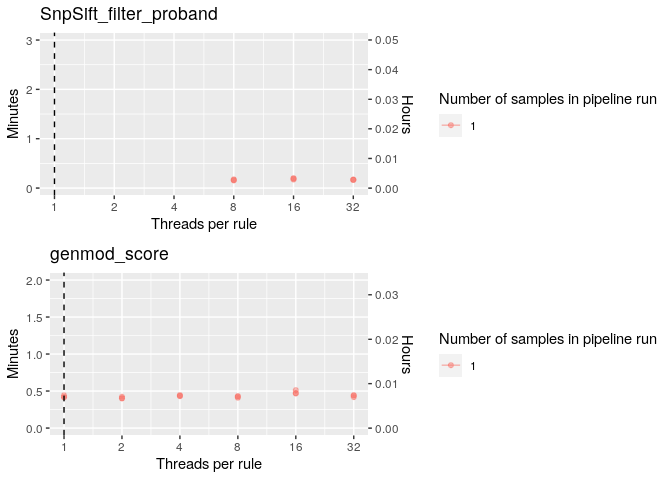
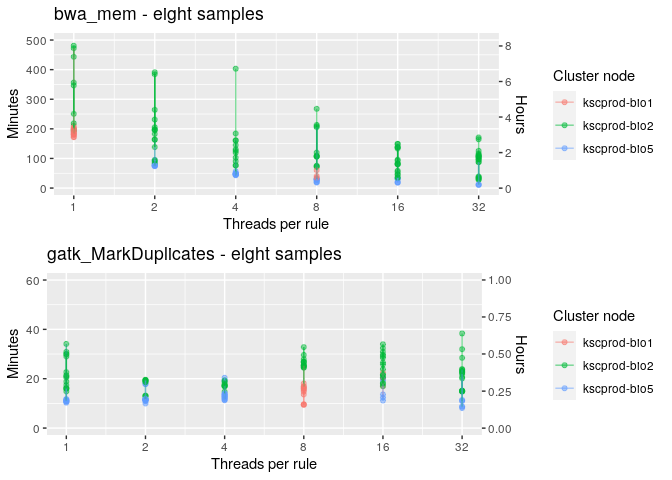

Benchmarking pipeline resources - per rule - production cluster
================
Leah Kemp
9/21/2020

## Context

This document aims to plot and analyse the results of resource
benchmarking tests for our genomic pipelines on the ESR cluster
(production). See related docs here: [resource benchmarking per rule
production
cluster](../resource_benchmarking_per_rule_production_cluster.md)

**Note. this document is incomplete**

## Find optimal threads for each rule (diminishing return in speed)

  - The dashed line indicates the threading level that will be set for
    each rule in the pipelines based on these tests - that will increase
    the pipeline speed, but not use resources inefficiently
  - Each point represents one sample
  - Samples/points from the same pipeline run are connected in each plot
    with a
line

### human\_genomics\_pipeline

<!-- --><!-- --><!-- --><!-- --><!-- -->

### vcf\_annotation\_pipeline

<!-- --><!-- --><!-- --><!-- --><!-- --><!-- --><!-- --><!-- -->

## Check runtimes against the cluster node the sample/rule was deployed to

*Note. node information was not available for all rules*

  - This was plotted only for pipelines running on eight samples, to
    account for sample
number

<!-- --><!-- --><!-- -->
