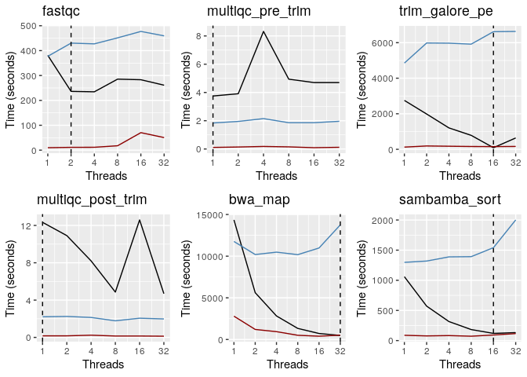
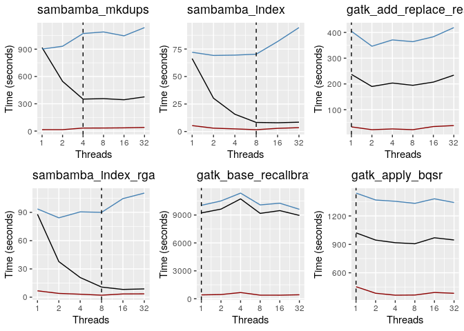
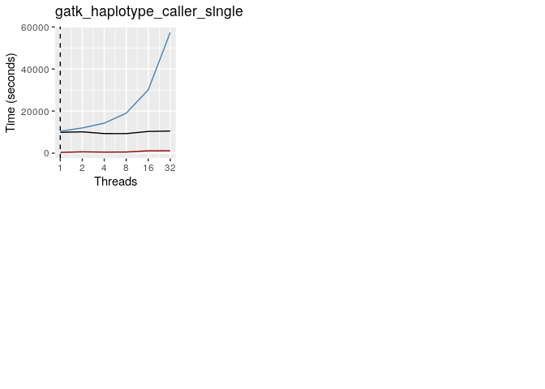

Resource benchmarking 2
================
Leah Kemp
12/06/2020

## Context

This document aims to plot and analyse the results of [resource
benchmarking tests for
human\_genomics\_pipeline](https://github.com/ESR-NZ/human_genomics_pipeline/tree/resource_benchmarking).
This document adresses the test resource\_bench2.

See related docs
    here:

  - [benchmarking\_pipelines\_resources](https://github.com/leahkemp/documentation/blob/master/benchmarking_pipelines_resources/benchmarking_pipelines_resources.md)

## Setup

``` r
library(vcfR)
library(ggplot2)
library(dplyr)
library(gridExtra)
library(openxlsx)
```

Read in data

``` r
data <- read.xlsx("resource_bench2_results.xlsx")
```

Extract by rule

``` r
fastqc_data <- data %>%
  dplyr::filter(rule == "fastqc")

multiqc_pre_trim_data <- data %>%
  dplyr::filter(rule == "multiqc_pre_trim")

trim_galore_pe_data <- data %>%
  dplyr::filter(rule == "trim_galore_pe")

multiqc_post_trim_data <- data %>%
  dplyr::filter(rule == "multiqc_post_trim")

bwa_map_data <- data %>%
  dplyr::filter(rule == "bwa_map")

sambamba_sort_data <- data %>%
  dplyr::filter(rule == "sambamba_sort")

sambamba_mkdups_data <- data %>%
  dplyr::filter(rule == "sambamba_mkdups")

sambamba_index_data <- data %>%
  dplyr::filter(rule == "sambamba_index")

gatk_add_replace_read_groups_data <- data %>%
  dplyr::filter(rule == "gatk_add_replace_read_groups")

sambamba_index_rgadd_data <- data %>%
  dplyr::filter(rule == "sambamba_index_rgadd")

gatk_base_recalibrator_data <- data %>%
  dplyr::filter(rule == "gatk_base_recalibrator")

gatk_apply_bqsr_data <- data %>%
  dplyr::filter(rule == "gatk_apply_bqsr")

gatk_haplotype_caller_single_data <- data %>%
  dplyr::filter(rule == "gatk_haplotype_caller_single")
```

## Find optimal threads for each rule

``` r
xlab = "Threads"
ylab = "Time (seconds)"

fastqc_plot <- ggplot2::ggplot(data = fastqc_data) +
  geom_line(aes(x = threads, y = elapsed_time)) +
  geom_line(aes(x = threads, y = user_time), color="steelblue") +
  geom_line(aes(x = threads, y = system_time), color="darkred") +
  labs(title = "fastqc", x = xlab, y = ylab) +
  scale_x_continuous(breaks=c(1, 2, 4, 8, 16, 32), limits=c(1, 32), trans='log10') +
  geom_vline(xintercept = 2, linetype = "dashed")

multiqc_pre_trim_plot <- ggplot2::ggplot(data = multiqc_pre_trim_data) +
  geom_line(aes(x = threads, y = elapsed_time)) +
  geom_line(aes(x = threads, y = user_time), color="steelblue") +
  geom_line(aes(x = threads, y = system_time), color="darkred") +
  labs(title = "multiqc_pre_trim", x = xlab, y = ylab) +
  scale_x_continuous(breaks=c(1, 2, 4, 8, 16, 32), limits=c(1, 32), trans='log10') +
  geom_vline(xintercept = 1, linetype = "dashed")

trim_galore_pe_plot <- ggplot2::ggplot(data = trim_galore_pe_data) +
  geom_line(aes(x = threads, y = elapsed_time)) +
  geom_line(aes(x = threads, y = user_time), color="steelblue") +
  geom_line(aes(x = threads, y = system_time), color="darkred") +
  labs(title = "trim_galore_pe", x = xlab, y = ylab) +
  scale_x_continuous(breaks=c(1, 2, 4, 8, 16, 32), limits=c(1, 32), trans='log10') +
  geom_vline(xintercept = 16, linetype = "dashed")

multiqc_post_trim_plot <- ggplot2::ggplot(data = multiqc_post_trim_data) +
  geom_line(aes(x = threads, y = elapsed_time)) +
  geom_line(aes(x = threads, y = user_time), color="steelblue") +
  geom_line(aes(x = threads, y = system_time), color="darkred") +
  labs(title = "multiqc_post_trim", x = xlab, y = ylab) +
  scale_x_continuous(breaks=c(1, 2, 4, 8, 16, 32), limits=c(1, 32), trans='log10') +
  geom_vline(xintercept = 1, linetype = "dashed")

bwa_map_plot <- ggplot2::ggplot(data = bwa_map_data) +
  geom_line(aes(x = threads, y = elapsed_time)) +
  geom_line(aes(x = threads, y = user_time), color="steelblue") +
  geom_line(aes(x = threads, y = system_time), color="darkred") +
  labs(title = "bwa_map", x = xlab, y = ylab) +
  scale_x_continuous(breaks=c(1, 2, 4, 8, 16, 32), limits=c(1, 32), trans='log10') +
  geom_vline(xintercept = 32, linetype = "dashed")

sambamba_sort_plot <- ggplot2::ggplot(data = sambamba_sort_data) +
  geom_line(aes(x = threads, y = elapsed_time)) +
  geom_line(aes(x = threads, y = user_time), color="steelblue") +
  geom_line(aes(x = threads, y = system_time), color="darkred") +
  labs(title = "sambamba_sort", x = xlab, y = ylab) +
  scale_x_continuous(breaks=c(1, 2, 4, 8, 16, 32), limits=c(1, 32), trans='log10') +
  geom_vline(xintercept = 16, linetype = "dashed")

sambamba_mkdups_plot <- ggplot2::ggplot(data = sambamba_mkdups_data) +
  geom_line(aes(x = threads, y = elapsed_time)) +
  geom_line(aes(x = threads, y = user_time), color="steelblue") +
  geom_line(aes(x = threads, y = system_time), color="darkred") +
  labs(title = "sambamba_mkdups", x = xlab, y = ylab) +
  scale_x_continuous(breaks=c(1, 2, 4, 8, 16, 32), limits=c(1, 32), trans='log10') +
  geom_vline(xintercept = 4, linetype = "dashed")

sambamba_index_plot <- ggplot2::ggplot(data = sambamba_index_data) +
  geom_line(aes(x = threads, y = elapsed_time)) +
  geom_line(aes(x = threads, y = user_time), color="steelblue") +
  geom_line(aes(x = threads, y = system_time), color="darkred") +
  labs(title = "sambamba_index", x = xlab, y = ylab) +
  scale_x_continuous(breaks=c(1, 2, 4, 8, 16, 32), limits=c(1, 32), trans='log10') +
  geom_vline(xintercept = 8, linetype = "dashed")

gatk_add_replace_read_groups_plot <- ggplot2::ggplot(data = gatk_add_replace_read_groups_data) +
  geom_line(aes(x = threads, y = elapsed_time)) +
  geom_line(aes(x = threads, y = user_time), color="steelblue") +
  geom_line(aes(x = threads, y = system_time), color="darkred") +
  labs(title = "gatk_add_replace_read_groups", x = xlab, y = ylab) +
  scale_x_continuous(breaks=c(1, 2, 4, 8, 16, 32), limits=c(1, 32), trans='log10') +
  geom_vline(xintercept = 1, linetype = "dashed")

sambamba_index_rgadd_plot <- ggplot2::ggplot(data = sambamba_index_rgadd_data) +
  geom_line(aes(x = threads, y = elapsed_time)) +
  geom_line(aes(x = threads, y = user_time), color="steelblue") +
  geom_line(aes(x = threads, y = system_time), color="darkred") +
  labs(title = "sambamba_index_rgadd", x = xlab, y = ylab) +
  scale_x_continuous(breaks=c(1, 2, 4, 8, 16, 32), limits=c(1, 32), trans='log10') +
  geom_vline(xintercept = 8, linetype = "dashed")

gatk_base_recalibrator_plot <- ggplot2::ggplot(data = gatk_base_recalibrator_data) +
  geom_line(aes(x = threads, y = elapsed_time)) +
  geom_line(aes(x = threads, y = user_time), color="steelblue") +
  geom_line(aes(x = threads, y = system_time), color="darkred") +
  labs(title = "gatk_base_recalibrator", x = xlab, y = ylab) +
  scale_x_continuous(breaks=c(1, 2, 4, 8, 16, 32), limits=c(1, 32), trans='log10') +
  geom_vline(xintercept = 1, linetype = "dashed")

gatk_apply_bqsr_plot <- ggplot2::ggplot(data = gatk_apply_bqsr_data) +
  geom_line(aes(x = threads, y = elapsed_time)) +
  geom_line(aes(x = threads, y = user_time), color="steelblue") +
  geom_line(aes(x = threads, y = system_time), color="darkred") +
  labs(title = "gatk_apply_bqsr", x = xlab, y = ylab) +
  scale_x_continuous(breaks=c(1, 2, 4, 8, 16, 32), limits=c(1, 32), trans='log10') +
  geom_vline(xintercept = 1, linetype = "dashed")

gatk_haplotype_caller_single_plot <- ggplot2::ggplot(data = gatk_haplotype_caller_single_data) +
  geom_line(aes(x = threads, y = elapsed_time)) +
  geom_line(aes(x = threads, y = user_time), color="steelblue") +
  geom_line(aes(x = threads, y = system_time), color="darkred") +
  labs(title = "gatk_haplotype_caller_single", x = xlab, y = ylab) +
  scale_x_continuous(breaks=c(1, 2, 4, 8, 16, 32), limits=c(1, 32), trans='log10') +
  geom_vline(xintercept = 1, linetype = "dashed")

grid.arrange(fastqc_plot, 
             multiqc_pre_trim_plot, 
             trim_galore_pe_plot, 
             multiqc_post_trim_plot, 
             bwa_map_plot,
             sambamba_sort_plot,
             ncol = 3, nrow = 2)
```

<!-- -->

``` r
grid.arrange(sambamba_mkdups_plot,
             sambamba_index_plot,
             gatk_add_replace_read_groups_plot,
             sambamba_index_rgadd_plot, 
             gatk_base_recalibrator_plot, 
             gatk_apply_bqsr_plot,
             ncol = 3, nrow = 2)
```

<!-- -->

``` r
grid.arrange(gatk_haplotype_caller_single_plot,
             ncol = 3, nrow = 2)
```

<!-- -->
