Benchmarking genomic pipelines - resources - wintermute - per rule
runtime
================
Leah Kemp
9/15/2020

## Context

This document aims to plot and analyse the results of resource
benchmarking tests for our genomic pipelines on a single research server
(Wintermute). See related docs here:
[benchmarking\_pipelines\_resources](../benchmarking_pipeline_resources_wintermute_per_rule_runtime.md)

## Threading

### Find optimal threads for each rule (diminishing return in speed)

#### human\_genomics\_pipeline

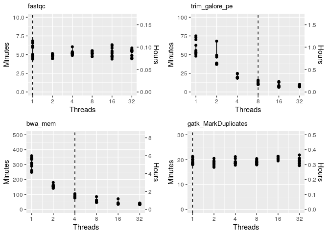<!-- -->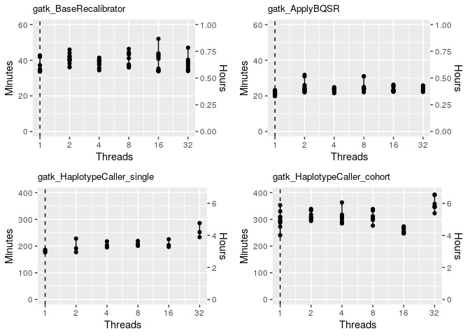<!-- -->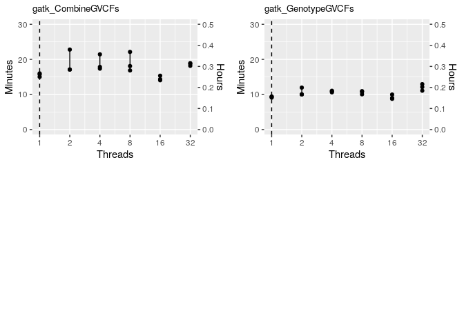<!-- -->

#### vcf\_annotation\_pipeline

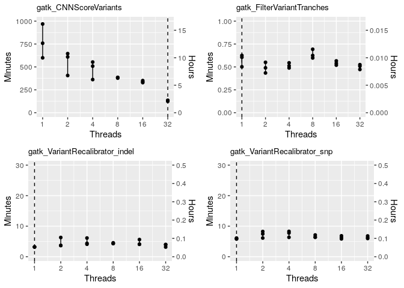<!-- -->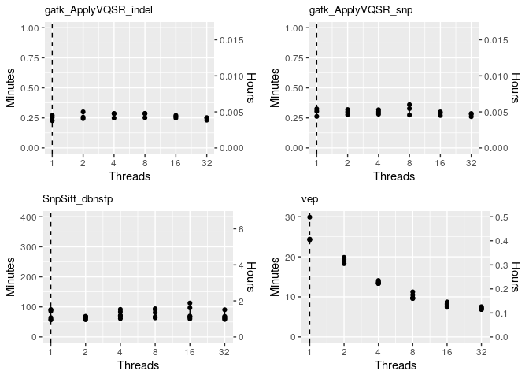<!-- -->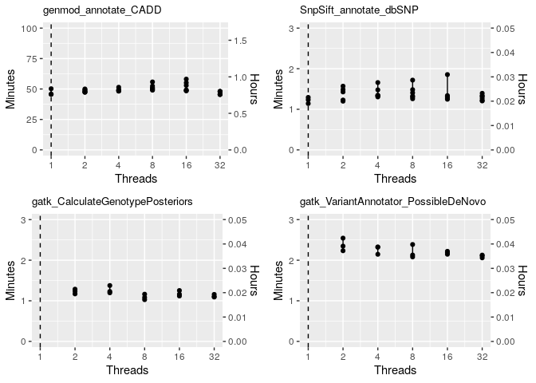<!-- -->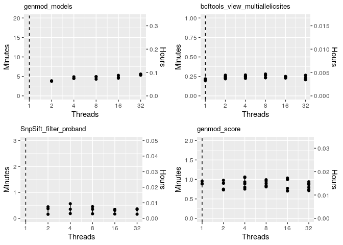<!-- -->

### Find maximum memory usage for each rule (max USS)

#### human\_genomics\_pipeline

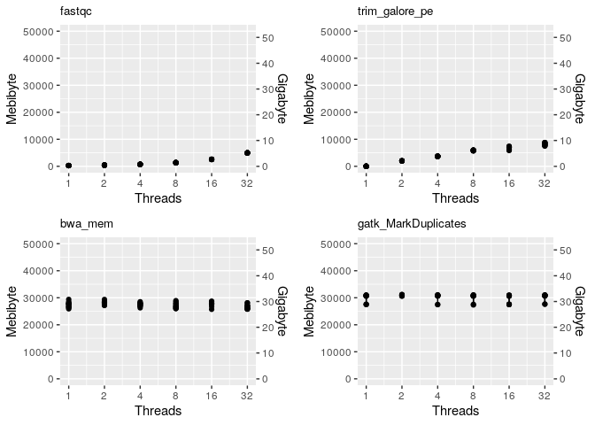<!-- -->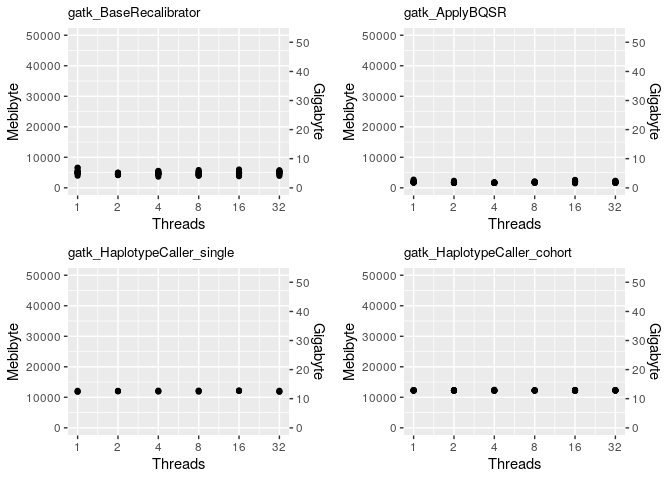<!-- -->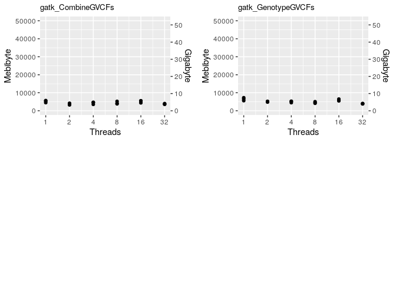<!-- -->

#### vcf\_annotation\_pipeline

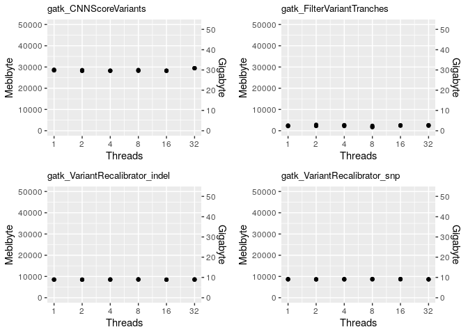<!-- -->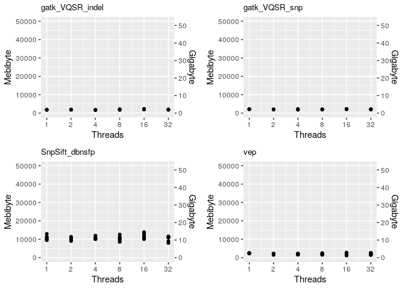<!-- -->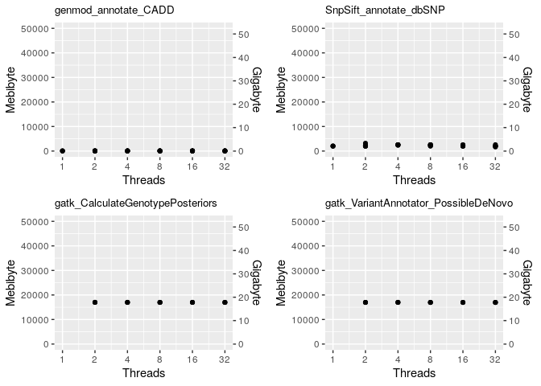<!-- -->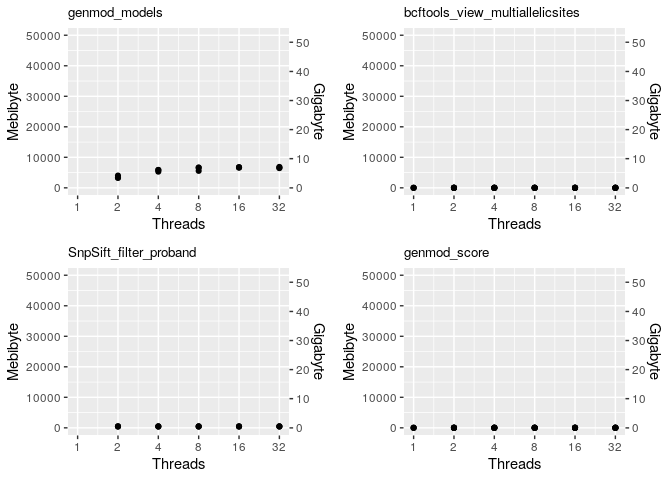<!-- -->
